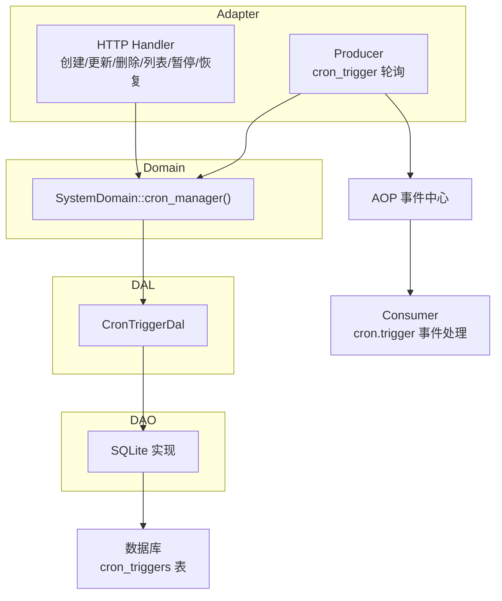
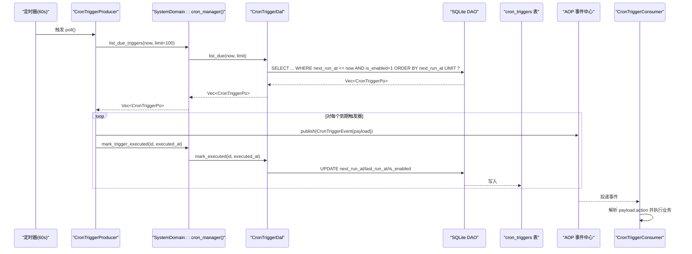
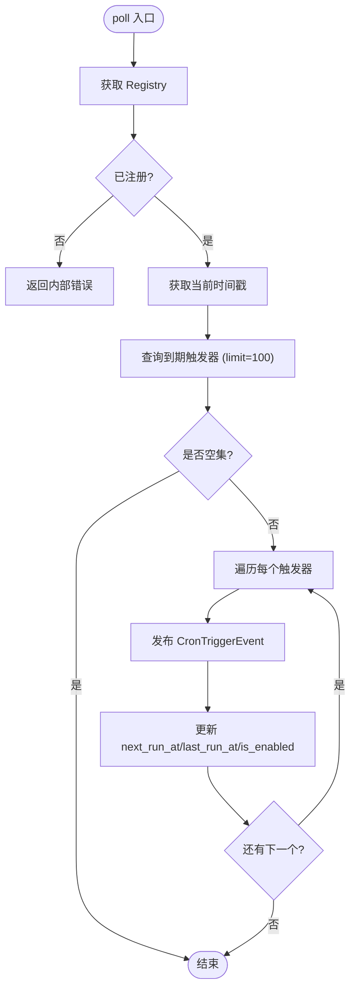
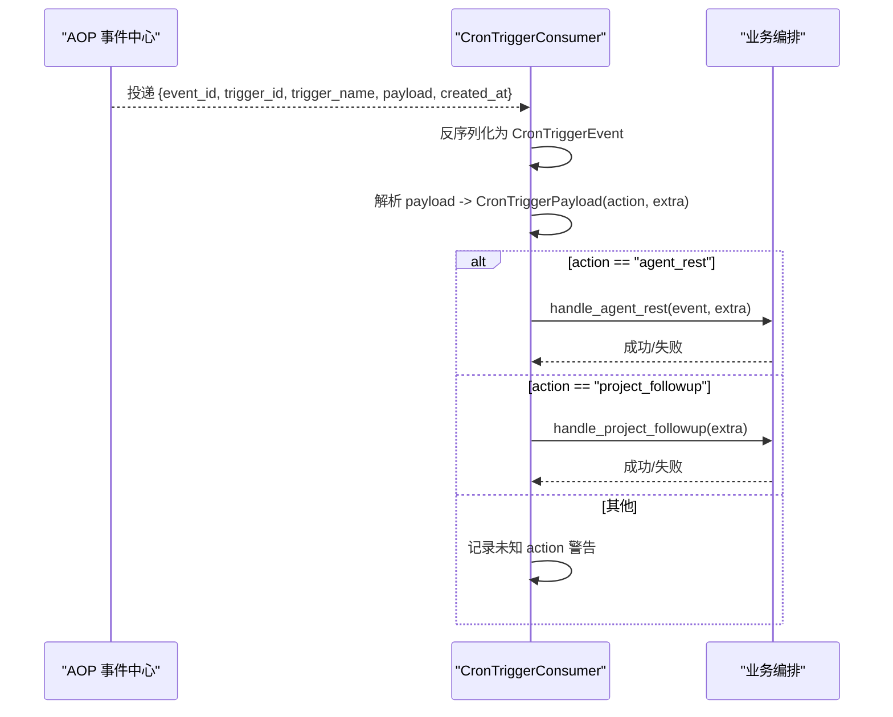
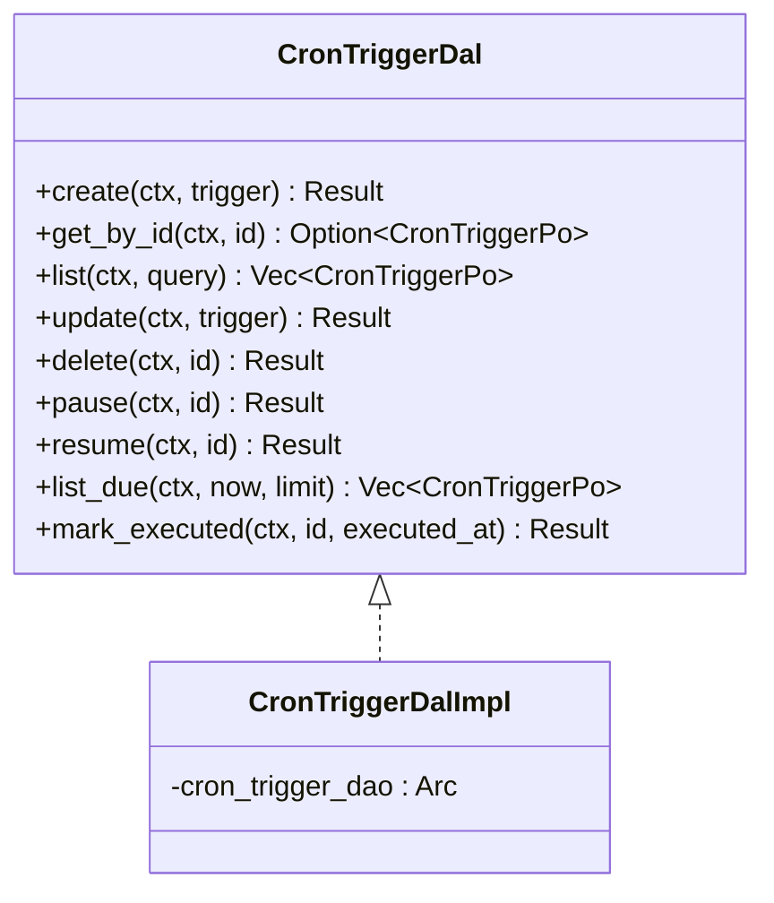
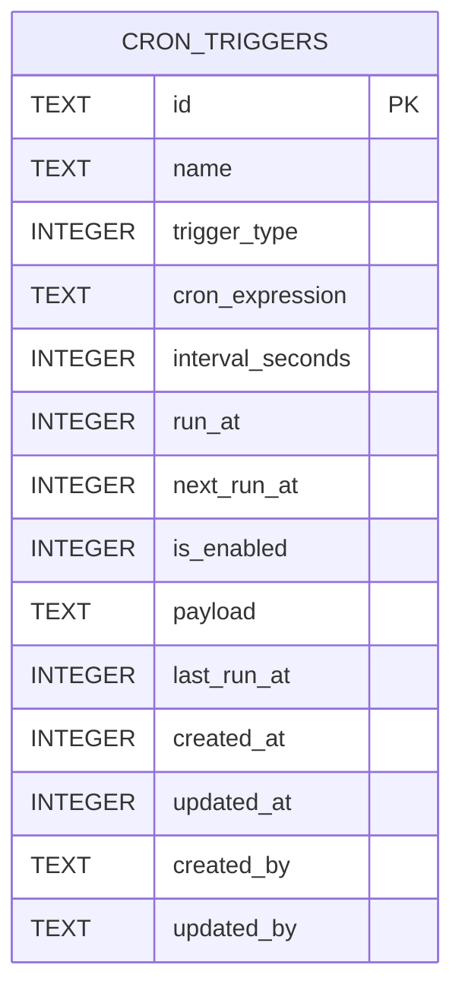
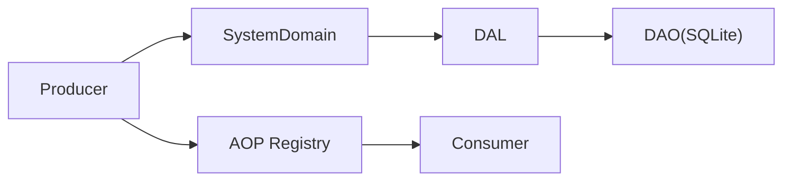

# 定时触发生产者

<cite>
**本文引用的文件**
- [src/producer/cron_trigger.rs](src/producer/cron_trigger.rs)
- [src/consumer/scheduler.rs](src/consumer/scheduler.rs)
- [common/src/api/cron_trigger.rs](common/src/api/cron_trigger.rs)
- [common/src/enums/cron_trigger.rs](common/src/enums/cron_trigger.rs)
- [src/models/cron_trigger.rs](src/models/cron_trigger.rs)
- [src/models/events/cron_trigger.rs](src/models/events/cron_trigger.rs)
- [src/service/dal/cron_trigger.rs](src/service/dal/cron_trigger.rs)
- [src/service/dao/cron_trigger/sqlite.rs](src/service/dao/cron_trigger/sqlite.rs)
- [migrations/20260711000000_cron_triggers.sql](migrations/20260711000000_cron_triggers.sql)
- [src/handlers/system/cron_trigger/create_cron_trigger.rs](src/handlers/system/cron_trigger/create_cron_trigger.rs)
- [src/handlers/system/cron_trigger/update_cron_trigger.rs](src/handlers/system/cron_trigger/update_cron_trigger.rs)
- [src/handlers/system/cron_trigger/delete_cron_trigger.rs](src/handlers/system/cron_trigger/delete_cron_trigger.rs)
- [src/handlers/system/cron_trigger/list_cron_triggers.rs](src/handlers/system/cron_trigger/list_cron_triggers.rs)
- [src/handlers/system/cron_trigger/get_cron_trigger.rs](src/handlers/system/cron_trigger/get_cron_trigger.rs)
- [src/handlers/system/cron_trigger/pause_cron_trigger.rs](src/handlers/system/cron_trigger/pause_cron_trigger.rs)
- [src/handlers/system/cron_trigger/resume_cron_trigger.rs](src/handlers/system/cron_trigger/resume_cron_trigger.rs)
- [src/service/domain/system/mod.rs](src/service/domain/system/mod.rs)
</cite>

## 目录
1. [简介](#简介)
2. [项目结构](#项目结构)
3. [核心组件](#核心组件)
4. [架构总览](#架构总览)
5. [详细组件分析](#详细组件分析)
6. [依赖关系分析](#依赖关系分析)
7. [性能与并发](#性能与并发)
8. [故障排查](#故障排查)
9. [结论](#结论)
10. [附录：API 与数据模型](#附录api-与数据模型)

## 简介
本模块实现“定时触发生产者”，基于 cron 表达式（当前阶段 Cron 类型尚未启用）和固定间隔、一次性触发三种模式，完成定时任务的注册、调度与状态管理。系统通过 AOP 事件中心解耦生产与消费：生产者周期性扫描到期任务并产出事件，消费者按 payload.action 分发到具体业务处理（如 agent_rest、project_followup）。

## 项目结构
围绕定时触发器，代码遵循四层单向调用：Adapter（HTTP Handler / AOP Producer）→ Domain → DAL → DAO。关键文件分布如下：
- Adapter 层：HTTP Handler（CRUD）、AOP Producer（定时轮询）
- Domain 层：系统域提供 CronManager 接口
- DAL 层：CronTriggerDal 封装业务语义（暂停/恢复/计算下次执行时间等）
- DAO 层：SQLite 实现，负责 SQL 查询与更新
- 数据模型：Po、Event、DTO、枚举

图表来源
- [src/producer/cron_trigger.rs:26-87](src/producer/cron_trigger.rs#L26-L87)
- [src/consumer/scheduler.rs:39-95](src/consumer/scheduler.rs#L39-L95)
- [src/service/domain/system/mod.rs:26-46](src/service/domain/system/mod.rs#L26-L46)
- [src/service/dal/cron_trigger.rs:37-74](src/service/dal/cron_trigger.rs#L37-L74)
- [src/service/dao/cron_trigger/sqlite.rs:35-213](src/service/dao/cron_trigger/sqlite.rs#L35-L213)
- [migrations/20260711000000_cron_triggers.sql:4-24](migrations/20260711000000_cron_triggers.sql#L4-L24)

章节来源
- [src/producer/cron_trigger.rs:26-87](src/producer/cron_trigger.rs#L26-L87)
- [src/consumer/scheduler.rs:39-95](src/consumer/scheduler.rs#L39-L95)
- [src/service/domain/system/mod.rs:26-46](src/service/domain/system/mod.rs#L26-L46)
- [src/service/dal/cron_trigger.rs:37-74](src/service/dal/cron_trigger.rs#L37-L74)
- [src/service/dao/cron_trigger/sqlite.rs:35-213](src/service/dao/cron_trigger/sqlite.rs#L35-L213)
- [migrations/20260711000000_cron_triggers.sql:4-24](migrations/20260711000000_cron_triggers.sql#L4-L24)

## 核心组件
- CronTriggerProducer：每 60 秒轮询一次，查询到期触发器，发布事件并更新状态。
- CronTriggerConsumer：订阅 cron.trigger 事件，根据 payload.action 路由到不同业务逻辑。
- CronTriggerDal/DAL 实现：封装暂停/恢复、计算下次执行时间、批量查询到期任务等。
- SQLite DAO：持久化 CRUD、到期任务查询、next_run_at 更新。
- HTTP Handlers：暴露 REST API 用于创建、更新、删除、查询、暂停、恢复触发器。
- 数据模型与枚举：TriggerType（Once/Cron/Interval）、CronTriggerPo、CronTriggerEvent、API DTO。

章节来源
- [src/producer/cron_trigger.rs:26-87](src/producer/cron_trigger.rs#L26-L87)
- [src/consumer/scheduler.rs:39-95](src/consumer/scheduler.rs#L39-L95)
- [src/service/dal/cron_trigger.rs:37-74](src/service/dal/cron_trigger.rs#L37-L74)
- [src/service/dao/cron_trigger/sqlite.rs:35-213](src/service/dao/cron_trigger/sqlite.rs#L35-L213)
- [common/src/api/cron_trigger.rs:8-104](common/src/api/cron_trigger.rs#L8-L104)
- [common/src/enums/cron_trigger.rs:9-46](common/src/enums/cron_trigger.rs#L9-L46)
- [src/models/cron_trigger.rs:10-65](src/models/cron_trigger.rs#L10-L65)
- [src/models/events/cron_trigger.rs:4-29](src/models/events/cron_trigger.rs#L4-L29)

## 架构总览
整体流程分为两条主线：
- 调度主线：Producer 周期轮询 → 查询到期任务 → 发布事件 → 更新 next_run_at/last_run_at/is_enabled
- 消费主线：Consumer 接收事件 → 解析 payload → 路由到具体业务（agent_rest/project_followup）

图表来源
- [src/producer/cron_trigger.rs:38-87](src/producer/cron_trigger.rs#L38-L87)
- [src/service/dal/cron_trigger.rs:131-176](src/service/dal/cron_trigger.rs#L131-L176)
- [src/service/dao/cron_trigger/sqlite.rs:166-213](src/service/dao/cron_trigger/sqlite.rs#L166-L213)
- [src/consumer/scheduler.rs:53-95](src/consumer/scheduler.rs#L53-L95)

## 详细组件分析

### 生产者：CronTriggerProducer
- 轮询间隔：60 秒
- 工作流：
  - 获取系统上下文与当前时间戳
  - 调用 domain.list_due_triggers(now, 100) 获取到期任务
  - 为每个任务构造 CronTriggerEvent 并发布到事件中心
  - 立即调用 domain.mark_trigger_executed 更新状态（避免重复触发）
- 错误处理：未注册 Registry 时返回内部错误；事件发布失败会中断后续处理（需结合上层重试策略）

图表来源
- [src/producer/cron_trigger.rs:38-87](src/producer/cron_trigger.rs#L38-L87)

章节来源
- [src/producer/cron_trigger.rs:26-87](src/producer/cron_trigger.rs#L26-L87)

### 消费者：CronTriggerConsumer
- 订阅事件：cron.trigger
- 消费模式：同步（ConsumeMode::Sync），事件发布时直接调用 on_event
- 路由逻辑：
  - action = "agent_rest"：加载 Agent 并执行记忆沉淀（复用 settle_memory 的 load_and_settle）
  - action = "project_followup"：扫描进行中且有 Owner Agent 的项目，向 Owner Agent 发送跟进通知
- 健壮性：未知 action 记录警告日志；payload 解析失败返回错误

图表来源
- [src/consumer/scheduler.rs:39-95](src/consumer/scheduler.rs#L39-L95)
- [src/consumer/scheduler.rs:99-195](src/consumer/scheduler.rs#L99-L195)

章节来源
- [src/consumer/scheduler.rs:39-95](src/consumer/scheduler.rs#L39-L95)
- [src/consumer/scheduler.rs:99-195](src/consumer/scheduler.rs#L99-L195)

### DAL：CronTriggerDal
- 职责：封装业务语义，包括暂停/恢复、计算下次执行时间、批量查询到期任务
- 关键方法：
  - pause/resume：读取 Po，修改 is_enabled，调用 touch 更新审计字段
  - mark_executed：根据 TriggerType 决定行为
    - Once：禁用并记录 last_run_at
    - Interval：根据 interval_seconds 计算下一次执行时间
    - Cron：当前未实现，返回不支持操作错误
  - list_due：委托 DAO 查询 next_run_at <= now 且启用的任务

图表来源
- [src/service/dal/cron_trigger.rs:37-74](src/service/dal/cron_trigger.rs#L37-L74)
- [src/service/dal/cron_trigger.rs:78-176](src/service/dal/cron_trigger.rs#L78-L176)

章节来源
- [src/service/dal/cron_trigger.rs:37-74](src/service/dal/cron_trigger.rs#L37-L74)
- [src/service/dal/cron_trigger.rs:78-176](src/service/dal/cron_trigger.rs#L78-L176)

### DAO：SQLite 实现
- 表结构：cron_triggers（id/name/trigger_type/cron_expression/interval_seconds/run_at/next_run_at/is_enabled/payload/last_run_at/created_at/updated_at/created_by/updated_by）
- 索引：next_run_at、is_enabled、trigger_type、created_at DESC
- 关键查询：
  - list_due：WHERE next_run_at <= now AND is_enabled = 1 ORDER BY next_run_at ASC LIMIT ?
  - update_next_run_at：更新 next_run_at、last_run_at、updated_at、updated_by
  - delete：软删除（设置 is_enabled = 0）

图表来源
- [migrations/20260711000000_cron_triggers.sql:4-24](migrations/20260711000000_cron_triggers.sql#L4-L24)

章节来源
- [src/service/dao/cron_trigger/sqlite.rs:35-213](src/service/dao/cron_trigger/sqlite.rs#L35-L213)
- [migrations/20260711000000_cron_triggers.sql:4-24](migrations/20260711000000_cron_triggers.sql#L4-L24)

### HTTP 处理器（Adapter）
- 创建：POST /api/v1/system/cron-triggers
  - 校验必填字段（Once 需要 run_at，Interval 需要 interval_seconds）
  - 计算 next_run_at（Cron 类型当前返回不支持）
  - 调用 domain.create_trigger 并返回详情
- 更新：PUT /api/v1/system/cron-triggers/{trigger_id}
  - 部分更新 name/type/cron_expression/interval_seconds/run_at/payload
  - 调用 touch 更新审计字段后持久化
- 删除：软删除（设置 is_enabled = 0）
- 列表：GET /api/v1/system/cron-triggers
  - 支持按 trigger_type、is_enabled、limit 过滤
- 详情：GET /api/v1/system/cron-triggers/{trigger_id}
- 暂停/恢复：分别将 is_enabled 置 0/1 并更新审计字段

章节来源
- [src/handlers/system/cron_trigger/create_cron_trigger.rs:14-67](src/handlers/system/cron_trigger/create_cron_trigger.rs#L14-L67)
- [src/handlers/system/cron_trigger/update_cron_trigger.rs:11-57](src/handlers/system/cron_trigger/update_cron_trigger.rs#L11-L57)
- [src/handlers/system/cron_trigger/delete_cron_trigger.rs:1-50](src/handlers/system/cron_trigger/delete_cron_trigger.rs#L1-L50)
- [src/handlers/system/cron_trigger/list_cron_triggers.rs:12-30](src/handlers/system/cron_trigger/list_cron_triggers.rs#L12-L30)
- [src/handlers/system/cron_trigger/get_cron_trigger.rs:11-25](src/handlers/system/cron_trigger/get_cron_trigger.rs#L11-L25)
- [src/handlers/system/cron_trigger/pause_cron_trigger.rs:1-50](src/handlers/system/cron_trigger/pause_cron_trigger.rs#L1-L50)
- [src/handlers/system/cron_trigger/resume_cron_trigger.rs:1-50](src/handlers/system/cron_trigger/resume_cron_trigger.rs#L1-L50)

### 初始化与基础数据
- 两阶段初始化：
  - 同步 init：注册单例与 AOP producer/consumer
  - 异步 init_base_data：幂等注入系统级 cron triggers（例如 agent_rest 每 4h、project_followup 每 1h）
- 系统域暴露 cron_manager 供外部使用

章节来源
- [src/service/domain/system/mod.rs:26-46](src/service/domain/system/mod.rs#L26-L46)

## 依赖关系分析
- 耦合与内聚：
  - Producer 仅依赖 SystemDomain::cron_manager，不感知具体存储实现
  - DAL 聚合 DAO 能力，对外提供业务语义接口
  - Consumer 与 AOP 框架解耦，只关注事件结构与业务编排
- 外部依赖：
  - sqlx 用于 SQLite 查询
  - uuid 生成 ID
  - serde/serde_json 用于序列化
- 潜在循环依赖：无（单向调用链清晰）

图表来源
- [src/producer/cron_trigger.rs:26-87](src/producer/cron_trigger.rs#L26-L87)
- [src/consumer/scheduler.rs:39-95](src/consumer/scheduler.rs#L39-L95)
- [src/service/dal/cron_trigger.rs:37-74](src/service/dal/cron_trigger.rs#L37-L74)
- [src/service/dao/cron_trigger/sqlite.rs:35-213](src/service/dao/cron_trigger/sqlite.rs#L35-L213)

章节来源
- [src/producer/cron_trigger.rs:26-87](src/producer/cron_trigger.rs#L26-L87)
- [src/consumer/scheduler.rs:39-95](src/consumer/scheduler.rs#L39-L95)
- [src/service/dal/cron_trigger.rs:37-74](src/service/dal/cron_trigger.rs#L37-L74)
- [src/service/dao/cron_trigger/sqlite.rs:35-213](src/service/dao/cron_trigger/sqlite.rs#L35-L213)

## 性能与并发
- 轮询频率：60 秒，适合低频系统任务；可根据负载调整
- 批处理：每次最多拉取 100 条到期任务，降低单次 IO 压力
- 索引优化：
  - next_run_at 索引加速到期任务筛选
  - is_enabled 索引减少无效扫描
  - trigger_type 索引便于分类统计
  - created_at DESC 索引优化列表排序
- 并发控制：
  - Producer 串行处理每个触发器（for 循环内顺序发布与更新）
  - Consumer 同步消费，保证同一事件顺序处理
- 建议：
  - 若任务量增长，可考虑分片或分区查询（如按 created_at 范围）
  - 增加监控指标：轮询耗时、事件发布成功率、消费者处理耗时
  - 对高延迟业务（如 agent_rest）可引入异步队列或限流

[本节为通用指导，无需特定文件引用]

## 故障排查
- 常见错误与定位：
  - Registry 未注册：Producer 返回内部错误，检查启动流程是否正确注册 AOP 组件
  - 无法解析 payload：Consumer 返回 bad_request，检查触发器 payload 格式是否符合预期
  - 未知 action：记录警告日志，确认 action 是否在消费者中实现
  - Cron 类型不支持：创建或执行时返回不支持操作错误，需等待后续实现
- 日志关键字：
  - “received cron trigger event”、“cron trigger fired”、“unknown action”
- 数据一致性：
  - 若 next_run_at 未更新导致重复触发，检查 mark_trigger_executed 是否被调用及 DAO 更新是否成功
  - 软删除后仍出现在列表：确认 is_enabled 是否被正确设置为 0

章节来源
- [src/producer/cron_trigger.rs:48-50](src/producer/cron_trigger.rs#L48-L50)
- [src/consumer/scheduler.rs:53-95](src/consumer/scheduler.rs#L53-L95)
- [src/service/dal/cron_trigger.rs:168-173](src/service/dal/cron_trigger.rs#L168-L173)
- [src/service/dao/cron_trigger/sqlite.rs:149-163](src/service/dao/cron_trigger/sqlite.rs#L149-L163)

## 结论
当前定时触发生产者实现了基于 next_run_at 的简单调度机制，支持一次性与固定间隔触发，并通过 AOP 事件中心解耦生产与消费。Cron 表达式解析与调度尚未实现，但数据结构与接口已预留。建议在后续版本中：
- 实现 Cron 表达式解析与下次执行时间计算
- 增强消费者重试与死信队列机制
- 完善监控与告警（轮询耗时、事件积压、消费者失败率）
- 扩展更多内置 action（如 webhook、消息推送等）

[本节为总结，无需特定文件引用]

## 附录：API 与数据模型

### API 概览
- 创建触发器：POST /api/v1/system/cron-triggers
  - 请求体：CreateCronTriggerRequest（name、trigger_type、cron_expression、interval_seconds、run_at、payload）
  - 响应：CreateCronTriggerResponse（CronTriggerDetail）
- 更新触发器：PUT /api/v1/system/cron-triggers/{trigger_id}
  - 请求体：UpdateCronTriggerRequest（可选字段）
  - 响应：UpdateCronTriggerResponse（CronTriggerDetail）
- 删除触发器：DELETE /api/v1/system/cron-triggers/{trigger_id}
  - 响应：DeleteCronTriggerResponse（success）
- 列表触发器：GET /api/v1/system/cron-triggers
  - 查询参数：trigger_type、is_enabled、limit
  - 响应：ListCronTriggersResponse（triggers、total）
- 详情触发器：GET /api/v1/system/cron-triggers/{trigger_id}
  - 响应：GetCronTriggerResponse（CronTriggerDetail）
- 暂停/恢复：对应端点将 is_enabled 置 0/1

章节来源
- [common/src/api/cron_trigger.rs:8-104](common/src/api/cron_trigger.rs#L8-L104)
- [src/handlers/system/cron_trigger/create_cron_trigger.rs:14-67](src/handlers/system/cron_trigger/create_cron_trigger.rs#L14-L67)
- [src/handlers/system/cron_trigger/update_cron_trigger.rs:11-57](src/handlers/system/cron_trigger/update_cron_trigger.rs#L11-L57)
- [src/handlers/system/cron_trigger/delete_cron_trigger.rs:1-50](src/handlers/system/cron_trigger/delete_cron_trigger.rs#L1-L50)
- [src/handlers/system/cron_trigger/list_cron_triggers.rs:12-30](src/handlers/system/cron_trigger/list_cron_triggers.rs#L12-L30)
- [src/handlers/system/cron_trigger/get_cron_trigger.rs:11-25](src/handlers/system/cron_trigger/get_cron_trigger.rs#L11-L25)
- [src/handlers/system/cron_trigger/pause_cron_trigger.rs:1-50](src/handlers/system/cron_trigger/pause_cron_trigger.rs#L1-L50)
- [src/handlers/system/cron_trigger/resume_cron_trigger.rs:1-50](src/handlers/system/cron_trigger/resume_cron_trigger.rs#L1-L50)

### 数据模型
- TriggerType：Once（一次性）、Cron（表达式，当前不可用）、Interval（固定间隔）
- CronTriggerPo：持久化对象，包含触发规则与执行状态
- CronTriggerEvent：事件对象，携带 trigger_id、trigger_name、payload、created_at
- API DTO：Create/Update/List/Get/Delete 相关结构

章节来源
- [common/src/enums/cron_trigger.rs:9-46](common/src/enums/cron_trigger.rs#L9-L46)
- [src/models/cron_trigger.rs:10-65](src/models/cron_trigger.rs#L10-L65)
- [src/models/events/cron_trigger.rs:4-29](src/models/events/cron_trigger.rs#L4-L29)
- [common/src/api/cron_trigger.rs:8-104](common/src/api/cron_trigger.rs#L8-L104)