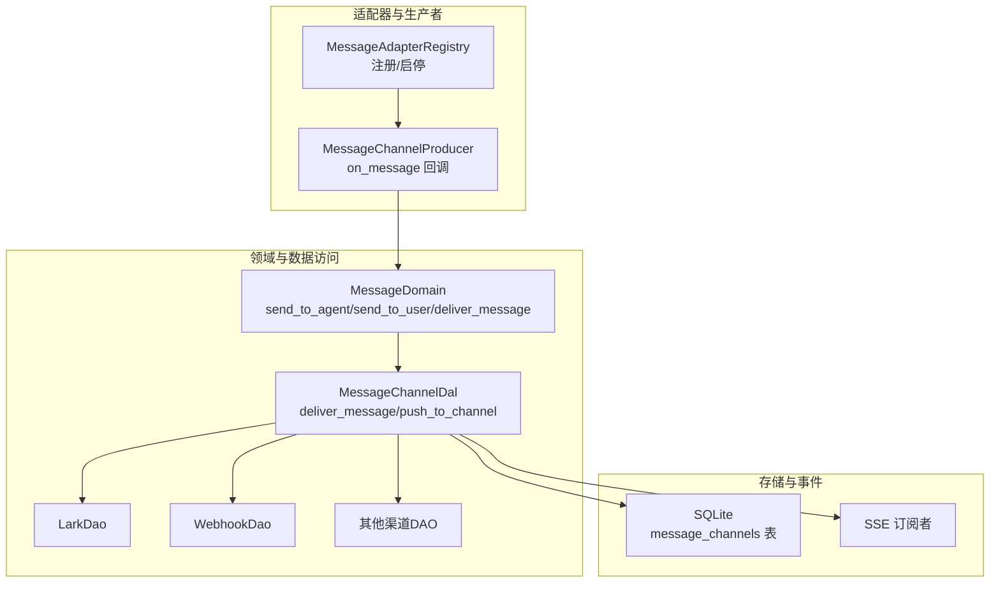
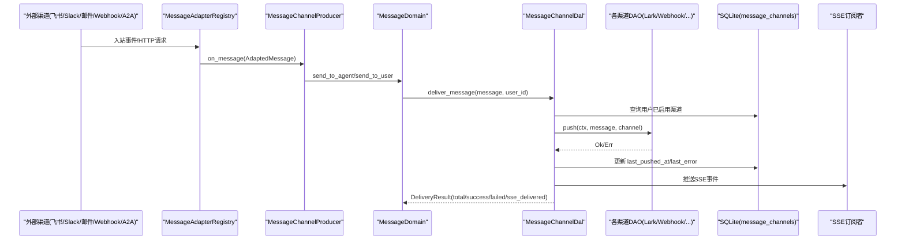
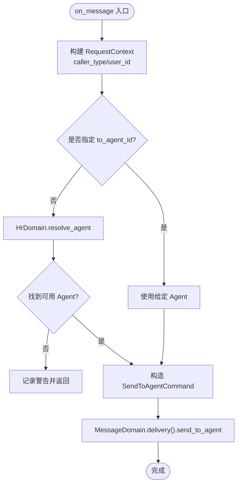
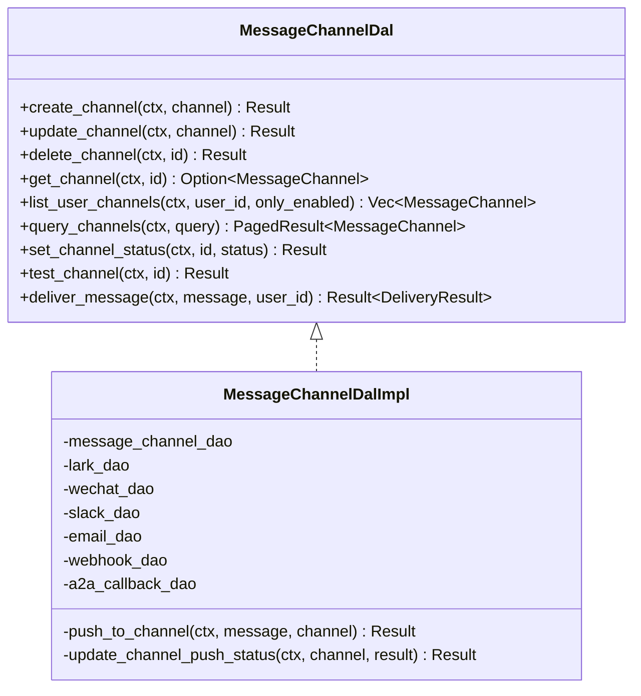
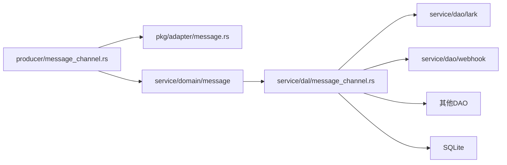

# 消息通道生产者

<cite>
**本文引用的文件**
- [src/producer/message_channel.rs](src/producer/message_channel.rs)
- [src/pkg/adapter/message.rs](src/pkg/adapter/message.rs)
- [common/src/enums/message_channel.rs](common/src/enums/message_channel.rs)
- [src/models/message_channel.rs](src/models/message_channel.rs)
- [src/service/dal/message_channel.rs](src/service/dal/message_channel.rs)
- [src/service/dao/lark/mod.rs](src/service/dao/lark/mod.rs)
- [src/service/dao/webhook/mod.rs](src/service/dao/webhook/mod.rs)
- [tests/integration/message_delivery_test.rs](tests/integration/message_delivery_test.rs)
- [docs/message_channel_design.md](docs/message_channel_design.md)
</cite>

## 目录
1. [简介](#简介)
2. [项目结构](#项目结构)
3. [核心组件](#核心组件)
4. [架构总览](#架构总览)
5. [详细组件分析](#详细组件分析)
6. [依赖关系分析](#依赖关系分析)
7. [性能与并发特性](#性能与并发特性)
8. [故障诊断指南](#故障诊断指南)
9. [结论](#结论)
10. [附录：配置与扩展开发](#附录：配置与扩展开发)

## 简介
本文件面向“消息通道生产者”的完整说明，覆盖多渠道消息发送机制（路由、渠道适配、批量处理）、支持的渠道类型（HTTP/Webhook、WebSocket/SSE、A2A回调等）、连接管理、消息持久化、优先级与重试策略、错误处理与监控指标，以及渠道配置、扩展开发与故障诊断。文档严格遵循四层单向调用规范：Adapter（HTTP Handler / 公开回调 Handler / AOP Producer）→ Domain → DAL → DAO，禁止跨层调用与同层互调。

## 项目结构
围绕消息通道生产者的关键代码分布在以下位置：
- 入站适配器注册中心与生命周期管理：`src/pkg/adapter/message.rs`
- 生产者实现（将外部消息统一投递到内部 MessageDomain）：`src/producer/message_channel.rs`
- 渠道枚举与状态：`common/src/enums/message_channel.rs`
- 渠道实体与配置：`src/models/message_channel.rs`
- 渠道DAL（统一整合配置管理与消息分发）：`src/service/dal/message_channel.rs`
- 各渠道DAO（如飞书、Webhook等）：`src/service/dao/lark/mod.rs`、`src/service/dao/webhook/mod.rs`
- 集成测试（SSE推送、Webhook投递、边界场景）：`tests/integration/message_delivery_test.rs`
- 设计文档（分层、枚举、DAL/DAL职责、反模式）：`docs/message_channel_design.md`

**图表来源**
- [src/pkg/adapter/message.rs:73-180](src/pkg/adapter/message.rs#L73-L180)
- [src/producer/message_channel.rs:11-109](src/producer/message_channel.rs#L11-L109)
- [src/service/dal/message_channel.rs:128-336](src/service/dal/message_channel.rs#L128-L336)

**章节来源**
- [src/producer/message_channel.rs:11-109](src/producer/message_channel.rs#L11-L109)
- [src/pkg/adapter/message.rs:73-180](src/pkg/adapter/message.rs#L73-L180)
- [src/service/dal/message_channel.rs:128-336](src/service/dal/message_channel.rs#L128-L336)

## 核心组件
- 消息入站适配器注册中心：负责按渠道类型注册、启动/停止所有适配器，并将适配后的消息通过回调投递给生产者。
- 消息通道生产者：接收适配器回调，构造 RequestContext，解析目标 Agent（可路由），调用 MessageDomain 进行消息入库与后续分发。
- 渠道DAL：统一封装渠道配置CRUD与消息分发；内部以纯 match 分发到各渠道DAO；记录成功/失败并更新渠道状态。
- 渠道DAO：具体渠道的出站推送与连接测试（如 LarkDao、WebhookDao）。
- 渠道枚举与状态：定义 ChannelType（Lark、Wechat、Slack、Email、Webhook、A2aCallback）与 ChannelStatus（Active/Disabled/Deleted）。
- 渠道实体与配置：MessageChannelPo 与 ChannelConfig，承载渠道元数据与扩展配置。

**章节来源**
- [common/src/enums/message_channel.rs:9-121](common/src/enums/message_channel.rs#L9-L121)
- [src/models/message_channel.rs:19-255](src/models/message_channel.rs#L19-L255)
- [src/service/dal/message_channel.rs:62-126](src/service/dal/message_channel.rs#L62-L126)
- [src/service/dao/lark/mod.rs:42-82](src/service/dao/lark/mod.rs#L42-L82)
- [src/service/dao/webhook/mod.rs:10-47](src/service/dao/webhook/mod.rs#L10-L47)

## 架构总览
消息通道生产者位于 Adapter 层，作为基础设施的中枢，屏蔽不同渠道的接入差异，统一产出标准消息并交由 Domain 层处理。DAL 层承担“配置管理 + 消息分发”的统一入口，DAO 层专注具体渠道协议细节。

**图表来源**
- [src/pkg/adapter/message.rs:111-136](src/pkg/adapter/message.rs#L111-L136)
- [src/producer/message_channel.rs:25-90](src/producer/message_channel.rs#L25-L90)
- [src/service/dal/message_channel.rs:226-284](src/service/dal/message_channel.rs#L226-L284)

## 详细组件分析

### 入站适配器注册中心（pkg/adapter/message.rs）
- 职责：维护已注册的渠道适配器集合，提供 register/start_all/stop_all 能力；对重复注册做冲突保护；逐个启动/停止，单个失败不影响整体。
- 关键点：
  - 同一 ChannelType 仅允许注册一次，避免重复监听。
  - start_all 中每个 adapter.start(callback) 独立捕获错误并记录日志，保证健壮性。
  - 全局单例 registry() 供 producer 层使用。

**章节来源**
- [src/pkg/adapter/message.rs:73-180](src/pkg/adapter/message.rs#L73-L180)

### 消息通道生产者（producer/message_channel.rs）
- 职责：实现 MessageAdapterCallback，将外部消息转换为内部 SendToAgentCommand，并调用 MessageDomain.delivery().send_to_agent(...)。
- 路由逻辑：
  - 根据 from_role 设置 caller_type 与 user_id。
  - 若未显式指定 to_agent_id，则通过 HrDomain.resolve_agent 解析默认 Agent。
  - 构建 RequestContext 并调用 Domain 完成消息入库与后续分发。
- 生命周期：init() 获取 registry 并 start_all(shutdown() 对应 stop_all)。

**图表来源**
- [src/producer/message_channel.rs:25-90](src/producer/message_channel.rs#L25-L90)

**章节来源**
- [src/producer/message_channel.rs:11-109](src/producer/message_channel.rs#L11-L109)

### 渠道DAL（service/dal/message_channel.rs）
- 职责：
  - 配置管理：create/update/delete/get/list/query/set_status/test。
  - 消息分发：deliver_message 查询用户已启用渠道，按 scope_project 过滤后逐个 push_to_channel，并更新渠道推送状态。
- 分发策略：
  - 纯 match 分发到各渠道DAO（Lark/Wechat/Slack/Email/Webhook/A2aCallback），无 trait 抽象，新增渠道只需在 match 加一行。
  - 失败不中断整体流程，逐条记录 ChannelDeliveryDetail。
- 结果聚合：DeliveryResult 包含 total/success/failed/details/sse_delivered。

**图表来源**
- [src/service/dal/message_channel.rs:62-126](src/service/dal/message_channel.rs#L62-L126)
- [src/service/dal/message_channel.rs:130-336](src/service/dal/message_channel.rs#L130-L336)

**章节来源**
- [src/service/dal/message_channel.rs:226-336](src/service/dal/message_channel.rs#L226-L336)

### 渠道DAO示例
- 飞书DAO（LarkDao）：支持 HTTP 推送、连接测试、WebSocket 事件监听（入站），并通过 LarkEventHandler 回调通知上层。
- WebhookDAO（WebhookDao）：通用 Webhook 推送接口与连接测试；当前实现为不支持操作（返回 unsupported_operation），由 DAL 捕获并计入 failed。

**章节来源**
- [src/service/dao/lark/mod.rs:42-82](src/service/dao/lark/mod.rs#L42-L82)
- [src/service/dao/webhook/mod.rs:10-47](src/service/dao/webhook/mod.rs#L10-L47)

### 渠道枚举与状态（common/enums/message_channel.rs）
- ChannelType：Lark、Wechat、Slack、Email、Webhook、A2aCallback。
- ChannelStatus：Deleted、Active、Disabled；提供 Display/From 转换。

**章节来源**
- [common/src/enums/message_channel.rs:9-121](common/src/enums/message_channel.rs#L9-L121)

### 渠道实体与配置（models/message_channel.rs）
- MessageChannel 业务实体包装 MessageChannelPo，提供 is_enabled、available_statuses、can_transition_to、transition_status 等方法。
- ChannelConfig：集中各渠道扩展配置（飞书、微信、邮件、Slack、Webhook 等），支持 extra 扩展字段。

**章节来源**
- [src/models/message_channel.rs:19-255](src/models/message_channel.rs#L19-L255)

## 依赖关系分析
- 生产者依赖适配器注册中心与 Domain；DAL 依赖 DAO；Domain 不感知 DAO。
- 渠道DAL 内部持有多个 DAO 实例，通过纯 match 分发，避免循环依赖与过度抽象。
- 数据库层通过 SQLx 读写 message_channels 表，记录渠道配置与推送状态。

**图表来源**
- [src/producer/message_channel.rs:11-109](src/producer/message_channel.rs#L11-L109)
- [src/service/dal/message_channel.rs:128-336](src/service/dal/message_channel.rs#L128-L336)

**章节来源**
- [docs/message_channel_design.md:410-646](docs/message_channel_design.md#L410-L646)

## 性能与并发特性
- 入站适配器 start_all 逐个启动，单个失败不影响其他渠道。
- 消息分发逐渠道串行执行 push_to_channel，但每条推送失败不影响其他渠道；可通过后续扩展改为并发推送以提升吞吐。
- 无内置限流与重试：设计文档明确“失败不重试”，限流与监控作为独立通用模块实现。
- SSE 推送：deliver_message 会统计 sse_delivered，表示成功推送到至少一个 SSE 连接。

**章节来源**
- [src/pkg/adapter/message.rs:111-136](src/pkg/adapter/message.rs#L111-L136)
- [src/service/dal/message_channel.rs:226-284](src/service/dal/message_channel.rs#L226-L284)
- [docs/message_channel_design.md:151-159](docs/message_channel_design.md#L151-L159)

## 故障诊断指南
- 常见错误与定位：
  - 渠道未实现或返回 unsupported_operation：查看 ChannelDeliveryDetail.error 字段，确认是否为 Webhook 未实现路径。
  - 无效 URL 或不可达：DAL 不会向上抛错，而是将失败计入 failed，保持 deliver_message 返回 Ok。
  - 零渠道且无 SSE：deliver_message 返回空结果（total=0, success=0, failed=0, sse_delivered=0）。
- 验证手段：
  - 使用 test_channel 接口测试渠道连通性。
  - 通过集成测试断言 delivery.total/success/failed/sse_delivered 与 details 内容。
- 日志与监控：
  - 适配器启停与错误通过 sys_info/sys_warn 记录。
  - 建议结合 AOP stats/logging 模块采集推送成功率、延迟等指标。

**章节来源**
- [tests/integration/message_delivery_test.rs:517-651](tests/integration/message_delivery_test.rs#L517-L651)
- [tests/integration/message_delivery_test.rs:657-730](tests/integration/message_delivery_test.rs#L657-L730)
- [src/pkg/adapter/message.rs:111-136](src/pkg/adapter/message.rs#L111-L136)

## 结论
消息通道生产者以适配器注册中心为入口，将外部多渠道消息标准化后交给 Domain 层处理；DAL 层统一编排渠道配置与消息分发，DAO 层专注协议细节。该设计遵循严格分层、无 trait 纯 match 分发、失败隔离与可扩展原则，满足多渠道推送、SSE 实时推送与可观测性的需求。未来可在 DAL 层引入并发推送、重试与限流增强，同时完善通用 Webhook 的具体实现。

## 附录：配置与扩展开发
- 渠道配置
  - 通过管理面 API 创建/更新/删除/查询渠道，支持启用/禁用与连接测试。
  - ChannelConfig 集中各渠道扩展参数（如飞书 app_id/secret、Webhook method/headers/template 等）。
- 扩展新渠道
  - 在 DAL 的 push_to_channel 与 test_channel 中添加新的 match arm。
  - 实现对应 DAO 的 push/test_connection 方法。
  - 如需入站监听，实现 MessageInboundAdapter 并在 init 时注册到 registry。
- 优先级与重试
  - 当前未实现优先级队列与自动重试；可按需引入任务队列与重试策略（注意与现有“失败不重试”的设计权衡）。
- 监控指标
  - 建议采集：渠道推送成功率、失败原因分布、SSE 连接数、平均延迟、错误率等。
  - 利用 AOP stats/logging 模块统一上报。

**章节来源**
- [docs/message_channel_design.md:52-70](docs/message_channel_design.md#L52-L70)
- [src/models/message_channel.rs:197-255](src/models/message_channel.rs#L197-L255)
- [src/service/dal/message_channel.rs:299-336](src/service/dal/message_channel.rs#L299-L336)
- [src/pkg/adapter/message.rs:23-28](src/pkg/adapter/message.rs#L23-L28)