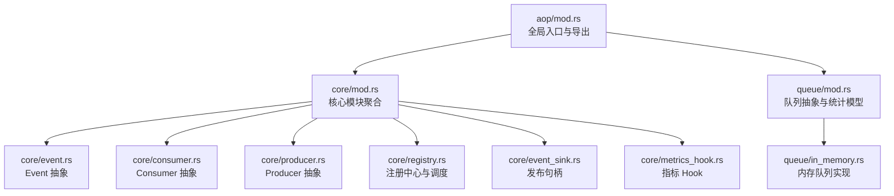
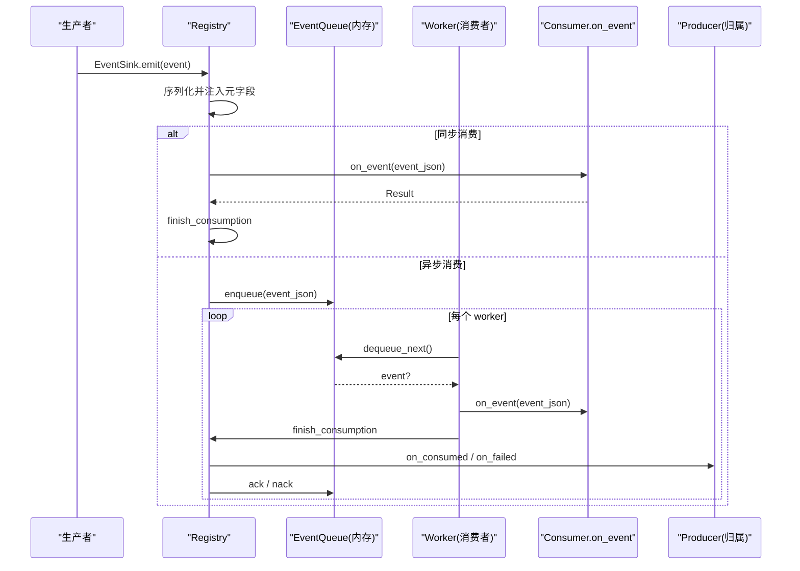
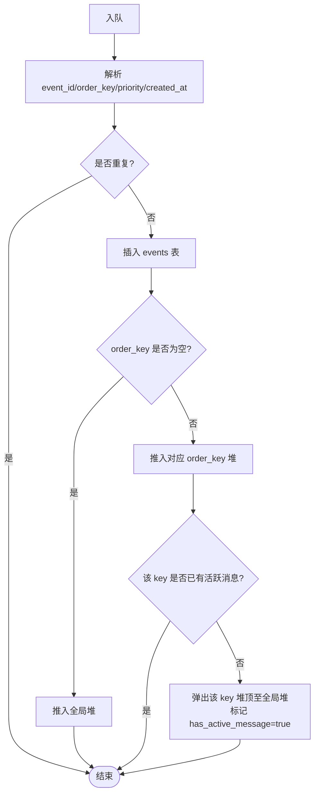
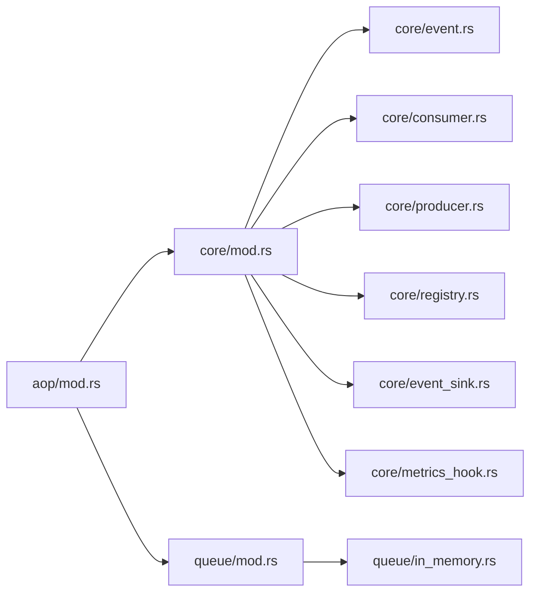

# 事件队列管理

<cite>
**本文引用的文件**
- [src/pkg/aop/mod.rs](src/pkg/aop/mod.rs)
- [src/pkg/aop/core/mod.rs](src/pkg/aop/core/mod.rs)
- [src/pkg/aop/core/event.rs](src/pkg/aop/core/event.rs)
- [src/pkg/aop/core/consumer.rs](src/pkg/aop/core/consumer.rs)
- [src/pkg/aop/core/producer.rs](src/pkg/aop/core/producer.rs)
- [src/pkg/aop/core/event_sink.rs](src/pkg/aop/core/event_sink.rs)
- [src/pkg/aop/core/registry.rs](src/pkg/aop/core/registry.rs)
- [src/pkg/aop/core/metrics_hook.rs](src/pkg/aop/core/metrics_hook.rs)
- [src/pkg/aop/queue/mod.rs](src/pkg/aop/queue/mod.rs)
- [src/pkg/aop/queue/in_memory.rs](src/pkg/aop/queue/in_memory.rs)
- [common/src/enums/event_topic.rs](common/src/enums/event_topic.rs)
- [docs/design/aop_producer_consumer_contract_design.md](docs/design/aop_producer_consumer_contract_design.md)
</cite>

## 更新摘要
**变更内容**
- 事件类型标识由已删除的 `EventKind` 收敛为 `common::enums::EventTopic`；`Event::kind()` 现返回 `EventTopic`
- 消费者订阅由 `interested_events()` 改为 `subscriptions() -> Vec<Subscription>`（`kind`/`ordered`/`notify_producer`）
- 生产者生命周期改写：删除 `poll()`/`poll_interval_secs()`，轮询由生产者自持 `ProducerLoop` 自管；`start(EventSink)` 接收预绑定 topic 的发布句柄
- 删除 `Consumer::ack/nack` 与按 `source` 分发；收尾统一在 `Registry::finish_consumption` 按 topic 反查生产者回调，结论为 Ack/Nack
- 入队 `EventRef.attempt` 自增，消费侧读取 `AopEventMeta.attempt`；`RetryDecision { Retry, Discard }` 由生产者决定，框架无 max_retry、无死信

## 目录
1. [简介](#简介)
2. [项目结构](#项目结构)
3. [核心组件](#核心组件)
4. [架构总览](#架构总览)
5. [详细组件分析](#详细组件分析)
6. [依赖关系分析](#依赖关系分析)
7. [性能与容量、背压](#性能与容量背压)
8. [故障恢复与重试](#故障恢复与重试)
9. [监控指标与可观测性](#监控指标与可观测性)
10. [配置选项与调优参数](#配置选项与调优参数)
11. [使用示例与最佳实践](#使用示例与最佳实践)
12. [扩展自定义队列实现指南](#扩展自定义队列实现指南)
13. [故障排查指南](#故障排查指南)
14. [结论](#结论)

## 简介
本模块为 AOP 事件中心，提供统一的事件分发框架：生产者发布事件，消费者订阅并处理事件；异步消费通过队列解耦，支持优先级、顺序键（order_key）和可扩展的持久化队列。当前默认实现为内存队列，具备按 order_key 的顺序保证与全局优先级调度能力。事件的路由键统一为 `common::enums::EventTopic`（闭合枚举，点分线格式），取代原先易拼错的裸字符串 `EventKind`。

## 项目结构
AOP 事件中心位于 src/pkg/aop，分为 core（抽象接口与调度）、queue（队列抽象与内存实现）、以及对外重导出的统一入口。

图表来源
- [src/pkg/aop/mod.rs#L1-L61](src/pkg/aop/mod.rs#L1-L61)
- [src/pkg/aop/core/mod.rs#L1-L14](src/pkg/aop/core/mod.rs#L1-L14)
- [src/pkg/aop/queue/mod.rs#L1-L107](src/pkg/aop/queue/mod.rs#L1-L107)
- [src/pkg/aop/queue/in_memory.rs#L1-L449](src/pkg/aop/queue/in_memory.rs#L1-L449)

章节来源
- [src/pkg/aop/mod.rs#L1-L61](src/pkg/aop/mod.rs#L1-L61)
- [src/pkg/aop/core/mod.rs#L1-L14](src/pkg/aop/core/mod.rs#L1-L14)

## 核心组件
- Event：事件抽象，定义 kind（`EventTopic`）、id、order_key、priority、created_at 等元信息。
- Consumer：消费者抽象，支持同步/异步两种消费模式，通过 `subscriptions()` 声明订阅的 `EventTopic`、顺序消费与 `notify_producer` 回调；异步模式由 worker 拉取。
- Producer：生产者抽象，拥有某 topic 业务收尾能力；经 `start(EventSink)` 自管循环、`stop()` 优雅退出；不再有 `poll()`。
- Registry：注册中心，按 topic 维护消费者与生产者索引，负责事件分发、异步消费者 worker 启动、指标埋点注入与收尾回调反查。
- EventQueue：队列抽象，定义 enqueue/dequeue/ack/nack/stats/query 等能力，当前默认实现为 InMemoryEventQueue。
- Metrics Hook：指标采集钩子，零业务依赖，按需注入。

章节来源
- [src/pkg/aop/core/event.rs#L1-L17](src/pkg/aop/core/event.rs#L1-L17)
- [src/pkg/aop/core/consumer.rs#L21-L112](src/pkg/aop/core/consumer.rs#L21-L112)
- [src/pkg/aop/core/producer.rs#L11-L154](src/pkg/aop/core/producer.rs#L11-L154)
- [src/pkg/aop/core/registry.rs#L15-L123](src/pkg/aop/core/registry.rs#L15-L123)
- [src/pkg/aop/queue/mod.rs#L1-L107](src/pkg/aop/queue/mod.rs#L1-L107)
- [src/pkg/aop/core/metrics_hook.rs#L1-L90](src/pkg/aop/core/metrics_hook.rs#L1-L90)

## 架构总览
AOP 事件中心采用"生产者-注册中心-消费者"的单向调用链，队列作为异步缓冲层。事件在发布时序列化并注入元字段（含 `kind` 为 `EventTopic` 线格式），按消费者对该 topic 的订阅分发；异步消费者由 Registry 启动固定数量的 worker 循环拉取消息，经 `finish_consumption` 判定 Ack/Nack，成功则 queue.ack，失败则 queue.nack 并退避重试。

图表来源
- [src/pkg/aop/core/registry.rs#L142-L271](src/pkg/aop/core/registry.rs#L142-L271)
- [src/pkg/aop/core/registry.rs#L343-L562](src/pkg/aop/core/registry.rs#L343-L562)
- [src/pkg/aop/core/registry.rs#L734-L802](src/pkg/aop/core/registry.rs#L734-L802)
- [src/pkg/aop/queue/in_memory.rs#L104-L267](src/pkg/aop/queue/in_memory.rs#L104-L267)

## 详细组件分析

### Event 抽象与元数据
- Event trait 定义了事件标识（kind 为 `EventTopic`）、顺序键、优先级与创建时间，便于统一序列化与调度。
- 发布时会将元字段写入 JSON 顶层，供队列与监控一致读取；`AopEventMeta.event_kind` 为 `String`（响应侧保持 `String`，未知 topic = ①类纯通知）。

章节来源
- [src/pkg/aop/core/event.rs#L1-L17](src/pkg/aop/core/event.rs#L1-L17)
- [src/pkg/aop/core/registry.rs#L142-L197](src/pkg/aop/core/registry.rs#L142-L197)
- [common/src/enums/event_topic.rs#L28-L135](common/src/enums/event_topic.rs#L28-L135)

### Consumer 抽象与消费模式
- 同步模式：发布线程直接调用 on_event，适合轻量处理。
- 异步模式：事件入队，由 worker 拉取处理；通过 `concurrency`、`empty_queue_sleep_ms`、`error_retry_sleep_ms` 控制吞吐与退避。
- 订阅声明：`subscriptions() -> Vec<Subscription>`，每项含 `kind: EventTopic`、`ordered: bool`、`notify_producer: bool`；`ordered` 仅被注册期校验读取（Sync 声明 `ordered` → 注册 Err）。

章节来源
- [src/pkg/aop/core/consumer.rs#L21-L112](src/pkg/aop/core/consumer.rs#L21-L112)
- [src/pkg/aop/core/registry.rs#L53-L90](src/pkg/aop/core/registry.rs#L53-L90)

### Producer 抽象与生命周期
- 生命周期：`start(EventSink)` 由 AOP 统一调用，生产者 spawn 自管循环后**立即返回**；`stop()` 置位并 await `JoinHandle`。
- 轮询机制：由 `ProducerLoop`（AtomicBool + 250ms 分片可中断 sleep）实现，`stop()` 后下一片返回 false 退出。
- 业务收尾：`on_consumed(ctx, event)`（成功或 Discard 后回调）、`on_failed(ctx, event, err, attempt) -> RetryDecision`。

章节来源
- [src/pkg/aop/core/producer.rs#L11-L154](src/pkg/aop/core/producer.rs#L11-L154)
- [src/pkg/aop/core/event_sink.rs#L1-L54](src/pkg/aop/core/event_sink.rs#L1-L54)
- [src/pkg/aop/core/registry.rs#L550-L562](src/pkg/aop/core/registry.rs#L550-L562)

### Registry 注册中心与调度
- 注册消费者：为异步消费者自动创建独立队列实例，并按其 `subscriptions()` 的 `kind` 建立 topic 索引。
- 发布事件：按事件 `kind`（`EventTopic`）路由到订阅的消费者；统一埋点。
- 启动调度：先做校验（声明 `notify_producer` 的 topic 缺生产者 → 启动 Err），再为每个异步消费者启动 concurrency 个 worker，并逐个 `EventSink::new(registry, topic)` + `producer.start(sink)`。
- 收尾：Sync/Async 唯一出口 `finish_consumption`，按 `kind` 反查 `producer_for(kind)` 并回调。
- 指标注入：set_metrics_hook 后，publish/on_consume_start/success/failure/discarded 均会回调。

章节来源
- [src/pkg/aop/core/registry.rs#L15-L123](src/pkg/aop/core/registry.rs#L15-L123)
- [src/pkg/aop/core/registry.rs#L343-L602](src/pkg/aop/core/registry.rs#L343-L602)
- [src/pkg/aop/core/registry.rs#L734-L802](src/pkg/aop/core/registry.rs#L734-L802)
- [src/pkg/aop/core/metrics_hook.rs#L1-L90](src/pkg/aop/core/metrics_hook.rs#L1-L90)

### EventQueue 抽象与内存实现
- 抽象方法：enqueue/enqueue_batch/dequeue_next/ack/nack/stats/query_events/get_event/recover/clear。
- 内存实现要点：
  - 数据结构：全局优先堆 + 各 order_key 的有序堆 + in_progress 映射 + has_active_message 标记。
  - 顺序保证：同 order_key 仅允许一个"活跃"消息在堆顶被取出，处理完成后才释放下一个。
  - 优先级：按 priority 降序、created_at 升序排序。
  - 查询与统计：支持按 order_key/status 过滤、分页、最老事件年龄计算。
  - 重试计数：`dequeue_next` 注入 `EventRef.attempt`（nack 时 +1），消费侧读 `AopEventMeta.attempt`。

图表来源
- [src/pkg/aop/queue/in_memory.rs#L104-L166](src/pkg/aop/queue/in_memory.rs#L104-L166)

章节来源
- [src/pkg/aop/queue/mod.rs#L1-L107](src/pkg/aop/queue/mod.rs#L1-L107)
- [src/pkg/aop/queue/in_memory.rs#L1-L449](src/pkg/aop/queue/in_memory.rs#L1-L449)

## 依赖关系分析
- aop/mod.rs 重导出 core 与 queue 的关键类型，暴露 registry()/publish()/init_all() 等便捷 API。
- core 模块内部相互依赖：event/consumer/producer 被 registry 组合使用；metrics_hook 可选注入；event_sink 由 registry 在 start_all 时构造。
- queue 模块独立于业务，仅依赖 RequestContext 与通用错误类型。

图表来源
- [src/pkg/aop/mod.rs#L1-L61](src/pkg/aop/mod.rs#L1-L61)
- [src/pkg/aop/core/mod.rs#L1-L14](src/pkg/aop/core/mod.rs#L1-L14)
- [src/pkg/aop/queue/mod.rs#L1-L107](src/pkg/aop/queue/mod.rs#L1-L107)

章节来源
- [src/pkg/aop/mod.rs#L1-L61](src/pkg/aop/mod.rs#L1-L61)

## 性能与容量、背压
- 容量与内存占用
  - 内存队列以 HashMap + BinaryHeap 存储事件与索引，未设置硬性容量上限；高吞吐场景需关注内存增长。
  - 建议结合业务侧限流与批处理（enqueue_batch）降低锁竞争与序列化开销。
- 顺序与并行
  - 无 order_key 的事件走全局堆，完全并行；有 order_key 的事件按 key 串行，避免乱序。
- 背压机制
  - 当前内存队列未实现阻塞式背压；可通过消费者侧 empty_queue_sleep_ms 与 error_retry_sleep_ms 调节拉取节奏，避免忙轮。
  - 生产端可基于业务阈值进行退让（如延迟重试、降级），避免瞬时峰值导致内存膨胀。
- 锁粒度
  - 内存队列使用单 Mutex 保护所有共享结构，临界区较短；在高并发下仍可能成为瓶颈，可考虑分片队列或无锁结构优化。

章节来源
- [src/pkg/aop/queue/in_memory.rs#L104-L267](src/pkg/aop/queue/in_memory.rs#L104-L267)
- [src/pkg/aop/core/consumer.rs#L98-L111](src/pkg/aop/core/consumer.rs#L98-L111)

## 故障恢复与重试
- 崩溃恢复
  - 内存队列 recover 返回 0，表示当前实现不持久化；如需持久化，应实现自定义 EventQueue 并在服务启动时从外部存储恢复 pending 事件。
- 重试策略
  - 异步消费者 on_event 失败 → `finish_consumption` 调 `on_failed` 得 `RetryDecision`：`Retry` → queue.nack 重投；`Discard` → queue.ack（事件永久移除，无死信）且仍回调 `on_consumed`。
  - 成功处理后 queue.ack，确保事件从 in_progress 移除，并推进同 order_key 的下一个事件。
  - 框架**不设 max_retry**：重试上限由生产者在 `on_failed` 用永久错误表决定（如 `inbound_retry::decide`）。
- 幂等性与去重
  - 入队时对 event_id 做去重，避免重复处理；`on_consumed` 回调先于 queue.ack，必须幂等。

章节来源
- [src/pkg/aop/core/registry.rs#L734-L802](src/pkg/aop/core/registry.rs#L734-L802)
- [src/pkg/aop/queue/in_memory.rs#L208-L267](src/pkg/aop/queue/in_memory.rs#L208-L267)
- [src/pkg/aop/queue/in_memory.rs#L117-L145](src/pkg/aop/queue/in_memory.rs#L117-L145)

## 监控指标与可观测性
- 指标 Hook 生命周期
  - on_publish：事件发布时触发（每个订阅的消费者一次）。
  - on_consume_start：消费者开始处理事件。
  - on_consume_success：成功处理，附带耗时。
  - on_consume_failure：失败处理，附带耗时与错误信息。
  - on_consume_discarded：`Discard` 决策时触发（独立埋点，**不得混入失败率**）。
- 元信息
  - AopEventMeta 从 event_json 顶层提取 event_id、kind（`EventTopic` 线格式 `String`）、order_key、priority、created_at、attempt。
- 队列统计
  - QueueStats 提供 pending_count、in_progress_count、order_keys 分布、最老事件年龄等。
  - 支持按条件查询事件列表与详情（脱敏预览）。

章节来源
- [src/pkg/aop/core/metrics_hook.rs#L1-L90](src/pkg/aop/core/metrics_hook.rs#L1-L90)
- [src/pkg/aop/queue/mod.rs#L1-L107](src/pkg/aop/queue/mod.rs#L1-L107)
- [src/pkg/aop/core/registry.rs#L149-L206](src/pkg/aop/core/registry.rs#L149-L206)
- [src/pkg/aop/core/registry.rs#L658-L702](src/pkg/aop/core/registry.rs#L658-L702)

## 配置选项与调优参数
- 消费者侧
  - concurrency：异步消费者 worker 数量，控制并行度。
  - empty_queue_sleep_ms：队列为空时的休眠时间，降低空转 CPU。
  - error_retry_sleep_ms：处理失败后的退避时间，避免紧耦合重试。
- 队列侧
  - 内存队列无显式容量限制；可通过业务侧限流与批处理控制压力。
  - 顺序键 order_key：用于同一实体的顺序保证，合理划分可降低锁竞争。
- 指标 Hook
  - 通过 set_metrics_hook 注入，未注入时零开销。

章节来源
- [src/pkg/aop/core/consumer.rs#L98-L111](src/pkg/aop/core/consumer.rs#L98-L111)
- [src/pkg/aop/core/registry.rs#L42-L51](src/pkg/aop/core/registry.rs#L42-L51)

## 使用示例与最佳实践
- 发布事件
  - 生产者经 `EventSink::emit(event)` 发布，事件需实现 Event trait，其 `kind()` 返回 `EventTopic`。
- 注册消费者
  - 在 consumer::init 中注册消费者（声明 `subscriptions`），异步消费者将自动获得独立队列与 worker。
- 启动调度器
  - 调用 aop::init_all() 启动所有异步消费者的 worker 与生产者自管循环（由 `start_all` 统一驱动）。
- 最佳实践
  - 为需要顺序处理的实体设置 order_key（如会话 ID、订单 ID）。
  - 合理设置 concurrency 与休眠参数，平衡吞吐与资源占用。
  - 对关键路径启用 metrics hook，记录耗时与错误率；用 `on_consume_discarded` 区分放弃与失败。
  - 使用 enqueue_batch 批量入队，减少锁与序列化开销。

章节来源
- [src/pkg/aop/mod.rs#L27-L61](src/pkg/aop/mod.rs#L27-L61)
- [src/pkg/aop/core/registry.rs#L343-L562](src/pkg/aop/core/registry.rs#L343-L562)
- [src/pkg/aop/core/event_sink.rs#L1-L54](src/pkg/aop/core/event_sink.rs#L1-L54)

## 扩展自定义队列实现指南
- 目标
  - 替换 InMemoryEventQueue，实现持久化、分布式或带容量限制的队列。
- 步骤
  - 实现 EventQueue trait：
    - enqueue/enqueue_batch：持久化事件并维护顺序与优先级。
    - dequeue_next：按优先级与顺序键拉取待处理事件（注意注入 `attempt`）。
    - ack/nack：更新事件状态，支持重试与丢弃（无死信由上层生产者决策）。
    - stats/query_events/get_event：提供监控与运维查询。
    - recover：服务启动时从外部存储恢复 pending 事件。
    - clear：清理队列（谨慎使用）。
  - 在 Registry 注册时使用自定义队列：可在 register_consumer 中为异步消费者注入自定义队列实例。
- 注意事项
  - 保持与内存队列一致的语义：order_key 顺序保证、优先级排序、去重逻辑。
  - 确保并发安全与事务一致性，避免重复消费与丢失。
  - 提供完善的统计与查询接口，便于监控与排障。

章节来源
- [src/pkg/aop/queue/mod.rs#L77-L107](src/pkg/aop/queue/mod.rs#L77-L107)
- [src/pkg/aop/core/registry.rs#L53-L90](src/pkg/aop/core/registry.rs#L53-L90)

## 故障排查指南
- 常见问题
  - 事件堆积：检查消费者 concurrency 与休眠参数；确认 order_key 是否过细导致串行瓶颈。
  - 顺序错乱：确认相同实体设置了正确的 order_key；检查是否有多个消费者同名但不同队列。
  - 频繁重试：查看 on_consume_failure 指标与错误日志，定位下游依赖问题；注意框架无 max_retry，需生产者自行 Discard。
  - 业务收尾丢失：声明 `notify_producer` 的 topic 缺生产者会导致 `start_all` 启动失败（早于 started 置位）。
  - 内存增长：评估事件大小与入队速率；必要时引入容量限制或持久化队列。
- 诊断工具
  - 使用 queue.stats() 与 query_events() 观察队列状态与事件详情。
  - 启用 metrics hook 收集发布、消费、失败、丢弃指标。

章节来源
- [src/pkg/aop/core/registry.rs#L569-L602](src/pkg/aop/core/registry.rs#L569-L602)
- [src/pkg/aop/core/metrics_hook.rs#L61-L90](src/pkg/aop/core/metrics_hook.rs#L61-L90)

## 结论
AOP 事件中心以简洁的抽象与灵活的调度机制，提供了高性能、可扩展的事件处理能力。内存队列满足单机场景下的顺序与优先级需求；通过自定义队列可实现持久化与分布式扩展。消费者以 `subscriptions()` 声明订阅、生产者以 `EventSink` 强制 1 producer : 1 topic，收尾经 `finish_consumption` 按 topic 反查回调，结合指标 Hook 与队列统计，可构建完整的可观测体系，保障系统稳定运行。
