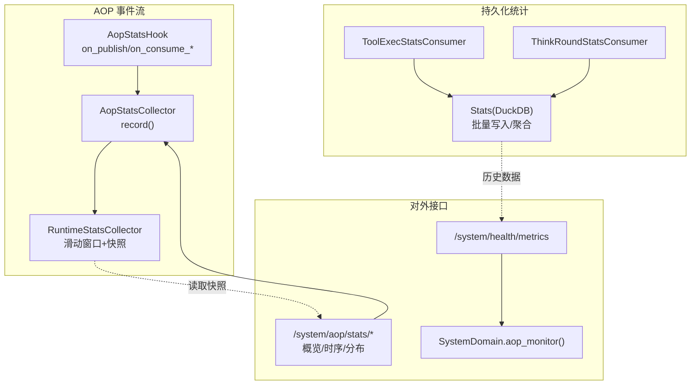
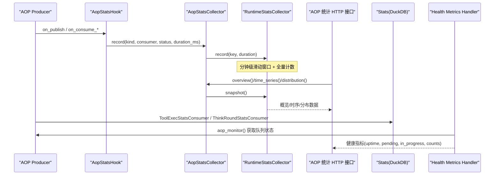
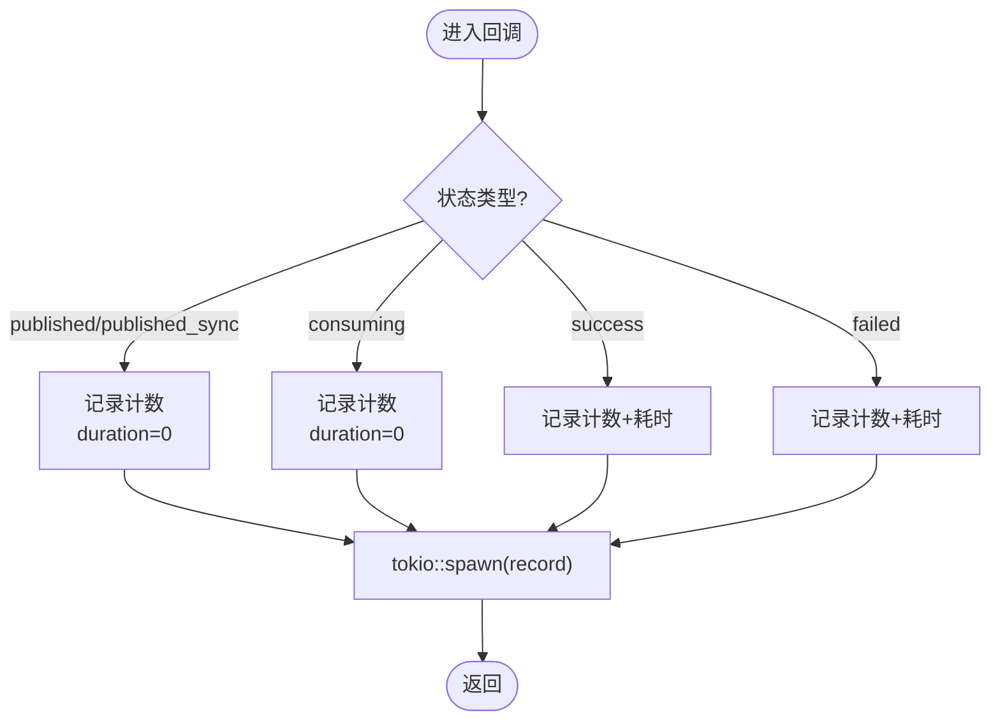
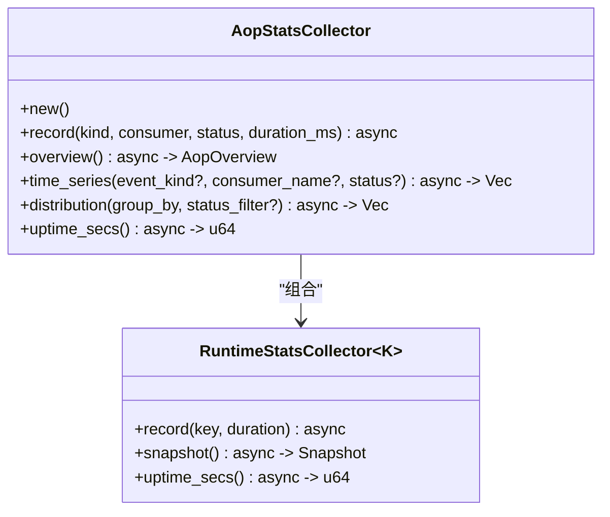
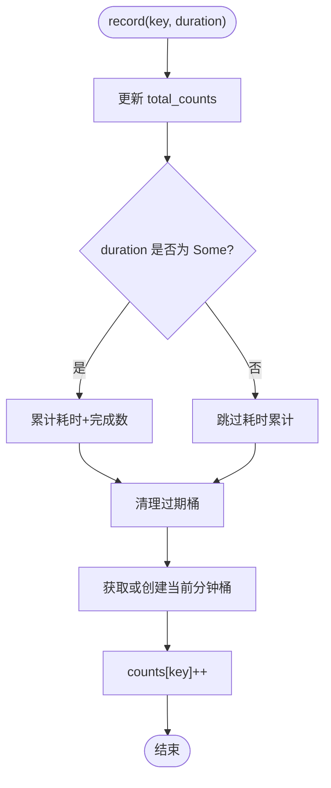
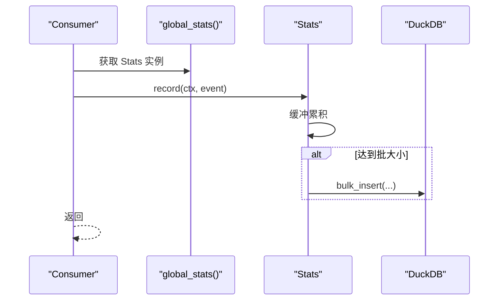
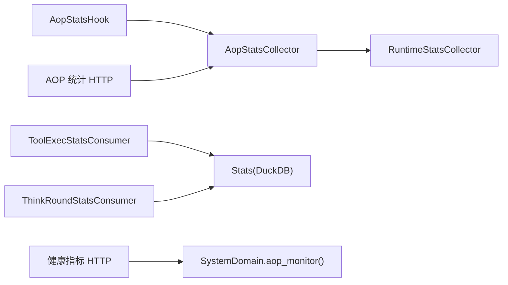

# 统计与监控

<cite>
**本文引用的文件**
- [aop_stats_collector.rs](src/consumer/aop_stats_collector.rs)
- [aop_stats_hook.rs](src/consumer/aop_stats_hook.rs)
- [runtime/mod.rs](src/pkg/stats/runtime/mod.rs)
- [stats/mod.rs](src/pkg/stats/mod.rs)
- [collector.rs](src/pkg/stats/collector.rs)
- [tool_exec_stats_consumer.rs](src/consumer/tool_exec_stats_consumer.rs)
- [think_round_stats_consumer.rs](src/consumer/think_round_stats_consumer.rs)
- [health_metrics.rs](src/handlers/system/health_metrics.rs)
- [aop_stats.rs](src/handlers/system/aop_stats.rs)
- [log_stats.rs](common/src/api/log_stats.rs)

### 本文关联的三类文档（四类互引闭环）

**① 设计文档（Design）**：
- [Canvas 渲染与可视化手册](docs/archive/design-archive/canvas_rendering_playbook.md) — HUD 风格 Canvas 渲染、图表与知识图谱可视化规范
- [统计模块设计](docs/archive/design-archive/stats_module_design.md) — DuckDB 持久化统计框架与 5 维表注册设计
- [统计查询设计](docs/archive/design-archive/stats_query_design.md) — 统计聚合与时序查询 API 协议设计

**② 落地计划（Plan）**：
- [知识图谱推荐起点与组件复用重构](docs/archive/plan-archive/知识图谱推荐起点与组件复用重构.md) — 知识图谱推荐起点与 Canvas 组件复用重构
- [统计图表Phase1基础设施与时序图展示重构](docs/archive/plan-archive/统计图表Phase1基础设施与时序图展示重构.md) — 图表组件落地点与前后端对接

**④ RAG 原子知识卡**：
- [Canvas HUD 可视化 RAG 卡](docs/wiki/knowledge/zh/Canvas%20HUD%20%E5%8F%AF%E8%A7%86%E5%8C%96%EF%BC%9AGraphCanvas%20%E7%9F%A5%E8%AF%86%E5%9B%BE%E8%B0%B1%20+%20%E5%9B%BE%E8%A1%A8%E5%9C%BA%E6%99%AFLineDonut%20+%20%E4%BB%AA%E8%A1%A8%E7%9B%98Gauge%E5%8F%8C%E7%89%88%20+%20HudPalette%E6%A9%99%E5%85%89%E5%85%89%E6%99%95/Canvas%20HUD%20%E5%8F%AF%E8%A7%86%E5%8C%96%EF%BC%9AGraphCanvas%20%E7%9F%A5%E8%AF%86%E5%9B%BE%E8%B0%B1%20+%20%E5%9B%BE%E8%A1%A8%E5%9C%BA%E6%99%AFLineDonut%20+%20%E4%BB%AA%E8%A1%A8%E7%9B%98Gauge%E5%8F%8C%E7%89%88%20+%20HudPalette%E6%A9%99%E5%85%89%E5%85%89%E6%99%95.md) — GraphCanvas + Line/Donut + Gauge 仪表盘速查
- [统计查询 API 与前端仪表盘](docs/wiki/knowledge/zh/%E7%BB%9F%E8%AE%A1%E6%9F%A5%E8%AF%A2%20API%20%E4%B8%8E%E5%89%8D%E7%AB%AF%E4%BB%AA%E8%A1%A8%E7%9B%98%EF%BC%9ADuckDB%205%20%E7%BB%B4%E8%A1%A8%E6%9F%A5%E8%AF%A2%20+%20RuntimeStats%20%E5%86%85%E5%AD%98%E6%BB%91%E5%8A%A8%E8%81%9A%E5%90%88%20+%20StatsHandler%20REST%20API%20+%20%E5%89%8D%E7%AB%AF%20LineDonutGauge%20%E5%B1%95%E7%A4%BA/%E7%BB%9F%E8%AE%A1%E6%9F%A5%E8%AF%A2%20API%20%E4%B8%8E%E5%89%8D%E7%AB%AF%E4%BB%AA%E8%A1%A8%E7%9B%98%EF%BC%9ADuckDB%205%20%E7%BB%B4%E8%A1%A8%E6%9F%A5%E8%AF%A2%20+%20RuntimeStats%20%E5%86%85%E5%AD%98%E6%BB%91%E5%8A%A8%E8%81%9A%E5%90%88%20+%20StatsHandler%20REST%20API%20+%20%E5%89%8D%E7%AB%AF%20LineDonutGauge%20%E5%B1%95%E7%A4%BA.md) — DuckDB 持久化 + RuntimeStats 内存统计 + 前后端查询可视化全链路
</cite>

## 目录
1. [简介](#简介)
2. [项目结构](#项目结构)
3. [核心组件](#核心组件)
4. [架构总览](#架构总览)
5. [详细组件分析](#详细组件分析)
6. [依赖关系分析](#依赖关系分析)
7. [性能考量](#性能考量)
8. [故障排查指南](#故障排查指南)
9. [结论](#结论)
10. [附录](#附录)

## 简介
本章节面向 AOP 事件系统的统计与监控能力，聚焦以下目标：
- 统计收集器：内存实时采集、滑动窗口时序、维度聚合。
- 监控钩子：AOP 生命周期回调（发布、消费开始、成功、失败）的指标采集。
- 指标收集：工具调用、模型调用等事件的持久化统计。
- 系统健康监控：统一健康指标聚合接口。
- 可视化与调试：HTTP 查询端点、日志统计 DTO、前端 HUD 集成。
- 配置与扩展：自定义监控指标的实现路径与最佳实践。

## 项目结构
围绕统计与监控的关键代码分布在以下位置：
- 运行时内存统计基础设施：pkg/stats/runtime
- 持久化统计框架：pkg/stats（DuckDB 表注册、批量写入、聚合查询）
- AOP 统计采集 Hook：consumer/aop_stats_hook
- AOP 实时统计收集器：consumer/aop_stats_collector
- 业务统计消费者：consumer/tool_exec_stats_consumer、consumer/think_round_stats_consumer
- 系统健康指标聚合：handlers/system/health_metrics
- AOP 实时统计 HTTP 接口：handlers/system/aop_stats
- 日志统计 API DTO：common/src/api/log_stats

图表来源
- [aop_stats_hook.rs:35-82](src/consumer/aop_stats_hook.rs#L35-L82)
- [aop_stats_collector.rs:54-196](src/consumer/aop_stats_collector.rs#L54-L196)
- [runtime/mod.rs:191-245](src/pkg/stats/runtime/mod.rs#L191-L245)
- [collector.rs:102-132](src/pkg/stats/collector.rs#L102-L132)
- [tool_exec_stats_consumer.rs:27-71](src/consumer/tool_exec_stats_consumer.rs#L27-L71)
- [think_round_stats_consumer.rs:29-71](src/consumer/think_round_stats_consumer.rs#L29-L71)
- [aop_stats.rs:16-72](src/handlers/system/aop_stats.rs#L16-L72)
- [health_metrics.rs:33-134](src/handlers/system/health_metrics.rs#L33-L134)

章节来源
- [aop_stats_hook.rs:1-118](src/consumer/aop_stats_hook.rs#L1-L118)
- [aop_stats_collector.rs:1-307](src/consumer/aop_stats_collector.rs#L1-L307)
- [runtime/mod.rs:1-378](src/pkg/stats/runtime/mod.rs#L1-L378)
- [stats/mod.rs:1-175](src/pkg/stats/mod.rs#L1-L175)
- [collector.rs:1-658](src/pkg/stats/collector.rs#L1-L658)
- [tool_exec_stats_consumer.rs:1-73](src/consumer/tool_exec_stats_consumer.rs#L1-L73)
- [think_round_stats_consumer.rs:1-73](src/consumer/think_round_stats_consumer.rs#L1-L73)
- [health_metrics.rs:1-135](src/handlers/system/health_metrics.rs#L1-L135)
- [aop_stats.rs:1-73](src/handlers/system/aop_stats.rs#L1-L73)
- [log_stats.rs:1-77](common/src/api/log_stats.rs#L1-L77)

## 核心组件
- 运行时统计收集器（内存版）：提供泛型维度键、分钟级滑动窗口、深拷贝快照、运行时长计算。适用于 AOP、SSE/WS、Channel 等“运行时能力”统计。
- AOP 统计收集器：基于运行时收集器，实现 overview/time_series/distribution 三类聚合，仅对 success/failed 累计耗时。
- AOP 统计采集 Hook：在 AOP 生命周期四个回调中异步记录指标，不阻塞主流程。
- 持久化统计框架（DuckDB）：表注册、批量缓冲、自动 flush、聚合与时序查询；为 ToolCallEvent、ModelCallEvent 等提供落库能力。
- 业务统计消费者：订阅 AOP 事件并写入 Stats 持久化层。
- 系统健康指标聚合：统一返回后端在线、AOP 队列积压、Agent/Project/Task 计数、进程运行时长等。
- AOP 实时统计 HTTP 接口：概览、时序、分布三个端点，直接读内存快照，毫秒级响应。
- 日志统计 DTO：定义日志级别分布、时序点、查询参数等，便于前端展示。

章节来源
- [runtime/mod.rs:191-245](src/pkg/stats/runtime/mod.rs#L191-L245)
- [aop_stats_collector.rs:54-196](src/consumer/aop_stats_collector.rs#L54-L196)
- [aop_stats_hook.rs:35-82](src/consumer/aop_stats_hook.rs#L35-L82)
- [collector.rs:102-132](src/pkg/stats/collector.rs#L102-L132)
- [tool_exec_stats_consumer.rs:27-71](src/consumer/tool_exec_stats_consumer.rs#L27-L71)
- [think_round_stats_consumer.rs:29-71](src/consumer/think_round_stats_consumer.rs#L29-L71)
- [health_metrics.rs:33-134](src/handlers/system/health_metrics.rs#L33-L134)
- [aop_stats.rs:16-72](src/handlers/system/aop_stats.rs#L16-L72)
- [log_stats.rs:1-77](common/src/api/log_stats.rs#L1-L77)

## 架构总览
下图展示了从 AOP 事件到统计采集、持久化、以及对外暴露接口的完整链路。

图表来源
- [aop_stats_hook.rs:35-82](src/consumer/aop_stats_hook.rs#L35-L82)
- [aop_stats_collector.rs:54-196](src/consumer/aop_stats_collector.rs#L54-L196)
- [runtime/mod.rs:191-245](src/pkg/stats/runtime/mod.rs#L191-L245)
- [tool_exec_stats_consumer.rs:27-71](src/consumer/tool_exec_stats_consumer.rs#L27-L71)
- [think_round_stats_consumer.rs:29-71](src/consumer/think_round_stats_consumer.rs#L29-L71)
- [aop_stats.rs:16-72](src/handlers/system/aop_stats.rs#L16-L72)
- [health_metrics.rs:33-134](src/handlers/system/health_metrics.rs#L33-L134)

## 详细组件分析

### AOP 统计采集 Hook
- 职责：在 AOP 生命周期四个回调中，将事件 kind、consumer、status、duration 异步写入收集器。
- 关键点：
  - 使用 tokio::spawn 后台执行 record，避免阻塞 AOP 主流程。
  - published/published_sync 不累计耗时；success/failed 累计耗时。
  - 通过克隆持有 collector 引用，零成本共享。

图表来源
- [aop_stats_hook.rs:35-82](src/consumer/aop_stats_hook.rs#L35-L82)

章节来源
- [aop_stats_hook.rs:1-118](src/consumer/aop_stats_hook.rs#L1-L118)

### AOP 实时统计收集器
- 职责：封装 RuntimeStatsCollector，提供 overview、time_series、distribution 三种聚合视图。
- 关键逻辑：
  - overview：按 status 分类汇总 published/published_sync、consumed(success+failed)、success、failed，并计算平均耗时。
  - time_series：按分钟桶聚合，支持 event_kind/consumer_name/status 过滤。
  - distribution：支持按 consumer/status/kind 分组，可选 status 过滤，结果降序。
- 复杂度：
  - record：O(1) 更新哈希表与当前桶。
  - snapshot：O(B + K)，B 为桶数，K 为维度键数量。
  - time_series/distribution：O(B + K)。

图表来源
- [aop_stats_collector.rs:54-196](src/consumer/aop_stats_collector.rs#L54-L196)
- [runtime/mod.rs:191-245](src/pkg/stats/runtime/mod.rs#L191-L245)

章节来源
- [aop_stats_collector.rs:1-307](src/consumer/aop_stats_collector.rs#L1-L307)

### 运行时统计基础设施（内存版）
- 设计要点：
  - 维度键 K：任意 Hash + Eq + Clone + Send + Sync 的类型，常见为三元组 (kind, consumer, status)。
  - 滑动窗口：保留最近 60 分钟的分钟级桶，自动清理过期桶。
  - 快照：深拷贝，释放写锁后安全处理。
  - 耗时累计：仅当 duration 为 Some 时计入 total_duration_ms 与 completed_count。
- 性能特性：
  - 写路径 O(1)，读路径 O(B + K)。
  - 内存占用估算：桶数 × 每桶维度键数 × 单条元组大小。

图表来源
- [runtime/mod.rs:134-178](src/pkg/stats/runtime/mod.rs#L134-L178)

章节来源
- [runtime/mod.rs:1-378](src/pkg/stats/runtime/mod.rs#L1-378)

### 持久化统计框架（DuckDB）
- 职责：
  - 表注册：默认表包括 DefaultStatTable、ModelCallStatTable、ToolCallStatTable、AgentAwakeStatTable、ProjectStatTable、TaskStatTable。
  - 批量写入：内部缓冲达到阈值自动 flush，减少 DB 写入放大。
  - 聚合与时序：提供 query_aggregation、query_time_series 等通用查询能力。
- 使用方式：
  - 业务消费者（如 ToolExecStatsConsumer、ThinkRoundStatsConsumer）构造对应 Event 并通过 global_stats() 写入。
  - 上层可基于 StatFilter、group_by、aggregations 构建复杂查询。

图表来源
- [collector.rs:102-132](src/pkg/stats/collector.rs#L102-L132)
- [collector.rs:195-227](src/pkg/stats/collector.rs#L195-L227)
- [collector.rs:243-294](src/pkg/stats/collector.rs#L243-L294)
- [tool_exec_stats_consumer.rs:41-71](src/consumer/tool_exec_stats_consumer.rs#L41-L71)
- [think_round_stats_consumer.rs:43-71](src/consumer/think_round_stats_consumer.rs#L43-L71)

章节来源
- [collector.rs:1-658](src/pkg/stats/collector.rs#L1-L658)
- [stats/mod.rs:1-175](src/pkg/stats/mod.rs#L1-L175)

### 业务统计消费者
- ToolExecStatsConsumer：
  - 订阅 agent.tool.executed，解析 ToolExecEvent，映射为 ToolCallEvent，写入 Stats。
  - 根据 entry.status 决定 success/failed。
- ThinkRoundStatsConsumer：
  - 订阅 agent.think.round，解析 ThinkRoundEvent，映射为 ModelCallEvent，写入 Stats。
  - 若 total_tokens 为 0 则跳过（无模型调用）。

章节来源
- [tool_exec_stats_consumer.rs:1-73](src/consumer/tool_exec_stats_consumer.rs#L1-L73)
- [think_round_stats_consumer.rs:1-73](src/consumer/think_round_stats_consumer.rs#L1-L73)

### 系统健康监控
- 端点：GET /api/v1/system/health/metrics
- 指标：
  - backend_online：handler 能响应即 true。
  - aop_pending / aop_in_progress：聚合所有消费者队列的 pending/in_progress 计数。
  - uptime_secs：首次调用时初始化锚点，近似进程运行时长。
  - active_agents / total_agents、active_projects / total_projects、pending_tasks / total_tasks：通过 Domain 层计数。
- 特点：单一聚合接口，降低前端并发请求压力。

章节来源
- [health_metrics.rs:1-135](src/handlers/system/health_metrics.rs#L1-L135)

### AOP 实时统计 HTTP 接口
- 端点：
  - GET /api/v1/system/aop/stats/overview：概览（published/consumed/success/failed/avg_duration）。
  - GET /api/v1/system/aop/stats/time-series：时序（支持 event_kind/consumer_name/status 过滤）。
  - GET /api/v1/system/aop/stats/distribution：分布（按 consumer/status/kind 分组，可选 status 过滤）。
- 特点：直接读取内存快照，零 DB 查询，毫秒级响应。

章节来源
- [aop_stats.rs:1-73](src/handlers/system/aop_stats.rs#L1-L73)

### 日志统计与可视化
- DTO：
  - LogLevelDistributionItem / LogLevelDistributionResponse：日志级别分布。
  - LogTimeSeriesPoint / LogTimeSeriesResponse：按小时桶的日志时序。
  - LogQueryRequest：关键词、调用链 ID、级别、时间范围、分页等查询参数。
- 用途：配合前端 HUD 或日志面板进行可视化展示。

章节来源
- [log_stats.rs:1-77](common/src/api/log_stats.rs#L1-L77)

## 依赖关系分析
- 松耦合：
  - AOP 统计采集 Hook 仅依赖 AopStatsCollector，不感知持久化细节。
  - 业务统计消费者通过全局 Stats 单例写入，解耦于具体存储。
- 内聚性：
  - RuntimeStatsCollector 专注内存统计，AopStatsCollector 在其之上做业务聚合。
  - Stats 集中管理表注册、批量写入与查询。
- 外部依赖：
  - DuckDB：持久化统计存储。
  - Tokio：异步任务调度与 RwLock。
  - Axum/Dioxus：HTTP 接口与前端渲染（DTO 在 common 中定义）。

图表来源
- [aop_stats_hook.rs:35-82](src/consumer/aop_stats_hook.rs#L35-L82)
- [aop_stats_collector.rs:54-196](src/consumer/aop_stats_collector.rs#L54-L196)
- [runtime/mod.rs:191-245](src/pkg/stats/runtime/mod.rs#L191-L245)
- [tool_exec_stats_consumer.rs:27-71](src/consumer/tool_exec_stats_consumer.rs#L27-L71)
- [think_round_stats_consumer.rs:29-71](src/consumer/think_round_stats_consumer.rs#L29-L71)
- [aop_stats.rs:16-72](src/handlers/system/aop_stats.rs#L16-L72)
- [health_metrics.rs:33-134](src/handlers/system/health_metrics.rs#L33-L134)

章节来源
- [aop_stats_hook.rs:1-118](src/consumer/aop_stats_hook.rs#L1-L118)
- [aop_stats_collector.rs:1-307](src/consumer/aop_stats_collector.rs#L1-L307)
- [runtime/mod.rs:1-378](src/pkg/stats/runtime/mod.rs#L1-L378)
- [collector.rs:1-658](src/pkg/stats/collector.rs#L1-L658)
- [aop_stats.rs:1-73](src/handlers/system/aop_stats.rs#L1-L73)
- [health_metrics.rs:1-135](src/handlers/system/health_metrics.rs#L1-L135)

## 性能考量
- 写路径优化：
  - AOP Hook 使用 tokio::spawn 异步记录，避免阻塞事件处理主流程。
  - Stats 采用批量缓冲与自动 flush，降低 DB 写入放大。
- 读路径优化：
  - RuntimeStatsCollector 快照为深拷贝，读操作不持锁，适合高频查询。
  - AOP 统计 HTTP 接口直接读内存快照，零 DB 开销。
- 内存控制：
  - 滑动窗口固定 60 分钟，定期清理旧桶，防止内存无限增长。
  - 维度键建议尽量精简，避免高基数导致哈希表膨胀。
- 查询性能：
  - 聚合查询通过 SQL 在 DuckDB 侧完成，注意合理设置 filter/group_by/aggregation。
  - 时序查询按小时/天粒度聚合，避免过细粒度造成大结果集。

[本节为通用指导，无需特定文件引用]

## 故障排查指南
- AOP 统计未生效：
  - 确认 Hook 已注入 Registry，且 on_publish/on_consume_* 回调被触发。
  - 检查 AopStatsCollector.record 是否被调用（可通过测试用例验证）。
- 持久化统计缺失：
  - 确认 Stats 已 initialize_default 并注册对应表。
  - 检查消费者是否正确构造 Event 并通过 global_stats() 写入。
  - 查看缓冲长度与 flush 行为，必要时手动 flush_all。
- 健康指标异常：
  - 检查 SystemDomain.aop_monitor() 是否能正确聚合各消费者队列状态。
  - 确认 Agent/Project/Task 计数查询条件是否符合预期。
- 日志统计为空：
  - 校验 LogQueryRequest 的时间范围与级别过滤。
  - 确认日志写入链路是否正常（应用日志与统计 DTO 的对接）。

章节来源
- [aop_stats_hook.rs:84-117](src/consumer/aop_stats_hook.rs#L84-L117)
- [collector.rs:102-132](src/pkg/stats/collector.rs#L102-L132)
- [collector.rs:243-294](src/pkg/stats/collector.rs#L243-L294)
- [health_metrics.rs:33-134](src/handlers/system/health_metrics.rs#L33-L134)
- [log_stats.rs:1-77](common/src/api/log_stats.rs#L1-L77)

## 结论
本方案通过“内存实时 + 持久化历史”的双层统计体系，结合 AOP 生命周期 Hook 与业务消费者，实现了：
- 低开销的事件级指标采集与聚合。
- 毫秒级响应的 AOP 实时统计接口。
- 可回溯的历史指标查询与可视化。
- 统一的系统健康指标聚合，支撑前端 HUD 仪表盘。
建议在后续迭代中：
- 持续优化维度基数与滑动窗口大小，平衡内存与精度。
- 完善告警机制（如基于阈值与趋势的告警规则）。
- 扩展更多业务维度的统计与可视化面板。

[本节为总结性内容，无需特定文件引用]

## 附录
- 监控配置示例（概念性说明）：
  - 启动阶段初始化 Stats 并注册默认表。
  - 在 AOP 初始化阶段注入 AopStatsHook。
  - 启动 AOP 消费者（ToolExecStatsConsumer、ThinkRoundStatsConsumer）。
  - 暴露 /system/aop/stats/* 与 /system/health/metrics 接口。
- 自定义监控指标实现指南：
  - 定义新的 Event 类型并实现 StatEvent。
  - 注册对应的 StatTable（或使用 DefaultStatTable）。
  - 在合适的业务点通过 record_event! 宏或 Stats.record 写入。
  - 如需实时指标，可在 RuntimeStatsCollector 基础上扩展新收集器。

[本节为通用指导，无需特定文件引用]