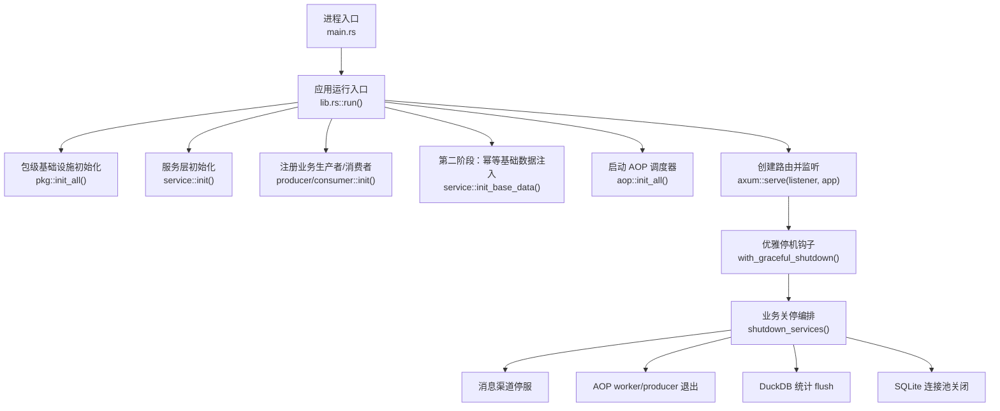
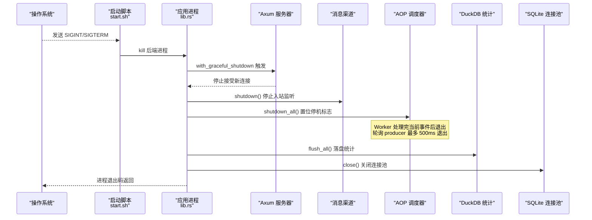
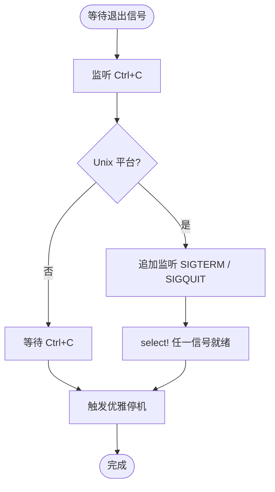
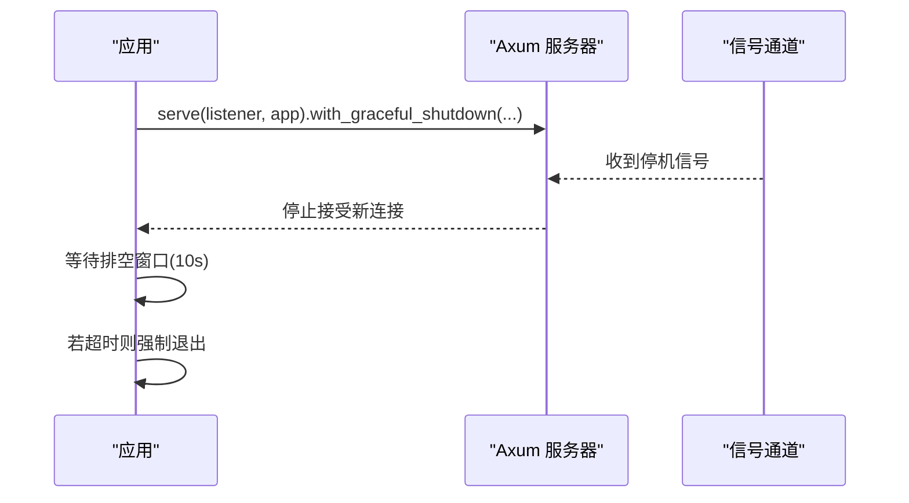
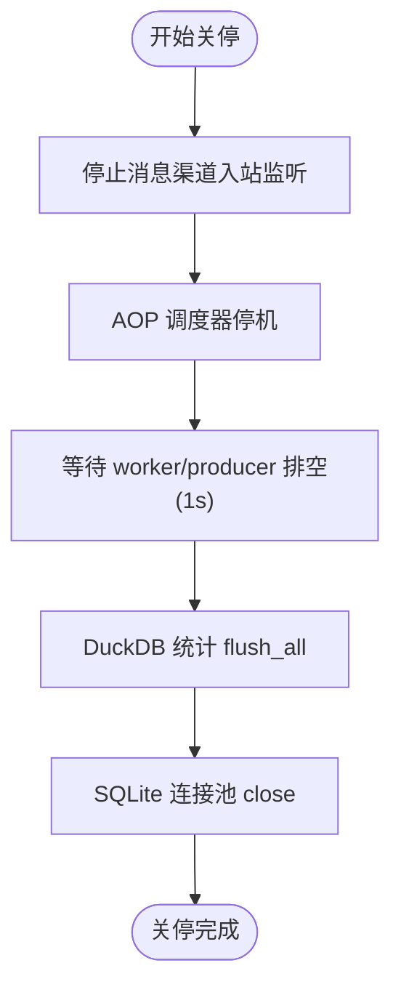
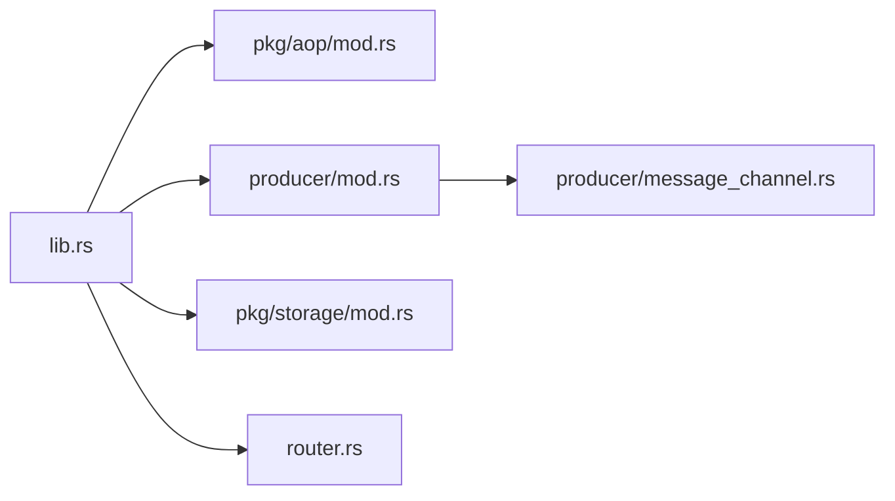

# 优雅关闭系统

<cite>
**本文引用的文件**
- [src/main.rs](src/main.rs)
- [src/lib.rs](src/lib.rs)
- [src/pkg/aop/mod.rs](src/pkg/aop/mod.rs)
- [src/producer/mod.rs](src/producer/mod.rs)
- [src/producer/message_channel.rs](src/producer/message_channel.rs)
- [src/pkg/storage/mod.rs](src/pkg/storage/mod.rs)
- [start.sh](start.sh)
</cite>

## 目录
1. [简介](#简介)
2. [项目结构](#项目结构)
3. [核心组件](#核心组件)
4. [架构总览](#架构总览)
5. [详细组件分析](#详细组件分析)
6. [依赖关系分析](#依赖关系分析)
7. [性能与可靠性考量](#性能与可靠性考量)
8. [故障排查指南](#故障排查指南)
9. [结论](#结论)

## 简介
本章节面向“优雅关闭系统”的完整生命周期，覆盖从进程收到退出信号到资源释放、数据落盘、连接池关闭的全链路流程。该系统基于 Axum 的优雅停机能力，结合 AOP 调度器、消息渠道、统计缓冲与 SQLite 连接池的有序关停，确保在停止服务时不丢失关键数据、不中断长连接过久，并在超时后安全退出。

## 项目结构
后端采用两阶段初始化：同步注册单例与生产者/消费者，异步注入默认基础数据；随后启动 AOP 调度器与 HTTP 服务器。优雅关闭发生在 HTTP 服务器停止接受新连接之后，按“外部长连接 → 事件中心 → 统计落盘 → 数据库连接池”的顺序执行，避免资源竞争与数据不一致。

图表来源
- [src/lib.rs:114-199](src/lib.rs#L114-L199)
- [src/producer/mod.rs:9-26](src/producer/mod.rs#L9-L26)
- [src/pkg/aop/mod.rs:57-68](src/pkg/aop/mod.rs#L57-L68)
- [src/pkg/storage/mod.rs:196-207](src/pkg/storage/mod.rs#L196-L207)

章节来源
- [src/main.rs:1-5](src/main.rs#L1-L5)
- [src/lib.rs:114-199](src/lib.rs#L114-L199)
- [src/producer/mod.rs:9-26](src/producer/mod.rs#L9-L26)
- [src/pkg/aop/mod.rs:57-68](src/pkg/aop/mod.rs#L57-L68)
- [src/pkg/storage/mod.rs:196-207](src/pkg/storage/mod.rs#L196-L207)

## 核心组件
- 信号监听与触发：统一捕获 Ctrl+C、SIGTERM、SIGQUIT，触发优雅停机流程。
- HTTP 服务器优雅停机：Axum 的 with_graceful_shutdown 停止接受新连接，排空在途请求。
- 业务关停编排：消息渠道停服、AOP 调度器退出、统计缓冲 flush、SQLite 连接池关闭。
- 存储与统计：Storage 管理 SQLite 连接池与 DuckDB 统计实例；shutdown 时 flush 并 close。
- 脚本层配合：start.sh 通过 trap INT/TERM 向子进程发送终止信号，驱动后端进入优雅关闭。

章节来源
- [src/lib.rs:172-199](src/lib.rs#L172-L199)
- [src/lib.rs:204-242](src/lib.rs#L204-L242)
- [src/lib.rs:244-280](src/lib.rs#L244-L280)
- [src/pkg/storage/mod.rs:196-207](src/pkg/storage/mod.rs#L196-L207)
- [start.sh:92-107](start.sh#L92-L107)

## 架构总览
优雅关闭的关键在于“先止外联，再退内务，最后关资源”。下图展示了从信号触发到资源释放的时序。

图表来源
- [src/lib.rs:172-199](src/lib.rs#L172-L199)
- [src/lib.rs:204-242](src/lib.rs#L204-L242)
- [src/lib.rs:244-280](src/lib.rs#L244-L280)
- [src/pkg/aop/mod.rs:62-68](src/pkg/aop/mod.rs#L62-L68)
- [src/producer/message_channel.rs:111-115](src/producer/message_channel.rs#L111-L115)
- [src/pkg/storage/mod.rs:196-207](src/pkg/storage/mod.rs#L196-L207)
- [start.sh:92-107](start.sh#L92-L107)

## 详细组件分析

### 信号监听与触发
- 监听 Ctrl+C（跨平台）与 Unix 下的 SIGTERM/SIGQUIT。
- 安装失败时记录错误并永久挂起，避免误触发停机。
- 通过 oneshot channel 通知 axum 优雅停机。

图表来源
- [src/lib.rs:204-242](src/lib.rs#L204-L242)

章节来源
- [src/lib.rs:204-242](src/lib.rs#L204-L242)

### HTTP 服务器优雅停机
- 使用 axum::serve 的 with_graceful_shutdown 接收信号后停止接受新连接。
- 设置 10s 排空窗口，超时后强制退出，避免长连接无限占用。
- 日志记录停机开始与结束，便于运维追踪。

图表来源
- [src/lib.rs:172-199](src/lib.rs#L172-L199)

章节来源
- [src/lib.rs:172-199](src/lib.rs#L172-L199)

### 业务关停编排
- 顺序：消息渠道停服 → AOP worker/producer 退出 → 短暂等待排空 → DuckDB 统计 flush → SQLite 连接池关闭。
- 每个步骤均记录成功或错误日志，便于定位问题。

图表来源
- [src/lib.rs:244-280](src/lib.rs#L244-L280)
- [src/producer/message_channel.rs:111-115](src/producer/message_channel.rs#L111-L115)
- [src/pkg/aop/mod.rs:62-68](src/pkg/aop/mod.rs#L62-L68)
- [src/pkg/storage/mod.rs:196-207](src/pkg/storage/mod.rs#L196-L207)

章节来源
- [src/lib.rs:244-280](src/lib.rs#L244-L280)
- [src/producer/message_channel.rs:111-115](src/producer/message_channel.rs#L111-L115)
- [src/pkg/aop/mod.rs:62-68](src/pkg/aop/mod.rs#L62-L68)
- [src/pkg/storage/mod.rs:196-207](src/pkg/storage/mod.rs#L196-L207)

### AOP 调度器停机
- shutdown_all 置位停机标志，异步消费者 worker 处理完当前事件后退出。
- 轮询 producer 最多 500ms 内退出，并逐个调用 producer.stop()。
- 保证事件处理的完整性与有序性。

章节来源
- [src/pkg/aop/mod.rs:62-68](src/pkg/aop/mod.rs#L62-L68)

### 消息渠道停服
- message_channel::shutdown 调用 adapter registry 的 stop_all，停止所有外部渠道的入站监听。
- 适用于飞书 WS 等外部长连接，避免进程退出时仍维持无效连接。

章节来源
- [src/producer/message_channel.rs:111-115](src/producer/message_channel.rs#L111-L115)

### 存储与统计关停
- Storage 提供 stats_opt 获取 DuckDB 统计实例，shutdown 时 flush_all 落盘。
- 最后关闭 SQLite 连接池，确保无未提交事务与连接泄漏。

章节来源
- [src/pkg/storage/mod.rs:196-207](src/pkg/storage/mod.rs#L196-L207)
- [src/lib.rs:270-280](src/lib.rs#L270-L280)

### 脚本层配合
- start.sh 通过 trap INT TERM 捕获中断信号，向后端与前端进程发送终止信号，并等待退出。
- 保证开发环境与生产环境一致的优雅关闭体验。

章节来源
- [start.sh:92-107](start.sh#L92-L107)

## 依赖关系分析
- lib.rs 作为应用运行入口，协调 pkg、service、producer、consumer、router 的初始化与关停。
- AOP 模块提供全局 Registry，支持 init_all 与 shutdown_all。
- producer/message_channel 负责外部渠道的生命周期管理。
- storage 模块集中管理 SQLite 与 DuckDB，提供 stats_opt 与 sqlite_pool 访问。

图表来源
- [src/lib.rs:114-199](src/lib.rs#L114-L199)
- [src/pkg/aop/mod.rs:57-68](src/pkg/aop/mod.rs#L57-L68)
- [src/producer/mod.rs:9-26](src/producer/mod.rs#L9-L26)
- [src/producer/message_channel.rs:93-115](src/producer/message_channel.rs#L93-L115)
- [src/pkg/storage/mod.rs:196-207](src/pkg/storage/mod.rs#L196-L207)

章节来源
- [src/lib.rs:114-199](src/lib.rs#L114-L199)
- [src/pkg/aop/mod.rs:57-68](src/pkg/aop/mod.rs#L57-L68)
- [src/producer/mod.rs:9-26](src/producer/mod.rs#L9-L26)
- [src/producer/message_channel.rs:93-115](src/producer/message_channel.rs#L93-L115)
- [src/pkg/storage/mod.rs:196-207](src/pkg/storage/mod.rs#L196-L207)

## 性能与可靠性考量
- 优雅停机窗口：HTTP 层设置 10s 排空时间，避免长连接阻塞退出。
- AOP 排空：worker 处理完当前事件即退出，轮询 producer 有 500ms 上限。
- 统计落盘：DuckDB flush_all 批量写入，减少 IO 次数。
- 连接池关闭：SQLite 连接池关闭前确保无活跃事务，防止数据损坏。
- 信号安装失败保护：安装失败时永久挂起，避免误触发停机。

[本节为通用指导，无需特定文件引用]

## 故障排查指南
- 若进程无法优雅退出：检查信号安装是否成功，确认 with_graceful_shutdown 是否被调用。
- 若统计未落盘：确认 shutdown_services 中 stats.flush_all 是否执行成功。
- 若外部渠道连接未断开：检查 message_channel::shutdown 是否调用 registry.stop_all。
- 若 AOP 队列堆积：查看 AOP 统计与消费者日志，确认 on_event 是否及时 ack/nack。
- 若数据库连接未关闭：确认 storage.sqlite_pool().close() 是否执行。

章节来源
- [src/lib.rs:172-199](src/lib.rs#L172-L199)
- [src/lib.rs:244-280](src/lib.rs#L244-L280)
- [src/pkg/aop/mod.rs:62-68](src/pkg/aop/mod.rs#L62-L68)
- [src/producer/message_channel.rs:111-115](src/producer/message_channel.rs#L111-L115)
- [src/pkg/storage/mod.rs:196-207](src/pkg/storage/mod.rs#L196-L207)

## 结论
该优雅关闭系统通过信号监听、HTTP 服务器优雅停机、业务关停编排与资源释放，实现了稳定可靠的进程退出流程。其设计遵循“先外后内、先软后硬”的原则，确保在停止服务时数据不丢失、连接不泄露、资源不残留。建议在部署与运维中结合日志与监控，持续验证关停流程的正确性与时效性。

[本节为总结，不直接分析具体文件]