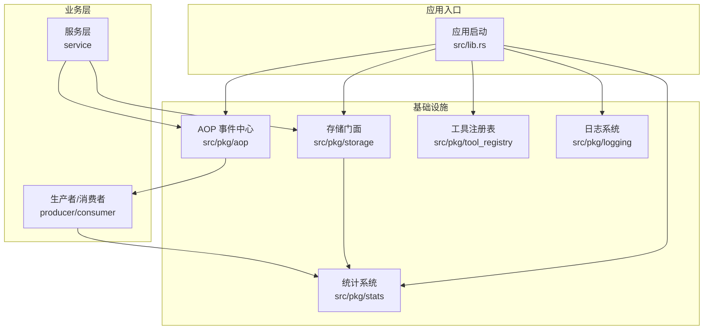
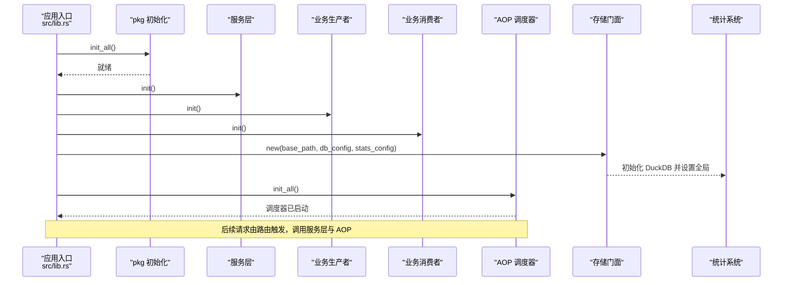
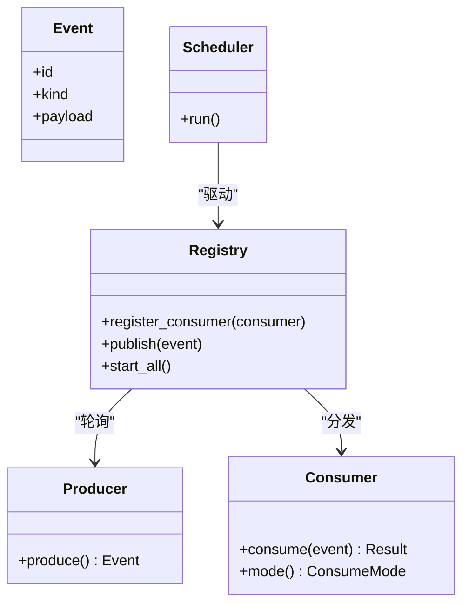
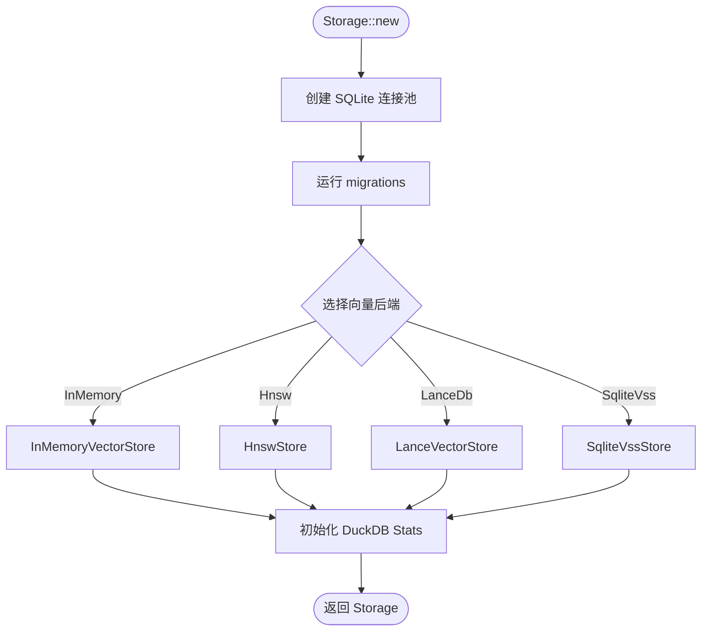
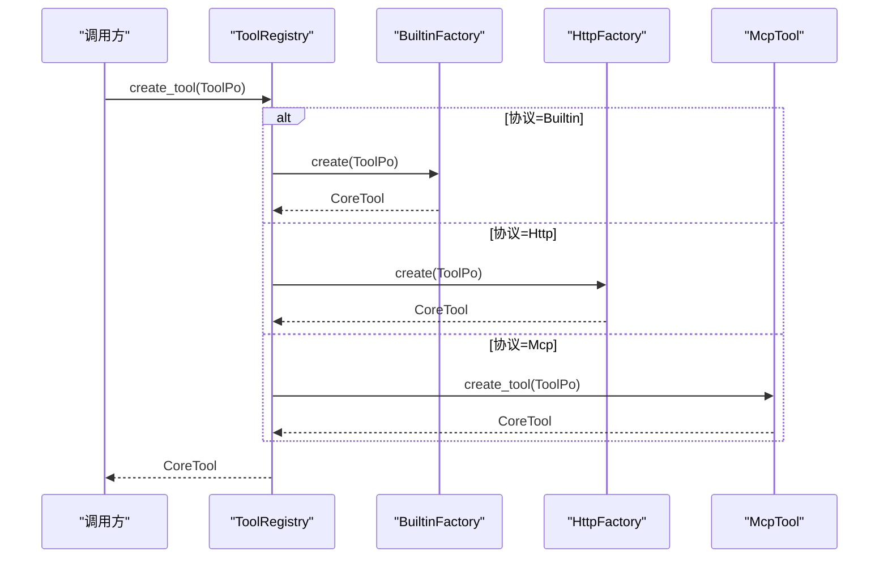
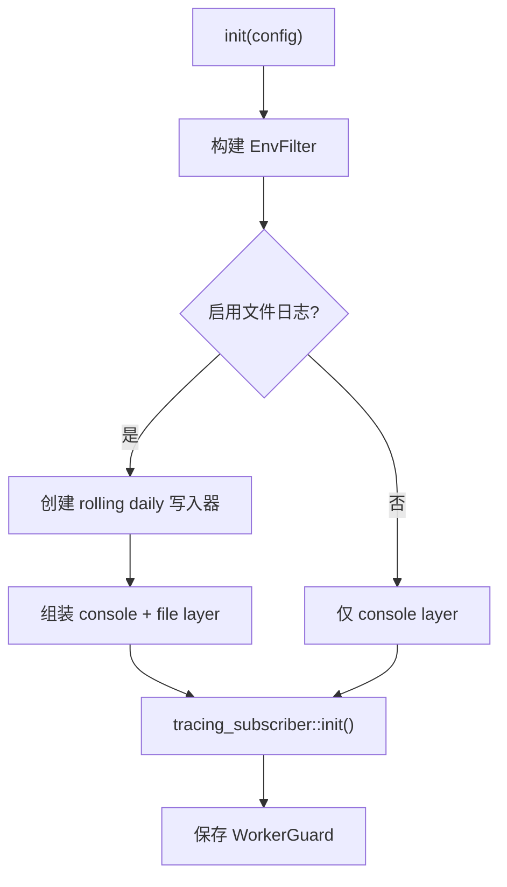
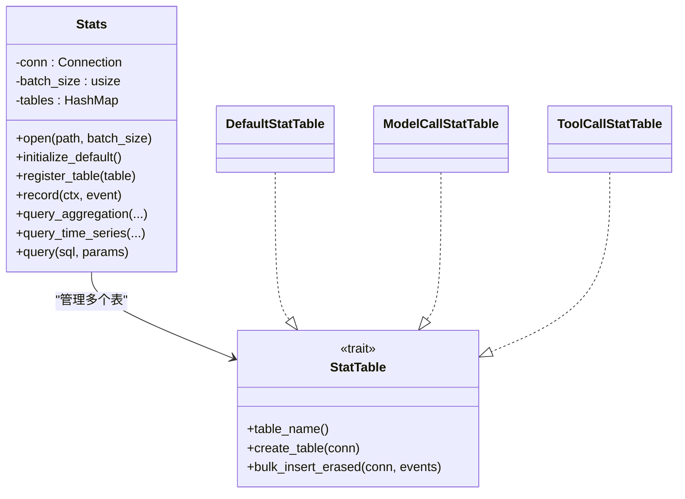
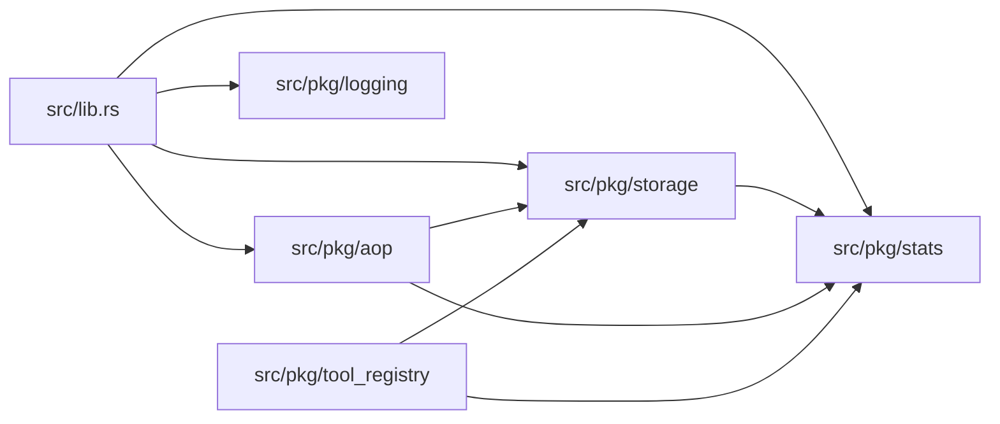

# 基础设施

<cite>
**本文引用的文件**
- [src/lib.rs](src/lib.rs)
- [Cargo.toml](Cargo.toml)
- [src/pkg/aop/mod.rs](src/pkg/aop/mod.rs)
- [src/pkg/aop/core/mod.rs](src/pkg/aop/core/mod.rs)
- [src/pkg/storage/mod.rs](src/pkg/storage/mod.rs)
- [src/pkg/storage/vector.rs](src/pkg/storage/vector.rs)
- [src/pkg/tool_registry/mod.rs](src/pkg/tool_registry/mod.rs)
- [src/pkg/tool_registry/handler_adapter/mod.rs](src/pkg/tool_registry/handler_adapter/mod.rs)
- [src/pkg/tool_tracing/mod.rs](src/pkg/tool_tracing/mod.rs)
- [src/pkg/stats/mod.rs](src/pkg/stats/mod.rs)
- [src/pkg/stats/collector.rs](src/pkg/stats/collector.rs)
- [src/pkg/logging.rs](src/pkg/logging.rs)
</cite>

## 目录
1. [简介](#简介)
2. [项目结构](#项目结构)
3. [核心组件](#核心组件)
4. [架构总览](#架构总览)
5. [详细组件分析](#详细组件分析)
6. [依赖关系分析](#依赖关系分析)
7. [性能考量](#性能考量)
8. [故障排查指南](#故障排查指南)
9. [结论](#结论)
10. [附录](#附录)

## 简介
本文件面向 AI Orz 的基础设施层，系统性说明 AOP 事件系统、存储系统、工具注册表、日志与统计等核心组件的设计理念、实现原理、配置选项与使用方法。文档包含架构图、数据流图与集成示例，解释组件间的协作关系与扩展机制，帮助开发者快速上手并安全扩展。

## 项目结构
AI Orz 的基础设施集中在 src/pkg 下，围绕“可插拔、可观测、可扩展”的目标组织：
- AOP 事件中心：解耦生产与消费，提供统一的事件分发与调度能力
- 存储门面：统一 SQLite 连接池、向量存储后端与统计模块的初始化与访问
- 工具注册表：统一管理内置、HTTP、MCP 等协议的工具工厂与实例化
- 日志系统：基于 tracing 的多输出（控制台/文件）、JSON 格式、按日滚动与清理
- 统计系统：DuckDB 持久化 + 内存运行时统计，支持批量写入与聚合查询

图表来源
- [src/lib.rs:114-175](src/lib.rs#L114-L175)
- [src/pkg/aop/mod.rs:1-61](src/pkg/aop/mod.rs#L1-L61)
- [src/pkg/storage/mod.rs:50-122](src/pkg/storage/mod.rs#L50-L122)
- [src/pkg/stats/mod.rs:1-57](src/pkg/stats/mod.rs#L1-L57)

章节来源
- [src/lib.rs:114-175](src/lib.rs#L114-L175)
- [Cargo.toml:17-71](Cargo.toml#L17-L71)

## 核心组件
- AOP 事件系统：以 Event/Producer/Consumer/Registry/Scheduler 为核心，提供异步事件分发与调度，业务通过注册消费者参与处理
- 存储系统：封装 SQLite 连接池、向量存储后端（InMemory/HNSW/LanceDB/SQLite VSS）与 Stats 初始化；对外暴露 Storage 门面
- 工具注册表：维护各协议的工厂映射，按 ToolPo 动态创建 CoreTool 实例；支持将 HTTP Handler 适配为工具
- 日志系统：tracing 多后端（控制台/文件），支持 JSON 格式、按日滚动、保留天数清理；提供带上下文的日志宏
- 统计系统：DuckDB 持久化 + 内存运行时统计；提供批量写入、聚合查询、时间序列查询与全局单例访问

章节来源
- [src/pkg/aop/mod.rs:1-61](src/pkg/aop/mod.rs#L1-L61)
- [src/pkg/storage/mod.rs:50-122](src/pkg/storage/mod.rs#L50-L122)
- [src/pkg/tool_registry/mod.rs:29-132](src/pkg/tool_registry/mod.rs#L29-L132)
- [src/pkg/logging.rs:23-124](src/pkg/logging.rs#L23-L124)
- [src/pkg/stats/mod.rs:1-57](src/pkg/stats/mod.rs#L1-L57)

## 架构总览
应用启动时依次完成：配置加载 → pkg 初始化 → 服务层初始化 → 业务生产者/消费者注册 → 基础数据初始化 → AOP 统计 Hook 安装 → AOP 调度器启动 → 路由与服务监听。

图表来源
- [src/lib.rs:114-175](src/lib.rs#L114-L175)
- [src/pkg/storage/mod.rs:50-122](src/pkg/storage/mod.rs#L50-L122)
- [src/pkg/stats/mod.rs:152-171](src/pkg/stats/mod.rs#L152-L171)

## 详细组件分析

### AOP 事件系统
设计理念
- 纯框架层：不感知业务实体，仅负责事件流转与调度
- 解耦生产与消费：发布方只关心事件，订阅方在 consumer::init 中注册
- 可插拔队列：底层队列抽象，便于替换或扩展

关键类型与职责
- Event/EventKind：事件数据结构与类型标识
- Producer：事件生产者接口
- Consumer/ConsumeMode：消费者接口与消费模式
- Registry：事件注册、分发与调度
- Scheduler：轮询生产者与异步消费者 worker

图表来源
- [src/pkg/aop/core/mod.rs:1-14](src/pkg/aop/core/mod.rs#L1-L14)
- [src/pkg/aop/mod.rs:24-61](src/pkg/aop/mod.rs#L24-L61)

使用要点
- 发布事件：aop::publish(event).await
- 注册消费者：registry().register_consumer(Arc::new(MyConsumer))
- 启动调度器：aop::init_all().await

章节来源
- [src/pkg/aop/mod.rs:1-61](src/pkg/aop/mod.rs#L1-L61)
- [src/pkg/aop/core/mod.rs:1-14](src/pkg/aop/core/mod.rs#L1-L14)

### 存储系统
设计理念
- 统一门面：Storage 聚合 SQLite 连接池、向量存储与统计模块
- 可插拔向量后端：根据配置选择 InMemory/HNSW/LanceDB/SQLite VSS
- 自动迁移：启动时运行 migrations，确保数据库结构一致

核心流程
- 创建 Storage：初始化 SQLite 连接池、运行迁移、选择向量后端、初始化 DuckDB Stats
- 暴露 sqlite()/vector()/stats() 访问器
- 提供全局单例 get()/init() 用于无上下文场景

图表来源
- [src/pkg/storage/mod.rs:50-122](src/pkg/storage/mod.rs#L50-L122)

向量存储抽象
- VectorStore Trait：定义集合管理、upsert/search/get/delete/clear/flush 等通用操作
- 多后端实现：SqliteVssStore、InMemoryVectorStore、HnswStore、LanceVectorStore

章节来源
- [src/pkg/storage/mod.rs:50-122](src/pkg/storage/mod.rs#L50-L122)
- [src/pkg/storage/vector.rs:18-74](src/pkg/storage/vector.rs#L18-L74)
- [src/pkg/storage/vector.rs:76-291](src/pkg/storage/vector.rs#L76-L291)

### 工具注册表
设计理念
- 工厂模式：注册的是工厂而非实例，按 ToolPo 动态创建，注入 DB 配置（名称、描述等）
- 协议隔离：内置、HTTP、MCP 各自独立存储与创建逻辑
- Handler 适配：可将现有 HTTP Handler 直接作为工具，保证用户与 LLM 行为一致

核心能力
- register_builtin_factory：注册内置工具工厂
- create_tool：按协议分派到对应工厂创建 CoreTool
- unregister/clear_all/list_builtin_ids：生命周期管理

图表来源
- [src/pkg/tool_registry/mod.rs:75-102](src/pkg/tool_registry/mod.rs#L75-L102)

Handler 适配器
- 将 axum Handler 适配为 CoreTool，保持权限校验、参数解析、错误处理复用
- 支持泛型参数与返回值序列化，简化注册

章节来源
- [src/pkg/tool_registry/mod.rs:29-132](src/pkg/tool_registry/mod.rs#L29-L132)
- [src/pkg/tool_registry/handler_adapter/mod.rs:1-255](src/pkg/tool_registry/handler_adapter/mod.rs#L1-L255)

### 日志系统
设计理念
- 统一日志宏：log_info/log_warn/log_error/log_debug 支持带/不带上下文两种模式
- 多输出：控制台与文件同时输出，支持 JSON 格式
- 自动滚动与清理：按日滚动，支持保留天数清理

配置项
- logging.format：json 或 text
- logging.enable_file_log：是否启用文件日志
- logging.retention_days：日志保留天数

图表来源
- [src/pkg/logging.rs:23-124](src/pkg/logging.rs#L23-L124)

章节来源
- [src/lib.rs:11-98](src/lib.rs#L11-L98)
- [src/pkg/logging.rs:23-124](src/pkg/logging.rs#L23-L124)

### 统计系统
设计理念
- 双层实现：DuckDB 持久化（跨重启保留）+ 内存运行时统计（零 DB 依赖）
- 批量写入：达到批大小自动 flush，降低 IO 压力
- 灵活查询：聚合查询、时间序列查询、自定义 SQL 执行

核心 API
- Stats::open/initialize_default/register_table：打开数据库、注册表
- record/record_with_table：记录事件
- query_aggregation/query_time_series/query：查询与分析
- global_stats/init_global_stats：全局单例访问

图表来源
- [src/pkg/stats/collector.rs:82-132](src/pkg/stats/collector.rs#L82-L132)
- [src/pkg/stats/mod.rs:88-150](src/pkg/stats/mod.rs#L88-L150)

章节来源
- [src/pkg/stats/mod.rs:1-57](src/pkg/stats/mod.rs#L1-L57)
- [src/pkg/stats/collector.rs:102-132](src/pkg/stats/collector.rs#L102-L132)
- [src/pkg/stats/collector.rs:195-294](src/pkg/stats/collector.rs#L195-L294)
- [src/pkg/stats/collector.rs:314-658](src/pkg/stats/collector.rs#L314-L658)

### 工具追踪
设计理念
- 结构化日志：ToolCallEntry/ToolCallStatus 提供统一的结构化条目
- 持久化历史：Daily JSONL 日志记录工具调用历史
- 敏感信息脱敏：redact_trace_values_for_tool 对 HTTP/MCP 工具进行脱敏

章节来源
- [src/pkg/tool_tracing/mod.rs:1-13](src/pkg/tool_tracing/mod.rs#L1-L13)

## 依赖关系分析
- 应用入口依赖 pkg 初始化、服务层、AOP、存储、日志、统计
- AOP 依赖业务 producer/consumer 注册，并通过 registry 调度
- 存储门面依赖 sqlx/sqlite、duckdb/stats、向量存储后端
- 工具注册表依赖协议工厂（内置/HTTP/MCP）与 handler 适配器
- 统计系统依赖 duckdb，提供全局单例供无上下文场景使用

图表来源
- [src/lib.rs:114-175](src/lib.rs#L114-L175)
- [src/pkg/storage/mod.rs:50-122](src/pkg/storage/mod.rs#L50-L122)
- [src/pkg/stats/mod.rs:152-171](src/pkg/stats/mod.rs#L152-L171)

章节来源
- [Cargo.toml:17-71](Cargo.toml#L17-L71)
- [src/lib.rs:114-175](src/lib.rs#L114-L175)

## 性能考量
- 向量存储后端选择
  - InMemory：零系统依赖，适合开发与轻量场景
  - HNSW：高性能近似最近邻索引，适合大规模检索
  - LanceDB：嵌入式向量数据库，适合复杂查询与持久化
  - SQLite VSS：需要系统依赖，注意扩展加载失败时的降级策略
- 统计写入批大小：合理设置 batch_size 平衡延迟与 IO
- 日志滚动与保留：按日滚动避免大文件，设置 retention_days 控制磁盘占用
- AOP 调度：异步消费者 worker 与生产者轮询需匹配负载，避免积压

[本节为通用指导，无需具体文件引用]

## 故障排查指南
- 日志未输出到文件
  - 检查 logging.enable_file_log 与 log_dir 是否存在
  - 确认 tracing_appender 的 WorkerGuard 未被提前 drop
- 向量存储初始化失败
  - SQLite VSS：确认 vss0 扩展加载成功，否则可能降级
  - HNSW/LanceDB：检查路径与权限
- 统计查询为空
  - 确认已调用 initialize_default 与 register_table
  - 检查 batch_size 与 flush_all 调用时机
- AOP 事件无消费者
  - 确认 consumer::init 中已注册消费者
  - 确认 aop::init_all 已启动调度器

章节来源
- [src/pkg/logging.rs:23-124](src/pkg/logging.rs#L23-L124)
- [src/pkg/storage/vector.rs:245-262](src/pkg/storage/vector.rs#L245-L262)
- [src/pkg/stats/collector.rs:116-132](src/pkg/stats/collector.rs#L116-L132)
- [src/pkg/aop/mod.rs:53-61](src/pkg/aop/mod.rs#L53-L61)

## 结论
AI Orz 的基础设施以“可插拔、可观测、可扩展”为核心目标，通过 AOP 事件系统解耦业务、存储门面统一数据访问、工具注册表规范化工具生命周期、日志与统计提供完整可观测性。开发者可基于这些组件快速构建稳定、可维护的业务功能，并在需要时平滑扩展新的后端与能力。

[本节为总结，无需具体文件引用]

## 附录
- 配置建议
  - 向量存储：开发阶段使用 InMemory，生产推荐 HNSW 或 LanceDB
  - 日志格式：生产环境建议使用 JSON 以便集中分析
  - 统计批大小：根据 QPS 调整，避免频繁 flush
- 扩展指引
  - 新增向量后端：实现 VectorStore Trait 并在 Storage::new 中接入
  - 新增统计表：实现 StatTable Trait 并注册到 Stats
  - 新增工具协议：实现对应工厂并在 ToolRegistry 中分派

[本节为通用指导，无需具体文件引用]