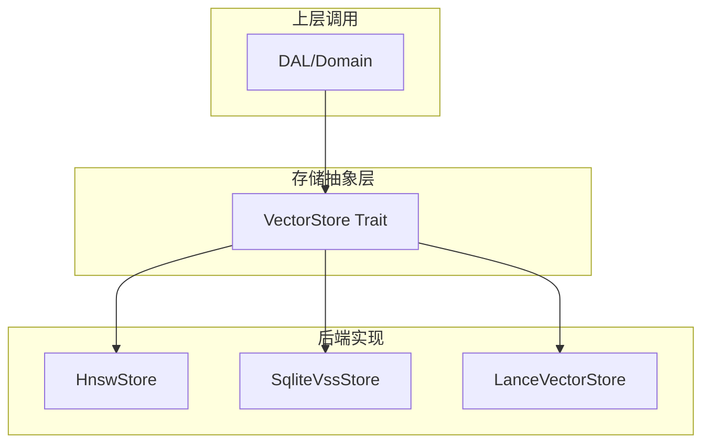
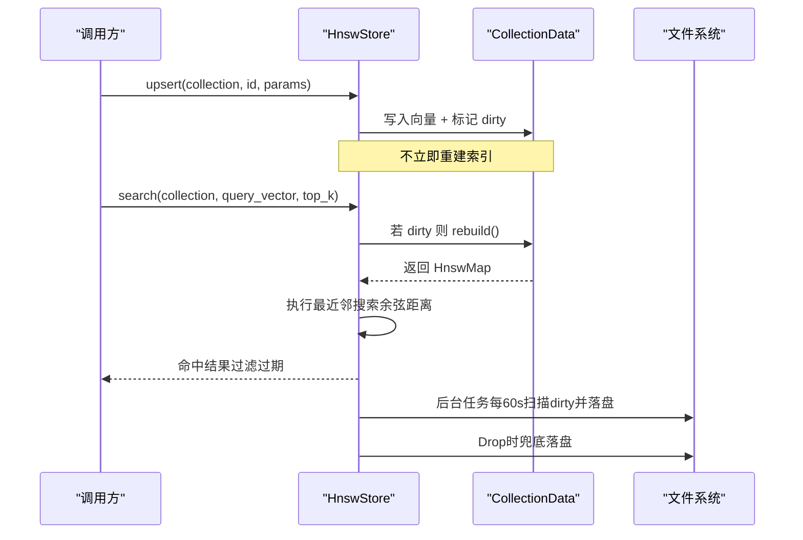
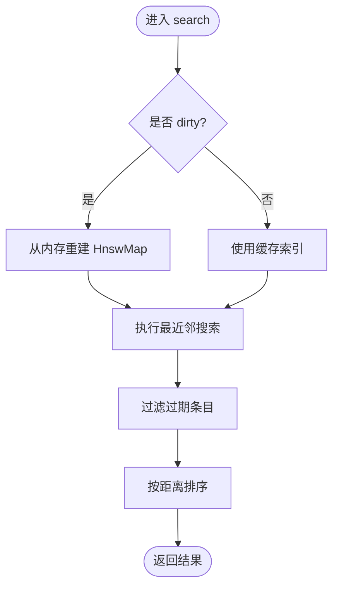
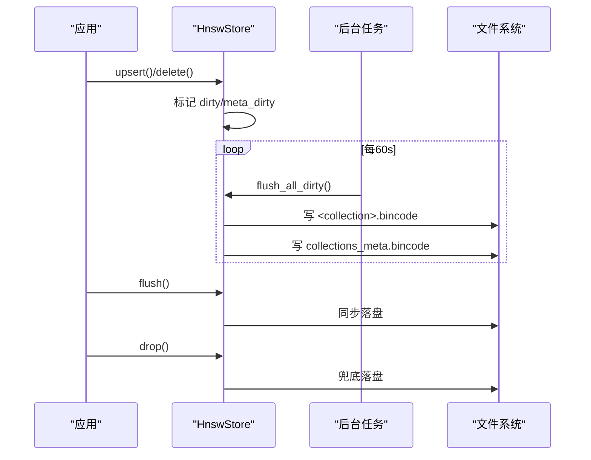
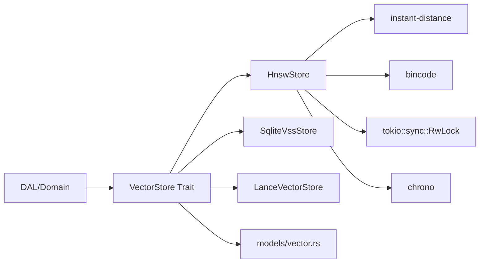

# HNSW 索引存储后端

<cite>
**本文引用的文件**
- [hnsw.rs](src/pkg/storage/hnsw.rs)
- [vector.rs](src/pkg/storage/vector.rs)
- [lance.rs](src/pkg/storage/lance.rs)
- [vector_search_architecture.md](docs/vector_search_architecture.md)
- （2026-09-04 清理：superpowers 目录已归档，待 doc-maintainer 跟进）
- [vector.rs（模型定义）](src/models/vector.rs)
</cite>

## 目录
1. [简介](#简介)
2. [项目结构](#项目结构)
3. [核心组件](#核心组件)
4. [架构总览](#架构总览)
5. [详细组件分析](#详细组件分析)
6. [依赖关系分析](#依赖关系分析)
7. [性能与参数调优](#性能与参数调优)
8. [故障排查指南](#故障排查指南)
9. [结论](#结论)
10. [附录](#附录)

## 简介
本技术文档聚焦于 HNSW 向量存储后端的实现与使用，围绕 HnswStore 在 Rust 中的落地展开：阐述 HNSW 的核心思想、HnswStore 的构建流程、内存管理与持久化策略（含 flush 机制）、向量插入/更新/删除/搜索的具体实现，以及与 SQLite VSS 的对比和适用场景。同时给出基于仓库现有实现的优化建议与基准思路。

## 项目结构
本项目采用分层架构：存储抽象位于 pkg/storage，业务 DAO/DAL 组合调用存储层；向量搜索统一通过 VectorStore trait 接入不同后端（HnswStore、SqliteVssStore、LanceVectorStore）。HNSW 后端以纯 Rust 实现，零系统依赖，支持余弦距离与 bincode 持久化。



图表来源
- [vector.rs:18-74](src/pkg/storage/vector.rs#L18-L74)
- [hnsw.rs:149-166](src/pkg/storage/hnsw.rs#L149-L166)
- [lance.rs:26-33](src/pkg/storage/lance.rs#L26-L33)

章节来源
- [vector.rs:1-74](src/pkg/storage/vector.rs#L1-L74)
- [vector_search_architecture.md:161-206](docs/vector_search_architecture.md#L161-L206)

## 核心组件
- VectorStore trait：定义统一的向量存储接口，包括集合初始化、upsert、search、get、delete、clear_collection、flush 等。
- HnswStore：基于 instant-distance 的纯 Rust HNSW 实现，支持懒重建索引、余弦距离、bincode 持久化与后台定时落盘。
- SqliteVssStore：基于 SQLite vss0 扩展的向量存储，适合已有 SQLite 生态的场景。
- LanceVectorStore：基于 LanceDB 的高性能嵌入式向量数据库，生产级列式存储。

章节来源
- [vector.rs:18-74](src/pkg/storage/vector.rs#L18-L74)
- [hnsw.rs:149-166](src/pkg/storage/hnsw.rs#L149-L166)
- [lance.rs:26-33](src/pkg/storage/lance.rs#L26-L33)

## 架构总览
HnswStore 将每个 collection 的数据与索引分离管理：数据以 HashMap 驻留内存，索引按需重建并缓存；元数据与集合信息通过 bincode 序列化到磁盘，后台任务定期落盘，Drop 兜底保证一致性。



图表来源
- [hnsw.rs:442-491](src/pkg/storage/hnsw.rs#L442-L491)
- [hnsw.rs:493-543](src/pkg/storage/hnsw.rs#L493-L543)
- [hnsw.rs:344-388](src/pkg/storage/hnsw.rs#L344-L388)
- [hnsw.rs:403-430](src/pkg/storage/hnsw.rs#L403-L430)

## 详细组件分析

### HnswStore 类图与职责
```mermaid
classDiagram
class HnswStore {
-base_path : PathBuf
-collections : RwLock<HashMap<String, CollectionData>>
-collections_meta : RwLock<HashMap<String, CollectionMeta>>
-meta_dirty : RwLock<bool>
-flush_task : Option<JoinHandle>
+new() Result
+with_path(base_path) Result
+init_collection(collection, dimensions) Result
+upsert(collection, id, params) Result
+search(collection, query_vector, top_k) Result
+get(collection, id) Result<Option<VectorRow>>
+delete(collection, id) Result
+clear_collection(collection) Result
+flush() Result
+get_collection_model_provider_id(collection) Result<Option<String>>
+set_collection_model_provider_id(collection, model_provider_id) Result
}
class CollectionData {
-vectors : HashMap<String, (FloatPoint, VectorRow)>
-deleted : HashSet<String>
-dimensions : i32
-cached_index : Option<HnswMap<FloatPoint, String>>
-dirty : bool
+new(dimensions) Self
+rebuild() void
}
class FloatPoint {
-data : Vec<f32>
+distance(other) f32
}
HnswStore --> CollectionData : "管理多个集合"
CollectionData --> FloatPoint : "封装点与余弦距离"
```

图表来源
- [hnsw.rs:20-34](src/pkg/storage/hnsw.rs#L20-L34)
- [hnsw.rs:36-62](src/pkg/storage/hnsw.rs#L36-L62)
- [hnsw.rs:149-166](src/pkg/storage/hnsw.rs#L149-L166)

章节来源
- [hnsw.rs:1-617](src/pkg/storage/hnsw.rs#L1-L617)

### HNSW 算法与懒重建
- 核心思想：HNSW（Hierarchical Navigable Small World）通过多层导航图加速近似最近邻搜索，具备 O(logN) 查询复杂度与高召回率。
- 当前实现约束：instant-distance 0.6.1 不支持增量插入，因此采用“懒重建”策略：
  - 写入（upsert/delete）仅修改内存数据结构并标记 dirty。
  - 首次搜索或脏状态存在时，从内存数据重建 HnswMap 索引，再执行搜索。
- 距离度量：自定义 FloatPoint 实现 Point trait，使用余弦相似度 1 - cos(θ)。



图表来源
- [hnsw.rs:493-543](src/pkg/storage/hnsw.rs#L493-L543)
- [hnsw.rs:107-124](src/pkg/storage/hnsw.rs#L107-L124)

章节来源
- [hnsw.rs:107-124](src/pkg/storage/hnsw.rs#L107-L124)
- [hnsw.rs:493-543](src/pkg/storage/hnsw.rs#L493-L543)

### 内存管理与持久化策略
- 内存布局：每个 collection 维护 vectors（HashMap）、deleted（HashSet）、cached_index（HnswMap）、dirty flag。
- 持久化：
  - 每个 collection 序列化为独立 .bincode 文件。
  - 集合元数据（model_provider_id、dimensions、vector_count、updated_at）集中保存在 collections_meta.bincode。
  - 后台任务每 60 秒扫描 dirty 并落盘；Drop 时兜底落盘。
  - 冷启动时扫描目录加载已有索引，避免重启后 lazy rebuild。
- flush 操作：
  - 显式 flush() 触发一次全量脏数据落盘。
  - 后台任务自动周期性落盘。
  - Drop 兜底确保进程退出时尽可能落盘。



图表来源
- [hnsw.rs:344-388](src/pkg/storage/hnsw.rs#L344-L388)
- [hnsw.rs:403-430](src/pkg/storage/hnsw.rs#L403-L430)
- [hnsw.rs:473-489](src/pkg/storage/hnsw.rs#L473-L489)

章节来源
- [hnsw.rs:344-388](src/pkg/storage/hnsw.rs#L344-L388)
- [hnsw.rs:403-430](src/pkg/storage/hnsw.rs#L403-L430)
- [hnsw.rs:473-489](src/pkg/storage/hnsw.rs#L473-L489)

### 向量 CRUD 与搜索实现要点
- 初始化集合：ensure_collection 创建空集合并记录维度。
- 插入/更新：构造 FloatPoint 与 VectorRow，写入 vectors，移除 deleted 标记，设置 dirty，更新集合元数据。
- 删除：加入 deleted set，标记 dirty。
- 获取：读取 vectors，排除 deleted。
- 清空：重置集合为新的空结构。
- 搜索：若 dirty 则重建索引；执行最近邻搜索；过滤过期条目；按距离排序返回。

章节来源
- [hnsw.rs:390-400](src/pkg/storage/hnsw.rs#L390-L400)
- [hnsw.rs:442-491](src/pkg/storage/hnsw.rs#L442-L491)
- [hnsw.rs:545-572](src/pkg/storage/hnsw.rs#L545-L572)
- [hnsw.rs:493-543](src/pkg/storage/hnsw.rs#L493-L543)

### 与 SQLite VSS 的对比与适用场景
- HnswStore：
  - 优势：纯 Rust 零系统依赖；内存驻留+懒重建；可配置持久化；易于集成测试与跨平台部署。
  - 适用：中小规模数据集、快速迭代、无外部依赖环境、需要灵活持久化策略。
- SqliteVssStore：
  - 优势：利用 SQLite vss0 扩展，SQL 语义强，便于与关系型数据结合。
  - 限制：需要系统依赖（vss0 扩展），部分实现中不存储原始向量，需额外处理。
  - 适用：已有 SQLite 生态、希望 SQL 直接进行向量检索的场景。
- LanceVectorStore：
  - 优势：生产级高性能、列式存储、内置索引能力。
  - 适用：大规模数据、生产环境、对吞吐与延迟要求较高。

章节来源
- [vector.rs:76-235](src/pkg/storage/vector.rs#L76-L235)
- [lance.rs:1-294](src/pkg/storage/lance.rs#L1-L294)
- [vector_search_architecture.md:178-184](docs/vector_search_architecture.md#L178-L184)

## 依赖关系分析
- HnswStore 依赖 instant-distance 库提供 HnswMap/Builder/Search；使用 bincode 进行序列化；使用 tokio::sync::RwLock 保证并发安全；使用 chrono 记录时间戳。
- VectorStore trait 作为统一抽象，使上层 DAL/Domain 无需感知具体后端。
- 模型层 vector.rs 定义了通用数据结构（VectorRow、VectorSearchHit、VectorIndexParams、Vectorizable 等），被各后端复用。



图表来源
- [hnsw.rs:10-18](src/pkg/storage/hnsw.rs#L10-L18)
- [vector.rs:18-74](src/pkg/storage/vector.rs#L18-L74)
- [vector.rs:1-192](src/models/vector.rs#L1-L192)

章节来源
- [hnsw.rs:10-18](src/pkg/storage/hnsw.rs#L10-L18)
- [vector.rs:18-74](src/pkg/storage/vector.rs#L18-L74)
- [vector.rs:1-192](src/models/vector.rs#L1-L192)

## 性能与参数调优
- 当前实现未暴露 HNSW 构建参数（如 efConstruction、M、efSearch），因为 instant-distance 0.6.1 的 Builder 默认构建索引，且不支持增量插入。
- 影响性能的实践：
  - 控制集合大小：单个 collection 越大，重建成本越高；可按业务维度拆分集合以降低重建开销。
  - 合理设置 top_k：减少不必要的候选数量可降低排序与过滤成本。
  - 控制过期策略：及时清理过期向量可减少无效搜索结果与重建负担。
  - 批量写入后等待一次重建：在高频写入后，集中触发一次搜索以完成重建，避免频繁重建。
- 与 SQLite VSS/LanceDB 的对比：
  - HnswStore 适合轻量、零依赖、可定制持久化的场景；SQLite VSS 适合 SQL 原生向量检索；LanceDB 适合大规模生产负载。
- 基准建议：
  - 使用仓库内集成测试模式（忽略真实 API 的测试）验证基本路径；对于真实向量搜索，参考 tests/integration 中 ignore 用例，在本地配置 TEST_EMBEDDING_API_KEY 运行端到端验证。
  - 针对 HnswStore 的性能评估，可设计压测脚本测量 upsert/search 耗时与重建频率，结合日志观察 dirty 标志变化与落盘周期。

章节来源
- [vector_search_architecture.md:425-463](docs/vector_search_architecture.md#L425-L463)
- （2026-09-04 清理：superpowers 目录已归档，待 doc-maintainer 跟进）

## 故障排查指南
- 搜索结果为空：
  - 检查集合是否存在与维度是否匹配；确认已执行 init_collection。
  - 若 dirty 且尚未重建，首次搜索会重建；若仍为空，检查是否有有效向量未被删除。
- 持久化失败：
  - 检查 hnsw_index_dir 权限与磁盘空间；查看后台任务日志与 Drop 兜底落盘日志。
- 过期过滤导致结果缺失：
  - 确认 expire_at 设置是否正确；搜索时会过滤过期条目。
- 切换 Embedding Provider 冲突：
  - Domain 层校验唯一性；若冲突返回 409，前端需引导用户二次确认后走 switch 接口并异步重建索引。

章节来源
- [hnsw.rs:493-543](src/pkg/storage/hnsw.rs#L493-L543)
- [hnsw.rs:344-388](src/pkg/storage/hnsw.rs#L344-L388)
- [hnsw.rs:403-430](src/pkg/storage/hnsw.rs#L403-L430)
- [vector_search_architecture.md:448-463](docs/vector_search_architecture.md#L448-L463)

## 结论
HnswStore 提供了纯 Rust 的 HNSW 向量存储后端，具备懒重建、余弦距离、bincode 持久化与后台落盘能力，适合中小规模与零依赖场景。通过 VectorStore 抽象，上层可无缝切换后端。与 SQLite VSS 相比，HnswStore 更轻量、易部署；与 LanceDB 相比，后者更适合大规模生产负载。建议在业务侧合理拆分集合、控制过期策略与 top_k，并结合后台任务与兜底落盘保障数据一致性。

## 附录
- 关键数据结构路径：
  - VectorRow、VectorSearchHit、VectorIndexParams、Vectorizable：[vector.rs（模型定义）:1-192](src/models/vector.rs#L1-L192)
- 后端实现路径：
  - HnswStore：[hnsw.rs:1-617](src/pkg/storage/hnsw.rs#L1-L617)
  - SqliteVssStore：[vector.rs:76-235](src/pkg/storage/vector.rs#L76-L235)
  - LanceVectorStore：[lance.rs:1-294](src/pkg/storage/lance.rs#L1-L294)
- 架构与设计文档：
  - 向量搜索架构：[vector_search_architecture.md:161-206](docs/vector_search_architecture.md#L161-L206)
  - HNSW 增强计划：（2026-09-04 清理：superpowers 目录已归档，待 doc-maintainer 跟进）