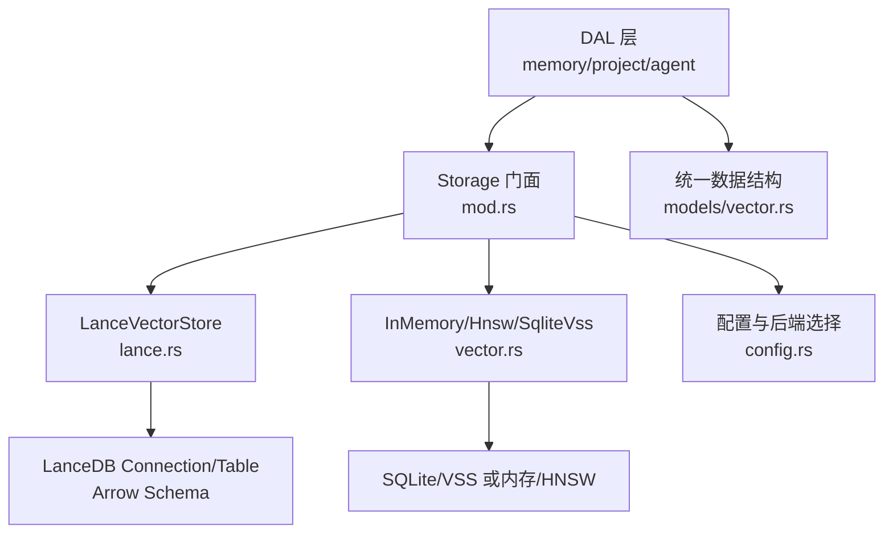
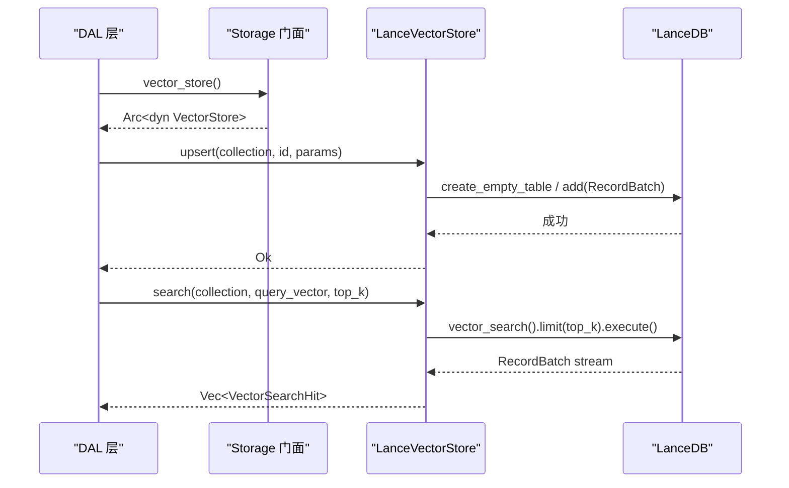
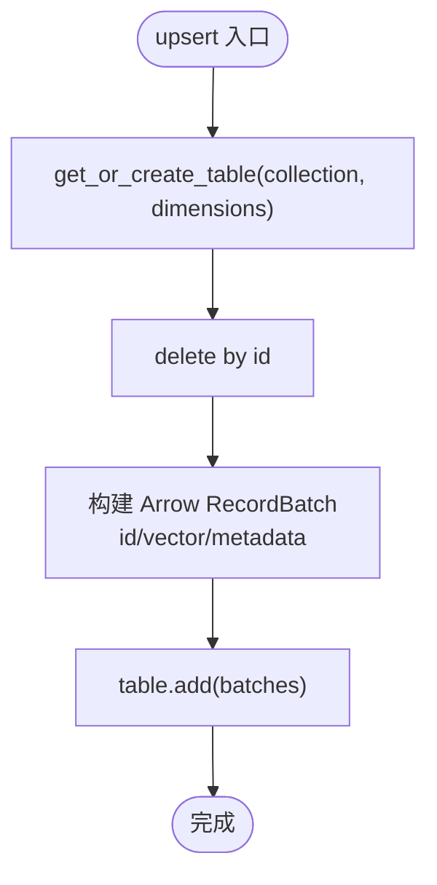
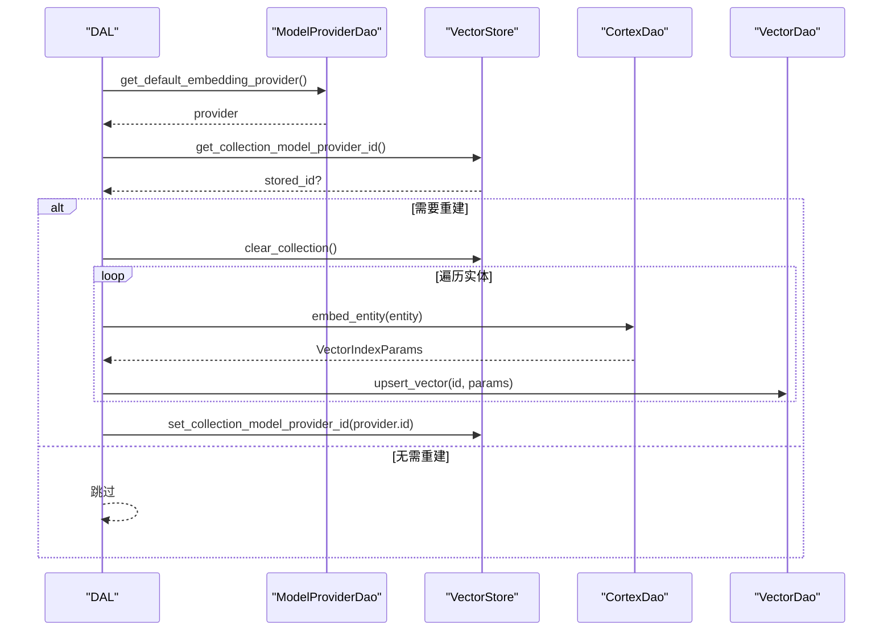
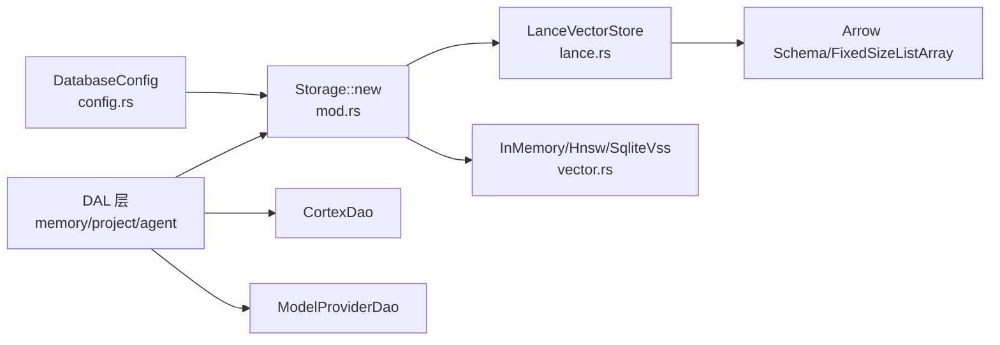

# LanceDB 存储后端

<cite>
**本文引用的文件**
- [src/pkg/storage/lance.rs](src/pkg/storage/lance.rs)
- [src/pkg/storage/mod.rs](src/pkg/storage/mod.rs)
- [src/pkg/storage/vector.rs](src/pkg/storage/vector.rs)
- [src/models/vector.rs](src/models/vector.rs)
- [common/src/config.rs](common/src/config.rs)
- [docs/vector_search_architecture.md](docs/vector_search_architecture.md)
- [src/service/dal/memory.rs](src/service/dal/memory.rs)
- [src/service/dal/project.rs](src/service/dal/project.rs)
- [src/service/dal/agent/mod.rs](src/service/dal/agent/mod.rs)
</cite>

## 目录
1. [简介](#简介)
2. [项目结构](#项目结构)
3. [核心组件](#核心组件)
4. [架构总览](#架构总览)
5. [详细组件分析](#详细组件分析)
6. [依赖关系分析](#依赖关系分析)
7. [性能与特性](#性能与特性)
8. [故障排查指南](#故障排查指南)
9. [结论](#结论)
10. [附录：配置与最佳实践](#附录配置与最佳实践)

## 简介
本技术文档聚焦于项目中基于 LanceDB 的向量存储后端实现，系统阐述 LanceVectorStore 的设计与实现原理、与 LanceDB 库的集成方式、数据格式与列式存储优势，以及集合创建、向量插入、语义搜索等核心操作的实现细节。同时覆盖版本控制（通过 model_provider_id 标记）、增量更新（按内容哈希判断是否需要重建）和压缩存储（列式 Arrow 格式）等能力，并对比其他后端（InMemory、HNSW、SQLite VSS）的性能差异与适用场景，最后给出配置示例与最佳实践建议。

## 项目结构
围绕向量存储的关键代码分布在以下位置：
- 存储抽象与多后端选择：src/pkg/storage/mod.rs
- LanceDB 后端实现：src/pkg/storage/lance.rs
- 向量存储 Trait 与其他后端：src/pkg/storage/vector.rs
- 通用数据结构（行、命中结果、索引参数、可向量化实体接口）：src/models/vector.rs
- 配置项（默认后端、路径等）：common/src/config.rs
- DAL 层对向量索引生命周期的编排（重建、查询、写入）：src/service/dal/*.rs
- 向量搜索整体设计说明：docs/vector_search_architecture.md

图表来源
- [src/pkg/storage/mod.rs:56-93](src/pkg/storage/mod.rs#L56-L93)
- [src/pkg/storage/lance.rs:26-62](src/pkg/storage/lance.rs#L26-L62)
- [src/pkg/storage/vector.rs:18-74](src/pkg/storage/vector.rs#L18-L74)
- [src/models/vector.rs:9-67](src/models/vector.rs#L9-L67)
- [common/src/config.rs:78-114](common/src/config.rs#L78-L114)

章节来源
- [src/pkg/storage/mod.rs:56-93](src/pkg/storage/mod.rs#L56-L93)
- [src/pkg/storage/lance.rs:26-62](src/pkg/storage/lance.rs#L26-L62)
- [src/pkg/storage/vector.rs:18-74](src/pkg/storage/vector.rs#L18-L74)
- [src/models/vector.rs:9-67](src/models/vector.rs#L9-L67)
- [common/src/config.rs:78-114](common/src/config.rs#L78-L114)

## 核心组件
- VectorStore Trait：定义统一的向量存储接口，包括初始化集合、upsert、search、get、delete、clear_collection、flush、获取/设置集合的 model_provider_id 等。
- LanceVectorStore：基于 LanceDB 的高性能嵌入式向量数据库实现，使用 Arrow 列式格式持久化，支持 HNSW 索引、元数据过滤、单文件跨平台存储。
- Storage 门面：根据配置动态选择后端（默认 LanceDb），封装 SQLite 连接池、Stats 统计模块，并提供 vector_store() 访问向量存储实例。
- 通用数据结构：VectorRow、VectorSearchHit、VectorIndexParams、VectorMeta、Vectorizable 等，用于跨后端统一表示向量数据与索引参数。

章节来源
- [src/pkg/storage/vector.rs:18-74](src/pkg/storage/vector.rs#L18-L74)
- [src/pkg/storage/lance.rs:26-62](src/pkg/storage/lance.rs#L26-L62)
- [src/pkg/storage/mod.rs:56-93](src/pkg/storage/mod.rs#L56-L93)
- [src/models/vector.rs:9-67](src/models/vector.rs#L9-L67)

## 架构总览
向量搜索采用“索引与数据完全分离”的分层模式：业务 DAO 负责基础数据 CRUD，向量 DAO 仅维护向量索引；DAL 层组合两者实现混合搜索与索引生命周期管理。Storage 门面在启动时根据配置选择具体后端，DAL 通过 RequestContext 获取向量存储实例进行调用。

图表来源
- [src/pkg/storage/mod.rs:56-93](src/pkg/storage/mod.rs#L56-L93)
- [src/pkg/storage/lance.rs:127-199](src/pkg/storage/lance.rs#L127-L199)
- [src/pkg/storage/lance.rs:201-282](src/pkg/storage/lance.rs#L201-L282)

章节来源
- [docs/vector_search_architecture.md:13-43](docs/vector_search_architecture.md#L13-L43)
- [src/pkg/storage/mod.rs:56-93](src/pkg/storage/mod.rs#L56-L93)
- [src/pkg/storage/lance.rs:127-282](src/pkg/storage/lance.rs#L127-L282)

## 详细组件分析

### LanceVectorStore 实现要点
- 连接与表缓存：构造时连接 LanceDB，内部维护 tables 缓存（RwLock<HashMap<String, Arc<Table>>>），懒加载打开或创建表。
- 表 Schema：使用 Arrow Schema 定义固定维度向量列（FixedSizeList<Float32>）及元数据列（id、content_hash、embedding_model、indexed_at、expire_at）。
- Upsert 流程：先删除旧记录（按 id），再构建 RecordBatch 写入新记录。
- 搜索流程：使用 vector_search 执行近似最近邻检索，限制 top_k，收集 RecordBatch 并转换为 VectorSearchHit。
- 读取与清理：支持按 id 查询完整行、清空集合并移除缓存。

图表来源
- [src/pkg/storage/lance.rs:64-123](src/pkg/storage/lance.rs#L64-L123)
- [src/pkg/storage/lance.rs:134-199](src/pkg/storage/lance.rs#L134-L199)

章节来源
- [src/pkg/storage/lance.rs:26-62](src/pkg/storage/lance.rs#L26-L62)
- [src/pkg/storage/lance.rs:64-123](src/pkg/storage/lance.rs#L64-L123)
- [src/pkg/storage/lance.rs:127-199](src/pkg/storage/lance.rs#L127-L199)
- [src/pkg/storage/lance.rs:201-282](src/pkg/storage/lance.rs#L201-L282)
- [src/pkg/storage/lance.rs:284-363](src/pkg/storage/lance.rs#L284-L363)

### 向量存储抽象与多后端
- VectorStore Trait：统一接口，所有后端实现相同方法签名，便于替换与测试隔离。
- 其他后端：
  - InMemoryVectorStore：纯 Rust 内存实现，零系统依赖，适合开发与测试。
  - HnswStore：纯 Rust HNSW 索引，lazy rebuild + 持久化。
  - SqliteVssStore：基于 SQLite VSS 扩展，需要系统依赖，适合已有 SQLite 生态。

章节来源
- [src/pkg/storage/vector.rs:18-74](src/pkg/storage/vector.rs#L18-L74)
- [src/pkg/storage/vector.rs:76-291](src/pkg/storage/vector.rs#L76-L291)

### 通用数据结构
- VectorMeta：内容哈希、模型名称、索引时间、过期时间。
- VectorRow：业务 ID、向量、元数据。
- VectorSearchHit：完整行 + 相似度距离。
- VectorIndexParams：向量、内容哈希、model_provider_id、embedding_model、过期时间。
- Vectorizable：实体决定哪些字段参与向量化、集合名、内容哈希计算、过期策略与重索引判断。

章节来源
- [src/models/vector.rs:9-67](src/models/vector.rs#L9-L67)
- [src/models/vector.rs:94-168](src/models/vector.rs#L94-L168)

### DAL 层索引生命周期与重建
- 重建触发：当 Embedding Provider 切换或集合未记录 model_provider_id 时，DAL 层会清空集合并逐条重新索引。
- 重建流程：查询全量 PO → 生成 embedding → upsert 到向量存储 → 更新集合的 model_provider_id。
- 降级策略：向量化失败仅 warn 降级，不影响主流程。

图表来源
- [src/service/dal/memory.rs:654-799](src/service/dal/memory.rs#L654-L799)
- [src/service/dal/project.rs:740-831](src/service/dal/project.rs#L740-L831)
- [src/service/dal/agent/mod.rs](src/service/dal/agent/mod.rsL879)

章节来源
- [src/service/dal/memory.rs:654-799](src/service/dal/memory.rs#L654-L799)
- [src/service/dal/project.rs:740-831](src/service/dal/project.rs#L740-L831)
- [src/service/dal/agent/mod.rs](src/service/dal/agent/mod.rsL879)

## 依赖关系分析
- Storage 门面依赖配置 DatabaseConfig.vector_store_type 选择后端。
- LanceVectorStore 依赖 lancedb crate 与 Arrow 类型，使用 FixedSizeListArray 存储向量。
- DAL 层依赖 CortexDao 生成 embedding，依赖 ModelProviderDao 获取启用中的 Embedding Provider。
- 通用数据结构位于 models/vector.rs，被各后端与 DAL 共享。

图表来源
- [common/src/config.rs:78-114](common/src/config.rs#L78-L114)
- [src/pkg/storage/mod.rs:56-93](src/pkg/storage/mod.rs#L56-L93)
- [src/pkg/storage/lance.rs:10-14](src/pkg/storage/lance.rs#L10-L14)
- [src/service/dal/memory.rs:654-799](src/service/dal/memory.rs#L654-L799)
- [src/service/dal/project.rs:740-831](src/service/dal/project.rs#L740-L831)
- [src/service/dal/agent/mod.rs](src/service/dal/agent/mod.rsL879)

章节来源
- [common/src/config.rs:78-114](common/src/config.rs#L78-L114)
- [src/pkg/storage/mod.rs:56-93](src/pkg/storage/mod.rs#L56-L93)
- [src/pkg/storage/lance.rs:10-14](src/pkg/storage/lance.rs#L10-L14)

## 性能与特性
- 列式存储与 Arrow：LanceVectorStore 使用 Arrow 列式格式（FixedSizeListArray 存储向量），减少 I/O 与序列化开销，提升批量写入与检索效率。
- HNSW 索引：LanceDB 内置 HNSW 索引，支持百万级向量快速检索；搜索时使用 vector_search 并限制 top_k，降低计算成本。
- 版本控制：通过集合级别的 model_provider_id 标记当前使用的 Embedding Provider，DAL 层在重建前检查是否一致，避免重复重建。
- 增量更新：基于内容哈希（content_hash）判断是否需要重建；若内容未变化则跳过 Embedding API 调用，节省成本。
- 压缩存储：列式存储天然具备压缩优势；结合 LanceDB 的持久化机制，单文件跨平台存储，便于备份与迁移。
- 多后端对比：
  - InMemory：零依赖、开发测试友好，但无持久化与高性能索引。
  - Hnsw：纯 Rust HNSW，lazy rebuild + 持久化，适合中等规模与轻量部署。
  - SqliteVss：依赖系统扩展，适合已有 SQLite 生态且需 SQL 兼容的场景。
  - LanceDb：生产级高性能、列式存储、内置索引，适合大数据集与高并发检索。

章节来源
- [src/pkg/storage/lance.rs:10-14](src/pkg/storage/lance.rs#L10-L14)
- [src/pkg/storage/lance.rs:201-282](src/pkg/storage/lance.rs#L201-L282)
- [src/service/dal/memory.rs:654-799](src/service/dal/memory.rs#L654-L799)
- [src/service/dal/project.rs:740-831](src/service/dal/project.rs#L740-L831)
- [src/service/dal/agent/mod.rs](src/service/dal/agent/mod.rsL879)
- [docs/vector_search_architecture.md:178-184](docs/vector_search_architecture.md#L178-L184)

## 故障排查指南
- 连接与建表错误：LanceDB connect/create table 异常通常由路径权限或 schema 不匹配引起；检查 base_data_path 与 dimensions 一致性。
- 写入失败：RecordBatch 构建或 add 失败可能因向量维度不一致；确保 collection 的 dimensions 与向量长度一致。
- 搜索为空：确认已正确执行 upsert 且 top_k 合理；检查 vector_search 是否返回空流。
- 重建阻塞：同一时刻仅允许一个重建任务；若已有任务运行，新请求应返回冲突或排队提示。
- 降级日志：向量化失败仅 warn，不影响主流程；关注日志中 rebuild_vectors 相关警告定位问题。

章节来源
- [src/pkg/storage/lance.rs:43-62](src/pkg/storage/lance.rs#L43-L62)
- [src/pkg/storage/lance.rs:134-199](src/pkg/storage/lance.rs#L134-L199)
- [src/pkg/storage/lance.rs:201-282](src/pkg/storage/lance.rs#L201-L282)
- [src/service/dal/memory.rs:654-799](src/service/dal/memory.rs#L654-L799)
- [src/service/dal/project.rs:740-831](src/service/dal/project.rs#L740-L831)
- [src/service/dal/agent/mod.rs](src/service/dal/agent/mod.rsL879)

## 结论
LanceVectorStore 通过 LanceDB 的列式存储与 HNSW 索引，为项目提供了高性能、可扩展的向量检索能力。结合 Storage 门面的多后端支持与 DAL 层的索引生命周期管理，系统在版本控制、增量更新与压缩存储方面具备良好工程实践。相比其他后端，LanceDB 在生产环境的大数据集与高并发场景下更具优势。推荐在生产环境中默认使用 LanceDb，并在测试与开发阶段使用 InMemory 以简化依赖。

## 附录：配置与最佳实践
- 配置项
  - database.vector_store_type：选择后端类型，默认 LanceDb。
  - database.db_file_name：核心业务数据库文件名。
  - database.vector_db_file_name：向量数据库文件名（SqliteVss 使用）。
  - database.hnsw_index_dir：HNSW 索引持久化目录（仅 Hnsw 后端生效）。
- 路径约定
  - 基础数据根目录：BASE_DATA_PATH（可通过环境变量覆盖）。
  - LanceDB 数据目录：base_data_path/vectors_lance。
- 最佳实践
  - 统一使用 Vectorizable 接口定义向量化字段与集合名，避免 DAL 层感知 PO 结构。
  - 使用 content_hash 判断是否需要重建，减少不必要的 Embedding API 调用。
  - 在 DAL 层集中处理向量索引生命周期（创建/更新/删除/重建），保持 DAO 职责单一。
  - 搜索时合理设置 top_k，平衡召回率与延迟。
  - 监控重建任务进度与错误日志，确保切换 Embedding Provider 后的索引一致性。

章节来源
- [common/src/config.rs:78-114](common/src/config.rs#L78-L114)
- [common/src/config.rs:244-278](common/src/config.rs#L244-L278)
- [docs/vector_search_architecture.md:342-356](docs/vector_search_architecture.md#L342-L356)
- [src/pkg/storage/mod.rs:56-93](src/pkg/storage/mod.rs#L56-L93)