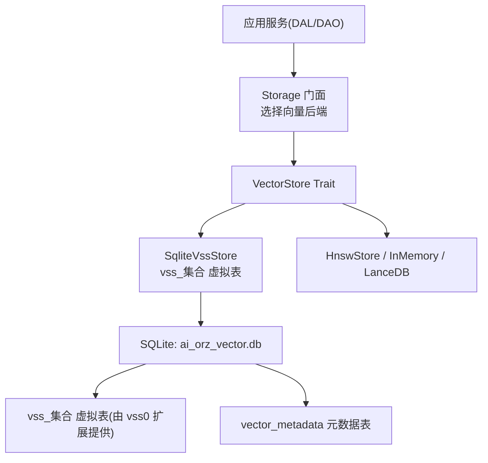
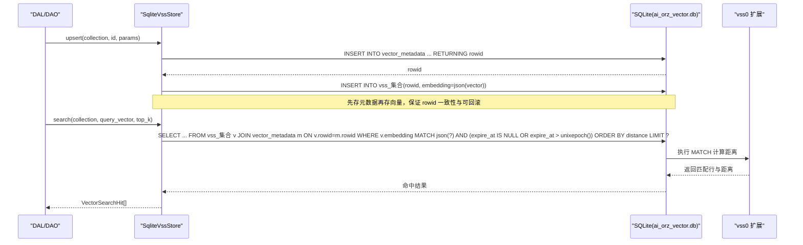
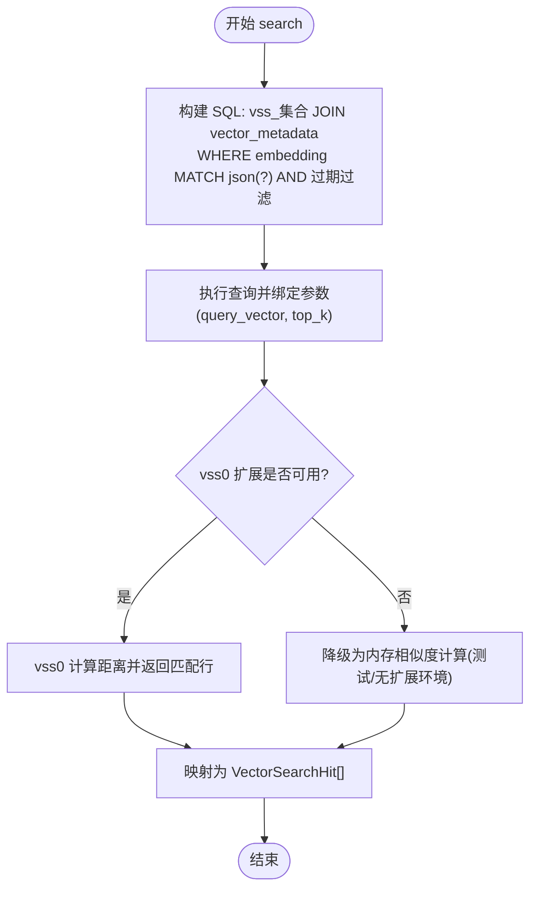
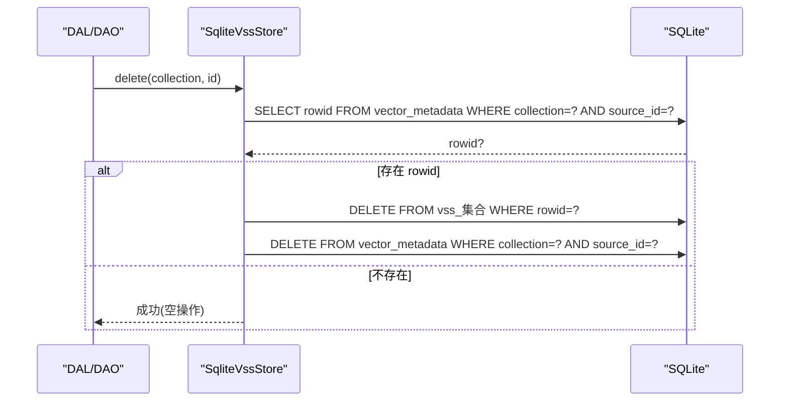
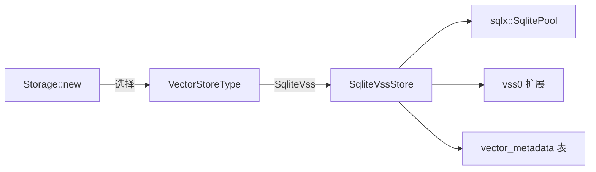

# SQLite VSS 存储后端

<cite>
**本文引用的文件**
- [src/pkg/storage/vector.rs](src/pkg/storage/vector.rs)
- [src/pkg/storage/mod.rs](src/pkg/storage/mod.rs)
- [migrations/20260505000000_vector_metadata.sql](migrations/20260505000000_vector_metadata.sql)
- [src/models/vector.rs](src/models/vector.rs)
- [common/src/config.rs](common/src/config.rs)
- [src/service/dal/skill_test.rs](src/service/dal/skill_test.rs)
</cite>

## 目录
1. [简介](#简介)
2. [项目结构](#项目结构)
3. [核心组件](#核心组件)
4. [架构总览](#架构总览)
5. [详细组件分析](#详细组件分析)
6. [依赖关系分析](#依赖关系分析)
7. [性能考虑](#性能考虑)
8. [故障排除指南](#故障排除指南)
9. [结论](#结论)
10. [附录](#附录)

## 简介
本技术文档聚焦于 SQLite VSS 向量存储后端，围绕 SqliteVssStore 的实现原理、数据库表结构设计、upsert 两步流程、search SQL 构建与执行、以及 get/delete/clear_collection 等操作的实现细节展开。同时提供配置选项、性能调优建议与故障排除指南，帮助读者在生产环境中正确部署与优化基于 SQLite vss0 扩展的向量相似性搜索能力。

## 项目结构
SQLite VSS 向量存储位于通用存储层（pkg/storage），通过统一的 VectorStore Trait 暴露接口，并由 Storage 门面根据配置选择具体后端。SqliteVssStore 使用独立的 SQLite 数据库文件承载 vss0 虚拟表，并通过 vector_metadata 元数据表维护业务 ID 到 rowid 的映射及过期策略。

图表来源
- [src/pkg/storage/mod.rs:79-92](src/pkg/storage/mod.rs#L79-L92)
- [src/pkg/storage/vector.rs:76-92](src/pkg/storage/vector.rs#L76-L92)
- [migrations/20260505000000_vector_metadata.sql:1-16](migrations/20260505000000_vector_metadata.sql#L1-L16)

章节来源
- [src/pkg/storage/mod.rs:1-212](src/pkg/storage/mod.rs#L1-L212)
- [src/pkg/storage/vector.rs:1-291](src/pkg/storage/vector.rs#L1-L291)
- [migrations/20260505000000_vector_metadata.sql:1-16](migrations/20260505000000_vector_metadata.sql#L1-L16)

## 核心组件
- VectorStore Trait：定义初始化集合、upsert、search、get、delete、clear_collection、flush 等统一接口，支持多后端热插拔。
- SqliteVssStore：基于 SQLite vss0 扩展的向量存储实现，负责创建 vss_集合 虚拟表、维护 vector_metadata 元数据、执行 MATCH 查询。
- vector_metadata 元数据表：持久化 collection/source_id/content_hash/model/dimensions/indexed_at/expire_at，并建立按 expire_at 的索引以支持过期清理。
- 配置与门面：Storage::new 根据 DatabaseConfig.vector_store_type 选择 SqliteVssStore；DatabaseConfig 提供 vector_db_file_name 等路径配置。

章节来源
- [src/pkg/storage/vector.rs:18-74](src/pkg/storage/vector.rs#L18-L74)
- [src/pkg/storage/vector.rs:76-291](src/pkg/storage/vector.rs#L76-L291)
- [migrations/20260505000000_vector_metadata.sql:1-16](migrations/20260505000000_vector_metadata.sql#L1-L16)
- [src/pkg/storage/mod.rs:49-133](src/pkg/storage/mod.rs#L49-L133)
- [common/src/config.rs:90-114](common/src/config.rs#L90-L114)
- [common/src/config.rs:178-203](common/src/config.rs#L178-L203)

## 架构总览
SqliteVssStore 将“向量相似度计算”与“业务元数据管理”解耦：
- vss_集合 虚拟表：仅存储 rowid 与 embedding（JSON），由 vss0 扩展提供 MATCH 操作符与距离计算。
- vector_metadata 表：存储 source_id -> rowid 映射、内容哈希、模型信息、维度、过期时间等，用于过滤过期数据、重索引判断、结果元数据返回。

图表来源
- [src/pkg/storage/vector.rs:94-123](src/pkg/storage/vector.rs#L94-L123)
- [src/pkg/storage/vector.rs:126-173](src/pkg/storage/vector.rs#L126-L173)
- [migrations/20260505000000_vector_metadata.sql:1-16](migrations/20260505000000_vector_metadata.sql#L1-L16)

## 详细组件分析

### 数据库表结构设计
- vss_集合 虚拟表：由 vss0 扩展动态创建，列包含隐式 rowid 与 embedding(JSON)。该表不直接存储原始向量文本，只保存 JSON 编码的浮点数组，MATCH 操作符在 SQLite 引擎内完成相似度计算。
- vector_metadata 表：主键为 (collection, source_id)，记录 content_hash、model、dimensions、indexed_at、expire_at，并提供 idx_vector_metadata_expire 索引以加速过期清理。

职责分工
- vss_集合：承担高并发、低延迟的近似最近邻搜索。
- vector_metadata：承担业务关联、过期控制、重索引判断、结果元数据组装。

章节来源
- [src/pkg/storage/vector.rs:85-91](src/pkg/storage/vector.rs#L85-L91)
- [migrations/20260505000000_vector_metadata.sql:1-16](migrations/20260505000000_vector_metadata.sql#L1-L16)

### upsert 操作的两步流程与设计考量
- 第一步：INSERT OR REPLACE INTO vector_metadata ... RETURNING rowid，确保获取稳定的 rowid 并与后续向量行绑定。
- 第二步：INSERT OR REPLACE INTO vss_集合(rowid, embedding=json(vector))，将向量写入 vss0 虚拟表。

设计考量
- 顺序重要性：先写元数据再写向量，保证 rowid 一致性；若先写向量后写元数据失败，可能导致孤立向量行。
- 幂等性：使用 INSERT OR REPLACE，允许重复写入覆盖旧值。
- 可扩展性：元数据表集中管理过期时间与模型信息，便于后续清理与重建索引。

章节来源
- [src/pkg/storage/vector.rs:94-123](src/pkg/storage/vector.rs#L94-L123)

### search 查询的 SQL 构建与执行
- SQL 构建：SELECT m.source_id, m.content_hash, m.model, m.dimensions, m.expire_at, v.distance FROM vss_集合 v JOIN vector_metadata m ON v.rowid = m.rowid WHERE v.embedding MATCH json(?) AND (m.expire_at IS NULL OR m.expire_at > unixepoch()) ORDER BY v.distance LIMIT ?
- 关键点：
  - MATCH 操作符：由 vss0 扩展提供，对 JSON 编码的向量进行相似度匹配。
  - 过期过滤：WHERE 条件中排除已过期条目，避免脏数据影响排序。
  - 距离排序：ORDER BY v.distance 保证最相似的结果优先。
  - 结果映射：返回 VectorSearchHit，其中 VectorRow.vector 为空（因为 vss0 不返回原始向量），业务侧需根据 source_id 重新向量化或从业务表读取内容。

图表来源
- [src/pkg/storage/vector.rs:126-173](src/pkg/storage/vector.rs#L126-L173)
- [src/service/dal/skill_test.rs:167-176](src/service/dal/skill_test.rs#L167-L176)

章节来源
- [src/pkg/storage/vector.rs:126-173](src/pkg/storage/vector.rs#L126-L173)

### get、delete、clear_collection 实现细节
- get：根据 collection 与 source_id 查询 vector_metadata，构造 VectorRow（vector 字段为空）。
- delete：先从 vector_metadata 获取 rowid，再从 vss_集合 删除对应行，最后删除元数据行，保证一致性。
- clear_collection：先清空 vss_集合，再删除对应 collection 的元数据行。

图表来源
- [src/pkg/storage/vector.rs:198-222](src/pkg/storage/vector.rs#L198-L222)

章节来源
- [src/pkg/storage/vector.rs:175-234](src/pkg/storage/vector.rs#L175-L234)

### 配置选项
- 向量存储类型：DatabaseConfig.vector_store_type 枚举支持 LanceDb、InMemory、Hnsw、SqliteVss。
- 向量数据库文件：DatabaseConfig.vector_db_file_name，默认 ai_orz_vector.db。
- 启动时加载扩展：SqliteVssStore::new 尝试 load_extension('vss0')，失败不影响实例创建（用于降级场景）。

章节来源
- [common/src/config.rs:90-114](common/src/config.rs#L90-L114)
- [common/src/config.rs:178-203](common/src/config.rs#L178-L203)
- [src/pkg/storage/vector.rs:245-262](src/pkg/storage/vector.rs#L245-L262)
- [src/pkg/storage/mod.rs:79-92](src/pkg/storage/mod.rs#L79-L92)

## 依赖关系分析
- Storage 门面根据配置选择 VectorStore 实现；当选择 SqliteVssStore 时，会创建独立 SQLite 连接池并尝试加载 vss0 扩展。
- SqliteVssStore 依赖 sqlx 执行 SQL，依赖 serde_json 序列化向量，依赖 vss0 扩展提供 MATCH 操作符。
- vector_metadata 表由 migrations 自动创建，确保 schema 一致性。

图表来源
- [src/pkg/storage/mod.rs:79-92](src/pkg/storage/mod.rs#L79-L92)
- [src/pkg/storage/vector.rs:245-262](src/pkg/storage/vector.rs#L245-L262)
- [migrations/20260505000000_vector_metadata.sql:1-16](migrations/20260505000000_vector_metadata.sql#L1-L16)

章节来源
- [src/pkg/storage/mod.rs:79-92](src/pkg/storage/mod.rs#L79-L92)
- [src/pkg/storage/vector.rs:245-262](src/pkg/storage/vector.rs#L245-L262)

## 性能考虑
- 连接池大小：SqliteVssStore 与 Storage 均使用 max_connections=5，适合 SQLite 单文件写并发限制。
- 向量序列化：upsert 时将向量序列化为 JSON 字符串，注意大向量时的序列化开销。
- 过期过滤：search 中通过 expire_at 过滤减少扫描范围，建议在批量过期清理时结合索引优化。
- 扩展可用性：vss0 扩展不可用时，MATCH 无法执行；测试环境可通过普通表模拟 schema，但性能显著下降。
- 重索引判断：VectorIndexParams.content_hash 可用于 needs_reindex，避免重复索引相同内容。

[本节为通用性能指导，不直接分析具体代码文件]

## 故障排除指南
- vss0 扩展未安装：
  - 现象：search 可能失败或降级；日志中可能出现扩展加载失败的提示。
  - 处理：确认系统已安装 vss0 扩展；或在测试环境用普通表模拟 vss0 虚拟表 schema（参考 skill_test）。
- 向量维度不一致：
  - 现象：MATCH 查询异常或结果不符合预期。
  - 处理：确保 init_collection 指定的 dimensions 与实际向量维度一致。
- 过期数据污染：
  - 现象：search 返回已过期条目。
  - 处理：检查 vector_metadata.expire_at 设置是否正确；必要时运行清理任务。
- 元数据与向量不一致：
  - 现象：delete 后仍有残留向量。
  - 处理：确保 delete 流程完整执行；必要时手动清理 vss_集合 与 vector_metadata。

章节来源
- [src/pkg/storage/vector.rs:245-262](src/pkg/storage/vector.rs#L245-L262)
- [src/service/dal/skill_test.rs:167-176](src/service/dal/skill_test.rs#L167-L176)
- [migrations/20260505000000_vector_metadata.sql:1-16](migrations/20260505000000_vector_metadata.sql#L1-L16)

## 结论
SqliteVssStore 通过 vss0 扩展与 vector_metadata 表的协作，实现了高效、可维护的向量相似性搜索。其两步 upsert 流程确保了数据一致性，search SQL 利用 MATCH 操作符与过期过滤提升查询质量。配合合理的配置与监控，可在生产环境中稳定运行。对于缺失 vss0 扩展的环境，可通过降级策略保障功能可用。

[本节为总结性内容，不直接分析具体代码文件]

## 附录
- 数据结构参考：
  - VectorMeta、VectorRow、VectorSearchHit、VectorIndexParams 定义了向量存储的通用数据结构与索引参数。
- 相关 DAO 调用示例：
  - 各业务 DAO 通过 vector_store.search/upsert 调用统一接口，如 agents、messages、projects、skills、tasks、tools 等集合。

章节来源
- [src/models/vector.rs:9-92](src/models/vector.rs#L9-L92)
- [src/service/dao/agent/vector.rs:58](src/service/dao/agent/vector.rs#L58)
- [src/service/dao/message/vector.rs:58](src/service/dao/message/vector.rs#L58)
- [src/service/dao/project/vector.rs:62](src/service/dao/project/vector.rs#L62)
- [src/service/dao/skill/vector.rs:58](src/service/dao/skill/vector.rs#L58)
- [src/service/dao/task/vector.rs:46-57](src/service/dao/task/vector.rs#L46-L57)
- [src/service/dao/tool/vector.rs:45-56](src/service/dao/tool/vector.rs#L45-L56)