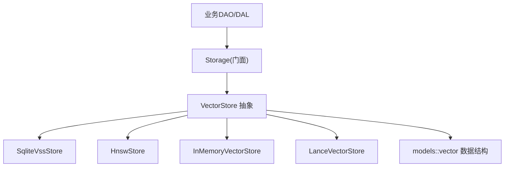
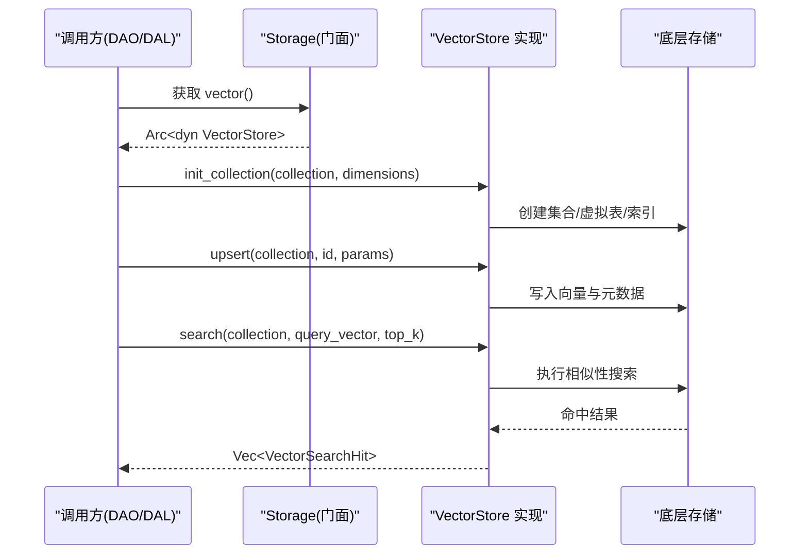
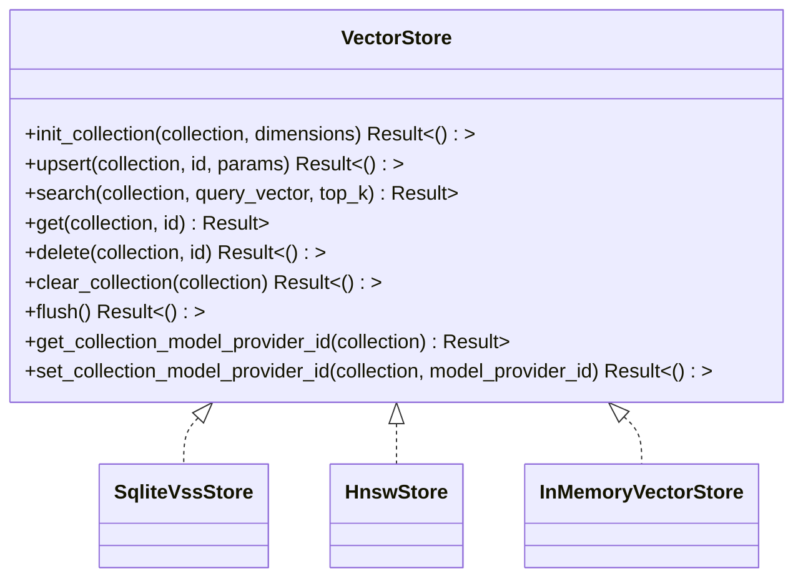
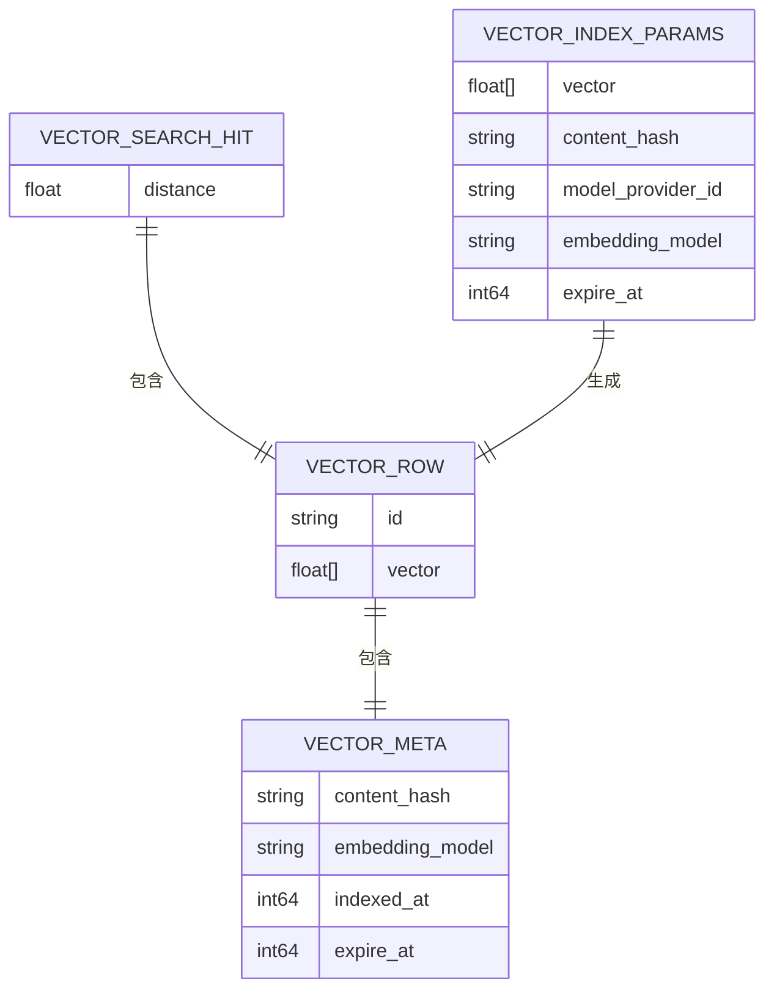
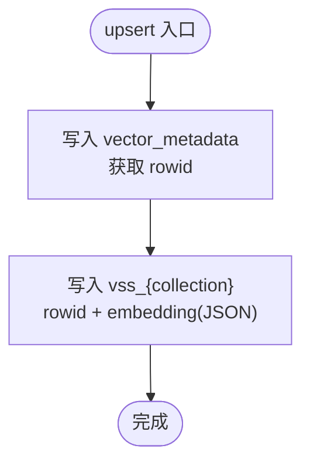
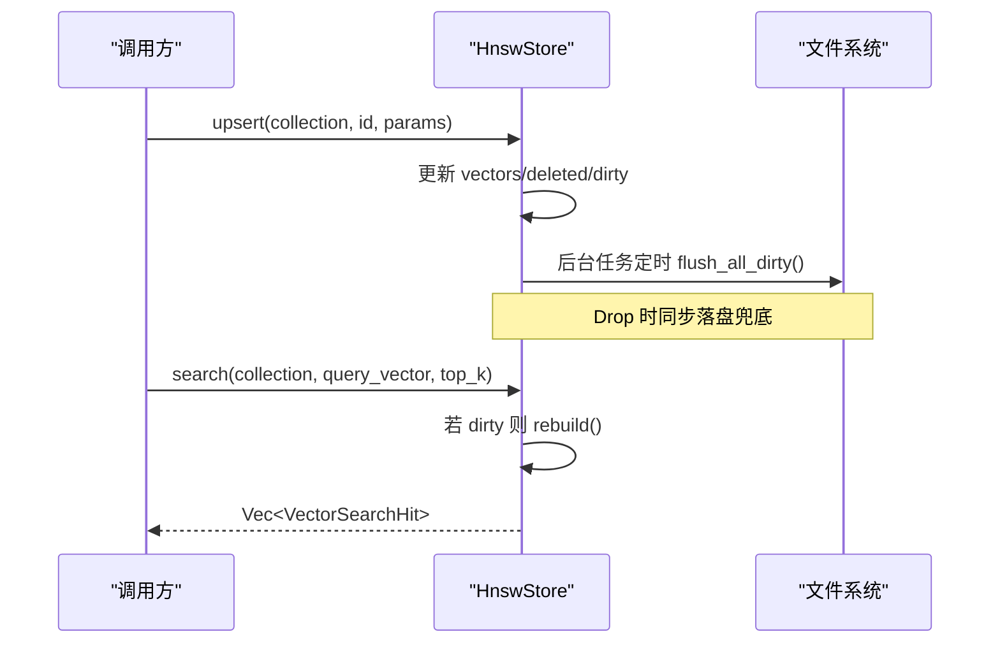
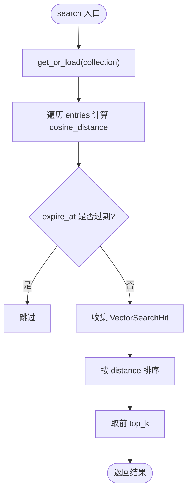
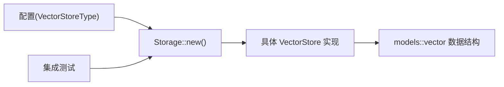

# 向量存储抽象接口（框架层）

<cite>
**本文引用的文件**
- [src/pkg/storage/vector.rs](src/pkg/storage/vector.rs)
- [src/models/vector.rs](src/models/vector.rs)
- [src/pkg/storage/hnsw.rs](src/pkg/storage/hnsw.rs)
- [src/pkg/storage/mem_vector.rs](src/pkg/storage/mem_vector.rs)
- [src/pkg/storage/mod.rs](src/pkg/storage/mod.rs)
- [tests/integration/message_vector_test.rs](tests/integration/message_vector_test.rs)
</cite>

## 目录
1. [简介](#简介)
2. [项目结构](#项目结构)
3. [核心组件](#核心组件)
4. [架构总览](#架构总览)
5. [详细组件分析](#详细组件分析)
6. [依赖关系分析](#依赖关系分析)
7. [性能考量](#性能考量)
8. [故障排查指南](#故障排查指南)
9. [结论](#结论)
10. [附录：自定义后端实现示例与最佳实践](#附录自定义后端实现示例与最佳实践)

## 简介
本技术文档围绕 AI Orz 的"向量存储抽象接口"展开，系统性阐述 VectorStore trait 的设计理念、核心方法定义与数据模型，解释异步 Trait 与 Send + Sync 约束的原因与优势，并给出实现自定义向量存储后端的错误处理模式与最佳实践。该抽象层位于 pkg/storage 下，面向上层 DAO/DAL/Domain 提供统一、可插拔的向量索引能力，支持 SQLite VSS、HNSW、内存以及 LanceDB 等多种后端，并通过配置在运行时选择具体实现。

> 📌 视角说明（AGENTS §2.1.3 Level 3 互补视角平行卡）：
> 本长文是「向量存储抽象接口」主题的 **框架层** 视角。同主题还有以下平行视角卡，请按需交叉阅读：
> - [向量存储抽象接口（代码落地层）](docs/wiki/zh/content/核心模块/存储系统/向量存储/向量存储抽象接口.md)

## 项目结构
向量存储相关代码主要分布在以下位置：
- 抽象与门面：src/pkg/storage/mod.rs（统一入口，按配置注入具体后端）
- 抽象接口：src/pkg/storage/vector.rs（VectorStore trait 及 SqliteVssStore 实现）
- HNSW 实现：src/pkg/storage/hnsw.rs（高性能近似最近邻索引，持久化与后台落盘）
- 内存实现：src/pkg/storage/mem_vector.rs（纯 Rust 线性搜索，懒加载持久化）
- 通用数据结构：src/models/vector.rs（VectorIndexParams、VectorRow、VectorMeta、VectorSearchHit 等）
- 集成测试：tests/integration/message_vector_test.rs（端到端验证消息向量搜索流程）

图表来源
- [src/pkg/storage/mod.rs:36-148](src/pkg/storage/mod.rs#L36-L148)
- [src/pkg/storage/vector.rs:18-74](src/pkg/storage/vector.rs#L18-L74)
- [src/pkg/storage/hnsw.rs:149-166](src/pkg/storage/hnsw.rs#L149-L166)
- [src/pkg/storage/mem_vector.rs:18-25](src/pkg/storage/mem_vector.rs#L18-L25)
- [src/models/vector.rs:9-67](src/models/vector.rs#L9-L67)

章节来源
- [src/pkg/storage/mod.rs:1-212](src/pkg/storage/mod.rs#L1-L212)
- [src/pkg/storage/vector.rs:1-291](src/pkg/storage/vector.rs#L1-L291)
- [src/models/vector.rs:1-192](src/models/vector.rs#L1-L192)

## 核心组件
- VectorStore trait：统一的向量存储抽象，定义了集合初始化、插入/更新、语义搜索、获取、删除、清空、刷新、模型提供者ID管理等关键方法。所有后端必须实现此 trait，从而支持热插拔与降级。
- 数据结构：
  - VectorIndexParams：索引创建/更新参数，包含向量、内容哈希、模型提供者ID、嵌入模型名称、过期时间。
  - VectorRow：向量行，包含业务ID、向量数据、元数据。
  - VectorMeta：元数据，包含内容哈希、嵌入模型、索引时间、过期时间。
  - VectorSearchHit：搜索结果，包含完整行和相似度距离。
- 后端实现：
  - SqliteVssStore：基于 SQLite vss0 扩展，使用虚拟表进行向量相似性搜索，元数据存储在 vector_metadata 表中。
  - HnswStore：纯 Rust HNSW 索引，支持余弦距离，增量写入标记脏数据，后台定时落盘，Drop 兜底持久化。
  - InMemoryVectorStore：纯 Rust 内存实现，线性搜索，懒加载持久化到 bincode 文件。
  - LanceVectorStore：通过 Storage 门面暴露的高性能嵌入式向量数据库（由 mod.rs 导出）。

章节来源
- [src/pkg/storage/vector.rs:18-74](src/pkg/storage/vector.rs#L18-L74)
- [src/models/vector.rs:9-67](src/models/vector.rs#L9-L67)
- [src/pkg/storage/hnsw.rs:149-166](src/pkg/storage/hnsw.rs#L149-L166)
- [src/pkg/storage/mem_vector.rs:18-25](src/pkg/storage/mem_vector.rs#L18-L25)
- [src/pkg/storage/mod.rs:20-34](src/pkg/storage/mod.rs#L20-L34)

## 架构总览
向量存储抽象层位于 pkg/storage，作为基础适配层，无业务感知；各业务 DAO 决定“向量化什么、什么时候、用什么模型”。Storage 门面根据配置选择具体后端，向上层暴露统一的 Arc<dyn VectorStore>。

图表来源
- [src/pkg/storage/mod.rs:78-93](src/pkg/storage/mod.rs#L78-L93)
- [src/pkg/storage/vector.rs:24-52](src/pkg/storage/vector.rs#L24-L52)
- [src/pkg/storage/hnsw.rs:432-543](src/pkg/storage/hnsw.rs#L432-L543)
- [src/pkg/storage/mem_vector.rs:120-228](src/pkg/storage/mem_vector.rs#L120-L228)

## 详细组件分析

### VectorStore trait 设计
- 设计理念：
  - 统一接口：所有后端实现同一套方法，便于替换与降级。
  - 行级结构体：search 返回完整的 VectorRow + distance，便于上层直接使用。
  - 可扩展：flush、get_collection_model_provider_id、set_collection_model_provider_id 提供默认空实现，允许后端按需增强。
- 关键方法：
  - init_collection：初始化集合（维度、虚拟表或内存结构）。
  - upsert：插入或更新向量，同时维护元数据。
  - search：语义搜索，返回 top_k 个命中结果。
  - get：按业务ID获取完整向量行。
  - delete：删除指定ID的向量。
  - clear_collection：清空集合。
  - flush：刷新脏数据到持久化（HNSW 有实际落盘逻辑）。
  - get/set collection model provider id：用于重建索引时判断是否需要重算。

图表来源
- [src/pkg/storage/vector.rs:18-74](src/pkg/storage/vector.rs#L18-L74)
- [src/pkg/storage/vector.rs:76-235](src/pkg/storage/vector.rs#L76-L235)
- [src/pkg/storage/hnsw.rs:432-616](src/pkg/storage/hnsw.rs#L432-L616)
- [src/pkg/storage/mem_vector.rs:119-275](src/pkg/storage/mem_vector.rs#L119-L275)

章节来源
- [src/pkg/storage/vector.rs:18-74](src/pkg/storage/vector.rs#L18-L74)

### 核心数据结构
- VectorIndexParams：
  - vector：向量数据。
  - content_hash：内容哈希，用于判断是否需要重索引。
  - model_provider_id：生成该向量的 ModelProvider ID。
  - embedding_model：使用的嵌入模型名称。
  - expire_at：可选过期时间。
- VectorRow：
  - id：业务表ID。
  - vector：向量数据。
  - meta：VectorMeta。
- VectorMeta：
  - content_hash：内容哈希。
  - embedding_model：嵌入模型名称。
  - indexed_at：索引时间戳。
  - expire_at：可选过期时间。
- VectorSearchHit：
  - row：VectorRow。
  - distance：相似度距离（越小越相似）。

图表来源
- [src/models/vector.rs:9-67](src/models/vector.rs#L9-L67)
- [src/models/vector.rs:18-36](src/models/vector.rs#L18-L36)

章节来源
- [src/models/vector.rs:9-67](src/models/vector.rs#L9-L67)

### 后端实现细节

#### SqliteVssStore
- 使用 SQLite vss0 扩展，创建虚拟表 vss_{collection}，元数据存储在 vector_metadata 表。
- upsert：先写元数据，再写向量；search 通过 MATCH 查询并 JOIN 元数据表。
- get/delete/clear：操作元数据与虚拟表。
- 注意：不存储原始向量，search/get 返回的 VectorRow.vector 为空，业务侧需根据 source_id 从业务表重新向量化或考虑在 metadata 中存储向量 JSON。

图表来源
- [src/pkg/storage/vector.rs:94-124](src/pkg/storage/vector.rs#L94-L124)

章节来源
- [src/pkg/storage/vector.rs:76-235](src/pkg/storage/vector.rs#L76-L235)

#### HnswStore
- 纯 Rust HNSW 索引，余弦距离计算，每个 collection 独立索引。
- 增量写入标记 dirty，搜索时按需重建索引。
- 持久化：bincode 序列化每个 collection 到 .bincode 文件，后台 60s 定时落盘，Drop 兜底。
- 集合元数据持久化到 collections_meta.bincode，记录 model_provider_id、dimensions、vector_count、updated_at。

图表来源
- [src/pkg/storage/hnsw.rs:377-388](src/pkg/storage/hnsw.rs#L377-L388)
- [src/pkg/storage/hnsw.rs:403-429](src/pkg/storage/hnsw.rs#L403-L429)
- [src/pkg/storage/hnsw.rs:442-543](src/pkg/storage/hnsw.rs#L442-L543)

章节来源
- [src/pkg/storage/hnsw.rs:149-616](src/pkg/storage/hnsw.rs#L149-L616)

#### InMemoryVectorStore
- 纯 Rust 内存实现，线性搜索，余弦距离计算。
- 懒加载持久化：首次访问集合时从磁盘加载 bincode 文件，修改后异步持久化。
- 适合测试或小规模场景，零系统依赖。

图表来源
- [src/pkg/storage/mem_vector.rs:188-228](src/pkg/storage/mem_vector.rs#L188-L228)

章节来源
- [src/pkg/storage/mem_vector.rs:18-275](src/pkg/storage/mem_vector.rs#L18-L275)

### 异步 Trait 设计与 Send + Sync 约束
- 异步 Trait：
  - 使用 async_trait 声明异步方法，使后端实现可以执行 I/O（如 SQL 查询、文件读写），避免阻塞线程。
  - 上层调用无需关心具体后端是内存还是磁盘/网络，统一以 async/await 方式调用。
- Send + Sync：
  - Send：确保类型可以在不同线程间转移，适合 tokio 多任务并发。
  - Sync：确保类型可以在多线程间共享引用，配合 Arc 实现跨任务安全共享状态（如 HnswStore 的 collections 与 meta）。
  - 约束意义：保证 VectorStore 可在多线程环境中被多个任务并发调用，提升吞吐与稳定性。

章节来源
- [src/pkg/storage/vector.rs:18-74](src/pkg/storage/vector.rs#L18-L74)
- [src/pkg/storage/hnsw.rs:157-166](src/pkg/storage/hnsw.rs#L157-L166)
- [src/pkg/storage/mem_vector.rs:21-25](src/pkg/storage/mem_vector.rs#L21-L25)

## 依赖关系分析
- Storage 门面根据配置选择后端：
  - InMemory：base_data_path/vectors
  - Hnsw：hnsw_index_dir
  - LanceDb：base_data_path/vectors_lance
  - SqliteVss：vector_db_file_name
- 数据结构依赖：
  - 所有后端均依赖 models::vector 中的通用数据结构，保证接口一致性。
- 测试依赖：
  - 集成测试通过 API 触发 DAL/DAO 的向量索引维护流程，验证 FTS5 与向量混合搜索。

图表来源
- [src/pkg/storage/mod.rs:78-93](src/pkg/storage/mod.rs#L78-L93)
- [src/models/vector.rs:9-67](src/models/vector.rs#L9-L67)
- [tests/integration/message_vector_test.rs:113-162](tests/integration/message_vector_test.rs#L113-L162)

章节来源
- [src/pkg/storage/mod.rs:36-148](src/pkg/storage/mod.rs#L36-L148)
- [tests/integration/message_vector_test.rs:1-200](tests/integration/message_vector_test.rs#L1-200)

## 性能考量
- HnswStore：
  - 使用 HNSW 近似最近邻索引，搜索复杂度优于线性扫描。
  - 延迟重建索引（dirty flag），减少频繁写入时的重建开销。
  - 后台定时落盘与 Drop 兜底，平衡性能与持久化可靠性。
- SqliteVssStore：
  - 利用 SQLite vss0 扩展的 MATCH 查询，适合中等规模数据。
  - 不存储原始向量，节省空间但需要业务侧补充。
- InMemoryVectorStore：
  - 线性搜索 O(n)，适合小规模或测试场景。
  - 懒加载与异步持久化降低 I/O 影响。

[本节为一般性指导，不直接分析具体文件]

## 故障排查指南
- 常见错误与处理：
  - SQLite VSS 扩展加载失败：SqliteVssStore::new 中尝试 load_extension('vss0')，失败不影响启动，可降级到其他后端。
  - HNSW 持久化失败：后台 flush 与 Drop 兜底会记录警告日志，检查磁盘权限与路径。
  - 内存存储持久化失败：异步保存忽略错误，建议监控日志并回退到内存模式。
- 调试建议：
  - 启用 tracing 日志，观察 flush、rebuild、load/save 过程。
  - 检查 collections_meta.bincode 与各 collection .bincode 文件完整性。
  - 对于 SqliteVssStore，确认 vss0 扩展已正确安装并可加载。

章节来源
- [src/pkg/storage/vector.rs:246-257](src/pkg/storage/vector.rs#L246-L257)
- [src/pkg/storage/hnsw.rs:344-375](src/pkg/storage/hnsw.rs#L344-L375)
- [src/pkg/storage/hnsw.rs:403-429](src/pkg/storage/hnsw.rs#L403-L429)
- [src/pkg/storage/mem_vector.rs:175-185](src/pkg/storage/mem_vector.rs#L175-L185)

## 结论
VectorStore 抽象为 AI Orz 提供了统一、可插拔的向量存储能力，支持多种后端以适应不同部署环境与性能需求。通过清晰的数据结构与异步 Trait 设计，上层 DAO/DAL/Domain 可以专注于业务逻辑，而将向量索引的细节交给合适的后端实现。结合配置注入与降级策略，系统在可用性与性能之间取得良好平衡。

[本节为总结性内容，不直接分析具体文件]

## 附录：自定义后端实现示例与最佳实践

### 实现步骤
- 定义新后端结构体，实现 VectorStore trait 的所有方法。
- 使用 Send + Sync 约束，确保多线程安全。
- 在 Storage 门面中注册新后端类型，或通过工厂函数注入。
- 编写单元测试与集成测试，覆盖 upsert/search/get/delete/clear_collection。

### 错误处理模式
- 使用 common::error::Result 统一错误类型，便于上层处理。
- 对 I/O 操作进行错误捕获与日志记录，避免 panic。
- 对于可选功能（如 flush、model_provider_id 管理），提供默认空实现，允许后端选择性增强。

### 最佳实践
- 保持数据结构一致：严格使用 models::vector 中的 VectorIndexParams、VectorRow、VectorMeta、VectorSearchHit。
- 幂等操作：init_collection 应幂等，已存在则跳过。
- 过期策略：在 search 中过滤过期条目，避免返回无效结果。
- 持久化策略：对于磁盘后端，采用增量写入与定时落盘，Drop 兜底。
- 测试隔离：使用独立数据库文件或内存后端，确保测试互不干扰。

### 参考路径
- 抽象接口与方法定义：[src/pkg/storage/vector.rs:18-74](src/pkg/storage/vector.rs#L18-L74)
- HNSW 持久化与重建逻辑：[src/pkg/storage/hnsw.rs:377-543](src/pkg/storage/hnsw.rs#L377-L543)
- 内存后端懒加载与异步持久化：[src/pkg/storage/mem_vector.rs:56-185](src/pkg/storage/mem_vector.rs#L56-L185)
- 数据结构定义：[src/models/vector.rs:9-67](src/models/vector.rs#L9-L67)
- 集成测试示例（消息向量搜索）：[tests/integration/message_vector_test.rs:113-162](tests/integration/message_vector_test.rs#L113-L162)

章节来源
- [src/pkg/storage/vector.rs:18-74](src/pkg/storage/vector.rs#L18-L74)
- [src/pkg/storage/hnsw.rs:377-543](src/pkg/storage/hnsw.rs#L377-L543)
- [src/pkg/storage/mem_vector.rs:56-185](src/pkg/storage/mem_vector.rs#L56-L185)
- [src/models/vector.rs:9-67](src/models/vector.rs#L9-L67)
- [tests/integration/message_vector_test.rs:113-162](tests/integration/message_vector_test.rs#L113-L162)