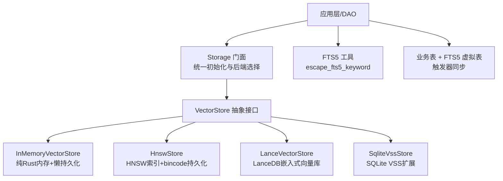
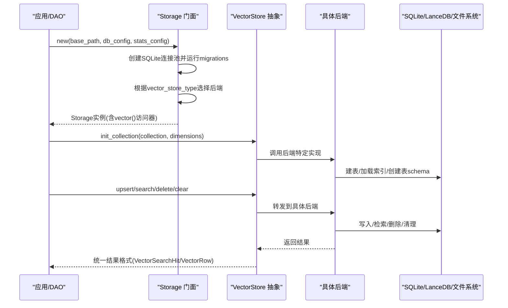
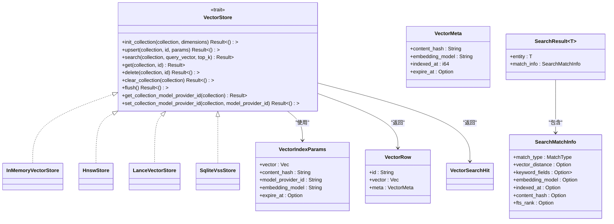
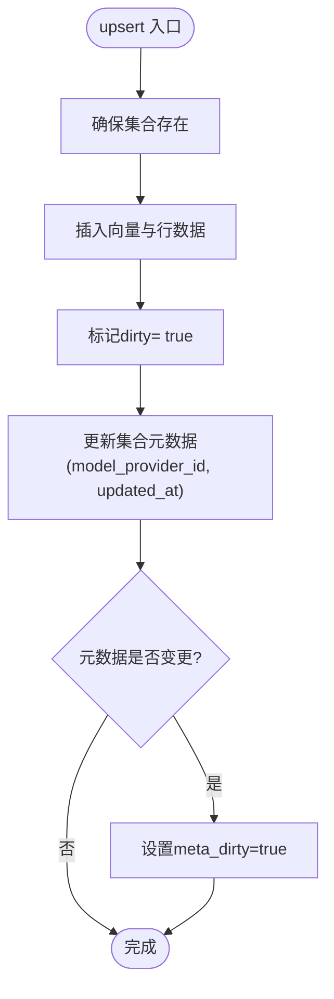
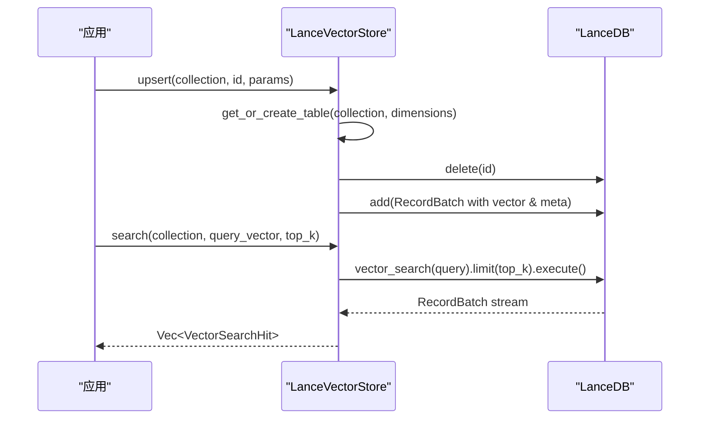
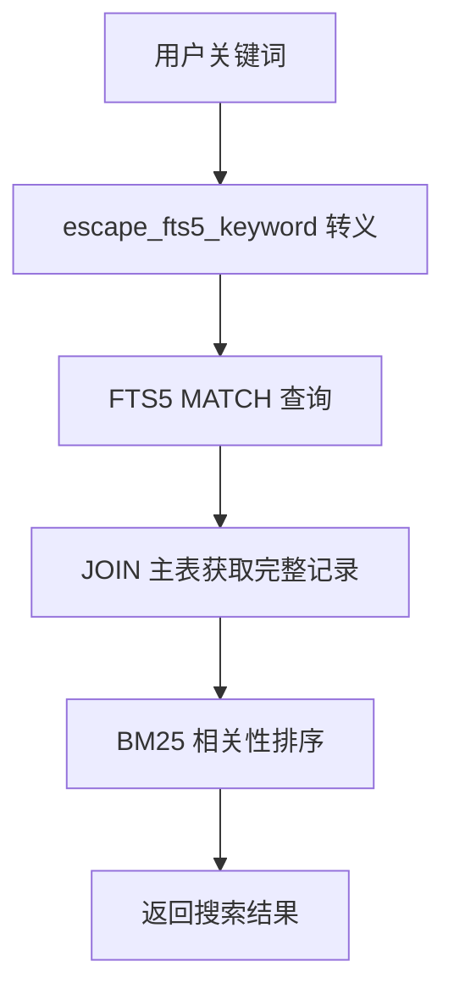
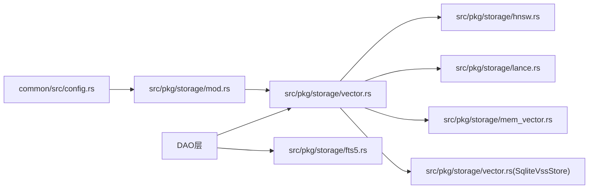

# 存储系统（框架层）

<cite>
**本文引用的文件**
- [src/pkg/paths.rs](src/pkg/paths.rs)
- [src/pkg/storage/mod.rs](src/pkg/storage/mod.rs)
- [src/pkg/storage/vector.rs](src/pkg/storage/vector.rs)
- [src/pkg/storage/hnsw.rs](src/pkg/storage/hnsw.rs)
- [src/pkg/storage/lance.rs](src/pkg/storage/lance.rs)
- [src/pkg/storage/mem_vector.rs](src/pkg/storage/mem_vector.rs)
- [src/pkg/storage/fts5.rs](src/pkg/storage/fts5.rs)
- [src/models/vector.rs](src/models/vector.rs)
- [common/src/config.rs](common/src/config.rs)
- [src/config.rs](src/config.rs)
- [migrations/20260712000000_memory_fts5.sql](migrations/20260712000000_memory_fts5.sql)
- [migrations/20260712000001_entity_fts5.sql](migrations/20260712000001_entity_fts5.sql)
- [SQLite + SQLx 0.8 存储工程规范：STRICT 表模式 + FTS5 全文检索 + 枚举 i32 类型安全 + .sqlx 离线构建 + sqlx::test 隔离](docs/wiki/knowledge/zh/SQLite + SQLx 0.8 存储工程规范：STRICT 表模式 + FTS5 全文检索 + 枚举 i32 类型安全 + .sqlx 离线构建 + sqlx::test 隔离/SQLite + SQLx 0.8 存储工程规范：STRICT 表模式 + FTS5 全文检索 + 枚举 i32 类型安全 + .sqlx 离线构建 + sqlx::test 隔离.md)
</cite>

### 本文关联的三类文档（四类互引闭环）

**① 设计文档（Design）**：
- [SQLite + SQLx 0.8 存储工程规范](docs/design/sqlx_guide.md) — SQLite STRICT 表 + 枚举 i32 类型安全 + sqlx::test 隔离 + 初始化顺序红线

**② 落地计划（Plan）**：
- [Query 接口分页与 List 接口简化重构](docs/archive/plan-archive/Query接口分页与List接口简化重构.md) — 初始化顺序 DAO→DAL→Domain 分层红线 + COUNT 与 LIST WHERE 复用

**④ RAG 原子知识卡**：
- [SQLite + SQLx 0.8 存储工程规范：STRICT 表模式 + FTS5 全文检索 + 枚举 i32 类型安全 + .sqlx 离线构建 + sqlx::test 隔离](docs/wiki/knowledge/zh/SQLite%20+%20SQLx%200.8%20%E5%AD%98%E5%82%A8%E5%B7%A5%E7%A8%8B%E8%A7%84%E8%8C%83%EF%BC%9ASTRICT%20%E8%A1%A8%E6%A8%A1%E5%BC%8F%20+%20FTS5%20%E5%85%A8%E6%96%87%E6%A3%80%E7%B4%A2%20+%20%E6%9E%9A%E4%B8%BE%20i32%20%E7%B1%BB%E5%9E%8B%E5%AE%89%E5%85%A8%20+%20.sqlx%20%E7%A6%BB%E7%BA%BF%E6%9E%84%E5%BB%BA%20+%20sqlx%3A%3Atest%20%E9%9A%94%E7%A6%BB/SQLite%20+%20SQLx%200.8%20%E5%AD%98%E5%82%A8%E5%B7%A5%E7%A8%8B%E8%A7%84%E8%8C%83%EF%BC%9ASTRICT%20%E8%A1%A8%E6%A8%A1%E5%BC%8F%20+%20FTS5%20%E5%85%A8%E6%96%87%E6%A3%80%E7%B4%A2%20+%20%E6%9E%9A%E4%B8%BE%20i32%20%E7%B1%BB%E5%9E%8B%E5%AE%89%E5%85%A8%20+%20.sqlx%20%E7%A6%BB%E7%BA%BF%E6%9E%84%E5%BB%BA%20+%20sqlx%3A%3Atest%20%E9%9A%94%E7%A6%BB.md) — 严格两阶段初始化（pkg::init_all → service::init → service::init_base_data）+ Vectorizable 实体 trait 统一向量化接口

## 目录
1. [简介](#简介)
2. [项目结构](#项目结构)
3. [核心组件](#核心组件)
4. [架构总览](#架构总览)
5. [详细组件分析](#详细组件分析)
6. [依赖关系分析](#依赖关系分析)
7. [性能考量](#性能考量)
8. [故障排查指南](#故障排查指南)
9. [结论](#结论)
10. [附录](#附录)

## 简介
本技术文档面向 AI Orz 的存储子系统，系统性阐述向量存储、全文搜索与文件存储的实现原理与实践。重点覆盖：
- 向量检索抽象接口与多后端实现（内存、HNSW、LanceDB、SQLite VSS）
- HNSW 算法在向量检索中的应用与持久化策略
- LanceDB 集成方式与表结构设计
- FTS5 全文搜索的配置、转义与优化
- 存储配置、查询优化与性能调优示例
- 不同场景下的存储选型指南与最佳实践

> 📌 视角说明（AGENTS §2.1.3 Level 3 互补视角平行卡）：
> 本长文是「存储系统」主题的 **框架层** 视角。同主题还有以下平行视角卡，请按需交叉阅读：
> - [存储系统（代码落地层）](docs/wiki/zh/content/核心模块/存储系统/存储系统.md)

## 项目结构
存储子系统位于 src/pkg/storage 下，提供统一的 VectorStore 抽象与多种后端实现；数据模型集中在 src/models/vector.rs；配置集中在 common/src/config.rs 与 src/config.rs；FTS5 工具函数与迁移脚本位于对应位置。

图表来源
- [src/pkg/storage/mod.rs:1-212](src/pkg/storage/mod.rs#L1-L212)
- [src/pkg/storage/vector.rs:1-291](src/pkg/storage/vector.rs#L1-L291)
- [src/pkg/storage/hnsw.rs:1-617](src/pkg/storage/hnsw.rs#L1-L617)
- [src/pkg/storage/lance.rs:1-365](src/pkg/storage/lance.rs#L1-L365)
- [src/pkg/storage/mem_vector.rs:1-276](src/pkg/storage/mem_vector.rs#L1-L276)
- [src/pkg/storage/fts5.rs:1-45](src/pkg/storage/fts5.rs#L1-L45)

章节来源
- [src/pkg/paths.rs#L1-L169](src/pkg/paths.rs#L1-L169)
- [src/pkg/storage/mod.rs:1-212](src/pkg/storage/mod.rs#L1-L212)
- [common/src/config.rs:78-114](common/src/config.rs#L78-L114)

## 核心组件
- Storage 门面：负责 SQLite 连接池初始化、migrations 执行、根据配置选择向量后端、Stats 统计模块初始化。
- VectorStore 抽象：定义集合初始化、upsert、search、get、delete、clear_collection、flush 等通用方法，屏蔽后端差异。
- 向量数据模型：VectorRow、VectorMeta、VectorIndexParams、SearchResult、SearchMatchInfo、Vectorizable Trait。
- FTS5 工具：提供关键词转义与短语匹配封装，避免 SQL 注入与语法错误。
- 配置系统：DatabaseConfig 中的 vector_store_type、hnsw_index_dir 等控制后端行为与路径。

章节来源
- [src/pkg/storage/mod.rs:36-179](src/pkg/storage/mod.rs#L36-L179)
- [src/pkg/storage/vector.rs:18-74](src/pkg/storage/vector.rs#L18-L74)
- [src/models/vector.rs:9-168](src/models/vector.rs#L9-L168)
- [src/pkg/storage/fts5.rs:6-18](src/pkg/storage/fts5.rs#L6-L18)
- [common/src/config.rs:78-114](common/src/config.rs#L78-L114)

## 架构总览
存储子系统采用“门面 + 抽象 + 多后端”的分层设计：
- 门面层：Storage 统一入口，集中管理数据库连接、迁移、后端选择与统计。
- 抽象层：VectorStore trait 定义跨后端的统一操作语义。
- 后端层：四种实现满足不同场景需求（内存、HNSW、LanceDB、SQLite VSS）。
- 数据层：向量元数据与业务表通过 FTS5 虚拟表与触发器保持同步，支持混合检索。

图表来源
- [src/pkg/storage/mod.rs:56-122](src/pkg/storage/mod.rs#L56-L122)
- [src/pkg/storage/vector.rs:23-74](src/pkg/storage/vector.rs#L23-L74)
- [src/pkg/storage/hnsw.rs:189-219](src/pkg/storage/hnsw.rs#L189-L219)
- [src/pkg/storage/lance.rs:43-124](src/pkg/storage/lance.rs#L43-L124)

## 详细组件分析

### 向量存储抽象与数据模型
- VectorStore trait 定义了集合生命周期与 CRUD 语义，所有后端必须实现以保障一致性。
- VectorIndexParams 承载向量、内容哈希、模型信息、过期时间等索引参数，供 DAO 层复用。
- SearchResult 与 SearchMatchInfo 支持混合检索（向量/关键词/混合），记录距离、BM25 评分、字段命中等信息。
- Vectorizable Trait 让实体自行决定向量化内容与集合名，解耦业务与存储。

图表来源
- [src/pkg/storage/vector.rs:18-74](src/pkg/storage/vector.rs#L18-L74)
- [src/models/vector.rs:9-168](src/models/vector.rs#L9-L168)

章节来源
- [src/pkg/storage/vector.rs:18-74](src/pkg/storage/vector.rs#L18-L74)
- [src/models/vector.rs:9-168](src/models/vector.rs#L9-L168)

### HNSW 向量存储实现
- 基于 instant-distance 的纯 Rust HNSW 索引，支持余弦距离计算。
- 每个 collection 独立索引，增量写入标记 dirty，搜索时按需重建索引。
- 持久化策略：每个 collection 序列化为 .bincode 文件，集合元数据单独持久化；后台 60s 定时落盘，Drop 兜底同步。
- 冷启动扫描目录加载已有索引，提升重启恢复速度。

图表来源
- [src/pkg/storage/hnsw.rs:442-490](src/pkg/storage/hnsw.rs#L442-L490)

章节来源
- [src/pkg/storage/hnsw.rs:1-617](src/pkg/storage/hnsw.rs#L1-L617)

### LanceDB 向量存储实现
- 基于 LanceDB 的高性能嵌入式向量数据库，内置 HNSW 索引，支持百万级向量快速检索。
- 表结构使用 Arrow Schema，向量列采用 FixedSizeListArray，元数据包括 content_hash、embedding_model、indexed_at、expire_at。
- 懒加载表缓存，首次访问时检查或创建表；搜索使用 vector_search API 并限制 top_k。

图表来源
- [src/pkg/storage/lance.rs:134-199](src/pkg/storage/lance.rs#L134-L199)
- [src/pkg/storage/lance.rs:201-282](src/pkg/storage/lance.rs#L201-L282)

章节来源
- [src/pkg/storage/lance.rs:1-365](src/pkg/storage/lance.rs#L1-L365)

### 内存向量存储实现
- 纯 Rust 实现，零系统依赖，适合测试与轻量场景。
- 使用 HashMap 维护集合条目，按余弦相似度线性搜索，异步持久化到 bin 文件。
- 支持懒加载集合，从磁盘读取已存在的集合数据。

章节来源
- [src/pkg/storage/mem_vector.rs:1-276](src/pkg/storage/mem_vector.rs#L1-L276)

### SQLite VSS 向量存储实现
- 基于 SQLite vss0 扩展，创建 vss_{collection} 虚拟表进行向量相似性搜索。
- 元数据存储在 vector_metadata 表，upsert 先写元数据再写向量，search 通过 MATCH 查询并按 distance 排序。
- 注意：该实现不存储原始向量，返回的 VectorRow.vector 为空，需由上层根据 source_id 重新获取或存储。

章节来源
- [src/pkg/storage/vector.rs:76-291](src/pkg/storage/vector.rs#L76-L291)

### FTS5 全文搜索工具与配置
- escape_fts5_keyword 将用户输入转义并用双引号包裹，作为短语匹配，避免空格被解释为 AND 操作符。
- 迁移脚本创建 FTS5 虚拟表并配置触发器，保证主表增删改与 FTS5 表同步。
- 结合 BM25 相关性排序，提高关键词检索质量。

图表来源
- [src/pkg/storage/fts5.rs:6-18](src/pkg/storage/fts5.rs#L6-L18)
- [migrations/20260712000000_memory_fts5.sql](migrations/20260712000000_memory_fts5.sql)
- [migrations/20260712000001_entity_fts5.sql](migrations/20260712000001_entity_fts5.sql)

章节来源
- [src/pkg/storage/fts5.rs:1-45](src/pkg/storage/fts5.rs#L1-L45)
- [migrations/20260712000000_memory_fts5.sql](migrations/20260712000000_memory_fts5.sql)
- [migrations/20260712000001_entity_fts5.sql](migrations/20260712000001_entity_fts5.sql)

### 存储门面与后端选择
- Storage::new 根据 DatabaseConfig.vector_store_type 自动选择后端：
  - InMemory：vectors 目录 + bincode 持久化
  - Hnsw：hnsw_index 目录 + bincode 持久化
  - LanceDb：vectors_lance 目录 + LanceDB 表
  - SqliteVss：ai_orz_vector.db + vss 扩展
- 同时初始化 Stats DuckDB 并注册全局单例，便于无上下文场景使用。

章节来源
- [src/pkg/storage/mod.rs:56-122](src/pkg/storage/mod.rs#L56-L122)
- [common/src/config.rs:78-114](common/src/config.rs#L78-L114)

## 依赖关系分析
- Storage 依赖 common::config::DatabaseConfig 确定后端类型与路径。
- VectorStore 抽象被各后端实现依赖，DAO 仅依赖抽象，降低耦合。
- HnswStore 依赖 instant-distance、bincode、tokio 异步任务。
- LanceVectorStore 依赖 lancedb、arrow 系列库。
- SqliteVssStore 依赖 sqlx、sqlite vss0 扩展。
- FTS5 工具被 DAO 层复用，避免重复逻辑。

图表来源
- [common/src/config.rs:78-114](common/src/config.rs#L78-L114)
- [src/pkg/storage/mod.rs:1-212](src/pkg/storage/mod.rs#L1-L212)
- [src/pkg/storage/vector.rs:1-291](src/pkg/storage/vector.rs#L1-L291)
- [src/pkg/storage/hnsw.rs:1-617](src/pkg/storage/hnsw.rs#L1-L617)
- [src/pkg/storage/lance.rs:1-365](src/pkg/storage/lance.rs#L1-L365)
- [src/pkg/storage/mem_vector.rs:1-276](src/pkg/storage/mem_vector.rs#L1-L276)
- [src/pkg/storage/fts5.rs:1-45](src/pkg/storage/fts5.rs#L1-L45)

章节来源
- [common/src/config.rs:78-114](common/src/config.rs#L78-L114)
- [src/pkg/storage/mod.rs:1-212](src/pkg/storage/mod.rs#L1-L212)

## 性能考量
- HNSW 后端：
  - 索引按需重建，减少频繁写入时的重建开销。
  - 后台定时落盘（60s）与 Drop 兜底，平衡持久化频率与数据安全。
  - 余弦距离计算避免归一化开销，适合文本嵌入。
- LanceDB 后端：
  - 内置 HNSW 索引，适合大规模向量检索。
  - 使用 Arrow 批量写入，减少序列化与 IO 次数。
  - 表懒加载与缓存，降低重复打开表的成本。
- 内存后端：
  - 线性搜索 O(n)，适合小规模数据与测试。
  - 异步持久化不阻塞主流程。
- SQLite VSS：
  - 依赖 vss0 扩展，生产环境需评估系统依赖与稳定性。
  - 不存储原始向量，节省空间但需要额外获取逻辑。
- FTS5：
  - 短语匹配与 BM25 排序提升关键词检索精度。
  - 触发器同步保证一致性与实时性。

[本节提供一般性指导，无需特定文件引用]

## 故障排查指南
- HNSW 后端：
  - 检查 hnsw_index 目录权限与磁盘空间。
  - 关注后台 flush 任务日志，确认 dirty 集合是否成功落盘。
  - 若索引损坏，可删除对应 .bincode 文件并重建。
- LanceDB 后端：
  - 检查 vectors_lance 目录与表是否存在。
  - 若 vector_search 报错，确认维度与 schema 一致。
  - 清理无效表或重建表以修复 schema 不一致。
- SQLite VSS：
  - 确认 vss0 扩展加载成功，否则降级为内存计算模式。
  - 检查 vector_metadata 与 vss_{collection} 表一致性。
- FTS5：
  - 使用 escape_fts5_keyword 处理特殊字符，避免 MATCH 语法错误。
  - 验证触发器是否正确同步增删改到 FTS5 表。

章节来源
- [src/pkg/storage/hnsw.rs:377-429](src/pkg/storage/hnsw.rs#L377-L429)
- [src/pkg/storage/lance.rs:64-124](src/pkg/storage/lance.rs#L64-L124)
- [src/pkg/storage/vector.rs:245-262](src/pkg/storage/vector.rs#L245-L262)
- [src/pkg/storage/fts5.rs:6-18](src/pkg/storage/fts5.rs#L6-L18)

## 结论
AI Orz 存储系统通过统一的 VectorStore 抽象与多后端实现，灵活适配不同规模与场景的向量检索需求。HNSW 与 LanceDB 提供高性能近似最近邻检索，内存与 SQLite VSS 满足轻量与兼容场景。FTS5 全文搜索与触发器机制保障了关键词检索的准确性与一致性。合理的配置与优化策略可显著提升系统性能与稳定性。

[本节总结性内容，无需特定文件引用]

## 附录

### 存储配置与示例
- 选择后端：在 DatabaseConfig.vector_store_type 中设置为 lance_db、hnsw、in_memory 或 sqlite_vss。
- HNSW 目录：database.hnsw_index_dir 指定索引持久化路径。
- 向量数据库文件：database.vector_db_file_name 用于 SQLite VSS 后端。
- 示例：生产环境推荐 LanceDB；开发/测试可使用 InMemory；需要零依赖可选 Hnsw。

章节来源
- [common/src/config.rs:78-114](common/src/config.rs#L78-L114)
- [src/pkg/storage/mod.rs:78-93](src/pkg/storage/mod.rs#L78-L93)

### 查询优化与调优建议
- 向量检索：
  - 合理设置 top_k，避免过大导致性能下降。
  - 对 HNSW 后端，定期 flush 以减少重建频率。
  - 对 LanceDB 后端，确保向量维度一致，避免 schema 变更。
- 全文检索：
  - 使用短语匹配与 BM25 排序提升相关性。
  - 避免复杂 MATCH 表达式，简化查询以提升性能。
- 混合检索：
  - 结合向量距离阈值与关键词匹配，平衡召回率与准确率。

[本节提供一般性指导，无需特定文件引用]

### 场景选择指南与最佳实践
- 小规模数据与测试：InMemoryVectorStore，零依赖，快速迭代。
- 中等规模与自托管：HnswStore，纯 Rust，可控持久化。
- 大规模生产：LanceVectorStore，高性能、易扩展。
- 兼容现有 SQLite：SqliteVssStore，需评估系统依赖。
- 全文检索：FTS5 + 触发器，保证一致性与实时性。

[本节提供一般性指导，无需特定文件引用]