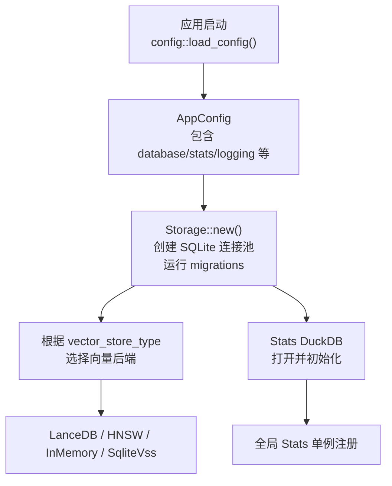
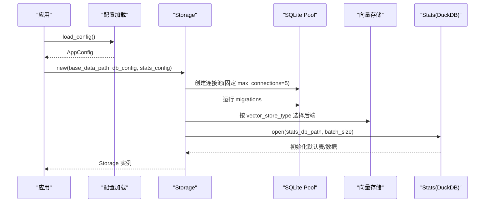
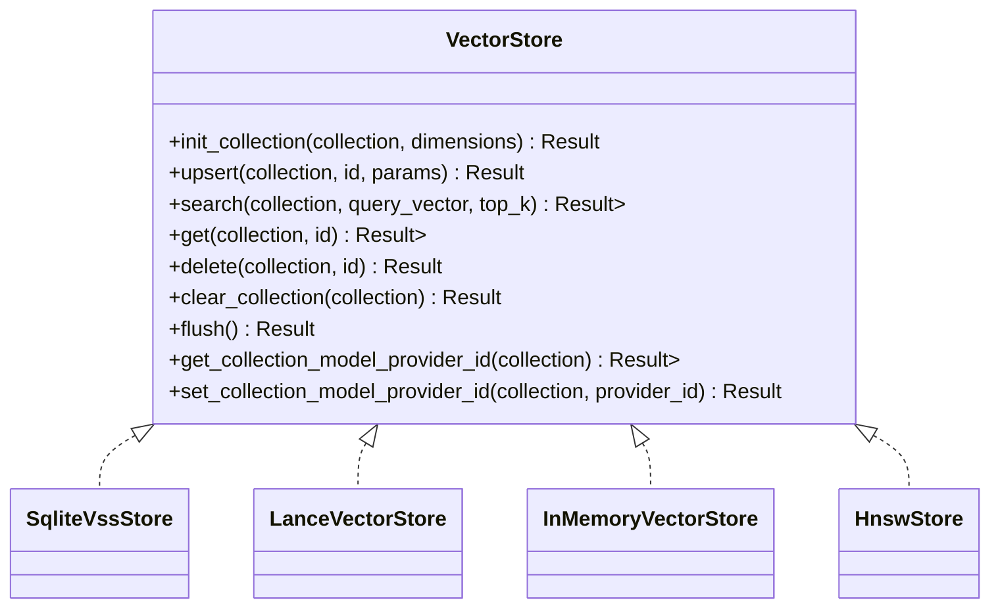
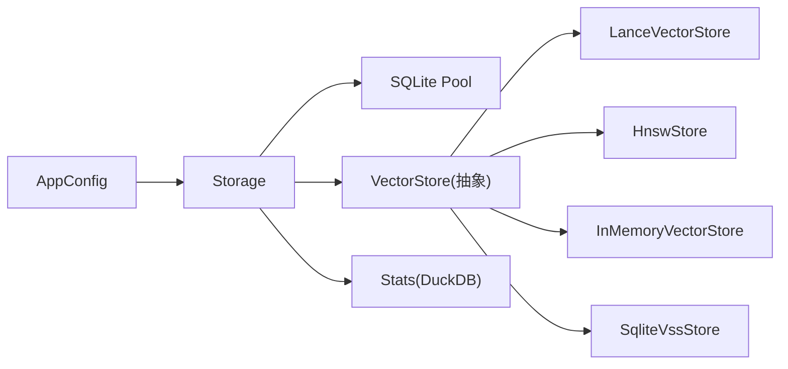

# 存储配置

<cite>
**本文引用的文件**
- [src/pkg/paths.rs](src/pkg/paths.rs)
- [src/pkg/storage/mod.rs](src/pkg/storage/mod.rs)
- [common/src/config.rs](common/src/config.rs)
- [src/config.rs](src/config.rs)
- [common/config/ai_orz.toml](common/config/ai_orz.toml)
- [src/pkg/storage/vector.rs](src/pkg/storage/vector.rs)
- [src/pkg/storage/lance.rs](src/pkg/storage/lance.rs)
- [src/handlers/system/backup/mod.rs](src/handlers/system/backup/mod.rs)
- [docs/vector_search_architecture.md](docs/vector_search_architecture.md)
</cite>

## 目录
1. [简介](#简介)
2. [项目结构](#项目结构)
3. [核心组件](#核心组件)
4. [架构总览](#架构总览)
5. [详细组件分析](#详细组件分析)
6. [依赖关系分析](#依赖关系分析)
7. [性能与调优](#性能与调优)
8. [故障排除指南](#故障排除指南)
9. [结论](#结论)
10. [附录：环境最佳实践与数据目录规划](#附录：环境最佳实践与数据目录规划)

## 简介
本文件面向 AI Orz 存储系统的配置与初始化，重点说明 Storage 结构体的初始化流程、数据库连接池配置、向量存储后端选择、统计数据存储配置，以及不同环境的差异化配置建议。文档同时覆盖连接池大小调优、存储路径规划、数据目录结构与备份策略，并提供配置验证、错误处理与故障排除指引。

## 项目结构
存储相关的关键位置与职责：
- 路径 SSOT（33 个纯函数，全量路径布局）：src/pkg/paths.rs
- 配置定义与默认值（仅 3 个路径方法：base_data_path/config_path/log_dir）：common/src/config.rs
- 配置文件加载与默认文件生成：src/config.rs
- 统一存储门面（SQLite + 向量 + 统计）：src/pkg/storage/mod.rs
- 向量存储抽象与实现：src/pkg/storage/vector.rs、src/pkg/storage/lance.rs
- 备份管理入口：src/handlers/system/backup/mod.rs
- 向量搜索架构参考：docs/vector_search_architecture.md

图表来源
- [src/config.rs:38-77](src/config.rs#L38-L77)
- [common/src/config.rs:22-59](common/src/config.rs#L22-L59)
- [src/pkg/storage/mod.rs:49-122](src/pkg/storage/mod.rs#L49-L122)

章节来源
- [src/pkg/paths.rs#L1-L169](src/pkg/paths.rs#L1-L169)
- [src/config.rs:38-77](src/config.rs#L38-L77)
- [common/src/config.rs:22-59](common/src/config.rs#L22-L59)

## 核心组件
- AppConfig：聚合服务器、数据库、统计、前端、日志、JWT、消费者、飞书、A2A Server 等配置项，提供基础数据路径、日志目录、数据库路径、附件/产物/技能等路径计算方法。
- DatabaseConfig：定义 SQLite 主库文件名、向量库文件名、向量存储类型、HNSW 索引目录。
- StatsConfig：定义 DuckDB 统计库文件名与批量写入大小。
- Storage：统一门面，封装 SQLite 连接池、向量存储实例、Stats 模块，负责迁移执行、后端选择、Stats 初始化与全局注册。

章节来源
- [common/src/config.rs:22-59](common/src/config.rs#L22-L59)
- [common/src/config.rs:78-126](common/src/config.rs#L78-L126)
- [src/pkg/storage/mod.rs:36-47](src/pkg/storage/mod.rs#L36-L47)

## 架构总览
Storage 的初始化流程将配置、持久化与可插拔向量后端解耦，形成“配置 → 存储门面 → 具体后端”的分层结构。

图表来源
- [src/config.rs:38-77](src/config.rs#L38-L77)
- [src/pkg/storage/mod.rs:49-122](src/pkg/storage/mod.rs#L49-L122)

## 详细组件分析

### Storage 初始化与配置选项
- 连接池：使用 SqlitePoolOptions，max_connections 固定为 5，适合 SQLite 单文件写并发限制。
- 迁移：通过 sqlx::migrate!("./migrations") 自动建表与升级。
- 向量后端选择：
  - InMemory：基于内存与本地目录（vectors），零系统依赖，测试推荐。
  - Hnsw：纯 Rust HNSW 索引，高性能近似最近邻。
  - LanceDb：嵌入式向量数据库，生产级高性能，默认后端。
  - SqliteVss：基于 SQLite VSS 扩展，需要系统依赖。
- 统计存储：DuckDB 独立文件（stats.duckdb），支持批量写入缓冲大小配置。
- 全局注册：Stats 以 Arc 形式注册到全局，供无 RequestContext 场景使用。

章节来源
- [src/pkg/storage/mod.rs:49-122](src/pkg/storage/mod.rs#L49-L122)
- [common/src/config.rs:78-126](common/src/config.rs#L78-L126)

### 向量存储抽象与后端
VectorStore Trait 定义了统一的集合初始化、插入/更新、语义搜索、获取、删除、清空、刷新、模型提供者 ID 管理等接口。各后端实现差异主要体现在底层存储与查询方式。

图表来源
- [src/pkg/storage/vector.rs:18-74](src/pkg/storage/vector.rs#L18-L74)
- [src/pkg/storage/vector.rs:76-291](src/pkg/storage/vector.rs#L76-L291)
- [src/pkg/storage/lance.rs:43-77](src/pkg/storage/lance.rs#L43-L77)

章节来源
- [src/pkg/storage/vector.rs:18-74](src/pkg/storage/vector.rs#L18-L74)
- [src/pkg/storage/vector.rs:76-291](src/pkg/storage/vector.rs#L76-L291)
- [src/pkg/storage/lance.rs:43-77](src/pkg/storage/lance.rs#L43-L77)

### 配置加载与默认文件生成
- 基础数据目录固定为 .ai_orz，可通过环境变量 AI_ORZ_BASE_PATH 覆盖。
- 首次运行若 ai_orz.toml 不存在，会从嵌入的默认配置写出到文件。
- 读取 TOML 后解析为 AppConfig，确保日志目录存在（当启用文件日志时）。

章节来源
- [src/pkg/paths.rs#L1-L169](src/pkg/paths.rs#L1-L169)
- [src/config.rs:38-77](src/config.rs#L38-L77)
- [common/config/ai_orz.toml:1-43](common/config/ai_orz.toml#L1-L43)

### 数据目录结构与路径规划
AppConfig 仅保留 3 个路径方法（base_data_path/config_path/log_dir），其余路径全部委托给 `src/pkg/paths.rs` 纯函数族（33 个函数），统一规划数据存放：
- 数据库：ai_orz.db（`paths::sqlite_db_path(base, db_file_name)`）
- 向量库：ai_orz_vector.db（`paths::vector_sqlite_db_path(base, vector_db_file_name)`）
- 向量索引目录：hnsw_index（`paths::hnsw_index_dir(base, hnsw_dir_name)`）
- 附件目录：attachments（`paths::attachments_dir(base)`）
- 产物目录：artifacts/projects/{project_id}/{artifact_id}（`paths::artifact_path(base, project_id, artifact_id)`）
- Agent 数据目录：agents/{agent_id}，记忆子目录 agents/{agent_id}/memory（`paths::agent_data_dir` / `paths::agent_memory_dir`）
- 共享技能目录：skills/{skill_id}（`paths::shared_skill_dir` / `paths::agent_skill_dir`）
- 工具调用追踪与日志：tools/{tool_id}/call_trace 与 tools/{tool_id}/logs（`paths::tool_call_trace_dir` / `paths::tool_logs_dir`）

章节来源
- [common/src/config.rs:244-416](common/src/config.rs#L244-L416)

### 备份策略与管理
- 备份管理 HTTP 接口位于 system/backup，包含创建、删除、列出、恢复等操作。
- 高危操作二次校验：仅 SuperAdmin 可执行创建/删除/恢复等敏感操作。
- 建议结合外部文件系统或对象存储进行定期快照与异地备份；对 SQLite 与 DuckDB 文件进行一致性快照（如停机或使用 fsync 保障）。

章节来源
- [src/handlers/system/backup/mod.rs:1-33](src/handlers/system/backup/mod.rs#L1-L33)

## 依赖关系分析
- Storage 依赖配置（DatabaseConfig、StatsConfig）、sqlx 连接池、向量存储抽象及具体实现、Stats 模块。
- 向量存储抽象与多后端实现解耦，便于切换与测试隔离。
- 配置加载与默认文件生成保证首次运行开箱即用。

图表来源
- [src/pkg/storage/mod.rs:49-122](src/pkg/storage/mod.rs#L49-L122)
- [src/pkg/storage/vector.rs:18-74](src/pkg/storage/vector.rs#L18-L74)

章节来源
- [src/pkg/storage/mod.rs:49-122](src/pkg/storage/mod.rs#L49-L122)
- [src/pkg/storage/vector.rs:18-74](src/pkg/storage/vector.rs#L18-L74)

## 性能与调优
- 连接池大小：SQLite 单文件写并发有限，当前固定 max_connections=5，避免过度并发导致锁竞争。
- 向量后端选择：
  - 开发/测试：InMemory 或 HNSW，减少系统依赖与启动开销。
  - 生产：LanceDB 默认，兼顾性能与稳定性；如需 SQLite 生态集成可选 SqliteVss。
- 统计写入：StatsConfig.batch_size 控制批量写入缓冲大小，平衡吞吐与延迟。
- 路径与 I/O：合理划分 attachments、artifacts、tools/logs 等目录，避免热点文件过大影响 IO。

章节来源
- [src/pkg/storage/mod.rs:67-70](src/pkg/storage/mod.rs#L67-L70)
- [common/src/config.rs:116-143](common/src/config.rs#L116-L143)
- [docs/vector_search_architecture.md:339-398](docs/vector_search_architecture.md#L339-L398)

## 故障排除指南
- 配置无效或解析失败：检查 ai_orz.toml 格式与必填字段；确认 BASE_DATA_PATH 环境变量是否设置正确。
- 向量后端初始化失败：
  - SqliteVss：需安装 vss0 扩展；若加载失败会降级，不影响主流程但向量搜索不可用。
  - LanceDB/HNSW：确保 base_data_path 下对应目录可写。
- 迁移失败：检查 migrations 目录是否存在且权限正确；确认 SQLite 文件可写。
- 权限问题：备份/恢复等高危操作需 SuperAdmin 权限；确认用户角色与中间件放行逻辑。

章节来源
- [src/pkg/storage/vector.rs:245-262](src/pkg/storage/vector.rs#L245-L262)
- [src/handlers/system/backup/mod.rs:19-32](src/handlers/system/backup/mod.rs#L19-L32)
- [src/config.rs:54-64](src/config.rs#L54-L64)

## 结论
Storage 通过统一门面整合了 SQLite、向量存储与统计模块，配合灵活的配置体系与可插拔后端，满足开发、测试与生产的多场景需求。遵循本文的路径规划、连接池调优与备份策略，可有效提升系统稳定性与可维护性。

## 附录：环境最佳实践与数据目录规划
- 开发环境
  - 向量后端：InMemory 或 HNSW，降低依赖与启动时间。
  - 日志：启用文件日志，保留较短周期，便于快速定位问题。
  - 数据目录：使用默认 .ai_orz，便于清理与重建。
- 测试环境
  - 向量后端：InMemory，避免并行测试中的模型加载竞争。
  - 统计：batch_size 可适当增大以提升吞吐。
  - 备份：测试结束后清理临时数据，避免污染。
- 生产环境
  - 向量后端：LanceDB 默认，兼顾性能与稳定性；必要时评估 SqliteVss。
  - 连接池：保持 max_connections=5，监控锁等待与慢查询。
  - 日志：JSON 格式，集中收集与分析；设置合理的保留天数。
  - 备份：定期快照 SQLite 与 DuckDB 文件，结合异地存储；高危操作严格权限控制。
- 数据目录规划
  - 数据库：ai_orz.db（主库），ai_orz_vector.db（SqliteVss 向量库）
  - 向量索引：hnsw_index（HNSW）
  - 附件与产物：attachments、artifacts/projects/{project_id}/{artifact_id}（通过 paths.rs 纯函数获取）
  - Agent 数据：agents/{agent_id}，记忆子目录 memory（通过 paths.rs 纯函数获取）
  - 工具日志与追踪：tools/{tool_id}/logs 与 call_trace（通过 paths.rs 纯函数获取）

章节来源
- [common/src/config.rs:244-416](common/src/config.rs#L244-L416)
- [src/pkg/storage/mod.rs:67-70](src/pkg/storage/mod.rs#L67-L70)
- [src/handlers/system/backup/mod.rs:19-32](src/handlers/system/backup/mod.rs#L19-L32)