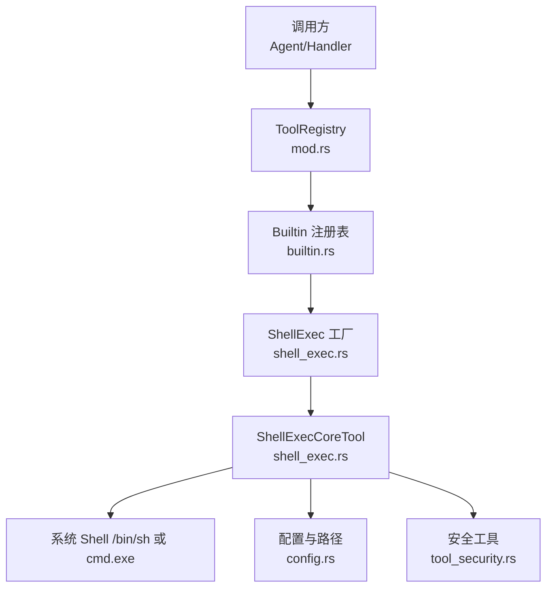
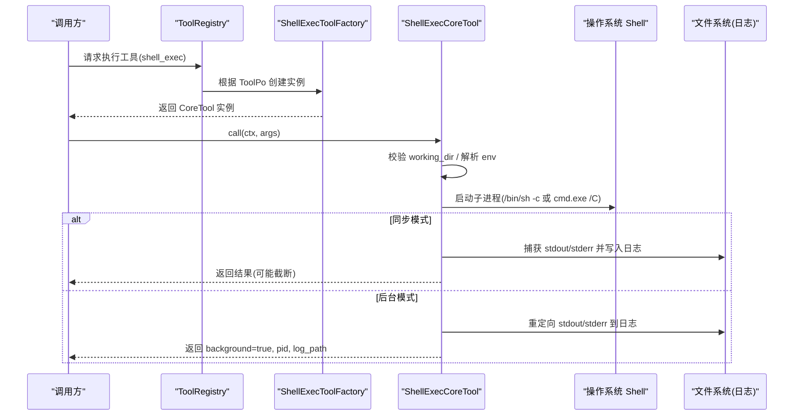
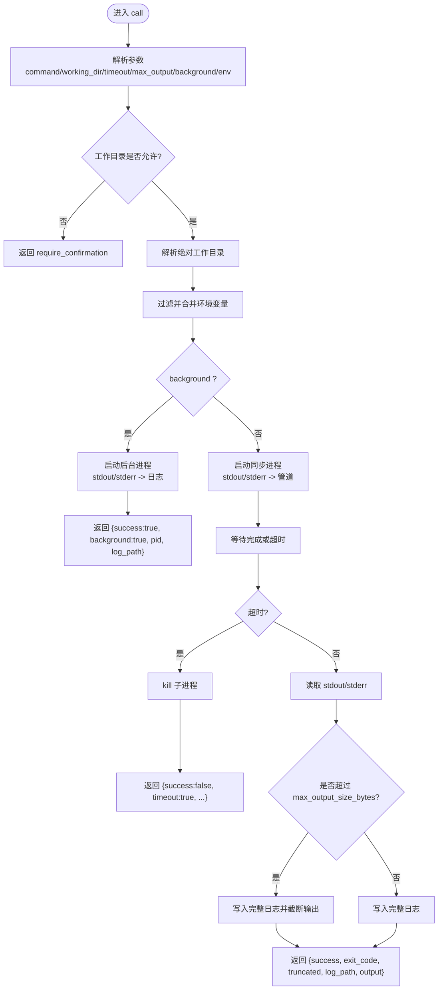
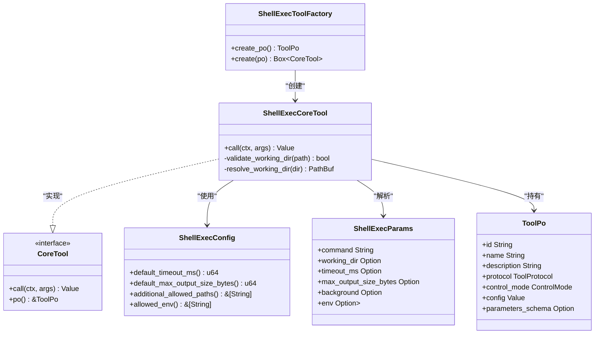
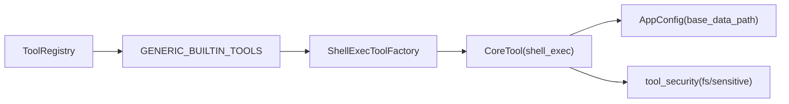

# Shell 执行工具（框架层）

<cite>
**本文引用的文件**
- [shell_exec.rs](src/pkg/tool_registry/shell_exec.rs)
- [tool_security.rs](src/pkg/tool_registry/tool_security.rs)
- [builtin.rs](src/pkg/tool_registry/builtin.rs)
- [mod.rs](src/pkg/tool_registry/mod.rs)
- [tool.rs](src/models/tool.rs)
- [config.rs](common/src/config.rs)
- [shell_tests.rs](src/pkg/tool_registry/shell_tests.rs)
</cite>

## 目录
1. [简介](#简介)
2. [项目结构](#项目结构)
3. [核心组件](#核心组件)
4. [架构总览](#架构总览)
5. [详细组件分析](#详细组件分析)
6. [依赖关系分析](#依赖关系分析)
7. [性能与资源限制](#性能与资源限制)
8. [故障排查指南](#故障排查指南)
9. [结论](#结论)
10. [附录：使用示例](#附录使用示例)

## 简介
本技术文档聚焦于 Shell 执行工具，围绕命令执行引擎、进程管理、输入输出流处理、参数注入、环境变量控制、工作目录隔离、安全沙箱（路径白名单、敏感变量过滤）、超时与资源限制等主题展开。该工具以"内置工具"的形式注册到全局工具注册表，通过统一的 CoreTool 接口被上层调用，支持同步执行与后台运行两种模式，并将输出落盘为日志文件，便于审计与回溯。

> 📌 视角说明（AGENTS §2.1.3 Level 3 互补视角平行卡）：
> 本长文是「Shell 执行工具」主题的 **框架层** 视角。同主题还有以下平行视角卡，请按需交叉阅读：
> - [Shell 执行工具（业务功能层）](docs/wiki/zh/content/功能模块/工具生态系统/内置工具集/Shell%20执行工具.md)
> - [Shell 执行工具（代码落地层）](docs/wiki/zh/content/核心模块/工具注册表/Shell%20执行工具.md)

## 项目结构
Shell 执行工具位于工具注册子系统内，遵循“Adapter → Domain → DAL → DAO”的单向分层原则；Shell 工具属于 pkg 层的通用能力实现，不感知业务领域。其关键文件与职责如下：
- shell_exec.rs：定义 ShellExecConfig、ShellExecParams、ShellExecCoreTool、工厂与执行逻辑（含工作目录校验、环境过滤、超时、输出截断、日志落盘）。
- tool_security.rs：提供通用安全能力（如文件系统路径校验、敏感文件名识别、网络 SSRF 防护等），Shell 工具复用其中的路径与敏感信息过滤思想。
- builtin.rs：集中注册所有内置工具（包含 shell_exec）。
- mod.rs：全局工具注册表 ToolRegistry，负责按协议分发创建具体工具实例。
- tool.rs：定义 CoreTool 抽象、ToolPo/Tool 实体以及工具元数据模型。
- config.rs：应用配置，提供 base_data_path 等基础路径，用于日志与产物落盘。
- shell_tests.rs：针对配置解析、环境变量过滤、参数解析的单元测试。

图表来源
- [mod.rs:29-102](src/pkg/tool_registry/mod.rs#L29-L102)
- [builtin.rs:27-43](src/pkg/tool_registry/builtin.rs#L27-L43)
- [shell_exec.rs:89-148](src/pkg/tool_registry/shell_exec.rs#L89-L148)
- [config.rs:244-257](common/src/config.rs#L244-L257)
- [tool_security.rs:314-419](src/pkg/tool_registry/tool_security.rs#L314-L419)

章节来源
- [mod.rs:29-102](src/pkg/tool_registry/mod.rs#L29-L102)
- [builtin.rs:27-43](src/pkg/tool_registry/builtin.rs#L27-L43)
- [shell_exec.rs:89-148](src/pkg/tool_registry/shell_exec.rs#L89-L148)
- [config.rs:244-257](common/src/config.rs#L244-L257)
- [tool_security.rs:314-419](src/pkg/tool_registry/tool_security.rs#L314-L419)

## 核心组件
- ShellExecConfig：工具级配置，包括默认超时、最大输出大小、额外允许路径、允许继承的环境变量白名单。
- ShellExecParams：运行时参数，包括 command、working_dir、timeout_ms、max_output_size_bytes、background、env。
- ShellExecCoreTool：实现 CoreTool 接口的核心执行器，负责参数校验、工作目录解析与安全校验、环境准备、进程启动、超时控制、输出捕获与落盘、后台模式分离。
- ShellExecToolFactory：根据 ToolPo 构造 ShellExecCoreTool 实例，并声明工具的 JSON Schema 与默认配置。
- 工具注册表：将 shell_exec 作为内置工具注册，供上层通过统一接口调用。

章节来源
- [shell_exec.rs:20-87](src/pkg/tool_registry/shell_exec.rs#L20-L87)
- [shell_exec.rs:89-148](src/pkg/tool_registry/shell_exec.rs#L89-L148)
- [shell_exec.rs:151-208](src/pkg/tool_registry/shell_exec.rs#L151-L208)
- [mod.rs:29-102](src/pkg/tool_registry/mod.rs#L29-L102)
- [tool.rs:16-32](src/models/tool.rs#L16-L32)

## 架构总览
Shell 执行工具在系统中的位置与交互如下：
- 调用方通过工具注册表获取具体工具实例（基于 ToolPo 中的 id 与 protocol）。
- 对于 shell_exec，注册表会调用内置工厂创建 ShellExecCoreTool。
- 执行时，工具依据配置与环境进行安全校验，选择平台对应的 Shell（/bin/sh -c 或 cmd.exe /C），设置工作目录与环境变量，启动子进程。
- 同步模式下，读取 stdout/stderr 并写入日志文件，返回摘要或完整输出（受 max_output_size_bytes 限制）。
- 后台模式下，直接分离进程，将 stdout/stderr 重定向到日志文件，立即返回 PID 与日志路径。

图表来源
- [mod.rs:81-102](src/pkg/tool_registry/mod.rs#L81-L102)
- [shell_exec.rs:256-466](src/pkg/tool_registry/shell_exec.rs#L256-L466)
- [config.rs:399-415](common/src/config.rs#L399-L415)

## 详细组件分析

### 命令执行引擎与进程管理
- 平台适配：根据编译目标选择 /bin/sh -c 或 cmd.exe /C 来执行命令字符串。
- 工作目录：优先使用配置的 base_data_path；若传入相对路径则拼接至 base；绝对路径需通过白名单校验。
- 环境变量：仅继承白名单内的环境变量，并过滤敏感键名（如 password、token、secret 等）；同时支持合并额外 env。
- 超时控制：使用 tokio::time::timeout 包裹进程等待，超时后 kill 子进程并返回超时错误。
- 输出处理：同步模式通过管道捕获 stdout/stderr，写入日志文件；超过阈值时截断并在响应中提示完整输出路径。
- 后台模式：stdout/stderr 直接重定向到日志文件，进程分离，立即返回 PID 与日志路径。

图表来源
- [shell_exec.rs:256-466](src/pkg/tool_registry/shell_exec.rs#L256-L466)
- [shell_exec.rs:473-484](src/pkg/tool_registry/shell_exec.rs#L473-L484)
- [config.rs:399-415](common/src/config.rs#L399-L415)

章节来源
- [shell_exec.rs:256-466](src/pkg/tool_registry/shell_exec.rs#L256-L466)
- [shell_exec.rs:473-484](src/pkg/tool_registry/shell_exec.rs#L473-L484)

### 输入输出流处理
- 同步模式：使用 Stdio::piped() 捕获 stdout/stderr，异步读取到内存缓冲区，再写入日志文件；若超出阈值，仅返回前 N 字节摘要，并在响应中标记 truncated。
- 后台模式：使用 OpenOptions 打开日志文件，分别将 stdout/stderr 重定向到同一日志文件句柄，避免阻塞主流程。
- 日志路径：统一存储在 base_data_path/tools/shell_exec/logs/{trace_id}.log，便于按追踪 ID 检索。

章节来源
- [shell_exec.rs:295-356](src/pkg/tool_registry/shell_exec.rs#L295-L356)
- [shell_exec.rs:357-466](src/pkg/tool_registry/shell_exec.rs#L357-L466)
- [config.rs:399-415](common/src/config.rs#L399-L415)

### 命令参数注入与环境变量设置
- 参数注入：通过 ShellExecParams 接收 command、working_dir、timeout_ms、max_output_size_bytes、background、env。
- 环境变量：
  - 继承白名单：仅允许父进程中的指定环境变量名（默认包含 PATH）。
  - 敏感过滤：即使出现在白名单中，也会过滤掉包含敏感关键字的键名（如 password、token、secret 等）。
  - 额外覆盖：支持通过 env 字段注入额外键值对，覆盖或新增环境变量。

章节来源
- [shell_exec.rs:20-87](src/pkg/tool_registry/shell_exec.rs#L20-L87)
- [shell_exec.rs:210-254](src/pkg/tool_registry/shell_exec.rs#L210-L254)
- [shell_tests.rs:43-102](src/pkg/tool_registry/shell_tests.rs#L43-L102)

### 工作目录控制
- 解析策略：
  - 未指定：使用 base_data_path。
  - 相对路径：拼接至 base_data_path。
  - 绝对路径：必须属于 base_data_path 或 additional_allowed_paths 之一。
- 安全校验：拒绝不在允许范围内的绝对路径，返回 require_confirmation 提示。
- 目录存在性：若不存在则自动创建。

章节来源
- [shell_exec.rs:168-207](src/pkg/tool_registry/shell_exec.rs#L168-L207)
- [shell_exec.rs:264-279](src/pkg/tool_registry/shell_exec.rs#L264-L279)

### 安全沙箱机制、命令白名单、资源限制与超时控制
- 工作目录沙箱：严格限制执行目录范围，防止逃逸到系统敏感区域。
- 环境变量白名单：仅传递允许的环境变量，并过滤敏感键名。
- 输出大小限制：可配置最大输出字节数，超出时截断并记录完整日志。
- 超时控制：默认 300 秒，可通过参数或配置覆盖；超时后终止进程。
- 后台进程：适合长时间任务，避免阻塞调用方；输出仍落盘以便审计。
- 命令白名单：当前实现未提供命令白名单机制；如需启用，应在上游（如 Agent 编排层）增加命令白名单校验后再下发给 shell_exec。

章节来源
- [shell_exec.rs:20-87](src/pkg/tool_registry/shell_exec.rs#L20-L87)
- [shell_exec.rs:210-254](src/pkg/tool_registry/shell_exec.rs#L210-L254)
- [shell_exec.rs:256-466](src/pkg/tool_registry/shell_exec.rs#L256-L466)

### 类图（代码级）

图表来源
- [shell_exec.rs:20-87](src/pkg/tool_registry/shell_exec.rs#L20-L87)
- [shell_exec.rs:89-148](src/pkg/tool_registry/shell_exec.rs#L89-L148)
- [shell_exec.rs:151-208](src/pkg/tool_registry/shell_exec.rs#L151-L208)
- [tool.rs:16-32](src/models/tool.rs#L16-L32)

## 依赖关系分析
- 工具注册表依赖内置工具工厂列表，shell_exec 作为其中之一被注册。
- ShellExecCoreTool 依赖配置模块获取 base_data_path，依赖安全工具的思想进行路径与敏感信息过滤。
- 工具实体 ToolPo/Tool 提供元数据与执行上下文绑定。

图表来源
- [mod.rs:29-102](src/pkg/tool_registry/mod.rs#L29-L102)
- [builtin.rs:27-43](src/pkg/tool_registry/builtin.rs#L27-L43)
- [shell_exec.rs:89-148](src/pkg/tool_registry/shell_exec.rs#L89-L148)
- [config.rs:244-257](common/src/config.rs#L244-L257)
- [tool_security.rs:314-419](src/pkg/tool_registry/tool_security.rs#L314-L419)

章节来源
- [mod.rs:29-102](src/pkg/tool_registry/mod.rs#L29-L102)
- [builtin.rs:27-43](src/pkg/tool_registry/builtin.rs#L27-L43)
- [shell_exec.rs:89-148](src/pkg/tool_registry/shell_exec.rs#L89-L148)
- [config.rs:244-257](common/src/config.rs#L244-L257)
- [tool_security.rs:314-419](src/pkg/tool_registry/tool_security.rs#L314-L419)

## 性能与资源限制
- 超时控制：默认 300 秒，可按需调整；建议结合任务类型设置合理上限，避免长期占用资源。
- 输出大小限制：默认 10MB；大输出场景建议开启后台模式，并通过日志文件查看完整输出。
- 并发与资源：每个命令以独立子进程运行；在高并发场景下需关注系统进程数与 I/O 压力。
- 日志落盘：所有输出均落盘，注意磁盘空间与日志清理策略。

[本节为通用指导，无需特定文件引用]

## 故障排查指南
- 工作目录不允许：检查 working_dir 是否为 base_data_path 或 additional_allowed_paths 的子路径；若为绝对路径且不在允许范围内，将返回 require_confirmation。
- 环境变量缺失：确认 allowed_env 白名单是否包含所需变量；必要时在 env 中注入额外变量。
- 超时错误：检查 timeout_ms 是否过小；后台任务可在日志中观察进度。
- 输出过大：若 truncated=true，请查看日志文件获取完整输出。
- 进程启动失败：检查命令是否存在、工作目录权限、Shell 可用性与环境变量完整性。

章节来源
- [shell_exec.rs:264-279](src/pkg/tool_registry/shell_exec.rs#L264-L279)
- [shell_exec.rs:385-466](src/pkg/tool_registry/shell_exec.rs#L385-L466)
- [shell_tests.rs:43-102](src/pkg/tool_registry/shell_tests.rs#L43-L102)

## 结论
Shell 执行工具提供了安全可控的命令执行能力，具备工作目录沙箱、环境变量白名单与敏感过滤、超时与输出大小限制、后台模式与日志落盘等特性。建议在更高层（如 Agent 编排）引入命令白名单与更细粒度的资源配额，以进一步增强安全性与稳定性。

[本节为总结性内容，无需特定文件引用]

## 附录：使用示例
以下为常见使用场景的参数说明（不展示具体代码，仅提供参数结构与行为说明）：
- 简单命令执行：
  - 必填：command
  - 可选：working_dir、timeout_ms、max_output_size_bytes、background=false
  - 行为：同步执行，捕获 stdout/stderr，写入日志，返回摘要或完整输出。
- 管道操作：
  - 通过 command 传入管道表达式（例如组合多个命令），由系统 Shell 解释执行。
  - 注意：管道复杂度较高时，建议拆分命令或使用脚本文件，便于调试与审计。
- 脚本运行：
  - 将脚本置于允许的工作目录下，command 指向脚本路径并赋予执行权限。
  - 建议使用后台模式运行长耗时脚本，通过日志文件跟踪输出。
- 环境变量注入：
  - 通过 env 字段注入额外变量；确保变量名不在敏感过滤列表中。
  - 若需要继承父进程变量，需在 allowed_env 白名单中显式配置。
- 工作目录控制：
  - 相对路径会自动拼接至 base_data_path；绝对路径必须在 base_data_path 或 additional_allowed_paths 中。
- 超时与资源限制：
  - 通过 timeout_ms 控制执行时长；通过 max_output_size_bytes 控制输出大小。
  - 后台模式适合长时间任务，避免阻塞调用方。

章节来源
- [shell_exec.rs:70-87](src/pkg/tool_registry/shell_exec.rs#L70-L87)
- [shell_exec.rs:256-466](src/pkg/tool_registry/shell_exec.rs#L256-L466)
- [shell_tests.rs:104-145](src/pkg/tool_registry/shell_tests.rs#L104-L145)