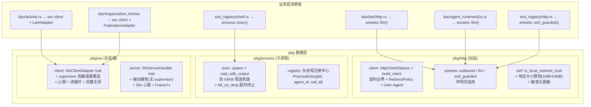

# pkg 基建统一

<cite>
**本文引用的文件**
- [src/pkg/http/mod.rs](src/pkg/http/mod.rs)
- [src/pkg/http/client.rs](src/pkg/http/client.rs)
- [src/pkg/http/ssrf.rs](src/pkg/http/ssrf.rs)
- [src/pkg/http/presets.rs](src/pkg/http/presets.rs)
- [src/pkg/process/mod.rs](src/pkg/process/mod.rs)
- [src/pkg/process/exec.rs](src/pkg/process/exec.rs)
- [src/pkg/ws/mod.rs](src/pkg/ws/mod.rs)
- [src/pkg/ws/server.rs](src/pkg/ws/server.rs)
- [src/pkg/mod.rs](src/pkg/mod.rs)
- [src/service/dao/lark/http.rs](src/service/dao/lark/http.rs)
- [src/service/dao/agent_runtime/a2a.rs](src/service/dao/agent_runtime/a2a.rs)
- [src/pkg/tool_registry/http.rs](src/pkg/tool_registry/http.rs)
- [src/service/dao/lark/ws.rs](src/service/dao/lark/ws.rs)
- 【④ RAG 知识卡】[pkg 基建统一](docs/wiki/knowledge/zh/pkg%20基建统一：pkg/http%20+%20pkg/process/exec%20+%20pkg/ws%20单一原语/pkg%20基建统一：pkg/http%20+%20pkg/process/exec%20+%20pkg/ws%20单一原语.md) — HTTP + process + WS 三件套硬约束 §4 七条
- 【关联长文】[内置工具系统](docs/wiki/zh/content/基础设施/工具注册表/内置工具系统.md) — shell_exec / http_fetch 内置工具走 pkg::process::exec / pkg::http::ssrf_guarded
- 【关联长文】[HTTP 工具](docs/wiki/zh/content/基础设施/工具注册表/HTTP%20工具.md) — HTTP 工具内置 builtin fetch_remote_content 走 pkg::http::presets
- 【关联长文】[Shell 执行工具](docs/wiki/zh/content/基础设施/工具注册表/Shell%20执行工具.md) — shell_exec builtin 走 pkg::process::exec wait_with_output
- 【关联卡】[联邦组网地基](docs/wiki/knowledge/zh/联邦组网地基：scope%20三态%20+%20organization_links%20+%20pairing_code%20+%20目录同步%20+%20WS%20长连接/联邦组网地基：scope%20三态%20+%20organization_links%20+%20pairing_code%20+%20目录同步%20+%20WS%20长连接.md) — 联邦 WS 长连接业务层消费 pkg::ws 通用管理器
- **2026-09-05 更新摘要**：pkg 层三项基建从散落在各 DAO 直调 reqwest::Client/Command::new() 统一为 pkg 单一原语。HTTP 出站：client HttpClientOptions + presets(outbound/llm/ssrf_guarded) + ssrf 安全三件套（本地 IP 黑名单 + 响应大小限制 + 敏感头脱敏）。子进程：exec wait_with_output 并发读管道防 64KB 死锁 + kill_on_drop 超时终止。WS：WsClientAdapter / WsServerHandler adapter 模式 + supervisor 指数退避重连 + 心跳，不含业务语义。lark http / a2a runtime / tool_registry / lark ws 四个主要消费者全部迁移完成。
</cite>

## 目录
1. [简介](#简介)
2. [架构总览](#架构总览)
3. [pkg/http 统一入口](#pkghttp-统一入口)
4. [pkg/process 执行原语](#pkgprocess-执行原语)
5. [pkg/ws 通用管理器](#pkgws-通用管理器)
6. [迁移路径与消费者](#迁移路径与消费者)
7. [安全约束](#安全约束)
8. [故障排查指南](#故障排查指南)
9. [总结](#总结)
10. [附录：预设矩阵](#附录预设矩阵)

## 简介
本章节面向 pkg 层三项基建统一重构，系统性说明全项目出站 HTTP 调用、短命 CLI 子进程执行、通用 WebSocket 长连接三个基础设施模块的统一入口设计。重构目标：消除散落在 DAO 层的裸 `reqwest::Client::new()` / `Command::new()` 调用，改为 pkg 层单一原语——业务层只声明"要哪种客户端预设"或"执行什么命令"，不再手写 builder 和 spawn。硬约束：默认必带超时，禁止裸 reqwest 实例，exec 必用 wait_with_output，WS 管理器不含业务语义。

## 架构总览

**图表来源**
- [http/mod.rs:L1-L34](src/pkg/http/mod.rs#L1-L34)
- [process/exec.rs:L1-L321](src/pkg/process/exec.rs#L1-L321)
- [ws/mod.rs:L1-L635](src/pkg/ws/mod.rs#L1-L635)

## pkg/http 统一入口

三层职责清晰分离：
- **client**（client.rs）：`HttpClientOptions` 声明式选项 + `build_client` 单一构建函数。DEFAULT_TIMEOUT_MS=30_000 / MAX_TIMEOUT_MS=600_000(10min 硬上限) / USER_AGENT=ai-orz/<CARGO_PKG_VERSION> / RedirectPolicy{Default, None, Limit(n), Permanent}。硬约束：任何配置路径下超时都落在 1ms..=MAX_TIMEOUT 区间，禁止超时为零或无限。
- **presets**（presets.rs）：业务侧常用预设，声明式选用。outbound() 30s 一般出站 / llm() 120s LLM 推理（推理长上下文+工具调用循环）/ ssrf_guarded() 30s+本地IP阻断+1MB响应限制 / with_timeout(30s) 自定义叠加。FEDERATION_TIMEOUT_MS=30_000 联邦出站专用。
- **ssrf**（ssrf.rs）：安全校验三件套。is_local_network_host（localhost + 127/10/172/192/169.254 内网段 + DNS 解析）+ DEFAULT_RESPONSE_MAX_BYTES=1MB / HARD_RESPONSE_MAX_BYTES=10MB + 敏感头脱敏（authorization/cookie/x-api-key 替换为 [REDACTED]）。

章节来源
- [http/mod.rs:L1-L34](src/pkg/http/mod.rs#L1-L34)
- [http/client.rs:L1-L200](src/pkg/http/client.rs#L1-L200)
- [http/ssrf.rs:L1-L230](src/pkg/http/ssrf.rs#L1-L230)
- [http/presets.rs:L1-L119](src/pkg/http/presets.rs#L1-L119)

## pkg/process 执行原语

两层互补：
- **exec（生产端，exec.rs）**：短命 CLI 调用（gh/lark/browser/codex 等）。关键设计：输出捕获**恒用 wait_with_output()**——先 wait() 后读 stdout 的写法在输出超过 ~64KB 管道缓冲区时双向阻塞直到超时，exec 原语下此死锁结构性不可能发生。超时必终止（kill_on_drop=true 默认）。DEFAULT_EXEC_TIMEOUT=60s / MAX=600s。stdin 写入 best-effort（Broken pipe 合法，结果由 stdout 决定）。
- **registry（管理端，mod.rs）**：Agent 可管理的长生命周期进程（如 shell_exec 后台模式）。ProcessEntry{pid, cmd, agent_id, call_id, started_at} 供 shell_kill 权限边界审计。v1 接受 pid 复用风险（OS 层 pid 可能复用），entry 带 started_at 人工甄别。

章节来源
- [process/exec.rs:L1-L321](src/pkg/process/exec.rs#L1-L321)
- [process/mod.rs:L1-L278](src/pkg/process/mod.rs#L1-L278)

## pkg/ws 通用管理器

**核心设计：不含任何业务语义**——帧解析、业务帧类型映射、federation/lark/agent 关键词全部交给 adapter 实现方。
- **client 侧**（ws/mod.rs）：WsClientAdapter trait（heartbeat_frame() 返回自定义文本帧或 None=默认 WS Ping 控制帧）+ supervisor 指数退避重连 + 30s 心跳 + 读循环 + 优雅关闭 stop_client + conn_state_snapshot 状态快照。
- **server 侧**（ws/server.rs）：被动接受连接（无 supervisor，断开即结束——对端负责重拨）+ 30s 心跳 + WsServerHandler trait + FrameTx 出站句柄。握手鉴权在 upgrade 前由调用方完成。

章节来源
- [ws/mod.rs:L1-L635](src/pkg/ws/mod.rs#L1-L635)
- [ws/server.rs:L1-L141](src/pkg/ws/server.rs#L1-L141)

## 迁移路径与消费者

| 消费者 | 原实现 | 迁移后 |
|--------|--------|--------|
| dao/lark/http.rs | 直调 reqwest::Client::builder() + 自定义超时 | pkg::http::presets::llm() 120s 推理超时 |
| dao/agent_runtime/a2a.rs | 直调 reqwest::Client | pkg::http::presets::llm() |
| tool_registry/http.rs (fetch_remote_content) | 原 pkg/utils/http_security 模块 | pkg::http::presets::ssrf_guarded() 30s + 本地阻断 + 1MB |
| dao/lark/ws.rs | 自行实现 WS 重连 + 心跳 | pkg::ws::client + LarkAdapter(heartbeat_frame=自定义 JSON ping) |
| dao/organization_link/ws | 无 | pkg::ws::client + FederationAdapter(P8 阶段2) |
| tool_registry/shell.rs (shell_exec) | 原 Command::new + spawn + wait | pkg::process::exec() + wait_with_output 防死锁 |

章节来源
- [lark/http.rs](src/service/dao/lark/http.rs)
- [a2a.rs](src/service/dao/agent_runtime/a2a.rs)
- [http.rs](src/pkg/tool_registry/http.rs)

## 安全约束

1. 业务层禁止直接调用 reqwest::Client::new() / .builder()——全局 grep 不应命中 pkg/http/ 外的 reqwest::Client::new
2. exec 原语输出捕获恒用 wait_with_output()——禁止先 wait() 再读 stdout，否则输出 >64KB 时双向阻塞
3. pkg::ws 严禁嵌入业务语义——静态 grep pkg::ws 目录无 federation/lark/agent 关键词
4. SSRF 防护三件套必须同时启用（URL 校验 + 响应大小限制 + 敏感头脱敏）
5. exec 超时必终止 kill_on_drop=true，禁止业务层设 false

## 故障排查指南

1. **HTTP 出站超时但不想用 ssrf_guarded 默认 30s** → 用 `HttpClientOptions::new().with_timeout_ms(60000).build_client()` 叠加自定义超时；禁止绕过 presets 直调 reqwest
2. **exec 子进程 stdout/stderr 输出丢失** → 检查是否用了 wait_with_output()；先 wait() 后读的写法在输出超过 64KB 管道缓冲区时会永久阻塞直到超时，exec 原语已解决此问题
3. **WS 连接断了但没有自动重连** → supervisor 重连只适用于 client 侧；server 侧被动接受，断开即结束，对端负责重拨。检查 WsClientAdapter 是否正确实现了心跳和 supervisor 逻辑
4. **SSRF 防护误伤合法内网地址** → HttpClientOptions::ssrf_guard(true) 时默认 is_local_network_host 返回 true 的地址会被阻断；如果是受控内网服务，可显式传 `with_ssrf_guard(false)`（需注明理由）或换 ssrf_guarded 预设之外的 HttpClientOptions

## 总结

pkg 层三项基建统一从散落调用升级为单一原语。HTTP 出站通过 HttpClientOptions 声明式构建解决了"无超时永久挂起 + SSRF 防护分叉 + 敏感头遗漏"三个痛点；子进程 exec 原语用 wait_with_output 结构性消除了 64KB 管道死锁；WS 通用管理器通过 adapter 模式实现 pkg 不感知业务、业务不碰生命周期。四个主要消费者（lark http / a2a runtime / tool_registry / lark ws）全部迁移完成，无裸 reqwest 或 Command 残留。

## 附录：预设矩阵

| 预设 | 超时 | SSRF 防护 | 响应大小 | 重定向 | 适用场景 |
|------|------|-----------|----------|--------|----------|
| outbound() | 30s | 开 | 1MB | Default | 一般管理面 / webhook / 三方 API |
| llm() | 120s | 开 | 10MB | Default | LLM 推理 / 跨组织 A2A delegation |
| ssrf_guarded() | 30s | 开+严格 | 1MB | **None** | HTTP 工具 / fetch_remote_content |
| 自定义 | 叠加 | 可选 | 可选 | 可选 | 极少数特殊场景 |
