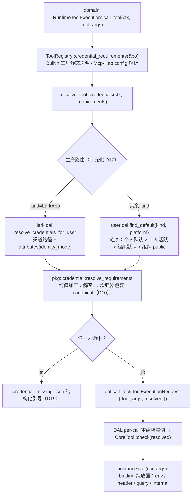

# 共享工具凭据增强器

<cite>
**本文引用的文件**
- [identity_credentials.rs](common/src/models/identity_credentials.rs)
- [credential/mod.rs](src/pkg/credential/mod.rs)
- [credential/enhancer.rs](src/pkg/credential/enhancer.rs)
- [tool_registry/mod.rs](src/pkg/tool_registry/mod.rs)
- [tool_registry/http.rs](src/pkg/tool_registry/http.rs)
- [tool_registry/mcp.rs](src/pkg/tool_registry/mcp.rs)
- [tool_registry/gh_cli.rs](src/pkg/tool_registry/gh_cli.rs)
- [tool_registry/tavily_search.rs](src/pkg/tool_registry/tavily_search.rs)
- [tool_registry/lark_cli.rs](src/pkg/tool_registry/lark_cli.rs)
- [tool_registry/tool_readiness.rs](src/pkg/tool_registry/tool_readiness.rs)
- [tool_registry/tool_security.rs](src/pkg/tool_registry/tool_security.rs)
- [runtime/tool_execution.rs](src/service/domain/runtime/tool_execution.rs)
- [runtime/mod.rs](src/service/domain/runtime/mod.rs)
- [dal/tool.rs](src/service/dal/tool.rs)
- [dal/mcp_tool.rs](src/service/dal/mcp_tool.rs)
- [dal/lark/credentials.rs](src/service/dal/lark/credentials.rs)
- [models/tool.rs](src/models/tool.rs)
- [handlers/finance/mcp_server/create_mcp_server.rs](src/handlers/finance/mcp_server/create_mcp_server.rs)
- [handlers/finance/tool/update_tool.rs](src/handlers/finance/tool/update_tool.rs)
- [credential_form.rs](frontend/src/components/credential_form.rs)
- [credential_requirements.rs](frontend/src/components/credential_requirements.rs)
- [create_http_tool.rs](frontend/src/components/create_http_tool.rs)
- [mcp_servers.rs](frontend/src/pages/finance/mcp_servers.rs)
- [tool_detail.rs](frontend/src/pages/finance/tool_detail.rs)

### 本文关联的文档

**① 设计文档（Design）**：
- [docs/design/tool_credential_requirement_design.md](docs/design/tool_credential_requirement_design.md) — 决策快照 v1.9，D1-D28 全决策表（类型级需求声明 / 增强器模型 / 生产端二元化 / check 单次实例 / 入口统一 / tavily 兜底废除 / PO config 闭环）

**② 落地计划（Plan）**：
- [docs/plan/共享工具凭据增强器落地.md](docs/plan/共享工具凭据增强器落地.md) — 落地流程与执行结果快照（Phase 1-5 全部完成，提交链 a22eede3 → 67012420）

**④ RAG 原子知识卡**：
- [共享工具凭据增强器：类型级需求声明 + domain 编排注入 + check 单次实例](docs/wiki/knowledge/zh/共享工具凭据增强器：类型级需求声明 + domain 编排注入 + check 单次实例/共享工具凭据增强器：类型级需求声明 + domain 编排注入 + check 单次实例.md) — 本特性的原子召回卡（§4 硬约束速查）
- [工具系统三层调用架构：CoreTool trait + Builtin HTTP MCP 三协议路由 + register_handler_tool 宏 + 神经工具免绑定三层校验](docs/wiki/knowledge/zh/工具系统三层调用架构：CoreTool trait + Builtin HTTP MCP 三协议路由 + register_handler_tool 宏 + 神经工具免绑定三层校验/工具系统三层调用架构：CoreTool trait + Builtin HTTP MCP 三协议路由 + register_handler_tool 宏 + 神经工具免绑定三层校验.md) — 语义相邻卡：本特性改造了该卡覆盖的三层调用链（入口统一 D26 + CoreTool 生命周期 D22）
- [身份凭证统一链路（总卡：模型层 + Domain 层 CRUD + Handler 层 API + 外部集成联动 + CredentialDetail 类型无关下沉）](docs/wiki/knowledge/zh/身份凭证统一链路（总卡：模型层 + Domain 层 CRUD + Handler 层 API + 外部集成联动 + CredentialDetail 类型无关下沉）/身份凭证统一链路（总卡：模型层 + Domain 层 CRUD + Handler 层 API + 外部集成联动 + CredentialDetail 类型无关下沉）.md) — 凭据生产端上游：本特性扩展其 CredentialKind（GenericToken / OAuth / UserPassword 三新变体）与 platform 匹配维度
</cite>

## 更新摘要
**变更内容**（2026-08-21 落地，提交链 a22eede3 → 67012420，Phase 1-5 全部完成）：
- MCP Server / HTTP 工具的凭据消费从「配置内嵌原文（env / headers 字段）」整体迁移为「类型级需求声明 + 凭据增强器」——MCP config 的 env / headers 字段整体删除，无兼容层（D14）
- 新增 common 契约 `CredentialRequirement` / `CredentialEnhancerKind` / `CredentialBinding`；`CredentialKind` 增 GenericToken / OAuth / UserPassword 三变体；匹配键升级 (kind, platform) 二元组（D3/D20）
- 新建 pkg 纯值加工模块 `src/pkg/credential/`（零数据访问）：ResolvedCredential + 三增强器（BearerToken / BasicAuth / AccessToken）+ OAuthTokenManager（TTL 缓存 + SSRF 校验）+ resolve_requirements 纯函数 + validate_requirements 五规则（D17）
- `CoreTool` trait 增生命周期方法 `credential_requirements()` + `check(&mut self, resolved)`；编排层每次调用 create → check → call，实例单次使用（D22）
- 工具调用入口统一：所有 Agent 工具调用经 domain `RuntimeToolExecution::call_tool` 单点编排；think_loop 切换；DAL `call_tool_by_id` / `execute_auto` / `execute_manual` 双删；`ToolExecutionRequest { tool, args, resolved }` 统一传参（D26）
- 内置工具 gh_cli / tavily_search / lark_cli 统一工厂化，per-tool resolver trait 与 OnceLock 注册三清零（D17）；tavily 共享 config 兜底废除（D27）；CLI 型工具参数进 PO config + readiness 数据驱动（D28）——达成「全局 config 零工具参数」不变式
- Builtin 工具更新管道 diff 式 guard：工厂字段（name / description / protocol / control_mode / parameters_schema / tags）不可改，config / status 放行
- 前端：`credential_form` 共享模块（六规则预校验 + is_sensitive_name 同源复刻）、`CredentialRequirementsTable` 只读组件、MCP 创建 modal 凭据需求编辑器、HTTP 工具表单敏感名即时预检、工具详情配置编辑卡片
- 验收：后端 lib 单测 1046 passed / 集成 23 target 102 passed / 前端 120 passed / clippy 双端零警告

## 目录
1. [简介](#简介)
2. [核心数据结构与契约](#核心数据结构与契约)
3. [架构原理与流程](#架构原理与流程)
4. [边界与行为红线](#边界与行为红线)
5. [详细实现分析](#详细实现分析)
6. [代码组织与扩展点](#代码组织与扩展点)
7. [运维与监控](#运维与监控)
8. [常见故障排查](#常见故障排查)
9. [最佳实践](#最佳实践)
10. [结论与未来方向](#结论与未来方向)

## 简介
共享工具凭据增强器解决的是一对结构性矛盾：**工具是组织共享的，凭据是用户私有的**。共享工具配置里一旦出现凭据实例（credential_id 或原文），等同于把私人凭据公开——任何人调用该工具，都会以凭据主人的身份对外执行。历史上 MCP Server 配置的 `env` / `headers` 字段允许凭据原文直接落库到共享配置，是本特性根除的问题源。

本特性把共享工具的凭据消费拆为两层：

- **配置层（静态声明）**：requirement 只声明匹配键 `(kind, platform, field?)`、增强器类型 `enhancer?`、注入点 `binding`——三者皆非敏感，不引用任何凭据实例；增强器在工具配置中一并选定（配置即闭环）。
- **运行层（编排注入 + 实例消费）**：domain 编排层读 PO 需求声明 → user dal `find_default` 取数（生产路由二元化：LarkApp 走 lark dal 渠道路径，其余走 user dal）→ pkg 纯函数加工（解密 + 增强器 / canonical）→ 工具工厂实例化并经 check 生命周期注入——工具实例单次使用，凭据是对象状态；工具 call 内只做 binding 纯放置，零数据访问。

原始凭据获取后的**衍生行为**（前缀拼接、多字段组装、OAuth 刷新换短期 token）统一建模为**凭据增强器**：pkg 中实现并封装好的行为规范，requirement 声明增强器类型，加工结果经 check 注入工具实例。与 lark_cli / gh_cli / tavily_search 的「工具无状态共享，身份在调用时注入」精神同构——本特性将其泛化为「DB 注册共享工具可配置 + 内置工具统一工厂化」。

章节来源
- [tool_credential_requirement_design.md#L15-L34](docs/design/tool_credential_requirement_design.md#L15-L34)
- [共享工具凭据增强器落地.md#L14-L18](docs/plan/共享工具凭据增强器落地.md#L14-L18)

## 核心数据结构与契约
### CredentialRequirement（类型级需求声明）
```rust
pub struct CredentialRequirement {
    pub kind: CredentialKind,          // 需要的凭据类型
    pub platform: Option<String>,      // 平台标识（generic 类必填，专用 kind 留空）
    pub field: Option<String>,         // 提取字段：None = 规范可用值；与 enhancer 互斥
    pub enhancer: Option<CredentialEnhancerKind>, // 增强器：None = canonical
    pub binding: CredentialBinding,    // 注入点（纯放置）
}
```
- 匹配键升级为 `(kind, platform)` 二元组（D3）：`user_credentials` 表加 `platform TEXT NULL` 列，默认唯一索引升级为 `(user_id, kind, platform)` / `(org_id, kind, platform)`（D20）；显示名（label）永不参与匹配。
- `CredentialKind` 六变体：既有专用 kind（lark_app / github_token / tavily_key）+ 本特性新增 GenericToken（`{ token }`，承载 Notion/Linear 等平台长尾 PAT）/ OAuth（§5 详析）/ UserPassword（`{ username, password }`，BasicAuth 增强器的双字段宿主）。

### CredentialEnhancerKind 与 supports 矩阵
```rust
pub enum CredentialEnhancerKind { BearerToken, BasicAuth, AccessToken }
```
supports 矩阵 v1（前后端一致，D12）：BearerToken → generic_token + oauth；BasicAuth → user_password；AccessToken → oauth；**专用 kind（lark_app / github_token / tavily_key）零支持**。默认装配（D7）：oauth 凭据构造时只装配 AccessToken（refresh_token / client_secret 物理不可达）；user_password 只装配 BasicAuth（裸 username / password 无默认注入路径）；generic_token 等单值 kind 不主动装配默认增强器。

### CredentialBinding（注入点，纯放置）
```rust
pub enum CredentialBinding {
    Env { name: String },       // 子进程环境变量（stdio MCP）
    Header { name: String },    // HTTP 请求头（http MCP / HTTP 工具）
    Query { name: String },     // URL 查询参数（HTTP 工具）
    Internal { field: String }, // 工具实例字段（内置工具消费形态，D25）
}
```
binding 只指注入位置，Bearer / Basic 等前缀拼接归增强器——职责正交（D9）：增强器管「值怎么来」，binding 管「值放哪」。

### CoreTool 生命周期方法（D22）
```rust
pub trait CoreTool: Send + Sync + DynClone {
    fn credential_requirements(&self) -> Vec<CredentialRequirement> { Vec::new() }
    fn check(&mut self, resolved: &[ResolvedRequirement]) -> Result<()>;
}
```
共享工具从实例 config 读 requirements；内置工具静态声明（模块级单点声明函数，工厂与实例同源）。

### ToolExecutionRequest（domain → DAL 统一传参，D26）
```rust
pub struct ToolExecutionRequest {
    pub tool: ToolPo,                          // PO 载体（实例由 DAL per-call 重组装）
    pub args: Value,
    pub resolved: Vec<ResolvedRequirement>,    // 编排层已加工的注入值
}
```
内部调用结构非 HTTP DTO 不进 common；命名规避 models/cortex_types.rs 既有 ToolCallRequest（LLM 调用描述符），与既有 ToolExecutionResult 成对。

章节来源
- [identity_credentials.rs#L587-L669](common/src/models/identity_credentials.rs#L587-L669)
- [tool.rs#L17-L46](src/models/tool.rs#L17-L46)
- [tool.rs#L89-L96](src/models/tool.rs#L89-L96)
- [共享工具凭据增强器落地.md#L61-L95](docs/plan/共享工具凭据增强器落地.md#L61-L95)

## 架构原理与流程
### 配置期（管理面）
MCP Server 与 HTTP 工具的 config 内各挂 `credential_requirements[]` 数组；创建 / 更新 handler 接入 `validate_requirements` 五规则校验（前端预校验同源）：binding↔协议匹配、platform↔kind 匹配、field↔enhancer 互斥、enhancer↔kind supports 矩阵、(kind, platform, 注入点名) 三元组去重；显式选择默认增强器幂等归一（等价于不选，D11）。落库 config 零凭据原文、零 credential_id。

### 运行期（编排注入）


组合规则（D10）：`注入值 = 显式增强器( canonical(凭据) )`——显式增强器包裹规范值，默认增强器是规范值的生产者，链内隐式参与；物理上不存在同一增强器执行两次。

### 入口统一（D26）
所有 Agent 工具调用经 domain `RuntimeToolExecution` 单点编排：think_loop 的 control_mode 分发改走 domain（Auto → `call_tool` 协议路由；Manual → `dispatch_manual_tool` 转发，真实执行仍兜回 `call_manual_tool_for_agent` → `call_tool`，凭据在真实执行时编排）。`ToolDal::call_tool_by_id` / `McpToolDal::call_tool_by_id` 删除（全仓无生产调用方），`ToolDal::execute_auto` / `execute_manual` 随 think_loop 切换一并删除。顺带修复：现状 think_loop Auto 路径的 MCP 工具是 ManagementOnlyTool 占位（主循环实际不可执行），切到 domain 协议路由后可执行。

图表来源
- [tool_execution.rs#L36-L101](src/service/domain/runtime/tool_execution.rs#L36-L101)
- [tool_execution.rs#L393-L450](src/service/domain/runtime/tool_execution.rs#L393-L450)
- [tool_registry/mod.rs#L142-L160](src/pkg/tool_registry/mod.rs#L142-L160)

章节来源
- [tool_credential_requirement_design.md#L106-L145](docs/design/tool_credential_requirement_design.md#L106-L145)
- [tool_execution.rs#L36-L101](src/service/domain/runtime/tool_execution.rs#L36-L101)

## 边界与行为红线
1. ❌ **共享配置红线**：落库 config 禁 credential_id；MCP config 零 env / headers 字段（D14 字段整体移除无兼容层）；HTTP config 的 headers/query 禁敏感名条目（静态值与 `{{args.*}}` 模板同禁，D15）；`credential_requirements` 仅含匹配键 + 增强器 + 注入点声明（非敏感，可直接展示）。
2. ❌ **注入红线**：最终注入值只进子进程 env / HTTP 请求头 / 查询串 / 内置工具实例字段；binding 纯放置零变换；禁入工具入参 schema、禁入返回值、禁入日志、禁入错误信息。
3. ❌ **解析红线**：链序单点收敛在 `UserCredentialDao::find_default`（含 platform 维度），消费侧禁止自实现；取数只发生在 service 编排层（domain）——pkg 与工具实例零数据访问；secret 解密后仅存于当次调用栈与单次工具实例字段。
4. ❌ **能力红线**：OAuth 凭据只装配 AccessToken 默认增强器、user_password 只装配 BasicAuth 默认增强器——refresh_token / client_secret / 裸 username / 裸 password 无默认注入路径（能力管控优于规则管控，D7）；增强器可用性以 supports 矩阵单点判定，前后端一致（D12）。
5. ❌ **resolver 红线**：Gh / Tavily / Lark 三个 per-tool resolver trait 与 Dal 实现整体删除（D17）；dal 生产端仅两个——user dal `find_default` 与 lark dal `resolve_credentials_for_user`，禁止第三处自建取数；tavily 共享 config 兜底废除（D27），凭据无任何非凭证库来源。
6. ❌ **实例生命周期红线**（D22）：凭据注入值与用户维度是工具实例状态——实例每次调用经 create → check → call 单次使用，禁止跨调用复用实例（串号风险）；带 requirements 的 stdio server 禁止全局共享连接（per-operation 连接 + 实例级注入即结构性隔离，D23）。
7. ❌ **工具参数闭环红线**（D27/D28）：全局 config 零工具参数（`[tavily]` / `[browser]` 段已废）——工具行为参数与 CLI 命令唯一归宿是工具自身 PO config（非敏感、org 管理页可改）；凭据类参数唯一归宿是用户凭证库；新工具接入禁止再向全局 config 添加工具段。
8. ❌ **入口红线**（D26）：think_loop 禁直连 tool_dal / mcp_tool_dal——凭据编排挂在 domain call_tool 单点，主循环绕行直连 DAL 会整条漏注入。
9. ✅ **Builtin 工厂所有权字段保护**：DAO 更新 guard 从全字段挡改为工厂字段保护——name / description / protocol / control_mode / parameters_schema / tags 不可改，config / status 放行（顺带修复 Builtin 启停被挡的 bug）；Builtin config 变化不触发向量重索引。

章节来源
- [tool_credential_requirement_design.md#L391-L402](docs/design/tool_credential_requirement_design.md#L391-L402)
- [update_tool.rs#L107-L133](src/handlers/finance/tool/update_tool.rs#L107-L133)

## 详细实现分析
### domain 编排层：call_tool 单点 + resolve_tool_credentials 生产路由
[tool_execution.rs](src/service/domain/runtime/tool_execution.rs#L36-L101) 的 `call_tool` 是所有 Agent 工具调用的单点编排：读 requirements（经 ToolRegistry 聚合）→ `resolve_tool_credentials` 取数加工 → 协议路由（Builtin / Http 走 tool dal，Mcp 走 mcp_tool dal）或缺凭据引导。`resolve_tool_credentials`（[L393-L450](src/service/domain/runtime/tool_execution.rs#L393-L450)）实现生产路由二元化：kind=LarkApp → `LarkCredentialDal::resolve_credentials_for_user`（渠道路径 + attributes{identity_mode}，D24）；其余 kind → `UserDal::find_default(ctx, user_id, kind, platform)`。依赖经 `RuntimeDomainImpl` 字段构造注入（`user_dal` / `lark_credentials`），禁止方法内取全局单例。`tool_readiness`（[L271-L392](src/service/domain/runtime/tool_execution.rs#L271-L392)）数据驱动就绪判定：CLI 型 = `po.cli_command()` → `command_available` 纯函数；key 型 = requirements → 复用 resolve（Some→Ready / None→NotReady / Err→Unknown）；无要求 → Ready；TTL 缓存 30s（key 型 tool|user 维度）。

### pkg 纯值加工层：src/pkg/credential/（零数据访问）
[credential/mod.rs](src/pkg/credential/mod.rs#L22-L293) 门面：`ResolvedCredential` 凭据对象（`enhance` 代理执行 + `canonical_value` 查找链：detail 字段 → attributes 派生属性 → primary_secret）、`decrypt_detail` 解密单点（与 encrypt_sensitive 对称）、`resolve_requirements` 纯函数（requirement + dal 生产凭据 → 注入值列表，内部解密 + 增强）、`validate_requirements` 配置期五规则校验、`credential_missing_json` 缺凭据结构化引导（D19）。[enhancer.rs](src/pkg/credential/enhancer.rs#L26-L210)：`CredentialEnhancer` trait + 三内置增强器 + `OAuthTokenManager`（TTL 内存缓存：命中且剩余 > 60s 直返；miss 则 SSRF 校验 endpoint → POST refresh → 解析 access_token / expires_in → 提前 60s 过期写缓存；刷新失败不缓存失败结果）。模块不隶属 tool_registry（依赖方向 tool_registry → credential 单向），无 ctx / 无数据访问 / 无注入注册。

### check 注入：HTTP 工具与 MCP Server
[http.rs](src/pkg/tool_registry/http.rs#L113-L160)：`HttpCoreTool` 从 config 读 requirements，`check` 存 header / query 注入值；`execute_http_call` 模板渲染**之后**叠加实例注入值。敏感名拒绝由 [validate_no_sensitive_template_keys](src/pkg/tool_registry/http.rs#L469-L500) 独立函数承担（静态值与模板同判，复用 [is_sensitive_header](src/pkg/tool_registry/tool_security.rs#L173-L182)）。[mcp.rs](src/pkg/tool_registry/mcp.rs#L345-L406)：`McpCoreTool` 生命周期（requirements 从 server config / check 收集 Env 注入值）；`connect_stdio_client` 遍历 check 写入的注入值做 env 注入（env_clear 白名单式注入，子进程环境变量绝不继承系统环境）。

### 内置三员工厂化（gh_cli / tavily / lark_cli）
每工具模块级 `credential_requirements()` 自由函数作为单点声明，工厂覆写与 CoreTool 实例方法同源调用（一致性测试锁定声明零漂移）：gh_cli 静态声明 `[GithubToken]`（[gh_cli.rs#L165](src/pkg/tool_registry/gh_cli.rs#L165)、[L494-L520](src/pkg/tool_registry/gh_cli.rs#L494-L520)）；tavily 声明 `[TavilyKey]` + create_po 默认 config（timeout_ms 缺省 15_000，D27，[tavily_search.rs#L85](src/pkg/tool_registry/tavily_search.rs#L85)）；lark_cli 声明三条 Internal requirement（app_id / app_secret / identity_mode，D4/D24/D25，[lark_cli.rs#L162](src/pkg/tool_registry/lark_cli.rs#L162)、[L430-L450](src/pkg/tool_registry/lark_cli.rs#L430-L450)）。call 内取数段全部删除，改用 check 注入的实例字段；「解析器未就绪」分支消失（未绑定引导统一编排层）。

### Builtin 更新管道与工厂字段保护
[update_tool.rs](src/handlers/finance/tool/update_tool.rs#L107-L133)：Builtin 更新 diff 式 guard——工厂字段（name / description / protocol / control_mode / parameters_schema / tags）不可改，config / status 放行 + `validate_builtin_config` 轻量校验；config 变化不触发向量重索引。

### 前端共享模块
[credential_form.rs](frontend/src/components/credential_form.rs#L107)：`validate_requirements_scoped` 六规则预校验（与后端对齐）+ `is_sensitive_name` 前端复刻（与后端 is_sensitive_header 同源规则，含 api-key 连字符规则对齐用例）。[credential_requirements.rs](frontend/src/components/credential_requirements.rs#L39)：`CredentialRequirementsTable` 只读表格组件（MCP 详情 / 工具详情复用）。[create_http_tool.rs](frontend/src/components/create_http_tool.rs#L117)：headers/query 敏感名即时预检（sensitive_keys_hint）。[mcp_servers.rs](frontend/src/pages/finance/mcp_servers.rs#L53-L163)：创建 modal 凭据需求动态列表（kind / platform / field / enhancer / binding 联动）。[tool_detail.rs](frontend/src/pages/finance/tool_detail.rs#L538)：工具配置编辑卡片（`merge_builtin_config` 防丢合并纯函数）+ 凭据需求只读卡片。

### config 脱敏通道的红线旁路
config 整体脱敏时 `credential_requirements` 键会命中敏感词被 REDACTED，故 `GetToolResponse` 用独立顶层字段透出 requirements（[common/src/api/tool.rs#L70-L90](common/src/api/tool.rs#L70-L90)）——这正是顶层字段存在的目的；工具详情页经 `query_tools` 列表通道取 `ToolListItem.runtime_ready` 同源探测。

章节来源
- [tool_execution.rs#L36-L101](src/service/domain/runtime/tool_execution.rs#L36-L101)
- [credential/mod.rs#L22-L293](src/pkg/credential/mod.rs#L22-L293)
- [http.rs#L113-L160](src/pkg/tool_registry/http.rs#L113-L160)
- [共享工具凭据增强器落地.md#L110-L199](docs/plan/共享工具凭据增强器落地.md#L110-L199)

## 代码组织与扩展点
### 目录结构
```
common/src/models/identity_credentials.rs   ← CredentialRequirement 契约族 + supports 矩阵单点
src/pkg/credential/                          ← 凭据域纯值加工（零数据访问）
├── mod.rs                                   ← ResolvedCredential + 解密 + 纯函数 + 五规则校验
└── enhancer.rs                              ← 增强器 trait + 三实现 + OAuthTokenManager
src/pkg/tool_registry/                       ← 工具工厂（依赖方向 tool_registry → credential 单向）
src/service/domain/runtime/tool_execution.rs ← call_tool 单点编排 + resolve_tool_credentials + tool_readiness
src/service/dal/lark/credentials.rs          ← LarkCredentialDal 渠道路径生产端
frontend/src/components/credential_form.rs   ← 六规则预校验共享模块（MCP / HTTP 工具表单复用）
```

### 扩展点
1. **新增凭据类型**：identity_credentials.rs 增 Kind / Detail / Patch 变体 → pkg decrypt_detail 补臂 → supports / default_enhancer 矩阵放开 → DAO 通用存取（platform 维度已就绪）。
2. **新增增强器**：CredentialEnhancerKind 增变体 + supports 矩阵放开 → enhancer.rs 实现 trait 并注册 `enhancer_for` → 前端 enhancer 下拉自动过滤。
3. **新增内置工具凭据需求**：模块级 `credential_requirements()` 单点声明 + CoreTool::check 存实例字段 + call 消费；handler 透出与编排注入自动生效。
4. **新增 MCP server / HTTP 工具凭据需求**：前端表单编辑（预校验）→ 后端 validate_requirements 双保险 → 运行时自动经 resolve_tool_credentials。
5. **streamable_http MCP 落地**：Header binding 即插即用，注入链路与 HTTP 工具同构。

章节来源
- [共享工具凭据增强器落地.md#L191-L204](docs/plan/共享工具凭据增强器落地.md#L191-L204)
- [tool_credential_requirement_design.md#L404-L413](docs/design/tool_credential_requirement_design.md#L404-L413)

## 运维与监控
- **就绪状态**：`runtime_ready` 经 domain `tool_readiness` 数据驱动（工具列表 / 详情同源），CLI 型 NotReady 文案（命令不可寻址，引导在工具配置中修改命令路径）与 key 型 NotReady 文案（api_key_missing 结构化引导）区分。
- **缺凭据引导**：`credential_missing_json` 单点产出结构化 JSON（error_code + 双路径 hint：绑个人凭据或设组织默认）；Agent 可读引导自愈。
- **测试基线**：后端 lib 单测 1046 passed；集成 23 target 102 passed / 32 ignored（需真实 API key）；前端 120 passed；clippy 双端 `-D warnings` 零警告。
- **残留收口**：六 resolver 类型 / set·get_credential_resolver / CredentialDataProvider / register_default_probes / execute_auto / execute_manual / DAL call_tool_by_id 全仓零残留；`service::init` 凭据注册清零。

章节来源
- [共享工具凭据增强器落地.md#L206-L216](docs/plan/共享工具凭据增强器落地.md#L206-L216)

## 常见故障排查
### Troubleshooting 1：Agent 调工具返回「凭据未注入」/ api_key_missing 引导
**典型场景**：用户已绑定个人凭据，但 Agent 调用 gh_cli / tavily / MCP 工具仍返回结构化缺凭据引导。

**排查步骤**：
1. 确认调用走 domain 单点入口：grep 调用链确认经 `RuntimeToolExecution::call_tool`（[tool_execution.rs#L36-L101](src/service/domain/runtime/tool_execution.rs#L36-L101)）——think_loop 直连 tool_dal 的旧路径已删（D26），若发现新代码直连 DAL 即违反入口红线（整条漏注入）。
2. 核对匹配键 `(kind, platform)`：requirement 的 kind 与用户实际绑定凭据 kind 一致；generic 类（generic_token / oauth / user_password）platform 必填且精确匹配，专用 kind（github_token / tavily_key / lark_app）platform 留空（[identity_credentials.rs#L587-L601](common/src/models/identity_credentials.rs#L587-L601)）。
3. 核对解析链序：个人默认 > 个人活跃 > 组织默认 > 组织 public（user dal find_default，含 platform 维度）；LarkApp 走 lark dal 渠道路径（渠道路径优先级见身份凭证设计）。
4. 源码位置：[resolve_tool_credentials](src/service/domain/runtime/tool_execution.rs#L393-L450)（生产路由）、[credential_missing_json](src/pkg/credential/mod.rs#L209-L221)（引导单点）。

### Troubleshooting 2：创建 / 更新 HTTP 工具或配置 headers/query 时被「敏感名」拒绝
**典型场景**：HTTP 工具表单保存时报「header 含敏感字段名」；静态值与 `{{args.*}}` 模板同被拒。

**排查步骤**：
1. 命中 [is_sensitive_header](src/pkg/tool_registry/tool_security.rs#L173-L182) 判定（authorization / cookie / x-api-key / api_key 等模式，含连字符归一）的 header / query 名一律拒绝——这是设计行为（D15）：敏感注入唯一合法路径是 Header / Query binding 的 credential_requirements。
2. 改法：把该 header 从静态 headers 配置中删除，改为在 credential_requirements 中声明 `{ kind, platform, enhancer, binding: Header { name } }`。
3. 前端即时预检：[create_http_tool.rs#L117](frontend/src/components/create_http_tool.rs#L117) sensitive_keys_hint 与 [credential_form.rs#L200](frontend/src/components/credential_form.rs#L200) is_sensitive_name 同源；双端规则漂移时优先核对此两处。
4. 源码位置：[validate_no_sensitive_template_keys](src/pkg/tool_registry/http.rs#L469-L500)。

### Troubleshooting 3：修改 Builtin 工具（gh_cli / lark_cli / tavily / browser）配置被拒
**典型场景**：工具管理页修改内置工具的 name / parameters_schema 等字段保存失败；改 command 路径 / timeout 却成功。

**排查步骤**：
1. 工厂所有权字段保护（update_tool guard）：name / description / protocol / control_mode / parameters_schema / tags 是工厂所有，不可改；config / status 可改（顺带修复了 Builtin 启停曾被挡的 bug）——改 name 被拒是设计行为。
2. CLI 命令路径调整走 config：`po.config.command`（CLI 型不变式，D28）；browser 的 timeout_ms / max_output_bytes、tavily 的 timeout_ms 同在 config；存量 PO config=Null 读取时缺省兜底零迁移。
3. readiness 不刷新时等 TTL（30s）或检查 `po.cli_command()` 是否寻址（[tool_readiness](src/service/domain/runtime/tool_execution.rs#L271-L392)）。
4. 源码位置：[update_tool.rs#L107-L133](src/handlers/finance/tool/update_tool.rs#L107-L133)。

章节来源
- [tool_execution.rs#L36-L101](src/service/domain/runtime/tool_execution.rs#L36-L101)
- [http.rs#L469-L500](src/pkg/tool_registry/http.rs#L469-L500)
- [update_tool.rs#L107-L133](src/handlers/finance/tool/update_tool.rs#L107-L133)

## 最佳实践
- **新工具接入凭据**：只在 requirement 声明层做配置（匹配键 + 增强器 + binding），不在共享 config 存任何凭据实例；增强器不声明时取 canonical（工具配置与凭据形态解耦）。
- **新内置工具**：模块级 `credential_requirements()` 单点声明 + check 存实例字段 + create_po 写默认 config；不引入任何 OnceLock / resolver 注册。
- **新全局工具参数**：禁止——工具行为参数唯一归宿是工具自身 PO config（全局 config 零工具参数不变式，D27/D28）。
- **前端表单**：复用 credential_form 共享模块的六规则预校验，不复制粘贴校验逻辑；敏感名规则修改时双端（is_sensitive_header / is_sensitive_name）同步。
- **测试**：requirements 校验 / resolve_requirements 纯函数全用纯函数构造（无需 DB / mock provider）；编排路由用 stub 注入。

章节来源
- [tool_credential_requirement_design.md#L404-L413](docs/design/tool_credential_requirement_design.md#L404-L413)
- [共享工具凭据增强器落地.md#L261-L265](docs/plan/共享工具凭据增强器落地.md#L261-L265)

## 结论与未来方向
共享工具凭据增强器以「类型级需求声明 + 增强器 + domain 编排注入 + check 单次实例」四件套，把组织共享工具的凭据消费收敛为：配置零敏感、取数单点（生产路由二元化）、加工纯函数（pkg 零数据访问）、注入即对象状态（实例不复用）。顺带完成的入口统一（D26）与 PO config 闭环（D27/D28）消除了三类应消亡的注册机制（per-tool resolver、readiness probe、全局 config 工具段）。

后续扩展路径：OAuth 刷新链路完善（allow_local_network 受控暴露 / refresh_token 轮换 / 刷新失败结构化引导）；HTTP 工具凭据 UI 深化（binding 变体联动提示与增强器预览）；前端敏感名规则与后端同源同步机制下沉 common（消除双端复刻漂移面）；generic_token / oauth / user_password 的创建管理 API 与前端凭据区块。

章节来源
- [共享工具凭据增强器落地.md#L238-L265](docs/plan/共享工具凭据增强器落地.md#L238-L265)
- [tool_credential_requirement_design.md#L404-L413](docs/design/tool_credential_requirement_design.md#L404-L413)
