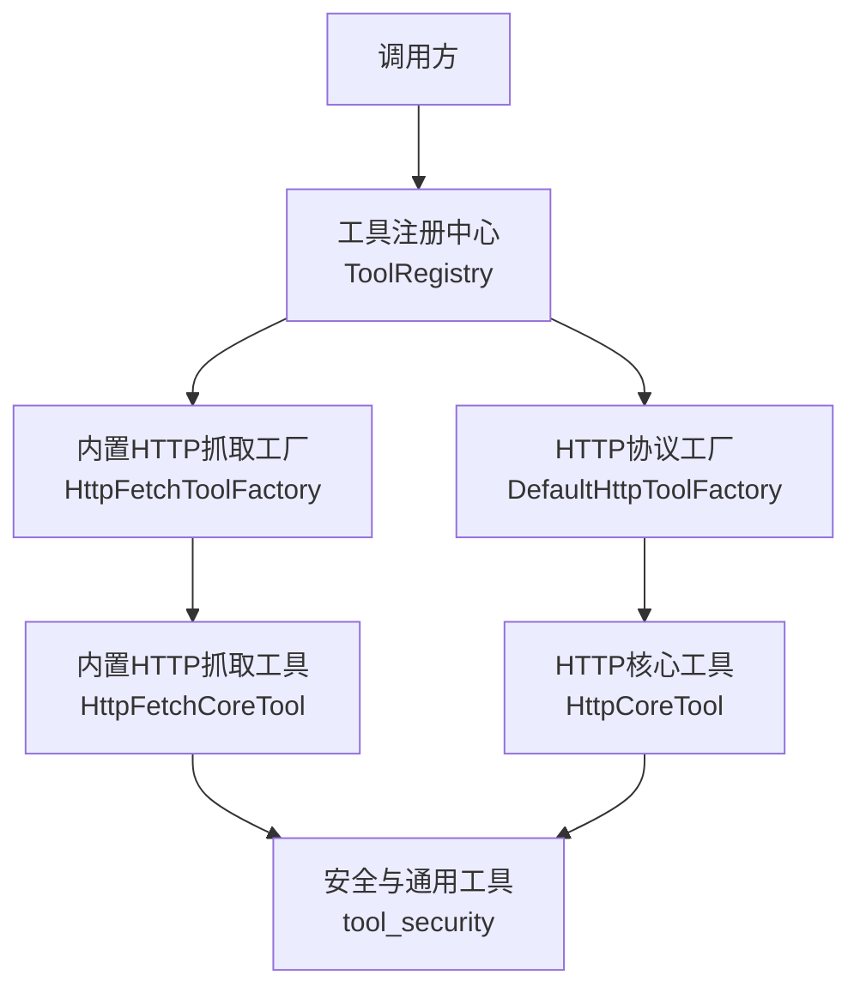
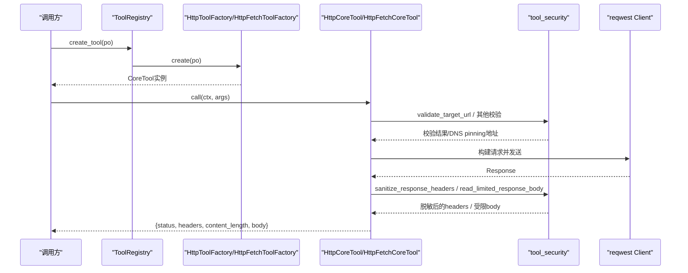
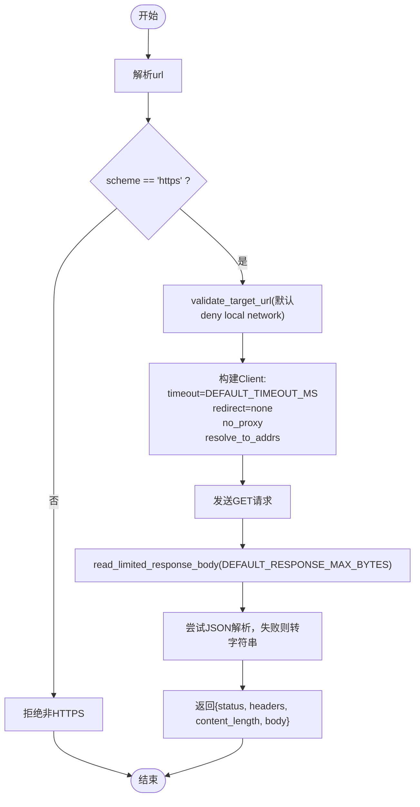
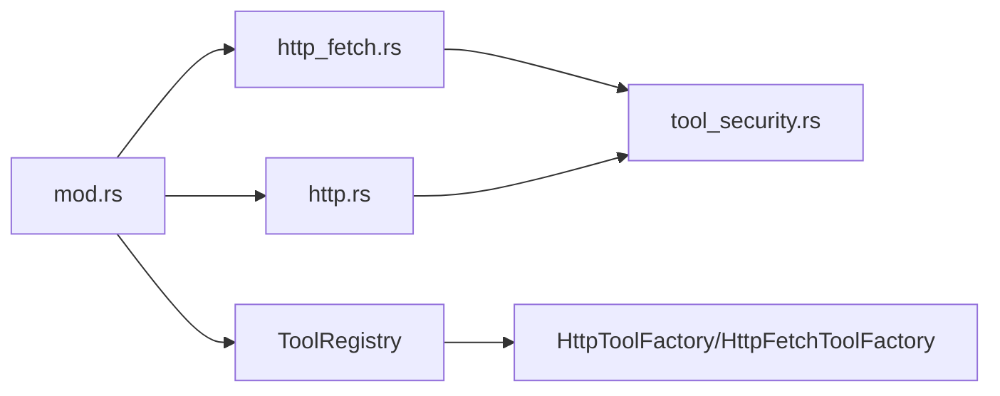

# HTTP请求工具

<cite>
**本文引用的文件**
- [src/pkg/tool_registry/http_fetch.rs](src/pkg/tool_registry/http_fetch.rs)
- [src/pkg/tool_registry/http.rs](src/pkg/tool_registry/http.rs)
- [src/pkg/tool_registry/mod.rs](src/pkg/tool_registry/mod.rs)
- [src/pkg/tool_registry/tool_security.rs](src/pkg/tool_registry/tool_security.rs)
- [common/src/constants/http_header.rs](common/src/constants/http_header.rs)
- [src/pkg/tool_registry/http_tests.rs](src/pkg/tool_registry/http_tests.rs)
</cite>

## 目录
1. [简介](#简介)
2. [项目结构](#项目结构)
3. [核心组件](#核心组件)
4. [架构总览](#架构总览)
5. [详细组件分析](#详细组件分析)
6. [依赖关系分析](#依赖关系分析)
7. [性能与安全考量](#性能与安全考量)
8. [故障排查指南](#故障排查指南)
9. [结论](#结论)
10. [附录：使用示例与最佳实践](#附录使用示例与最佳实践)

## 简介
本技术文档聚焦于HTTP请求工具的实现，重点解析 HttpFetchToolFactory 及其相关HTTP工具运行时。内容涵盖：
- HTTP客户端配置（超时、重定向、代理、DNS pinning）
- 请求构建（方法、URL模板、查询参数、请求头、JSON Body）
- 响应处理（状态码校验、响应体大小限制、JSON指针提取、响应头脱敏）
- 安全控制（SSRF防护、域名白/黑名单、本地网络访问控制、HTTPS强制、重定向限制）
- 错误处理与可观测性（统一错误类型、日志脱敏）
- 性能优化策略（默认与硬上限、流式读取限制、避免不必要重定向）

## 项目结构
HTTP请求能力由“内置HTTP抓取工具”和“数据库注册型HTTP工具”两部分组成：
- 内置HTTP抓取工具：通过 HttpFetchToolFactory 提供开箱即用的HTTPS GET抓取能力，严格的安全默认值。
- 数据库注册型HTTP工具：通过 HttpCoreTool 实现，支持在数据库中定义HTTP工具的元数据与方法、URL模板、头部、查询、Body等，并在运行时执行。



图表来源
- [src/pkg/tool_registry/mod.rs:29-101](src/pkg/tool_registry/mod.rs#L29-L101)
- [src/pkg/tool_registry/http_fetch.rs:19-58](src/pkg/tool_registry/http_fetch.rs#L19-L58)
- [src/pkg/tool_registry/http.rs:23-114](src/pkg/tool_registry/http.rs#L23-L114)
- [src/pkg/tool_registry/tool_security.rs:1-16](src/pkg/tool_registry/tool_security.rs#L1-L16)

章节来源
- [src/pkg/tool_registry/mod.rs:29-101](src/pkg/tool_registry/mod.rs#L29-L101)
- [src/pkg/tool_registry/http_fetch.rs:19-58](src/pkg/tool_registry/http_fetch.rs#L19-L58)
- [src/pkg/tool_registry/http.rs:23-114](src/pkg/tool_registry/http.rs#L23-L114)

## 核心组件
- HttpFetchToolFactory：创建内置的“fetch_url”工具，仅允许HTTPS GET，默认拒绝HTTP与本地网络目标，具备DNS pinning、禁止重定向、默认超时与响应大小限制。
- HttpCoreTool：从数据库中的 ToolPo.config 加载 HttpToolConfig，支持GET/POST，支持URL模板、查询对象、请求头对象、JSON Body、状态码白名单、JSON指针提取、域名白/黑名单、本地网络访问开关等。
- tool_security：提供SSRF防护、域名匹配、地址解析校验、响应体大小限制、响应头脱敏、URL模板边界校验、占位符校验等通用安全能力。
- ToolRegistry：全局工具注册中心，按协议分发到对应工厂创建可执行工具实例。

章节来源
- [src/pkg/tool_registry/http_fetch.rs:19-143](src/pkg/tool_registry/http_fetch.rs#L19-L143)
- [src/pkg/tool_registry/http.rs:41-114](src/pkg/tool_registry/http.rs#L41-L114)
- [src/pkg/tool_registry/tool_security.rs:17-231](src/pkg/tool_registry/tool_security.rs#L17-L231)
- [src/pkg/tool_registry/mod.rs:29-101](src/pkg/tool_registry/mod.rs#L29-L101)

## 架构总览
HTTP请求工具采用“工厂+运行时”的模式：
- 工厂负责根据协议或内置类型创建可执行工具实例。
- 运行时负责参数校验、安全校验、构建请求、发送请求、处理响应并返回结构化结果。
- 安全能力集中在公共模块，供所有HTTP相关工具复用。



图表来源
- [src/pkg/tool_registry/mod.rs:81-101](src/pkg/tool_registry/mod.rs#L81-L101)
- [src/pkg/tool_registry/http.rs:126-220](src/pkg/tool_registry/http.rs#L126-L220)
- [src/pkg/tool_registry/http_fetch.rs:60-143](src/pkg/tool_registry/http_fetch.rs#L60-L143)
- [src/pkg/tool_registry/tool_security.rs:92-231](src/pkg/tool_registry/tool_security.rs#L92-L231)

## 详细组件分析

### 内置HTTP抓取工具（HttpFetchToolFactory + HttpFetchCoreTool）
- 功能要点
  - 参数：仅接受 url 字符串。
  - 协议限制：仅允许 https；http将被拒绝。
  - 安全校验：调用 validate_target_url，默认不允许本地网络；解析域名并pin到IP，禁用代理与重定向。
  - 客户端配置：默认超时 DEFAULT_TIMEOUT_MS；禁止重定向；no_proxy；resolve_to_addrs进行DNS pinning。
  - 请求方法：固定为GET。
  - 响应处理：读取受限响应体（DEFAULT_RESPONSE_MAX_BYTES），尝试解析JSON，否则转为字符串；返回包含 status、headers、content_length、body 的结构化结果。
  - 响应头脱敏：对敏感头进行脱敏。



图表来源
- [src/pkg/tool_registry/http_fetch.rs:60-143](src/pkg/tool_registry/http_fetch.rs#L60-L143)
- [src/pkg/tool_registry/tool_security.rs:92-169](src/pkg/tool_registry/tool_security.rs#L92-L169)
- [src/pkg/tool_registry/tool_security.rs:184-231](src/pkg/tool_registry/tool_security.rs#L184-L231)

章节来源
- [src/pkg/tool_registry/http_fetch.rs:19-143](src/pkg/tool_registry/http_fetch.rs#L19-L143)
- [src/pkg/tool_registry/tool_security.rs:92-231](src/pkg/tool_registry/tool_security.rs#L92-L231)

### 数据库注册型HTTP工具（HttpCoreTool）
- 配置模型（HttpToolConfig）
  - method：当前仅支持GET/POST（不支持DELETE等）。
  - url：固定URL模板，禁止在authority部分使用占位符，禁止userinfo。
  - headers/query/body：对象模板，键名必须合法且不含占位符；值可为标量或数组/对象（body支持嵌套）。
  - timeout_ms/response_max_bytes：每工具覆盖默认值，但受硬上限约束。
  - allowed_status_codes：响应状态码白名单，未命中将报错。
  - response_json_pointer：可选JSON指针，用于从响应体中提取子集。
  - allowed_domains/blocked_domains：域名白/黑名单。
  - allow_local_network：显式授权访问本地网络目标。

- 执行流程
  - 参数校验：基于parameters_schema验证必填字段、类型、枚举、additionalProperties。
  - URL渲染与校验：替换{{args.xxx}}占位符，校验scheme/authority固定，禁止userinfo。
  - 安全校验：validate_target_url，检查blocked/allowed域名、本地网络访问控制、解析后IP校验。
  - 客户端构建：设置超时、禁止重定向、禁用代理、DNS pinning。
  - 请求构建：附加query、headers、POST时附加JSON body。
  - 响应处理：校验状态码是否在白名单；读取受限响应体；尝试JSON解析；可选JSON指针提取；返回结构化结果。

```mermaid
sequenceDiagram
participant Caller as "调用方"
participant Tool as "HttpCoreTool"
participant Sec as "tool_security"
participant Net as "reqwest Client"
Caller->>Tool : call(ctx, args)
Tool->>Tool : validate_args_schema(parameters_schema, args)
Tool->>Tool : render_string_template(url), parse Url
Tool->>Sec : validate_target_url(allow_local_network, allowed_domains, blocked_domains, url)
Sec-->>Tool : pinned_addresses
Tool->>Net : build client (timeout, no redirect, no proxy, resolve_to_addrs)
Tool->>Net : request(method, url).query(headers/body if POST)
Net-->>Tool : Response
Tool->>Sec : sanitize_response_headers(response.headers())
Tool->>Sec : read_limited_response_body(max_bytes)
Sec-->>Tool : bytes
Tool->>Tool : parse JSON or string; optional JSON pointer
Tool-->>Caller : {status, headers, content_length, body}
```

图表来源
- [src/pkg/tool_registry/http.rs:126-220](src/pkg/tool_registry/http.rs#L126-L220)
- [src/pkg/tool_registry/http.rs:222-392](src/pkg/tool_registry/http.rs#L222-L392)
- [src/pkg/tool_registry/tool_security.rs:92-231](src/pkg/tool_registry/tool_security.rs#L92-L231)

章节来源
- [src/pkg/tool_registry/http.rs:41-220](src/pkg/tool_registry/http.rs#L41-L220)
- [src/pkg/tool_registry/http.rs:222-599](src/pkg/tool_registry/http.rs#L222-L599)
- [src/pkg/tool_registry/tool_security.rs:92-231](src/pkg/tool_registry/tool_security.rs#L92-L231)

### 安全与通用工具（tool_security）
- SSRF防护
  - 禁止非http(s) scheme。
  - 校验host存在且非空。
  - 支持blocked_domains/allowed_domains匹配（归一化域名）。
  - 默认拒绝本地网络（localhost、私有段、链路本地、广播、未指定、共享地址空间、IPv6过渡地址等）。
  - 解析域名得到SocketAddr列表，若任一地址命中本地网络则拒绝（除非allow_local_network=true）。
- DNS pinning
  - 使用resolve_to_addrs将主机名绑定到已校验的地址，防止DNS重绑定攻击。
- 重定向限制
  - 默认不跟随重定向（Policy::none），避免初始URL合法但重定向到内网风险地址。
- 大小限制
  - 默认最大响应体1MB，硬上限10MB；超过直接报错，不完整读取。
- 超时配置
  - 默认超时30s，硬上限10分钟；每工具可覆盖但必须在合法范围内。
- 响应头脱敏
  - 对Authorization、Cookie、Set-Cookie、含api-key/token/secret/password等关键字的头进行脱敏。
- URL模板边界校验
  - scheme与authority必须固定，禁止userinfo，禁止在authority中使用占位符。
- 占位符校验
  - 仅支持{{args.key}}形式，且key不能为空、不能包含空白字符。

章节来源
- [src/pkg/tool_registry/tool_security.rs:17-231](src/pkg/tool_registry/tool_security.rs#L17-L231)
- [src/pkg/tool_registry/tool_security.rs:233-312](src/pkg/tool_registry/tool_security.rs#L233-L312)

### 工具注册中心（ToolRegistry）
- 全局单例，维护内置工具工厂映射与HTTP协议工厂。
- 根据ToolPo.protocol分发：
  - Builtin：查找对应BuiltinToolFactory并创建实例。
  - Http：委托给HttpToolFactory（默认DefaultHttpToolFactory）创建HttpCoreTool。
  - Mcp：预留扩展点。
- 提供注册、注销、列举内置工具ID等能力。

章节来源
- [src/pkg/tool_registry/mod.rs:29-132](src/pkg/tool_registry/mod.rs#L29-L132)

## 依赖关系分析
- http_fetch.rs 依赖 tool_security 进行安全校验与响应处理。
- http.rs 依赖 tool_security 进行URL模板校验、SSRF防护、响应体限制等。
- mod.rs 聚合各协议工厂，提供统一的工具创建入口。
- common/http_header.rs 提供标准请求头常量，便于上层注入追踪与上下文信息（如X-Log-Id、X-User-Id等）。



图表来源
- [src/pkg/tool_registry/http_fetch.rs:1-18](src/pkg/tool_registry/http_fetch.rs#L1-L18)
- [src/pkg/tool_registry/http.rs:1-22](src/pkg/tool_registry/http.rs#L1-L22)
- [src/pkg/tool_registry/mod.rs:1-28](src/pkg/tool_registry/mod.rs#L1-L28)

章节来源
- [src/pkg/tool_registry/http_fetch.rs:1-18](src/pkg/tool_registry/http_fetch.rs#L1-L18)
- [src/pkg/tool_registry/http.rs:1-22](src/pkg/tool_registry/http.rs#L1-L22)
- [src/pkg/tool_registry/mod.rs:1-28](src/pkg/tool_registry/mod.rs#L1-L28)

## 性能与安全考量
- 性能
  - 默认超时与硬上限避免长时间阻塞。
  - 响应体流式读取并限制大小，防止内存溢出。
  - 禁止重定向减少额外往返。
  - DNS pinning降低DNS劫持风险并提升连接稳定性。
- 安全
  - 默认仅允许HTTPS（内置工具），数据库注册工具允许http(s)但需显式配置。
  - 默认拒绝本地网络访问，需显式授权。
  - 域名白/黑名单在配置阶段与运行阶段双重校验。
  - 响应头脱敏避免泄露敏感信息。
  - URL模板边界与占位符严格校验，防止注入与越权。

[本节为通用指导，无需具体文件引用]

## 故障排查指南
- 常见错误与定位
  - “unsupported http method”：当前仅支持GET/POST，检查method配置。
  - “invalid URL / invalid rendered http url”：URL格式错误或占位符未解析。
  - “blocked http domain / http domain is not allowed”：域名不在白名单或被黑名单拦截。
  - “local network http target requires allow_local_network=true”：目标为本地网络但未授权。
  - “resolved local network http target requires allow_local_network=true”：域名解析到的IP为本地网络。
  - “unresolved or unsupported http template placeholder”：占位符格式不正确或缺失。
  - “unexpected http status code”：响应状态码不在白名单。
  - “http response too large”：响应体超过限制。
  - “invalid http header name/value”：请求头名称或值非法。
- 调试建议
  - 启用日志并关注脱敏后的URL与错误信息。
  - 逐步缩小allowed_domains范围，确认域名匹配逻辑。
  - 检查parameters_schema与传入args是否一致（类型、必填项）。
  - 对于重定向场景，确认服务端是否返回3xx，工具默认不跟随。

章节来源
- [src/pkg/tool_registry/http.rs:222-599](src/pkg/tool_registry/http.rs#L222-L599)
- [src/pkg/tool_registry/http_fetch.rs:60-143](src/pkg/tool_registry/http_fetch.rs#L60-L143)
- [src/pkg/tool_registry/tool_security.rs:92-231](src/pkg/tool_registry/tool_security.rs#L92-L231)

## 结论
HTTP请求工具通过内置与数据库注册两种模式，提供了安全、可控、可扩展的HTTP能力。内置工具以最小权限原则提供HTTPS GET抓取；数据库注册工具支持更丰富的配置与模板化能力，同时保持严格的安全默认值。通过集中化的安全模块，实现了SSRF防护、域名控制、大小限制、超时控制、重定向限制与响应脱敏等关键能力，满足多Agent协作框架对外部HTTP调用的安全与可靠性要求。

[本节为总结，无需具体文件引用]

## 附录：使用示例与最佳实践
- 内置HTTP抓取（fetch_url）
  - 输入：{"url": "https://example.com"}
  - 行为：仅HTTPS，禁止本地网络，禁止重定向，默认超时与响应大小限制。
  - 输出：{status, headers, content_length, body}
  - 参考测试用例路径：[src/pkg/tool_registry/http_fetch.rs:155-243](src/pkg/tool_registry/http_fetch.rs#L155-L243)

- 数据库注册HTTP工具（GET）
  - 配置示例（ToolPo.config）：
    - method: "GET"
    - url: "https://api.example.com/search?q={{args.query}}"
    - query: {"q": "{{args.query}}", "per_page": "{{args.limit}}"}
    - headers: {"Accept": "application/json"}
    - timeout_ms: 10000
    - response_max_bytes: 65536
    - allowed_status_codes: [200]
    - allowed_domains: ["api.example.com"]
    - blocked_domains: ["localhost", "127.0.0.1"]
    - allow_local_network: false
  - 行为：参数校验、URL模板渲染、安全校验、发送请求、响应处理。
  - 参考测试用例路径：[src/pkg/tool_registry/http_tests.rs:53-98](src/pkg/tool_registry/http_tests.rs#L53-L98)

- 数据库注册HTTP工具（POST）
  - 配置示例（ToolPo.config）：
    - method: "POST"
    - url: "https://api.example.com/items"
    - body: {"name": "{{args.name}}", "count": "{{args.count}}"}
    - headers: {"Content-Type": "application/json"}
    - timeout_ms: 10000
    - response_max_bytes: 65536
    - allowed_status_codes: [201, 200]
    - allowed_domains: ["api.example.com"]
  - 行为：POST时自动序列化body为JSON，其余流程同GET。
  - 参考实现路径：[src/pkg/tool_registry/http.rs:174-178](src/pkg/tool_registry/http.rs#L174-L178)

- 安全最佳实践
  - 始终设置allowed_domains，避免任意公网访问。
  - 明确设置response_max_bytes与timeout_ms，遵循硬上限。
  - 谨慎使用allow_local_network，仅在必要时开启。
  - 使用response_json_pointer精确提取所需字段，减少数据处理开销。
  - 利用common/http_header.rs中的标准头注入追踪与上下文信息。

章节来源
- [src/pkg/tool_registry/http_fetch.rs:155-243](src/pkg/tool_registry/http_fetch.rs#L155-L243)
- [src/pkg/tool_registry/http_tests.rs:53-98](src/pkg/tool_registry/http_tests.rs#L53-L98)
- [src/pkg/tool_registry/http.rs:174-178](src/pkg/tool_registry/http.rs#L174-L178)
- [common/src/constants/http_header.rs:1-20](common/src/constants/http_header.rs#L1-L20)