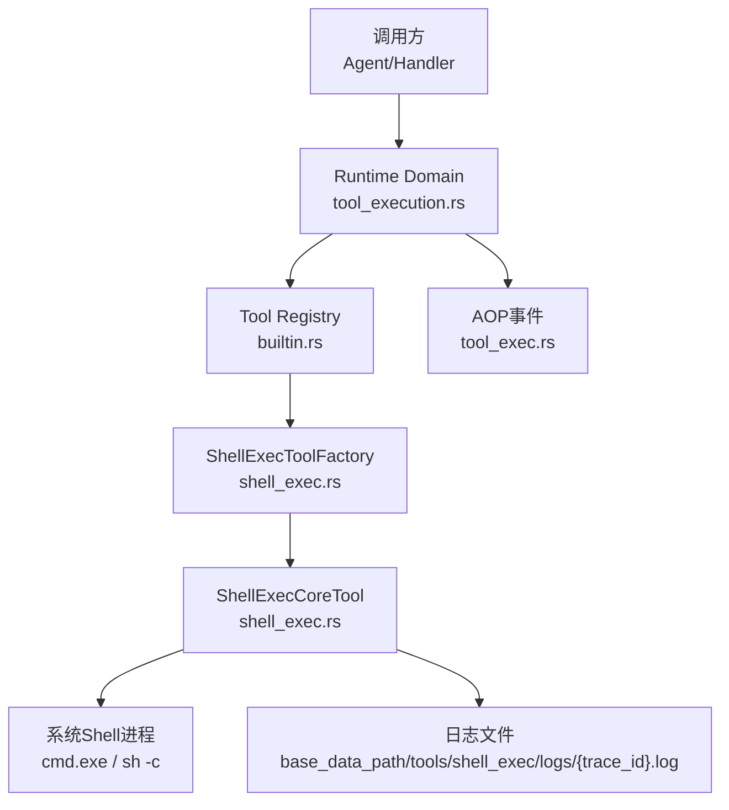
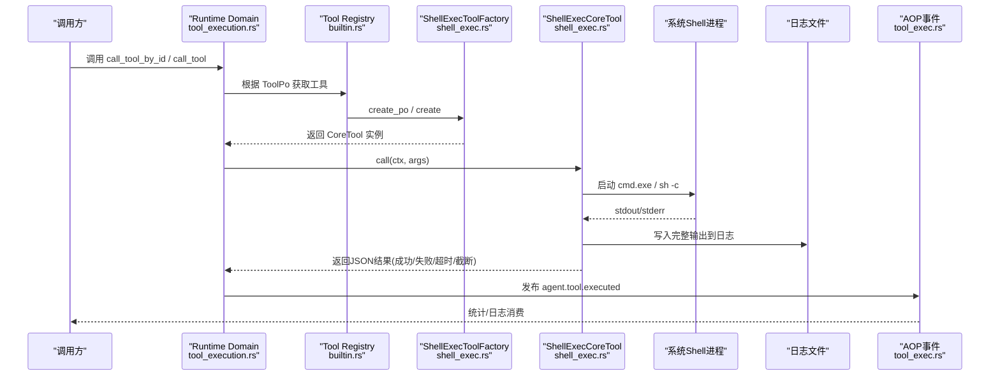
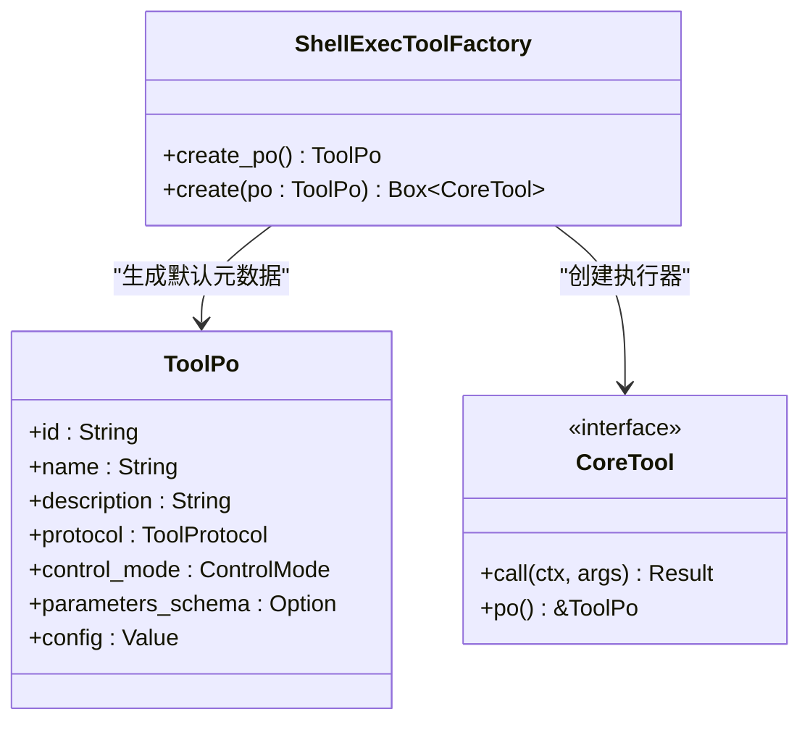
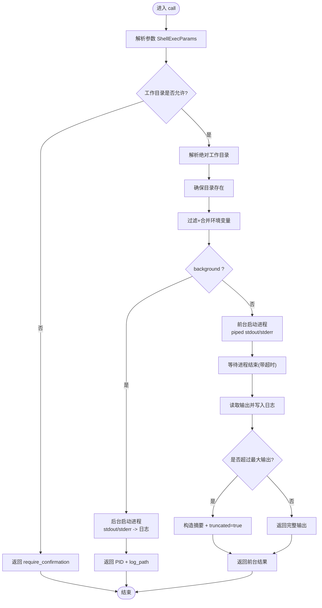
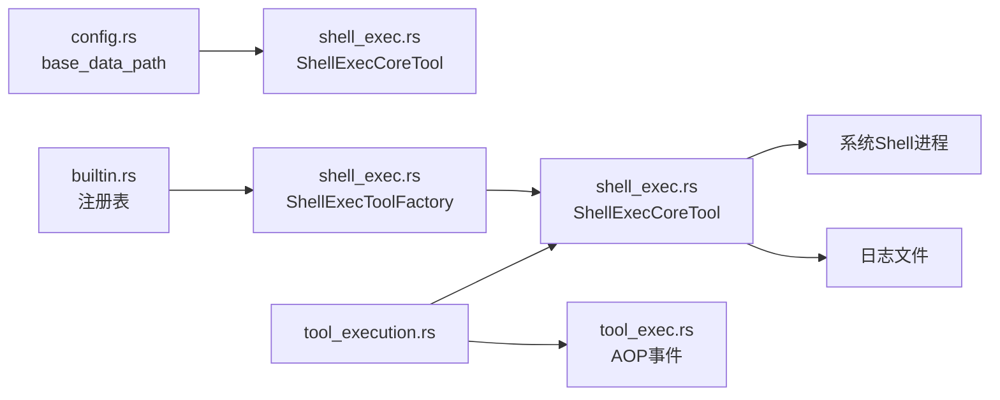

# Shell执行工具

<cite>
**本文引用的文件**
- [shell_exec.rs](src/pkg/tool_registry/shell_exec.rs)
- [shell_tests.rs](src/pkg/tool_registry/shell_tests.rs)
- [builtin.rs](src/pkg/tool_registry/builtin.rs)
- [tool_security.rs](src/pkg/tool_registry/tool_security.rs)
- [config.rs](src/config.rs)
- [tool_execution.rs](src/service/domain/runtime/tool_execution.rs)
- [tool_exec.rs](src/models/events/tool_exec.rs)
</cite>

## 目录
1. [简介](#简介)
2. [项目结构](#项目结构)
3. [核心组件](#核心组件)
4. [架构总览](#架构总览)
5. [详细组件分析](#详细组件分析)
6. [依赖关系分析](#依赖关系分析)
7. [性能与资源限制](#性能与资源限制)
8. [故障排查指南](#故障排查指南)
9. [结论](#结论)
10. [附录：安全使用示例与最佳实践](#附录：安全使用示例与最佳实践)

## 简介
本技术文档聚焦于“Shell执行工具”的实现与安全机制，围绕 ShellExecToolFactory 的工厂模式、命令执行、进程管理、输出捕获、超时控制、工作目录沙箱、环境变量白名单过滤、日志记录与监控告警等能力进行系统化说明。文档同时给出受限环境下的安全使用建议与常见问题的排查方法。

## 项目结构
Shell执行工具位于 pkg/tool_registry 子模块中，作为内置工具之一被全局注册并对外暴露。其关键文件与职责如下：
- shell_exec.rs：定义 ShellExecConfig、ShellExecParams、ShellExecCoreTool、ShellExecToolFactory，实现命令执行、参数校验、工作目录限制、环境变量过滤、超时控制、输出截断与日志落盘。
- builtin.rs：集中注册内置工具（含 shell_exec），提供统一创建与生命周期管理。
- tool_security.rs：通用安全工具（HTTP/FS等共享），包含硬限常量、域名/IP白黑名单、敏感头脱敏、路径解析与校验等。
- config.rs：应用配置加载，提供 base_data_path 等运行时基础路径。
- tool_execution.rs：运行时域层调用入口，负责工具查找、授权、执行编排与结果封装。
- tool_exec.rs：工具执行事件模型，用于AOP统计与追踪。

图表来源
- [builtin.rs:27-43](src/pkg/tool_registry/builtin.rs#L27-L43)
- [shell_exec.rs:89-148](src/pkg/tool_registry/shell_exec.rs#L89-L148)
- [tool_execution.rs:13-38](src/service/domain/runtime/tool_execution.rs#L13-L38)
- [tool_exec.rs:27-64](src/models/events/tool_exec.rs#L27-L64)

章节来源
- [builtin.rs:27-43](src/pkg/tool_registry/builtin.rs#L27-L43)
- [shell_exec.rs:89-148](src/pkg/tool_registry/shell_exec.rs#L89-L148)
- [tool_execution.rs:13-38](src/service/domain/runtime/tool_execution.rs#L13-L38)
- [tool_exec.rs:27-64](src/models/events/tool_exec.rs#L27-L64)

## 核心组件
- ShellExecToolFactory：内置工具工厂，负责生成 ToolPo（元数据、参数Schema、默认配置）与 CoreTool 实例。
- ShellExecCoreTool：具体执行器，完成参数解析、工作目录校验与解析、环境变量过滤合并、命令执行（同步/后台）、超时控制、输出捕获与截断、日志落盘、结果返回。
- ShellExecConfig：工具级配置项，包括默认超时、最大输出大小、额外允许路径、环境变量白名单。
- ShellExecParams：调用参数，包括 command、working_dir、timeout_ms、max_output_size_bytes、background、env。

章节来源
- [shell_exec.rs:20-87](src/pkg/tool_registry/shell_exec.rs#L20-L87)
- [shell_exec.rs:89-166](src/pkg/tool_registry/shell_exec.rs#L89-L166)

## 架构总览
Shell执行工具遵循四层单向调用原则：Adapter → Domain → DAL → DAO。ShellExecCoreTool属于 pkg/tool_registry（通用工具层），由 Runtime Domain 在工具执行流程中调用；AOP事件通过 models/events 发布，供消费者收集统计与日志。

图表来源
- [tool_execution.rs:13-38](src/service/domain/runtime/tool_execution.rs#L13-L38)
- [builtin.rs:27-43](src/pkg/tool_registry/builtin.rs#L27-L43)
- [shell_exec.rs:257-466](src/pkg/tool_registry/shell_exec.rs#L257-L466)
- [tool_exec.rs:27-64](src/models/events/tool_exec.rs#L27-L64)

## 详细组件分析

### ShellExecToolFactory 与工具注册
- 职责：为 shell_exec 工具生成 ToolPo（名称、描述、协议、控制模式、参数Schema、默认配置），并提供 create 将 ToolPo 转换为可执行的 CoreTool。
- 注册：在 GENERIC_BUILTIN_TOOLS 中声明，并在 register_all 时注入全局 ToolRegistry。

图表来源
- [shell_exec.rs:89-148](src/pkg/tool_registry/shell_exec.rs#L89-L148)
- [builtin.rs:27-43](src/pkg/tool_registry/builtin.rs#L27-L43)

章节来源
- [shell_exec.rs:89-148](src/pkg/tool_registry/shell_exec.rs#L89-L148)
- [builtin.rs:27-43](src/pkg/tool_registry/builtin.rs#L27-L43)

### ShellExecCoreTool 执行流程
- 参数解析：从 JSON 反序列化为 ShellExecParams，校验必填字段。
- 工作目录校验：仅允许 base_data_path 或 additional_allowed_paths 内的绝对路径；相对路径视为在 base_data_path 下。
- 工作目录解析：若不存在则自动创建。
- 环境变量过滤：继承父进程环境变量时，仅保留 allowed_env 白名单中的键，并进一步屏蔽敏感键（如 password、token、secret、aws_* 等）。
- 命令执行：
  - 前台模式：使用 piped stdout/stderr 捕获输出，按 timeout_ms 等待进程结束；超过 max_output_size_bytes 时截断响应，但完整输出仍写入日志。
  - 后台模式：stdout/stderr 直接重定向到日志文件，立即返回 PID 与日志路径。
- 超时控制：使用 tokio::time::timeout 包裹 wait()，超时后 kill 子进程并返回超时信息。
- 输出处理：将完整输出写入日志文件；响应中返回摘要或截断提示，以及 truncated、full_output_bytes、log_path 等元信息。
- 平台适配：Windows 使用 cmd.exe /C，Unix 使用 /bin/sh -c。

图表来源
- [shell_exec.rs:168-207](src/pkg/tool_registry/shell_exec.rs#L168-L207)
- [shell_exec.rs:210-254](src/pkg/tool_registry/shell_exec.rs#L210-L254)
- [shell_exec.rs:257-466](src/pkg/tool_registry/shell_exec.rs#L257-L466)

章节来源
- [shell_exec.rs:168-207](src/pkg/tool_registry/shell_exec.rs#L168-L207)
- [shell_exec.rs:210-254](src/pkg/tool_registry/shell_exec.rs#L210-L254)
- [shell_exec.rs:257-466](src/pkg/tool_registry/shell_exec.rs#L257-L466)

### 安全控制措施
- 工作目录沙箱：
  - 仅允许 base_data_path 或 additional_allowed_paths 内的绝对路径；相对路径默认在 base_data_path 内。
  - 未授权路径返回 require_confirmation，要求人工确认后再执行。
- 环境变量白名单：
  - 仅允许 allowed_env 列表中的变量名从父进程继承；默认包含 PATH。
  - 即使允许，也会屏蔽敏感键（如 password、token、secret、aws_*、ssh_auth_sock、git_config 等）。
- 输出限制：
  - 默认最大输出 10MB，可通过配置覆盖；超过限制时在响应中截断，但完整输出仍写入日志。
- 超时控制：
  - 默认 300秒，可通过配置或参数覆盖；超时后终止进程并返回超时信息。
- 平台隔离：
  - 通过系统Shell执行，避免直接执行任意二进制，降低攻击面。
- 日志落盘：
  - 所有输出统一写入 base_data_path/tools/shell_exec/logs/{trace_id}.log，便于审计与回溯。

章节来源
- [shell_exec.rs:168-207](src/pkg/tool_registry/shell_exec.rs#L168-L207)
- [shell_exec.rs:210-254](src/pkg/tool_registry/shell_exec.rs#L210-L254)
- [shell_exec.rs:257-466](src/pkg/tool_registry/shell_exec.rs#L257-L466)
- [config.rs:38-73](src/config.rs#L38-L73)

### 错误处理、日志与监控
- 错误处理：
  - 参数解析失败、工作目录非法、进程启动失败、等待失败、超时等均返回结构化JSON，包含 success、error、timeout、pid、log_path 等字段。
- 日志记录：
  - 前台模式：先捕获输出再写入日志；后台模式：直接重定向至日志文件。
  - 日志路径基于 trace_id，便于关联请求链路。
- 监控告警：
  - 工具执行完成后，Runtime Domain 发布 agent.tool.executed 事件，包含 entry、组织/用户上下文、输入/输出长度等，供AOP消费者记录统计与指标。

章节来源
- [shell_exec.rs:257-466](src/pkg/tool_registry/shell_exec.rs#L257-L466)
- [tool_exec.rs:27-64](src/models/events/tool_exec.rs#L27-L64)
- [tool_execution.rs:13-38](src/service/domain/runtime/tool_execution.rs#L13-L38)

## 依赖关系分析
- ShellExecToolFactory 依赖 ToolPo 与 CoreTool 接口，由 builtin.rs 统一注册。
- ShellExecCoreTool 依赖：
  - 配置：base_data_path（来自 config.rs）。
  - 系统进程：tokio::process::Command。
  - 文件系统：tokio::fs 写入日志。
  - 异步超时：tokio::time::timeout。
- 运行时集成：
  - Runtime Domain 负责工具查找与执行编排。
  - AOP 事件模型用于统计与日志消费。

图表来源
- [config.rs:38-73](src/config.rs#L38-L73)
- [builtin.rs:27-43](src/pkg/tool_registry/builtin.rs#L27-L43)
- [shell_exec.rs:257-466](src/pkg/tool_registry/shell_exec.rs#L257-L466)
- [tool_execution.rs:13-38](src/service/domain/runtime/tool_execution.rs#L13-L38)
- [tool_exec.rs:27-64](src/models/events/tool_exec.rs#L27-L64)

章节来源
- [config.rs:38-73](src/config.rs#L38-L73)
- [builtin.rs:27-43](src/pkg/tool_registry/builtin.rs#L27-L43)
- [shell_exec.rs:257-466](src/pkg/tool_registry/shell_exec.rs#L257-L466)
- [tool_execution.rs:13-38](src/service/domain/runtime/tool_execution.rs#L13-L38)
- [tool_exec.rs:27-64](src/models/events/tool_exec.rs#L27-L64)

## 性能与资源限制
- 超时控制：默认 300秒，可按需调整；超时后强制终止进程，避免僵尸进程。
- 输出限制：默认 10MB，超过限制时响应截断，但完整输出仍落盘，避免内存膨胀。
- 后台模式：适合长耗时任务，不阻塞调用方，PID与日志路径返回以便后续跟踪。
- I/O优化：前台模式使用管道捕获输出，后台模式直接重定向到文件，减少中间缓冲。
- 并发安全：每个调用独立日志文件（基于 trace_id），避免竞争写冲突。

[本节为通用性能讨论，不直接分析具体文件]

## 故障排查指南
- 工作目录拒绝：
  - 现象：返回 require_confirmation 且 error 提示不在允许路径。
  - 排查：检查 working_dir 是否为 base_data_path 或 additional_allowed_paths 的子路径；必要时调整配置。
- 环境变量缺失：
  - 现象：命令找不到外部工具或配置。
  - 排查：确认 allowed_env 包含必要变量（如 PATH、RUSTFLAGS、CC 等）。
- 输出过大：
  - 现象：响应 truncated=true 且提示完整输出在日志中。
  - 排查：查看对应 trace_id 的日志文件，定位问题。
- 超时：
  - 现象：返回 timeout=true 与 timeout_ms。
  - 排查：适当增大 timeout_ms 或优化命令逻辑；检查后台进程是否仍在运行。
- 权限与路径：
  - 现象：无法写入日志或工作目录。
  - 排查：确保 base_data_path 及 tools/shell_exec/logs 目录存在且有写权限。

章节来源
- [shell_exec.rs:168-207](src/pkg/tool_registry/shell_exec.rs#L168-L207)
- [shell_exec.rs:257-466](src/pkg/tool_registry/shell_exec.rs#L257-L466)

## 结论
ShellExecToolFactory 提供了安全可控的Shell命令执行能力，通过工作目录沙箱、环境变量白名单、输出限制、超时控制与日志落盘等机制，满足受限环境下的系统命令执行需求。结合 Runtime Domain 的工具执行流程与AOP事件，实现了完整的可观测性与可追溯性。建议在生产环境中严格配置 allowed_env、additional_allowed_paths 与超时/输出限制，并定期审计日志与指标。

[本节为总结，不直接分析具体文件]

## 附录：安全使用示例与最佳实践
- 最小化环境变量：
  - 仅开放必要变量（如 PATH、RUSTFLAGS、CC），避免泄露敏感信息。
- 限制工作目录：
  - 将 additional_allowed_paths 设置为最小必要范围，避免访问系统敏感目录。
- 设置合理超时与输出上限：
  - 根据业务场景调整 default_timeout_ms 与 default_max_output_size_bytes，防止资源耗尽。
- 使用后台模式执行长任务：
  - background=true 时，关注返回的 PID 与 log_path，必要时通过系统命令或脚本监控进程状态。
- 审计与告警：
  - 基于 agent.tool.executed 事件构建统计面板与告警规则，监控异常超时、失败率与输出大小。
- 参考测试用例：
  - 通过 shell_tests.rs 验证配置解析、环境变量过滤、参数解析等行为是否符合预期。

章节来源
- [shell_tests.rs:4-20](src/pkg/tool_registry/shell_tests.rs#L4-L20)
- [shell_tests.rs:43-78](src/pkg/tool_registry/shell_tests.rs#L43-L78)
- [shell_tests.rs:80-145](src/pkg/tool_registry/shell_tests.rs#L80-L145)