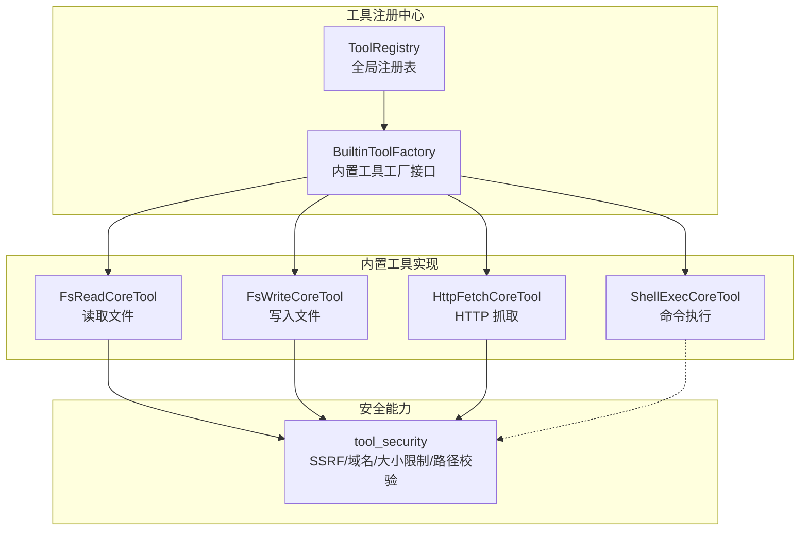
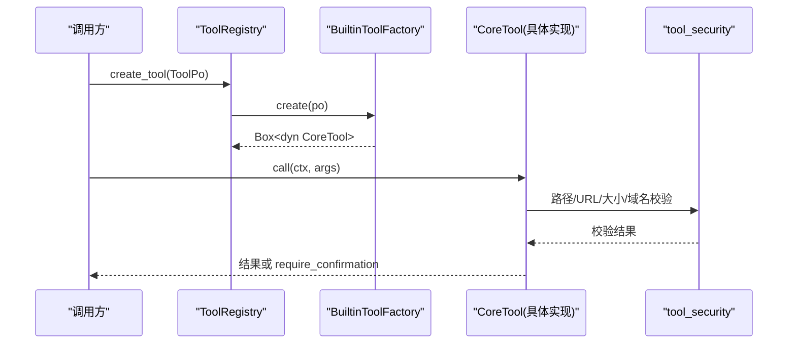
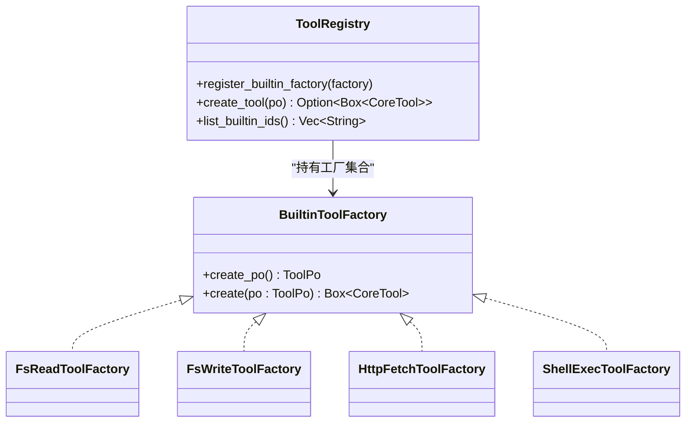
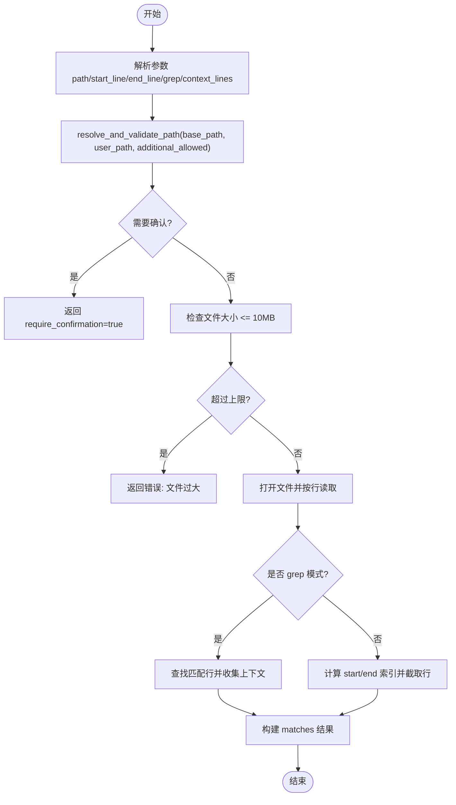
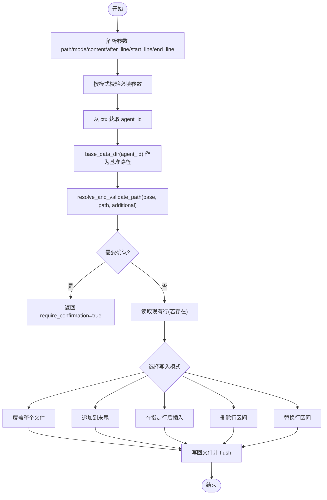
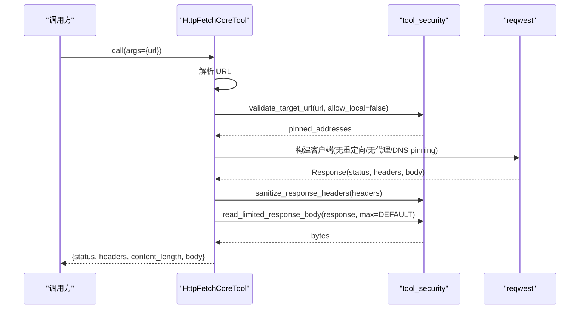
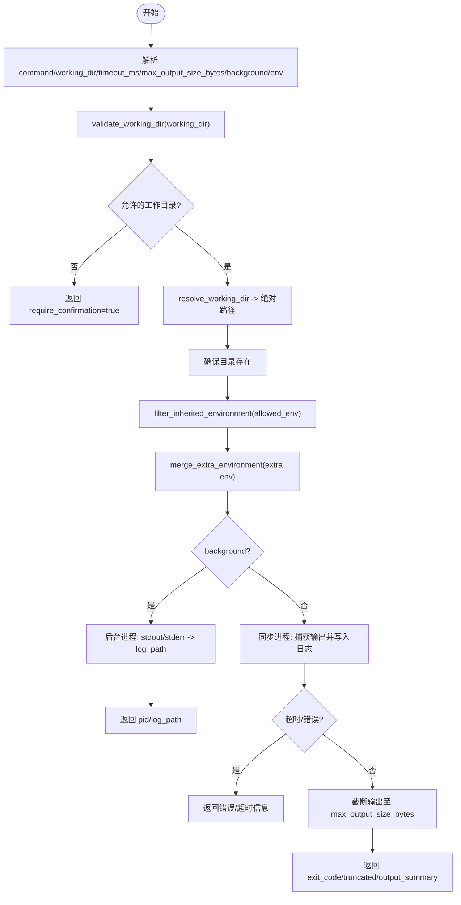
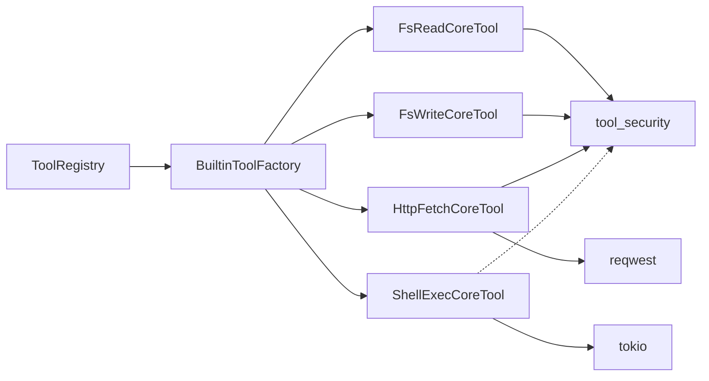

# 内置工具系统（框架层）

<cite>
**本文引用的文件**
- [src/pkg/tool_registry/mod.rs](src/pkg/tool_registry/mod.rs)
- [src/pkg/tool_registry/builtin.rs](src/pkg/tool_registry/builtin.rs)
- [src/pkg/tool_registry/fs_read.rs](src/pkg/tool_registry/fs_read.rs)
- [src/pkg/tool_registry/fs_write.rs](src/pkg/tool_registry/fs_write.rs)
- [src/pkg/tool_registry/http_fetch.rs](src/pkg/tool_registry/http_fetch.rs)
- [src/pkg/tool_registry/shell_exec.rs](src/pkg/tool_registry/shell_exec.rs)
- [src/pkg/tool_registry/tool_security.rs](src/pkg/tool_registry/tool_security.rs)
- [src/models/tool.rs](src/models/tool.rs)
- [docs/generic_builtin_tools_design.md](docs/generic_builtin_tools_design.md)
</cite>

## 目录
1. [简介](#简介)
2. [项目结构](#项目结构)
3. [核心组件](#核心组件)
4. [架构总览](#架构总览)
5. [详细组件分析](#详细组件分析)
6. [依赖关系分析](#依赖关系分析)
7. [性能与缓存策略](#性能与缓存策略)
8. [故障排查指南](#故障排查指南)
9. [结论](#结论)
10. [附录：自定义内置工具开发示例](#附录自定义内置工具开发示例)

## 简介
本技术文档围绕内置工具系统展开，重点说明 BuiltinToolFactory 接口设计、文件系统读写工具的完整实现、内置工具的注册机制、参数验证、错误处理与日志记录；并深入讲解文件操作的安全控制（路径校验、权限检查、敏感信息脱敏）、HTTP 获取工具的安全防护（SSRF 防护、域名白/黑名单、响应大小限制）以及 Shell 执行工具的环境隔离与超时控制。最后提供自定义内置工具开发的完整示例与最佳实践，并给出性能优化与缓存策略建议。

> 📌 视角说明（AGENTS §2.1.3 Level 3 互补视角平行卡）：
> 本长文是「内置工具系统」主题的 **框架层** 视角。同主题还有以下平行视角卡，请按需交叉阅读：
> - [内置工具系统（代码落地层）](docs/wiki/zh/content/核心模块/工具注册表/内置工具系统.md)

## 项目结构
内置工具系统位于 pkg/tool_registry 模块中，采用“协议类型 + 工厂模式”的组织方式：
- 全局注册表 ToolRegistry：集中管理各协议的工厂与实例创建
- 内置工具工厂：BuiltinToolFactory 统一抽象，具体工具以工厂形式注册
- 安全能力：tool_security 提供网络与文件系统通用安全函数
- 具体工具实现：fs_read、fs_write、http_fetch、shell_exec 等

图表来源
- [src/pkg/tool_registry/mod.rs:29-132](src/pkg/tool_registry/mod.rs#L29-L132)
- [src/pkg/tool_registry/builtin.rs:13-44](src/pkg/tool_registry/builtin.rs#L13-L44)
- [src/pkg/tool_registry/tool_security.rs:17-169](src/pkg/tool_registry/tool_security.rs#L17-L169)

章节来源
- [src/pkg/tool_registry/mod.rs:1-132](src/pkg/tool_registry/mod.rs#L1-L132)
- [src/pkg/tool_registry/builtin.rs:1-44](src/pkg/tool_registry/builtin.rs#L1-L44)

## 核心组件
- CoreTool 接口：定义统一的工具调用入口 call(ctx, args) 与元数据 po()
- ToolPo：工具持久化对象，包含 id、name、description、protocol、control_mode、parameters_schema、config 等
- ToolRegistry：全局注册表，按协议分发创建工具实例
- BuiltinToolFactory：内置工具工厂接口，负责生成默认 ToolPo 与根据 ToolPo 构造可执行工具
- 安全模块 tool_security：提供 SSRF 防护、域名匹配、响应大小限制、路径解析与校验、错误脱敏等

章节来源
- [src/models/tool.rs:16-34](src/models/tool.rs#L16-L34)
- [src/models/tool.rs:57-88](src/models/tool.rs#L57-L88)
- [src/pkg/tool_registry/mod.rs:39-132](src/pkg/tool_registry/mod.rs#L39-L132)
- [src/pkg/tool_registry/builtin.rs:13-44](src/pkg/tool_registry/builtin.rs#L13-L44)
- [src/pkg/tool_registry/tool_security.rs:1-169](src/pkg/tool_registry/tool_security.rs#L1-L169)

## 架构总览
内置工具系统遵循“注册-创建-执行”的单向流程：
- 启动时通过 register_all 将内置工具工厂注册到全局注册表
- 运行时根据数据库中的 ToolPo 通过 create_tool 分派到对应协议工厂
- 工具执行前进行参数校验与安全校验，执行后返回结构化结果或需要用户确认的提示

图表来源
- [src/pkg/tool_registry/mod.rs:81-102](src/pkg/tool_registry/mod.rs#L81-L102)
- [src/pkg/tool_registry/builtin.rs:37-44](src/pkg/tool_registry/builtin.rs#L37-L44)
- [src/pkg/tool_registry/fs_read.rs:125-216](src/pkg/tool_registry/fs_read.rs#L125-L216)
- [src/pkg/tool_registry/http_fetch.rs:60-143](src/pkg/tool_registry/http_fetch.rs#L60-L143)

## 详细组件分析

### BuiltinToolFactory 接口与注册机制
- 接口职责：
  - create_po：生成内置工具的默认 ToolPo（含 id、name、description、parameters_schema、control_mode 等）
  - create：根据 ToolPo 构造可执行的 CoreTool 实例
- 注册机制：
  - GENERIC_BUILTIN_TOOLS 静态列表维护所有内置工具工厂
  - register_all 遍历注册到全局 ToolRegistry
  - ToolRegistry::create_tool 根据 protocol 分派到内置/MCP/HTTP 工厂

图表来源
- [src/pkg/tool_registry/builtin.rs:13-44](src/pkg/tool_registry/builtin.rs#L13-L44)
- [src/pkg/tool_registry/mod.rs:39-132](src/pkg/tool_registry/mod.rs#L39-L132)

章节来源
- [src/pkg/tool_registry/builtin.rs:13-44](src/pkg/tool_registry/builtin.rs#L13-L44)
- [src/pkg/tool_registry/mod.rs:39-132](src/pkg/tool_registry/mod.rs#L39-L132)

### 文件系统读取工具（fs_read）
- 功能要点：
  - 支持整文件读取、按行范围读取、grep 模式匹配并返回上下文行
  - 严格沙箱：仅允许 base_data_path 及其 additional_allowed_paths 下的文件
  - 大小限制：硬上限 10MB，超过直接拒绝
  - 错误脱敏：IO 错误不暴露绝对路径
- 安全流程：
  - resolve_and_validate_path 进行路径规范化、符号链接拒绝、越界需确认
  - 读取前检查文件大小，避免 OOM

图表来源
- [src/pkg/tool_registry/fs_read.rs:125-216](src/pkg/tool_registry/fs_read.rs#L125-L216)
- [src/pkg/tool_registry/tool_security.rs:329-419](src/pkg/tool_registry/tool_security.rs#L329-L419)

章节来源
- [src/pkg/tool_registry/fs_read.rs:15-255](src/pkg/tool_registry/fs_read.rs#L15-L255)
- [src/pkg/tool_registry/tool_security.rs:329-419](src/pkg/tool_registry/tool_security.rs#L329-L419)

### 文件系统写入工具（fs_write）
- 功能要点：
  - 多种原子编辑模式：overwrite、append、insert_after、delete_range、replace_range
  - 基于 Agent 隔离的 base_data_dir，确保多租户/多 Agent 路径隔离
  - 参数校验：不同模式要求不同必填字段
  - 写入过程先读入现有行，应用变更后再整体写回，保证一致性
- 安全流程：
  - 同 fs_read 的路径校验与敏感文件名拒绝
  - 错误脱敏，避免泄露路径细节

图表来源
- [src/pkg/tool_registry/fs_write.rs:121-275](src/pkg/tool_registry/fs_write.rs#L121-L275)
- [src/pkg/tool_registry/tool_security.rs:329-419](src/pkg/tool_registry/tool_security.rs#L329-L419)

章节来源
- [src/pkg/tool_registry/fs_write.rs:16-427](src/pkg/tool_registry/fs_write.rs#L16-L427)
- [src/pkg/tool_registry/tool_security.rs:329-419](src/pkg/tool_registry/tool_security.rs#L329-L419)

### HTTP 抓取工具（http_fetch）
- 功能要点：
  - 仅支持 GET 方法，默认只允许 HTTPS
  - SSRF 防护：禁止本地网络地址，支持域名白/黑名单
  - DNS pinning：校验后的地址固定到请求，禁用代理与重定向
  - 响应大小限制：默认 1MB，硬上限 10MB
- 安全流程：
  - validate_target_url 校验 scheme/host/port，解析 IP 并检查是否为本地网络
  - sanitize_response_headers 对敏感头进行脱敏
  - read_limited_response_body 流式读取并限制大小

图表来源
- [src/pkg/tool_registry/http_fetch.rs:60-143](src/pkg/tool_registry/http_fetch.rs#L60-L143)
- [src/pkg/tool_registry/tool_security.rs:92-169](src/pkg/tool_registry/tool_security.rs#L92-L169)
- [src/pkg/tool_registry/tool_security.rs:172-231](src/pkg/tool_registry/tool_security.rs#L172-L231)

章节来源
- [src/pkg/tool_registry/http_fetch.rs:1-244](src/pkg/tool_registry/http_fetch.rs#L1-L244)
- [src/pkg/tool_registry/tool_security.rs:92-231](src/pkg/tool_registry/tool_security.rs#L92-L231)

### Shell 执行工具（shell_exec）
- 功能要点：
  - 支持同步执行与后台运行，输出落盘为日志文件
  - 工作目录限制：必须在 base_data_path 或 additional_allowed_paths 内
  - 环境变量过滤：仅允许白名单变量，过滤敏感键
  - 超时与输出大小限制：防止长时间占用与 OOM
- 安全流程：
  - validate_working_dir 校验工作目录是否在允许范围
  - filter_inherited_environment 过滤继承环境变量
  - 输出截断与日志保存，避免响应体过大

图表来源
- [src/pkg/tool_registry/shell_exec.rs:168-208](src/pkg/tool_registry/shell_exec.rs#L168-L208)
- [src/pkg/tool_registry/shell_exec.rs:256-466](src/pkg/tool_registry/shell_exec.rs#L256-L466)

章节来源
- [src/pkg/tool_registry/shell_exec.rs:20-490](src/pkg/tool_registry/shell_exec.rs#L20-L490)

## 依赖关系分析
- 模块耦合：
  - ToolRegistry 依赖 BuiltinToolFactory 与各协议工厂
  - 各工具实现依赖 tool_security 进行安全校验
  - 工具实现依赖 RequestContext 获取上下文（如 agent_id、log_id）
- 外部依赖：
  - reqwest 用于 HTTP 请求
  - tokio 异步 IO 与进程管理
  - serde_json 用于参数与结果序列化

图表来源
- [src/pkg/tool_registry/mod.rs:39-132](src/pkg/tool_registry/mod.rs#L39-L132)
- [src/pkg/tool_registry/http_fetch.rs:1-244](src/pkg/tool_registry/http_fetch.rs#L1-L244)
- [src/pkg/tool_registry/shell_exec.rs:1-490](src/pkg/tool_registry/shell_exec.rs#L1-L490)

章节来源
- [src/pkg/tool_registry/mod.rs:39-132](src/pkg/tool_registry/mod.rs#L39-L132)
- [src/pkg/tool_registry/http_fetch.rs:1-244](src/pkg/tool_registry/http_fetch.rs#L1-L244)
- [src/pkg/tool_registry/shell_exec.rs:1-490](src/pkg/tool_registry/shell_exec.rs#L1-L490)

## 性能与缓存策略
- 文件读取：
  - 使用 BufReader 逐行读取，避免一次性加载大文件
  - 支持 grep 模式减少不必要的数据传输
  - 大小限制防止 OOM
- HTTP 抓取：
  - 流式读取响应体，限制最大字节数
  - DNS pinning 与禁用重定向/代理，减少中间环节开销
- Shell 执行：
  - 后台模式分离长任务，避免阻塞
  - 输出截断与日志落盘，降低内存占用
- 缓存建议：
  - 对于重复读取的小文件，可在上层引入 LRU 缓存（注意失效策略）
  - HTTP 响应可按 URL+Headers 做短期缓存（需考虑内容时效性）
  - 避免在工具层缓存状态，保持无副作用与幂等性

[本节为通用指导，不直接分析具体文件]

## 故障排查指南
- 路径访问被拒绝：
  - 检查路径是否在 base_data_path 或 additional_allowed_paths 内
  - 确认非符号链接且非敏感文件名
  - 如需访问外部路径，需返回 require_confirmation 并由用户确认
- HTTP 请求失败：
  - 确认 URL 为 HTTPS，目标非本地网络
  - 检查域名是否在白名单或未被黑名单拦截
  - 查看响应大小是否超过限制
- Shell 执行异常：
  - 检查工作目录是否在允许范围
  - 检查环境变量是否被过滤
  - 查看日志文件定位输出与错误信息

章节来源
- [src/pkg/tool_registry/tool_security.rs:329-419](src/pkg/tool_registry/tool_security.rs#L329-L419)
- [src/pkg/tool_registry/http_fetch.rs:60-143](src/pkg/tool_registry/http_fetch.rs#L60-L143)
- [src/pkg/tool_registry/shell_exec.rs:168-208](src/pkg/tool_registry/shell_exec.rs#L168-L208)

## 结论
内置工具系统通过统一的 BuiltinToolFactory 接口与 ToolRegistry 注册机制，实现了可扩展、高内聚的工具生态。文件系统与 HTTP 工具均具备严格的安全控制，包括路径沙箱、SSRF 防护、大小限制与错误脱敏。Shell 执行工具提供了环境隔离与超时控制，保障系统稳定性。通过合理的性能优化与缓存策略，系统在高并发场景下仍能保持良好表现。

[本节为总结性内容，不直接分析具体文件]

## 附录：自定义内置工具开发示例
- 步骤概览：
  1. 定义工具配置结构（可选），例如 FsToolConfig
  2. 实现 BuiltinToolFactory：
     - create_po：生成 ToolPo，设置 id、name、description、parameters_schema、control_mode
     - create：根据 ToolPo 构造 CoreTool 实例
  3. 实现 CoreTool：
     - call：解析参数、执行安全校验、执行业务逻辑、返回结构化结果
     - po：返回 ToolPo 引用
  4. 注册工具：
     - 在 GENERIC_BUILTIN_TOOLS 中添加工厂
     - 启动时调用 register_all 完成注册
- 示例参考：
  - 文件读取：FsReadToolFactory/FsReadCoreTool
  - 文件写入：FsWriteToolFactory/FsWriteCoreTool
  - HTTP 抓取：HttpFetchToolFactory/HttpFetchCoreTool
  - Shell 执行：ShellExecToolFactory/ShellExecCoreTool

章节来源
- [src/pkg/tool_registry/builtin.rs:26-44](src/pkg/tool_registry/builtin.rs#L26-L44)
- [src/pkg/tool_registry/fs_read.rs:50-123](src/pkg/tool_registry/fs_read.rs#L50-L123)
- [src/pkg/tool_registry/fs_write.rs:44-119](src/pkg/tool_registry/fs_write.rs#L44-L119)
- [src/pkg/tool_registry/http_fetch.rs:19-52](src/pkg/tool_registry/http_fetch.rs#L19-L52)
- [src/pkg/tool_registry/shell_exec.rs:89-149](src/pkg/tool_registry/shell_exec.rs#L89-L149)