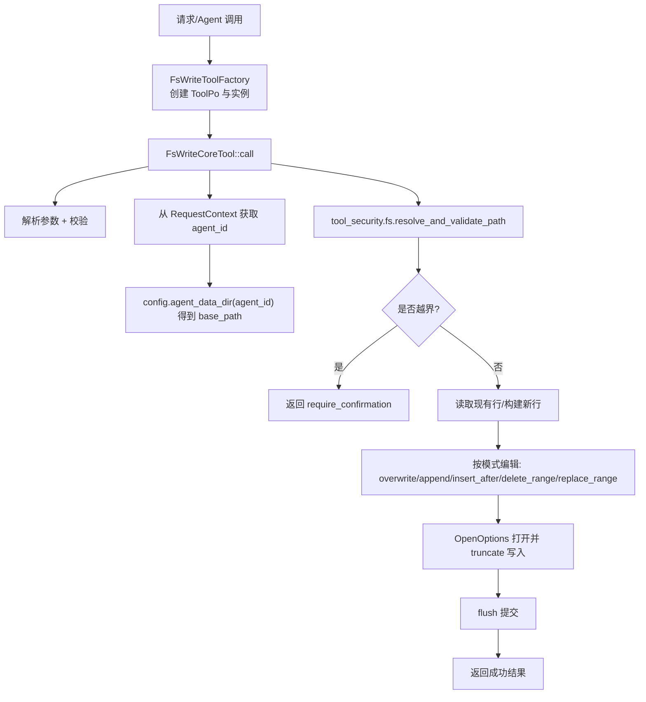
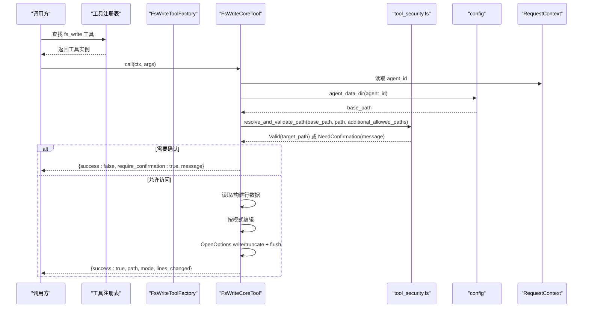
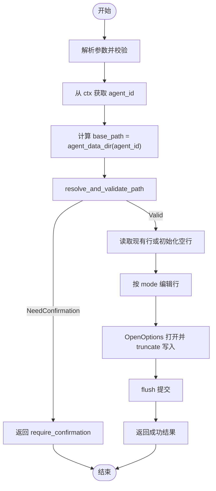
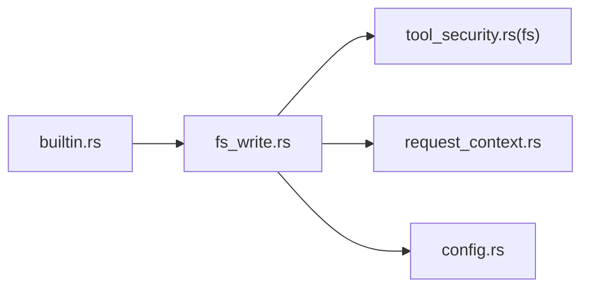

# 文件写入工具

<cite>
**本文引用的文件**
- [fs_write.rs](src/pkg/tool_registry/fs_write.rs)
- [tool_security.rs](src/pkg/tool_registry/tool_security.rs)
- [builtin.rs](src/pkg/tool_registry/builtin.rs)
- [request_context.rs](src/pkg/request_context.rs)
- [config.rs](src/config.rs)
</cite>

## 目录
1. [简介](#简介)
2. [项目结构](#项目结构)
3. [核心组件](#核心组件)
4. [架构总览](#架构总览)
5. [详细组件分析](#详细组件分析)
6. [依赖关系分析](#依赖关系分析)
7. [性能与原子性](#性能与原子性)
8. [故障排查指南](#故障排查指南)
9. [结论](#结论)
10. [附录：参数与安全清单](#附录参数与安全清单)

## 简介
本技术文档聚焦于“文件写入工具”的实现与使用，围绕 FsWriteToolFactory 及其核心实现 FsWriteCoreTool，系统阐述以下主题：
- 文件创建、内容写入、目录结构管理
- 参数配置：目标路径、文件内容、覆盖策略（模式）、自动创建目录等
- 安全控制：路径验证、权限检查、敏感文件保护、符号链接防护
- 事务性与原子性：基于内存编辑+一次性覆写落盘的策略
- 错误恢复：失败时不产生部分写入，返回明确结果或需用户确认提示
- 实际使用示例：如何安全地创建和修改文件

该工具属于通用基础设施工具，位于 pkg 层，无业务感知，遵循四层单向调用原则。

## 项目结构
FsWriteToolFactory 及相关逻辑集中在工具注册与文件系统安全模块中：
- 工厂与核心实现：fs_write.rs
- 安全校验与沙箱：tool_security.rs（fs 子模块）
- 内置工具注册入口：builtin.rs
- 上下文与隔离：request_context.rs（agent_id 用于按 Agent 隔离数据目录）
- 配置与基路径：config.rs（提供 agent_data_dir）

图表来源
- [fs_write.rs:48-100](src/pkg/tool_registry/fs_write.rs#L48-L100)
- [fs_write.rs:121-275](src/pkg/tool_registry/fs_write.rs#L121-L275)
- [tool_security.rs:329-419](src/pkg/tool_registry/tool_security.rs#L329-L419)
- [config.rs:14-16](src/config.rs#L14-L16)
- [request_context.rs:22-61](src/pkg/request_context.rs#L22-L61)

章节来源
- [fs_write.rs:1-427](src/pkg/tool_registry/fs_write.rs#L1-L427)
- [tool_security.rs:314-487](src/pkg/tool_registry/tool_security.rs#L314-L487)
- [builtin.rs:1-44](src/pkg/tool_registry/builtin.rs#L1-L44)
- [request_context.rs:1-200](src/pkg/request_context.rs#L1-L200)
- [config.rs:1-78](src/config.rs#L1-L78)

## 核心组件
- FsWriteToolFactory：定义内置工具的元信息（id/name/description/parameters_schema），并创建 FsWriteCoreTool 实例。
- FsWriteCoreTool：实现 CoreTool::call，完成参数解析、安全校验、行级编辑与落盘。
- tool_security.fs：提供 resolve_and_validate_path、is_sensitive_filename、sanitize_error 等安全能力。
- RequestContext：提供 agent_id，用于按 Agent 隔离工作目录。
- config：提供 agent_data_dir，作为每个 Agent 的基数据目录。

章节来源
- [fs_write.rs:44-118](src/pkg/tool_registry/fs_write.rs#L44-L118)
- [fs_write.rs:121-275](src/pkg/tool_registry/fs_write.rs#L121-L275)
- [tool_security.rs:314-487](src/pkg/tool_registry/tool_security.rs#L314-L487)
- [request_context.rs:22-61](src/pkg/request_context.rs#L22-L61)
- [config.rs:14-16](src/config.rs#L14-L16)

## 架构总览
FsWriteToolFactory 通过内置工具注册机制被纳入全局工具集；调用时由上层调度器根据 ToolPo 构造 FsWriteCoreTool 并执行 call。整个流程严格遵循“适配器→领域→数据访问”的单向调用，工具本身位于 pkg 层，无业务耦合。

图表来源
- [builtin.rs:27-43](src/pkg/tool_registry/builtin.rs#L27-L43)
- [fs_write.rs:48-100](src/pkg/tool_registry/fs_write.rs#L48-L100)
- [fs_write.rs:121-275](src/pkg/tool_registry/fs_write.rs#L121-L275)
- [tool_security.rs:329-419](src/pkg/tool_registry/tool_security.rs#L329-L419)
- [config.rs:14-16](src/config.rs#L14-L16)
- [request_context.rs:22-61](src/pkg/request_context.rs#L22-L61)

## 详细组件分析

### FsWriteToolFactory 与参数模型
- 工厂职责：
  - 生成 ToolPo 元信息：id="fs_write"，name="write_file"，描述包含原子写入、权限规则说明。
  - 声明参数 schema：path、mode（枚举）、content、start_line、end_line、after_line。
  - 默认配置 FsToolConfig（可配置 additional_allowed_paths）。
- 参数说明：
  - path：相对项目/工作区根的路径。
  - mode：overwrite、append、insert_after、delete_range、replace_range。
  - content：写入内容（某些模式必填）。
  - start_line/end_line：范围操作（1-indexed）。
  - after_line：插入位置（1-indexed）。
- 自动创建目录：
  - 写入时使用 create(true)，若父目录不存在会触发 IO 错误；建议在调用前确保目录存在或由上层保证。

章节来源
- [fs_write.rs:16-42](src/pkg/tool_registry/fs_write.rs#L16-L42)
- [fs_write.rs:48-100](src/pkg/tool_registry/fs_write.rs#L48-L100)
- [fs_write.rs:277-323](src/pkg/tool_registry/fs_write.rs#L277-L323)

### FsWriteCoreTool 执行流程
- 参数解析与校验：
  - 将 JSON 参数反序列化为 WriteFileArgs。
  - 根据 mode 校验必填字段（如 overwrite/append/insert_after/replace_range 需要 content；delete_range/replace_range 需要 start_line/end_line）。
- 安全校验：
  - 从 RequestContext 取 agent_id，结合 config.agent_data_dir 得到 base_path。
  - 调用 resolve_and_validate_path 进行路径规范化、敏感文件名拦截、白名单范围校验、符号链接拒绝。
  - 若越界，返回 require_confirmation=true 的响应，要求上层交互确认。
- 行级编辑与落盘：
  - 若目标文件存在则读取所有行；否则初始为空。
  - 按 mode 在内存中编辑行集合。
  - 使用 OpenOptions 以 write/create/truncate 方式打开文件，逐行写入并 flush。
  - 返回 success、path、mode、original_lines、final_lines、lines_changed。

图表来源
- [fs_write.rs:121-275](src/pkg/tool_registry/fs_write.rs#L121-L275)
- [tool_security.rs:329-419](src/pkg/tool_registry/tool_security.rs#L329-L419)
- [config.rs:14-16](src/config.rs#L14-L16)
- [request_context.rs:22-61](src/pkg/request_context.rs#L22-L61)

章节来源
- [fs_write.rs:121-275](src/pkg/tool_registry/fs_write.rs#L121-L275)

### 安全控制措施
- 路径验证与沙箱：
  - 拒绝敏感文件名（如 .env、.key、.pem、id_rsa、password、secret、token、credential、auth 以及隐藏文件）。
  - 规范化路径（处理 ..、符号链接），仅允许在 base_path 或 additional_allowed_paths 范围内。
  - 拒绝符号链接。
- 权限与隔离：
  - 基于 agent_id 隔离工作目录，避免跨 Agent 访问。
  - 越界路径不会直接拒绝，而是返回 require_confirmation，强制上层交互确认后再继续。
- 错误脱敏：
  - 使用 sanitize_error 去除绝对路径片段，防止泄露内部路径信息。

章节来源
- [tool_security.rs:329-419](src/pkg/tool_registry/tool_security.rs#L329-L419)
- [tool_security.rs:421-487](src/pkg/tool_registry/tool_security.rs#L421-L487)
- [fs_write.rs:132-153](src/pkg/tool_registry/fs_write.rs#L132-L153)

### 事务性与原子性
- 原子性策略：
  - 所有编辑先在内存中进行，完成后一次性 truncate 写入并 flush。
  - 任何中间步骤失败都不会产生部分写入，保持文件一致性。
- 回滚与恢复：
  - 由于未采用临时文件+重命名的双阶段提交，失败时无法自动回滚到旧版本；但已保证不会留下半写状态。
  - 建议在上层对关键文件做备份或使用版本控制系统保障可恢复性。

章节来源
- [fs_write.rs:154-267](src/pkg/tool_registry/fs_write.rs#L154-L267)

### 实际使用示例
以下为典型的安全用法要点（不展示代码，仅给出步骤）：
- 准备参数：
  - path：指定相对路径，例如 "src/data/config.txt"。
  - mode：选择 overwrite/append/insert_after/delete_range/replace_range。
  - content：对于 overwrite/append/insert_after/replace_range 必须提供。
  - start_line/end_line：对于 delete_range/replace_range 必须提供（1-indexed）。
  - after_line：对于 insert_after 必须提供（1-indexed）。
- 安全校验：
  - 确保 path 指向当前 Agent 的工作目录或其额外允许目录。
  - 避免敏感文件名。
- 调用与处理：
  - 若返回 require_confirmation=true，应提示用户确认后再继续。
  - 成功后可根据 lines_changed 判断变更量。
- 目录管理：
  - 若父目录不存在，写入会失败；请在上层确保目录存在。

章节来源
- [fs_write.rs:24-42](src/pkg/tool_registry/fs_write.rs#L24-L42)
- [fs_write.rs:121-275](src/pkg/tool_registry/fs_write.rs#L121-L275)
- [tool_security.rs:329-419](src/pkg/tool_registry/tool_security.rs#L329-L419)

## 依赖关系分析
- 工具注册：
  - builtin.rs 维护 GENERIC_BUILTIN_TOOLS，包含 fs_write 工厂。
  - register_all 将工厂注册到全局 ToolRegistry。
- 运行时依赖：
  - fs_write.rs 依赖 tool_security.fs 进行路径与文件名安全校验。
  - 依赖 RequestContext 获取 agent_id，依赖 config 获取 base_path。
- 外部接口：
  - 实现 CoreTool 接口，供上层统一调度执行。

图表来源
- [builtin.rs:27-43](src/pkg/tool_registry/builtin.rs#L27-L43)
- [fs_write.rs:1-15](src/pkg/tool_registry/fs_write.rs#L1-L15)
- [tool_security.rs:314-487](src/pkg/tool_registry/tool_security.rs#L314-L487)
- [request_context.rs:22-61](src/pkg/request_context.rs#L22-L61)
- [config.rs:14-16](src/config.rs#L14-L16)

章节来源
- [builtin.rs:1-44](src/pkg/tool_registry/builtin.rs#L1-L44)
- [fs_write.rs:1-15](src/pkg/tool_registry/fs_write.rs#L1-L15)

## 性能与原子性
- 性能特性：
  - 行级编辑在内存中进行，适合中小规模文本文件。
  - 写入为顺序追加行，I/O 次数与行数成正比。
- 原子性：
  - 一次性 truncate 写入 + flush，保证要么全部成功，要么失败不残留部分写入。
- 优化建议：
  - 对超大文件，考虑分块写入或流式处理；当前实现以行为单位写入，简单可靠。
  - 如需更强原子性，可在上层引入临时文件+原子重命名策略。

[本节为通用指导，无需特定文件引用]

## 故障排查指南
- 常见错误与定位：
  - 参数缺失：根据 mode 校验失败，检查 content/start_line/end_line/after_line 是否齐全。
  - 路径越界：返回 require_confirmation=true，检查 path 是否在 base_path 或 additional_allowed_paths 内。
  - 敏感文件：is_sensitive_filename 命中，更换文件名或调整策略。
  - 符号链接：被拒绝，改用真实文件或目录。
  - 目录不存在：写入失败，先创建父目录。
- 日志与调试：
  - 关注返回的 error/message 字段，必要时在上层记录完整上下文（ctx、agent_id、base_path）。
  - 使用 sanitize_error 输出已脱敏的错误信息，便于审计。

章节来源
- [fs_write.rs:121-275](src/pkg/tool_registry/fs_write.rs#L121-L275)
- [tool_security.rs:329-487](src/pkg/tool_registry/tool_security.rs#L329-L487)

## 结论
FsWriteToolFactory 提供的 write_file 工具以“内存编辑+一次性落盘”的方式实现了安全的文件写入能力。其核心优势包括：
- 多模式支持：覆盖、追加、插入、删除、替换范围。
- 强安全约束：路径白名单、敏感文件拦截、符号链接拒绝、越界需确认。
- 原子性保障：失败不产生部分写入，便于上层容错与恢复。
- 清晰参数与配置：易于集成与扩展（如 additional_allowed_paths）。

在生产环境中，建议结合版本控制或备份策略提升可恢复性，并在上层对 require_confirmation 场景做好用户交互。

[本节为总结，无需特定文件引用]

## 附录：参数与安全清单
- 参数清单
  - path：必填，字符串，相对路径。
  - mode：必填，枚举：overwrite、append、insert_after、delete_range、replace_range。
  - content：按需必填（overwrite/append/insert_after/replace_range）。
  - start_line/end_line：按需必填（delete_range/replace_range，1-indexed）。
  - after_line：按需必填（insert_after，1-indexed）。
- 安全清单
  - 路径必须在 base_path 或 additional_allowed_paths 范围内。
  - 禁止敏感文件名与隐藏文件。
  - 禁止符号链接。
  - 越界路径需用户确认。
- 目录管理
  - 父目录不存在会导致写入失败，请在上层确保目录存在。
- 原子性与恢复
  - 单次写入具备原子性；建议上层配合备份/版本控制以实现可恢复。

章节来源
- [fs_write.rs:24-42](src/pkg/tool_registry/fs_write.rs#L24-L42)
- [fs_write.rs:121-275](src/pkg/tool_registry/fs_write.rs#L121-L275)
- [tool_security.rs:329-487](src/pkg/tool_registry/tool_security.rs#L329-L487)