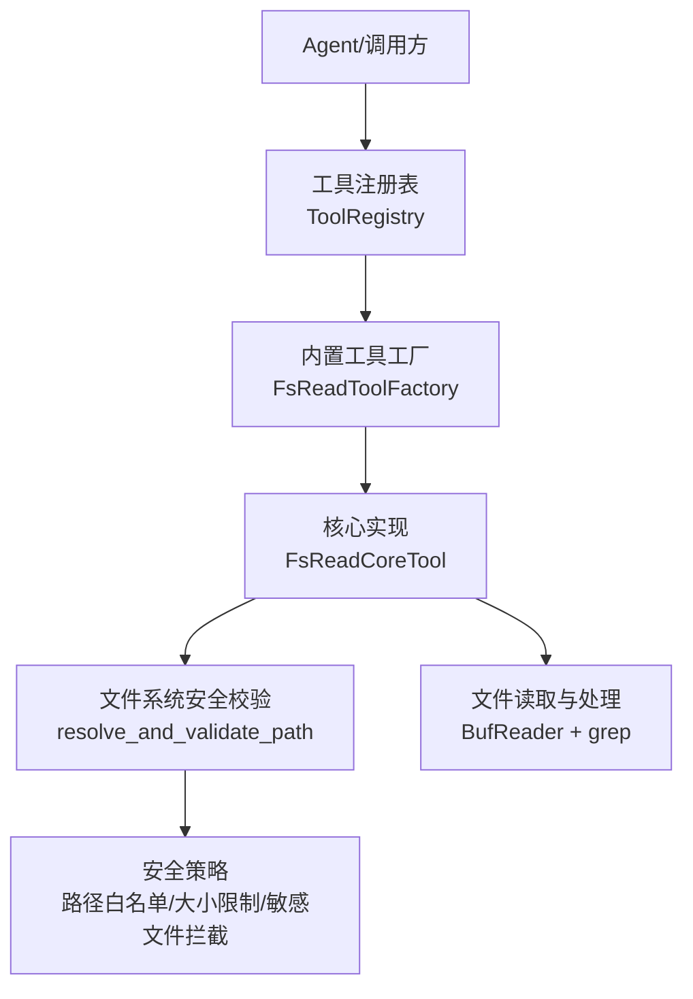
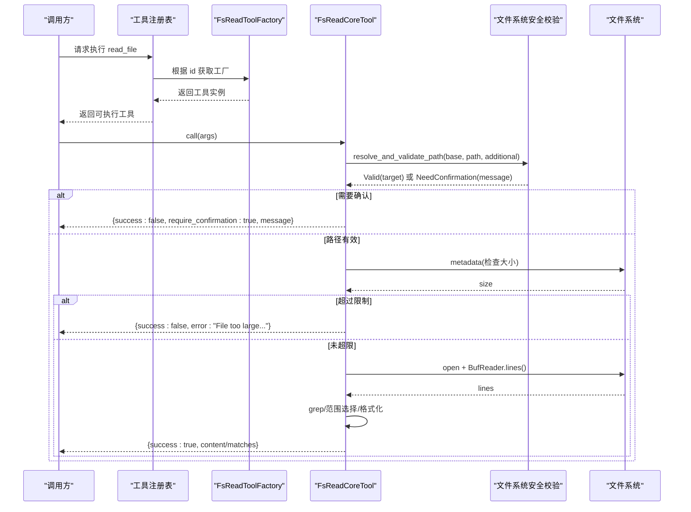
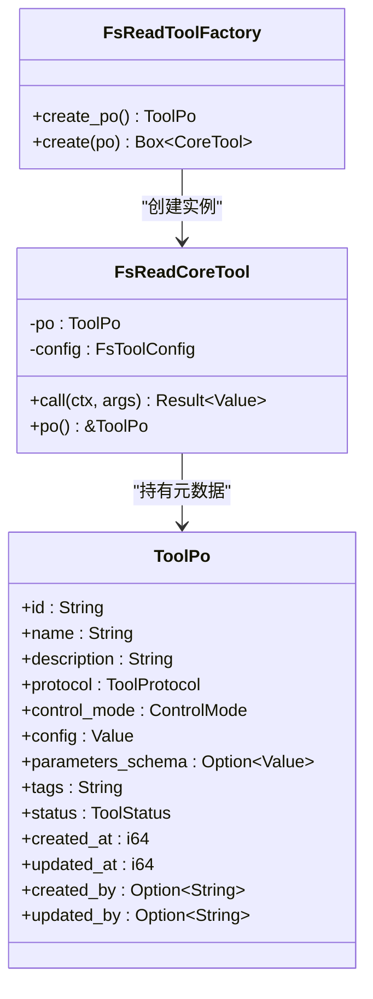
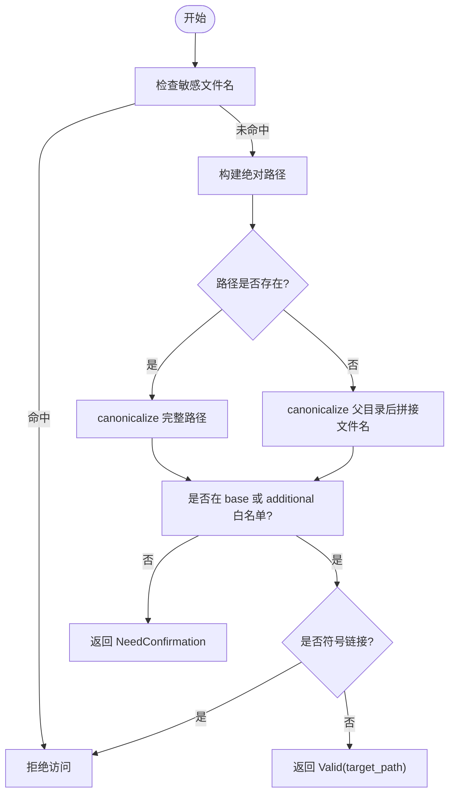
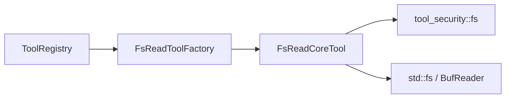

# 文件读取工具

<cite>
**本文引用的文件**
- [fs_read.rs](src/pkg/tool_registry/fs_read.rs)
- [tool_security.rs](src/pkg/tool_registry/tool_security.rs)
- [mod.rs](src/pkg/tool_registry/mod.rs)
- [fs_tests.rs](src/pkg/tool_registry/fs_tests.rs)
- [tool.rs](src/models/tool.rs)
</cite>

## 目录
1. [简介](#简介)
2. [项目结构](#项目结构)
3. [核心组件](#核心组件)
4. [架构总览](#架构总览)
5. [详细组件分析](#详细组件分析)
6. [依赖关系分析](#依赖关系分析)
7. [性能考量](#性能考量)
8. [故障排查指南](#故障排查指南)
9. [结论](#结论)
10. [附录：使用示例与参数说明](#附录使用示例与参数说明)

## 简介
本技术文档围绕“文件读取工具”展开，聚焦 FsReadToolFactory 的实现原理与安全机制。该工具用于在 Agent 环境中安全地读取项目工作区内的文本文件，支持全文读取、按行范围读取以及基于模式的 grep 匹配并返回上下文行。其核心目标是在保证安全的前提下提供高效、可控的文件读取能力。

## 项目结构
文件读取工具位于工具注册中心（Tool Registry）的内置工具模块中，相关实现集中在以下文件：
- 工具工厂与核心实现：fs_read.rs
- 文件系统安全校验与错误脱敏：tool_security.rs（fs 子模块）
- 全局工具注册表与协议分发：mod.rs
- 单元测试覆盖路径验证与敏感文件拦截：fs_tests.rs
- 工具抽象与持久化对象定义：tool.rs

图表来源
- [mod.rs:29-102](src/pkg/tool_registry/mod.rs#L29-L102)
- [fs_read.rs:50-123](src/pkg/tool_registry/fs_read.rs#L50-L123)
- [tool_security.rs:315-419](src/pkg/tool_registry/tool_security.rs#L315-L419)

章节来源
- [mod.rs:29-102](src/pkg/tool_registry/mod.rs#L29-L102)
- [fs_read.rs:50-123](src/pkg/tool_registry/fs_read.rs#L50-L123)
- [tool_security.rs:315-419](src/pkg/tool_registry/tool_security.rs#L315-L419)

## 核心组件
- FsReadToolFactory：创建 read_file 工具的 ToolPo 元数据与运行时实例。
- FsReadCoreTool：实现 CoreTool 接口，负责参数解析、路径校验、大小限制、读取与格式化输出。
- 文件系统安全模块（tool_security::fs）：提供 resolve_and_validate_path、is_sensitive_filename、sanitize_error 等安全能力。
- 工具注册表（ToolRegistry）：管理内置工具工厂，按协议类型分发创建工具实例。

章节来源
- [fs_read.rs:50-123](src/pkg/tool_registry/fs_read.rs#L50-L123)
- [tool_security.rs:315-419](src/pkg/tool_registry/tool_security.rs#L315-L419)
- [mod.rs:29-102](src/pkg/tool_registry/mod.rs#L29-L102)

## 架构总览
文件读取工具遵循“适配器→领域→数据访问”的单向分层原则，工具层作为适配器暴露统一接口，内部通过安全模块与系统 IO 交互，不直接耦合业务逻辑。

图表来源
- [fs_read.rs:125-216](src/pkg/tool_registry/fs_read.rs#L125-L216)
- [tool_security.rs:315-419](src/pkg/tool_registry/tool_security.rs#L315-L419)

## 详细组件分析

### FsReadToolFactory 与 FsReadCoreTool
- 职责
  - 生成 ToolPo 元数据（id/name/description/parameters_schema/config），供上层展示与校验。
  - 创建 FsReadCoreTool 实例，封装配置与行为。
- 关键流程
  - 参数解析：将 JSON 参数反序列化为 ReadFileArgs（path/start_line/end_line/grep/context_lines）。
  - 路径校验：调用 resolve_and_validate_path 进行白名单与敏感文件检查。
  - 大小限制：读取文件元信息，硬限制为 10MB。
  - 读取与处理：逐行读取，支持 grep 模式匹配与上下文行；否则按行范围截取并带行号格式化输出。
- 返回值
  - 成功：包含路径、文件大小、总行数、内容或匹配结果。
  - 需确认：当路径超出默认工作目录时返回 require_confirmation=true 及提示消息。
  - 失败：返回错误信息（已脱敏绝对路径）。

图表来源
- [fs_read.rs:50-123](src/pkg/tool_registry/fs_read.rs#L50-L123)
- [tool.rs:57-88](src/models/tool.rs#L57-L88)

章节来源
- [fs_read.rs:50-123](src/pkg/tool_registry/fs_read.rs#L50-L123)
- [tool.rs:57-88](src/models/tool.rs#L57-L88)

### 路径验证与安全控制
- 路径解析与规范化
  - 相对路径以 base_data_path 为根拼接；绝对路径直接使用。
  - 对存在的路径进行 canonicalize，不存在则 canonicalize 父目录再拼接文件名，避免 .. 与符号链接逃逸。
- 白名单与额外允许路径
  - 默认允许 base_data_path 下的文件。
  - 可通过 FsToolConfig.additional_allowed_paths 配置额外允许目录，同样进行规范化与 starts_with 校验。
- 敏感文件拦截
  - is_sensitive_filename 拦截常见密钥/凭证/隐藏文件（如 .env、.pem、.key、id_rsa、password、secret、token、credential、auth 以及以 . 开头的隐藏项）。
- 符号链接拒绝
  - 若最终路径是符号链接，直接拒绝访问。
- 越界路径处理
  - 不在白名单内但可解析的路径，返回 NeedConfirmation，要求 Agent 向用户明确确认后再继续。

图表来源
- [tool_security.rs:315-419](src/pkg/tool_registry/tool_security.rs#L315-L419)

章节来源
- [tool_security.rs:315-419](src/pkg/tool_registry/tool_security.rs#L315-L419)

### 编码处理与读取策略
- 读取方式
  - 使用 BufReader 逐行读取，避免一次性加载大文件到内存。
- 编码假设
  - 代码未显式指定解码器，按 Rust std::io::Lines 的 UTF-8 语义处理；非 UTF-8 字节可能导致读取失败。
- 行号与格式
  - 输出内容附带行号（1-indexed），便于编辑定位。
- 范围读取
  - start_line 与 end_line 支持可选范围，内部转换为 0-indexed 并钳制到合法区间。

章节来源
- [fs_read.rs:167-210](src/pkg/tool_registry/fs_read.rs#L167-L210)
- [fs_read.rs:242-254](src/pkg/tool_registry/fs_read.rs#L242-L254)

### Grep 匹配与上下文
- 匹配逻辑
  - 简单字符串包含匹配（line.contains(pattern)），返回匹配行及其前后 context_lines 行。
- 输出结构
  - 每个匹配项包含 line_number、content（含行号）、context_before、context_after。
- 复杂度
  - 时间复杂度 O(N)，N 为文件总行数；空间复杂度取决于匹配数量与上下文行。

章节来源
- [fs_read.rs:218-240](src/pkg/tool_registry/fs_read.rs#L218-L240)

### 错误处理与异常策略
- 参数解析失败：包装为通用错误并返回。
- 路径解析失败：统一错误信息，去除绝对路径前缀以避免泄露敏感路径。
- 元信息读取失败：返回错误，包含脱敏后的原因。
- 打开/读取失败：返回错误，包含脱敏后的原因。
- 大小超限：返回结构化错误响应，指示最大允许值与实际大小。
- 越界路径：返回 require_confirmation=true，引导 Agent 询问用户。

章节来源
- [fs_read.rs:127-176](src/pkg/tool_registry/fs_read.rs#L127-L176)
- [tool_security.rs:476-485](src/pkg/tool_registry/tool_security.rs#L476-L485)

## 依赖关系分析
- 工具注册表
  - 维护内置工具工厂映射，按协议类型分发创建工具实例。
- 工具抽象
  - CoreTool 接口定义了统一的 call 方法，所有工具实现该接口。
- 安全模块
  - 文件系统安全函数被 fs_read 直接调用，确保路径与文件访问受控。

图表来源
- [mod.rs:29-102](src/pkg/tool_registry/mod.rs#L29-L102)
- [fs_read.rs:50-123](src/pkg/tool_registry/fs_read.rs#L50-L123)
- [tool_security.rs:315-419](src/pkg/tool_registry/tool_security.rs#L315-L419)

章节来源
- [mod.rs:29-102](src/pkg/tool_registry/mod.rs#L29-L102)
- [tool.rs:16-32](src/models/tool.rs#L16-L32)

## 性能考量
- 流式读取：使用 BufReader 逐行读取，降低内存占用。
- 大小限制：硬限制 10MB，防止大文件导致资源耗尽。
- Grep 匹配：线性扫描，适合中小规模文件；超大文件建议结合范围读取减少处理量。
- 行范围裁剪：start_line/end_line 可减少不必要的数据传输与处理。

[本节为通用性能讨论，不直接分析具体文件]

## 故障排查指南
- 无法访问路径
  - 检查路径是否在 base_data_path 或 additional_allowed_paths 内。
  - 确认路径未被识别为符号链接。
- 敏感文件拦截
  - 若文件名命中敏感模式（如 .env、id_rsa、password、secret、token、credential、auth 或隐藏文件），将被拒绝。
- 文件过大
  - 超过 10MB 会返回错误；请拆分文件或调整需求。
- 非 UTF-8 编码
  - 当前读取按 UTF-8 处理；非 UTF-8 文件可能读取失败，需转换编码或使用其他工具。
- 越界路径需确认
  - 返回 require_confirmation=true 时，Agent 应提示用户确认后再继续。

章节来源
- [fs_tests.rs:12-80](src/pkg/tool_registry/fs_tests.rs#L12-L80)
- [fs_read.rs:127-176](src/pkg/tool_registry/fs_read.rs#L127-L176)
- [tool_security.rs:315-419](src/pkg/tool_registry/tool_security.rs#L315-L419)

## 结论
FsReadToolFactory 提供的文件读取工具在安全性与可用性之间取得平衡：通过严格的白名单、敏感文件拦截、符号链接拒绝与大小限制，保障系统安全；同时支持全文、范围与 grep 模式读取，满足常见场景。建议在 Agent 中结合 require_confirmation 提示与用户确认流程，确保越界访问得到授权。

[本节为总结性内容，不直接分析具体文件]

## 附录：使用示例与参数说明

### 参数说明
- path（必填）：要读取的文件路径，相对于项目/工作区根目录。
- start_line（可选）：起始行号（1-indexed），省略则从首行开始。
- end_line（可选）：结束行号（1-indexed，包含），省略则读到末尾。
- grep（可选）：正则或字符串匹配模式，仅返回匹配行及上下文。
- context_lines（可选）：grep 模式下每条匹配前后的上下文行数，默认 2。

章节来源
- [fs_read.rs:23-39](src/pkg/tool_registry/fs_read.rs#L23-L39)
- [fs_read.rs:68-99](src/pkg/tool_registry/fs_read.rs#L68-L99)

### 在 Agent 中的调用流程
- 步骤
  - 通过工具注册表获取内置工具（id="fs_read"）。
  - 构造参数 JSON（至少包含 path）。
  - 调用工具 call 方法，处理返回：
    - success=true：读取成功，包含 content 或 matches。
    - require_confirmation=true：提示用户确认后再继续。
    - success=false：错误信息（已脱敏路径）。
- 注意事项
  - 对于越界路径，务必等待用户确认。
  - 大文件优先使用 start_line/end_line 或 grep 缩小范围。
  - 注意编码为 UTF-8。

章节来源
- [mod.rs:81-102](src/pkg/tool_registry/mod.rs#L81-L102)
- [fs_read.rs:125-216](src/pkg/tool_registry/fs_read.rs#L125-L216)