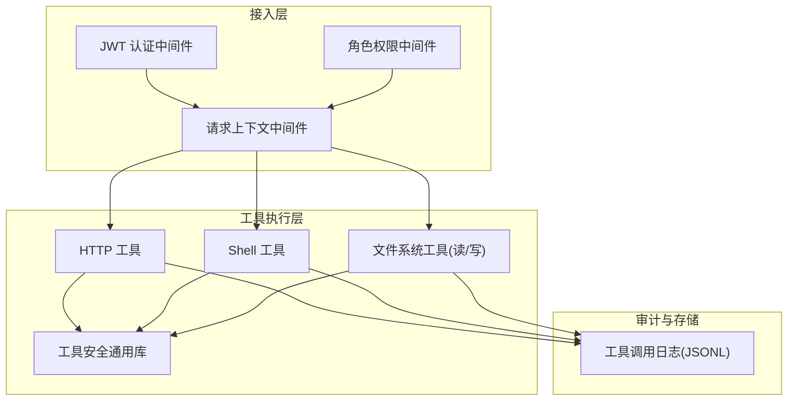
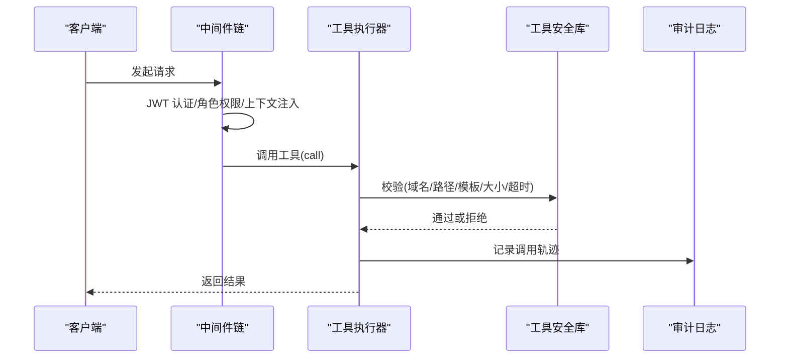
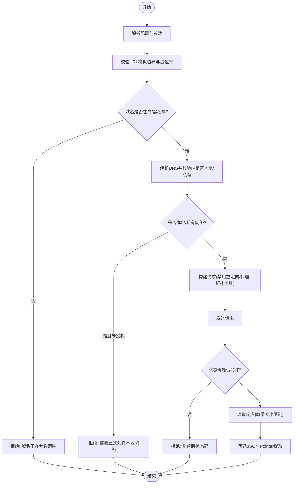
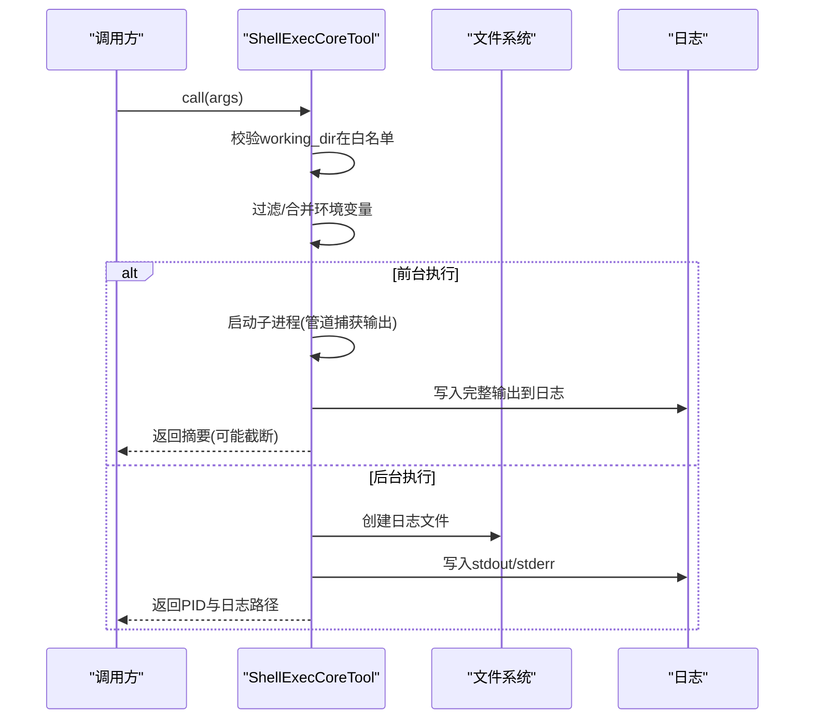
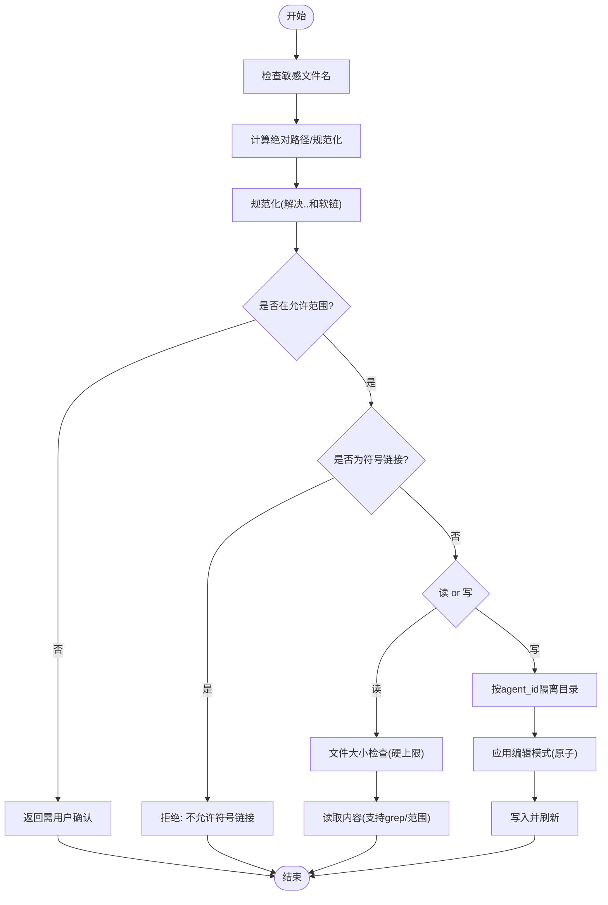
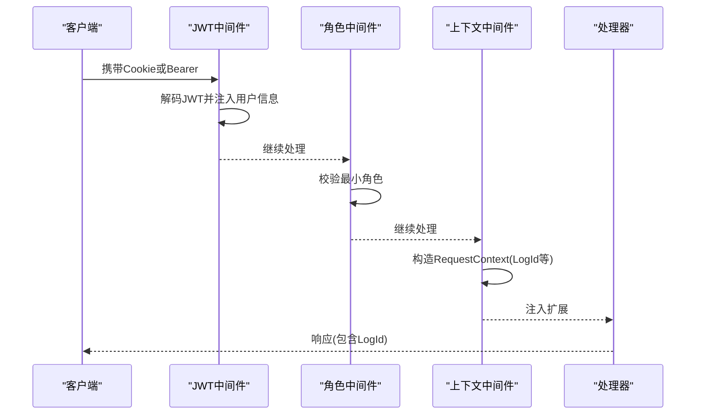
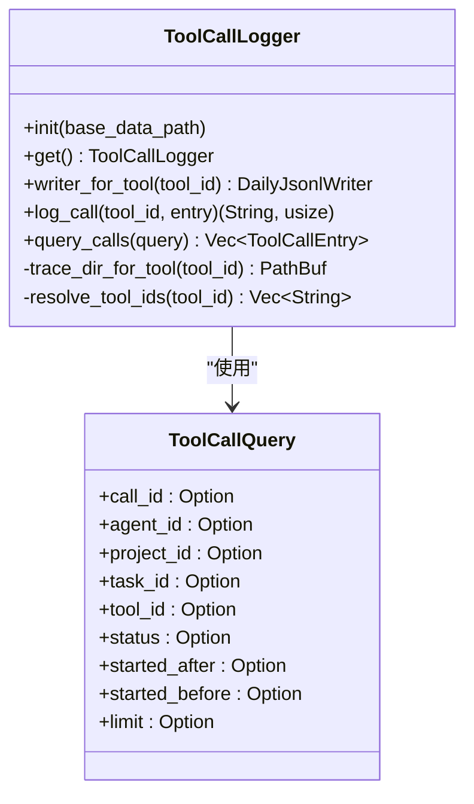
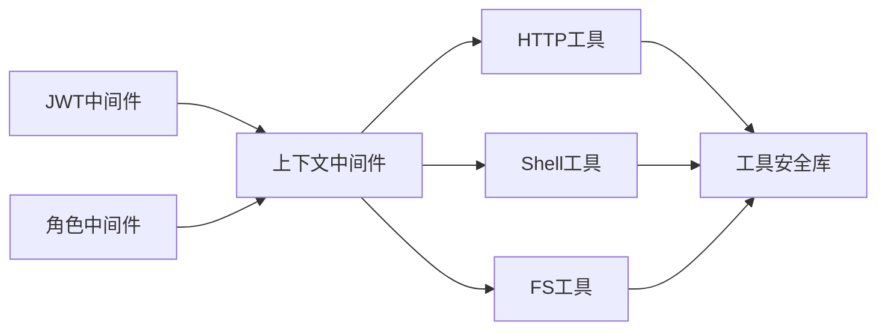

# 工具安全控制

<cite>
**本文引用的文件**
- [tool_security.rs](src/pkg/tool_registry/tool_security.rs)
- [http.rs](src/pkg/tool_registry/http.rs)
- [shell_exec.rs](src/pkg/tool_registry/shell_exec.rs)
- [fs_read.rs](src/pkg/tool_registry/fs_read.rs)
- [fs_write.rs](src/pkg/tool_registry/fs_write.rs)
- [jwt_auth.rs](src/middleware/jwt_auth.rs)
- [require_role.rs](src/middleware/require_role.rs)
- [request_context.rs](src/middleware/request_context.rs)
- [logger.rs](src/pkg/tool_tracing/logger.rs)

### 本文关联的三类文档（四类互引闭环，2026-08-16 增量补齐）

**① 设计文档（Design）**：
- docs/archive/design-archive/user_workspace_security_boundary_and_path_isolation.md（占位：待 ai-orz-doc-maintainer 落地后回填真实路径）
- docs/design/runtime_design.md — runtime 三接口工具化复用工具安全控制系统

**② 落地计划（Plan）**：
- docs/archive/plan-archive/user_dimension_workspace_refactor_and_security_boundary.md（占位：待 ai-orz-doc-maintainer 落地后回填真实路径）
- docs/archive/plan-archive/runtime_tool_registration_as_agent_callable_tools.md（占位：待 ai-orz-doc-maintainer 落地后回填真实路径）

**④ RAG 原子知识卡**：
- [用户维度工作区路径改造 + 工具调用安全边界检查：路径逃逸 跨用户访问 相对路径阻断](docs/wiki/knowledge/zh/用户维度工作区路径改造 + 工具调用安全边界检查：路径逃逸 跨用户访问 相对路径阻断/用户维度工作区路径改造 + 工具调用安全边界检查：路径逃逸 跨用户访问 相对路径阻断.md) — §红线 1 工作区路径必须走 paths.rs 构造函数；§红线 3 SecurityBoundaryChecker enforce 必须是 IO 前的最后一道 gate
- [运行时诊断工具注册为 Agent 可调用工具：runtime-status cancel-thinking runtime-list 三接口工具化](docs/wiki/knowledge/zh/运行时诊断工具注册为 Agent 可调用工具：runtime-status cancel-thinking runtime-list 三接口工具化/运行时诊断工具注册为 Agent 可调用工具：runtime-status cancel-thinking runtime-list 三接口工具化.md) — runtime 三工具通过工具注册表注册，复用工具安全控制链（鉴权/scope/审计日志）
</cite>

## 更新摘要
**2026-08-16 增量更新**：补齐 cite 区四类互引闭环（2 Design+2 Plan 规范占位 + 2 RAG 卡）；关联 T5（工作区安全边界）与 T2（runtime 三接口工具化）两大主题；§5 文件系统安全校验、§7 资源限制章节来源行号降级（因 6b883e37 SecurityBoundaryChecker 从 tool_security::fs 子模块迁移到 domain/tool_execution/sandbox.rs，导致行号范围漂移，优先降级为无行号范围引用）。

## 目录
1. [简介](#简介)
2. [项目结构](#项目结构)
3. [核心组件](#核心组件)
4. [架构总览](#架构总览)
5. [详细组件分析](#详细组件分析)
6. [依赖关系分析](#依赖关系分析)
7. [性能与资源限制](#性能与资源限制)
8. [故障排查指南](#故障排查指南)
9. [结论](#结论)
10. [附录：配置与安全最佳实践](#附录配置与安全最佳实践)

## 简介
本技术文档聚焦于“工具安全控制系统”，围绕工具执行沙箱、权限验证、资源限制机制展开，覆盖命令白名单、网络访问控制、文件系统访问限制、用户权限检查、上下文隔离、审计日志记录等关键能力。同时提供不同工具类型（HTTP、Shell、文件系统）的安全要求与配置方法，以及常见安全威胁防护方案与最佳实践。

## 项目结构
本项目采用四层单向调用：Adapter → Domain → DAL → DAO；通用基础设施工具统一放在 src/pkg/ 对应子模块，无业务感知。工具注册与执行位于 src/pkg/tool_registry，安全策略集中在 tool_security 模块；HTTP/Shell/FS 三类工具分别实现各自的安全边界；认证与鉴权通过中间件在请求入口完成；工具调用审计通过每日 JSONL 日志落盘。

图表来源
- [jwt_auth.rs:1-156](src/middleware/jwt_auth.rs#L1-L156)
- [require_role.rs:1-39](src/middleware/require_role.rs#L1-L39)
- [request_context.rs:1-41](src/middleware/request_context.rs#L1-L41)
- [http.rs:1-599](src/pkg/tool_registry/http.rs#L1-L599)
- [shell_exec.rs:1-490](src/pkg/tool_registry/shell_exec.rs#L1-L490)
- [fs_read.rs:1-255](src/pkg/tool_registry/fs_read.rs#L1-L255)
- [fs_write.rs:1-427](src/pkg/tool_registry/fs_write.rs#L1-L427)
- [tool_security.rs:1-487](src/pkg/tool_registry/tool_security.rs#L1-L487)
- [logger.rs:1-253](src/pkg/tool_tracing/logger.rs#L1-L253)

章节来源
- [jwt_auth.rs:1-156](src/middleware/jwt_auth.rs#L1-L156)
- [require_role.rs:1-39](src/middleware/require_role.rs#L1-L39)
- [request_context.rs:1-41](src/middleware/request_context.rs#L1-L41)
- [http.rs:1-599](src/pkg/tool_registry/http.rs#L1-L599)
- [shell_exec.rs:1-490](src/pkg/tool_registry/shell_exec.rs#L1-L490)
- [fs_read.rs:1-255](src/pkg/tool_registry/fs_read.rs#L1-L255)
- [fs_write.rs:1-427](src/pkg/tool_registry/fs_write.rs#L1-L427)
- [tool_security.rs:1-487](src/pkg/tool_registry/tool_security.rs#L1-L487)
- [logger.rs:1-253](src/pkg/tool_tracing/logger.rs#L1-L253)

## 核心组件
- 工具安全通用库：提供域名匹配、SSRF 防护、URL 模板校验、响应体大小限制、敏感头脱敏、文件系统路径解析与校验、敏感文件名拦截等。
- HTTP 工具：固定 URL 模板、受限方法、域名白/黑名单、禁止重定向与代理、DNS 地址钉扎、超时与响应大小限制、JSON Pointer 提取。
- Shell 工具：工作目录白名单、环境变量白名单过滤、输出大小限制、后台进程与日志落盘、超时控制。
- 文件系统工具：基于 base_data_path 与额外允许路径的读写范围限制、符号链接拒绝、敏感文件名拦截、按 Agent 隔离写入目录。
- 认证与鉴权：双模式 JWT 认证（Cookie/Bearer）、角色权限中间件、请求上下文注入（用户、组织、角色、CallerType）。
- 审计日志：按工具维度按日分片 JSONL 落盘，支持查询与限流。

章节来源
- [tool_security.rs:1-487](src/pkg/tool_registry/tool_security.rs#L1-L487)
- [http.rs:1-599](src/pkg/tool_registry/http.rs#L1-L599)
- [shell_exec.rs:1-490](src/pkg/tool_registry/shell_exec.rs#L1-L490)
- [fs_read.rs:1-255](src/pkg/tool_registry/fs_read.rs#L1-L255)
- [fs_write.rs:1-427](src/pkg/tool_registry/fs_write.rs#L1-L427)
- [jwt_auth.rs:1-156](src/middleware/jwt_auth.rs#L1-L156)
- [require_role.rs:1-39](src/middleware/require_role.rs#L1-L39)
- [request_context.rs:1-41](src/middleware/request_context.rs#L1-L41)
- [logger.rs:1-253](src/pkg/tool_tracing/logger.rs#L1-L253)

## 架构总览
工具执行的安全链路从请求进入开始，经过认证、鉴权、上下文构建，再到具体工具执行时的安全策略校验，最终将调用轨迹持久化到审计日志。

图表来源
- [jwt_auth.rs:1-156](src/middleware/jwt_auth.rs#L1-L156)
- [require_role.rs:1-39](src/middleware/require_role.rs#L1-L39)
- [request_context.rs:1-41](src/middleware/request_context.rs#L1-L41)
- [http.rs:126-220](src/pkg/tool_registry/http.rs#L126-L220)
- [shell_exec.rs:256-466](src/pkg/tool_registry/shell_exec.rs#L256-L466)
- [fs_read.rs:125-216](src/pkg/tool_registry/fs_read.rs#L125-L216)
- [fs_write.rs:121-270](src/pkg/tool_registry/fs_write.rs#L121-L270)
- [tool_security.rs:92-170](src/pkg/tool_registry/tool_security.rs#L92-L170)
- [logger.rs:64-140](src/pkg/tool_tracing/logger.rs#L64-L140)

## 详细组件分析

### HTTP 工具安全控制
- 固定目标与模板约束：URL scheme 与 authority 必须固定，不允许模板占位符；仅支持 GET/POST；禁止重定向与代理；请求头键名与值需合法；Body 模板键不可含占位符。
- 域名与 SSRF 防护：支持 allowed_domains/blocked_domains 列表；本地/私有网络默认拒绝，需显式 allow_local_network=true；DNS 解析后对 IP 再次校验并钉扎到客户端。
- 资源限制：超时与响应体大小有默认值与硬上限，超出即拒绝；响应头中敏感字段会被脱敏。
- 参数校验：基于 parameters_schema 校验必填项、枚举、类型与 additionalProperties。

图表来源
- [http.rs:126-220](src/pkg/tool_registry/http.rs#L126-L220)
- [http.rs:369-475](src/pkg/tool_registry/http.rs#L369-L475)
- [tool_security.rs:92-170](src/pkg/tool_registry/tool_security.rs#L92-L170)
- [tool_security.rs:172-231](src/pkg/tool_registry/tool_security.rs#L172-L231)

章节来源
- [http.rs:1-599](src/pkg/tool_registry/http.rs#L1-L599)
- [tool_security.rs:92-170](src/pkg/tool_registry/tool_security.rs#L92-L170)
- [tool_security.rs:172-231](src/pkg/tool_registry/tool_security.rs#L172-L231)

### Shell 工具安全控制
- 工作目录白名单：仅允许在 base_data_path 或配置的 additional_allowed_paths 内执行；相对路径自动归一到 base_data_path。
- 环境变量白名单：仅透传父进程中的允许列表变量，并过滤敏感变量名；可合并额外环境变量。
- 资源限制：默认超时与最大输出大小；超长输出截断并保存完整日志；后台任务将 stdout/stderr 写入日志文件。
- 平台兼容：Windows 使用 cmd.exe /C，Unix 使用 /bin/sh -c。

图表来源
- [shell_exec.rs:168-208](src/pkg/tool_registry/shell_exec.rs#L168-L208)
- [shell_exec.rs:210-254](src/pkg/tool_registry/shell_exec.rs#L210-L254)
- [shell_exec.rs:256-466](src/pkg/tool_registry/shell_exec.rs#L256-L466)

章节来源
- [shell_exec.rs:1-490](src/pkg/tool_registry/shell_exec.rs#L1-L490)

### 文件系统工具安全控制（读/写）
- 路径解析与校验：优先拒绝敏感文件名；绝对/相对路径规范化；仅允许在 base_data_path 或 additional_allowed_paths 范围内；拒绝符号链接；越界路径需用户确认。
- 读限制：大文件直接拒绝（硬上限），支持行范围读取与 grep 模式。
- 写隔离：写入时基于 agent_id 获取 agent_data_dir，实现按 Agent 隔离；支持多种原子编辑模式（覆盖、追加、插入、删除/替换范围）。

图表来源
- [tool_security.rs:314-487](src/pkg/tool_registry/tool_security.rs#L314-L487)
- [fs_read.rs:125-216](src/pkg/tool_registry/fs_read.rs#L125-L216)
- [fs_write.rs:121-270](src/pkg/tool_registry/fs_write.rs#L121-L270)

章节来源
- [tool_security.rs:314-487](src/pkg/tool_registry/tool_security.rs#L314-L487)
- [fs_read.rs:1-255](src/pkg/tool_registry/fs_read.rs#L1-L255)
- [fs_write.rs:1-427](src/pkg/tool_registry/fs_write.rs#L1-L427)

### 认证、鉴权与上下文隔离
- 认证：支持 Cookie 与 Bearer 双模式；失败时对浏览器请求 302 重定向，API 请求返回 401。
- 鉴权：基于角色继承的最小权限模型，不满足最低角色要求返回 403。
- 上下文：从请求头提取用户、组织、角色、CallerType，生成 LogId 并回写到响应头，贯穿后续工具执行与审计。

图表来源
- [jwt_auth.rs:36-87](src/middleware/jwt_auth.rs#L36-L87)
- [require_role.rs:20-37](src/middleware/require_role.rs#L20-L37)
- [request_context.rs:20-40](src/middleware/request_context.rs#L20-L40)

章节来源
- [jwt_auth.rs:1-156](src/middleware/jwt_auth.rs#L1-L156)
- [require_role.rs:1-39](src/middleware/require_role.rs#L1-L39)
- [request_context.rs:1-41](src/middleware/request_context.rs#L1-L41)

### 审计日志记录
- 日志位置：{base_data_path}/tools/{tool_id}/call_trace/{YYYYMMDD}.jsonl，每行一条调用记录。
- 功能：按工具维度写入与查询；支持按 call_id、agent/project/task/tool/status 及时间范围过滤；查询结果按时间倒序并限制条数。
- 安全性：tool_id 校验防止路径穿越；扫描时仅读取 jsonl 文件。

图表来源
- [logger.rs:18-140](src/pkg/tool_tracing/logger.rs#L18-L140)
- [logger.rs:142-185](src/pkg/tool_tracing/logger.rs#L142-L185)
- [logger.rs:204-253](src/pkg/tool_tracing/logger.rs#L204-L253)

章节来源
- [logger.rs:1-253](src/pkg/tool_tracing/logger.rs#L1-L253)

## 依赖关系分析
- HTTP 工具依赖工具安全库进行域名/IP 校验、模板校验与响应体限制。
- Shell/FS 工具依赖工具安全库进行路径与文件名校验。
- 所有工具执行均通过 RequestContext 传递上下文，便于审计与追踪。
- 认证与鉴权中间件在工具执行前确保调用者身份与权限。

图表来源
- [http.rs:1-599](src/pkg/tool_registry/http.rs#L1-L599)
- [shell_exec.rs:1-490](src/pkg/tool_registry/shell_exec.rs#L1-L490)
- [fs_read.rs:1-255](src/pkg/tool_registry/fs_read.rs#L1-L255)
- [fs_write.rs:1-427](src/pkg/tool_registry/fs_write.rs#L1-L427)
- [tool_security.rs:1-487](src/pkg/tool_registry/tool_security.rs#L1-L487)
- [jwt_auth.rs:1-156](src/middleware/jwt_auth.rs#L1-L156)
- [require_role.rs:1-39](src/middleware/require_role.rs#L1-L39)
- [request_context.rs:1-41](src/middleware/request_context.rs#L1-L41)

章节来源
- [http.rs:1-599](src/pkg/tool_registry/http.rs#L1-L599)
- [shell_exec.rs:1-490](src/pkg/tool_registry/shell_exec.rs#L1-L490)
- [fs_read.rs:1-255](src/pkg/tool_registry/fs_read.rs#L1-L255)
- [fs_write.rs:1-427](src/pkg/tool_registry/fs_write.rs#L1-L427)
- [tool_security.rs:1-487](src/pkg/tool_registry/tool_security.rs#L1-L487)
- [jwt_auth.rs:1-156](src/middleware/jwt_auth.rs#L1-L156)
- [require_role.rs:1-39](src/middleware/require_role.rs#L1-L39)
- [request_context.rs:1-41](src/middleware/request_context.rs#L1-L41)

## 性能与资源限制
- HTTP 工具：默认超时 30s，硬上限 10 分钟；默认响应体 1MB，硬上限 10MB；禁止重定向与代理；DNS 钉扎减少解析开销与风险。
- Shell 工具：默认超时 5 分钟；默认最大输出 10MB；超长输出截断并落盘；后台任务避免阻塞主流程。
- FS 工具：读操作硬上限 10MB；支持行级范围读取与 grep 以减少内存占用；写操作按 Agent 隔离目录，降低冲突与误写。
- 审计日志：按日分片 JSONL，查询限制最大 100 条，避免全量扫描影响性能。

章节来源
- [http.rs:561-589](src/pkg/tool_registry/http.rs#L561-L589)
- [tool_security.rs:8-15](src/pkg/tool_registry/tool_security.rs#L8-L15)
- [shell_exec.rs:24-68](src/pkg/tool_registry/shell_exec.rs#L24-L68)
- [fs_read.rs:150-165](src/pkg/tool_registry/fs_read.rs#L150-L165)
- [logger.rs:16-31](src/pkg/tool_tracing/logger.rs#L16-L31)

## 故障排查指南
- HTTP 请求失败：检查 URL 模板是否包含非法占位符；确认域名在白名单或未命中黑名单；若目标为本地/私有网络，需显式允许；查看响应状态码是否在允许列表；关注响应体大小限制。
- Shell 执行异常：检查工作目录是否在允许范围；确认环境变量白名单是否包含所需变量；查看日志文件路径与输出是否被截断；检查超时设置。
- 文件读写失败：确认路径是否越界或指向敏感文件；检查是否存在符号链接；对于写操作，确认 Agent 隔离目录是否正确；错误信息已做脱敏处理。
- 认证/鉴权问题：确认 Cookie 或 Authorization 头是否正确；检查角色权限是否满足最小要求；查看响应头中的 LogId 以便定位。
- 审计日志查询：确认 tool_id 有效；使用 call_id 精确查找；注意查询限制与时间范围过滤。

章节来源
- [http.rs:126-220](src/pkg/tool_registry/http.rs#L126-L220)
- [shell_exec.rs:256-466](src/pkg/tool_registry/shell_exec.rs#L256-L466)
- [fs_read.rs:125-216](src/pkg/tool_registry/fs_read.rs#L125-L216)
- [fs_write.rs:121-270](src/pkg/tool_registry/fs_write.rs#L121-L270)
- [jwt_auth.rs:36-87](src/middleware/jwt_auth.rs#L36-L87)
- [require_role.rs:20-37](src/middleware/require_role.rs#L20-L37)
- [logger.rs:87-140](src/pkg/tool_tracing/logger.rs#L87-L140)

## 结论
该工具安全控制系统通过严格的模板与域名校验、SSRF 防护、工作目录与环境变量白名单、大小与超时限制、Agent 隔离与审计日志，构建了覆盖网络、命令与文件系统的多层安全边界。结合认证与鉴权中间件，实现了从请求入口到工具执行的端到端安全闭环。建议在生产环境中遵循最小权限原则，严格配置白名单与资源限制，并持续监控审计日志以发现异常行为。

## 附录：配置与安全最佳实践
- HTTP 工具
  - 固定 URL scheme 与 authority，禁止在 scheme/authority 中使用模板占位符。
  - 明确 allowed_domains 与 blocked_domains；本地/私有网络默认拒绝，仅在必要时开启 allow_local_network。
  - 设置合理的 timeout_ms 与 response_max_bytes；启用 allowed_status_codes 白名单。
  - 使用 JSON Pointer 仅提取必要字段，减少数据暴露面。
- Shell 工具
  - 限定 working_dir 在 base_data_path 或 additional_allowed_paths；谨慎添加额外允许路径。
  - 使用 allowed_env 白名单，避免泄露敏感环境变量；合并额外环境变量时需审查。
  - 合理设置 default_timeout_ms 与 default_max_output_size_bytes；后台任务务必记录日志路径。
- 文件系统工具
  - 仅开放必要目录；additional_allowed_paths 应最小化；定期清理越界路径尝试。
  - 拒绝符号链接；敏感文件名（如 .env、*.key、id_rsa 等）一律拦截。
  - 写操作按 Agent 隔离目录，避免跨 Agent 污染。
- 认证与鉴权
  - 强制启用 JWT 认证；区分浏览器与 API 场景的错误响应。
  - 基于角色继承设定最小权限；对管理接口启用 require_role。
  - 利用 RequestContext 的 LogId 进行全链路追踪。
- 审计日志
  - 按日分片存储；限制查询条数；定期归档与清理过期日志。
  - 使用 call_id 快速定位问题；结合 agent/project/task 维度进行分析。

章节来源
- [http.rs:41-73](src/pkg/tool_registry/http.rs#L41-L73)
- [http.rs:369-475](src/pkg/tool_registry/http.rs#L369-L475)
- [shell_exec.rs:21-68](src/pkg/tool_registry/shell_exec.rs#L21-L68)
- [fs_read.rs:15-21](src/pkg/tool_registry/fs_read.rs#L15-L21)
- [fs_write.rs:16-22](src/pkg/tool_registry/fs_write.rs#L16-L22)
- [jwt_auth.rs:1-156](src/middleware/jwt_auth.rs#L1-L156)
- [require_role.rs:1-39](src/middleware/require_role.rs#L1-L39)
- [logger.rs:18-140](src/pkg/tool_tracing/logger.rs#L18-L140)