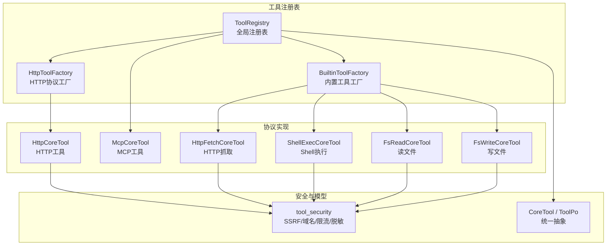
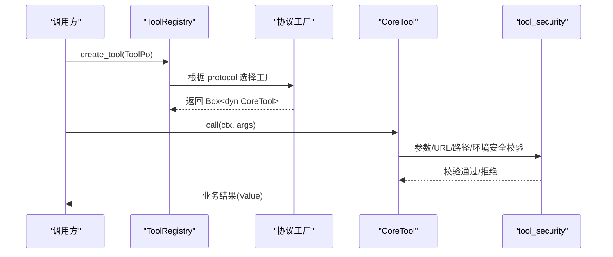
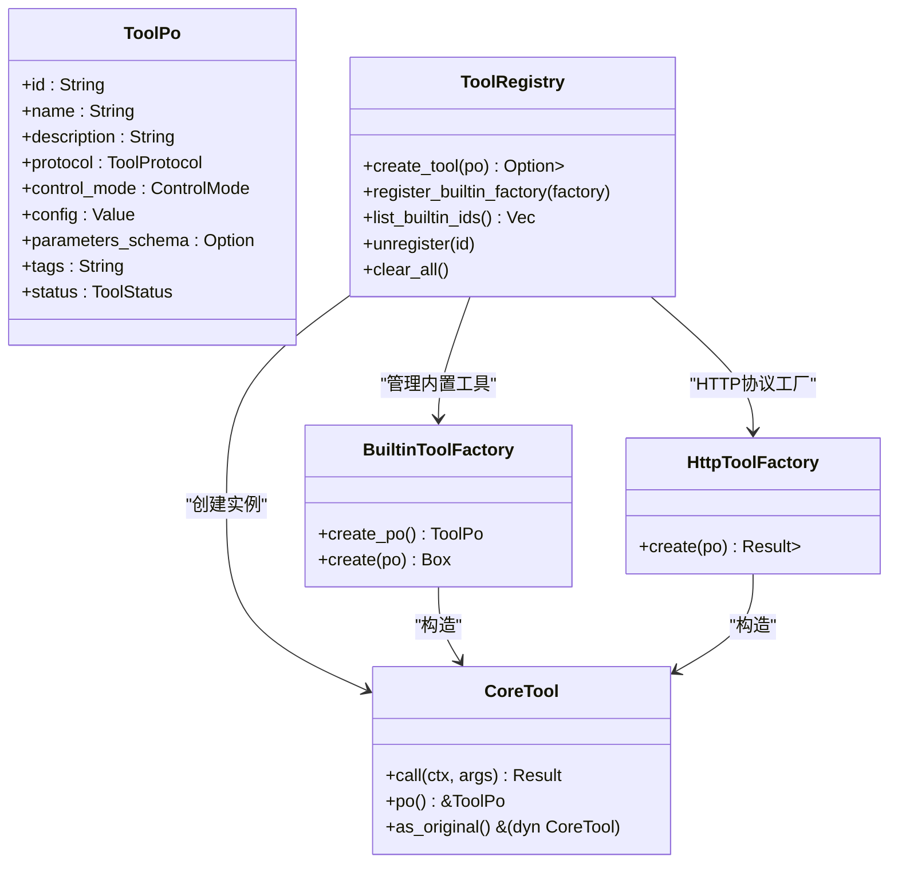
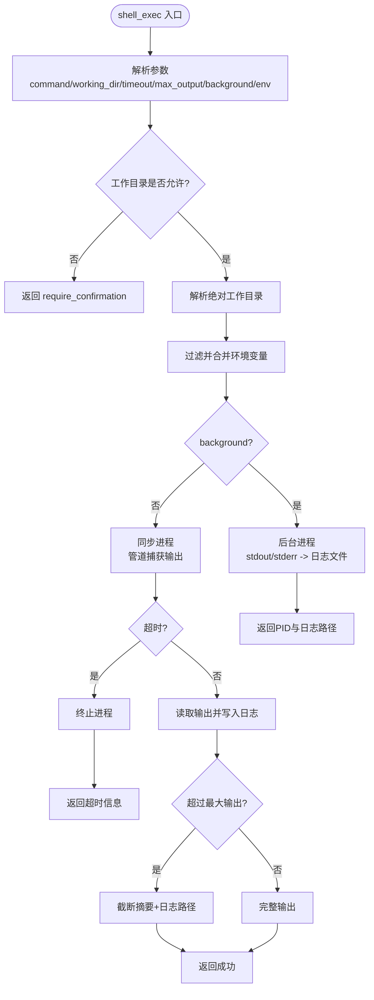
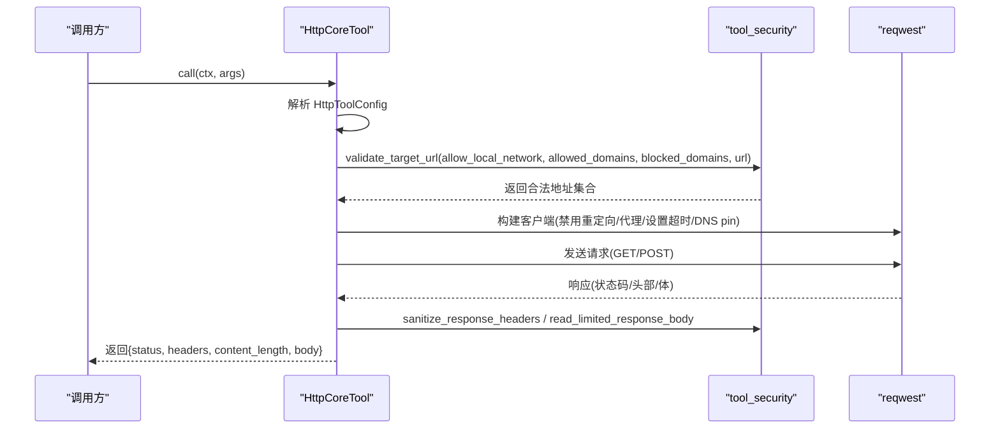
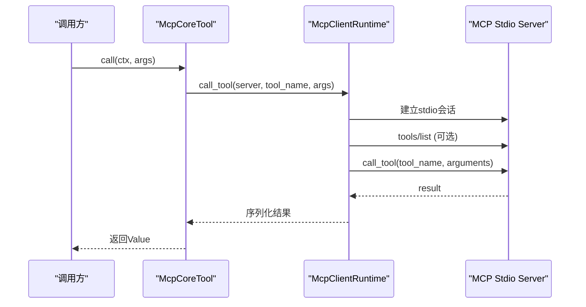
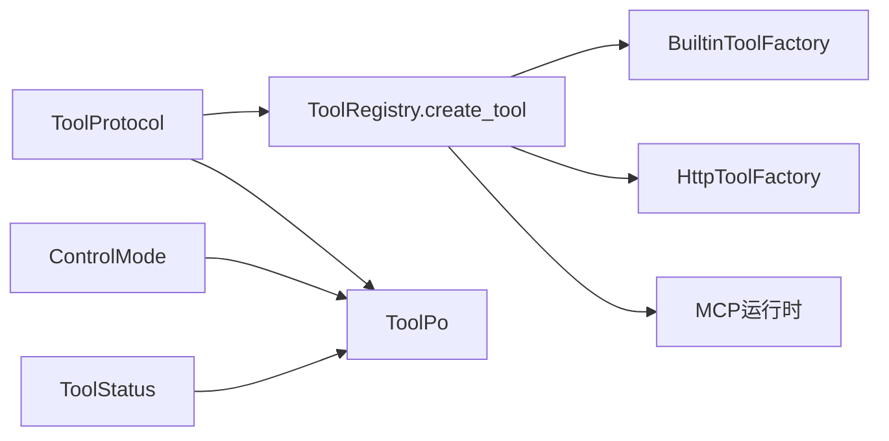

# 工具注册表（框架层）

<cite>
**本文引用的文件**   
- [src/pkg/tool_registry/mod.rs](src/pkg/tool_registry/mod.rs)
- [src/pkg/tool_registry/builtin.rs](src/pkg/tool_registry/builtin.rs)
- [src/pkg/tool_registry/http.rs](src/pkg/tool_registry/http.rs)
- [src/pkg/tool_registry/shell_exec.rs](src/pkg/tool_registry/shell_exec.rs)
- [src/pkg/tool_registry/mcp.rs](src/pkg/tool_registry/mcp.rs)
- [src/pkg/tool_registry/fs_read.rs](src/pkg/tool_registry/fs_read.rs)
- [src/pkg/tool_registry/fs_write.rs](src/pkg/tool_registry/fs_write.rs)
- [src/pkg/tool_registry/http_fetch.rs](src/pkg/tool_registry/http_fetch.rs)
- [src/pkg/tool_registry/tool_security.rs](src/pkg/tool_registry/tool_security.rs)
- [common/src/enums/tool.rs](common/src/enums/tool.rs)
- [src/models/tool.rs](src/models/tool.rs)
- 【① Design 决策】[docs/design/generic_builtin_tools_design.md](docs/design/generic_builtin_tools_design.md) — 通用 Builtin 工具 fs_read/fs_write/http_fetch + 安全沙箱最小权限
- 【① Design 决策】[docs/design/handler-tool-registration-macro.md](docs/design/handler-tool-registration-macro.md) — register_handler_tool! 宏把 Handler 函数转神经工具
- 【① Design 决策】[docs/design/builtins_http_tool_design.md](docs/design/builtins_http_tool_design.md) — HTTP Tool Runtime 用户注册式 ToolPo+HttpToolConfig
- 【④ RAG 知识卡】[工具系统三层调用架构](docs/wiki/knowledge/zh/工具系统三层调用架构：CoreTool%20trait%20+%20Builtin%20HTTP%20MCP%20三协议路由%20+%20register_handler_tool%20宏%20+%20神经工具免绑定三层校验/工具系统三层调用架构：CoreTool%20trait%20+%20Builtin%20HTTP%20MCP%20三协议路由%20+%20register_handler_tool%20宏%20+%20神经工具免绑定三层校验.md) — §2 职责表 §Builtin/MCP/HTTP/HandlerTool 四类工具位置 §红线 2/3 shell_exec 黑名单 + fs 路径安全
</cite>

## 目录
1. [简介](#简介)
2. [项目结构](#项目结构)
3. [核心组件](#核心组件)
4. [架构总览](#架构总览)
5. [详细组件分析](#详细组件分析)
6. [依赖关系分析](#依赖关系分析)
7. [性能与安全考量](#性能与安全考量)
8. [故障排查指南](#故障排查指南)
9. [结论](#结论)
10. [附录：自定义工具开发示例](#附录自定义工具开发示例)

## 简介
本技术文档围绕 AI Orz 的"工具注册表系统"展开，系统性说明工具抽象接口设计、内置工具实现、MCP 协议集成、HTTP 工具调用、Shell 执行工具等关键能力。重点覆盖工具注册机制、发现与创建流程、执行引擎、安全控制、生命周期管理、参数校验、错误处理与性能监控，并提供自定义工具开发与调试的实践指引。

> 📌 视角说明（AGENTS §2.1.3 Level 3 互补视角平行卡）：
> 本长文是「工具注册表」主题的 **框架层** 视角。同主题还有以下平行视角卡，请按需交叉阅读：
> - [工具注册表（代码落地层）](docs/wiki/zh/content/核心模块/工具注册表/工具注册表.md)

## 项目结构
工具注册表位于 src/pkg/tool_registry 下，采用“协议分治 + 工厂模式”的组织方式：
- 全局注册表：维护各协议的工厂或配置，按 ToolPo 动态创建可执行工具实例
- 内置工具：通过 BuiltinToolFactory 提供默认 ToolPo 并构造 CoreTool
- HTTP/MCP/Shell/FS 等具体协议实现：各自封装配置、参数校验、执行逻辑与安全策略
- 共享安全库：统一 SSRF、域名白名单/黑名单、响应大小限制、敏感头脱敏等

图表来源
- [src/pkg/tool_registry/mod.rs:29-102](src/pkg/tool_registry/mod.rs#L29-L102)
- [src/pkg/tool_registry/builtin.rs:26-43](src/pkg/tool_registry/builtin.rs#L26-L43)
- [src/pkg/tool_registry/http.rs:23-114](src/pkg/tool_registry/http.rs#L23-L114)
- [src/pkg/tool_registry/mcp.rs:270-365](src/pkg/tool_registry/mcp.rs#L270-L365)
- [src/pkg/tool_registry/shell_exec.rs:89-149](src/pkg/tool_registry/shell_exec.rs#L89-L149)
- [src/pkg/tool_registry/fs_read.rs:50-105](src/pkg/tool_registry/fs_read.rs#L50-L105)
- [src/pkg/tool_registry/fs_write.rs:44-101](src/pkg/tool_registry/fs_write.rs#L44-L101)
- [src/pkg/tool_registry/http_fetch.rs:19-52](src/pkg/tool_registry/http_fetch.rs#L19-L52)
- [src/pkg/tool_registry/tool_security.rs:1-231](src/pkg/tool_registry/tool_security.rs#L1-L231)
- [src/models/tool.rs:16-34](src/models/tool.rs#L16-L34)

章节来源
- [src/pkg/tool_registry/mod.rs:29-102](src/pkg/tool_registry/mod.rs#L29-L102)
- [common/src/enums/tool.rs:9-22](common/src/enums/tool.rs#L9-L22)
- [src/models/tool.rs:57-88](src/models/tool.rs#L57-L88)

## 核心组件
- 工具抽象接口 CoreTool：定义统一的 call(ctx, args) 与 po() 访问器，所有工具均实现该接口，便于上层以统一方式调度执行与追踪。
- 持久化对象 ToolPo：承载工具的元数据（id/name/description/protocol/config/parameters_schema/tags/status 等），是工具注册与发现的依据。
- 全局注册表 ToolRegistry：集中管理各协议工厂，根据 ToolPo.protocol 分发到对应工厂创建可执行工具实例。
- 内置工具工厂 BuiltinToolFactory：为每个内置工具提供默认 ToolPo 和构造方法，支持一键注册全部通用内置工具。
- 协议级工厂 HttpToolFactory：HTTP 工具由数据库配置驱动，使用协议级工厂统一创建。
- MCP 运行时 McpClientRuntime：负责 stdio 模式的 MCP 服务器连接、工具列表获取与工具调用。

章节来源
- [src/models/tool.rs:16-34](src/models/tool.rs#L16-L34)
- [src/models/tool.rs:57-88](src/models/tool.rs#L57-L88)
- [src/pkg/tool_registry/mod.rs:46-102](src/pkg/tool_registry/mod.rs#L46-L102)
- [src/pkg/tool_registry/builtin.rs:13-43](src/pkg/tool_registry/builtin.rs#L13-L43)
- [src/pkg/tool_registry/http.rs:23-39](src/pkg/tool_registry/http.rs#L23-L39)
- [src/pkg/tool_registry/mcp.rs:50-101](src/pkg/tool_registry/mcp.rs#L50-L101)

## 架构总览
工具从注册到执行的完整链路如下：
- 启动阶段：注册内置工具工厂；初始化全局注册表
- 查询阶段：根据 ToolPo 的 protocol 字段选择对应工厂
- 创建阶段：工厂解析 ToolPo.config 生成可执行工具实例
- 执行阶段：调用 CoreTool.call(ctx, args)，内部进行参数校验、安全校验、外部调用与结果封装
- 生命周期：工具实例随请求上下文创建与释放；MCP 会话在调用后关闭；HTTP 客户端复用但禁用重定向与代理

图表来源
- [src/pkg/tool_registry/mod.rs:81-102](src/pkg/tool_registry/mod.rs#L81-L102)
- [src/pkg/tool_registry/http.rs:126-220](src/pkg/tool_registry/http.rs#L126-L220)
- [src/pkg/tool_registry/shell_exec.rs:256-466](src/pkg/tool_registry/shell_exec.rs#L256-L466)
- [src/pkg/tool_registry/mcp.rs:142-192](src/pkg/tool_registry/mcp.rs#L142-L192)
- [src/pkg/tool_registry/tool_security.rs:92-170](src/pkg/tool_registry/tool_security.rs#L92-L170)

## 详细组件分析

### 工具抽象与注册机制
- CoreTool 接口：统一 call(ctx, args) 与 po()，支持装饰器链路与原始工具访问
- ToolPo：描述工具元数据，包含协议类型、控制模式、JSON Schema 参数定义、状态等
- ToolRegistry：
  - 维护内置工厂映射、HTTP 协议工厂、MCP 工厂占位
  - create_tool 根据 protocol 路由到不同工厂
  - 提供 list_builtin_ids、unregister、clear_all 等管理能力

图表来源
- [src/models/tool.rs:16-34](src/models/tool.rs#L16-L34)
- [src/models/tool.rs:57-88](src/models/tool.rs#L57-L88)
- [src/pkg/tool_registry/mod.rs:46-132](src/pkg/tool_registry/mod.rs#L46-L132)
- [src/pkg/tool_registry/builtin.rs:13-24](src/pkg/tool_registry/builtin.rs#L13-L24)
- [src/pkg/tool_registry/http.rs:23-39](src/pkg/tool_registry/http.rs#L23-L39)

章节来源
- [src/models/tool.rs:16-34](src/models/tool.rs#L16-L34)
- [src/models/tool.rs:57-88](src/models/tool.rs#L57-L88)
- [src/pkg/tool_registry/mod.rs:46-132](src/pkg/tool_registry/mod.rs#L46-L132)
- [src/pkg/tool_registry/builtin.rs:13-43](src/pkg/tool_registry/builtin.rs#L13-L43)
- [src/pkg/tool_registry/http.rs:23-39](src/pkg/tool_registry/http.rs#L23-L39)

### 内置工具实现
- http_fetch：仅允许 HTTPS 公共地址，默认禁止本地网络，严格 SSRF 防护，限制响应大小
- fs_read：支持全文、行范围读取与 grep 匹配，路径必须落在 base_data_path 或额外授权路径内，拒绝敏感文件名与符号链接
- fs_write：支持 overwrite/append/insert_after/delete_range/replace_range 多种原子写入模式，路径隔离基于 agent_id
- shell_exec：支持同步执行与后台运行，输出落盘日志，工作目录受限，环境变量白名单过滤，超时与输出大小限制

图表来源
- [src/pkg/tool_registry/shell_exec.rs:256-466](src/pkg/tool_registry/shell_exec.rs#L256-L466)
- [src/pkg/tool_registry/tool_security.rs:315-419](src/pkg/tool_registry/tool_security.rs#L315-L419)

章节来源
- [src/pkg/tool_registry/http_fetch.rs:19-143](src/pkg/tool_registry/http_fetch.rs#L19-L143)
- [src/pkg/tool_registry/fs_read.rs:50-216](src/pkg/tool_registry/fs_read.rs#L50-L216)
- [src/pkg/tool_registry/fs_write.rs:44-275](src/pkg/tool_registry/fs_write.rs#L44-L275)
- [src/pkg/tool_registry/shell_exec.rs:89-466](src/pkg/tool_registry/shell_exec.rs#L89-L466)

### HTTP 工具调用
- 配置驱动：ToolPo.config 存储 HttpToolConfig（method/url/headers/query/body/timeout/response_max_bytes/allowed_status_codes/response_json_pointer/allowed_domains/blocked_domains/allow_local_network）
- 模板渲染：支持 {{args.key}} 占位符，对 URL、Headers、Query、Body 进行模板渲染与校验
- 安全策略：
  - 强制固定 scheme/host，禁止 userinfo 与重定向
  - 域名白/黑名单校验，本地网络默认拒绝
  - DNS 解析后地址再校验，必要时 pin 到合法地址
  - 响应体大小限制，敏感响应头脱敏
- 参数校验：基于 parameters_schema 校验 required/properties/type/enum/additionalProperties

图表来源
- [src/pkg/tool_registry/http.rs:126-220](src/pkg/tool_registry/http.rs#L126-L220)
- [src/pkg/tool_registry/tool_security.rs:92-231](src/pkg/tool_registry/tool_security.rs#L92-L231)

章节来源
- [src/pkg/tool_registry/http.rs:41-114](src/pkg/tool_registry/http.rs#L41-L114)
- [src/pkg/tool_registry/http.rs:230-302](src/pkg/tool_registry/http.rs#L230-L302)
- [src/pkg/tool_registry/http.rs:369-475](src/pkg/tool_registry/http.rs#L369-L475)
- [src/pkg/tool_registry/tool_security.rs:92-231](src/pkg/tool_registry/tool_security.rs#L92-L231)

### MCP 协议集成
- 绑定配置：ToolPo.config 仅保存 server_id 与 tool_name，不重复存放服务器凭据
- 运行时依赖：McpToolDeps 注入 McpServerPo 与 McpClientRuntime
- 执行流程：
  - 建立 stdio 子进程会话，初始化服务
  - tools/list 获取远端工具元信息
  - call_tool 调用远端工具，超时保护，会话关闭
- 未实现：Streamable HTTP 传输暂不支持

图表来源
- [src/pkg/tool_registry/mcp.rs:142-192](src/pkg/tool_registry/mcp.rs#L142-L192)
- [src/pkg/tool_registry/mcp.rs:200-240](src/pkg/tool_registry/mcp.rs#L200-L240)
- [src/pkg/tool_registry/mcp.rs:270-365](src/pkg/tool_registry/mcp.rs#L270-L365)

章节来源
- [src/pkg/tool_registry/mcp.rs:28-48](src/pkg/tool_registry/mcp.rs#L28-L48)
- [src/pkg/tool_registry/mcp.rs:50-101](src/pkg/tool_registry/mcp.rs#L50-L101)
- [src/pkg/tool_registry/mcp.rs:142-192](src/pkg/tool_registry/mcp.rs#L142-L192)
- [src/pkg/tool_registry/mcp.rs:200-240](src/pkg/tool_registry/mcp.rs#L200-L240)
- [src/pkg/tool_registry/mcp.rs:270-365](src/pkg/tool_registry/mcp.rs#L270-L365)

### 文件系统工具安全
- 路径白名单：base_data_path 或 additional_allowed_paths，拒绝越界路径
- 敏感文件拦截：.env/.key/.pem 等敏感名直接拒绝
- 符号链接拒绝：防止绕过沙箱
- 写操作隔离：fs_write 基于 agent_id 隔离数据目录

章节来源
- [src/pkg/tool_registry/tool_security.rs:315-419](src/pkg/tool_registry/tool_security.rs#L315-L419)
- [src/pkg/tool_registry/fs_read.rs:125-216](src/pkg/tool_registry/fs_read.rs#L125-L216)
- [src/pkg/tool_registry/fs_write.rs:121-275](src/pkg/tool_registry/fs_write.rs#L121-L275)

## 依赖关系分析
- 协议枚举 ToolProtocol：Builtin/Http/Mcp，决定注册表路由
- 控制模式 ControlMode：Auto/Manual，影响工具编排与自动化程度
- 工具状态 ToolStatus：Enabled/Disabled/Stale，用于生命周期管理与同步异常标记

图表来源
- [common/src/enums/tool.rs:9-22](common/src/enums/tool.rs#L9-L22)
- [common/src/enums/tool.rs:58-118](common/src/enums/tool.rs#L58-L118)
- [src/pkg/tool_registry/mod.rs:81-102](src/pkg/tool_registry/mod.rs#L81-L102)

章节来源
- [common/src/enums/tool.rs:9-22](common/src/enums/tool.rs#L9-L22)
- [common/src/enums/tool.rs:58-118](common/src/enums/tool.rs#L58-L118)
- [src/pkg/tool_registry/mod.rs:81-102](src/pkg/tool_registry/mod.rs#L81-L102)

## 性能与安全考量
- 性能
  - HTTP：禁用重定向与代理，减少不必要跳转；超时与响应大小限制避免长尾；DNS 解析后地址校验与 pin 降低风险
  - Shell：后台模式避免阻塞；输出落盘避免内存膨胀；超时保护
  - MCP：会话级超时与关闭，避免资源泄漏
- 安全
  - HTTP：SSRF 防护（域名白/黑名单、本地网络默认拒绝）、URL 模板边界校验、敏感头脱敏
  - Shell：工作目录限制、环境变量白名单、敏感变量过滤
  - 文件系统：路径白名单、敏感文件名拦截、符号链接拒绝

章节来源
- [src/pkg/tool_registry/http.rs:126-220](src/pkg/tool_registry/http.rs#L126-L220)
- [src/pkg/tool_registry/tool_security.rs:92-231](src/pkg/tool_registry/tool_security.rs#L92-L231)
- [src/pkg/tool_registry/shell_exec.rs:210-254](src/pkg/tool_registry/shell_exec.rs#L210-L254)
- [src/pkg/tool_registry/fs_read.rs:125-216](src/pkg/tool_registry/fs_read.rs#L125-L216)
- [src/pkg/tool_registry/fs_write.rs:121-275](src/pkg/tool_registry/fs_write.rs#L121-L275)

## 故障排查指南
- HTTP 工具
  - 常见错误：非法方法、URL 模板占位符未解析、域名不在白名单、本地网络目标被拒、响应过大、状态码不在允许列表
  - 定位要点：检查 HttpToolConfig.method/url/allowed_domains/blocked_domains/allow_local_network/allowed_status_codes/response_max_bytes
- Shell 工具
  - 常见错误：工作目录不在允许路径、命令执行失败、超时、输出过大被截断
  - 定位要点：检查 working_dir、timeout_ms、max_output_size_bytes、日志路径
- MCP 工具
  - 常见错误：server_id 或 tool_name 为空、MCP 服务器未启用、stdio 会话初始化超时、工具调用超时
  - 定位要点：检查 McpToolConfig.server_id/tool_name、McpServerPo.command/env、connect_timeout_ms、timeout_ms
- 文件系统工具
  - 常见错误：路径越界、敏感文件名、符号链接、权限不足
  - 定位要点：检查 base_data_path/agent_data_dir、additional_allowed_paths、敏感文件名规则

章节来源
- [src/pkg/tool_registry/http.rs:369-475](src/pkg/tool_registry/http.rs#L369-L475)
- [src/pkg/tool_registry/shell_exec.rs:168-207](src/pkg/tool_registry/shell_exec.rs#L168-L207)
- [src/pkg/tool_registry/mcp.rs:372-394](src/pkg/tool_registry/mcp.rs#L372-L394)
- [src/pkg/tool_registry/tool_security.rs:315-419](src/pkg/tool_registry/tool_security.rs#L315-L419)

## 结论
AI Orz 工具注册表通过统一的 CoreTool 抽象与多协议工厂体系，实现了内置工具、HTTP 远程调用、MCP 集成与 Shell 执行的安全可控与可扩展。注册表按协议路由创建工具实例，配合严格的参数校验与安全策略，保障工具调用的可靠性与安全性。未来可在此基础上扩展更多协议与工具生态。

## 附录：自定义工具开发示例
- 步骤概览
  - 定义工具参数结构与执行逻辑，实现 CoreTool 接口
  - 若为内置工具，实现 BuiltinToolFactory，提供默认 ToolPo 与 create 方法
  - 将工厂注册到全局注册表（或在应用启动时调用 register_all）
  - 在 ToolPo.parameters_schema 中声明 JSON Schema，确保参数校验
  - 如需外部依赖（如 HTTP/MCP），在工具内部组合相应客户端或运行时
- 参考实现
  - 内置工具工厂与默认 ToolPo：[builtin.rs:13-43](src/pkg/tool_registry/builtin.rs#L13-L43)
  - HTTP 工具配置与执行：[http.rs:41-114](src/pkg/tool_registry/http.rs#L41-L114)
  - Shell 工具参数与执行：[shell_exec.rs:70-149](src/pkg/tool_registry/shell_exec.rs#L70-L149)
  - 文件系统工具安全校验：[tool_security.rs:315-419](src/pkg/tool_registry/tool_security.rs#L315-L419)
- 调试建议
  - 开启工具执行日志与 trace，记录入参、出参、耗时与错误
  - 针对 HTTP/MCP 增加超时与重试策略，观察资源占用
  - 使用最小可复现用例验证参数校验与安全策略

章节来源
- [src/pkg/tool_registry/builtin.rs:13-43](src/pkg/tool_registry/builtin.rs#L13-L43)
- [src/pkg/tool_registry/http.rs:41-114](src/pkg/tool_registry/http.rs#L41-L114)
- [src/pkg/tool_registry/shell_exec.rs:70-149](src/pkg/tool_registry/shell_exec.rs#L70-L149)
- [src/pkg/tool_registry/tool_security.rs:315-419](src/pkg/tool_registry/tool_security.rs#L315-L419)