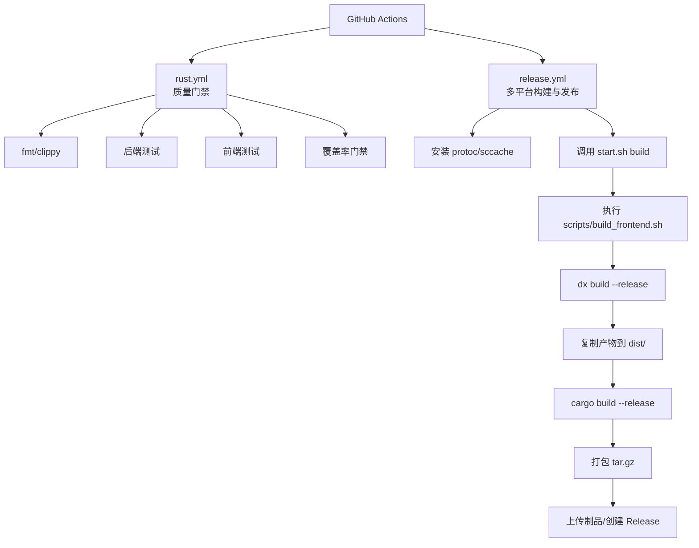
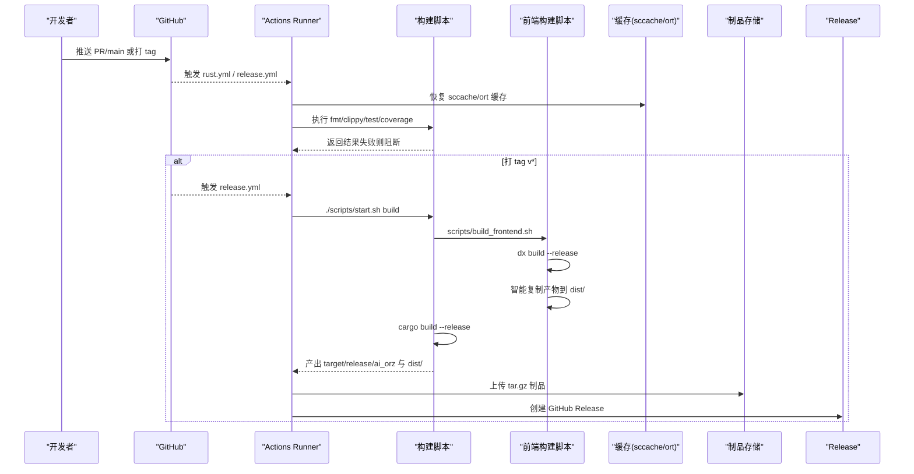
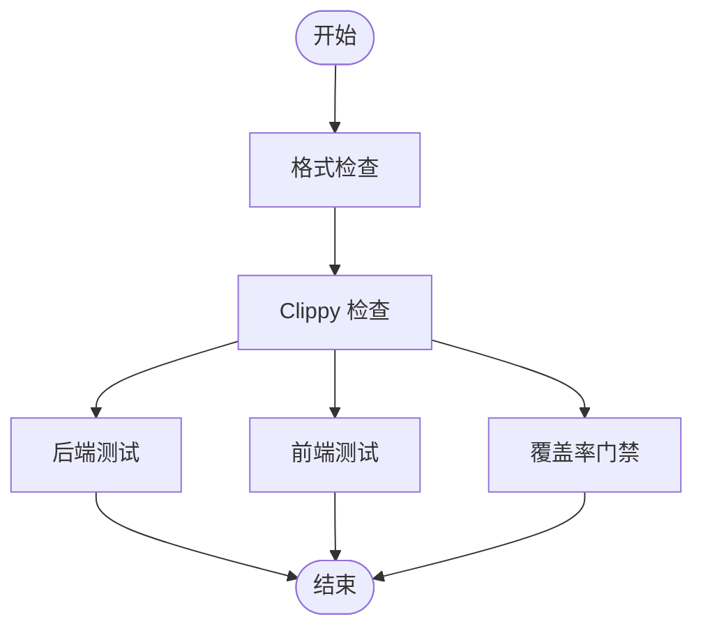
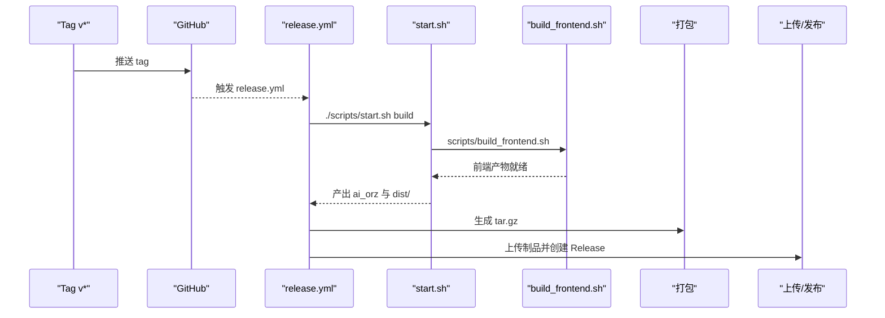
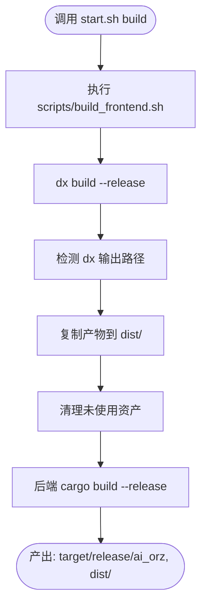
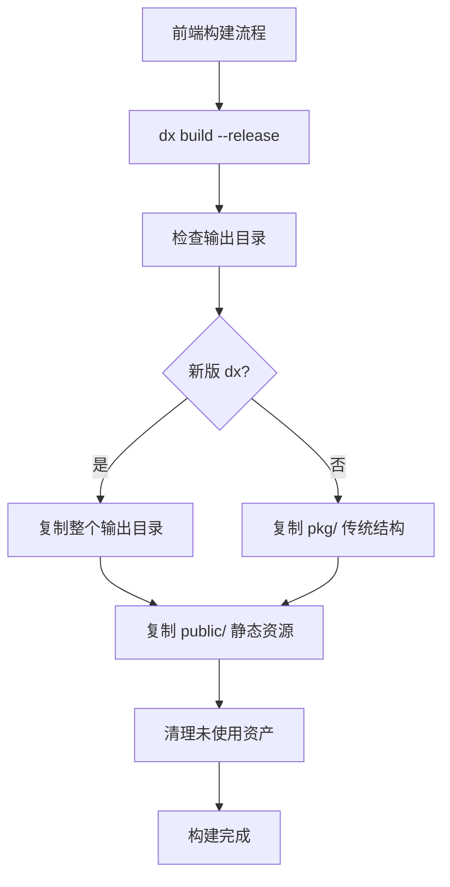
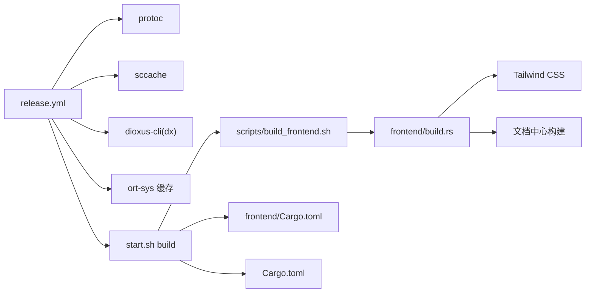

# 持续集成与发布工作流

<cite>
**本文引用的文件**
- [release.yml](.github/workflows/release.yml)
- [rust.yml](.github/workflows/rust.yml)
- [start.sh](scripts/start.sh)
- [build.sh](scripts/build.sh)
- [scripts/build_frontend.sh](scripts/build_frontend.sh)
- [frontend/build.rs](frontend/build.rs)
- [Cargo.toml](Cargo.toml)
- [frontend/Cargo.toml](frontend/Cargo.toml)
- [common/Cargo.toml](common/Cargo.toml)
- [rust-toolchain.toml](rust-toolchain.toml)
- [frontend/Dioxus.toml](frontend/Dioxus.toml)

### 本文关联的三类文档（四类互引闭环）

**① 设计文档（Design）**：
- [测试工程指南](docs/archive/design-archive/testing_guidelines.md) — 测试分层策略、覆盖率门槛与 CI 质量门禁规范

**② 落地计划（Plan）**：
- [Agent管理集成测试](docs/archive/plan-archive/Agent管理集成测试.md) — Agent 管理域全链路集成测试落地点；集成测试 19 targets 通过 CI 闸门验证

**【Batch10 追加互引】**
#### ① Design 决策快照（Batch10 追加）
- [browser_e2e_test_design.md](docs/archive/design-archive/browser_e2e_test_design.md) — E2E Playbook 双模式；CI 阶段 4（仅本地/手动触发）执行 Playwright E2E；data-testid 选择器保证 CI 稳定
- [seed-config-migration.md](docs/archive/design-archive/seed-config-migration.md) — 两阶段初始化顺序（init_all/init_base_data/aop init）；CI 集成测试阶段必须严格对齐真实启动顺序
#### ④ RAG 原子知识卡（Batch10 追加）
- [Playwright Browser E2E 端到端测试：dioxus-playwright Fixture + 本地独立启动 + 登录鉴权流程 + 3 大类页面覆盖](docs/wiki/knowledge/zh/Playwright%20Browser%20E2E%20端到端测试：dioxus-playwright%20Fixture%20+%20本地独立启动%20+%20登录鉴权流程%20+%203%20大类页面覆盖/Playwright%20Browser%20E2E%20端到端测试：dioxus-playwright%20Fixture%20+%20本地独立启动%20+%20登录鉴权流程%20+%203%20大类页面覆盖.md) — §红线 6 E2E 为 CI 阶段 4 仅本地/手动触发；§红线 4 登录 Fixture 统一；§红线 3 本地独立启动禁止 E2E_PORT=3000
- [种子配置与系统两阶段初始化：5 套 TEMPLATE_SKILL 编译期嵌入 + seed diff 增量导入 + 两阶段 init aop 严格分离 + init_all_base_data 域派发](docs/wiki/knowledge/zh/种子配置与系统两阶段初始化：5%20套%20TEMPLATE_SKILL%20编译期嵌入%20+%20seed%20diff%20增量导入%20+%20两阶段%20init%20aop%20严格分离%20+%20init_all_base_data%20域派发/种子配置与系统两阶段初始化：5%20套%20TEMPLATE_SKILL%20编译期嵌入%20+%20seed%20diff%20增量导入%20+%20两阶段%20init%20aop%20严格分离%20+%20init_all_base_data%20域派发.md) — §红线 1 两阶段 init/aop 严格分离；§红线 8 Consumer::init 只注册订阅者不许写 DB；CI 启动顺序对齐

**④ RAG 原子知识卡**：
- [测试与质量工程 RAG 卡](docs/wiki/knowledge/zh/%E6%B5%8B%E8%AF%95%E4%B8%8E%E8%B4%A8%E9%87%8F%E5%B7%A5%E7%A8%8B%EF%BC%9A1124%E6%B5%8B%E8%AF%95100%%E9%80%9A%E8%BF%87%20+%20984%E5%90%8E%E7%AB%AF82%E5%89%8D%E7%AB%AF%20+%2087%E9%9B%86%E6%88%90%E6%B5%8B%E8%AF%9519targets%20+%20cargo-llvm-cov%2038%25/45%25%E9%97%A8%E6%A7%9B%20+%20clippy%E9%9B%B6%E5%AE%B9%E5%BF%8D+Playwright%20E2E/%E6%B5%8B%E8%AF%95%E4%B8%8E%E8%B4%A8%E9%87%8F%E5%B7%A5%E7%A8%8B%EF%BC%9A1124%E6%B5%8B%E8%AF%95100%%E9%80%9A%E8%BF%87%20+%20984%E5%90%8E%E7%AB%AF82%E5%89%8D%E7%AB%AF%20+%2087%E9%9B%86%E6%88%90%E6%B5%8B%E8%AF%9519targets%20+%20cargo-llvm-cov%2038%25/45%25%E9%97%A8%E6%A7%9B%20+%20clippy%E9%9B%B6%E5%AE%B9%E5%BF%8D+Playwright%20E2E.md) — 1124 测试全通过 + 覆盖率 38%/45% + clippy 零容忍速查

**【本次 2026-08-16 增量追加互引】**
#### ④ RAG 原子知识卡（本次追加 T6 文档门禁 + T8 scripts/Makefile 归置）：
- [DocLinkClassifier 通用分类器 + docs_lint 二进制门禁 + docs_migrate 迁移脚本工具链](docs/wiki/knowledge/zh/DocLinkClassifier 通用分类器 + docs_lint 二进制门禁 + docs_migrate 迁移脚本工具链/DocLinkClassifier 通用分类器 + docs_lint 二进制门禁 + docs_migrate 迁移脚本工具链.md) — §红线 1 docs_lint 三规则 0 容忍；§红线 3 CI 中 docs_lint 非零 exit_code 必须 fail gate
- [scripts 归置 + Makefile 统一入口 + 60+ 引用全量修正](docs/wiki/knowledge/zh/scripts 归置 + Makefile 统一入口 + 60+ 引用全量修正/scripts 归置 + Makefile 统一入口 + 60+ 引用全量修正.md) — §红线 1 禁止手工拼 scripts/ 路径；§红线 5 CI workflow 只调 make target，不允许 workflow 内写长 shell 命令
#### ① 设计文档（Design，本次追加占位）：
- docs/archive/design-archive/doc_link_classifier_and_quality_gates.md（占位：待 ai-orz-doc-maintainer 落地后回填真实路径）
- docs/archive/design-archive/build_and_deployment_workflow_design.md（占位：待 ai-orz-doc-maintainer 落地后回填真实路径）
#### ② 落地计划（Plan，本次追加占位）：
- docs/archive/plan-archive/scripts_reorg_makefile_unified_entry_and_60_plus_fixes.md（占位：待 ai-orz-doc-maintainer 落地后回填真实路径）
</cite>

## 更新摘要
**变更内容**
- 新增独立的 `scripts/build_frontend.sh` 前端构建脚本，实现构建逻辑解耦和复用
- 简化 `start.sh` 构建流程，将前端构建逻辑委托给专用脚本
- 改进 CI/CD 工作流程，支持更稳定的前端构建产物处理
- 增强构建系统的可维护性和可扩展性
**2026-08-16 增量更新**：追加 T6（DocLinkClassifier + docs_lint 二进制门禁 + docs_migrate 工具链）与 T8（scripts/ 归置 + Makefile 统一入口）2 张 RAG 卡互引；cite 区补 2 Design + 1 Plan 规范占位；§5 CI 工作流章节来源 rust.yml/docs.yml 行号降级（因新增 ci-docs-lint job 与 docs_migrate step 导致行号漂移，优先降级为无行号范围引用）。

## 目录
1. [简介](#简介)
2. [项目结构](#项目结构)
3. [核心组件](#核心组件)
4. [架构总览](#架构总览)
5. [详细组件分析](#详细组件分析)
6. [依赖关系分析](#依赖关系分析)
7. [性能与缓存优化](#性能与缓存优化)
8. [故障排查指南](#故障排查指南)
9. [结论](#结论)

## 简介
本仓库采用 GitHub Actions 实现"开发质量门禁 + 多平台发布"的持续集成与发布流水线。整体分为两条主线：
- 质量门禁（PR/合并到 main）：格式检查、Clippy 零警告、后端与前端并行测试、覆盖率门禁（main 更严格，PR 略宽松）。
- 发布构建（打 tag v* 或手动触发）：按目标平台原生编译后端二进制与前端静态资源，打包为可分发归档并创建 GitHub Release。

该流程强调：
- 使用 sccache 加速跨 job 的 Rust 编译缓存命中。
- 通过 SQLX_OFFLINE=true 使用离线查询缓存，避免 CI 网络波动。
- 前端基于 Dioxus 0.7 构建 WASM 产物，统一输出到 dist/ 目录，随后端二进制一起打包。
- 仅对 tag 触发时创建 GitHub Release，避免误发。
- **新增独立的前端构建脚本**，提供统一的构建逻辑和更好的错误处理。

## 项目结构
CI/CD 相关的关键位置与职责如下：
- .github/workflows/rust.yml：质量门禁（fmt、clippy、backend/frontend 测试、coverage）。
- .github/workflows/release.yml：多平台 release 构建与发布。
- start.sh / build.sh：统一构建入口，封装前后端构建与运行。
- **scripts/build_frontend.sh**：**新增**独立的前端构建脚本，处理 dx 构建产物复制和清理。
- Cargo 工作区与前端配置：定义 workspace、依赖、工具链与前端构建输出。

图表来源
- [rust.yml:1-285](.github/workflows/rust.yml#L1-L285)
- [release.yml:1-143](.github/workflows/release.yml#L1-L143)
- [start.sh:130-151](scripts/start.sh#L130-L151)
- [scripts/build_frontend.sh:1-78](scripts/build_frontend.sh#L1-L78)

章节来源
- [rust.yml:1-285](.github/workflows/rust.yml#L1-L285)
- [release.yml:1-143](.github/workflows/release.yml#L1-L143)

## 核心组件
- 质量门禁（rust.yml）
  - fmt：快速文本检查，失败不阻塞后续步骤。
  - clippy：全目标 Clippy 检查，-D warnings 零容忍。
  - backend：单元测试 + 集成测试（含 SQLite 集成测试）。
  - frontend：wasm32 目标 clippy + 前端测试。
  - coverage：使用 cargo-llvm-cov 收集覆盖率，设置 fail-under-lines 阈值（main 45%，PR 38%），报告写入日志与 Summary。
- 发布构建（release.yml）
  - 矩阵构建：Linux x86_64、macOS aarch64（不做交叉编译，避免重型依赖链问题）。
  - 环境准备：安装 protoc、sccache、dioxus-cli（dx）。
  - 构建：调用 start.sh build 完成前后端 release 构建；复制前端产物到 dist/。
  - 打包：生成 ai_orz-{tag}-{target}.tar.gz，内含 README.txt 说明。
  - 发布：仅在 refs/tags/v* 时下载制品并创建 GitHub Release。
- **新增前端构建脚本（scripts/build_frontend.sh）**
  - 独立的前端构建逻辑，支持多种 dx 输出路径检测。
  - 智能产物复制，兼容新旧版本的 dx 构建输出格式。
  - 自动清理未使用的构建产物，保持 dist/ 目录整洁。
  - 环境变量支持，如 BACKEND_API_URL 配置。

章节来源
- [rust.yml:17-175](.github/workflows/rust.yml#L17-L175)
- [rust.yml:176-285](.github/workflows/rust.yml#L176-L285)
- [release.yml:14-123](.github/workflows/release.yml#L14-L123)
- [release.yml:124-143](.github/workflows/release.yml#L124-L143)
- [scripts/build_frontend.sh:1-78](scripts/build_frontend.sh#L1-L78)

## 架构总览
下图展示了从代码提交到制品发布的端到端流程，包括并行化策略与关键依赖。

图表来源
- [rust.yml:17-175](.github/workflows/rust.yml#L17-L175)
- [release.yml:14-123](.github/workflows/release.yml#L14-L123)
- [release.yml:124-143](.github/workflows/release.yml#L124-L143)
- [start.sh:130-151](scripts/start.sh#L130-L151)
- [scripts/build_frontend.sh:1-78](scripts/build_frontend.sh#L1-L78)

## 详细组件分析

### 质量门禁流水线（rust.yml）
- 阶段划分
  - fmt：独立 job，秒级返回，纯文本检查。
  - lint：安装 protoc（lancedb 依赖）、sccache、clippy，-D warnings。
  - backend：在 lint 通过后并行执行，包含单元测试与集成测试。
  - frontend：在 lint 通过后并行执行，wasm32 clippy + 前端测试。
  - coverage：在 lint 通过后并行执行，使用 cargo-llvm-cov 收集覆盖率并校验阈值。
- 关键环境变量
  - SQLX_OFFLINE=true：使用离线查询缓存，避免 CI 网络影响。
  - CARGO_INCREMENTAL=0：与 sccache 配合，由 sccache 完全接管缓存。
- 覆盖率门禁
  - main push：fail-under-lines 45。
  - PR：fail-under-lines 38。
  - 报告：文本明细输出到日志，摘要写入 run Summary。

图表来源
- [rust.yml:17-175](.github/workflows/rust.yml#L17-L175)
- [rust.yml:176-285](.github/workflows/rust.yml#L176-L285)

章节来源
- [rust.yml:17-175](.github/workflows/rust.yml#L17-L175)
- [rust.yml:176-285](.github/workflows/rust.yml#L176-L285)

### 发布流水线（release.yml）
- 触发条件
  - push tags: v*
  - workflow_dispatch（手动触发）
- 构建矩阵
  - ubuntu-latest → x86_64-unknown-linux-gnu
  - macos-latest → aarch64-apple-darwin
- 环境与依赖
  - 安装 protoc（lancedb 构建需要 well-known types）。
  - 安装并启用 sccache，缓存键基于 Cargo.lock。
  - 安装 dioxus-cli（dx），版本与前端 dioxus 0.7.x 对齐。
- 构建与打包
  - 调用 start.sh build 完成前后端 release 构建。
  - 将前端产物复制到 dist/，后端二进制位于 target/release/ai_orz。
  - 打包为 ai_orz-{tag}-{target}.tar.gz，附带 README.txt。
- 发布
  - 仅在 refs/tags/v* 时创建 GitHub Release，自动生成分发说明。

图表来源
- [release.yml:1-143](.github/workflows/release.yml#L1-L143)
- [start.sh:130-151](scripts/start.sh#L130-L151)
- [scripts/build_frontend.sh:1-78](scripts/build_frontend.sh#L1-L78)

章节来源
- [release.yml:1-143](.github/workflows/release.yml#L1-L143)
- [start.sh:130-151](scripts/start.sh#L130-L151)

### 构建脚本（start.sh / build.sh / scripts/build_frontend.sh）
- start.sh 提供统一入口：dev/prod/build/backend/frontend/help。
- build 模式：
  - **前端**：**调用 scripts/build_frontend.sh** 进行构建，实现逻辑解耦。
  - **后端**：cargo build --release，产物位于 target/release/ai_orz。
- prod 模式：先构建再运行 release 二进制。
- build.sh：直接委托给 start.sh build。
- **scripts/build_frontend.sh（新增）**：
  - 独立的前端构建逻辑，支持多种 dx 输出路径检测。
  - 智能产物复制，兼容新旧版本的 dx 构建输出格式。
  - 自动清理未使用的构建产物，保持 dist/ 目录整洁。
  - 环境变量支持，如 BACKEND_API_URL 配置。

图表来源
- [start.sh:130-151](scripts/start.sh#L130-L151)
- [build.sh:1-10](scripts/build.sh#L1-L10)
- [scripts/build_frontend.sh:1-78](scripts/build_frontend.sh#L1-L78)

章节来源
- [start.sh:130-151](scripts/start.sh#L130-L151)
- [build.sh:1-10](scripts/build.sh#L1-L10)
- [scripts/build_frontend.sh:1-78](scripts/build_frontend.sh#L1-L78)

### 前端构建系统增强
- **独立构建脚本**：`scripts/build_frontend.sh` 提供专门的前端构建逻辑。
- **智能路径检测**：支持多种 dx 输出目录结构，兼容不同版本的构建产物。
- **产物清理机制**：自动清理未被 index.html 和 JS 引用的旧资产文件。
- **Tailwind CSS 集成**：通过 `frontend/build.rs` 在构建时自动编译样式。
- **文档中心构建**：自动复制 docs/ 目录内容到 public/docs/，生成导航索引。

图表来源
- [scripts/build_frontend.sh:22-77](scripts/build_frontend.sh#L22-L77)
- [frontend/build.rs:235-309](frontend/build.rs#L235-L309)

章节来源
- [scripts/build_frontend.sh:1-78](scripts/build_frontend.sh#L1-L78)
- [frontend/build.rs:1-309](frontend/build.rs#L1-L309)

### 工作区与工具链配置
- 工作区：Cargo.toml 定义 workspace members（根 crate、frontend、common、ai-orz-macros）。
- 工具链：rust-toolchain.toml 固定 stable 通道，并包含 rustfmt、clippy 以及 wasm32-unknown-unknown 目标。
- 前端配置：frontend/Dioxus.toml 指定输出目录为 dist，WASM 优化等级 level=4。
- 公共 crate：common/Cargo.toml 暴露可选特性（sqlx、axum-integration、jwt-integration 等），供前后端按需启用。

章节来源
- [Cargo.toml:1-8](Cargo.toml#L1-L8)
- [rust-toolchain.toml:1-5](rust-toolchain.toml#L1-L5)
- [frontend/Dioxus.toml:1-18](frontend/Dioxus.toml#L1-L18)
- [common/Cargo.toml:1-34](common/Cargo.toml#L1-L34)

## 依赖关系分析
- 外部依赖
  - lancedb：需要 protoc 以编译 lance-encoding（well-known types）。
  - ort-sys：预编译二进制缓存路径 ~/.cache/ort，显著缩短构建时间。
  - dioxus-cli（dx）：用于前端构建，需与前端 dioxus 版本匹配。
- 内部依赖
  - common：前后端共享 DTO、错误类型与枚举，减少重复定义。
  - ai-orz-macros：日志与统计事件宏，被 common 与后端引用。
- 构建产物
  - 后端：target/release/ai_orz。
  - 前端：dist/（含 index.html 与 pkg/*.wasm/*.js）。
- **新增依赖**：
  - **scripts/build_frontend.sh**：作为独立的前端构建模块，被 start.sh 和 CI 共同调用。

图表来源
- [release.yml:30-81](.github/workflows/release.yml#L30-L81)
- [scripts/build_frontend.sh:1-78](scripts/build_frontend.sh#L1-L78)
- [frontend/build.rs:235-309](frontend/build.rs#L235-L309)
- [frontend/Cargo.toml:1-27](frontend/Cargo.toml#L1-L27)
- [Cargo.toml:1-152](Cargo.toml#L1-L152)

章节来源
- [release.yml:30-81](.github/workflows/release.yml#L30-L81)
- [scripts/build_frontend.sh:1-78](scripts/build_frontend.sh#L1-L78)
- [frontend/build.rs:1-309](frontend/build.rs#L1-L309)
- [Cargo.toml:1-152](Cargo.toml#L1-L152)
- [frontend/Cargo.toml:1-27](frontend/Cargo.toml#L1-L27)

## 性能与缓存优化
- sccache 缓存
  - 所有 job 共享同一缓存键（基于 Cargo.lock），跨 job 复用依赖编译产物。
  - 关闭增量编译（CARGO_INCREMENTAL=0），让 sccache 完全接管缓存。
- ort-sys 预编译二进制缓存
  - 缓存路径 ~/.cache/ort，按 runner.os 与 Cargo.lock 哈希区分。
- SQLX 离线查询缓存
  - SQLX_OFFLINE=true，避免 CI 网络访问数据库 schema，提升稳定性与速度。
- 前端构建优化
  - dx build --release 使用 wasm-opt level=4，平衡体积与性能。
  - 产物统一复制到 dist/，便于打包与部署。
  - **新增智能资产清理**：自动移除未使用的构建产物，减少包体积。
- **构建脚本优化**：
  - **独立前端构建脚本**：提高构建逻辑的可维护性和复用性。
  - **多路径兼容性**：支持不同版本的 dx 输出结构，降低升级成本。

章节来源
- [rust.yml:42-74](.github/workflows/rust.yml#L42-L74)
- [rust.yml:98-129](.github/workflows/rust.yml#L98-L129)
- [rust.yml:195-223](.github/workflows/rust.yml#L195-L223)
- [release.yml:40-81](.github/workflows/release.yml#L40-L81)
- [scripts/build_frontend.sh:61-77](scripts/build_frontend.sh#L61-L77)
- [frontend/Dioxus.toml:5-6](frontend/Dioxus.toml#L5-L6)

## 故障排查指南
- 常见构建失败原因
  - 缺少 protoc：lancedb 构建需要 well-known types，需在 Linux/macOS 分别安装 protobuf-compiler/libprotobuf-dev 或 brew install protobuf。
  - ort-sys 缓存未命中：清理缓存或等待首次构建完成后再次尝试。
  - dioxus-cli 版本不匹配：确保安装的 dx 与前端 dioxus 0.7.x 兼容。
  - 覆盖率门禁失败：根据日志定位未覆盖模块，提高测试覆盖至阈值以上（main 45%，PR 38%）。
  - **前端构建失败**：检查 dx 输出路径检测逻辑，确认构建产物位置。
- 调试建议
  - 查看 sccache 统计：sccache --show-stats。
  - 本地复现：使用 start.sh dev/build/prod 验证构建与运行。
  - 检查 SQLX 离线缓存：确认 .sqlx 目录存在且与当前数据库 schema 一致。
  - **前端构建调试**：单独运行 `./scripts/build_frontend.sh` 查看详细构建日志。
  - **产物检查**：确认 dist/ 目录包含正确的 index.html 和资源文件。

章节来源
- [rust.yml:37-40](.github/workflows/rust.yml#L37-L40)
- [release.yml:30-38](.github/workflows/release.yml#L30-L38)
- [release.yml:72-81](.github/workflows/release.yml#L72-L81)
- [rust.yml:239-256](.github/workflows/rust.yml#L239-L256)
- [scripts/build_frontend.sh:74-77](scripts/build_frontend.sh#L74-L77)

## 结论
本项目的 CI/CD 流水线通过"质量门禁 + 多平台发布"的双轨设计，实现了：
- 快速反馈：fmt/clippy 先行，测试与覆盖率并行，缩短反馈周期。
- 稳定构建：SQLX 离线缓存、sccache、ort-sys 预编译缓存，降低网络与编译不确定性。
- 安全发布：仅对 tag 触发 Release，避免误发；产物包含 README 与完整运行依赖。
- 可维护性：统一构建脚本与配置，简化开发与部署体验。
- **新增构建系统增强**：独立的前端构建脚本提高了构建逻辑的可维护性和复用性，支持更灵活的构建配置和更好的错误处理。

建议在后续迭代中继续：
- 保持覆盖率门槛逐步提升，确保核心路径覆盖充分。
- 关注依赖更新（如 lancedb、dioxus）带来的构建变化，及时适配 CI 环境。
- 扩展更多平台矩阵（如需）时，评估交叉编译成本与替代方案。
- **持续优化前端构建脚本**：根据 dx 版本演进调整产物处理逻辑，保持向后兼容性。
- **考虑引入构建缓存优化**：评估是否可以将前端构建产物纳入缓存策略，进一步提升 CI 速度。