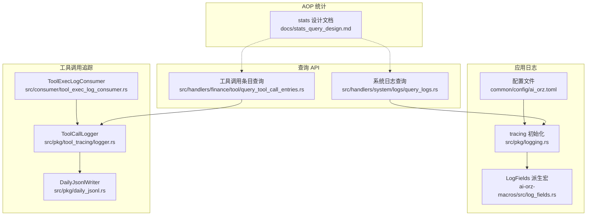
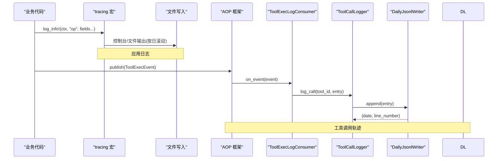
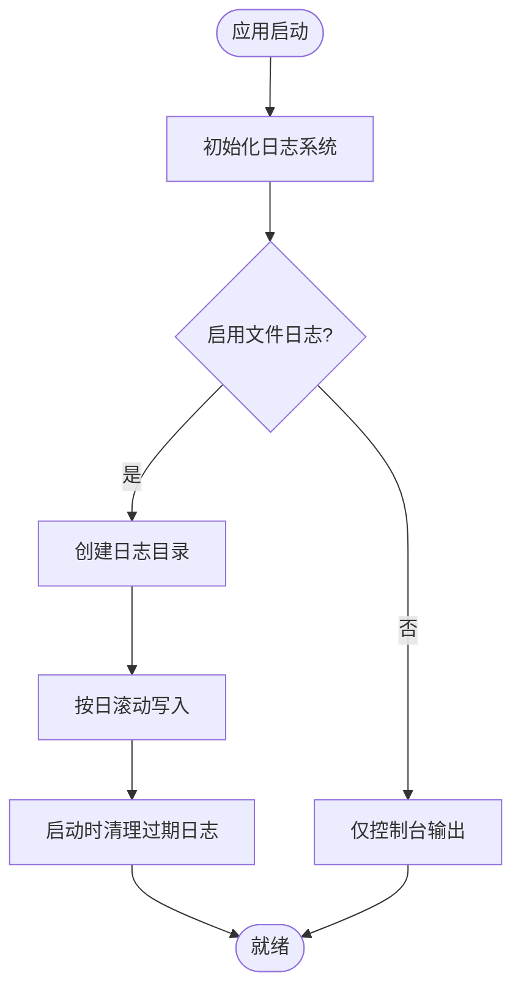
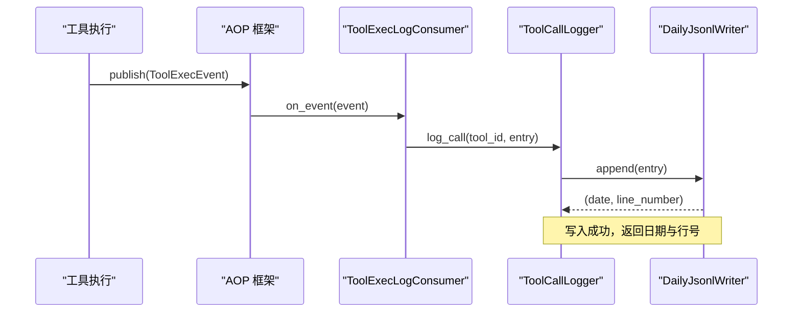
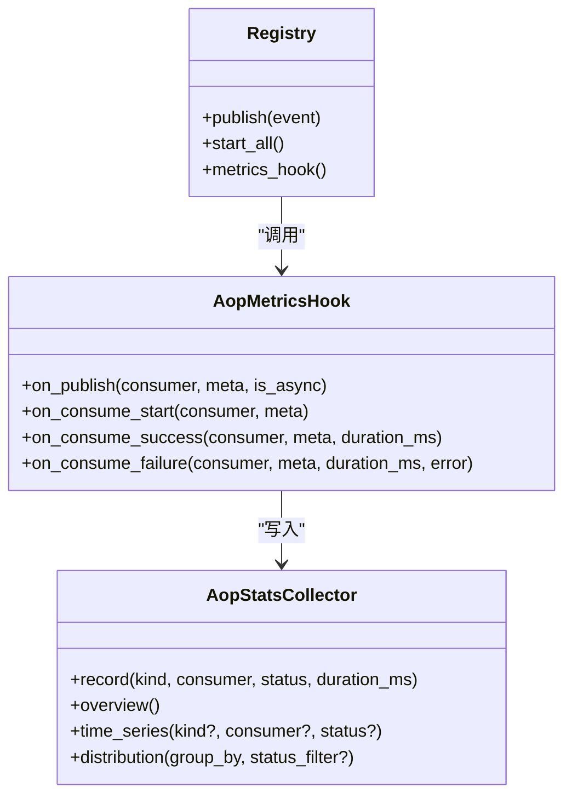
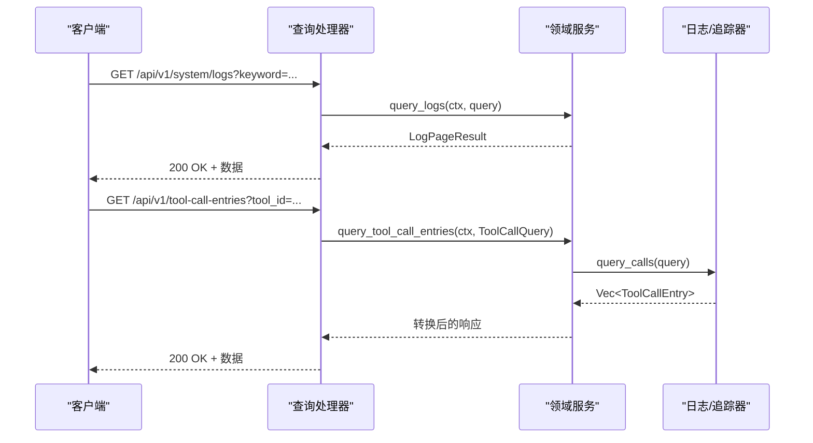
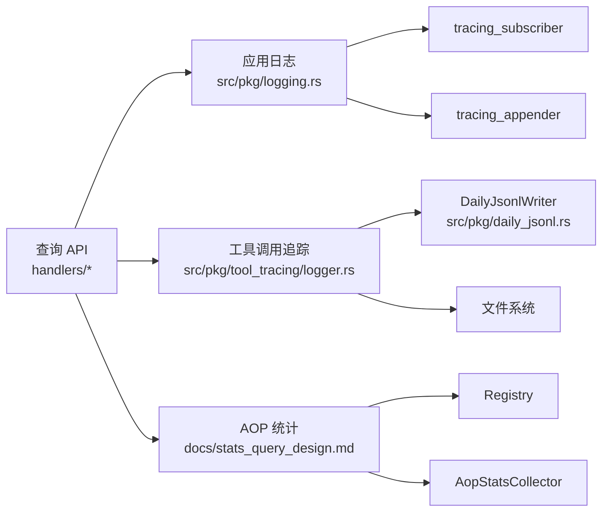

# 日志系统

<cite>
**本文引用的文件**
- [src/pkg/logging.rs](src/pkg/logging.rs)
- [ai-orz-macros/src/log_fields.rs](ai-orz-macros/src/log_fields.rs)
- [common/config/ai_orz.toml](common/config/ai_orz.toml)
- [src/pkg/tool_tracing/logger.rs](src/pkg/tool_tracing/logger.rs)
- [src/consumer/tool_exec_log_consumer.rs](src/consumer/tool_exec_log_consumer.rs)
- [src/pkg/daily_jsonl.rs](src/pkg/daily_jsonl.rs)
- [src/handlers/system/logs/query_logs.rs](src/handlers/system/logs/query_logs.rs)
- [src/handlers/finance/tool/query_tool_call_entries.rs](src/handlers/finance/tool/query_tool_call_entries.rs)
- [docs/logging_design.md](docs/logging_design.md)
- [docs/stats_query_design.md](docs/stats_query_design.md)
- [基于 tracing 的结构化日志系统（宏 + 文件滚动 + JSONL 查询）](docs/wiki/knowledge/zh/基于 tracing 的结构化日志系统（宏 + 文件滚动 + JSONL 查询）/基于 tracing 的结构化日志系统（宏 + 文件滚动 + JSONL 查询）.md)
</cite>

## 目录
1. [简介](#简介)
2. [项目结构](#项目结构)
3. [核心组件](#核心组件)
4. [架构总览](#架构总览)
5. [详细组件分析](#详细组件分析)
6. [依赖关系分析](#依赖关系分析)
7. [性能与成本优化](#性能与成本优化)
8. [故障排查指南](#故障排查指南)
9. [结论](#结论)
10. [附录：配置与查询示例](#附录：配置与查询示例)

## 简介
本技术文档面向 AI Orz 的日志系统，覆盖结构化日志设计、日志级别管理、日志轮转与存储策略；深入说明工具调用追踪、性能指标收集、日志查询与分析能力；并提供配置选项、输出格式定制、日志聚合与监控集成的实践建议。同时给出日志查询 API、分析与排障的实际示例，以及性能优化和存储成本控制的最佳实践。

## 项目结构
日志系统由以下关键部分组成：
- 应用级日志：基于 tracing 的统一宏体系，支持控制台与按日滚动文件输出，JSON/文本格式可选，自动清理过期日志。
- 工具调用追踪：以每日 JSONL 文件持久化每次工具调用的输入输出与元数据，支持按多维度过滤查询。
- AOP 事件与统计：通过 AOP 框架在事件发布/消费生命周期埋点，内存收集器提供实时概览与时序分布，暴露系统接口供前端展示。
- 日志查询 API：提供系统日志与应用日志（工具调用）的 HTTP 查询入口，便于运维与开发定位问题。

**图表来源**
- [src/pkg/logging.rs:23-124](src/pkg/logging.rs#L23-L124)
- [ai-orz-macros/src/log_fields.rs:50-125](ai-orz-macros/src/log_fields.rs#L50-L125)
- [common/config/ai_orz.toml:24-29](common/config/ai_orz.toml#L24-L29)
- [src/pkg/daily_jsonl.rs:14-73](src/pkg/daily_jsonl.rs#L14-L73)
- [src/pkg/tool_tracing/logger.rs:33-140](src/pkg/tool_tracing/logger.rs#L33-L140)
- [src/consumer/tool_exec_log_consumer.rs:26-51](src/consumer/tool_exec_log_consumer.rs#L26-L51)
- [src/handlers/system/logs/query_logs.rs:13-28](src/handlers/system/logs/query_logs.rs#L13-L28)
- [src/handlers/finance/tool/query_tool_call_entries.rs:20-46](src/handlers/finance/tool/query_tool_call_entries.rs#L20-L46)

**章节来源**
- [src/pkg/logging.rs:23-124](src/pkg/logging.rs#L23-L124)
- [ai-orz-macros/src/log_fields.rs:50-125](ai-orz-macros/src/log_fields.rs#L50-L125)
- [common/config/ai_orz.toml:24-29](common/config/ai_orz.toml#L24-L29)
- [src/pkg/daily_jsonl.rs:14-73](src/pkg/daily_jsonl.rs#L14-L73)
- [src/pkg/tool_tracing/logger.rs:33-140](src/pkg/tool_tracing/logger.rs#L33-L140)
- [src/consumer/tool_exec_log_consumer.rs:26-51](src/consumer/tool_exec_log_consumer.rs#L26-L51)
- [src/handlers/system/logs/query_logs.rs:13-28](src/handlers/system/logs/query_logs.rs#L13-L28)
- [src/handlers/finance/tool/query_tool_call_entries.rs:20-46](src/handlers/finance/tool/query_tool_call_entries.rs#L20-L46)

## 核心组件
- 应用日志子系统
  - 统一宏封装：log_info!/log_warn!/log_error!/log_debug! 等，自动检测是否带上下文并创建 tracing span。
  - LogFields 派生：为 RequestContext 等结构体自动生成字段注入逻辑，确保 log_id、user_id、agent_id 等上下文字段自动写入 span。
  - 输出与轮转：支持控制台与文件双写；文件按日滚动；支持 JSON/文本格式；启动时清理过期日志。
- 工具调用追踪子系统
  - DailyJsonlWriter：按日期分区写入 JSONL，每行一条记录，返回行号以便精确定位。
  - ToolCallLogger：单例管理器，按 tool_id 组织 trace 目录，提供追加、读取、按条件查询能力。
  - ToolExecLogConsumer：订阅 AOP 事件 agent.tool.executed，将执行结果落盘到 JSONL。
- AOP 统计与监控
  - 事件生命周期埋点：publish/on_consume_start/on_consume_success/on_consume_failure 四个回调。
  - 内存收集器：维护总计数、滑动窗口时序（最近 60 分钟）、分布统计，提供 overview/time_series/distribution 快照。
  - 系统接口：暴露队列状态、事件列表、事件详情等查询端点。
- 日志查询 API
  - 系统日志查询：按关键字、log_id、级别、时间范围分页查询应用日志。
  - 工具调用条目查询：按 call_id、agent/project/task/tool、status、时间范围查询工具调用轨迹。

**章节来源**
- [docs/logging_design.md:9-41](docs/logging_design.md#L9-L41)
- [docs/logging_design.md:130-208](docs/logging_design.md#L130-L208)
- [src/pkg/logging.rs:23-124](src/pkg/logging.rs#L23-L124)
- [src/pkg/daily_jsonl.rs:14-73](src/pkg/daily_jsonl.rs#L14-L73)
- [src/pkg/tool_tracing/logger.rs:33-140](src/pkg/tool_tracing/logger.rs#L33-L140)
- [src/consumer/tool_exec_log_consumer.rs:26-51](src/consumer/tool_exec_log_consumer.rs#L26-L51)
- [docs/stats_query_design.md:396-465](docs/stats_query_design.md#L396-L465)
- [src/handlers/system/logs/query_logs.rs:13-28](src/handlers/system/logs/query_logs.rs#L13-L28)
- [src/handlers/finance/tool/query_tool_call_entries.rs:20-46](src/handlers/finance/tool/query_tool_call_entries.rs#L20-L46)

## 架构总览
日志系统采用“采集—落盘—查询”的分层架构：
- 采集层：应用日志通过 tracing 宏采集；工具调用通过 AOP 事件采集；AOP 统计通过 Hook 采集。
- 落盘层：应用日志按日滚动到文件；工具调用轨迹按 tool_id 分区并以 JSONL 形式按日归档；AOP 统计使用内存收集器。
- 查询层：HTTP 接口提供系统日志与工具调用轨迹的查询；AOP 统计提供队列与事件监控接口。

**图表来源**
- [src/pkg/logging.rs:23-124](src/pkg/logging.rs#L23-L124)
- [src/consumer/tool_exec_log_consumer.rs:26-51](src/consumer/tool_exec_log_consumer.rs#L26-L51)
- [src/pkg/tool_tracing/logger.rs:64-73](src/pkg/tool_tracing/logger.rs#L64-L73)
- [src/pkg/daily_jsonl.rs:54-73](src/pkg/daily_jsonl.rs#L54-L73)

## 详细组件分析

### 应用日志子系统
- 设计要点
  - 完全宏化：所有日志调用统一使用宏，零成本抽象，编译期展开。
  - 自动上下文检测：优先匹配无上下文模式，兜底匹配带上下文模式，避免误判。
  - 字段注入：通过 #[derive(LogFields)] 自动将标注字段注入 span，支持 String、Option<String> 等类型处理。
  - 输出与轮转：支持 JSON/文本格式；按日滚动；启动时清理过期日志；非阻塞写入保证性能。
- 关键流程
  - 初始化：根据配置决定是否启用文件日志、日志目录、保留天数。
  - 日志写入：tracing_subscriber 组合 filter_layer + console_layer + file_layer。
  - 清理策略：扫描日志目录，删除超过保留期的 ai_orz.log.* 文件。

**图表来源**
- [src/pkg/logging.rs:23-124](src/pkg/logging.rs#L23-L124)
- [src/pkg/logging.rs:126-158](src/pkg/logging.rs#L126-L158)

**章节来源**
- [docs/logging_design.md:9-41](docs/logging_design.md#L9-L41)
- [docs/logging_design.md:130-208](docs/logging_design.md#L130-L208)
- [src/pkg/logging.rs:23-124](src/pkg/logging.rs#L23-L124)
- [src/pkg/logging.rs:126-158](src/pkg/logging.rs#L126-L158)
- [ai-orz-macros/src/log_fields.rs:50-125](ai-orz-macros/src/log_fields.rs#L50-L125)

### 工具调用追踪子系统
- 设计要点
  - 每日 JSONL：每个工具调用写入 {base_data_path}/tools/{tool_id}/call_trace/{YYYYMMDD}.jsonl，每行一条完整记录。
  - 查询能力：支持按 call_id、agent/project/task/tool、status、时间范围过滤，默认限制最大查询条数。
  - 消费者模式：ToolExecLogConsumer 同步消费 AOP 事件，确保日志写入与统计记录一致。
- 关键流程
  - 写入：ToolCallLogger.writer_for_tool -> DailyJsonlWriter.append。
  - 查询：ToolCallLogger.query_calls -> 遍历 JSONL 文件 -> 过滤排序 -> 限制返回。
  - 消费者：订阅 agent.tool.executed -> 反序列化为 ToolExecEvent -> 写入 JSONL。

**图表来源**
- [src/consumer/tool_exec_log_consumer.rs:26-51](src/consumer/tool_exec_log_consumer.rs#L26-L51)
- [src/pkg/tool_tracing/logger.rs:64-73](src/pkg/tool_tracing/logger.rs#L64-L73)
- [src/pkg/daily_jsonl.rs:54-73](src/pkg/daily_jsonl.rs#L54-L73)

**章节来源**
- [src/pkg/tool_tracing/logger.rs:33-140](src/pkg/tool_tracing/logger.rs#L33-L140)
- [src/pkg/daily_jsonl.rs:14-73](src/pkg/daily_jsonl.rs#L14-L73)
- [src/consumer/tool_exec_log_consumer.rs:26-51](src/consumer/tool_exec_log_consumer.rs#L26-L51)

### AOP 统计与监控
- 设计要点
  - 生命周期埋点：在 publish、consume_start、consume_success、consume_failure 四个节点记录指标。
  - 内存收集器：维护总计数、滑动窗口时序（最近 60 分钟）、分布统计，重启即重置。
  - 系统接口：提供队列统计、事件列表、事件详情等查询端点。
- 关键流程
  - 埋点：Registry 在分发循环中调用 metrics_hook 的四个回调。
  - 收集：AopStatsHook 将回调转为 record(kind, consumer, status, duration_ms)。
  - 查询：SystemDomain 暴露 aop_stats() 获取 collector 快照。

**图表来源**
- [docs/superpowers/plans/2026-07-25-stats-charts-phase3.md:21-40](docs/superpowers/plans/2026-07-25-stats-charts-phase3.md#L21-L40)
- [docs/superpowers/plans/2026-07-25-stats-charts-phase3.md:215-337](docs/superpowers/plans/2026-07-25-stats-charts-phase3.md#L215-L337)
- [docs/superpowers/plans/2026-07-25-stats-charts-phase3.md:857-981](docs/superpowers/plans/2026-07-25-stats-charts-phase3.md#L857-L981)

**章节来源**
- [docs/stats_query_design.md:396-465](docs/stats_query_design.md#L396-L465)
- [docs/superpowers/plans/2026-07-25-stats-charts-phase3.md:21-40](docs/superpowers/plans/2026-07-25-stats-charts-phase3.md#L21-L40)
- [docs/superpowers/plans/2026-07-25-stats-charts-phase3.md:215-337](docs/superpowers/plans/2026-07-25-stats-charts-phase3.md#L215-L337)
- [docs/superpowers/plans/2026-07-25-stats-charts-phase3.md:857-981](docs/superpowers/plans/2026-07-25-stats-charts-phase3.md#L857-L981)

### 日志查询 API
- 系统日志查询
  - 路由：GET /api/v1/system/logs
  - 参数：keyword、log_id、level、start_time、end_time、page、page_size
  - 行为：调用 SystemDomain.log_query().query_logs(ctx, query) 返回分页结果。
- 工具调用条目查询
  - 路由：GET /api/v1/tool-call-entries
  - 参数：call_id、agent_id、project_id、task_id、tool_id、status、started_after、started_before、limit
  - 行为：调用 RuntimeDomain.tool_execution().query_tool_call_entries(...) 返回条目列表。

**图表来源**
- [src/handlers/system/logs/query_logs.rs:13-28](src/handlers/system/logs/query_logs.rs#L13-L28)
- [src/handlers/finance/tool/query_tool_call_entries.rs:20-46](src/handlers/finance/tool/query_tool_call_entries.rs#L20-L46)
- [src/pkg/tool_tracing/logger.rs:105-140](src/pkg/tool_tracing/logger.rs#L105-L140)

**章节来源**
- [src/handlers/system/logs/query_logs.rs:13-28](src/handlers/system/logs/query_logs.rs#L13-L28)
- [src/handlers/finance/tool/query_tool_call_entries.rs:20-46](src/handlers/finance/tool/query_tool_call_entries.rs#L20-L46)

## 依赖关系分析
- 应用日志子系统依赖 tracing_subscriber、tracing_appender、EnvFilter，实现控制台与文件双写。
- 工具调用追踪依赖 serde_json、chrono、fs/io，实现 JSONL 读写与日期分区。
- AOP 统计依赖 tokio::sync::RwLock、std::collections::HashMap，实现并发安全的内存收集。
- 查询 API 依赖 axum 路由与 DTO 定义，调用领域服务与底层日志/追踪器。

**图表来源**
- [src/pkg/logging.rs:23-124](src/pkg/logging.rs#L23-L124)
- [src/pkg/tool_tracing/logger.rs:33-140](src/pkg/tool_tracing/logger.rs#L33-L140)
- [src/pkg/daily_jsonl.rs:14-73](src/pkg/daily_jsonl.rs#L14-L73)
- [docs/stats_query_design.md:396-465](docs/stats_query_design.md#L396-L465)

**章节来源**
- [src/pkg/logging.rs:23-124](src/pkg/logging.rs#L23-L124)
- [src/pkg/tool_tracing/logger.rs:33-140](src/pkg/tool_tracing/logger.rs#L33-L140)
- [src/pkg/daily_jsonl.rs:14-73](src/pkg/daily_jsonl.rs#L14-L73)
- [docs/stats_query_design.md:396-465](docs/stats_query_design.md#L396-L465)

## 性能与成本优化
- 日志级别管理
  - 通过环境变量或配置设置过滤级别，默认 INFO，生产环境可调整为 WARN/ERROR 降低开销。
- 输出格式选择
  - JSON 格式便于机器解析与聚合，但体积较大；文本格式更节省空间。
- 日志轮转与清理
  - 按日滚动避免单文件过大；启动时清理过期日志，控制磁盘占用。
- 工具调用追踪
  - 限制查询最大条数，防止大结果集拖慢接口；按 tool_id 分区减少扫描范围。
- AOP 统计
  - 内存收集器仅保留最近 60 分钟数据，重启即重置，避免长期累积。
- 存储成本控制
  - 合理设置日志保留天数；对高吞吐工具调用可考虑采样或降级策略。

[本节为通用指导，无需特定文件引用]

## 故障排查指南
- 应用日志无法写入
  - 检查日志目录是否存在与权限；确认 enable_file_log 配置正确。
  - 查看 EnvFilter 设置是否过滤了期望级别。
- 工具调用轨迹缺失
  - 确认 AOP 事件 agent.tool.executed 已发布；ToolExecLogConsumer 已注册。
  - 检查 ToolCallLogger 初始化与 base_data_path 配置。
- 查询接口超时
  - 检查 limit 参数是否过大；确认 tool_id 是否正确；避免全量扫描。
- AOP 统计异常
  - 确认 metrics_hook 已注入；检查消费者名称与事件类型匹配。
  - 观察 overview 与 time_series 数据是否更新。

**章节来源**
- [src/pkg/logging.rs:23-124](src/pkg/logging.rs#L23-L124)
- [src/pkg/tool_tracing/logger.rs:105-140](src/pkg/tool_tracing/logger.rs#L105-L140)
- [src/consumer/tool_exec_log_consumer.rs:26-51](src/consumer/tool_exec_log_consumer.rs#L26-L51)
- [docs/stats_query_design.md:396-465](docs/stats_query_design.md#L396-L465)

## 结论
AI Orz 日志系统通过宏化日志、AOP 事件与 JSONL 追踪实现了高性能、可扩展的观测能力。结合按日轮转、清理策略与内存统计收集器，系统在功能性与成本之间取得平衡。提供的查询 API 与监控接口便于运维与开发快速定位问题。建议在生产环境中合理配置日志级别、输出格式与保留策略，并根据业务需求调整工具调用追踪粒度。

[本节为总结性内容，无需特定文件引用]

## 附录：配置与查询示例
- 日志配置选项
  - 启用文件日志：enable_file_log = true
  - 日志目录：log_subdir = "logs"
  - 保留天数：retention_days > 0（在初始化时清理）
- 输出格式定制
  - JSON 格式：logging.format = "json"
  - 文本格式：logging.format = "text"
- 日志聚合与监控集成
  - 通过 AOP 统计接口获取队列状态与事件详情。
  - 结合外部监控系统（如 Prometheus）采集 AOP 指标。
- 日志查询 API 示例
  - 系统日志查询：GET /api/v1/system/logs?keyword=error&level=ERROR&page=1&page_size=20
  - 工具调用条目查询：GET /api/v1/tool-call-entries?tool_id=xxx&status=success&limit=10
- 实际排障步骤
  - 使用系统日志查询定位错误堆栈。
  - 使用工具调用条目查询还原调用链与输入输出。
  - 使用 AOP 统计接口分析消费者延迟与失败率。

**章节来源**
- [common/config/ai_orz.toml:24-29](common/config/ai_orz.toml#L24-L29)
- [src/handlers/system/logs/query_logs.rs:13-28](src/handlers/system/logs/query_logs.rs#L13-L28)
- [src/handlers/finance/tool/query_tool_call_entries.rs:20-46](src/handlers/finance/tool/query_tool_call_entries.rs#L20-L46)
- [docs/stats_query_design.md:396-465](docs/stats_query_design.md#L396-L465)