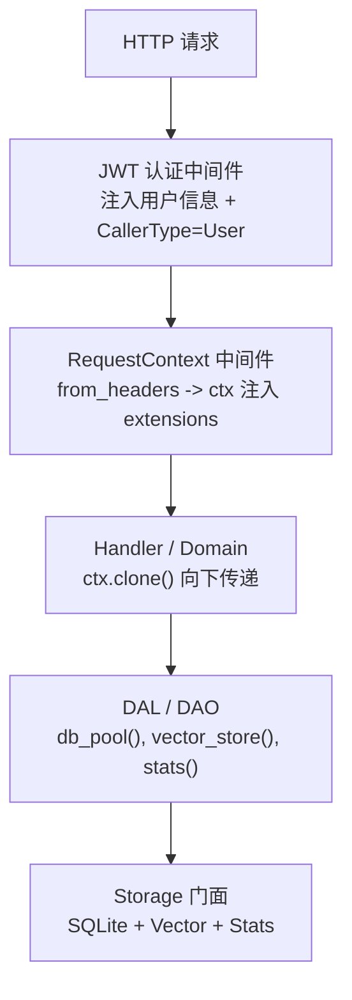
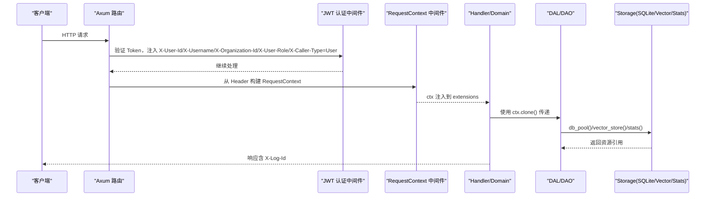
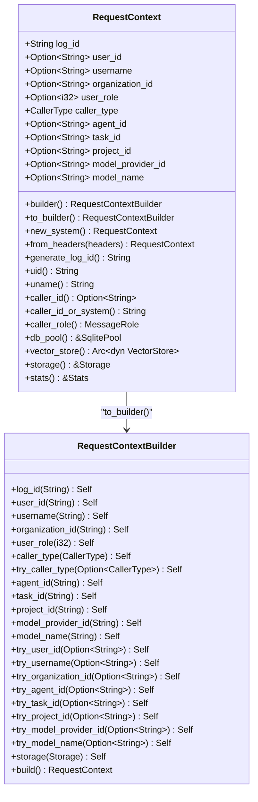
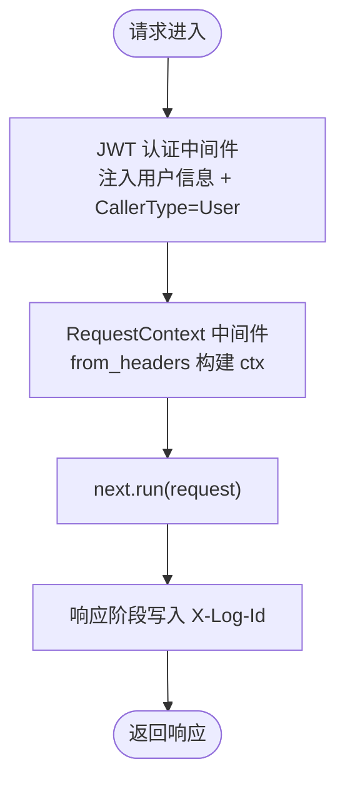
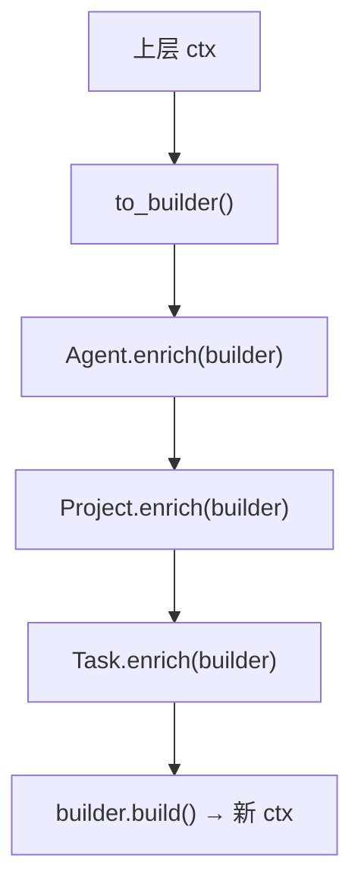
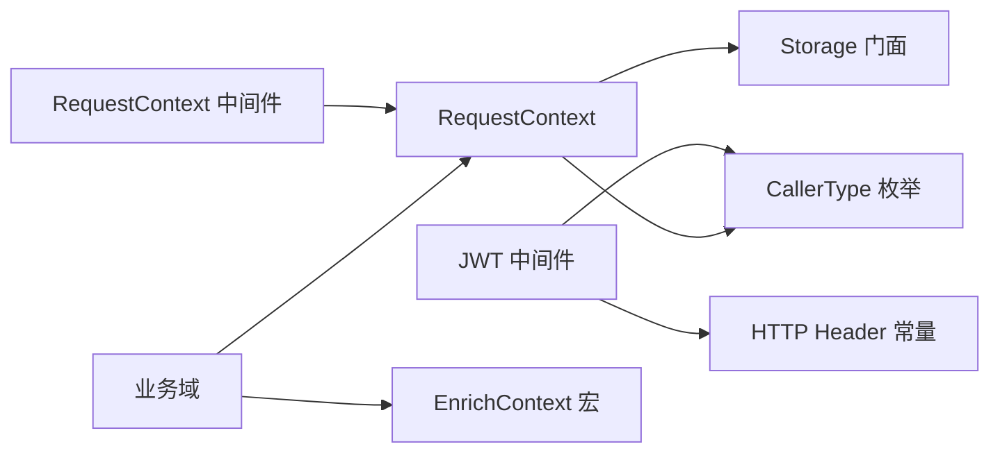

# 请求上下文

<cite>
**本文引用的文件**
- [request_context.rs](src/pkg/request_context.rs)
- [request_context_design.md](docs/request_context_design.md)
- [request_context_middleware.rs](src/middleware/request_context.rs)
- [jwt_auth.rs](src/middleware/jwt_auth.rs)
- [http_header.rs](common/src/constants/http_header.rs)
- [caller_type.rs](common/src/enums/caller_type.rs)
- [storage/mod.rs](src/pkg/storage/mod.rs)
- [router.rs](src/router.rs)
- [awakening.rs](src/service/domain/runtime/awakening.rs)
- [src/pkg/jwt.rs](src/pkg/jwt.rs)
- [src/middleware/federation_identity.rs](src/middleware/federation_identity.rs)
- [docs/plan/跨组织业务调用方案.md](docs/plan/跨组织业务调用方案.md)
- 【④ RAG 知识卡】[跨组织业务调用鉴权模型](docs/wiki/knowledge/zh/跨组织业务调用鉴权模型：dual-mode%20auth%20+%20federation_identity%20+%20delegation%20+%20audit%20+%20capabilities/跨组织业务调用鉴权模型：dual-mode%20auth%20+%20federation_identity%20+%20delegation%20+%20audit%20+%20capabilities.md)
- **2026-09-05 更新摘要**：RequestContext 新增 caller_organization_id + caller_peer_org_id 字段——联邦调用时由 request_context_middleware 从 federation_identity.peer_org_id 注入，供审计统计。JWT Claims 扩展 iss/aud。
</cite>

## 目录
1. [简介](#简介)
2. [项目结构](#项目结构)
3. [核心组件](#核心组件)
4. [架构总览](#架构总览)
5. [详细组件分析](#详细组件分析)
6. [依赖关系分析](#依赖关系分析)
7. [性能考量](#性能考量)
8. [故障排查指南](#故障排查指南)
9. [结论](#结论)
10. [附录](#附录)

## 简介
本技术文档围绕 AI Orz 的请求上下文系统，系统性阐述其设计理念与实现原理。重点覆盖：
- 用户信息传递、租户隔离（组织维度）
- 请求追踪（log_id）与跨层传播
- 调用方身份（CallerType）与审计、统计集成
- 中间件链中的上下文传播与异步环境下的上下文保持
- 上下文数据的生命周期管理、配置与数据绑定、访问模式
- 与其他系统的集成方式与扩展机制（EnrichContext、Storage 门面）

该上下文贯穿整个请求生命周期，采用“不可变优先、重建替代修改”的原则，通过 Builder 模式与 enrich_ctx! 宏在分层调用链中安全地向下扩散并逐步丰富。

## 项目结构
请求上下文相关代码主要分布在以下位置：
- pkg 层：RequestContext 定义、Builder、enrich_ctx! 宏、存储门面 Storage 的访问封装
- middleware 层：HTTP 中间件负责从请求头提取上下文并注入到 Axum 请求扩展
- common 层：HTTP Header 常量、CallerType 枚举等通用类型
- router 层：路由注册时挂载 request_context_middleware 与 jwt_auth_middleware
- service/domain：业务域在调用链中通过 enrich_ctx! 将实体字段回填到上下文

图表来源
- [request_context_middleware.rs:20-40](src/middleware/request_context.rs#L20-L40)
- [jwt_auth.rs:36-86](src/middleware/jwt_auth.rs#L36-L86)
- [request_context.rs:295-356](src/pkg/request_context.rs#L295-L356)
- [storage/mod.rs:36-167](src/pkg/storage/mod.rs#L36-L167)

章节来源
- [request_context.rs:1-632](src/pkg/request_context.rs#L1-L632)
- [request_context_middleware.rs:1-41](src/middleware/request_context.rs#L1-L41)
- [jwt_auth.rs:1-156](src/middleware/jwt_auth.rs#L1-L156)
- [http_header.rs:1-20](common/src/constants/http_header.rs#L1-L20)
- [storage/mod.rs:1-200](src/pkg/storage/mod.rs#L1-L200)

## 核心组件
- RequestContext：不可变的请求上下文对象，承载追踪 ID、用户身份、组织维度、业务维度（Agent/Project/Task）、模型维度（ModelProvider/ModelName），以及统一存储门面（SQLite + Vector + Stats）。
- RequestContextBuilder：可变构建器，提供 set_* 与 try_* 方法，最终 build() 生成新的 RequestContext。
- enrich_ctx! 宏与 EnrichContext trait：实体到上下文的自动映射，支持多实体串联注入，遵循“越靠近数据层优先级越高”的树形扩散模型。
- 中间件链：jwt_auth_middleware 先注入用户信息与 CallerType；request_context_middleware 从 Header 构建 ctx 并注入到请求扩展，响应时将 log_id 写回响应头。
- Storage 门面：统一 SQLite 连接池、向量存储、Stats 统计模块的访问接口，支持多后端向量存储与全局单例初始化。

章节来源
- [request_context.rs:22-632](src/pkg/request_context.rs#L22-L632)
- [request_context_middleware.rs:20-40](src/middleware/request_context.rs#L20-L40)
- [jwt_auth.rs:56-86](src/middleware/jwt_auth.rs#L56-L86)
- [storage/mod.rs:36-167](src/pkg/storage/mod.rs#L36-L167)

## 架构总览
请求上下文在 HTTP 入口由中间件创建，随后沿调用链向下传递并在各层逐步丰富。异步场景（Consumer、Producer、AOP 调度）通过工厂方法或消息元数据重建上下文，确保全链路可追踪、可审计。

图表来源
- [jwt_auth.rs:56-86](src/middleware/jwt_auth.rs#L56-L86)
- [request_context_middleware.rs:20-40](src/middleware/request_context.rs#L20-L40)
- [request_context.rs:295-356](src/pkg/request_context.rs#L295-L356)
- [storage/mod.rs:135-167](src/pkg/storage/mod.rs#L135-L167)

## 详细组件分析

### RequestContext 与 Builder
- 设计原则：构建完成后不可变；任何变更通过 to_builder() 克隆后重建新实例。
- 字段分类：
  - 追踪标识：log_id（自动生成或来自 Header）
  - 调用方身份：caller_type（User/Agent/System），默认 User
  - 用户身份：user_id、username、user_role
  - 组织维度：organization_id（租户隔离）
  - 业务维度：agent_id、project_id、task_id
  - 模型维度：model_provider_id、model_name
  - 基础设施：storage（SQLite + Vector + Stats）
- Builder API：
  - set_* 直接设置值
  - try_* 条件覆盖（Some 时覆盖，None 时跳过）
  - build() 自动生成 log_id、默认 storage，并产出不可变 RequestContext
- 构造入口：
  - builder()：从零构建
  - to_builder()：基于现有上下文扩展
  - new_system()：系统触发场景（Cron/A2A/AOP）
  - from_headers(headers)：HTTP 入口解析 Header
  - from_storage(user_id, storage)：测试辅助

图表来源
- [request_context.rs:22-632](src/pkg/request_context.rs#L22-L632)

章节来源
- [request_context.rs:22-632](src/pkg/request_context.rs#L22-L632)

### 中间件链与上下文传播
- JWT 认证中间件：
  - 双模式认证（Cookie/Bearer）
  - 验证通过后注入 X-User-Id、X-Username、X-Organization-Id、X-User-Role、X-Caller-Type=User
- RequestContext 中间件：
  - 从 Header 构建 RequestContext（包含 log_id、用户信息、组织、角色、caller_type）
  - 将 ctx 插入请求扩展，供后续 Handler/Domain 获取
  - 响应阶段将 log_id 写回响应头，便于前端与日志系统串联

图表来源
- [jwt_auth.rs:56-86](src/middleware/jwt_auth.rs#L56-L86)
- [request_context_middleware.rs:20-40](src/middleware/request_context.rs#L20-L40)

章节来源
- [jwt_auth.rs:36-86](src/middleware/jwt_auth.rs#L36-L86)
- [request_context_middleware.rs:20-40](src/middleware/request_context.rs#L20-L40)
- [http_header.rs:1-20](common/src/constants/http_header.rs#L1-L20)

### 调用方身份（CallerType）与审计统计
- CallerType 枚举：User/Agent/System，数值与 MessageRole 对齐但语义不同
- 设置时机：
  - HTTP 入口：User（JWT 验证通过）
  - Consumer rebuild_context：根据 message.from_role() 推断
  - Producer/Cron/A2A callback：System
- 封装方法：
  - caller_id()：用于 stats operator_id（Agent→agent_id，User→user_id，System→None）
  - caller_id_or_system()：用于消息发送 from_id、审计字段 created_by/modified_by
  - caller_role()：映射为 MessageRole（用于消息 from_role）

章节来源
- [caller_type.rs:1-67](common/src/enums/caller_type.rs#L1-L67)
- [request_context.rs:436-466](src/pkg/request_context.rs#L436-L466)
- [request_context_design.md:252-345](docs/request_context_design.md#L252-L345)

### 树形扩散模型与 enrich_ctx! 宏
- 核心思想：调用链向下传递时越来越丰富，分支互不干扰，上层不受下层影响
- 优先级规则：Command 参数 > 当前层实体信息 > 上层 ctx（兜底）
- EnrichContext trait：实体声明如何注入上下文，字段映射集中在实体定义处
- enrich_ctx! 宏：依次调用多个实体的 enrich 方法，最后 build() 生成新 ctx
- 已实现实体：AgentPo、ProjectPo、TaskPo、ModelProviderPo、ArtifactPo、MessagePo（PO 优先，业务实体委托）

图表来源
- [request_context.rs:582-632](src/pkg/request_context.rs#L582-L632)
- [request_context_design.md:17-61](docs/request_context_design.md#L17-L61)

章节来源
- [request_context.rs:582-632](src/pkg/request_context.rs#L582-L632)
- [request_context_design.md:17-61](docs/request_context_design.md#L17-L61)

### 异步环境与上下文保持
- Consumer 场景：从消息元数据重建完整上下文，caller_type 根据 from_role 推断
- Producer/Cron/AOP 调度：使用 new_system() 创建 System 调用方上下文
- A2A 回调：显式设置 caller_type=System，避免被 JWT 中间件覆盖为 User
- 关键约束：enrich_ctx 链路不覆盖 caller_type，仅由入口设置

章节来源
- [request_context_design.md:198-249](docs/request_context_design.md#L198-L249)
- [request_context_design.md:220-231](docs/request_context_design.md#L220-L231)
- [request_context_design.md:483-509](docs/request_context_design.md#L483-L509)

### 存储门面与基础设施访问
- Storage 门面：统一 SQLite 连接池、向量存储、Stats 统计模块
- 向量存储后端：InMemory、HNSW、LanceDB、SqliteVss（按配置选择）
- Stats 统计：DuckDB 持久化，支持批量写入与全局单例初始化
- RequestContext 提供便捷访问：db_pool()、vector_store()、stats()、stats_opt()

章节来源
- [storage/mod.rs:36-167](src/pkg/storage/mod.rs#L36-L167)
- [request_context.rs:483-507](src/pkg/request_context.rs#L483-L507)

### 典型使用示例（路径引用）
- HTTP 入口构建上下文：[from_headers:295-356](src/pkg/request_context.rs#L295-L356)
- 业务层扩展上下文（查到实体后回填）：[awakening.rs 中使用 enrich_ctx!:389-412](src/service/domain/runtime/awakening.rs#L389-L412)
- Consumer 异步场景重建上下文：[rebuild_context 流程:198-218](docs/request_context_design.md#L198-L218)
- 系统触发场景：[new_system() 工厂方法:370-373](src/pkg/request_context.rs#L370-L373)

章节来源
- [request_context.rs:295-356](src/pkg/request_context.rs#L295-L356)
- [awakening.rs:389-412](src/service/domain/runtime/awakening.rs#L389-L412)
- [request_context_design.md:198-218](docs/request_context_design.md#L198-L218)
- [request_context.rs:370-373](src/pkg/request_context.rs#L370-L373)

## 依赖关系分析
- 中间件依赖：
  - jwt_auth_middleware 依赖 common::constants::http_header 与 common::enums::CallerType
  - request_context_middleware 依赖 RequestContext::from_headers 与 http_header
- RequestContext 依赖：
  - common::enums::CallerType、common::enums::MessageRole
  - pkg::storage::Storage（SQLite + Vector + Stats）
- 业务域依赖：
  - enrich_ctx! 宏与 EnrichContext trait，通过 PO 实现集中字段映射

图表来源
- [jwt_auth.rs:56-86](src/middleware/jwt_auth.rs#L56-L86)
- [request_context_middleware.rs:20-40](src/middleware/request_context.rs#L20-L40)
- [request_context.rs:295-356](src/pkg/request_context.rs#L295-L356)
- [storage/mod.rs:36-167](src/pkg/storage/mod.rs#L36-L167)

章节来源
- [jwt_auth.rs:56-86](src/middleware/jwt_auth.rs#L56-L86)
- [request_context_middleware.rs:20-40](src/middleware/request_context.rs#L20-L40)
- [request_context.rs:295-356](src/pkg/request_context.rs#L295-L356)
- [storage/mod.rs:36-167](src/pkg/storage/mod.rs#L36-L167)

## 性能考量
- 不可变上下文 + 浅拷贝：ctx.clone() 成本低，适合跨层传递
- Storage 门面使用 Arc 包装，零成本克隆
- 向量存储后端可选：InMemory（推荐，零系统依赖）、HNSW（高性能近似最近邻）、LanceDB（嵌入式向量数据库）、SqliteVss（需系统依赖）
- Stats 统计模块支持批量写入，减少 I/O 开销
- 中间件链尽量轻量：仅做 Header 解析与 ctx 注入，避免阻塞

章节来源
- [storage/mod.rs:78-102](src/pkg/storage/mod.rs#L78-L102)
- [request_context.rs:483-507](src/pkg/request_context.rs#L483-L507)

## 故障排查指南
- 未认证请求：
  - 浏览器请求返回 302 重定向到登录页
  - API 请求返回 401 JSON 错误
- 上下文缺失：
  - 检查 JWT 中间件是否正确注入用户信息与 CallerType
  - 确认 request_context_middleware 是否成功从 Header 构建 ctx
- 异步场景上下文丢失：
  - Consumer 重建上下文时确保 caller_type 正确设置
  - Producer/Cron/AOP 调度使用 new_system() 创建 System 上下文
- 存储初始化失败：
  - 检查 Storage::new() 是否成功初始化 SQLite、向量存储、Stats
  - 确认迁移脚本执行成功

章节来源
- [jwt_auth.rs:140-156](src/middleware/jwt_auth.rs#L140-L156)
- [request_context_middleware.rs:20-40](src/middleware/request_context.rs#L20-L40)
- [storage/mod.rs:56-122](src/pkg/storage/mod.rs#L56-L122)

## 结论
AI Orz 的请求上下文系统通过不可变设计、Builder 模式与 enrich_ctx! 宏，实现了安全、可扩展的跨层上下文传播。结合中间件链与存储门面，系统在用户身份传递、租户隔离、请求追踪、调用方身份与审计统计等方面提供了完善的支持。异步环境下通过工厂方法与消息元数据重建上下文，确保全链路可追踪、可审计。未来可根据需要扩展更多实体到 EnrichContext 实现，进一步简化上下文补充逻辑。

## 附录
- 配置项：
  - 向量存储后端选择：InMemory/HNSW/LanceDB/SqliteVss
  - Stats 统计模块批量大小与数据库路径
- 最佳实践：
  - 始终使用 ctx.clone() 传递上下文，避免共享可变状态
  - 在业务层通过 enrich_ctx! 集中字段映射，减少重复代码
  - 异步场景显式设置 caller_type，确保审计与统计准确

章节来源
- [storage/mod.rs:78-102](src/pkg/storage/mod.rs#L78-L102)
- [request_context.rs:582-632](src/pkg/request_context.rs#L582-L632)
- [request_context_design.md:417-425](docs/request_context_design.md#L417-L425)