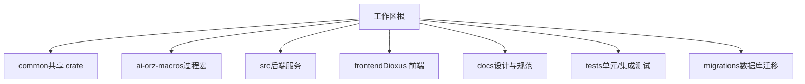
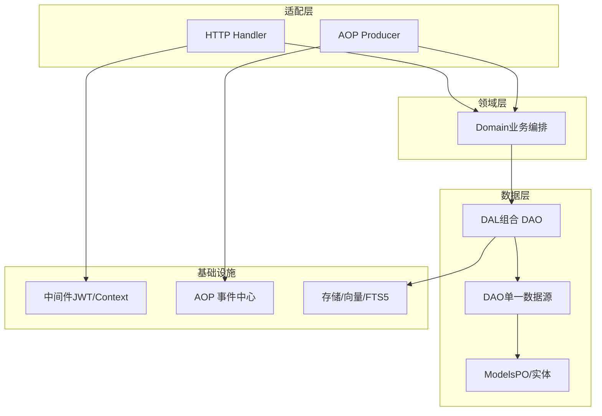
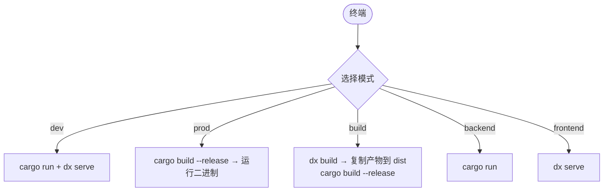
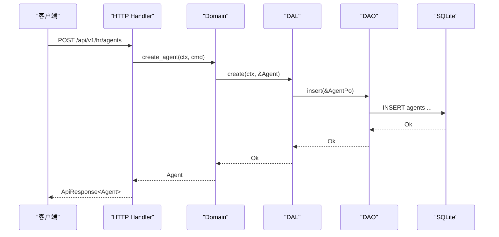
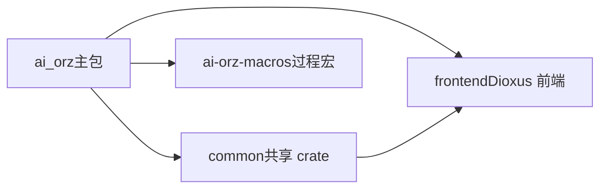

# 开发指南

<cite>
**本文引用的文件**
- [Cargo.toml](Cargo.toml)
- [rust-toolchain.toml](rust-toolchain.toml)
- [start.sh](scripts/start.sh)
- [build.sh](scripts/build.sh)
- [common/Cargo.toml](common/Cargo.toml)
- [frontend/Cargo.toml](frontend/Cargo.toml)
- [ai-orz-macros/Cargo.toml](ai-orz-macros/Cargo.toml)
- [AGENTS.md](AGENTS.md)
- [docs/ARCHITECTURE.md](docs/ARCHITECTURE.md)
- [docs/CODE_WIKI.md](docs/CODE_WIKI.md)
- [docs/testing_guidelines.md](docs/testing_guidelines.md)
- [common/config/ai_orz.toml](common/config/ai_orz.toml)
- [src/main.rs](src/main.rs)

### 本文关联的三类文档（四类互引闭环）

**① 设计文档（Design）**：
- [测试工程指南](docs/design/testing_guidelines.md) — 测试分层策略、覆盖率门槛与 CI 质量门禁规范

**② 落地计划（Plan）**：
- [Agent管理集成测试](docs/plan/Agent管理集成测试.md) — Agent 管理域全链路集成测试落地点

**④ RAG 原子知识卡**：
- [测试与质量工程 RAG 卡](docs/wiki/knowledge/zh/%E6%B5%8B%E8%AF%95%E4%B8%8E%E8%B4%A8%E9%87%8F%E5%B7%A5%E7%A8%8B%EF%BC%9A1124%E6%B5%8B%E8%AF%95100%%E9%80%9A%E8%BF%87%20+%20984%E5%90%8E%E7%AB%AF82%E5%89%8D%E7%AB%AF%20+%2087%E9%9B%86%E6%88%90%E6%B5%8B%E8%AF%9519targets%20+%20cargo-llvm-cov%2038%25/45%25%E9%97%A8%E6%A7%9B%20+%20clippy%E9%9B%B6%E5%AE%B9%E5%BF%8D+Playwright%20E2E/%E6%B5%8B%E8%AF%95%E4%B8%8E%E8%B4%A8%E9%87%8F%E5%B7%A5%E7%A8%8B%EF%BC%9A1124%E6%B5%8B%E8%AF%95100%%E9%80%9A%E8%BF%87%20+%20984%E5%90%8E%E7%AB%AF82%E5%89%8D%E7%AB%AF%20+%2087%E9%9B%86%E6%88%90%E6%B5%8B%E8%AF%9519targets%20+%20cargo-llvm-cov%2038%25/45%25%E9%97%A8%E6%A7%9B%20+%20clippy%E9%9B%B6%E5%AE%B9%E5%BF%8D+Playwright%20E2E.md) — 1124 测试全通过 + 覆盖率 38%/45% + clippy 零容忍速查
- [SQLite + SQLx 0.8 存储工程规范 RAG 卡](docs/wiki/knowledge/zh/SQLite%20+%20SQLx%200.8%20%E5%AD%98%E5%82%A8%E5%B7%A5%E7%A8%8B%E8%A7%84%E8%8C%83%EF%BC%9ASTRICT%20%E8%A1%A8%E6%A8%A1%E5%BC%8F%20+%20FTS5%20%E5%85%A8%E6%96%87%E6%A3%80%E7%B4%A2%20+%20%E6%9E%9A%E4%B8%BE%20i32%20%E7%B1%BB%E5%9E%8B%E5%AE%89%E5%85%A8%20+%20.sqlx%20%E7%A6%BB%E7%BA%BF%E6%9E%84%E5%BB%BA%20+%20sqlx%3A%3Atest%20%E9%9A%94%E7%A6%BB/SQLite%20+%20SQLx%200.8%20%E5%AD%98%E5%82%A8%E5%B7%A5%E7%A8%8B%E8%A7%84%E8%8C%83%EF%BC%9ASTRICT%20%E8%A1%A8%E6%A8%A1%E5%BC%8F%20+%20FTS5%20%E5%85%A8%E6%96%87%E6%A3%80%E7%B4%A2%20+%20%E6%9E%9A%E4%B8%BE%20i32%20%E7%B1%BB%E5%9E%8B%E5%AE%89%E5%85%A8%20+%20.sqlx%20%E7%A6%BB%E7%BA%BF%E6%9E%84%E5%BB%BA%20+%20sqlx%3A%3Atest%20%E9%9A%94%E7%A6%BB.md) — 新增 DAO 的 8 步 SOP：STRICT 建表 + 枚举五件套（repr(i32)+sqlx::Type+From<i64>+match+sqlx as）+ push_query_filters + count/list 双查询

**① 设计文档（Design）- Batch9 补充**：
- [SQLite + SQLx 0.8 存储工程规范](docs/design/sqlx_guide.md) — STRICT 表模式 + FTS5 全文检索 + 枚举五件套 + .sqlx 离线构建 + sqlx::test 隔离

**② 落地计划（Plan）- Batch9 补充**：
- [Query 接口分页与 List 接口简化重构](docs/plan/Query接口分页与List接口简化重构.md) — 5 实体 list/query 双接口统一模式 + COUNT 与 LIST push_query_filters 强制共享
</cite>

## 目录
1. [简介](#简介)
2. [项目结构](#项目结构)
3. [核心组件](#核心组件)
4. [架构总览](#架构总览)
5. [详细组件分析](#详细组件分析)
6. [依赖分析](#依赖分析)
7. [性能考虑](#性能考虑)
8. [故障排查指南](#故障排查指南)
9. [结论](#结论)
10. [附录](#附录)

## 简介
本指南面向新加入的开发者，提供 AI Orz 项目的完整开发入门与成长路径。内容涵盖：
- 开发环境搭建、依赖安装、工具链配置
- Rust 编码规范、代码组织结构、命名约定与设计模式
- 提交流程、代码审查标准、发布流程
- 最佳实践、常见陷阱与性能优化建议
- 测试体系与质量门槛（clippy、覆盖率）

AI Orz 是一个全栈 Rust 多 Agent 协作框架，后端采用 Axum + SQLite + SQLx，前端为 Dioxus WebAssembly，具备严格分层架构、类型安全、完善的测试与 CI 质量门禁。

**章节来源**
- [AGENTS.md:9-18](AGENTS.md#L9-L18)
- [docs/ARCHITECTURE.md:11-46](docs/ARCHITECTURE.md#L11-L46)

## 项目结构
仓库采用三级 Cargo workspace 组织：
- common：前后端共享的 DTO、枚举、错误类型等
- ai-orz-macros：自定义宏 crate（日志宏、统计事件宏）
- src：后端服务（handlers/service/pkg/middleware/consumer/producer/models）
- frontend：Dioxus 前端应用（Tailwind CSS v4 + DaisyUI v5）
- docs：设计文档、架构说明、测试规范等
- migrations：数据库迁移脚本
- tests：单元测试与集成测试

**图示来源**
- [docs/ARCHITECTURE.md:11-46](docs/ARCHITECTURE.md#L11-L46)
- [docs/CODE_WIKI.md:91-128](docs/CODE_WIKI.md#L91-L128)

**章节来源**
- [docs/ARCHITECTURE.md:11-46](docs/ARCHITECTURE.md#L11-L46)
- [docs/CODE_WIKI.md:91-128](docs/CODE_WIKI.md#L91-L128)

## 核心组件
- 后端服务入口：通过 tokio 启动异步运行时并调用业务 run 函数
- 统一启动脚本：支持 dev/prod/build/backend/frontend 多种模式
- 配置模板：默认监听端口、数据库文件、静态资源目录、日志、A2A、JWT 等
- 公共 crate：前后端共享 API DTO、枚举、错误类型
- 前端工程：Dioxus + Tailwind + DaisyUI，构建产物由脚本复制至 dist

**章节来源**
- [src/main.rs:1-5](src/main.rs#L1-L5)
- [start.sh:1-12](scripts/start.sh#L1-L12)
- [common/config/ai_orz.toml:1-43](common/config/ai_orz.toml#L1-L43)
- [common/Cargo.toml:1-34](common/Cargo.toml#L1-L34)
- [frontend/Cargo.toml:1-26](frontend/Cargo.toml#L1-L26)

## 架构总览
AI Orz 采用严格的单向分层架构：适配层（Handler/Producer）→ 领域层（Domain）→ 业务数据层（DAL）→ 数据访问层（DAO）→ 模型（PO）。中间件负责认证与上下文注入；AOP 事件中心解耦生产与消费；向量与全文搜索基础设施位于 pkg/storage。

**图示来源**
- [docs/ARCHITECTURE.md:130-163](docs/ARCHITECTURE.md#L130-L163)
- [docs/CODE_WIKI.md:130-164](docs/CODE_WIKI.md#L130-L164)

**章节来源**
- [docs/ARCHITECTURE.md:130-163](docs/ARCHITECTURE.md#L130-L163)
- [docs/CODE_WIKI.md:130-164](docs/CODE_WIKI.md#L130-L164)

## 详细组件分析

### 开发环境与工具链
- Rust 工具链：稳定版，包含 rustfmt 与 clippy，目标包括 wasm32
- 工作区与包：主包、common、frontend、ai-orz-macros
- 启动脚本：dev 同时启动后端与前端；prod 编译 release 并运行；build 仅编译；backend/frontend 单独启动
- 配置：默认监听 0.0.0.0:3000，SQLite 文件名、dist 目录、日志开关、A2A 开关、JWT 密钥与过期时间

**图示来源**
- [start.sh:66-188](scripts/start.sh#L66-L188)

**章节来源**
- [rust-toolchain.toml:1-5](rust-toolchain.toml#L1-L5)
- [Cargo.toml:1-8](Cargo.toml#L1-L8)
- [start.sh:1-12](scripts/start.sh#L1-L12)
- [common/config/ai_orz.toml:9-43](common/config/ai_orz.toml#L9-L43)

### Rust 编码规范与命名约定
- 严格分层：禁止跨层与同层互调；DAO/DAL/Domain/Adapter 职责清晰
- 命名规范：变量/函数 snake_case；类型/结构体/枚举 PascalCase；常量 SNAKE_CASE；文件名 snake_case
- 方法前缀：get_/new_/create_/update_/delete_/find_all/find_by_/is_/has_/can_
- Trait 与实现：Trait 不加后缀；实现类加 Impl 后缀
- RequestContext：所有 service 层公共方法首参 ctx; 跨层使用 ctx.clone()
- PO 与业务实体：PO 仅在 DAO/DAL 内部使用；业务实体内部持有 PO 字段
- 枚举类型安全：数据库枚举字段使用 Rust 枚举，#[repr(i32)] + sqlx::Type
- 查询分页：query 为核心，list 为语法糖；统一返回 PagedResult<T>
- 通用 count：count 复用 Query 条件；特定 count_* 退化为语法糖
- 向量化实体：实现 Vectorizable trait；通过 embed_entity 调用；collection 名通过 trait 获取
- 日志系统：统一使用 log_info!/log_warn!/log_error!/log_debug!；自动检测上下文

**章节来源**
- [AGENTS.md:148-186](AGENTS.md#L148-L186)
- [AGENTS.md:257-298](AGENTS.md#L257-L298)
- [AGENTS.md:299-393](AGENTS.md#L299-L393)
- [AGENTS.md:422-438](AGENTS.md#L422-L438)
- [AGENTS.md:439-445](AGENTS.md#L439-L445)
- [AGENTS.md:453-498](AGENTS.md#L453-L498)
- [AGENTS.md:499-583](AGENTS.md#L499-L583)
- [AGENTS.md:585-755](AGENTS.md#L585-L755)
- [AGENTS.md:758-800](AGENTS.md#L758-L800)

### 代码组织结构与模块职责
- handlers：按业务域分组，每个方法一个文件；DTO 从 common 导入；响应包装统一 ApiResponse<T>
- service/domain：组合多个 DAL，实现核心业务逻辑，产生内部事件
- service/dal：组合多个 DAO，PO ↔ 业务实体转换，业务级数据操作
- service/dao：单一数据源 CRUD；外部 API 出站调用封装在外部 DAO
- models：PO 持久化对象 + 业务实体 + 内部事件定义
- middleware：JWT 认证、RequestContext 注入
- consumer：AOP 事件消费者，处理 Domain 产生的内部事件
- producer：AOP 事件生产者，轮询 + 外部 WS 事件接入
- pkg：公共工具包（AOP、storage、stats、tool_registry、logging、jwt 等）

**章节来源**
- [docs/ARCHITECTURE.md:24-46](docs/ARCHITECTURE.md#L24-L46)
- [docs/CODE_WIKI.md:167-222](docs/CODE_WIKI.md#L167-L222)
- [docs/CODE_WIKI.md:223-386](docs/CODE_WIKI.md#L223-L386)

### 设计模式与关键流程
- 适配器模式：Handler/Producer 将外部输入适配为 Domain 方法调用
- 单例注册 + 异步基础数据注入：两阶段初始化，保证 AOP 就绪后再注入默认触发器
- 事件驱动：AOP 事件中心解耦生产与消费，支持同步/异步消费
- 向量/全文混合搜索：Vectorizable trait 抽象，FTS5 + LanceDB/HNSW/inMemory
- 软删除：status=0 视为已删除，常规查询默认过滤

**图示来源**
- [docs/CODE_WIKI.md:722-754](docs/CODE_WIKI.md#L722-L754)

**章节来源**
- [AGENTS.md:148-186](AGENTS.md#L148-L186)
- [docs/ARCHITECTURE.md:137-146](docs/ARCHITECTURE.md#L137-L146)

## 依赖分析
- 工作区成员：主包、frontend、common、ai-orz-macros
- 后端依赖：tokio、axum、reqwest、serde、tracing、sqlx、toml、tower-http、rmcp、async-trait、anyhow、chrono、sha256、rand、jsonwebtoken、cookie、uuid、dyn-clone、futures-util、tokio-stream、duckdb、schemars、lazy_static、dashmap、tokio-tungstenite、fastembed、lancedb、instant-distance、arrow-array、arrow-schema
- 前端依赖：dioxus、reqwest、web-sys、wasm-bindgen、tracing、common、gloo-timers、wasm-bindgen-futures、serde-wasm-bindgen、chrono、js-sys
- 公共 crate：serde、serde_json、anyhow、bincode、chrono、schemars、可选 sqlx/jwt/base64/reqwest/toml/tokio/axum

**图示来源**
- [Cargo.toml:1-8](Cargo.toml#L1-L8)
- [common/Cargo.toml:1-34](common/Cargo.toml#L1-L34)
- [frontend/Cargo.toml:1-26](frontend/Cargo.toml#L1-L26)

**章节来源**
- [Cargo.toml:17-72](Cargo.toml#L17-L72)
- [common/Cargo.toml:7-34](common/Cargo.toml#L7-L34)
- [frontend/Cargo.toml:11-26](frontend/Cargo.toml#L11-L26)

## 性能考虑
- 向量索引降级：无 embedding provider 时主流程仍可用，避免阻塞业务
- 测试速度优化：跳过 embedding provider 创建，避免 FastEmbed 模型加载
- 并发与顺序：AOP 事件相同 order_key 顺序处理，不同 key 可并行
- 内存与 IO：短期/长期记忆按需检索，原始细节按天文件追加写入
- 查询优化：COUNT 与 LIST 复用 push_query_filters，减少重复 SQL 拼接
- 前端构建：dx build 失败时忽略 wasm-opt 错误，确保产物生成

**章节来源**
- [docs/testing_guidelines.md:328-356](docs/testing_guidelines.md#L328-L356)
- [docs/ARCHITECTURE.md:150-184](docs/ARCHITECTURE.md#L150-L184)
- [start.sh:139-176](scripts/start.sh#L139-L176)

## 故障排查指南
- 启动问题：确认 start.sh 模式正确；检查端口占用；验证 dist 目录是否存在前端产物
- 认证失败：检查 JWT 密钥与过期时间；确认中间件顺序（JWT 先于 RequestContext）
- 数据库迁移：确保 .sqlx 目录纳入版本控制；SQL 关键字转义；STRICT 模式启用
- 向量搜索失败：确认 Vectorizable trait 实现；collection 名通过 trait 获取；降级路径不抛错
- 测试失败：检查 init_full_test_env 是否调用；bootstrap_system 是否传入 embedding_model=None；唯一 ID 隔离数据
- 日志缺失：确认使用统一日志宏；operation 必须为字符串字面量

**章节来源**
- [start.sh:66-188](scripts/start.sh#L66-L188)
- [docs/ARCHITECTURE.md:137-146](docs/ARCHITECTURE.md#L137-L146)
- [AGENTS.md:430-438](AGENTS.md#L430-L438)
- [AGENTS.md:499-583](AGENTS.md#L499-L583)
- [docs/testing_guidelines.md:302-356](docs/testing_guidelines.md#L302-L356)

## 结论
AI Orz 提供了严谨的分层架构、类型安全的枚举与查询、完善的测试与 CI 质量门禁，以及高效的启动与构建脚本。遵循本指南的编码规范与最佳实践，新加入的开发者可以快速上手并持续贡献高质量代码。

## 附录
- 快速开始：make dev（后端 http://localhost:3000，前端 http://localhost:8080）
- 构建发布：make prod（编译 release 并运行）
- 仅后端：make run
- 仅前端：make serve
- 配置文件：common/config/ai_orz.toml（监听地址、数据库、日志、A2A、JWT）

**章节来源**
- [start.sh:1-12](scripts/start.sh#L1-L12)
- [common/config/ai_orz.toml:9-43](common/config/ai_orz.toml#L9-L43)