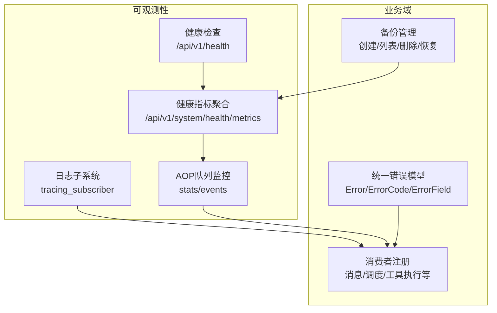
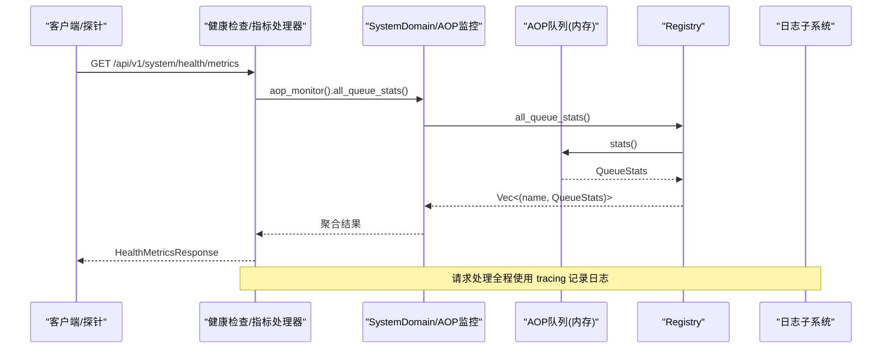
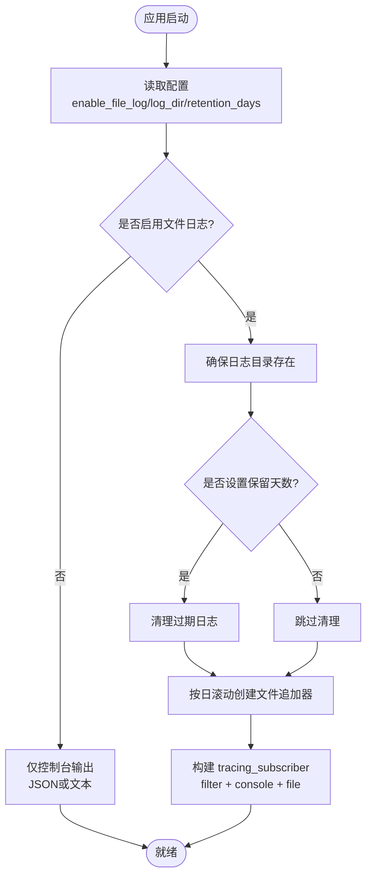
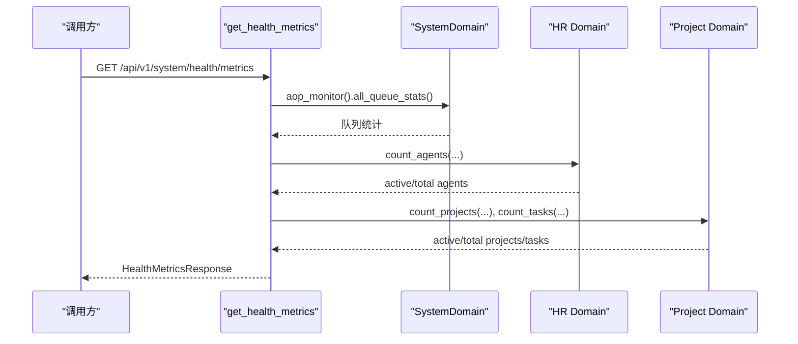
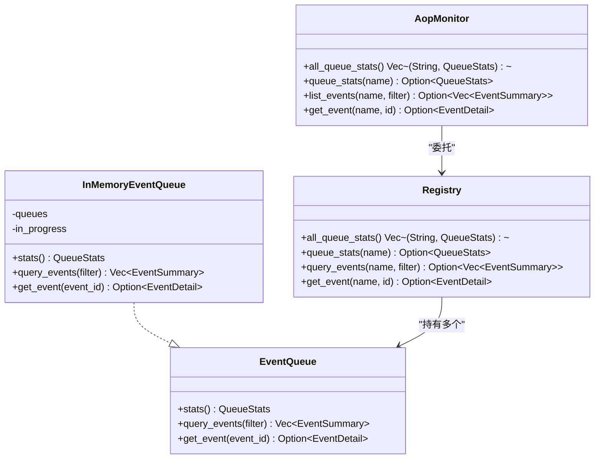
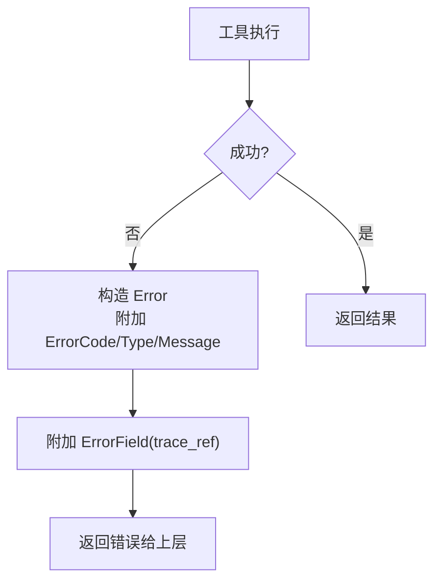
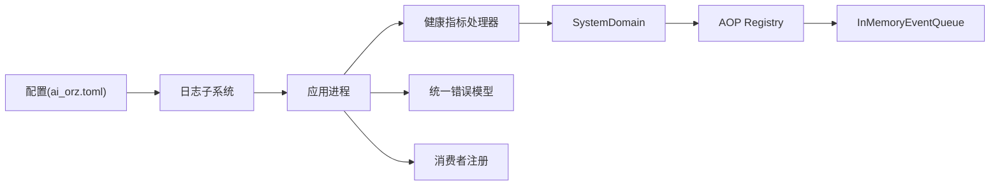

# 故障排除与监控

<cite>
**本文引用的文件**
- [logging.rs](src/pkg/logging.rs)
- [ai_orz.toml](common/config/ai_orz.toml)
- [health.rs](src/handlers/health.rs)
- [health_metrics.rs](src/handlers/system/health_metrics.rs)
- [mod.rs（备份）](src/handlers/system/backup/mod.rs)
- [create_backup.rs](src/handlers/system/backup/create_backup.rs)
- [delete_backup.rs](src/handlers/system/backup/delete_backup.rs)
- [list_backups.rs](src/handlers/system/backup/list_backups.rs)
- [restore_backup.rs](src/handlers/system/backup/restore_backup.rs)
- [aop_monitor.rs](src/service/domain/system/aop_monitor.rs)
- [registry.rs](src/pkg/aop/core/registry.rs)
- [in_memory.rs](src/pkg/aop/queue/in_memory.rs)
- [mod.rs（AOP队列）](src/pkg/aop/queue/mod.rs)
- [consumer/mod.rs](src/consumer/mod.rs)
- [tool_call_impl.rs](src/service/dao/tool_call/impl.rs)
- [error_mod.rs](common/src/error/mod.rs)
- [stats_query_design.md](docs/stats_query_design.md)
- [ws.rs（飞书WS）](src/service/dao/lark/ws.rs)
</cite>

## 目录
1. [简介](#简介)
2. [项目结构](#项目结构)
3. [核心组件](#核心组件)
4. [架构总览](#架构总览)
5. [详细组件分析](#详细组件分析)
6. [依赖关系分析](#依赖关系分析)
7. [性能考虑](#性能考虑)
8. [故障排除指南](#故障排除指南)
9. [结论](#结论)
10. [附录](#附录)

## 简介
本文件面向运维与SRE，提供 AI Orz 的故障排除与监控完整指南。内容覆盖：日志系统配置、结构化日志与查询；健康检查接口与聚合指标；错误追踪与告警建议；常见问题诊断与性能调优；监控仪表板配置思路；以及系统维护、备份恢复与灾难恢复流程。

## 项目结构
与监控和排障相关的代码主要分布在以下位置：
- 日志子系统：src/pkg/logging.rs，配置文件 common/config/ai_orz.toml
- 健康检查与指标：src/handlers/health.rs、src/handlers/system/health_metrics.rs
- AOP 队列监控：src/pkg/aop/queue/*、src/pkg/aop/core/registry.rs、src/service/domain/system/aop_monitor.rs
- 消费者注册与统计钩子：src/consumer/mod.rs
- 错误模型与追踪字段：common/src/error/mod.rs、src/service/dao/tool_call/impl.rs
- 备份管理：src/handlers/system/backup/*
- 外部集成日志示例：src/service/dao/lark/ws.rs

图表来源
- [logging.rs:23-124](src/pkg/logging.rs#L23-L124)
- [health.rs:1-16](src/handlers/health.rs#L1-L16)
- [health_metrics.rs:1-135](src/handlers/system/health_metrics.rs#L1-L135)
- [mod.rs（AOP队列）:1-138](src/pkg/aop/queue/mod.rs#L1-L138)
- [registry.rs:357-404](src/pkg/aop/core/registry.rs#L357-L404)
- [consumer/mod.rs:16-37](src/consumer/mod.rs#L16-L37)
- [error_mod.rs:1-25](common/src/error/mod.rs#L1-L25)
- [mod.rs（备份）:1-33](src/handlers/system/backup/mod.rs#L1-L33)

章节来源
- [logging.rs:23-124](src/pkg/logging.rs#L23-L124)
- [ai_orz.toml:24-30](common/config/ai_orz.toml#L24-L30)
- [health.rs:1-16](src/handlers/health.rs#L1-L16)
- [health_metrics.rs:1-135](src/handlers/system/health_metrics.rs#L1-L135)
- [mod.rs（备份）:1-33](src/handlers/system/backup/mod.rs#L1-L33)

## 核心组件
- 日志系统：支持控制台与按日滚动文件输出，JSON/文本格式可选，环境变量控制过滤级别，自动清理过期日志。
- 健康检查：基础健康端点返回服务状态与版本；聚合健康指标端点汇总后端在线、AOP队列积压、运行时长、Agent/Project/Task 计数等。
- AOP 队列监控：暴露队列统计与事件查询能力，便于定位消费延迟与卡点。
- 错误追踪：统一错误模型携带类型、错误码与结构化上下文（如 trace_ref），便于跨层追踪。
- 备份管理：提供创建、列出、删除、恢复备份的受控接口，并限制为超级管理员操作。

章节来源
- [logging.rs:23-124](src/pkg/logging.rs#L23-L124)
- [health.rs:1-16](src/handlers/health.rs#L1-L16)
- [health_metrics.rs:1-135](src/handlers/system/health_metrics.rs#L1-L135)
- [mod.rs（AOP队列）:1-138](src/pkg/aop/queue/mod.rs#L1-L138)
- [registry.rs:357-404](src/pkg/aop/core/registry.rs#L357-L404)
- [error_mod.rs:1-25](common/src/error/mod.rs#L1-L25)
- [mod.rs（备份）:1-33](src/handlers/system/backup/mod.rs#L1-L33)

## 架构总览
AI Orz 的可观测性由“日志 + 健康检查 + 指标 + 错误追踪 + 队列监控”构成闭环：
- 请求进入后通过 tracing 记录结构化日志，同时业务事件经 AOP 中心分发到各消费者。
- 健康检查与聚合指标对外暴露，供探针与仪表盘采集。
- 错误在 DAO/Domain 层统一封装，附带 trace_ref 等上下文，便于端到端追踪。
- 备份接口提供数据保护与恢复能力，配合健康指标评估恢复效果。

图表来源
- [health_metrics.rs:33-135](src/handlers/system/health_metrics.rs#L33-L135)
- [registry.rs:357-404](src/pkg/aop/core/registry.rs#L357-L404)
- [in_memory.rs:155-213](src/pkg/aop/queue/in_memory.rs#L155-L213)
- [logging.rs:23-124](src/pkg/logging.rs#L23-L124)

## 详细组件分析

### 日志系统
- 初始化：根据配置决定是否启用文件日志、日志目录、保留天数；从环境变量读取过滤级别，默认 info。
- 输出：控制台与文件双通道；支持 JSON/文本两种格式；文件按日滚动，非阻塞写入。
- 清理：启动时扫描日志目录，删除超过保留期的旧日志。
- 结构化字段：提供 LogFields trait，便于将业务对象字段注入 span。

图表来源
- [logging.rs:23-124](src/pkg/logging.rs#L23-L124)
- [ai_orz.toml:24-30](common/config/ai_orz.toml#L24-L30)

章节来源
- [logging.rs:23-124](src/pkg/logging.rs#L23-L124)
- [ai_orz.toml:24-30](common/config/ai_orz.toml#L24-L30)

### 健康检查与指标
- 基础健康：/api/v1/health 返回 status 与 version。
- 聚合指标：/api/v1/system/health/metrics 聚合后端在线、AOP队列积压、运行时长、Agent/Project/Task 数量等，用于前端 HUD 与外部监控。

图表来源
- [health_metrics.rs:33-135](src/handlers/system/health_metrics.rs#L33-L135)
- [health.rs:1-16](src/handlers/health.rs#L1-L16)

章节来源
- [health.rs:1-16](src/handlers/health.rs#L1-L16)
- [health_metrics.rs:1-135](src/handlers/system/health_metrics.rs#L1-L135)

### AOP 队列监控
- 数据结构：QueueStats、OrderKeyStats、EventSummary、EventDetail、EventStatus、EventQueryFilter。
- 能力：获取所有队列统计、指定消费者统计、事件列表查询、单个事件详情。
- 实现：InMemoryEventQueue 提供 stats/query_events/get_event；Registry 聚合多队列；SystemDomain 暴露 AopMonitor 接口。

图表来源
- [mod.rs（AOP队列）:1-138](src/pkg/aop/queue/mod.rs#L1-L138)
- [in_memory.rs:155-213](src/pkg/aop/queue/in_memory.rs#L155-L213)
- [registry.rs:357-404](src/pkg/aop/core/registry.rs#L357-L404)
- [aop_monitor.rs:420-458](src/service/domain/system/aop_monitor.rs#L420-L458)

章节来源
- [mod.rs（AOP队列）:1-138](src/pkg/aop/queue/mod.rs#L1-L138)
- [in_memory.rs:155-213](src/pkg/aop/queue/in_memory.rs#L155-L213)
- [registry.rs:357-404](src/pkg/aop/core/registry.rs#L357-L404)
- [aop_monitor.rs:420-458](src/service/domain/system/aop_monitor.rs#L420-L458)

### 错误追踪与上下文
- 统一错误模型：Error/ErrorCode/ErrorType/ErrorField，支持序列化与 Axum 集成。
- 工具调用失败路径：DAO 层捕获错误并附加 trace_ref（tool_id/call_id），便于后续关联日志与指标。
- 外部集成日志：例如飞书 WS 事件循环中记录事件接收、处理错误与关闭信息。

图表来源
- [tool_call_impl.rs:156-178](src/service/dao/tool_call/impl.rs#L156-L178)
- [error_mod.rs:1-25](common/src/error/mod.rs#L1-L25)

章节来源
- [tool_call_impl.rs:156-178](src/service/dao/tool_call/impl.rs#L156-L178)
- [error_mod.rs:1-25](common/src/error/mod.rs#L1-L25)
- [ws.rs（飞书WS）:244-297](src/service/dao/lark/ws.rs#L244-L297)

### 备份与恢复
- 权限控制：备份相关高危操作需 SuperAdmin 权限校验。
- 接口范围：创建、列出、删除、恢复备份。
- 建议流程：定期创建备份 → 验证备份完整性 → 需要时执行恢复 → 观察健康指标确认恢复效果。

章节来源
- [mod.rs（备份）:1-33](src/handlers/system/backup/mod.rs#L1-L33)
- [create_backup.rs](src/handlers/system/backup/create_backup.rs)
- [delete_backup.rs](src/handlers/system/backup/delete_backup.rs)
- [list_backups.rs](src/handlers/system/backup/list_backups.rs)
- [restore_backup.rs](src/handlers/system/backup/restore_backup.rs)

## 依赖关系分析
- 日志子系统依赖配置与环境变量，不耦合业务模块，低侵入。
- 健康指标依赖 SystemDomain 的 AOP 监控与各领域 DAO 计数方法。
- AOP 监控依赖 Registry 与具体队列实现（内存）。
- 错误模型贯穿 DAO/Domain/Handler，保证一致的错误语义与上下文。
- 消费者注册集中进行，便于扩展新消费者与监控维度。

图表来源
- [ai_orz.toml:24-30](common/config/ai_orz.toml#L24-L30)
- [logging.rs:23-124](src/pkg/logging.rs#L23-L124)
- [health_metrics.rs:33-135](src/handlers/system/health_metrics.rs#L33-L135)
- [registry.rs:357-404](src/pkg/aop/core/registry.rs#L357-L404)
- [consumer/mod.rs:16-37](src/consumer/mod.rs#L16-L37)
- [error_mod.rs:1-25](common/src/error/mod.rs#L1-L25)

章节来源
- [health_metrics.rs:33-135](src/handlers/system/health_metrics.rs#L33-L135)
- [registry.rs:357-404](src/pkg/aop/core/registry.rs#L357-L404)
- [consumer/mod.rs:16-37](src/consumer/mod.rs#L16-L37)

## 性能考虑
- 日志性能：使用非阻塞写入与按日滚动，避免 I/O 阻塞主线程；生产环境建议开启 JSON 格式以便高效解析。
- 指标开销：健康指标聚合会访问多个 DAO，建议在高频采集场景下缓存或降低采样频率。
- AOP 队列：关注 pending_count 与 oldest_event_age_secs，若持续增长说明消费者处理能力不足或下游依赖慢。
- 错误路径：避免在热路径上构造过多大对象；trace_ref 应轻量且必要。

[本节为通用指导，无需特定文件引用]

## 故障排除指南

### 日志排查
- 确认日志级别：通过环境变量调整过滤级别（默认 info）。
- 检查文件日志：确认日志目录存在、按日滚动、保留策略生效。
- 结构化日志：优先使用 JSON 格式，便于日志平台检索与聚合。
- 参考路径
  - [logging.rs:23-124](src/pkg/logging.rs#L23-L124)
  - [ai_orz.toml:24-30](common/config/ai_orz.toml#L24-L30)

### 健康检查与指标异常
- 基础健康失败：检查服务监听地址、端口占用、依赖数据库连接。
- 指标为空或异常：检查 SystemDomain 各子模块是否可用；关注 AOP 队列积压。
- 参考路径
  - [health.rs:1-16](src/handlers/health.rs#L1-L16)
  - [health_metrics.rs:33-135](src/handlers/system/health_metrics.rs#L33-L135)

### AOP 队列积压与延迟
- 现象：pending_count 上升、oldest_event_age_secs 增大。
- 排查：查看对应 consumer 的事件列表与详情，定位卡住的事件与 order_key。
- 处理：扩容消费者、优化下游依赖、必要时重试或丢弃无效事件。
- 参考路径
  - [mod.rs（AOP队列）:1-138](src/pkg/aop/queue/mod.rs#L1-L138)
  - [registry.rs:357-404](src/pkg/aop/core/registry.rs#L357-L404)
  - [in_memory.rs:155-213](src/pkg/aop/queue/in_memory.rs#L155-L213)

### 错误追踪与定位
- 利用 trace_ref（tool_id/call_id）关联日志与指标，快速定位问题工具调用。
- 结合统一错误模型的类型与错误码，分类统计失败率。
- 参考路径
  - [tool_call_impl.rs:156-178](src/service/dao/tool_call/impl.rs#L156-L178)
  - [error_mod.rs:1-25](common/src/error/mod.rs#L1-L25)

### 外部集成日志
- 以飞书 WS 为例，关注事件接收、处理错误与连接关闭日志，辅助定位第三方服务问题。
- 参考路径
  - [ws.rs（飞书WS）:244-297](src/service/dao/lark/ws.rs#L244-L297)

### 备份与恢复
- 定期创建备份并验证完整性；恢复前暂停写入或切换到只读模式。
- 恢复后观察健康指标与关键实体计数，确认数据一致性。
- 参考路径
  - [mod.rs（备份）:1-33](src/handlers/system/backup/mod.rs#L1-L33)
  - [create_backup.rs](src/handlers/system/backup/create_backup.rs)
  - [restore_backup.rs](src/handlers/system/backup/restore_backup.rs)

### 监控仪表板配置建议
- 采集端点：/api/v1/health、/api/v1/system/health/metrics、AOP 队列统计与事件查询接口。
- 指标项：backend_online、aop_pending、aop_in_progress、uptime_secs、active/total 实体数。
- 告警阈值：aop_pending 持续上升、oldest_event_age_secs 超阈值、健康检查失败。
- 可视化：时间序列展示队列积压趋势、错误率、实体增长曲线。

[本节为通用指导，无需特定文件引用]

## 结论
AI Orz 提供了完善的日志、健康检查、指标聚合、错误追踪与 AOP 队列监控能力。结合备份与恢复机制，可满足日常运维与故障排查需求。建议在生产环境启用结构化日志与指标采集，建立基于阈值的告警体系，并定期演练备份恢复流程，保障系统稳定性与可恢复性。

## 附录

### 常用命令与端点
- 健康检查：GET /api/v1/health
- 健康指标聚合：GET /api/v1/system/health/metrics
- AOP 队列统计：GET /api/v1/system/aop/stats
- 指定消费者统计：GET /api/v1/system/aop/:consumer/stats
- 事件列表：GET /api/v1/system/aop/:consumer/events?order_key=&status=&limit=&offset=
- 事件详情：GET /api/v1/system/aop/:consumer/events/:event_id

章节来源
- [health.rs:1-16](src/handlers/health.rs#L1-L16)
- [health_metrics.rs:33-135](src/handlers/system/health_metrics.rs#L33-L135)
- [mod.rs（AOP队列）:1-138](src/pkg/aop/queue/mod.rs#L1-L138)
- [registry.rs:357-404](src/pkg/aop/core/registry.rs#L357-L404)

### 统计与事件设计参考
- 统计领域划分、事件结构与查询设计详见文档。
- 参考路径
  - [stats_query_design.md:12-641](docs/stats_query_design.md#L12-L641)