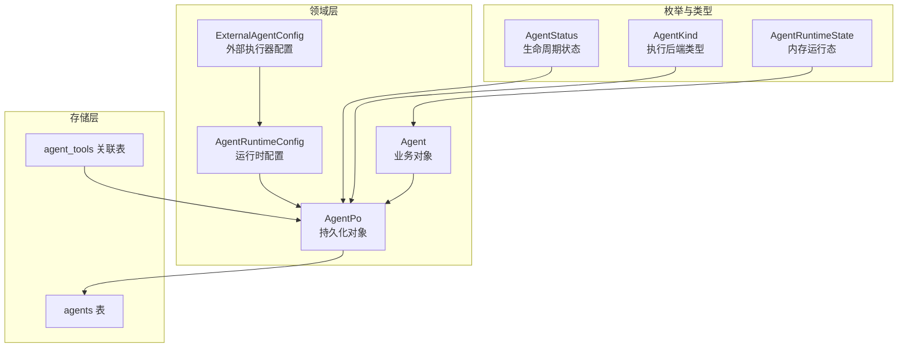
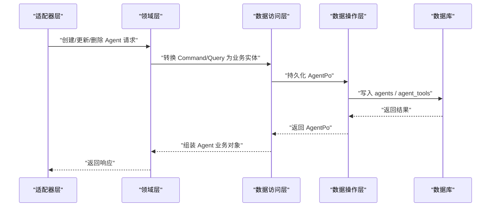
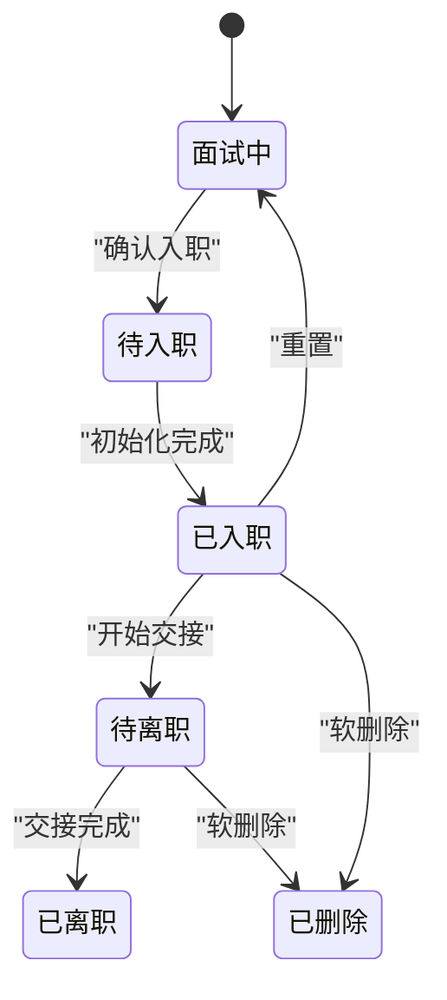
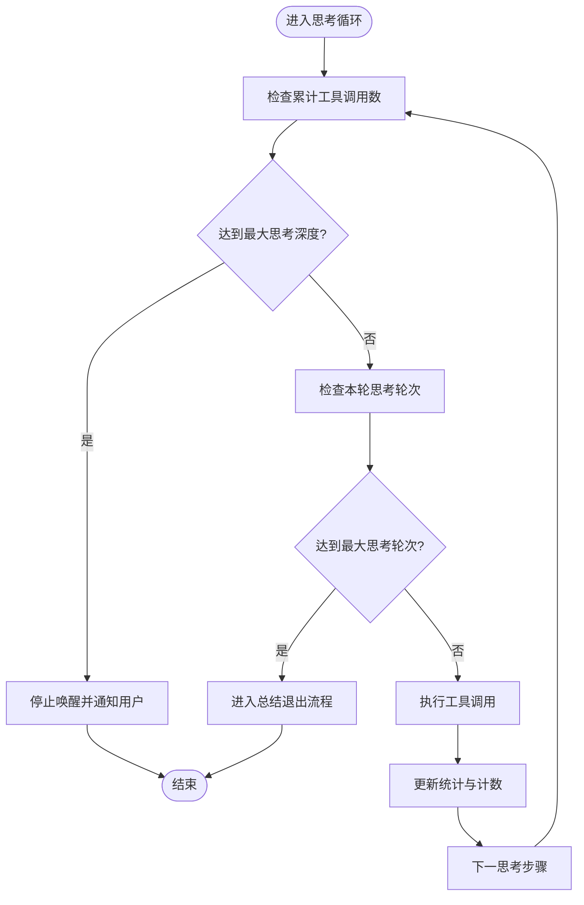
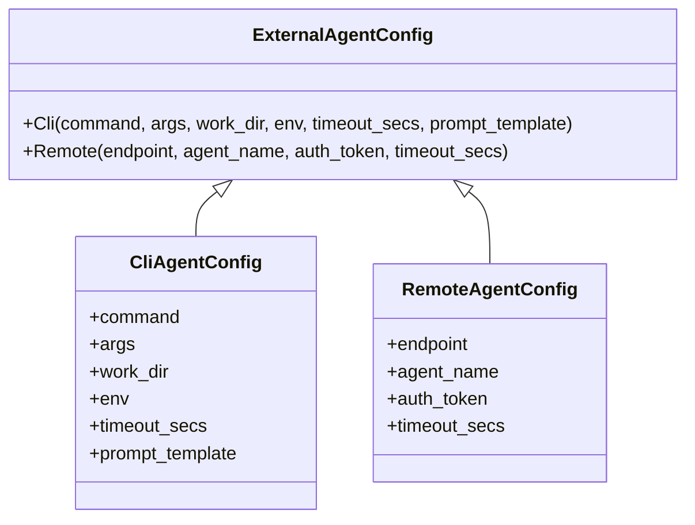
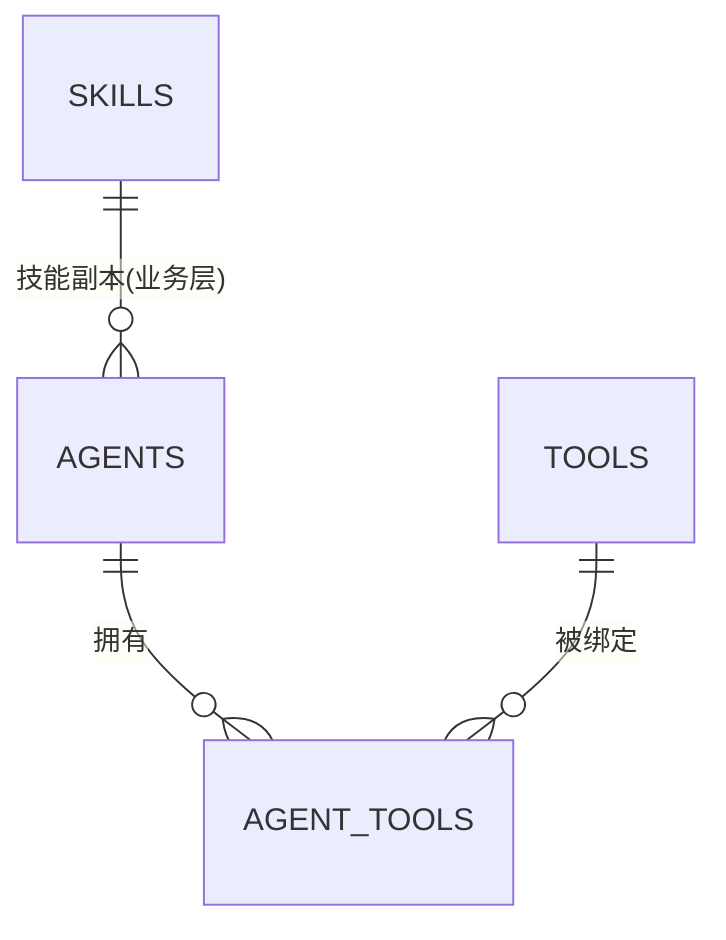
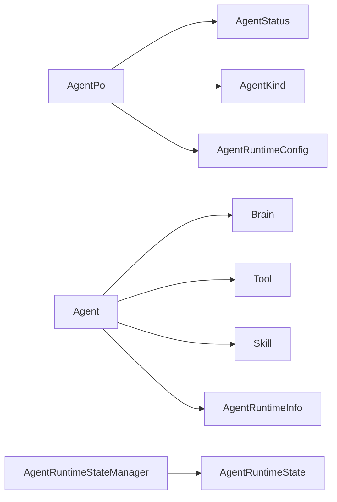

# Agent 实体

<cite>
**本文引用的文件**
- [src/models/agent.rs](src/models/agent.rs)
- [common/src/enums/agent.rs](common/src/enums/agent.rs)
- [common/src/enums/agent_kind.rs](common/src/enums/agent_kind.rs)
- [migrations/20260420000000_initial.sql](migrations/20260420000000_initial.sql)
- [migrations/20260719000000_add_kind_to_agents.sql](migrations/20260719000000_add_kind_to_agents.sql)
- [src/pkg/agent_runtime_state.rs](src/pkg/agent_runtime_state.rs)
</cite>

## 目录
1. [简介](#简介)
2. [项目结构](#项目结构)
3. [核心组件](#核心组件)
4. [架构总览](#架构总览)
5. [详细组件分析](#详细组件分析)
6. [依赖关系分析](#依赖关系分析)
7. [性能考量](#性能考量)
8. [故障排查指南](#故障排查指南)
9. [结论](#结论)
10. [附录](#附录)

## 简介
本文件围绕 Agent 实体的数据模型与运行时行为进行系统化说明，覆盖以下要点：
- Agent 的核心字段定义、状态机设计与生命周期管理
- Agent 配置结构、提示词模板与模型参数
- Agent 类型区分（Local/Cli/Remote）、能力描述与元数据存储
- Agent 与 Skill、Tool 的绑定关系与外键约束
- Agent 创建、更新与删除的业务规则
- AgentRuntimeConfig 的运行时配置选项（思考深度限制、工具调用次数控制、反思模式等）
- 外部 Agent 配置（CLI 子进程与 A2A 远程执行）的具体实现方式

## 项目结构
Agent 相关的数据模型与运行态分布在如下位置：
- 业务对象与持久化对象：src/models/agent.rs
- 枚举与类型：common/src/enums/agent.rs、common/src/enums/agent_kind.rs
- 数据库迁移：migrations/20260420000000_initial.sql、migrations/20260719000000_add_kind_to_agents.sql
- 运行时状态管理器：src/pkg/agent_runtime_state.rs

**图表来源**
- [src/models/agent.rs:15-105](src/models/agent.rs#L15-L105)
- [src/models/agent.rs:186-358](src/models/agent.rs#L186-L358)
- [common/src/enums/agent.rs:8-30](common/src/enums/agent.rs#L8-L30)
- [common/src/enums/agent_kind.rs:8-25](common/src/enums/agent_kind.rs#L8-L25)
- [migrations/20260420000000_initial.sql:39-54](migrations/20260420000000_initial.sql#L39-L54)
- [migrations/20260420000000_initial.sql:220-227](migrations/20260420000000_initial.sql#L220-L227)
- [migrations/20260719000000_add_kind_to_agents.sql:1-5](migrations/20260719000000_add_kind_to_agents.sql#L1-L5)

**章节来源**
- [src/models/agent.rs:15-105](src/models/agent.rs#L15-L105)
- [src/models/agent.rs:186-358](src/models/agent.rs#L186-L358)
- [common/src/enums/agent.rs:8-30](common/src/enums/agent.rs#L8-L30)
- [common/src/enums/agent_kind.rs:8-25](common/src/enums/agent_kind.rs#L8-L25)
- [migrations/20260420000000_initial.sql:39-54](migrations/20260420000000_initial.sql#L39-L54)
- [migrations/20260420000000_initial.sql:220-227](migrations/20260420000000_initial.sql#L220-L227)
- [migrations/20260719000000_add_kind_to_agents.sql:1-5](migrations/20260719000000_add_kind_to_agents.sql#L1-L5)

## 核心组件
- AgentPo：持久化对象，映射 agents 表，包含 ID、名称、角色、描述、灵魂设定、能力、运行时配置、模型提供商、状态、类型、审计字段等。
- Agent：业务对象，组合 AgentPo、Brain、Tools、Skills、运行时信息、统计信息等，提供装配与查询辅助方法。
- AgentRuntimeConfig：JSON 存储的运行时配置，包括思考深度、思考轮次、思考间隔、单步工具调用上限、反思模式、用户确认、已安装标签、技能包标签、外部执行器配置等。
- ExternalAgentConfig：外部执行器配置，支持 CLI 子进程与 A2A 远程两种执行器。
- AgentStatus：生命周期状态（面试中、待入职、已入职、待离职、已离职、已删除）。
- AgentKind：执行后端类型（Local、Cli、Remote）。
- AgentRuntimeState：内存运行态（空闲、休息、忙碌），由 AgentRuntimeStateManager 维护。

**章节来源**
- [src/models/agent.rs:15-105](src/models/agent.rs#L15-L105)
- [src/models/agent.rs:186-358](src/models/agent.rs#L186-L358)
- [common/src/enums/agent.rs:8-30](common/src/enums/agent.rs#L8-L30)
- [common/src/enums/agent_kind.rs:8-25](common/src/enums/agent_kind.rs#L8-L25)
- [src/pkg/agent_runtime_state.rs:11-19](src/pkg/agent_runtime_state.rs#L11-L19)

## 架构总览
Agent 数据模型遵循四层单向调用原则：Adapter → Domain → DAL → DAO。AgentPo 仅在 DAO/DAL 内部使用；Domain 对外暴露业务实体 Agent。Agent 的生命周期与运行态分别通过持久化状态 AgentStatus 与内存状态 AgentRuntimeState 共同管理。

**图表来源**
- [src/models/agent.rs:186-358](src/models/agent.rs#L186-L358)
- [migrations/20260420000000_initial.sql:39-54](migrations/20260420000000_initial.sql#L39-L54)
- [migrations/20260420000000_initial.sql:220-227](migrations/20260420000000_initial.sql#L220-L227)

## 详细组件分析

### Agent 数据模型与字段定义
- 标识与基础信息：id、name、role（角色标签数组 JSON）、description（角色描述）、soul（灵魂设定）、capabilities（能力描述数组 JSON）
- 模型与配置：model_provider_id（关联模型提供商）、runtime_config（JSON 格式的 AgentRuntimeConfig）
- 生命周期与类型：status（AgentStatus）、kind（AgentKind）
- 审计字段：created_by、modified_by、created_at、updated_at

提示词模板生成：
- AgentPo::to_system_prompt 将 ID、名称、角色描述、灵魂设定以统一【】格式拼接，便于大模型识别与提取。

向量化文本：
- vectorize_text 对 name、role、description、capabilities 进行拼接，用于向量检索；soul 不参与向量化。

**章节来源**
- [src/models/agent.rs:330-358](src/models/agent.rs#L330-L358)
- [src/models/agent.rs:359-427](src/models/agent.rs#L359-L427)
- [src/models/agent.rs:627-650](src/models/agent.rs#L627-L650)

### 状态机与生命周期管理
- 生命周期状态（持久化）：Interviewing（默认）、PendingOnboard、Onboarded、PendingOffboard、Offboarded、Deleted
- 内存运行态（不持久化）：Idle、Resting、Busy，由 AgentRuntimeStateManager 维护并发安全的 try_set_busy 防止重复唤醒
- 状态变更事件：状态切换时发布 AgentStateEvent，供 AOP 消费

**图表来源**
- [common/src/enums/agent.rs:8-30](common/src/enums/agent.rs#L8-L30)
- [src/pkg/agent_runtime_state.rs:62-107](src/pkg/agent_runtime_state.rs#L62-L107)

**章节来源**
- [common/src/enums/agent.rs:8-30](common/src/enums/agent.rs#L8-L30)
- [src/pkg/agent_runtime_state.rs:11-19](src/pkg/agent_runtime_state.rs#L11-L19)
- [src/pkg/agent_runtime_state.rs:62-107](src/pkg/agent_runtime_state.rs#L62-L107)

### 运行时配置 AgentRuntimeConfig
- 最大思考深度：跨消息累计的工具调用数上限，达到后停止唤醒并通知用户
- 单次唤醒最大思考轮次：跨上下文压缩累计的思考轮次上限，达到后进入总结退出流程
- 思考间隔：毫秒级间隔，避免过快调用
- 单步最大工具调用次数：每步工具调用上限
- 反思模式：是否启用反思
- 用户确认机制：是否要求用户确认
- 已安装工具包标签：自动注入到 Prompt，免绑定
- 已安装技能包标签：记录安装的技能包
- 外部执行器配置：CLI 或 Remote

**图表来源**
- [src/models/agent.rs:15-69](src/models/agent.rs#L15-L69)
- [src/models/agent.rs:107-184](src/models/agent.rs#L107-L184)

**章节来源**
- [src/models/agent.rs:15-69](src/models/agent.rs#L15-L69)
- [src/models/agent.rs:107-184](src/models/agent.rs#L107-L184)

### 外部 Agent 配置（CLI 与 A2A 远程）
- CLI 子进程：command、args、work_dir、env、timeout_secs、prompt_template（可选，使用 {prompt} 占位符）
- A2A 远程：endpoint、agent_name、auth_token（可选）、timeout_secs

**图表来源**
- [src/models/agent.rs:71-105](src/models/agent.rs#L71-L105)
- [src/models/agent.rs:555-573](src/models/agent.rs#L555-L573)

**章节来源**
- [src/models/agent.rs:71-105](src/models/agent.rs#L71-L105)
- [src/models/agent.rs:555-573](src/models/agent.rs#L555-L573)

### 类型区分与能力描述
- AgentKind：Local（本地 Brain 执行）、Cli（CLI 子进程包装）、Remote（A2A 协议远程调用）
- 能力描述：capabilities 字段为 JSON 数组，配合 role 与 description 构成 Agent 的能力画像
- 元数据存储：AgentPo 作为 PO 在 DAO/DAL 内部使用，Agent 业务对象组合 Brain、Tools、Skills、运行时信息与统计

**章节来源**
- [common/src/enums/agent_kind.rs:8-25](common/src/enums/agent_kind.rs#L8-L25)
- [src/models/agent.rs:330-358](src/models/agent.rs#L330-L358)
- [src/models/agent.rs:186-222](src/models/agent.rs#L186-L222)

### 与 Skill、Tool 的绑定关系与外键约束
- 工具绑定：agent_tools 表通过 (agent_id, tool_id) 主键建立多对多关系
- 技能副本：Agent.skills 为业务实体列表，由 hr_domain 加载，供 wake/awaken 使用；技能包标签通过 installed_skill_packs 记录
- 外键约束：当前迁移未显式声明外键，但逻辑上 agent_id 应指向 agents.id，tool_id 应指向 tools.id

**图表来源**
- [migrations/20260420000000_initial.sql:220-227](migrations/20260420000000_initial.sql#L220-L227)
- [src/models/agent.rs:186-222](src/models/agent.rs#L186-L222)

**章节来源**
- [migrations/20260420000000_initial.sql:220-227](migrations/20260420000000_initial.sql#L220-L227)
- [src/models/agent.rs:186-222](src/models/agent.rs#L186-L222)

### 创建、更新与删除的业务规则
- 创建：
  - 默认状态为 Interviewing，类型为 Local
  - runtime_config 使用默认值，包含思考深度、轮次、工具调用上限等
  - 自动生成 ID 与时间戳
- 更新：
  - 修改 runtime_config 会更新 updated_at
  - 安装/卸载工具包或技能包标签会同步更新 runtime_config
- 删除：
  - 通过状态置为 Deleted 实现软删除
  - 建议同时清理 agent_tools 关联与技能副本引用

**章节来源**
- [src/models/agent.rs:378-404](src/models/agent.rs#L378-L404)
- [src/models/agent.rs:418-465](src/models/agent.rs#L418-L465)
- [common/src/enums/agent.rs:8-30](common/src/enums/agent.rs#L8-L30)

## 依赖关系分析
- AgentPo 依赖 AgentStatus、AgentKind、AgentRuntimeConfig
- Agent 业务对象依赖 Brain、Tool、Skill、AgentRuntimeInfo、统计数据
- 运行时状态管理器依赖 AgentRuntimeState 与 AOP 事件

**图表来源**
- [src/models/agent.rs:186-358](src/models/agent.rs#L186-L358)
- [src/pkg/agent_runtime_state.rs:11-19](src/pkg/agent_runtime_state.rs#L11-L19)

**章节来源**
- [src/models/agent.rs:186-358](src/models/agent.rs#L186-L358)
- [src/pkg/agent_runtime_state.rs:11-19](src/pkg/agent_runtime_state.rs#L11-L19)

## 性能考量
- 思考深度与轮次限制：防止无限循环与过度消耗模型资源
- 思考间隔：避免过快调用导致下游服务压力
- 单步工具调用上限：控制单次处理的复杂度
- 运行时状态并发安全：try_set_busy 防止同一 Agent 被并发唤醒
- 向量化文本过滤空字段：减少无效索引与检索开销

[本节为通用指导，无需具体文件来源]

## 故障排查指南
- 状态异常：检查 AgentStatus 与 AgentRuntimeState 是否一致，确认是否有并发唤醒问题
- 工具调用超限：调整 max_tool_calls_per_step 或 max_thinking_depth
- 外部执行失败：校验 CLI command/args/work_dir/env 或 A2A endpoint/auth_token/timeout
- 绑定关系缺失：确认 agent_tools 表中是否存在对应记录

**章节来源**
- [src/pkg/agent_runtime_state.rs:62-107](src/pkg/agent_runtime_state.rs#L62-L107)
- [src/models/agent.rs:15-69](src/models/agent.rs#L15-L69)
- [src/models/agent.rs:71-105](src/models/agent.rs#L71-L105)

## 结论
Agent 实体通过清晰的 PO/业务对象分层、严格的状态机与运行时配置，实现了可观测、可控、可扩展的多 Agent 协作框架。结合 Skill/Tool 绑定与外部执行器配置，既能满足本地推理，也能无缝集成 CLI 与 A2A 远程执行，满足不同场景下的智能体需求。

[本节为总结性内容，无需具体文件来源]

## 附录
- 数据库表结构参考：agents、agent_tools
- 枚举定义参考：AgentStatus、AgentKind、AgentRuntimeState
- 运行时配置参考：AgentRuntimeConfig、ExternalAgentConfig

**章节来源**
- [migrations/20260420000000_initial.sql:39-54](migrations/20260420000000_initial.sql#L39-L54)
- [migrations/20260420000000_initial.sql:220-227](migrations/20260420000000_initial.sql#L220-L227)
- [common/src/enums/agent.rs:8-30](common/src/enums/agent.rs#L8-L30)
- [common/src/enums/agent_kind.rs:8-25](common/src/enums/agent_kind.rs#L8-L25)
- [src/models/agent.rs:15-105](src/models/agent.rs#L15-L105)