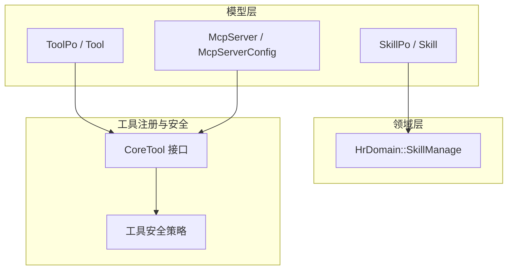
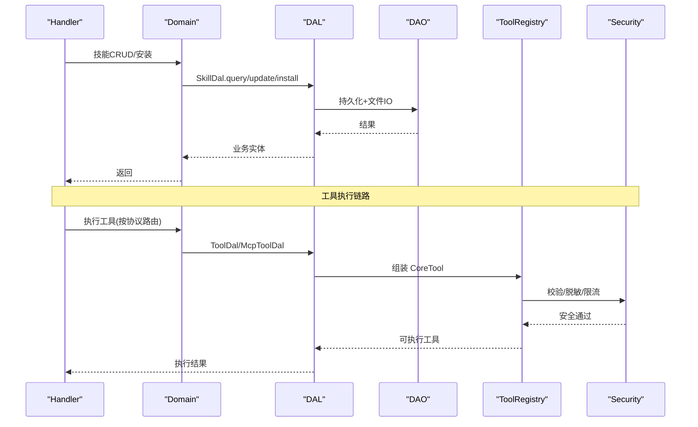
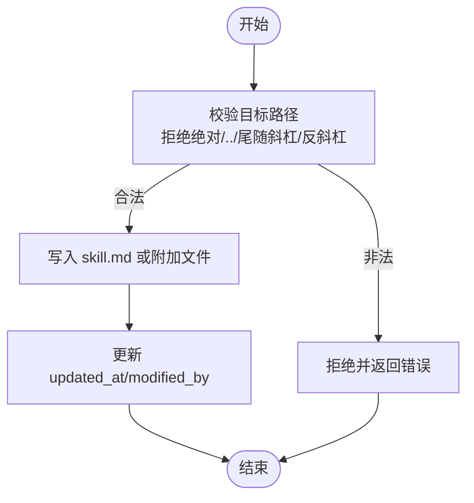
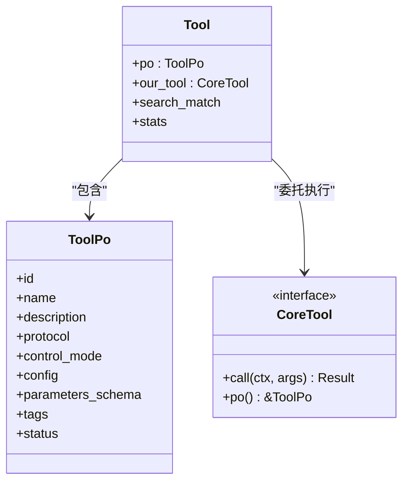
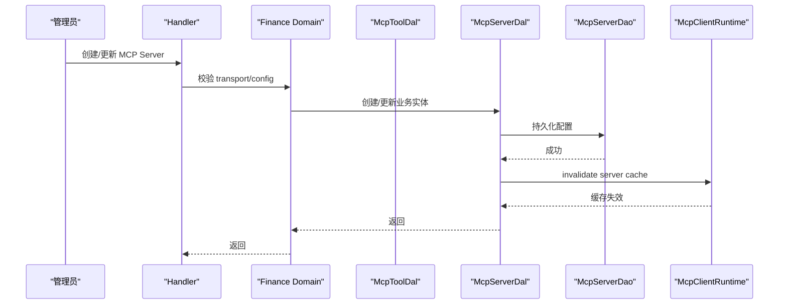
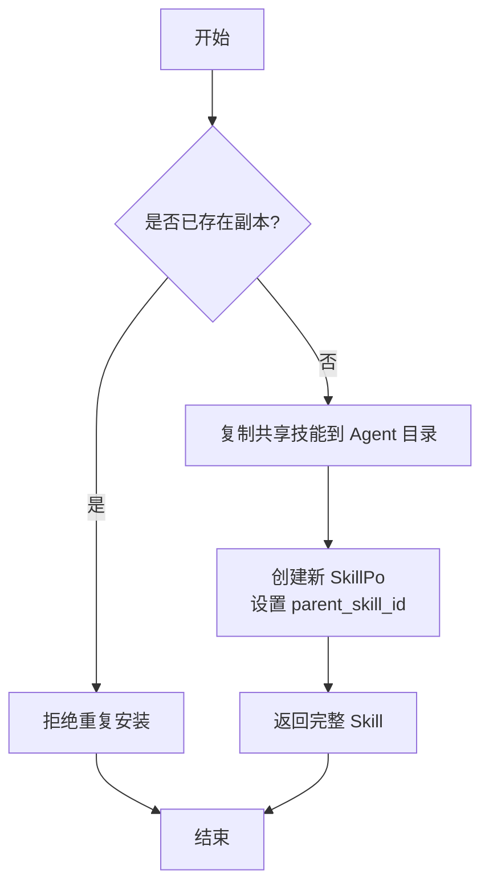
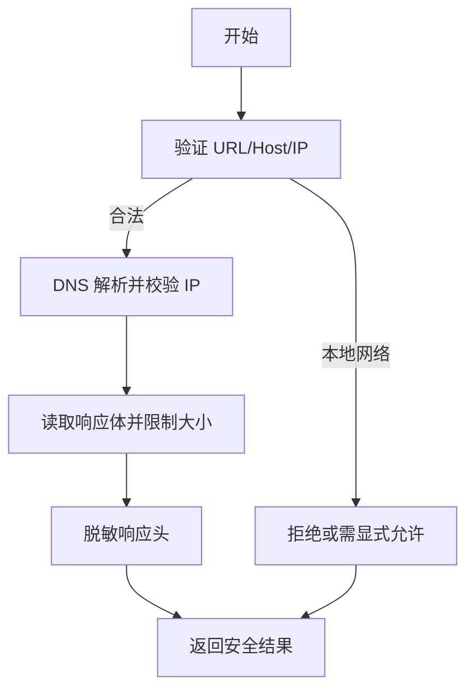
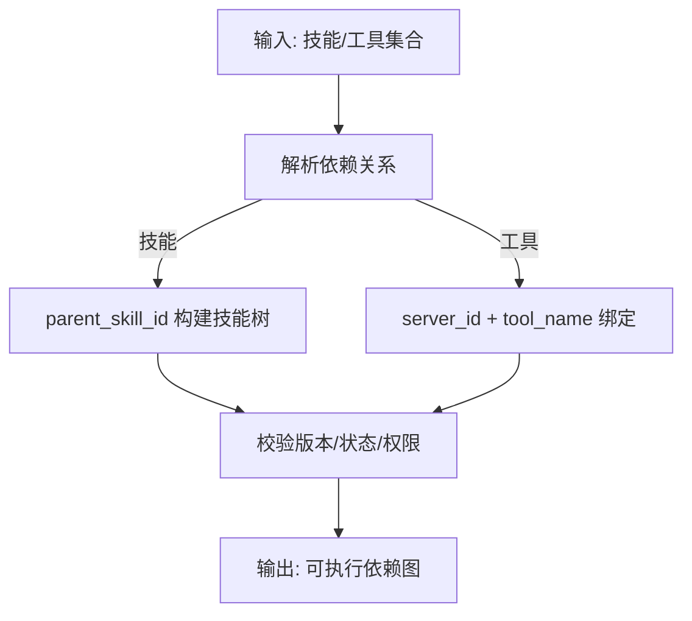
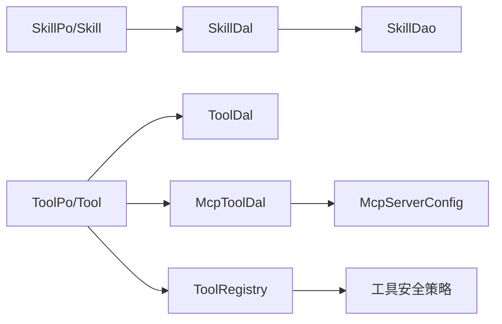
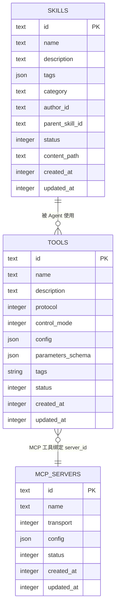

# 技能和工具系统

<cite>
**本文引用的文件**
- [skill_design.md](docs/skill_design.md)
- [mcp_tool_design.md](docs/mcp_tool_design.md)
- [skill.rs](src/models/skill.rs)
- [tool.rs](src/models/tool.rs)
- [mcp_server.rs](src/models/mcp_server.rs)
- [skill_domain.rs](src/service/domain/hr/skill.rs)
- [tool_security.rs](src/pkg/tool_registry/tool_security.rs)
</cite>

## 目录
1. [引言](#引言)
2. [项目结构](#项目结构)
3. [核心组件](#核心组件)
4. [架构总览](#架构总览)
5. [详细组件分析](#详细组件分析)
6. [依赖关系分析](#依赖关系分析)
7. [性能与限制](#性能与限制)
8. [故障排查指南](#故障排查指南)
9. [结论](#结论)
10. [附录](#附录)

## 引言
本文件面向“技能”和“工具”子系统，聚焦以下目标：
- 明确 Skill 实体的版本控制、文件管理与依赖声明机制。
- 记录 Tool 实体的注册机制、参数定义和执行上下文。
- 说明 MCP Server 的配置管理、工具同步与连接状态维护。
- 描述技能包安装/卸载流程、工具安全沙箱与执行限制。
- 提供完整的实体关系图与依赖解析算法。
- 规范技能文件的组织结构、元数据格式与版本兼容性检查。
- 详述工具的权限控制、资源限制与错误处理机制。

## 项目结构
围绕技能与工具的核心代码分布在模型层、领域层、DAL/DAO 层以及工具注册与安全模块中：
- 模型层：SkillPo/Skill、ToolPo/Tool、McpServer/McpServerConfig。
- 领域层：HR Domain 的 SkillManage（安装、更新、删除、查询）。
- DAL/DAO：技能与工具的数据访问抽象与实现（由设计文档与模型文件体现）。
- 工具注册与安全：CoreTool 接口、工具协议路由、HTTP/文件系统安全策略。

图表来源
- [skill.rs:20-124](src/models/skill.rs#L20-L124)
- [tool.rs:57-106](src/models/tool.rs#L57-L106)
- [mcp_server.rs:97-230](src/models/mcp_server.rs#L97-L230)
- [skill_domain.rs:12-151](src/service/domain/hr/skill.rs#L12-L151)
- [tool_security.rs:1-487](src/pkg/tool_registry/tool_security.rs#L1-L487)

章节来源
- [skill_design.md:12-107](docs/skill_design.md#L12-L107)
- [mcp_tool_design.md:31-118](docs/mcp_tool_design.md#L31-L118)

## 核心组件
- Skill 实体
  - 持久化对象 SkillPo：包含 id、name、description、tags、category、parent_skill_id、author_id、author_type、status、content_path 等字段，用于数据库映射与基础 CRUD。
  - 业务实体 Skill：在 PO 基础上聚合 files（小文件预读）与 search_match（搜索结果元信息），并提供向量化能力。
  - 文件管理：通过 SkillDal/Dao 提供的 read/write/list/delete 方法对 skill.md 与附加文件进行读写；路径计算由 AppConfig 统一生成相对/绝对路径。
  - 版本与状态：支持 Draft/Published/Expired 状态流转；软删除使用 Expired；安装到 Agent 会创建副本并设置 parent_skill_id。
- Tool 实体
  - 持久化对象 ToolPo：包含 id、name、description、protocol、control_mode、config、parameters_schema、tags、status 等。
  - 业务实体 Tool：封装 ToolPo 与可执行 CoreTool 实例，支持统计与搜索匹配元信息。
  - 注册与执行：通过 ToolCallDao 组装 CoreTool；MCP/HTTP/Builtin 协议分别走不同工厂或增强实现。
- MCP Server
  - 配置对象 McpServerConfig：支持 stdio 与 streamable_http 两种传输，包含超时、响应大小限制、环境变量与请求头等。
  - 业务实体 McpServer：包装 McpServerPo，提供脱敏视图用于管理面展示。
  - 工具同步：通过 tools/list 将远端工具元数据同步为本地 ToolPo，仅保存 server_id + tool_name 绑定。

章节来源
- [skill.rs:20-193](src/models/skill.rs#L20-L193)
- [tool.rs:57-314](src/models/tool.rs#L57-L314)
- [mcp_server.rs:97-322](src/models/mcp_server.rs#L97-L322)
- [skill_design.md:315-359](docs/skill_design.md#L315-L359)
- [mcp_tool_design.md:31-118](docs/mcp_tool_design.md#L31-L118)

## 架构总览
四层单向调用：Adapter → Domain → DAL → DAO。技能与工具相关的关键交互如下：
- Handler 接收请求后进入 HR Domain（SkillManage）或 Finance Domain（MCP 管理面）。
- Domain 编排 DAL（SkillDal、McpToolDal、ToolDal），DAL 组合 DAO 完成持久化与文件操作。
- 工具执行时，Runtime 根据 ToolProtocol 路由到对应 DAL（Builtin/Http 走 ToolDal，MCP 走 McpToolDal）。
- MCP 运行时通过 McpToolCallDaoImpl 持有唯一 McpClientRuntime，负责 session/client 生命周期。

图表来源
- [skill_domain.rs:12-151](src/service/domain/hr/skill.rs#L12-L151)
- [tool.rs:16-32](src/models/tool.rs#L16-L32)
- [mcp_tool_design.md:152-186](docs/mcp_tool_design.md#L152-L186)
- [tool_security.rs:92-170](src/pkg/tool_registry/tool_security.rs#L92-L170)

## 详细组件分析

### Skill 实体：版本控制、文件管理与依赖声明
- 版本控制
  - 状态机：Draft（草稿）、Published（已发布）、Expired（软删除）。
  - 安装到 Agent：创建私有副本，设置 parent_skill_id，内容路径指向 agents/{agent_id}/skills/{skill_id}。
  - 软删除：delete_by_id 标记为 Expired，默认查询排除 Expired。
- 文件管理
  - 主文件 skill.md 与附加文件统一通过 SkillDal/Dao 读写；列表接口对小文件自动预读内容。
  - 路径安全：拒绝绝对路径、..、尾随斜杠、反斜杠分隔符；禁止覆盖主文件 skill.md。
  - 文本编辑：GET/PUT 小文本文件（UTF-8，最大 64KB），支持乐观锁 expected_updated_at。
- 依赖声明
  - 通过 tags 与 category 组织能力；向量索引基于 name/description/tags 构建，支持语义检索。
  - 父技能 parent_skill_id 支持技能树演进与继承来源追踪。

图表来源
- [skill_design.md:186-201](docs/skill_design.md#L186-L201)
- [skill_design.md:203-280](docs/skill_design.md#L203-L280)
- [skill_design.md:315-359](docs/skill_design.md#L315-L359)

章节来源
- [skill_design.md:12-107](docs/skill_design.md#L12-L107)
- [skill_design.md:362-428](docs/skill_design.md#L362-L428)
- [skill.rs:20-193](src/models/skill.rs#L20-L193)

### Tool 实体：注册机制、参数定义与执行上下文
- 注册机制
  - ToolPo 存储工具元数据；protocol 区分 Builtin/Http/Mcp；control_mode 区分 Auto/Manual。
  - MCP 工具通过 McpToolDal.sync_from_server 将远端 metadata 同步为 ToolPo，仅保存 server_id + tool_name。
- 参数定义
  - parameters_schema 描述输入 JSON Schema；Prompt 中只输出安全元信息，不包含敏感 config。
- 执行上下文
  - Runtime 根据 protocol 路由：Builtin/Http 走 ToolDal，MCP 走 McpToolDal。
  - McpToolCallDaoImpl 持有唯一 McpClientRuntime，负责 session 生命周期与失效刷新。

图表来源
- [tool.rs:57-106](src/models/tool.rs#L57-L106)
- [tool.rs:16-32](src/models/tool.rs#L16-L32)
- [mcp_tool_design.md:352-388](docs/mcp_tool_design.md#L352-L388)

章节来源
- [tool.rs:57-314](src/models/tool.rs#L57-L314)
- [mcp_tool_design.md:31-118](docs/mcp_tool_design.md#L31-L118)
- [mcp_tool_design.md:352-388](docs/mcp_tool_design.md#L352-L388)

### MCP Server：配置管理、工具同步与连接状态维护
- 配置管理
  - McpServerConfig 支持 stdio（command/args/env）与 streamable_http（url/headers），含超时与响应大小限制。
  - 管理面展示使用 redacted_for_management 脱敏 env/headers/url。
- 工具同步
  - sync_from_server 调用 tools/list，将远端工具元数据 upsert 为 ToolPo；冲突时校验 protocol/config 一致性。
- 连接状态维护
  - McpToolCallDaoImpl 拥有唯一 McpClientRuntime；DAL 更新/删除后通知 runtime invalidate server cache。
  - 连接失败不污染持久化事务，通过 test_connection/sync_tools 暴露连接结果。

图表来源
- [mcp_server.rs:97-230](src/models/mcp_server.rs#L97-L230)
- [mcp_tool_design.md:196-219](docs/mcp_tool_design.md#L196-L219)
- [mcp_tool_design.md:299-349](docs/mcp_tool_design.md#L299-L349)

章节来源
- [mcp_server.rs:97-322](src/models/mcp_server.rs#L97-L322)
- [mcp_tool_design.md:152-186](docs/mcp_tool_design.md#L152-L186)
- [mcp_tool_design.md:196-219](docs/mcp_tool_design.md#L196-L219)
- [mcp_tool_design.md:299-349](docs/mcp_tool_design.md#L299-L349)

### 技能包安装/卸载流程
- 安装
  - install_to_agent：复制共享技能到 Agent 私有目录，创建新 SkillPo，设置 parent_skill_id，内容路径指向 agents/{agent_id}/skills/{skill_id}。
- 卸载
  - uninstall_from_agent：校验副本归属与 parent_skill_id 非空，复用 DAL delete 同时删除 DB 记录与文件目录。

图表来源
- [skill_design.md:397-407](docs/skill_design.md#L397-L407)
- [skill_domain.rs:139-184](src/service/domain/hr/skill.rs#L139-L184)

章节来源
- [skill_design.md:397-407](docs/skill_design.md#L397-L407)
- [skill_domain.rs:139-184](src/service/domain/hr/skill.rs#L139-L184)

### 工具的安全沙箱与执行限制
- HTTP 安全
  - SSRF 防护：拒绝本地网络地址，支持 allow_local_network 白名单；域名允许/黑名单匹配。
  - 响应体限制：硬上限与默认上限，防止大响应耗尽内存。
  - 头部脱敏：Authorization/Cookie/Token/Secret/Password 等敏感头替换为 [REDACTED]。
- 文件系统安全
  - 路径规范化与范围校验：仅允许 base 目录或额外授权目录；拒绝符号链接。
  - 敏感文件名拦截：.env/.key/id_rsa/password/secret/token 等直接拒绝。
- 超时与资源限制
  - 默认超时 30s，硬上限 10 分钟；响应最大字节数默认 1MB，硬上限 10MB。

图表来源
- [tool_security.rs:92-170](src/pkg/tool_registry/tool_security.rs#L92-L170)
- [tool_security.rs:172-231](src/pkg/tool_registry/tool_security.rs#L172-L231)
- [tool_security.rs:314-487](src/pkg/tool_registry/tool_security.rs#L314-L487)

章节来源
- [tool_security.rs:1-487](src/pkg/tool_registry/tool_security.rs#L1-L487)

### 依赖解析算法（技能与工具）
- 技能依赖
  - 通过 parent_skill_id 建立技能树；安装时复制并保留父引用，便于溯源与升级。
  - 标签与分类用于能力匹配；向量索引基于 name/description/tags 构建，支持语义检索。
- 工具依赖
  - MCP 工具依赖 server_id + tool_name；同步时 upsert ToolPo，确保 protocol/config 一致。
  - 运行时根据 protocol 路由到对应 DAL，避免通用 DAL 膨胀。

图表来源
- [skill.rs:20-124](src/models/skill.rs#L20-L124)
- [tool.rs:57-106](src/models/tool.rs#L57-L106)
- [mcp_tool_design.md:323-349](docs/mcp_tool_design.md#L323-L349)

章节来源
- [skill.rs:20-124](src/models/skill.rs#L20-L124)
- [tool.rs:57-106](src/models/tool.rs#L57-L106)
- [mcp_tool_design.md:323-349](docs/mcp_tool_design.md#L323-L349)

## 依赖关系分析
- 组件耦合
  - Skill 与 SkillDal/Dao 强耦合于文件 IO 与路径计算；Domain 层编排 DAL，保持无业务感知。
  - Tool 与 ToolCallDao/Registry 解耦，通过 protocol 路由；MCP 通过 McpToolDal 隔离协议专属逻辑。
  - MCP Server 配置与运行时分离，DAL 更新后通知 runtime 失效缓存，避免双 runtime。
- 外部依赖
  - SQLx 静态查询缓存；向量存储通过 ctx.vector_store() 抽象；HTTP 工具使用 reqwest 并受安全策略约束。

图表来源
- [skill_design.md:362-428](docs/skill_design.md#L362-L428)
- [tool.rs:57-106](src/models/tool.rs#L57-L106)
- [mcp_server.rs:97-230](src/models/mcp_server.rs#L97-L230)
- [tool_security.rs:92-170](src/pkg/tool_registry/tool_security.rs#L92-L170)

章节来源
- [skill_design.md:362-428](docs/skill_design.md#L362-L428)
- [tool.rs:57-106](src/models/tool.rs#L57-L106)
- [mcp_server.rs:97-230](src/models/mcp_server.rs#L97-L230)
- [tool_security.rs:92-170](src/pkg/tool_registry/tool_security.rs#L92-L170)

## 性能与限制
- 向量检索
  - Skill/Tool 向量化文本基于名称、描述与标签，集合名分别为 skills/tools；支持多后端降级（LanceDB/HNSW/InMemory/SqliteVss）。
- 文件 IO
  - 小文件（≤64KB）自动预读内容，减少往返；大文件按需加载，避免内存压力。
- 超时与限流
  - HTTP 工具默认 30s 超时，硬上限 10 分钟；响应体默认 1MB，硬上限 10MB。
- 并发与缓存
  - MCP client/session 由单一 runtime 管理，避免重复连接；DAL 更新后主动失效缓存，保证一致性。

[本节为通用指导，无需特定文件来源]

## 故障排查指南
- 技能文件写入失败
  - 检查路径安全规则：拒绝绝对路径、..、尾随斜杠、反斜杠；确认未尝试覆盖 skill.md。
  - 参考路径校验与文本编辑规则。
- MCP 工具同步失败
  - 确认 server 配置有效（stdio command 非空；HTTP 安全策略允许）；查看 sync_tools 返回数量与错误。
  - 检查 runtime 是否已失效缓存；必要时重新测试连接。
- 工具执行错误
  - HTTP 工具：检查域名白名单/黑名单、本地网络访问策略、响应大小限制。
  - 文件系统工具：检查 base 目录与额外授权目录、符号链接与敏感文件名。
  - 错误脱敏：确认日志与返回不含敏感信息（env/headers/url/credential）。

章节来源
- [skill_design.md:186-201](docs/skill_design.md#L186-L201)
- [mcp_tool_design.md:299-349](docs/mcp_tool_design.md#L299-L349)
- [tool_security.rs:92-170](src/pkg/tool_registry/tool_security.rs#L92-L170)
- [tool_security.rs:314-487](src/pkg/tool_registry/tool_security.rs#L314-L487)

## 结论
本系统通过清晰的实体分层与协议隔离，实现了技能与工具的可持续演进：
- Skill 以状态机与文件安全规则保障版本与内容完整性。
- Tool 以协议路由与沙箱策略保障执行安全与可扩展性。
- MCP Server 以配置脱敏与运行时缓存失效保障连接稳定性与安全性。
- 安装/卸载流程与依赖解析确保技能包的复用与可追溯。

[本节为总结，无需特定文件来源]

## 附录
- 实体关系图（ER）

图表来源
- [skill_design.md:12-55](docs/skill_design.md#L12-L55)
- [tool.rs:57-88](src/models/tool.rs#L57-L88)
- [mcp_server.rs:267-280](src/models/mcp_server.rs#L267-L280)

[本节为概念性图示，无需额外来源]