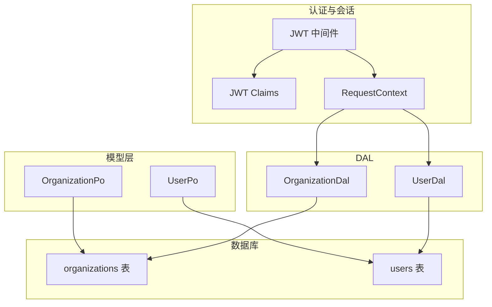
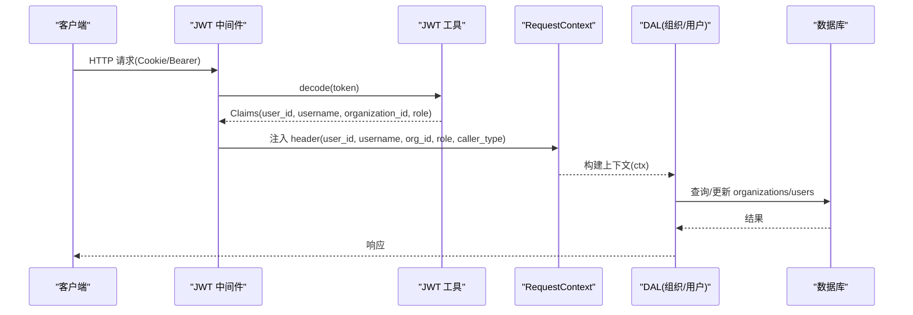
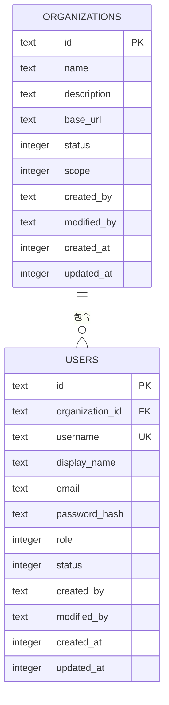
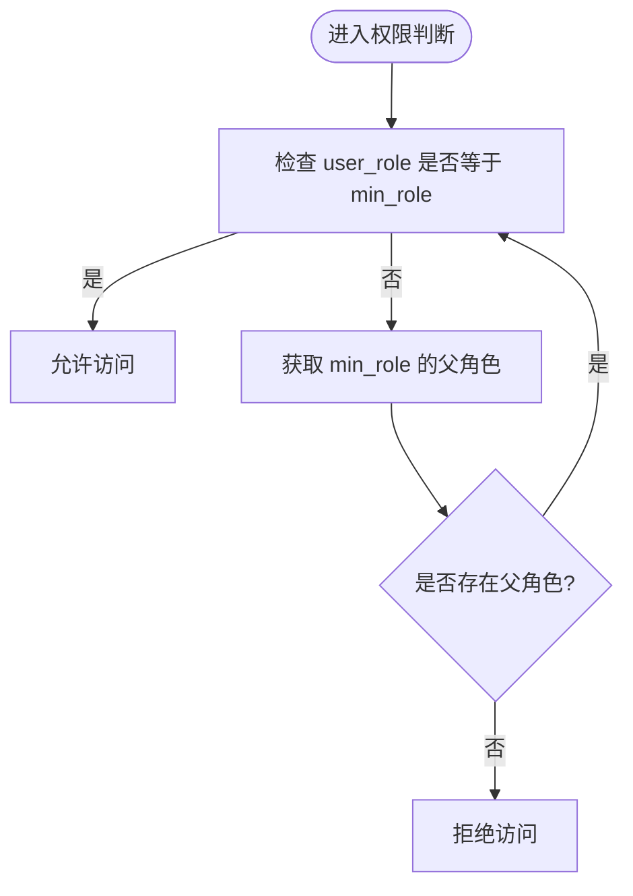
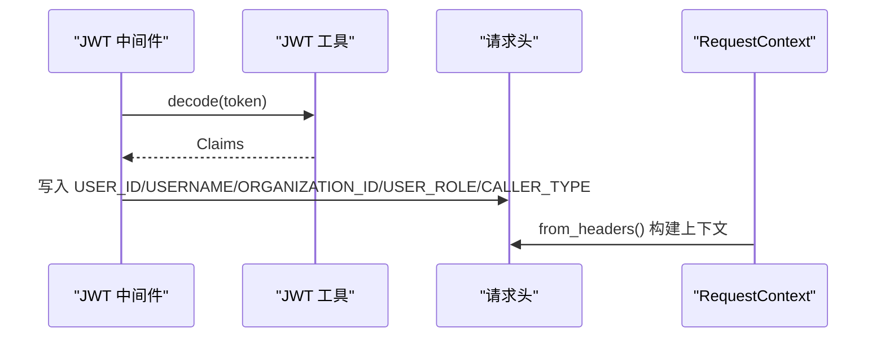
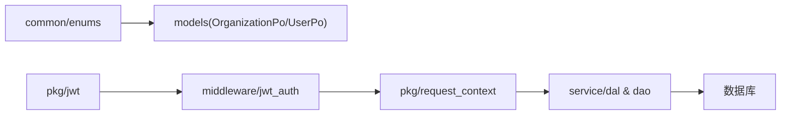

# 核心实体模型

<cite>
**本文引用的文件**
- [organization.rs](src/models/organization.rs)
- [user.rs](src/models/user.rs)
- [20260420000000_initial.sql](migrations/20260420000000_initial.sql)
- [organization.rs（枚举）](common/src/enums/organization.rs)
- [user.rs（枚举）](common/src/enums/user.rs)
- [jwt.rs](src/pkg/jwt.rs)
- [jwt_auth.rs](src/middleware/jwt_auth.rs)
- [request_context.rs](src/pkg/request_context.rs)
- [organization.rs（DAL）](src/service/dal/organization.rs)
- [user.rs（DAL）](src/service/dal/user.rs)
</cite>

## 目录
1. [简介](#简介)
2. [项目结构](#项目结构)
3. [核心组件](#核心组件)
4. [架构总览](#架构总览)
5. [详细组件分析](#详细组件分析)
6. [依赖关系分析](#依赖关系分析)
7. [性能考虑](#性能考虑)
8. [故障排查指南](#故障排查指南)
9. [结论](#结论)
10. [附录](#附录)

## 简介
本文件聚焦 AI Orz 的核心实体模型，围绕“组织”和“用户”两个核心领域，系统化说明：
- 实体字段定义、数据类型与约束
- 主键/外键、索引策略与唯一性约束
- 组织层级与多租户隔离机制
- 用户角色权限模型与认证相关字段
- 数据验证规则、业务规则与生命周期管理
- 会话管理与请求上下文贯穿

## 项目结构
与核心实体相关的代码主要分布在以下位置：
- 模型层：持久化对象定义（OrganizationPo、UserPo）
- 数据库迁移：建表语句、索引与约束
- 枚举层：组织状态/范围、用户角色/状态
- 认证与会话：JWT Claims、中间件注入、请求上下文
- DAL 层：统一的数据访问接口封装

图表来源
- [organization.rs:10-36](src/models/organization.rs#L10-L36)
- [user.rs:10-37](src/models/user.rs#L10-L37)
- [20260420000000_initial.sql:10-37](migrations/20260420000000_initial.sql#L10-L37)
- [jwt.rs:11-26](src/pkg/jwt.rs#L11-L26)
- [jwt_auth.rs:36-87](src/middleware/jwt_auth.rs#L36-L87)
- [request_context.rs:22-61](src/pkg/request_context.rs#L22-L61)
- [organization.rs（DAL）:37-73](src/service/dal/organization.rs#L37-L73)
- [user.rs（DAL）:35-71](src/service/dal/user.rs#L35-L71)

章节来源
- [organization.rs:10-36](src/models/organization.rs#L10-L36)
- [user.rs:10-37](src/models/user.rs#L10-L37)
- [20260420000000_initial.sql:10-37](migrations/20260420000000_initial.sql#L10-L37)

## 核心组件
- 组织实体 OrganizationPo
  - 标识与基础信息：id、name、description、base_url
  - 运行属性：status（启用/禁用）、scope（本地/远程）
  - 审计字段：created_by、modified_by、created_at、updated_at
- 用户实体 UserPo
  - 归属与身份：id、organization_id、username、display_name、email
  - 安全与权限：password_hash、role（超级管理员/管理员/成员）、status（启用/禁用）
  - 审计字段：created_by、modified_by、created_at、updated_at

章节来源
- [organization.rs:10-36](src/models/organization.rs#L10-L36)
- [user.rs:10-37](src/models/user.rs#L10-L37)

## 架构总览
从请求到数据的完整链路：
- 客户端携带 Cookie 或 Authorization: Bearer 发起请求
- JWT 中间件解析并校验 token，将 user_id、username、organization_id、user_role、caller_type 写入请求头
- RequestContext 从请求头构建，贯穿后续 DAL/DAO 调用
- DAL 通过 DAO 访问数据库，读写 organizations/users 等表

图表来源
- [jwt_auth.rs:36-87](src/middleware/jwt_auth.rs#L36-L87)
- [jwt.rs:70-100](src/pkg/jwt.rs#L70-L100)
- [request_context.rs:295-356](src/pkg/request_context.rs#L295-L356)
- [organization.rs（DAL）:82-124](src/service/dal/organization.rs#L82-L124)
- [user.rs（DAL）:80-145](src/service/dal/user.rs#L80-L145)

## 详细组件分析

### 组织实体（OrganizationPo）
- 字段与类型
  - id: TEXT（主键）
  - name: TEXT（非空）
  - description: TEXT（默认空）
  - base_url: TEXT（默认空，用于前端生成访问链接）
  - status: INTEGER（枚举映射：Active=1, Disabled=0）
  - scope: INTEGER（枚举映射：Local=0, Remote=1）
  - created_by/modified_by: TEXT（默认空）
  - created_at/updated_at: INTEGER（秒级时间戳）
- 约束与索引
  - 主键：id
  - 无显式外键；逻辑上由上层保证引用完整性
  - 索引：idx_organizations_id
- 业务规则
  - 创建时设置 created_by=modified_by，时间戳为当前秒
  - 状态与范围使用枚举，便于扩展与维护
- 示例数据
  - id: "org-001", name: "Acme 科技", description: "企业研发组织", base_url: "https://ai-orz.example.com/org/acme", status: Active, scope: Local, created_by: "admin", modified_by: "admin", created_at: 1710000000, updated_at: 1710000000

章节来源
- [organization.rs:10-36](src/models/organization.rs#L10-L36)
- [20260420000000_initial.sql:10-21](migrations/20260420000000_initial.sql#L10-L21)
- [organization.rs（枚举）:8-47](common/src/enums/organization.rs#L8-L47)
- [organization.rs（枚举）:55-100](common/src/enums/organization.rs#L55-L100)
- [20260420000000_initial.sql:247](migrations/20260420000000_initial.sql#L247)

### 用户实体（UserPo）
- 字段与类型
  - id: TEXT（主键）
  - organization_id: TEXT（所属组织，逻辑外键）
  - username: TEXT（唯一登录名，UNIQUE）
  - display_name: TEXT（默认空）
  - email: TEXT（默认空）
  - password_hash: TEXT（bcrypt 哈希）
  - role: INTEGER（枚举映射：SuperAdmin=0, Admin=1, Member=2）
  - status: INTEGER（枚举映射：Active=1, Disabled=0）
  - created_by/modified_by: TEXT（默认空）
  - created_at/updated_at: INTEGER（秒级时间戳）
- 约束与索引
  - 主键：id
  - 唯一约束：username
  - 索引：idx_users_id、idx_users_organization_id、idx_users_username
- 业务规则
  - 创建时填充 created_by=modified_by，时间戳为当前秒
  - 角色继承：Member → Admin → SuperAdmin，上级拥有下级全部权限
  - 提供 to_basic_info_prompt 方法用于向大模型暴露脱敏后的基本信息
- 示例数据
  - id: "user-001", organization_id: "org-001", username: "alice", display_name: "Alice", email: "alice@example.com", password_hash: "$2b$...", role: Admin, status: Active, created_by: "admin", modified_by: "admin", created_at: 1710000000, updated_at: 1710000000

章节来源
- [user.rs:10-37](src/models/user.rs#L10-L37)
- [20260420000000_initial.sql:24-37](migrations/20260420000000_initial.sql#L24-L37)
- [user.rs（枚举）:8-112](common/src/enums/user.rs#L8-L112)
- [user.rs（枚举）:114-159](common/src/enums/user.rs#L114-L159)
- [20260420000000_initial.sql:248-250](migrations/20260420000000_initial.sql#L248-L250)

### 组织与用户的关系设计
- 一对多关系：一个组织包含多个用户（organization_id 作为逻辑外键）
- 数据隔离：所有用户操作需携带 organization_id，DAL 支持按组织维度查询与统计
- 权限边界：用户角色决定跨组织/跨实体的访问能力（见下节）

图表来源
- [20260420000000_initial.sql:10-37](migrations/20260420000000_initial.sql#L10-L37)

章节来源
- [user.rs（DAL）:102-117](src/service/dal/user.rs#L102-L117)
- [organization.rs（DAL）:89-91](src/service/dal/organization.rs#L89-L91)

### 用户角色权限模型
- 角色层级：SuperAdmin（根）→ Admin → Member
- 权限判定：has_permission(user_role, min_role) 沿祖先链向上匹配
- 展示名称：display_name() 用于 UI 显示
- 应用：鉴权中间件与业务路由可基于 user_role 进行细粒度控制

图表来源
- [user.rs（枚举）:54-99](common/src/enums/user.rs#L54-L99)

章节来源
- [user.rs（枚举）:54-99](common/src/enums/user.rs#L54-L99)

### 认证与会话管理
- JWT Claims 包含：user_id、username、organization_id、role（兼容旧 token 可为 None）、exp、iat
- 中间件行为：
  - 优先从 Cookie 提取 token（浏览器场景），否则从 Authorization: Bearer 提取
  - 校验失败：浏览器返回 302 重定向，API 返回 401 JSON
  - 校验成功：将 user_id、username、organization_id、user_role、caller_type 注入请求头
- RequestContext：
  - 从请求头构建，贯穿 DAL/DAO 调用
  - 提供 caller_id/caller_role 等方法适配消息发送、统计等场景

图表来源
- [jwt_auth.rs:36-87](src/middleware/jwt_auth.rs#L36-L87)
- [jwt.rs:70-100](src/pkg/jwt.rs#L70-L100)
- [request_context.rs:295-356](src/pkg/request_context.rs#L295-L356)

章节来源
- [jwt.rs:11-26](src/pkg/jwt.rs#L11-L26)
- [jwt_auth.rs:36-87](src/middleware/jwt_auth.rs#L36-L87)
- [request_context.rs:295-356](src/pkg/request_context.rs#L295-L356)

### 数据验证规则与业务规则
- 组织
  - 必填：id、name、status、scope、created_at、updated_at
  - 可选：description、base_url、created_by、modified_by（默认空）
  - 状态：Active/Disabled 控制可用性与软删除语义
  - 范围：Local/Remote 区分本地与远程节点
- 用户
  - 必填：id、organization_id、username、password_hash、role、created_at、updated_at
  - 可选：display_name、email、created_by、modified_by（默认空）
  - 唯一性：username 全局唯一
  - 状态：Active/Disabled 控制账号可用性
  - 角色：继承体系与权限判定
- 审计字段：created_by/modified_by 与 created_at/updated_at 记录变更轨迹

章节来源
- [20260420000000_initial.sql:10-37](migrations/20260420000000_initial.sql#L10-L37)
- [organization.rs:38-60](src/models/organization.rs#L38-L60)
- [user.rs:39-97](src/models/user.rs#L39-L97)
- [user.rs（枚举）:8-112](common/src/enums/user.rs#L8-L112)
- [user.rs（枚举）:114-159](common/src/enums/user.rs#L114-L159)

### 生命周期管理
- 创建
  - 组织：new(id, name, description, base_url?, created_by)，自动设置时间与默认状态/范围
  - 用户：new(id, organization_id, username, display_name, email, password_hash, role, created_by)，自动设置时间与默认状态
- 查询
  - 组织：get_by_id、query、list_all、count_*
  - 用户：find_by_id、find_by_username、query、find_by_organization_id、count_*
- 更新/删除
  - 更新：update(org/user)，保持审计字段一致性
  - 删除：delete(org_id/user_id)，结合 status 实现软删除语义

章节来源
- [organization.rs:38-60](src/models/organization.rs#L38-L60)
- [user.rs:39-97](src/models/user.rs#L39-L97)
- [organization.rs（DAL）:82-124](src/service/dal/organization.rs#L82-L124)
- [user.rs（DAL）:80-145](src/service/dal/user.rs#L80-L145)

### 多租户隔离机制
- 组织维度隔离：所有用户数据通过 organization_id 限定
- 请求上下文：RequestContext 携带 organization_id，DAL 查询按组织过滤
- 统计与分页：DAL 提供 count_by_organization_id 等接口，确保按组织维度统计

章节来源
- [request_context.rs:22-61](src/pkg/request_context.rs#L22-L61)
- [user.rs（DAL）:102-117](src/service/dal/user.rs#L102-L117)
- [user.rs（DAL）:131-141](src/service/dal/user.rs#L131-L141)

## 依赖关系分析
- 模型依赖枚举：OrganizationPo/UserPo 依赖 common::enums 中的状态/角色/范围
- 认证依赖：JWT 工具负责签发/解码，中间件负责注入上下文
- DAL 依赖 DAO：DAL 仅暴露统一接口，具体 SQL 在 DAO 层实现
- 上下文贯穿：RequestContext 作为不可变对象，贯穿整个请求生命周期

图表来源
- [organization.rs:10-36](src/models/organization.rs#L10-L36)
- [user.rs:10-37](src/models/user.rs#L10-L37)
- [jwt.rs:70-100](src/pkg/jwt.rs#L70-L100)
- [jwt_auth.rs:36-87](src/middleware/jwt_auth.rs#L36-L87)
- [request_context.rs:295-356](src/pkg/request_context.rs#L295-L356)

章节来源
- [organization.rs（DAL）:37-73](src/service/dal/organization.rs#L37-L73)
- [user.rs（DAL）:35-71](src/service/dal/user.rs#L35-L71)

## 性能考虑
- 索引优化
  - users.username 唯一索引提升登录查找效率
  - users.organization_id 索引支撑按组织维度的列表与统计
  - organizations.id 主键索引保障快速定位
- 查询模式
  - DAL 提供通用 query/count，避免重复 SQL 拼装
  - 分页结果 PagedResult 减少不必要的数据传输
- 上下文开销
  - RequestContext 不可变，避免并发修改带来的锁竞争
  - 通过 builder/to_builder 高效克隆与扩展

[本节为通用指导，不直接分析具体文件]

## 故障排查指南
- 认证失败
  - 现象：浏览器 302 重定向或 API 401
  - 排查：确认 Cookie 名称 ai_orz_jwt 或 Authorization: Bearer 是否正确；检查 JWT 密钥与过期时间
- 上下文缺失
  - 现象：DAL 查询缺少 organization_id 导致数据越界
  - 排查：确认 JWT 中间件已前置执行，且 headers 中已注入 ORGANIZATION_ID 与 USER_ROLE
- 用户名冲突
  - 现象：创建用户时报唯一性错误
  - 排查：检查 users.username 的唯一约束

章节来源
- [jwt_auth.rs:139-155](src/middleware/jwt_auth.rs#L139-L155)
- [request_context.rs:295-356](src/pkg/request_context.rs#L295-L356)
- [20260420000000_initial.sql:24-37](migrations/20260420000000_initial.sql#L24-L37)

## 结论
AI Orz 的核心实体模型以组织和用户为中心，通过严格的字段定义、索引与唯一性约束，结合 JWT 认证与 RequestContext 贯穿的请求上下文，实现了清晰的多租户隔离与细粒度的权限控制。DAL 层提供统一的查询与统计接口，便于上层业务扩展与维护。建议在生产环境中严格遵循审计字段与状态枚举的使用规范，并结合索引策略优化高频查询路径。

## 附录
- 实体关系图（ER）

图表来源
- [20260420000000_initial.sql:10-37](migrations/20260420000000_initial.sql#L10-L37)