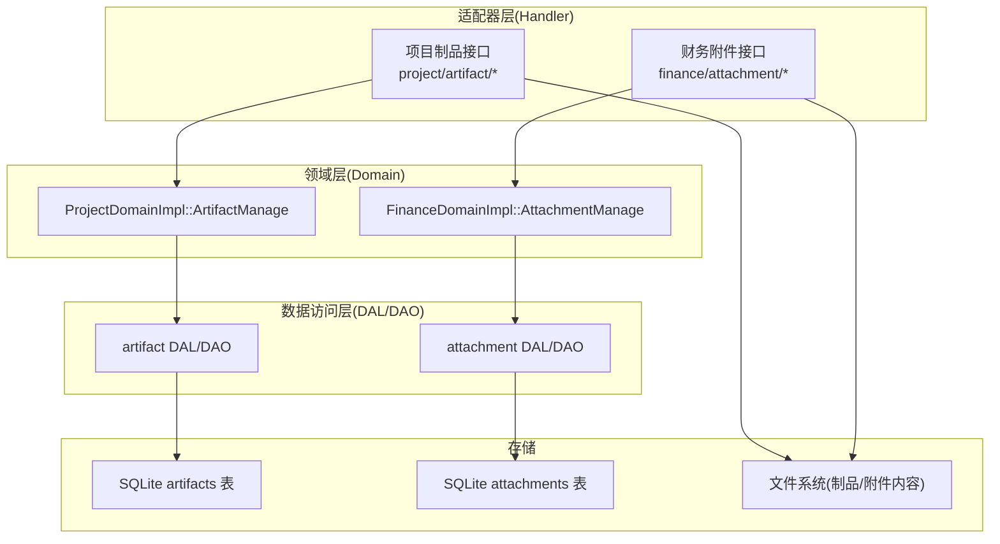
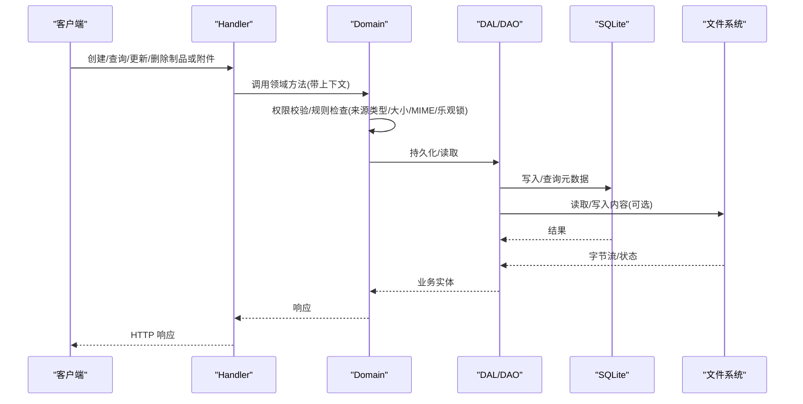
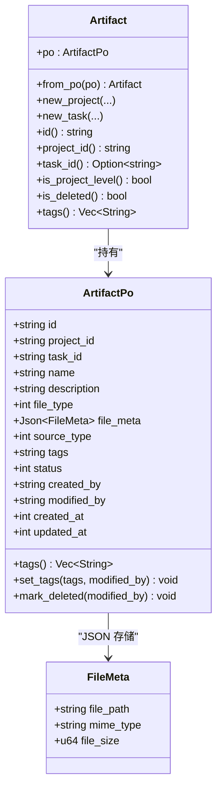
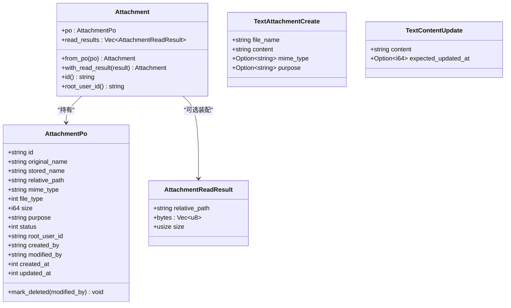
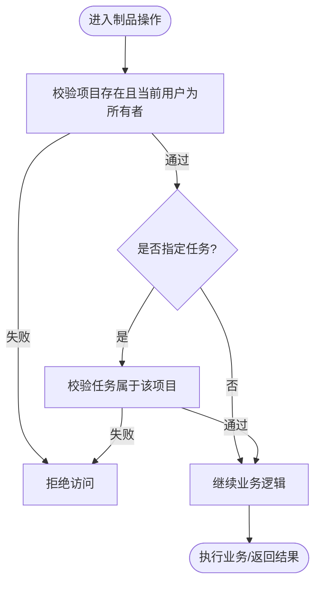
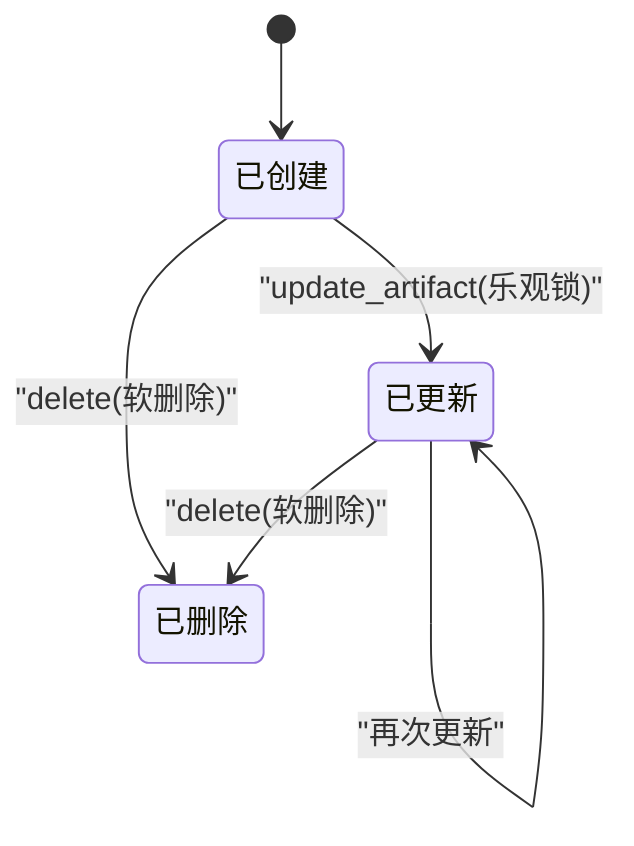
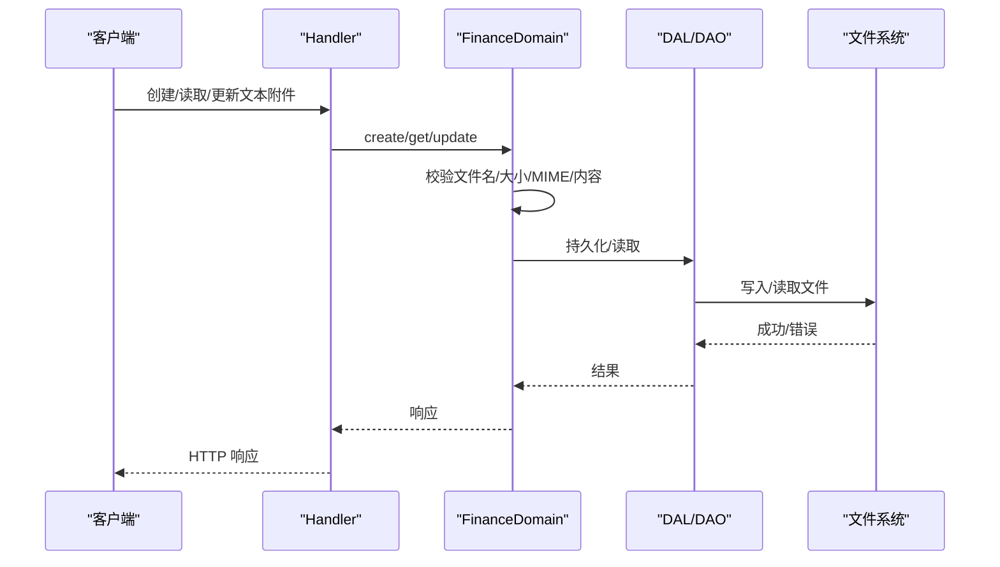
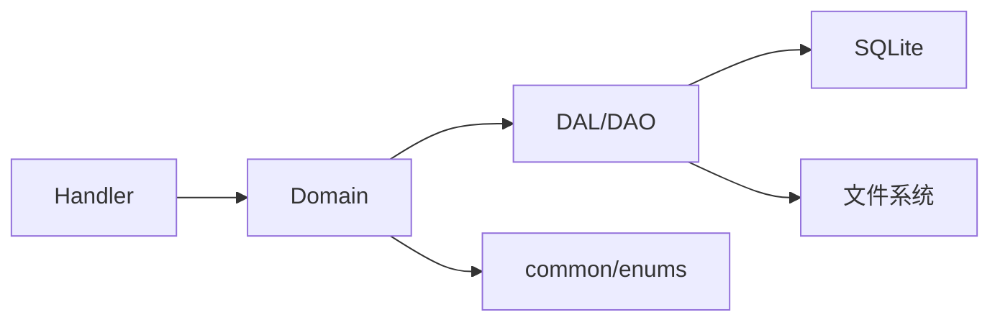

# 制品和附件

<cite>
**本文引用的文件**
- [src/models/artifact.rs](src/models/artifact.rs)
- [src/models/attachment.rs](src/models/attachment.rs)
- [src/models/file.rs](src/models/file.rs)
- [common/src/enums/artifact.rs](common/src/enums/artifact.rs)
- [common/src/enums/file.rs](common/src/enums/file.rs)
- [migrations/20260509000000_artifact_add_project_id.sql](migrations/20260509000000_artifact_add_project_id.sql)
- [migrations/20260617000000_attachments.sql](migrations/20260617000000_attachments.sql)
- [migrations/20260618000000_artifact_add_source_type.sql](migrations/20260618000000_artifact_add_source_type.sql)
- [src/service/domain/project/artifact.rs](src/service/domain/project/artifact.rs)
- [src/service/domain/finance/attachment.rs](src/service/domain/finance/attachment.rs)
- [src/handlers/project/artifact/mod.rs](src/handlers/project/artifact/mod.rs)
- [src/handlers/finance/attachment/mod.rs](src/handlers/finance/attachment/mod.rs)
- 【① Design 决策】[docs/archive/design-archive/attachment_storage.md](docs/archive/design-archive/attachment_storage.md) — Attachment 归 Finance 域通用资产 + Artifact 通过 attachment_id 引用
- 【① Design 决策】[docs/design/pagination_and_count_convention.md](docs/design/pagination_and_count_convention.md) — 通用 count 与 query 复用 push_query_filters
- 【① Design 决策】[docs/design/api_protocol_convention.md](docs/design/api_protocol_convention.md) — common DTO 单一事实源 + 禁止裸原始类型响应
- 【② Plan 落地】[docs/archive/plan-archive/项目任务增强.md](docs/archive/plan-archive/项目任务增强.md) — Project Artifact with_artifacts Option 字段按需注入
- 【② Plan 落地】[docs/archive/plan-archive/Query接口分页与List接口简化重构.md](docs/archive/plan-archive/Query接口分页与List接口简化重构.md) — PagedResult T map 三层转换
- 【② Plan 落地】[docs/archive/plan-archive/前端API协议结构重构.md](docs/archive/plan-archive/前端API协议结构重构.md) — 前端 DTO 镜像收敛到 common::api re-export
- 【④ RAG 知识卡】[附件存储与DTO协议统一](docs/wiki/knowledge/zh/附件存储与DTO协议统一：AttachmentFinance域资产%20+%20PagedResult%20T%20map全链路%20+%20common%3A%3Aapi单一事实源%20+%20count与query复用WHERE/附件存储与DTO协议统一：AttachmentFinance域资产%20+%20PagedResult%20T%20map全链路%20+%20common%3A%3Aapi单一事实源%20+%20count与query复用WHERE.md) — §1 Attachment Finance 域资产 §2 Artifact Project 域 §3 push_query_filters §8 条红线
</cite>

### 本文关联的三类文档（四类互引闭环）

**① 设计文档（Design）**：
- [项目领域架构设计](docs/archive/design-archive/project_design.md) — Project 实体一对多关联 Artifact 设计
- [项目管理增强设计](docs/archive/design-archive/project_management_design.md) — ArtifactManage 子管理入口 + 项目级/任务级双关联结构

**② 落地计划（Plan）**：
- [项目任务增强](docs/archive/plan-archive/项目任务增强.md) — Artifact with_artifacts Option 按需注入模式 + 三来源结构（attachment_id/generated_content/remote_url）

**④ RAG 原子知识卡**：
- [项目领域与制品聚合：ProjectService 六能力 + TaskGraph DAG 依赖编排 + Artifact 制品双关联 + 对话上下文聚合](docs/wiki/knowledge/zh/%E9%A1%B9%E7%9B%AE%E9%A2%86%E5%9F%9F%E4%B8%8E%E5%88%B6%E5%93%81%E8%81%9A%E5%90%88%EF%BC%9AProjectService%20%E5%85%AD%E8%83%BD%E5%8A%9B%20+%20TaskGraph%20DAG%20%E4%BE%9D%E8%B5%96%E7%BC%96%E6%8E%92%20+%20Artifact%20%E5%88%B6%E5%93%81%E5%8F%8C%E5%85%B3%E8%81%94%20+%20%E5%AF%B9%E8%AF%9D%E4%B8%8A%E4%B8%8B%E6%96%87%E8%81%9A%E5%90%88/%E9%A1%B9%E7%9B%AE%E9%A2%86%E5%9F%9F%E4%B8%8E%E5%88%B6%E5%93%81%E8%81%9A%E5%90%88%EF%BC%9AProjectService%20%E5%85%AD%E8%83%BD%E5%8A%9B%20+%20TaskGraph%20DAG%20%E4%BE%9D%E8%B5%96%E7%BC%96%E6%8E%92%20+%20Artifact%20%E5%88%B6%E5%93%81%E5%8F%8C%E5%85%B3%E8%81%94%20+%20%E5%AF%B9%E8%AF%9D%E4%B8%8A%E4%B8%8B%E6%96%87%E8%81%9A%E5%90%88.md) — ArtifactManage 三来源权限校验 + 制品双关联分层职责 + 红线（禁止 DAL 直接写文件系统）

## 目录
1. [简介](#简介)
2. [项目结构](#项目结构)
3. [核心组件](#核心组件)
4. [架构总览](#架构总览)
5. [详细组件分析](#详细组件分析)
6. [依赖关系分析](#依赖关系分析)
7. [性能考虑](#性能考虑)
8. [故障排查指南](#故障排查指南)
9. [结论](#结论)
10. [附录](#附录)

## 简介
本文件聚焦“制品（Artifact）与附件（Attachment）”的数据模型与实现，覆盖以下主题：
- 制品类型分类、版本管理、内容存储机制
- 附件上传、格式识别、大小限制策略
- 制品与项目的关联关系、访问权限与共享机制
- 文件元数据、标签系统与搜索索引能力
- 大文件处理、断点续传与缓存策略的技术现状与建议
- 制品生命周期管理、版本控制与回滚机制

## 项目结构
制品与附件在代码中遵循四层单向调用：Adapter（HTTP Handler）→ Domain → DAL → DAO。Domain 层定义业务实体与规则；DAL 使用业务实体进行跨层交互；DAO 负责持久化。PO（持久化对象）仅在 DAO/DAL 内部使用，不暴露到 Domain 及以上。

图表来源
- [src/handlers/project/artifact/mod.rs:1-24](src/handlers/project/artifact/mod.rs#L1-L24)
- [src/handlers/finance/attachment/mod.rs:1-21](src/handlers/finance/attachment/mod.rs#L1-L21)
- [src/service/domain/project/artifact.rs:1-532](src/service/domain/project/artifact.rs#L1-L532)
- [src/service/domain/finance/attachment.rs:1-248](src/service/domain/finance/attachment.rs#L1-L248)
- [migrations/20260509000000_artifact_add_project_id.sql:1-58](migrations/20260509000000_artifact_add_project_id.sql#L1-L58)
- [migrations/20260617000000_attachments.sql:1-23](migrations/20260617000000_attachments.sql#L1-L23)

章节来源
- [src/handlers/project/artifact/mod.rs:1-24](src/handlers/project/artifact/mod.rs#L1-L24)
- [src/handlers/finance/attachment/mod.rs:1-21](src/handlers/finance/attachment/mod.rs#L1-L21)

## 核心组件
- 制品 Artifact
  - 业务实体：封装 PO，提供创建项目级/任务级制品、标签设置、软删除等能力
  - 来源类型：支持 Attachment 引用型、GeneratedContent 生成内容型、RemoteUrl 预留扩展
  - 文件类型：Document/Image/Audio/Video/Binary
  - 元数据：FileMeta（路径、MIME、大小）以 JSON 存储
  - 标签：JSON 数组，支持增删改查
  - 权限：基于项目归属校验，仅项目所有者可读写
- 附件 Attachment
  - 通用上传资产，归属 Finance Domain
  - 文本附件：支持创建/读取/更新文本内容，含 MIME 白名单与大小限制
  - 文件类型：复用 FileType 枚举
  - 权限：按 root_user_id 隔离，仅上传者可访问

章节来源
- [src/models/artifact.rs:1-338](src/models/artifact.rs#L1-L338)
- [src/models/attachment.rs:1-186](src/models/attachment.rs#L1-L186)
- [src/models/file.rs:1-28](src/models/file.rs#L1-L28)
- [common/src/enums/artifact.rs:1-62](common/src/enums/artifact.rs#L1-L62)
- [common/src/enums/file.rs:1-56](common/src/enums/file.rs#L1-L56)
- [src/service/domain/project/artifact.rs:1-532](src/service/domain/project/artifact.rs#L1-L532)
- [src/service/domain/finance/attachment.rs:1-248](src/service/domain/finance/attachment.rs#L1-L248)

## 架构总览
制品与附件的完整调用链如下：
- 适配器层接收 HTTP 请求，解析参数并调用 Domain
- Domain 执行权限校验、业务规则（如来源类型限制、乐观锁、文本大小限制）
- DAL/DAO 完成数据库操作与文件读写
- 存储层包含 SQLite 元数据表与文件系统内容存储

图表来源
- [src/handlers/project/artifact/mod.rs:1-24](src/handlers/project/artifact/mod.rs#L1-L24)
- [src/handlers/finance/attachment/mod.rs:1-21](src/handlers/finance/attachment/mod.rs#L1-L21)
- [src/service/domain/project/artifact.rs:1-532](src/service/domain/project/artifact.rs#L1-L532)
- [src/service/domain/finance/attachment.rs:1-248](src/service/domain/finance/attachment.rs#L1-L248)
- [migrations/20260509000000_artifact_add_project_id.sql:1-58](migrations/20260509000000_artifact_add_project_id.sql#L1-L58)
- [migrations/20260617000000_attachments.sql:1-23](migrations/20260617000000_attachments.sql#L1-L23)

## 详细组件分析

### 制品 Artifact 数据模型
- 字段与类型
  - id、project_id、task_id（可选）、name、description
  - file_type（FileType）、source_type（ArtifactSourceType）
  - file_meta（JSON，FileMeta：file_path、mime_type、file_size）
  - tags（JSON 数组字符串）、status（软删除）、created_by/modified_by、时间戳
- 版本与变更
  - 通过 updated_at 与 expected_updated_at 实现乐观锁更新
  - 标签通过 set_tags 更新，自动更新时间戳与修改人
- 来源类型
  - Attachment：引用现有附件
  - GeneratedContent：由 Agent/运行时生成的内容，支持直接读写内容
  - RemoteUrl：预留扩展
- 文件类型
  - Document/Image/Audio/Video/Binary，用于过滤与展示

图表来源
- [src/models/artifact.rs:17-338](src/models/artifact.rs#L17-L338)
- [src/models/file.rs:1-28](src/models/file.rs#L1-L28)
- [common/src/enums/artifact.rs:1-62](common/src/enums/artifact.rs#L1-L62)
- [common/src/enums/file.rs:1-56](common/src/enums/file.rs#L1-L56)

章节来源
- [src/models/artifact.rs:17-338](src/models/artifact.rs#L17-L338)
- [common/src/enums/artifact.rs:1-62](common/src/enums/artifact.rs#L1-L62)
- [common/src/enums/file.rs:1-56](common/src/enums/file.rs#L1-L56)
- [migrations/20260509000000_artifact_add_project_id.sql:1-58](migrations/20260509000000_artifact_add_project_id.sql#L1-L58)
- [migrations/20260618000000_artifact_add_source_type.sql:1-7](migrations/20260618000000_artifact_add_source_type.sql#L1-L7)

### 附件 Attachment 数据模型
- 字段与类型
  - id、original_name、stored_name、relative_path
  - mime_type、file_type、size、purpose
  - status、root_user_id、created_by/modified_by、时间戳
- 文本附件能力
  - 创建：TextAttachmentCreate（文件名、UTF-8 内容、可选 MIME/用途）
  - 读取：AttachmentTextContent（内容、编码 utf-8、大小、更新时间）
  - 更新：TextContentUpdate（新内容、可选期望更新时间戳）
- 安全与限制
  - 文件名校验：禁止路径穿越、绝对路径、多段路径
  - 文本大小限制：最大 64KB
  - MIME 白名单：text/* 及若干常见文本应用类型
  - 扩展名白名单：txt/md/json/yaml/toml/csv/xml/rs/py/js/ts 等

图表来源
- [src/models/attachment.rs:1-186](src/models/attachment.rs#L1-L186)

章节来源
- [src/models/attachment.rs:1-186](src/models/attachment.rs#L1-L186)
- [src/service/domain/finance/attachment.rs:17-248](src/service/domain/finance/attachment.rs#L17-L248)
- [migrations/20260617000000_attachments.sql:1-23](migrations/20260617000000_attachments.sql#L1-L23)

### 制品与项目关联、访问权限与共享机制
- 关联关系
  - 制品属于项目（project_id），可关联任务（task_id 可选）
  - 列表查询支持按项目/任务/文件类型/来源类型过滤
- 访问权限
  - 所有写操作与读取均需校验项目归属（validate_project_access）
  - 若涉及任务，需校验任务属于该项目（validate_project_and_task）
- 共享机制
  - 当前实现为项目内共享（项目所有者可见）
  - 未实现跨项目共享或细粒度角色权限

图表来源
- [src/service/domain/project/artifact.rs:489-531](src/service/domain/project/artifact.rs#L489-L531)

章节来源
- [src/service/domain/project/artifact.rs:27-211](src/service/domain/project/artifact.rs#L27-L211)
- [src/service/domain/project/artifact.rs:489-531](src/service/domain/project/artifact.rs#L489-L531)

### 文件元数据、标签系统与搜索索引
- 文件元数据
  - FileMeta：file_path、mime_type、file_size，以 JSON 存储在 artifacts.file_meta
- 标签系统
  - tags 字段为 JSON 数组字符串，提供 tags()/set_tags() 便捷方法
- 搜索索引
  - 当前未见针对 artifacts/attachments 的全文检索索引
  - 项目具备 FTS5 能力（memory/entity 等），但尚未映射到制品/附件元数据

章节来源
- [src/models/artifact.rs:17-338](src/models/artifact.rs#L17-L338)
- [migrations/20260509000000_artifact_add_project_id.sql:11-58](migrations/20260509000000_artifact_add_project_id.sql#L11-L58)

### 大文件处理、断点续传与缓存策略
- 大文件处理
  - 附件上传：当前实现将文件内容作为字节向量处理，适合中小文件
  - 文本附件限制：最大 64KB，避免内存压力
- 断点续传
  - 当前未发现分片/断点续传实现
- 缓存策略
  - 当前未发现针对制品/附件内容的缓存层
- 建议
  - 引入分块上传与断点续传（记录分片状态、合并完成）
  - 对热读内容增加本地/分布式缓存（按 ID 或哈希键）
  - 对超大文件采用流式传输与按需加载

章节来源
- [src/service/domain/finance/attachment.rs:15-39](src/service/domain/finance/attachment.rs#L15-L39)
- [src/service/domain/finance/attachment.rs:187-196](src/service/domain/finance/attachment.rs#L187-L196)

### 制品生命周期管理、版本控制与回滚机制
- 生命周期
  - 创建：支持 Attachment 引用型与 GeneratedContent 生成内容型
  - 读取：支持元数据与内容读取（仅限 GeneratedContent）
  - 更新：支持名称/描述/标签/内容（仅 GeneratedContent），使用乐观锁
  - 删除：软删除（status=0）
- 版本控制
  - 通过 updated_at 与 expected_updated_at 实现并发控制
  - 未实现显式版本号（如语义化版本）
- 回滚机制
  - 未实现历史版本快照与一键回滚
  - 可通过外部备份或多次保存不同命名/标签实现简易回滚

图表来源
- [src/service/domain/project/artifact.rs:273-340](src/service/domain/project/artifact.rs#L273-L340)
- [src/models/artifact.rs:297-314](src/models/artifact.rs#L297-L314)

章节来源
- [src/service/domain/project/artifact.rs:27-499](src/service/domain/project/artifact.rs#L27-L499)
- [src/models/artifact.rs:297-314](src/models/artifact.rs#L297-L314)

### 文本附件流程与校验

图表来源
- [src/handlers/finance/attachment/mod.rs:1-21](src/handlers/finance/attachment/mod.rs#L1-L21)
- [src/service/domain/finance/attachment.rs:17-137](src/service/domain/finance/attachment.rs#L17-L137)

章节来源
- [src/service/domain/finance/attachment.rs:17-137](src/service/domain/finance/attachment.rs#L17-L137)

## 依赖关系分析
- 模块耦合
  - Handler 仅依赖 Domain 暴露的方法
  - Domain 依赖 DAL/DAO 与公共枚举（FileType、ArtifactSourceType）
  - DAL/DAO 依赖 SQLx 与文件系统
- 外部依赖
  - SQLite 存储元数据
  - 文件系统存储实际内容
- 潜在循环依赖
  - 当前未见循环依赖，遵循单向调用

图表来源
- [src/handlers/project/artifact/mod.rs:1-24](src/handlers/project/artifact/mod.rs#L1-L24)
- [src/handlers/finance/attachment/mod.rs:1-21](src/handlers/finance/attachment/mod.rs#L1-L21)
- [src/service/domain/project/artifact.rs:1-532](src/service/domain/project/artifact.rs#L1-L532)
- [src/service/domain/finance/attachment.rs:1-248](src/service/domain/finance/attachment.rs#L1-L248)
- [common/src/enums/artifact.rs:1-62](common/src/enums/artifact.rs#L1-L62)
- [common/src/enums/file.rs:1-56](common/src/enums/file.rs#L1-L56)

章节来源
- [src/service/domain/project/artifact.rs:1-532](src/service/domain/project/artifact.rs#L1-L532)
- [src/service/domain/finance/attachment.rs:1-248](src/service/domain/finance/attachment.rs#L1-L248)

## 性能考虑
- 小文件优先：当前附件上传以字节向量处理，适合中小文件
- 文本限制：文本附件限制 64KB，降低内存占用
- 索引优化：artifacts/attachments 表已建立常用索引（project_id、task_id、status、root_user_id、purpose、created_at）
- 建议：
  - 对大文件启用流式上传与分片
  - 对频繁读取的内容增加缓存层
  - 对列表查询结合分页与过滤条件，减少全表扫描

[本节为通用指导，无需特定文件来源]

## 故障排查指南
- 权限错误
  - 现象：访问制品/附件被拒绝
  - 原因：非项目所有者或非上传者
  - 定位：检查 validate_project_access/root_user_id 校验
- 冲突错误
  - 现象：更新失败提示冲突
  - 原因：expected_updated_at 与当前 updated_at 不一致
  - 定位：重新获取最新元数据后重试
- 文本内容错误
  - 现象：文本附件创建/更新失败
  - 原因：超过大小限制、包含 NUL 字节、MIME 不支持
  - 定位：检查 validate_text_content/validate_text_size/validate_text_mime
- 路径安全
  - 现象：路径穿越检测失败
  - 原因：文件名包含非法片段或目标路径不在允许目录
  - 定位：检查 validate_file_name 与目标路径前缀校验

章节来源
- [src/service/domain/project/artifact.rs:273-340](src/service/domain/project/artifact.rs#L273-L340)
- [src/service/domain/finance/attachment.rs:159-204](src/service/domain/finance/attachment.rs#L159-L204)

## 结论
- 制品与附件系统提供了清晰的数据模型与严格的权限控制
- 通过 FileType 与 ArtifactSourceType 实现了类型化与可扩展的来源管理
- 文本附件具备完善的校验与安全策略
- 当前未实现分片上传、断点续传、显式版本管理与回滚机制
- 建议在后续迭代中补充大文件处理、缓存与版本管理能力

[本节为总结性内容，无需特定文件来源]

## 附录
- 数据库迁移要点
  - artifacts 表：添加 project_id、task_id 可选、source_type、tags
  - attachments 表：通用上传资产表，包含索引
- 关键枚举
  - FileType：Document/Image/Audio/Video/Binary
  - ArtifactSourceType：Attachment/GeneratedContent/RemoteUrl

章节来源
- [migrations/20260509000000_artifact_add_project_id.sql:1-58](migrations/20260509000000_artifact_add_project_id.sql#L1-L58)
- [migrations/20260617000000_attachments.sql:1-23](migrations/20260617000000_attachments.sql#L1-L23)
- [migrations/20260618000000_artifact_add_source_type.sql:1-7](migrations/20260618000000_artifact_add_source_type.sql#L1-L7)
- [common/src/enums/file.rs:1-56](common/src/enums/file.rs#L1-L56)
- [common/src/enums/artifact.rs:1-62](common/src/enums/artifact.rs#L1-L62)