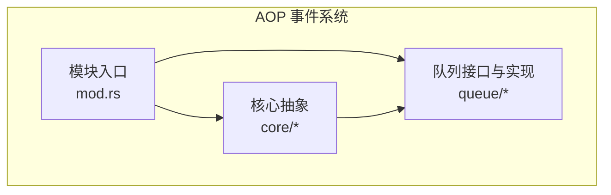
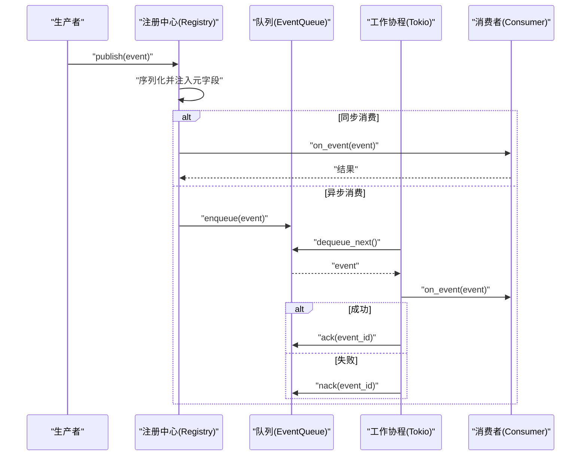
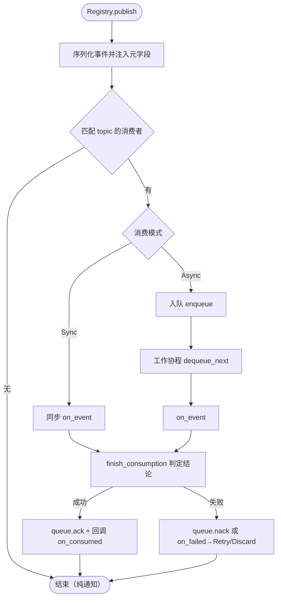
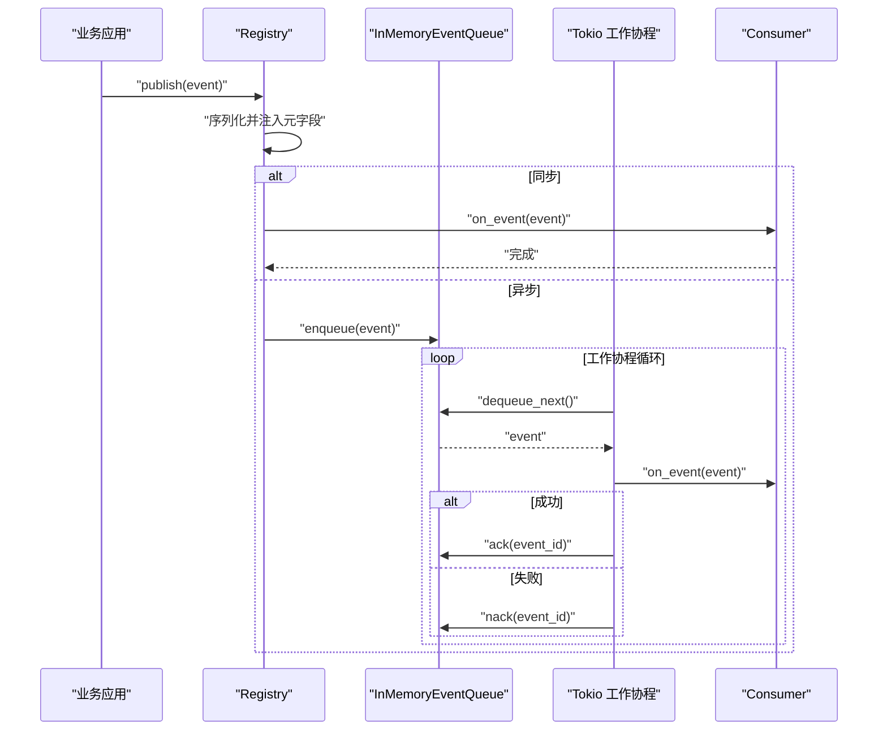
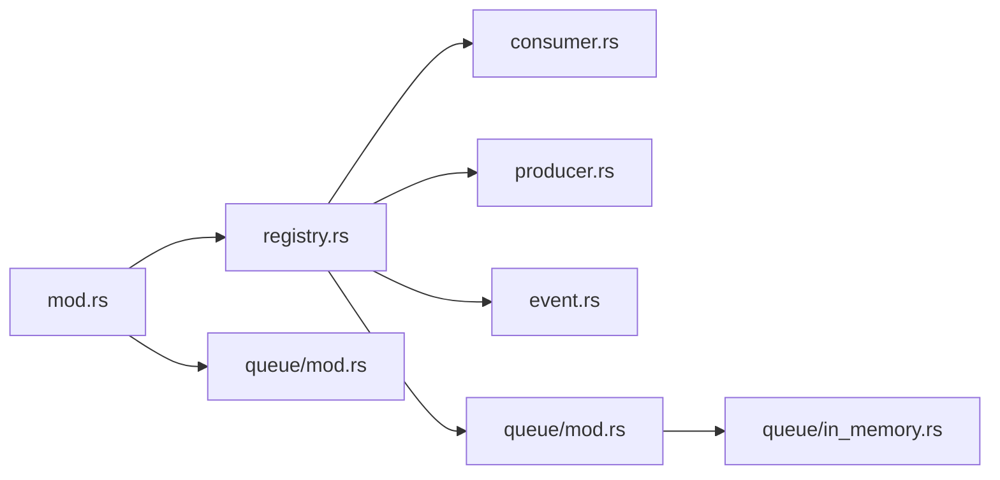

# AOP 事件系统架构

<cite>
**本文引用的文件**
- [src/pkg/aop/mod.rs](src/pkg/aop/mod.rs)
- [src/pkg/aop/core/mod.rs](src/pkg/aop/core/mod.rs)
- [src/pkg/aop/core/event.rs](src/pkg/aop/core/event.rs)
- [src/pkg/aop/core/producer.rs](src/pkg/aop/core/producer.rs)
- [src/pkg/aop/core/consumer.rs](src/pkg/aop/core/consumer.rs)
- [src/pkg/aop/core/registry.rs](src/pkg/aop/core/registry.rs)
- [src/pkg/aop/core/scheduler.rs](src/pkg/aop/core/scheduler.rs)
- [src/pkg/aop/queue/mod.rs](src/pkg/aop/queue/mod.rs)
- [src/pkg/aop/queue/in_memory.rs](src/pkg/aop/queue/in_memory.rs)
- [Domain 内部事件与消费者全链路：8 类 DomainEvent 枚举 + 8 类 Consumer 业务消费 + AOP Producer 投递入口 + Registry 订阅](docs/wiki/knowledge/zh/Domain 内部事件与消费者全链路：8 类 DomainEvent 枚举 + 8 类 Consumer 业务消费 + AOP Producer 投递入口 + Registry 订阅/Domain 内部事件与消费者全链路：8 类 DomainEvent 枚举 + 8 类 Consumer 业务消费 + AOP Producer 投递入口 + Registry 订阅.md)
</cite>

### 本文关联的三类文档（四类互引闭环）

**① 设计文档（Design）**：
- [消费者与生产者架构设计](docs/archive/design-archive/consumer_architecture.md) — AOP 生产消费异步框架完整设计（四角色协作图 + Sync/Async 双模式）
- [事件总线设计（归档参考）](docs/archive/design-archive/event_design.md) — ⚠️ 旧版 EventQueueDao 对比参考（已废弃）

**② 落地计划（Plan）**：
- [Agent 循环驱动引擎 Plan](docs/archive/plan-archive/agent_loop_engine_plan.md) — DomainEvent 8 类 → Consumer → Agent 唤醒链路 + 三层兜底架构

**④ RAG 原子知识卡**：
- [Domain 内部事件与消费者全链路：8 类 DomainEvent 枚举 + 8 类 Consumer 业务消费 + AOP Producer 投递入口 + Registry 订阅](docs/wiki/knowledge/zh/Domain%20%E5%86%85%E9%83%A8%E4%BA%8B%E4%BB%B6%E4%B8%8E%E6%B6%88%E8%B4%B9%E8%80%85%E5%85%A8%E9%93%BE%E8%B7%AF%EF%BC%9A8%20%E7%B1%BB%20DomainEvent%20%E6%9E%9A%E4%B8%BE%20+%208%20%E7%B1%BB%20Consumer%20%E4%B8%9A%E5%8A%A1%E6%B6%88%E8%B4%B9%20+%20AOP%20Producer%20%E6%8A%95%E9%80%92%E5%85%A5%E5%8F%A3%20+%20Registry%20%E8%AE%A2%E9%98%85/Domain%20%E5%86%85%E9%83%A8%E4%BA%8B%E4%BB%B6%E4%B8%8E%E6%B6%88%E8%B4%B9%E8%80%85%E5%85%A8%E9%93%BE%E8%B7%AF%EF%BC%9A8%20%E7%B1%BB%20DomainEvent%20%E6%9E%9A%E4%B8%BE%20+%208%20%E7%B1%BB%20Consumer%20%E4%B8%9A%E5%8A%A1%E6%B6%88%E8%B4%B9%20+%20AOP%20Producer%20%E6%8A%95%E9%80%92%E5%85%A5%E5%8F%A3%20+%20Registry%20%E8%AE%A2%E9%98%85.md) — Event/Publisher/Consumer/Registry 四角色协作 + SyncConsumer（立即处理，只返回 Ok/Err）vs AsyncConsumer（拉-ack/nack，三状态生命周期）

## 更新摘要
**变更内容**
- AOP 生产者-消费者契约重构（Step 1/2/3）同步：删除 `EventKind`，统一为 `EventTopic`（`common::enums::EventTopic`）；`Event::topic()` 改为 `Event::kind()`
- 订阅声明由 `interested_events()` 改为 `subscriptions() -> Vec<Subscription>`（含 `ordered` / `notify_producer` 语义）
- 生产者改用 `Producer::start(EventSink)` 自管循环（`ProducerLoop` 可中断 sleep）+ `EventSink` 预绑定 topic；删除 `poll` / `register` / `poll_interval_secs`
- 收尾统一为 `Registry::finish_consumption` 单一出口，按 topic 反查生产者回调 `on_consumed` / `on_failed`（后者接收 `decision`）；删除 `Consumer::ack/nack/source`
- `src/models/event.rs`（单数）已删除，采用 `pkg/aop/core/event.rs` 与 `src/models/events/`（复数）
- 引入 DAL-as-Producer 归属模型：拥有某 topic 收尾能力的对象自身即生产者（`1 producer : 1 topic`）

## 目录
1. [简介](#简介)
2. [项目结构](#项目结构)
3. [核心组件](#核心组件)
4. [架构总览](#架构总览)
5. [详细组件分析](#详细组件分析)
6. [依赖关系分析](#依赖关系分析)
7. [性能考量](#性能考量)
8. [故障排查指南](#故障排查指南)
9. [结论](#结论)
10. [附录：开发指南与配置](#附录：开发指南与配置)

## 简介
本文件为 AI Orz 系统的 AOP 事件系统架构文档，聚焦事件中心的设计原理与实现。内容涵盖生产者-消费者模式、事件队列管理、优先级排序与顺序保证机制；消息 Topic 的三层分发架构；同步/异步消费支持；生产者自管循环（ProducerLoop）与注册中心统一启动；崩溃恢复策略；Tokio 任务调度模型；相同 order_key 的顺序锁保证；以及事件总线架构图、事件流转图和关键配置选项。同时提供事件生产者和消费者的开发指南，帮助快速接入与扩展。

## 项目结构
AOP 事件系统位于 src/pkg/aop 下，采用分层与职责分离的组织方式：
- core：定义事件、消费者、生产者、注册中心、调度器等核心抽象与实现
- queue：事件队列接口与内存实现（可扩展持久化实现）
- mod：全局单例 Registry、便捷发布 API、初始化入口



图表来源
- [src/pkg/aop/mod.rs:1-61](src/pkg/aop/mod.rs#L1-L61)
- [src/pkg/aop/core/mod.rs:1-14](src/pkg/aop/core/mod.rs#L1-L14)
- [src/pkg/aop/queue/mod.rs:1-107](src/pkg/aop/queue/mod.rs#L1-L107)

章节来源
- [src/pkg/aop/mod.rs:1-61](src/pkg/aop/mod.rs#L1-L61)
- [src/pkg/aop/core/mod.rs:1-14](src/pkg/aop/core/mod.rs#L1-L14)

## 核心组件
- 事件 Event：携带数据与元信息（kind、id、order_key、priority、created_at），`kind()` 返回 `EventTopic`（`common::enums::EventTopic`），用于统一序列化与路由
- 消费者 Consumer：支持同步与异步两种消费模式；通过 `subscriptions() -> Vec<Subscription>` 声明订阅的 topic 及是否顺序消费、是否回调生产者；框架在 `finish_consumption` 统一判定投递结论，业务收尾回流到生产者
- 生产者 Producer：拥有某个 topic 的「业务收尾能力」的对象自身（`1 producer : 1 topic`）；用 `Producer::start(EventSink)` 自管循环（`ProducerLoop` 可中断 sleep），注册中心只 `start`/`stop`，不再代跑轮询
- 注册中心 Registry：维护「消费者 : topic」「生产者 : topic」双索引，负责事件分发、异步队列分配、工作协程启动、启动期校验与指标埋点
- 队列 EventQueue：抽象出入队、出队、确认、统计、查询等能力，当前提供内存实现
- 发布句柄 EventSink：由 AOP 在 `start_all` 时构造并预绑定生产者的 topic，`emit` 校验 `event.kind() == topic`（「1 producer : 1 topic」强制执行点）

章节来源
- [src/pkg/aop/core/event.rs:4-17](src/pkg/aop/core/event.rs#L4-L17)
- [src/pkg/aop/core/consumer.rs:22-34](src/pkg/aop/core/consumer.rs#L22-L34)
- [src/pkg/aop/core/consumer.rs:68-112](src/pkg/aop/core/consumer.rs#L68-L112)
- [src/pkg/aop/core/producer.rs:35-99](src/pkg/aop/core/producer.rs#L35-L99)
- [src/pkg/aop/core/event_sink.rs:20-54](src/pkg/aop/core/event_sink.rs#L20-L54)
- [src/pkg/aop/core/registry.rs:15-733](src/pkg/aop/core/registry.rs#L15-L733)
- [src/pkg/aop/core/registry.rs:734-802](src/pkg/aop/core/registry.rs#L734-L802)
- [src/pkg/aop/queue/mod.rs:1-107](src/pkg/aop/queue/mod.rs#L1-L107)

## 架构总览
AOP 事件系统采用“生产者-消费者 + 队列”的生产者-消费者模式，结合注册中心进行统一编排。事件通过统一 Event 抽象进入 Registry，按消费者感兴趣的事件类型进行分发；同步消费者直接执行，异步消费者入队并由 Tokio 工作协程拉取处理。队列层对同一 order_key 的事件进行顺序保证，避免乱序消费。



图表来源
- [src/pkg/aop/core/registry.rs](src/pkg/aop/core/registry.rs)
- [src/pkg/aop/core/registry.rs](src/pkg/aop/core/registry.rs)
- [src/pkg/aop/queue/mod.rs:77-107](src/pkg/aop/queue/mod.rs#L77-L107)
- [src/pkg/aop/queue/in_memory.rs:104-267](src/pkg/aop/queue/in_memory.rs#L104-L267)

## 详细组件分析

### 事件与元数据（Event）
- `kind()`：事件主题标识（返回 `EventTopic`），用于消费者订阅匹配与生产者归属反查
- id：唯一事件标识，用于去重与确认
- order_key：顺序键，相同 key 的事件将保持顺序消费
- priority：优先级，高优先级优先出队
- created_at：创建时间戳，用于排序与监控

章节来源
- [src/pkg/aop/core/event.rs:4-17](src/pkg/aop/core/event.rs#L4-L17)

### 消费者（Consumer）
- 支持同步与异步两种消费模式
- 用 `subscriptions() -> Vec<Subscription>` 声明订阅的 topic（含 `ordered` / `notify_producer` 语义），可自定义过滤 `should_consume`
- 投递结论由框架在 `finish_consumption` 统一判定：成功 → 回调生产者 `on_consumed` + `queue.ack`；失败 → 消费者 `decide_retry` 判定 `RetryDecision::{Retry,Discard}`
- 可配置并发 worker 数量、空队列休眠、错误重试休眠

章节来源
- [src/pkg/aop/core/consumer.rs:21-34](src/pkg/aop/core/consumer.rs#L21-L34)
- [src/pkg/aop/core/consumer.rs:67-112](src/pkg/aop/core/consumer.rs#L67-L112)

### 生产者（Producer）
- 拥有某 topic 业务收尾能力的对象自身（`1 producer : 1 topic`），`topic()` 声明归属
- 用 `Producer::start(EventSink)` 自管循环（`ProducerLoop` 可中断 sleep），`stop()` 置位并等 loop 退出；注册中心不再代跑轮询
- `EventSink` 在 `start_all` 时预绑定 `producer.topic()`，`emit` 校验 `event.kind() == topic`

章节来源
- [src/pkg/aop/core/producer.rs:34-99](src/pkg/aop/core/producer.rs#L34-L99)
- [src/pkg/aop/core/event_sink.rs:20-54](src/pkg/aop/core/event_sink.rs#L20-L54)

### 注册中心（Registry）
- 维护「消费者 : topic」「生产者 : topic」双索引；`Event::kind()` 即路由与生产者归属反查的唯一依据
- 事件发布时序列化并注入元字段，便于队列与监控读取
- 同步消费者直接 `on_event`；异步消费者入队，由工作协程拉取
- 启动时为每个异步消费者创建独立队列与工作协程，逐个 `EventSink::new(self, producer.topic())` + `producer.start(sink)`
- 启动期先校验「声明 `notify_producer` 的 topic 必须有生产者」，缺则启动 Err（早于 `started` 置位）



图表来源
- [src/pkg/aop/core/registry.rs](src/pkg/aop/core/registry.rs)
- [src/pkg/aop/core/registry.rs:343-733](src/pkg/aop/core/registry.rs#L343-L733)
- [src/pkg/aop/core/registry.rs:734-802](src/pkg/aop/core/registry.rs#L734-L802)

章节来源
- [src/pkg/aop/core/registry.rs](src/pkg/aop/core/registry.rs)

### 队列（EventQueue）与内存实现（InMemoryEventQueue）
- 接口包含 enqueue、dequeue_next、ack、nack、stats、query_events、get_event 等
- 内存实现使用全局堆与各 order_key 的有序队列，确保同 key 顺序消费
- 通过 has_active_message 标记某 order_key 是否已有活动消息，避免并行乱序
- 支持统计与查询，便于运维监控

```mermaid
classDiagram
class EventQueue {
+enqueue(ctx, event) Result
+enqueue_batch(ctx, events) Result
+dequeue_next(ctx) Result<Option<Value>>
+ack(ctx, event_id) Result
+nack(ctx, event_id) Result
+len() usize
+in_progress_count() usize
+recover(ctx) Result<usize>
+clear() void
+stats() QueueStats
+query_events(filter) Vec<EventSummary>
+get_event(event_id) Option<EventDetail>
}
class InMemoryEventQueue {
-events : HashMap<String, Value>
-queues : HashMap<String, BinaryHeap<EventRef>>
-global_heap : BinaryHeap<EventRef>
-in_progress : HashMap<String, (EventRef, String)>
-has_active_message : HashMap<String, bool>
-lock : Mutex<()>
}
EventQueue <|.. InMemoryEventQueue : "实现"
```

图表来源
- [src/pkg/aop/queue/mod.rs:1-107](src/pkg/aop/queue/mod.rs#L1-L107)
- [src/pkg/aop/queue/in_memory.rs:1-449](src/pkg/aop/queue/in_memory.rs#L1-L449)

章节来源
- [src/pkg/aop/queue/mod.rs:1-107](src/pkg/aop/queue/mod.rs#L1-L107)
- [src/pkg/aop/queue/in_memory.rs:1-449](src/pkg/aop/queue/in_memory.rs#L1-L449)

### 调度器（Scheduler）
- 通用定时任务抽象，提供 name、interval_secs、run 方法
- 可用于扩展周期性任务（如清理、重建索引等）

章节来源
- [src/pkg/aop/core/scheduler.rs:1-9](src/pkg/aop/core/scheduler.rs#L1-L9)

### 事件流转图（从生产到消费）


图表来源
- [src/pkg/aop/core/registry.rs](src/pkg/aop/core/registry.rs)
- [src/pkg/aop/core/registry.rs](src/pkg/aop/core/registry.rs)
- [src/pkg/aop/queue/in_memory.rs:104-267](src/pkg/aop/queue/in_memory.rs#L104-L267)

## 依赖关系分析
- Registry 依赖 Consumer、Producer、EventQueue、RequestContext、AopMetricsHook
- InMemoryEventQueue 依赖 RequestContext、serde_json、标准库容器
- 模块入口暴露全局 Registry 单例与便捷 publish/init_all API



图表来源
- [src/pkg/aop/mod.rs:1-61](src/pkg/aop/mod.rs#L1-L61)
- [src/pkg/aop/core/registry.rs:15-733](src/pkg/aop/core/registry.rs#L15-L733)
- [src/pkg/aop/queue/mod.rs:1-107](src/pkg/aop/queue/mod.rs#L1-L107)
- [src/pkg/aop/queue/in_memory.rs:1-449](src/pkg/aop/queue/in_memory.rs#L1-L449)

章节来源
- [src/pkg/aop/mod.rs:1-61](src/pkg/aop/mod.rs#L1-L61)
- [src/pkg/aop/core/registry.rs:15-733](src/pkg/aop/core/registry.rs#L15-L733)
- [src/pkg/aop/queue/mod.rs:1-107](src/pkg/aop/queue/mod.rs#L1-L107)

## 性能考量
- 优先级与顺序：全局堆 + 各 order_key 有序队列，高优先级优先出队；同 key 顺序消费
- 并发控制：消费者可配置 concurrency，默认 1，避免过度竞争
- 退避策略：空队列与错误重试均支持 sleep，降低 CPU 自旋
- 锁粒度：内存队列使用 Mutex 保护共享状态，减少竞争
- 指标埋点：通过 AopMetricsHook 在发布、消费开始、成功、失败处采集指标

[本节为通用指导，不直接分析具体文件]

## 故障排查指南
- 事件未消费：检查消费者 subscriptions() 是否声明对应 topic；查看队列 stats 与 query_events
- 顺序错乱：确认 order_key 设置一致；检查是否有多个并发 worker 消费同一 key
- 频繁重试：关注 error_retry_sleep_ms 配置；检查 nack 路径与队列状态
- 队列积压：观察 oldest_event_age_secs 与 pending_count；必要时扩容 consumer 并发
- 指标缺失：确认已注入 AopMetricsHook；检查 on_publish/on_consume_* 回调

章节来源
- [src/pkg/aop/core/registry.rs](src/pkg/aop/core/registry.rs)
- [src/pkg/aop/queue/in_memory.rs:300-447](src/pkg/aop/queue/in_memory.rs#L300-L447)

## 结论
AOP 事件系统以简洁清晰的抽象实现了可靠的生产者-消费者模型，支持同步与异步消费、优先级与顺序保证、工作协程并发与退避、以及完善的监控与查询能力。通过注册中心统一管理生命周期，易于扩展新的队列实现与调度任务。建议在生产环境结合持久化队列与外部存储，进一步提升可靠性与可观测性。

[本节为总结，不直接分析具体文件]

## 附录：开发指南与配置

### 事件生产者开发指南
- 实现 `Producer` trait，提供 `name` / `topic()` / `on_consumed` / `on_failed` / `start(EventSink)` / `stop`；归属契约为 `1 producer : 1 topic`
- 在 `producer::init()`（或 `dal::init()`）阶段调用 `Registry::register_producer` 注册；注册中心不再反向注入 `Arc<Registry>`
- 自管循环：`start()` 内用 `ProducerLoop` 的 `loop_ctl.sleep(interval)` 周期产出，并通过预绑定 topic 的 `EventSink::emit` 发布；删除 `poll` / `poll_interval_secs` / `register`
- 收尾回调：`on_consumed` 在 `queue.ack` 前调用（须幂等）；`Consumer::decide_retry` 判定 `RetryDecision` 决定重投（Retry）或放弃（Discard）

章节来源
- [src/pkg/aop/core/producer.rs:1-36](src/pkg/aop/core/producer.rs#L1-L36)
- [src/pkg/aop/core/registry.rs:102-141](src/pkg/aop/core/registry.rs#L102-L141)
- [src/pkg/aop/core/registry.rs:734-802](src/pkg/aop/core/registry.rs#L734-L802)

### 事件消费者开发指南
- 实现 `Consumer` trait，通过 `subscriptions() -> Vec<Subscription>` 声明订阅的 topic（含 `ordered` / `notify_producer`），并实现 `consume_mode` / `on_event`
- 投递结论由框架在 `finish_consumption` 统一判定：成功回调生产者 `on_consumed`，失败由 `Consumer::decide_retry` 判定 `RetryDecision`；无需自行实现 ack/nack
- 异步模式可通过 `concurrency` / `empty_queue_sleep_ms` / `error_retry_sleep_ms` 控制节奏；在启动阶段 `consumer::init` 注册，由 `aop::init_all` 统一 `start_all`

章节来源
- [src/pkg/aop/core/consumer.rs:1-72](src/pkg/aop/core/consumer.rs#L1-L72)
- [src/pkg/aop/mod.rs:48-61](src/pkg/aop/mod.rs#L48-L61)
- - [src/pkg/aop/core/registry.rs:53-90](src/pkg/aop/core/registry.rs#L53-L90)
- [src/pkg/aop/core/registry.rs:734-802](src/pkg/aop/core/registry.rs#L734-L802)

### 事件队列与顺序保证
- 使用 order_key 保证相同业务实体的事件顺序消费
- 内存队列通过 has_active_message 与有序队列配合，确保同 key 串行
- 可通过 stats/query_events/get_event 进行诊断与排障

章节来源
- [src/pkg/aop/queue/in_memory.rs:104-267](src/pkg/aop/queue/in_memory.rs#L104-L267)
- [src/pkg/aop/queue/in_memory.rs:300-447](src/pkg/aop/queue/in_memory.rs#L300-L447)

### 事件持久化策略说明
- 当前内存队列实现不包含持久化；如需持久化，可实现 EventQueue 并对接 SQLite messages 表或其他存储
- 建议在持久化实现中记录 message_id 元数据，并支持 recover/clear/stats/query_events
- 注意在持久化层实现相同的顺序与优先级语义，确保与内存实现行为一致

[本节为概念性说明，不直接分析具体文件]

### Tokio 任务调度模型
- 注册中心使用 tokio::spawn 启动消费者工作协程与轮询生产者
- 每个异步消费者可配置多个 worker，提升吞吐
- 空队列与错误场景使用 sleep 退避，避免忙等

章节来源
- [src/pkg/aop/core/registry.rs:291-342](src/pkg/aop/core/registry.rs#L291-L342)
- [src/pkg/aop/core/registry.rs:734-802](src/pkg/aop/core/registry.rs#L734-L802)

### 关键配置选项
- ConsumeMode：Sync/Async，选择同步或异步消费
- concurrency：异步消费者并发数
- empty_queue_sleep_ms：空队列休眠毫秒数
- error_retry_sleep_ms：错误重试休眠毫秒数
- ProducerLoop 休眠间隔：由生产者在 `start()` 内通过 `loop_ctl.sleep(interval)` 自行决定（如 `CronTriggerProducer` 每 60 秒）；框架不设 `poll_interval_secs`
- RetryDecision：由消费者 `decide_retry` 判为 `Retry`（重投）或 `Discard`（放弃 + 仍回调 `on_consumed`）；框架无框架侧 `max_retry`、无死信

章节来源
- [src/pkg/aop/core/consumer.rs:1-72](src/pkg/aop/core/consumer.rs#L1-L72)
- [src/pkg/aop/core/producer.rs:1-36](src/pkg/aop/core/producer.rs#L1-L36)