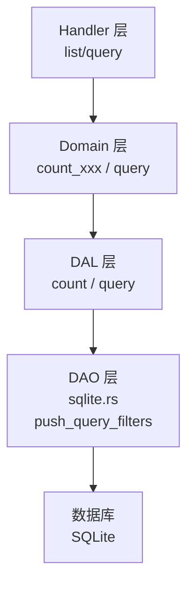
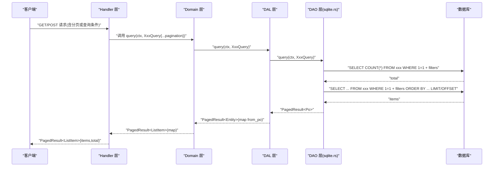
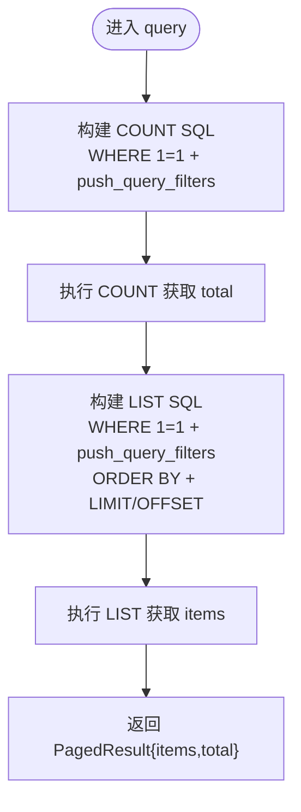
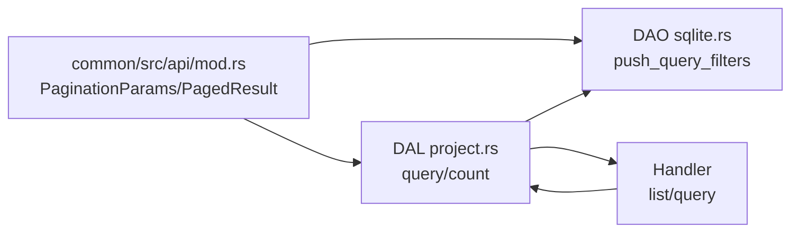

# 分页与计数规范

<cite>
**本文引用的文件**
- [docs/design/pagination_and_count_convention.md](docs/design/pagination_and_count_convention.md)
- [common/src/api/mod.rs](common/src/api/mod.rs)
- [src/service/dao/project/sqlite.rs](src/service/dao/project/sqlite.rs)
- [src/service/dal/project.rs](src/service/dal/project.rs)
- [common/src/api/project.rs](common/src/api/project.rs)
</cite>

## 目录
1. [引言](#引言)
2. [项目结构](#项目结构)
3. [核心组件](#核心组件)
4. [架构总览](#架构总览)
5. [详细组件分析](#详细组件分析)
6. [依赖分析](#依赖分析)
7. [性能考虑](#性能考虑)
8. [故障排查指南](#故障排查指南)
9. [结论](#结论)
10. [附录](#附录)

## 引言
本规范统一后端查询接口的分页与计数行为，确保所有实体在 Handler → Domain → DAL → DAO 的单向调用链中，使用一致的分页参数、分页结果与 count 实现模式。核心目标：
- query 是核心查询能力，list 是语法糖；两者统一返回 PagedResult<T>。
- count 与 query 复用同一套 WHERE 条件（push_query_filters），避免遗漏过滤条件导致统计不一致。
- 全链路透传 PaginationParams，DAO 层统一返回 PagedResult<Po>，上层通过 map 转换类型并保留 total。

## 项目结构
本项目采用严格四层单向调用：Adapter（HTTP Handler / 公开回调 / AOP Producer）→ Domain → DAL → DAO。分页与计数贯穿这四层：
- common/src/api 提供统一的 PaginationParams 与 PagedResult<T>。
- DAO 层 sqlite.rs 实现 push_query_filters，COUNT 与 LIST 复用该函数。
- DAL 层对外暴露 query/count，Domain 层以业务语义命名方法并透传 DAL。
- Handler 层 list 仅接受分页参数，query 接受完整查询条件 + pagination。

图表来源
- [common/src/api/mod.rs:55-83](common/src/api/mod.rs#L55-L83)
- [src/service/dao/project/sqlite.rs:101-137](src/service/dao/project/sqlite.rs#L101-L137)
- [src/service/dal/project.rs:132-140](src/service/dal/project.rs#L132-L140)

章节来源
- [docs/design/pagination_and_count_convention.md:1-262](docs/design/pagination_and_count_convention.md#L1-L262)
- [common/src/api/mod.rs:55-83](common/src/api/mod.rs#L55-L83)
- [src/service/dao/project/sqlite.rs:101-137](src/service/dao/project/sqlite.rs#L101-L137)
- [src/service/dal/project.rs:132-140](src/service/dal/project.rs#L132-L140)

## 核心组件
- 统一分页参数：PaginationParams（limit、offset）。
- 统一分页结果：PagedResult<T>（items、total），并提供 map 用于类型转换并保持 total。
- DAO 过滤复用：push_query_filters 为 COUNT/LIST 共用 WHERE 条件构造器。
- 三层 count 签名：DAO/DAL/Domain 均支持 count(ctx, query) -> u64，特定 count_by_xxx 退化为构造 Query 后调用通用 count。

章节来源
- [common/src/api/mod.rs:55-83](common/src/api/mod.rs#L55-L83)
- [docs/design/pagination_and_count_convention.md:25-83](docs/design/pagination_and_count_convention.md#L25-L83)
- [docs/design/pagination_and_count_convention.md:153-209](docs/design/pagination_and_count_convention.md#L153-L209)

## 架构总览
以下序列图展示一次“列表查询”的全链路调用流程，体现分页参数透传与 PagedResult 的类型转换。

图表来源
- [src/service/dao/project/sqlite.rs:101-137](src/service/dao/project/sqlite.rs#L101-L137)
- [src/service/dal/project.rs:132-140](src/service/dal/project.rs#L132-L140)
- [common/src/api/mod.rs:55-83](common/src/api/mod.rs#L55-L83)

## 详细组件分析

### 基础设施：PaginationParams 与 PagedResult<T>
- PaginationParams：包含可选 limit 与 offset，作为分页参数在各层间透传。
- PagedResult<T>：包含 items 与 total，提供 map 方法用于 PO → 业务实体 → ListItem 的链式转换，保持 total 不变。

章节来源
- [common/src/api/mod.rs:55-83](common/src/api/mod.rs#L55-L83)
- [docs/design/pagination_and_count_convention.md:25-44](docs/design/pagination_and_count_convention.md#L25-L44)

### DAO 层：ProjectDaoSqliteImpl 的分页与计数
- query：先执行 COUNT 查询获取 total，再执行 LIST 查询获取 items；WHERE 条件通过 push_query_filters 复用。
- count：直接复用 push_query_filters 执行 SELECT COUNT(*)，返回 u64。
- 语法糖方法：如 count_by_root_user、count_by_root_user_and_status 内部构造 ProjectQuery 后调用通用 count。

图表来源
- [src/service/dao/project/sqlite.rs:101-137](src/service/dao/project/sqlite.rs#L101-L137)
- [src/service/dao/project/sqlite.rs:275-281](src/service/dao/project/sqlite.rs#L275-L281)
- [src/service/dao/project/sqlite.rs:398-436](src/service/dao/project/sqlite.rs#L398-L436)

章节来源
- [src/service/dao/project/sqlite.rs:101-137](src/service/dao/project/sqlite.rs#L101-L137)
- [src/service/dao/project/sqlite.rs:245-281](src/service/dao/project/sqlite.rs#L245-L281)
- [src/service/dao/project/sqlite.rs:398-436](src/service/dao/project/sqlite.rs#L398-L436)

### DAL 层：ProjectDal 的 query 与 count
- query：对外返回 PagedResult<Project>，内部委托 DAO 的 query 并通过 map 将 Po 转换为业务实体。
- count：对外返回 u64，内部透传 DAO 的 count。
- 搜索：search 返回 PagedResult<Project>，结合 FTS5 与向量检索策略。

章节来源
- [src/service/dal/project.rs:132-181](src/service/dal/project.rs#L132-L181)

### Handler 层：list 与 query 的职责划分
- list：只接受分页参数（limit/offset），内部固定默认过滤与排序，面向简单列表场景。
- query：接受完整查询条件 + pagination，面向复杂筛选与搜索场景。
- 响应：统一返回 PagedResult<ListItem>，通过 map 完成类型转换。

章节来源
- [common/src/api/project.rs:65-72](common/src/api/project.rs#L65-L72)
- [docs/design/pagination_and_count_convention.md:11-24](docs/design/pagination_and_count_convention.md#L11-L24)
- [docs/design/pagination_and_count_convention.md:105-141](docs/design/pagination_and_count_convention.md#L105-L141)

### 各实体的 list 默认过滤与排序
- Agent：排除 Deleted，按 created_at DESC。
- Project：排除软删除（status != 0），按 priority DESC, created_at DESC。
- Task：排除软删除（status != 0），按 priority DESC, created_at DESC。
- Tool：无默认过滤，按 created_at DESC。
- Skill：排除 Expired，按 updated_at DESC。

章节来源
- [docs/design/pagination_and_count_convention.md:143-152](docs/design/pagination_and_count_convention.md#L143-L152)

### 通用 count 方法与语法糖
- 核心：count(ctx, query) 复用 push_query_filters，仅执行 SELECT COUNT(*)。
- 语法糖：count_by_xxx 构造 Query 后调用通用 count，避免重复 SQL 拼接。
- 三层签名统一：DAO/DAL/Domain 均遵循相同模式，便于维护与扩展。

章节来源
- [docs/design/pagination_and_count_convention.md:153-209](docs/design/pagination_and_count_convention.md#L153-L209)
- [src/service/dao/project/sqlite.rs:245-281](src/service/dao/project/sqlite.rs#L245-L281)

## 依赖分析
- common/src/api 提供跨层共享的分页基础类型。
- DAO 层依赖 sqlx::QueryBuilder 动态构建 SQL，复用 push_query_filters。
- DAL 层依赖 DAO 接口，封装业务逻辑与类型转换。
- Handler 层依赖 DAL 接口，负责参数校验与响应组装。

图表来源
- [common/src/api/mod.rs:55-83](common/src/api/mod.rs#L55-L83)
- [src/service/dao/project/sqlite.rs:398-436](src/service/dao/project/sqlite.rs#L398-L436)
- [src/service/dal/project.rs:132-140](src/service/dal/project.rs#L132-L140)

章节来源
- [common/src/api/mod.rs:55-83](common/src/api/mod.rs#L55-L83)
- [src/service/dao/project/sqlite.rs:398-436](src/service/dao/project/sqlite.rs#L398-L436)
- [src/service/dal/project.rs:132-140](src/service/dal/project.rs#L132-L140)

## 性能考虑
- COUNT 与 LIST 复用同一套 WHERE 条件，减少重复拼接与维护成本。
- SQLite 下当仅有 offset 时，需显式 LIMIT -1 以保证 OFFSET 生效。
- 搜索场景限制最大返回数量，避免关键词失控导致全量返回。
- 使用 PagedResult.map 进行类型转换，避免额外遍历与内存分配。

章节来源
- [src/service/dao/project/sqlite.rs:121-128](src/service/dao/project/sqlite.rs#L121-L128)
- [src/service/dao/project/sqlite.rs:353-358](src/service/dao/project/sqlite.rs#L353-L358)
- [common/src/api/mod.rs:75-83](common/src/api/mod.rs#L75-L83)

## 故障排查指南
- 若 list 接口出现非预期过滤，检查是否误加了查询字段（应走 query 接口）。
- 若 total 与实际数据不一致，确认 push_query_filters 是否覆盖所有必要条件。
- 若 OFFSET 不生效，确认是否设置了 LIMIT -1（当仅有 offset 时）。
- 若 count_by_xxx 未同步新增过滤条件，改为构造 Query 后调用通用 count。

章节来源
- [docs/design/pagination_and_count_convention.md:210-246](docs/design/pagination_and_count_convention.md#L210-L246)
- [src/service/dao/project/sqlite.rs:121-128](src/service/dao/project/sqlite.rs#L121-L128)
- [src/service/dao/project/sqlite.rs:398-436](src/service/dao/project/sqlite.rs#L398-L436)

## 结论
本规范通过统一分页参数、分页结果与 count 实现模式，确保多实体在多层的查询一致性。关键要点：
- 使用 PaginationParams 与 PagedResult<T> 贯穿全链路。
- DAO 层通过 push_query_filters 复用 WHERE 条件，保证 COUNT 与 LIST 的一致性。
- list 仅接受分页，query 接受完整查询条件；count_by_xxx 退化为语法糖。
- 遵循四层单向调用与类型转换最佳实践，提升可维护性与性能。

## 附录
- 参考实现：
  - 基础设施：common/src/api/mod.rs 中的 PaginationParams 与 PagedResult<T>。
  - DAO 分页参考：src/service/dao/project/sqlite.rs 的 query 与 push_query_filters。
  - DAL 参考：src/service/dal/project.rs 的 query 与 count。
  - Handler 参考：common/src/api/project.rs 的 ListProjectsRequest。

章节来源
- [docs/design/pagination_and_count_convention.md:248-257](docs/design/pagination_and_count_convention.md#L248-L257)
- [common/src/api/mod.rs:55-83](common/src/api/mod.rs#L55-L83)
- [src/service/dao/project/sqlite.rs:101-137](src/service/dao/project/sqlite.rs#L101-L137)
- [src/service/dal/project.rs:132-140](src/service/dal/project.rs#L132-L140)
- [common/src/api/project.rs:65-72](common/src/api/project.rs#L65-L72)