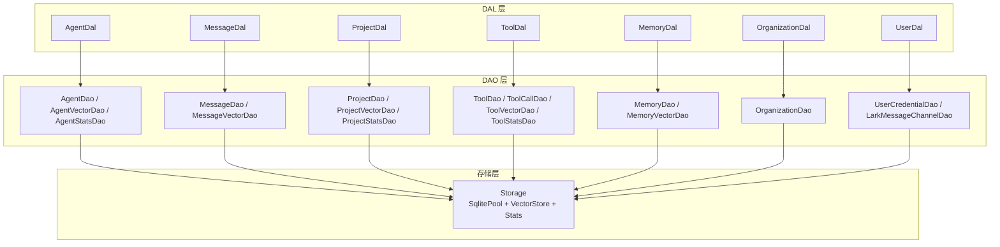
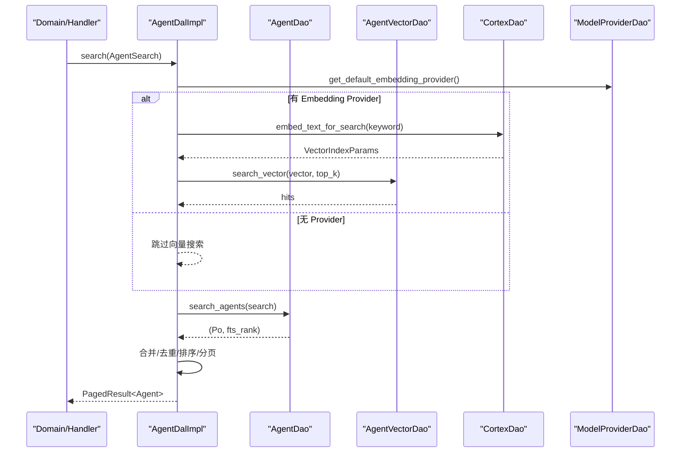
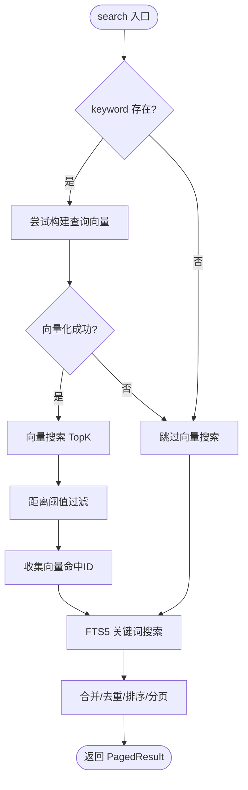
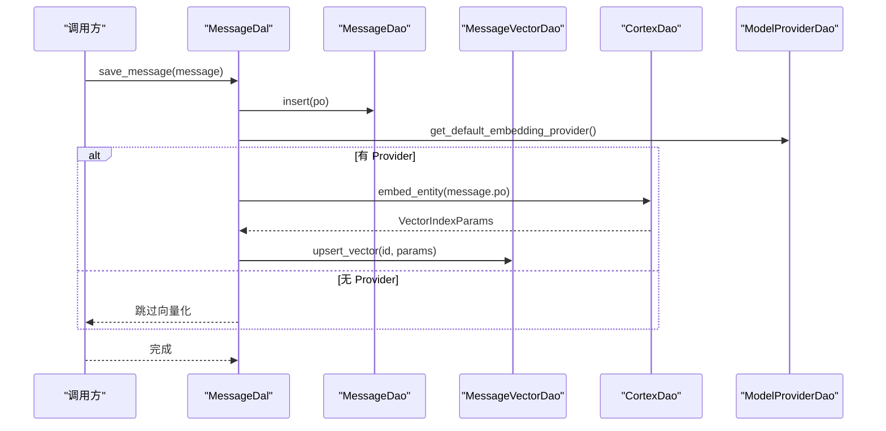
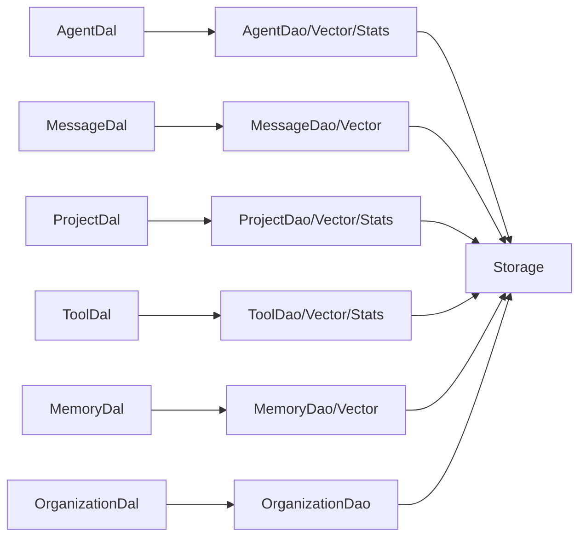

# DAL 层组合

<cite>
**本文引用的文件**
- [src/service/dal/mod.rs](src/service/dal/mod.rs)
- [src/service/dal/agent.rs](src/service/dal/agent.rs)
- [src/service/dal/message.rs](src/service/dal/message.rs)
- [src/service/dal/project.rs](src/service/dal/project.rs)
- [src/service/dal/tool.rs](src/service/dal/tool.rs)
- [src/service/dal/memory.rs](src/service/dal/memory.rs)
- [src/service/dal/organization.rs](src/service/dal/organization.rs)
- [src/service/dal/user.rs](src/service/dal/user.rs)
- [src/service/dao/mod.rs](src/service/dao/mod.rs)
- [src/service/dao/agent/mod.rs](src/service/dao/agent/mod.rs)
- [src/service/dao/user_credential/mod.rs](src/service/dao/user_credential/mod.rs)
- [src/service/dao/lark_message_channel/mod.rs](src/service/dao/lark_message_channel/mod.rs)
- [src/pkg/storage/mod.rs](src/pkg/storage/mod.rs)
- [src/models/user_credential.rs](src/models/user_credential.rs)

### 本文关联的设计/计划文档
- [用户身份凭证独立表设计](docs/design/user_credentials_design.md) — UserCredentialDao 一表一 DAO 模式、行级 CRUD
- [用户身份凭证独立表落地](docs/plan/用户身份凭证独立表落地.md) — UserDal 凭证方法替换、DAO/DAL 变更
</cite>

## 更新摘要
**变更内容（2026-08-19 增量更新）**
- 新增 UserDal：组合 UserCredentialDao 提供凭证 CRUD、默认凭证管理
- 新增 UserCredentialDao：独立 user_credentials 表 DAO，行级 CRUD 取代原 JSON read-modify-write
- 新增 LarkMessageChannelDao：Lark 消息通道外部 API 出站调用
- 更新 DAL/DAO 架构图：反映 UserDal + UserCredentialDao + LarkMessageChannelDao

## 目录
1. [简介](#简介)
2. [项目结构](#项目结构)
3. [核心组件](#核心组件)
4. [架构总览](#架构总览)
5. [详细组件分析](#详细组件分析)
6. [依赖关系分析](#依赖关系分析)
7. [性能与优化](#性能与优化)
8. [故障排查指南](#故障排查指南)
9. [结论](#结论)
10. [附录：跨表查询组合示例](#附录跨表查询组合示例)

## 简介
本文件面向 AI Orz 系统的 DAL（数据访问组合）层，系统性阐述其职责、设计模式与实现要点。DAL 位于 Domain 之下、DAO 之上，负责将多个 DAO 调用组合为面向领域的查询与操作，对外暴露业务实体接口，内部使用 PO 进行持久化。DAL 统一封装了混合搜索（FTS5 + 向量）、统计聚合、批量操作、向量化索引维护等能力，并通过 RequestContext 贯穿上下文，确保可观测性与可测试性。

## 项目结构
DAL 层按领域划分模块，每个模块提供 trait 接口与具体实现，通过单例管理并集中初始化。DAO 层按领域拆分并提供 SQLite/向量/统计等子模块。存储层提供连接池、向量后端选择与 Stats 初始化。

图表来源
- [src/service/dal/mod.rs:30-76](src/service/dal/mod.rs#L30-L76)
- [src/service/dao/mod.rs:1-56](src/service/dao/mod.rs#L1-L56)
- [src/pkg/storage/mod.rs:36-122](src/pkg/storage/mod.rs#L36-L122)

章节来源
- [src/service/dal/mod.rs:1-76](src/service/dal/mod.rs#L1-L76)
- [src/service/dao/mod.rs:1-56](src/service/dao/mod.rs#L1-L56)
- [src/pkg/storage/mod.rs:36-122](src/pkg/storage/mod.rs#L36-L122)

## 核心组件
- AgentDal：组合 AgentDao、AgentVectorDao、AgentStatsDao、CortexDao、ModelProviderDao，提供创建/更新/删除、综合查询、混合搜索、统计获取、向量重建等能力。
- MessageDal：组合 MessageDao、MessageVectorDao、CortexDao、ModelProviderDao，提供消息保存、查询、状态更新、搜索、向量重建等能力。
- ProjectDal：组合 ProjectDao、ProjectVectorDao、ProjectStatsDao、CortexDao、ModelProviderDao，提供 CRUD、综合查询、混合搜索、统计获取、归档清理等能力。
- ToolDal：组合 ToolDao、ToolCallDao、ToolVectorDao、CortexDao、ModelProviderDao、ToolStatsDao，提供工具注册、执行、搜索、统计、内置工具同步等能力。
- MemoryDal：组合 MemoryDao、MemoryVectorDao、CortexDao、ModelProviderDao，提供记忆创建/更新/删除、混合搜索、知识图谱遍历、短期记忆沉淀、向量重建等能力。
- OrganizationDal：组合 OrganizationDao，提供组织初始化检查、CRUD、计数等能力。
- UserDal：组合 UserCredentialDao、LarkMessageChannelDao，提供凭证 CRUD、默认凭证管理、Lark 消息通道配置与推送等能力。

章节来源
- [src/service/dal/agent.rs:28-73](src/service/dal/agent.rs#L28-L73)
- [src/service/dal/message.rs:20-47](src/service/dal/message.rs#L20-L47)
- [src/service/dal/project.rs:27-67](src/service/dal/project.rs#L27-L67)
- [src/service/dal/tool.rs:20-59](src/service/dal/tool.rs#L20-L59)
- [src/service/dal/memory.rs:39-68](src/service/dal/memory.rs#L39-L68)
- [src/service/dal/organization.rs:13-32](src/service/dal/organization.rs#L13-L32)
- [src/service/dal/user.rs:28-73](src/service/dal/user.rs#L28-L73)

## 架构总览
DAL 层采用“组合模式”：每个 DAL 持有多个 DAO 的 trait 对象，通过方法编排完成复杂业务逻辑。统一的 SearchParams/Query/Search 参数在 DAL 层组装，DAO 层专注 SQL/向量/统计的具体实现。存储层通过 Storage 统一管理 SqlitePool、VectorStore 与 Stats，支持多后端向量存储与连接池配置。

图表来源
- [src/service/dal/agent.rs:474-699](src/service/dal/agent.rs#L474-L699)
- [src/service/dao/agent/mod.rs:63-90](src/service/dao/agent/mod.rs#L63-L90)
- [src/pkg/storage/mod.rs:78-93](src/pkg/storage/mod.rs#L78-L93)

章节来源
- [src/service/dal/agent.rs:474-699](src/service/dal/agent.rs#L474-L699)
- [src/service/dao/agent/mod.rs:63-90](src/service/dao/agent/mod.rs#L63-L90)
- [src/pkg/storage/mod.rs:78-93](src/pkg/storage/mod.rs#L78-L93)

## 详细组件分析

### AgentDal 组合与混合搜索
- 组合点：AgentDao（基础 CRUD/查询/搜索）、AgentVectorDao（向量索引）、AgentStatsDao（唤醒统计）、CortexDao（向量化）、ModelProviderDao（Embedding Provider）。
- 关键流程：
  - create/update/delete 自动维护向量索引（失败降级）。
  - query 支持 runtime_state 内存过滤与分页。
  - search 支持关键词（FTS5）+ 向量语义混合搜索，三态匹配（Hybrid/Vector/Keyword），综合排序与截断。
  - rebuild_vectors 清空集合后全量重建。
- 复杂度与优化：
  - 向量结果与关键词结果去重聚合，避免 N+1；批量按 ID 分块查询。
  - 内容哈希变化检测减少重复向量化。
  - 距离阈值过滤降低无效召回。

图表来源
- [src/service/dal/agent.rs:474-699](src/service/dal/agent.rs#L474-L699)

章节来源
- [src/service/dal/agent.rs:28-73](src/service/dal/agent.rs#L28-L73)
- [src/service/dal/agent.rs:341-355](src/service/dal/agent.rs#L341-L355)
- [src/service/dal/agent.rs:425-455](src/service/dal/agent.rs#L425-L455)
- [src/service/dal/agent.rs:701-738](src/service/dal/agent.rs#L701-L738)
- [src/service/dal/agent.rs:765-800](src/service/dal/agent.rs#L765-L800)

### MessageDal 保存与搜索
- 组合点：MessageDao、MessageVectorDao、CortexDao、ModelProviderDao。
- 关键流程：
  - save_message 写入数据库并发布 AOP 事件，随后尝试向量化并 upsert 向量索引。
  - search 自动根据 keyword 生成查询向量，执行 FTS5 与向量搜索，权重合并与排序。
  - rebuild_vectors 清空集合后逐条重建。
- 优化点：
  - 向量搜索失败降级到关键词搜索。
  - 合并阶段对重复 ID 加权累加，提升混合相关性。

图表来源
- [src/service/dal/message.rs:133-193](src/service/dal/message.rs#L133-L193)
- [src/service/dal/message.rs:357-396](src/service/dal/message.rs#L357-L396)
- [src/service/dal/message.rs:448-463](src/service/dal/message.rs#L448-L463)

章节来源
- [src/service/dal/message.rs:20-47](src/service/dal/message.rs#L20-L47)
- [src/service/dal/message.rs:133-193](src/service/dal/message.rs#L133-L193)
- [src/service/dal/message.rs:357-396](src/service/dal/message.rs#L357-L396)
- [src/service/dal/message.rs:448-463](src/service/dal/message.rs#L448-L463)

### ProjectDal 搜索与归档
- 组合点：ProjectDao、ProjectVectorDao、ProjectStatsDao、CortexDao、ModelProviderDao。
- 关键流程：
  - create/update 自动维护向量索引（内容哈希变化时触发）。
  - search 混合搜索（FTS5 + 向量），三态匹配与排序。
  - archive 软删除并清理向量索引。
  - rebuild_vectors 检查 model_provider_id 一致性，必要时清空重建。
- 优化点：
  - 向量重建前检查集合元数据，避免重复工作。
  - 批量按 ID 获取向量命中项，减少 N+1。

章节来源
- [src/service/dal/project.rs:27-67](src/service/dal/project.rs#L27-L67)
- [src/service/dal/project.rs:225-274](src/service/dal/project.rs#L225-L274)
- [src/service/dal/project.rs:374-433](src/service/dal/project.rs#L374-L433)
- [src/service/dal/project.rs:488-703](src/service/dal/project.rs#L488-L703)
- [src/service/dal/project.rs:738-800](src/service/dal/project.rs#L738-L800)

### ToolDal 执行与搜索
- 组合点：ToolDao、ToolCallDao、ToolVectorDao、CortexDao、ModelProviderDao、ToolStatsDao。
- 关键流程：
  - call_tool_by_id/call_tool 统一执行入口，内部转发至 ToolCallDao::execute。
  - search 混合搜索（FTS5 + 向量），三态匹配与排序。
  - sync_builtin_tools_to_db 同步内置工具。
- 优化点：
  - execute_auto/execute_manual 统一分发，支持异步派发。
  - 向量重建与内容哈希检测减少冗余计算。

章节来源
- [src/service/dal/tool.rs:20-59](src/service/dal/tool.rs#L20-L59)
- [src/service/dal/tool.rs:235-350](src/service/dal/tool.rs#L235-L350)
- [src/service/dal/tool.rs:515-533](src/service/dal/tool.rs#L515-L533)
- [src/service/dal/tool.rs:535-740](src/service/dal/tool.rs#L535-L740)

### MemoryDal 记忆与知识图谱
- 组合点：MemoryDao、MemoryVectorDao、CortexDao、ModelProviderDao。
- 关键流程：
  - search 支持 ShortTerm/KnowledgeNode/Relation 的多类型混合搜索与排序。
  - traverse_knowledge_graph 支持 BFS/DFS 遍历，限制深度与宽度。
  - settle_short_term_to_long_term 将短期记忆沉淀为长期知识节点。
  - rebuild_vectors 分别检查 short_term/knowledge_node 集合的 provider 一致性并重建。
- 优化点：
  - 批量查询关系与节点，应用层统计度数推荐种子节点。
  - 向量重建时按集合维度判断是否需要清空与重建。

章节来源
- [src/service/dal/memory.rs:39-68](src/service/dal/memory.rs#L39-L68)
- [src/service/dal/memory.rs:189-276](src/service/dal/memory.rs#L189-L276)
- [src/service/dal/memory.rs:314-375](src/service/dal/memory.rs#L314-L375)
- [src/service/dal/memory.rs:518-576](src/service/dal/memory.rs#L518-L576)
- [src/service/dal/memory.rs:578-652](src/service/dal/memory.rs#L578-L652)
- [src/service/dal/memory.rs:654-799](src/service/dal/memory.rs#L654-L799)

### OrganizationDal 组织管理
- 组合点：OrganizationDao。
- 关键流程：
  - is_initialized 检查组织表是否有记录。
  - CRUD 与计数方法直接委托 DAO。

章节来源
- [src/service/dal/organization.rs:13-32](src/service/dal/organization.rs#L13-L32)
- [src/service/dal/organization.rs:82-125](src/service/dal/organization.rs#L82-L125)

## 依赖关系分析
- DAL 对 DAO 的依赖为单向：DAL 组合多个 DAO，不反向依赖。
- 向量相关 DAO 与 CortexDao/ModelProviderDao 解耦：DAL 负责编排，DAO 专注实现。
- Storage 提供 SqlitePool、VectorStore、Stats 的统一访问，DAL 通过 DAO 间接使用。
- 初始化顺序：DAL 模块在 dal::init_all 中集中初始化，DAO 模块在 dao::init_all 中初始化。

图表来源
- [src/service/dal/mod.rs:30-76](src/service/dal/mod.rs#L30-L76)
- [src/service/dao/mod.rs:1-56](src/service/dao/mod.rs#L1-L56)
- [src/pkg/storage/mod.rs:36-122](src/pkg/storage/mod.rs#L36-L122)

章节来源
- [src/service/dal/mod.rs:30-76](src/service/dal/mod.rs#L30-L76)
- [src/service/dao/mod.rs:1-56](src/service/dao/mod.rs#L1-L56)
- [src/pkg/storage/mod.rs:36-122](src/pkg/storage/mod.rs#L36-L122)

## 性能与优化
- 连接池管理：Storage 使用 SqlitePoolOptions 配置最大连接数，SQLite 写并发有限，默认 5 连接足够。
- 向量后端选择：根据配置选择 InMemory/Hnsw/LanceDb/SqliteVss，兼顾零依赖与高性能。
- 混合搜索优化：
  - 向量距离阈值过滤减少无效召回。
  - 关键词与向量结果去重聚合，批量按 ID 分块查询避免 N+1。
  - 内容哈希变化检测减少重复向量化。
- 统计查询：DuckDB 用于统计聚合，DAL 层按需加载 with_call_summary/token/time_series。
- 批量操作：rebuild_vectors 清空集合后逐条重建，单条失败不影响整体，日志降级。

章节来源
- [src/pkg/storage/mod.rs:64-102](src/pkg/storage/mod.rs#L64-L102)
- [src/service/dal/agent.rs:244-312](src/service/dal/agent.rs#L244-L312)
- [src/service/dal/project.rs:738-800](src/service/dal/project.rs#L738-L800)
- [src/service/dal/memory.rs:654-799](src/service/dal/memory.rs#L654-L799)

## 故障排查指南
- 向量索引写入失败：log_warn 降级，主流程不受影响；检查 Embedding Provider 配置与向量后端可用性。
- 向量搜索失败：降级到关键词搜索；确认向量集合是否已重建或 provider 变更。
- 统计查询失败：get_agent 中 stats 查询失败不阻塞 agent 加载；检查 DuckDB 统计表与时间范围。
- 运行时状态过滤：runtime_state 为内存态，需 DAL 层注入后过滤；确认 AgentRuntimeStateManager 状态正确。
- 归档/删除清理：archive/delete 会清理向量索引；若清理失败仅 warn，检查向量存储权限。

章节来源
- [src/service/dal/agent.rs:341-355](src/service/dal/agent.rs#L341-L355)
- [src/service/dal/agent.rs:701-738](src/service/dal/agent.rs#L701-L738)
- [src/service/dal/message.rs:133-193](src/service/dal/message.rs#L133-L193)
- [src/service/dal/project.rs:448-456](src/service/dal/project.rs#L448-L456)

## 结论
DAL 层通过组合模式将多个 DAO 协调为面向领域的服务，统一处理混合搜索、统计聚合、向量化索引维护与批量操作。其设计清晰、可扩展性强，便于新增领域与后端替换。结合 Storage 的连接池与向量后端抽象，系统在性能与可靠性上具备良好保障。

## 附录：跨表查询组合示例
以下示例展示如何在 DAL 层组合多个 DAO 完成复杂跨表查询与聚合：

- 示例一：获取 Agent 详情并附带统计与模型调用统计
  - 步骤：
    - 调用 AgentDal::get_agent，options.with_stats=true 加载 AgentStats。
    - options.with_model_call_stats=true 加载 ModelCallStats。
    - 内部组合 AgentStatsDao 与 ModelProviderStatsDao。
  - 参考路径：[src/service/dal/agent.rs:357-423](src/service/dal/agent.rs#L357-L423)

- 示例二：混合搜索 Agent（关键词 + 向量）
  - 步骤：
    - 若有 keyword，尝试构建查询向量并执行向量搜索。
    - 同时执行 FTS5 关键词搜索。
    - 合并结果，三态匹配（Hybrid/Vector/Keyword），综合排序与分页。
  - 参考路径：[src/service/dal/agent.rs:474-699](src/service/dal/agent.rs#L474-L699)

- 示例三：消息保存并自动向量化
  - 步骤：
    - 调用 MessageDal::save_message 写入数据库并发布 AOP 事件。
    - 尝试获取 Embedding Provider 并生成向量，upsert 向量索引。
  - 参考路径：[src/service/dal/message.rs:133-193](src/service/dal/message.rs#L133-L193)

- 示例四：项目归档并清理向量索引
  - 步骤：
    - 调用 ProjectDal::archive 软删除项目。
    - 清理对应向量索引（忽略失败）。
  - 参考路径：[src/service/dal/project.rs:448-456](src/service/dal/project.rs#L448-L456)

- 示例五：记忆沉淀（短期→长期）
  - 步骤：
    - 查询 Agent 的活跃短期记忆。
    - 按主题分组聚合，创建知识节点与引用关系。
    - 标记短期记忆为已沉淀。
  - 参考路径：[src/service/dal/memory.rs:578-652](src/service/dal/memory.rs#L578-L652)