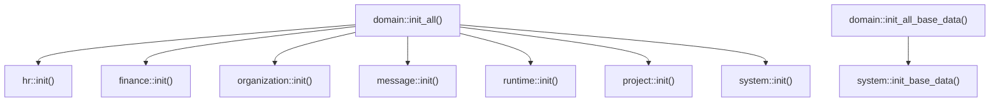
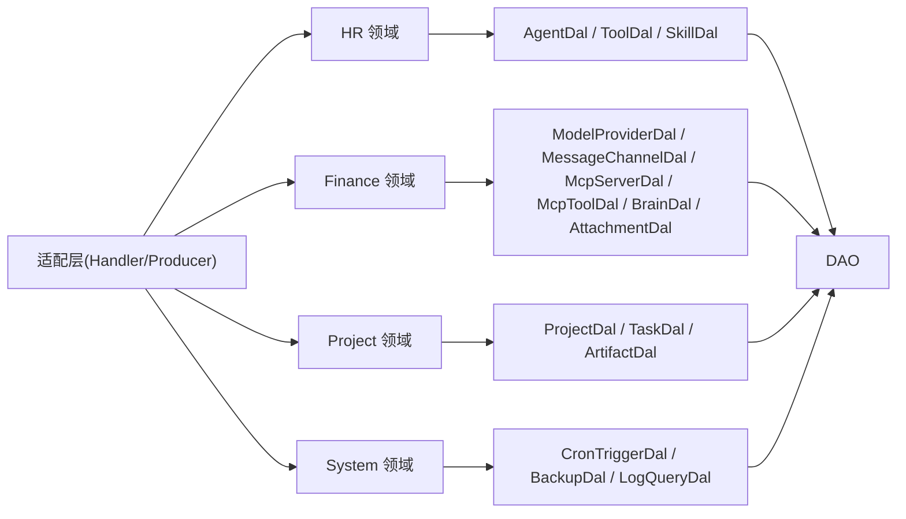
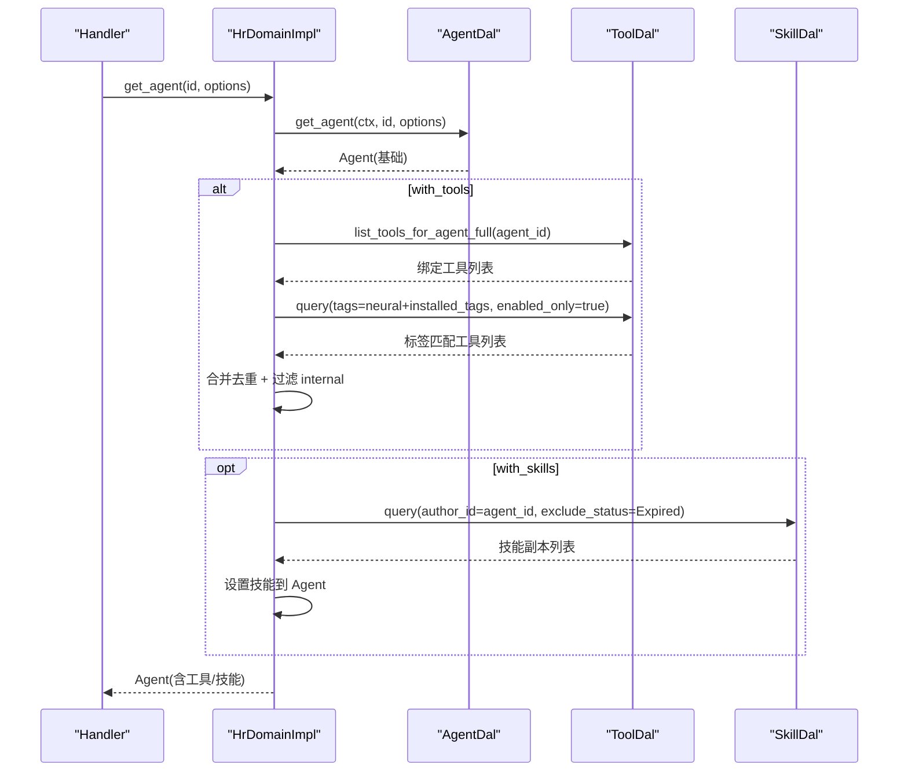
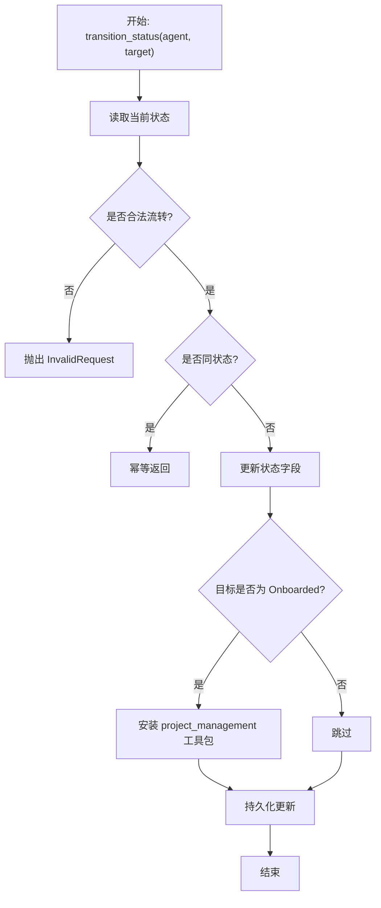
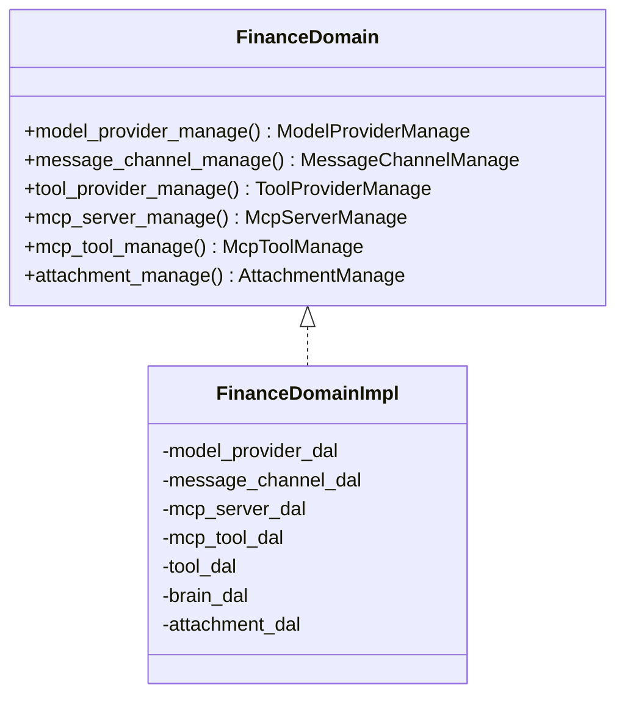
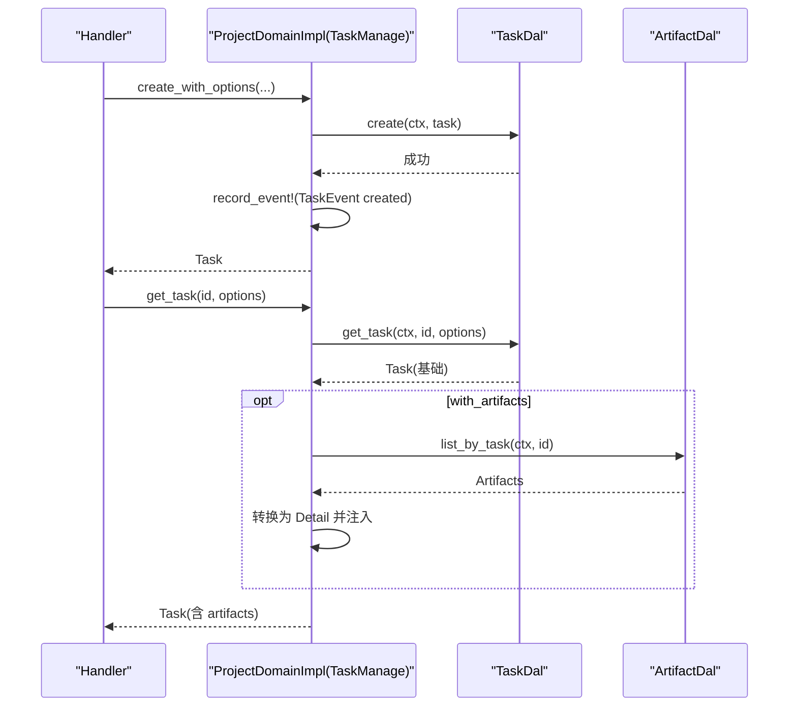
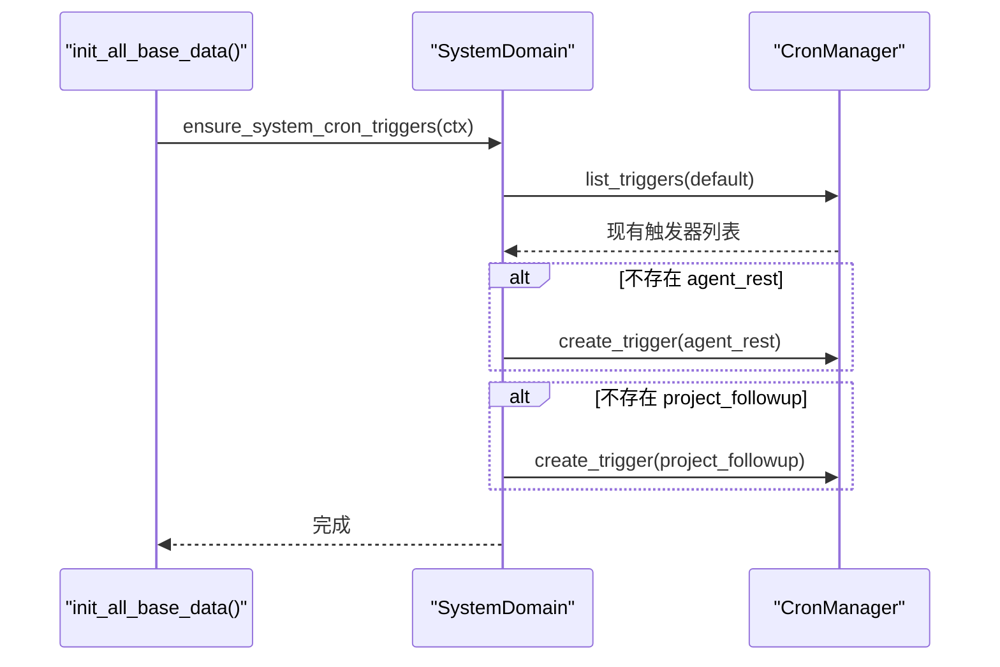
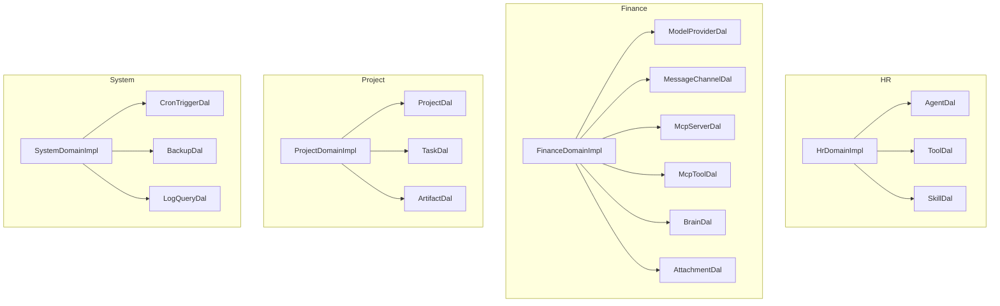

# Domain 层编排

<cite>
**本文引用的文件**
- [src/service/domain/mod.rs](src/service/domain/mod.rs)
- [src/service/domain/hr/mod.rs](src/service/domain/hr/mod.rs)
- [src/service/domain/hr/agent.rs](src/service/domain/hr/agent.rs)
- [src/service/domain/finance/mod.rs](src/service/domain/finance/mod.rs)
- [src/service/domain/project/mod.rs](src/service/domain/project/mod.rs)
- [src/service/domain/project/task.rs](src/service/domain/project/task.rs)
- [src/service/domain/system/mod.rs](src/service/domain/system/mod.rs)
- [src/models/events/mod.rs](src/models/events/mod.rs)
- [docs/ARCHITECTURE.md](docs/ARCHITECTURE.md)
- [AGENTS.md](AGENTS.md)
</cite>

### 本文关联的三类文档（四类互引闭环）

**① 设计文档（Design）**：
- [项目领域架构设计](docs/archive/design-archive/project_design.md) — Project Domain 分层架构设计
- [项目管理增强设计](docs/archive/design-archive/project_management_design.md) — Project Domain 六子模块职责边界 + Domain 层纯透传与按需注入区分

**② 落地计划（Plan）**：
- [项目任务增强](docs/archive/plan-archive/项目任务增强.md) — Project Domain 从纯透传 DAL 扩展为按需聚合（task_graph/artifacts/progress_summary）

**④ RAG 原子知识卡**：
- [项目领域与制品聚合：ProjectService 六能力 + TaskGraph DAG 依赖编排 + Artifact 制品双关联 + 对话上下文聚合](docs/wiki/knowledge/zh/%E9%A1%B9%E7%9B%AE%E9%A2%86%E5%9F%9F%E4%B8%8E%E5%88%B6%E5%93%81%E8%81%9A%E5%90%88%EF%BC%9AProjectService%20%E5%85%AD%E8%83%BD%E5%8A%9B%20+%20TaskGraph%20DAG%20%E4%BE%9D%E8%B5%96%E7%BC%96%E6%8E%92%20+%20Artifact%20%E5%88%B6%E5%93%81%E5%8F%8C%E5%85%B3%E8%81%94%20+%20%E5%AF%B9%E8%AF%9D%E4%B8%8A%E4%B8%8B%E6%96%87%E8%81%9A%E5%90%88/%E9%A1%B9%E7%9B%AE%E9%A2%86%E5%9F%9F%E4%B8%8E%E5%88%B6%E5%93%81%E8%81%9A%E5%90%88%EF%BC%9AProjectService%20%E5%85%AD%E8%83%BD%E5%8A%9B%20+%20TaskGraph%20DAG%20%E4%BE%9D%E8%B5%96%E7%BC%96%E6%8E%92%20+%20Artifact%20%E5%88%B6%E5%93%81%E5%8F%8C%E5%85%B3%E8%81%94%20+%20%E5%AF%B9%E8%AF%9D%E4%B8%8A%E4%B8%8B%E6%96%87%E8%81%9A%E5%90%88.md) — ProjectManage 六能力分层映射（ProjectManage/TaskManage/TaskGraphManage/ArtifactManage/ProgressManage/ContextManage）+ 红线（禁止 Domain 调 Domain）

## 目录
1. [引言](#引言)
2. [项目结构](#项目结构)
3. [核心组件](#核心组件)
4. [架构总览](#架构总览)
5. [详细组件分析](#详细组件分析)
6. [依赖关系分析](#依赖关系分析)
7. [性能与可维护性](#性能与可维护性)
8. [故障排查指南](#故障排查指南)
9. [结论](#结论)
10. [附录](#附录)

## 引言
本文件聚焦 AI Orz 系统的 Domain 层编排设计，围绕“将多个 DAL 调用组合成完整业务流程”的核心目标，系统阐述领域服务的职责边界、业务规则封装、事务管理策略、领域事件发布、状态机管理与业务异常处理模式。同时覆盖 HR、Finance、Project、System 四大业务域的编排逻辑与组织结构，并通过具体编排示例展示复杂流程的实现方式，确保业务逻辑具备高可测试性与可维护性。

## 项目结构
Domain 层位于 service/domain，按业务域划分模块：hr（人力资源）、finance（财务）、organization（组织）、message（消息）、runtime（运行时）、project（项目）、system（系统）。每个域通过 OnceLock 暴露单例 trait，并在 init_all() 中统一初始化；第二阶段异步 init_all_base_data() 用于幂等注入基础数据（目前由 system 域提供）。

图表来源
- [src/service/domain/mod.rs:23-42](src/service/domain/mod.rs#L23-L42)

章节来源
- [src/service/domain/mod.rs:1-42](src/service/domain/mod.rs#L1-L42)
- [docs/ARCHITECTURE.md:325-385](docs/ARCHITECTURE.md#L325-L385)
- [AGENTS.md:150-186](AGENTS.md#L150-L186)

## 核心组件
- 领域单例与装配：各域通过 OnceLock 持有 Arc<dyn Trait> 的领域实例，构造时注入所需 DAL（如 AgentDal、ToolDal、SkillDal、ModelProviderDal、MessageChannelDal、McpServerDal、McpToolDal、BrainDal、AttachmentDal、ProjectDal、TaskDal、ArtifactDal、CronTriggerDal、BackupDal、LogQueryDal）。
- 子能力 trait 聚合：每个域在顶层 trait 中暴露若干子能力 trait（如 HrDomain 暴露 agent_manage/skill_manage），实现类返回对应 trait 引用，便于 Handler 或上层按需组合。
- 上下文传递：所有 service 层方法首参为 RequestContext，跨层使用 ctx.clone()，保证日志追踪与扩展点一致。
- 领域事件：在关键业务动作处记录统计事件（如任务创建），并可通过 models/events 下的事件类型进行后续消费。

章节来源
- [src/service/domain/hr/mod.rs:36-57](src/service/domain/hr/mod.rs#L36-L57)
- [src/service/domain/finance/mod.rs:47-90](src/service/domain/finance/mod.rs#L47-L90)
- [src/service/domain/project/mod.rs:63-89](src/service/domain/project/mod.rs#L63-L89)
- [src/service/domain/system/mod.rs:20-32](src/service/domain/system/mod.rs#L20-L32)
- [src/models/events/mod.rs:1-21](src/models/events/mod.rs#L1-L21)
- [AGENTS.md:284-288](AGENTS.md#L284-L288)

## 架构总览
Domain 层遵循严格单向调用：Adapter → Domain → DAL → DAO。Domain 不直接访问 DAO，仅组合多个 DAL 完成业务编排；DAL 负责 PO ↔ 业务实体转换与单一数据源操作；DAO 专注持久化与外部出站调用。

图表来源
- [docs/ARCHITECTURE.md:325-385](docs/ARCHITECTURE.md#L325-L385)
- [AGENTS.md:150-186](AGENTS.md#L150-L186)

章节来源
- [docs/ARCHITECTURE.md:325-385](docs/ARCHITECTURE.md#L325-L385)
- [AGENTS.md:150-186](AGENTS.md#L150-L186)

## 详细组件分析

### HR 领域编排
- 职责边界：管理 Agent、Skill、工具包安装/卸载、技能包安装/卸载/重装、Agent 路由解析等。
- 编排要点：
  - 获取 Agent 时可按选项加载绑定工具与已安装技能，并进行 tag 匹配与去重过滤（排除 internal 标签）。
  - 状态流转集中校验，定义合法路径（面试→待入职→已入职→待离职→已离职→删除），并提供幂等同状态跳转。
  - 入职自动安装 project_management 工具包，体现“领域内业务规则”。
  - 工具包/技能包安装卸载均幂等处理，避免重复写入。
- 事务策略：以 DAL 为单位的事务边界；若需跨 DAL 原子性，应在调用方（Handler 或更高层）协调多 DAL 调用，或使用数据库事务包裹 DAL 调用（当前代码未显式开启事务，建议对写多写场景在调用侧包装事务）。

图表来源
- [src/service/domain/hr/agent.rs:92-155](src/service/domain/hr/agent.rs#L92-L155)

图表来源
- [src/service/domain/hr/agent.rs:213-270](src/service/domain/hr/agent.rs#L213-L270)

章节来源
- [src/service/domain/hr/mod.rs:131-291](src/service/domain/hr/mod.rs#L131-L291)
- [src/service/domain/hr/agent.rs:60-155](src/service/domain/hr/agent.rs#L60-L155)
- [src/service/domain/hr/agent.rs:213-270](src/service/domain/hr/agent.rs#L213-L270)

### Finance 领域编排
- 职责边界：模型提供商、消息渠道、工具提供商（含 Agent 借用关系）、MCP Server/Tool、附件资产。
- 编排要点：
  - ModelProvider 支持连接测试与切换 Embedding Provider（原子禁用旧→启用新，返回旧供后续重建索引）。
  - ToolProvider 支持内置工具同步、标签查询、搜索（向量+关键词混合）、Agent 借用/归还工具。
  - Attachment 提供文本/二进制上传、内容读取与替换、分页查询。
- 事务策略：切换 Embedding Provider 应视为跨 DAL 的原子操作（禁用旧→启用新），建议在调用侧用数据库事务包裹两次更新；其他写操作保持 DAL 粒度。

图表来源
- [src/service/domain/finance/mod.rs:94-115](src/service/domain/finance/mod.rs#L94-L115)
- [src/service/domain/finance/mod.rs:461-522](src/service/domain/finance/mod.rs#L461-L522)

章节来源
- [src/service/domain/finance/mod.rs:117-457](src/service/domain/finance/mod.rs#L117-L457)

### Project 领域编排
- 职责边界：Project、Task、Artifact 的业务编排，包含状态流转、进度更新、产物创建与读取、详情聚合。
- 编排要点：
  - Task 创建后记录统计事件（TaskEvent），便于后续分析与监控。
  - 获取 Task 详情可按选项注入 artifacts，复用 artifact_to_detail 转换。
  - 统一状态流转方法 transition_status，集中校验与持久化。
- 事务策略：Task/Artifact 写操作建议在同一 DAL 事务内；跨实体（如 Project 与 Task）的复合写应在调用侧用事务包裹。

图表来源
- [src/service/domain/project/task.rs:51-109](src/service/domain/project/task.rs#L51-L109)
- [src/service/domain/project/task.rs:116-144](src/service/domain/project/task.rs#L116-L144)

章节来源
- [src/service/domain/project/mod.rs:93-226](src/service/domain/project/mod.rs#L93-L226)
- [src/service/domain/project/task.rs:51-144](src/service/domain/project/task.rs#L51-L144)

### System 领域编排
- 职责边界：Cron Trigger 管理、备份、日志查询、AOP 监控与统计、基础数据注入。
- 编排要点：
  - 启动阶段异步注入两条系统级默认定时任务（agent_rest 每 4h、project_followup 每 1h），幂等判断基于 payload 中的 action 字符串。
  - 日志查询提供级别分布与时序聚合（小时桶）。
- 事务策略：Cron Trigger 的增删改查为单 DAL 操作；如需批量修改，建议在调用侧用事务包裹。

图表来源
- [src/service/domain/system/mod.rs:34-46](src/service/domain/system/mod.rs#L34-L46)
- [src/service/domain/system/mod.rs:358-415](src/service/domain/system/mod.rs#L358-L415)

章节来源
- [src/service/domain/system/mod.rs:102-204](src/service/domain/system/mod.rs#L102-L204)
- [src/service/domain/system/mod.rs:358-415](src/service/domain/system/mod.rs#L358-L415)

## 依赖关系分析
- 耦合度：Domain 仅依赖 DAL 接口，低耦合；DAL 依赖 DAO 接口，面向多态实现。
- 循环依赖：无跨层互调，无同层互调；各域之间通过 Handler 或上层编排组合。
- 外部依赖：AOP 事件中心、统计模块、存储抽象（向量/FTS5）通过 pkg 层提供，Domain 不感知实现细节。

图表来源
- [src/service/domain/hr/mod.rs:61-83](src/service/domain/hr/mod.rs#L61-L83)
- [src/service/domain/finance/mod.rs:461-495](src/service/domain/finance/mod.rs#L461-L495)
- [src/service/domain/project/mod.rs:502-523](src/service/domain/project/mod.rs#L502-L523)
- [src/service/domain/system/mod.rs:60-78](src/service/domain/system/mod.rs#L60-L78)

章节来源
- [docs/ARCHITECTURE.md:325-385](docs/ARCHITECTURE.md#L325-L385)
- [AGENTS.md:150-186](AGENTS.md#L150-L186)

## 性能与可维护性
- 性能特性：
  - 分页与计数：query 与 count 复用查询条件，减少重复 SQL 拼接；list 作为语法糖降低简单场景成本。
  - 向量/全文检索：通过 DAL 层统一接入，Domain 不关心底层实现，利于后端降级与优化。
  - 上下文 clone：RequestContext 内部为 Arc，clone 成本低，适合频繁跨层传递。
- 可维护性：
  - 领域事件：在关键动作处埋点（如任务创建），便于观测与回溯。
  - 状态机集中：transition_status 统一校验与持久化，避免散落的状态判断。
  - 幂等设计：工具包/技能包安装卸载、系统默认触发器注入均采用幂等策略，提升健壮性。
- 可测试性：
  - 单例注入：各域提供 new() 方法，测试可注入隔离依赖，保证测试独立。
  - 单元测试隔离：每个模块对应测试文件，使用独立临时 SQLite，互不干扰。

章节来源
- [AGENTS.md:585-755](AGENTS.md#L585-L755)
- [AGENTS.md:562-577](AGENTS.md#L562-L577)
- [src/service/domain/hr/agent.rs:313-397](src/service/domain/hr/agent.rs#L313-L397)
- [src/service/domain/system/mod.rs:358-415](src/service/domain/system/mod.rs#L358-L415)

## 故障排查指南
- 常见错误与定位：
  - 非法状态流转：检查 transition_status 的当前状态与目标状态是否符合定义路径。
  - 工具包/技能包未生效：确认幂等判断与持久化步骤是否执行；查看日志输出。
  - 系统默认触发器未创建：检查 ensure_system_cron_triggers 的 payload 去重逻辑与 DB 写入结果。
- 日志与事件：
  - 使用统一日志宏记录关键步骤（如 onboard、install/uninstall、create trigger）。
  - 通过统计事件（如 TaskEvent）与 AOP 监控定位问题链路。
- 事务与一致性：
  - 对于跨 DAL 的写操作，建议在调用侧用数据库事务包裹，确保原子性。
  - 切换 Embedding Provider 等关键操作需特别注意失败回滚。

章节来源
- [src/service/domain/hr/agent.rs:213-270](src/service/domain/hr/agent.rs#L213-L270)
- [src/service/domain/system/mod.rs:358-415](src/service/domain/system/mod.rs#L358-L415)
- [AGENTS.md:453-498](AGENTS.md#L453-L498)

## 结论
Domain 层作为业务编排核心，通过组合多个 DAL 完成复杂业务流程，集中封装业务规则与状态机，并以领域事件与统计埋点支撑可观测性。HR、Finance、Project、System 四大域职责清晰、边界明确，遵循严格分层与单向依赖，具备良好的可测试性与可维护性。未来可在跨 DAL 事务、更多领域事件与状态机扩展方面持续完善。

## 附录
- 最佳实践参考：
  - 分层架构与反模式清单：见 docs/ARCHITECTURE.md 与 AGENTS.md 的分层规范。
  - 分页与计数规范：见 AGENTS.md 的查询接口与 count 方法规范。
  - 日志与事件：见 AGENTS.md 的日志系统与事件设计。

章节来源
- [docs/ARCHITECTURE.md:325-385](docs/ARCHITECTURE.md#L325-L385)
- [AGENTS.md:150-186](AGENTS.md#L150-L186)
- [AGENTS.md:585-755](AGENTS.md#L585-L755)
- [AGENTS.md:453-498](AGENTS.md#L453-L498)