# Finance 领域编排

<cite>
**本文引用的文件**
- [src/service/domain/finance/mod.rs](src/service/domain/finance/mod.rs)
- [src/service/domain/finance/model_provider.rs](src/service/domain/finance/model_provider.rs)
- [src/service/domain/finance/mcp_server.rs](src/service/domain/finance/mcp_server.rs)
- [src/service/domain/finance/tool_provider.rs](src/service/domain/finance/tool_provider.rs)
- [src/service/domain/finance/message_channel.rs](src/service/domain/finance/message_channel.rs)
- [src/service/domain/finance/attachment.rs](src/service/domain/finance/attachment.rs)
- [src/handlers/finance/mcp_server/create_mcp_server.rs](src/handlers/finance/mcp_server/create_mcp_server.rs)
- [src/router.rs](src/router.rs)
- [docs/ARCHITECTURE.md](docs/ARCHITECTURE.md)
- [docs/mcp_tool_design.md](docs/mcp_tool_design.md)
</cite>

## 目录
1. [简介](#简介)
2. [项目结构](#项目结构)
3. [核心组件](#核心组件)
4. [架构总览](#架构总览)
5. [详细组件分析](#详细组件分析)
6. [依赖关系分析](#依赖关系分析)
7. [性能与可用性](#性能与可用性)
8. [故障排查指南](#故障排查指南)
9. [结论](#结论)
10. [附录：编排示例](#附录：编排示例)

## 简介
本编排文档聚焦 Finance 领域，围绕模型提供商、MCP 服务器、工具提供商、消息渠道与附件管理五大能力，说明其业务编排逻辑、组件依赖、配置管理与连接策略，并给出模型调用编排、工具执行编排、消息发送编排等关键流程。同时提供多模型路由、工具链组合、消息多渠道分发等复杂场景的编排示例，并总结服务可用性与性能优化要点。

Finance Domain 作为“计费相关外部能力”的统一入口，通过 trait 聚合 ModelProvider、MessageChannel、ToolProvider、MCP Server/Tool、Attachment 等子域管理能力，对外暴露统一接口；Handler 仅做 DTO 转换与请求级编排，Domain 负责业务规则与 DAL 编排，DAL/DAO 专注数据访问。

## 项目结构
Finance Domain 位于 service/domain/finance，采用“单例 + trait 聚合”的组织方式：
- 单例初始化：在应用启动时通过 domain::init() 注册全局 FinanceDomainImpl，内部注入各 DAL 单例。
- trait 聚合：FinanceDomain 暴露 model_provider_manage、message_channel_manage、tool_provider_manage、mcp_server_manage、mcp_tool_manage、attachment_manage 六个子能力入口。
- 子模块实现：每个子模块实现对应 Manage trait，封装校验、合并、权限控制等规则，再委托给 DAL。

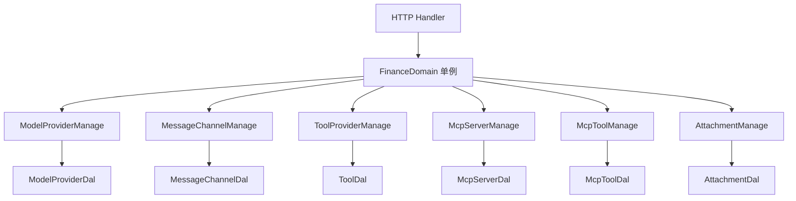

图表来源
- [src/service/domain/finance/mod.rs:47-90](src/service/domain/finance/mod.rs#L47-L90)
- [src/service/domain/finance/mod.rs:97-115](src/service/domain/finance/mod.rs#L97-L115)

章节来源
- [src/service/domain/finance/mod.rs:1-115](src/service/domain/finance/mod.rs#L1-L115)
- [docs/ARCHITECTURE.md:24-64](docs/ARCHITECTURE.md#L24-L64)

## 核心组件
- 模型提供商（ModelProvider）：LLM/Embedding 提供商配置与切换，支持连接测试、启用状态切换、向量索引重建触发。
- MCP 服务器（MCP Server）：外部 MCP Provider 的配置管理，敏感字段脱敏返回，更新时合并保留未覆盖的密钥。
- 工具提供商（Tool Provider）：工具注册、查询、搜索、内置工具同步、Agent 工具借用（绑定/解绑），含协议与控制模式策略校验。
- 消息渠道（Message Channel）：消息渠道配置 CRUD、连通性测试、分页查询。
- 附件（Attachment）：通用上传文件资产，文本内容读写限制与安全校验，按用户隔离读取。

章节来源
- [src/service/domain/finance/model_provider.rs:13-149](src/service/domain/finance/model_provider.rs#L13-L149)
- [src/service/domain/finance/mcp_server.rs:13-81](src/service/domain/finance/mcp_server.rs#L13-L81)
- [src/service/domain/finance/tool_provider.rs:13-166](src/service/domain/finance/tool_provider.rs#L13-L166)
- [src/service/domain/finance/message_channel.rs:12-73](src/service/domain/finance/message_channel.rs#L12-L73)
- [src/service/domain/finance/attachment.rs:17-137](src/service/domain/finance/attachment.rs#L17-L137)

## 架构总览
Finance Domain 严格遵循分层单向调用：Adapter（Handler）→ Domain → DAL → DAO。Domain 不直接操作 PO，PO 仅在 DAL/DAO 内部使用；所有 service 层方法首参为 RequestContext，跨层传递使用 ctx.clone()。

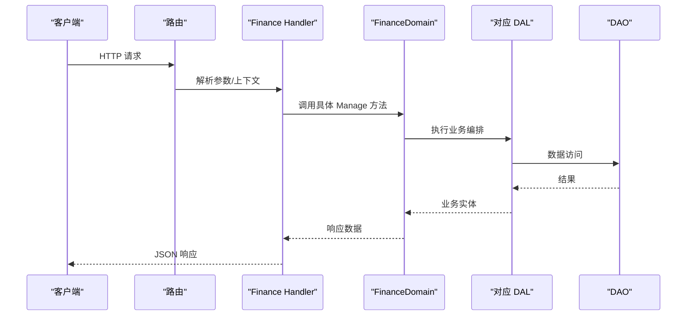

图表来源
- [docs/ARCHITECTURE.md:24-64](docs/ARCHITECTURE.md#L24-L64)
- [src/service/domain/finance/mod.rs:47-90](src/service/domain/finance/mod.rs#L47-L90)

章节来源
- [docs/ARCHITECTURE.md:24-64](docs/ARCHITECTURE.md#L24-L64)
- [src/service/domain/finance/mod.rs:47-90](src/service/domain/finance/mod.rs#L47-L90)

## 详细组件分析

### 模型提供商编排（ModelProvider）
- 创建/获取/查询/列表/更新/删除：委托 DAL，创建/更新时通过 enrich_ctx 注入上下文信息。
- 连接测试：通过 BrainDal 发起真实模型调用以验证连通性。
- Embedding 切换：原子化禁用旧 provider、启用新 provider，返回旧 provider 供调用方异步重建向量索引。

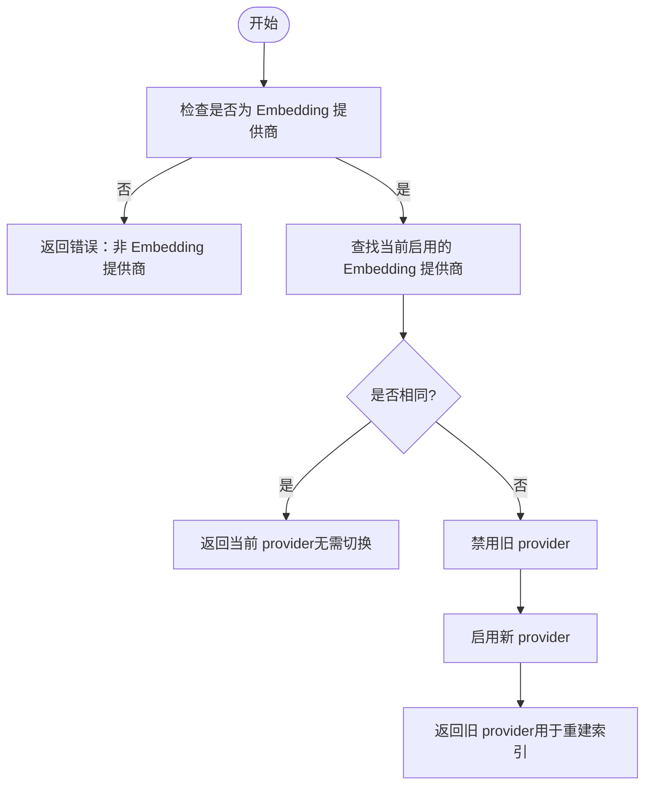

图表来源
- [src/service/domain/finance/model_provider.rs:103-149](src/service/domain/finance/model_provider.rs#L103-L149)

章节来源
- [src/service/domain/finance/model_provider.rs:13-149](src/service/domain/finance/model_provider.rs#L13-L149)

### MCP 服务器编排（MCP Server）
- 创建/获取/查询/列表/更新/状态更新/删除：全部委托 DAL。
- 敏感配置保护：get/query/list 返回列表时对配置进行脱敏；update 时若传入占位符则合并保留原值，避免误覆盖密钥。

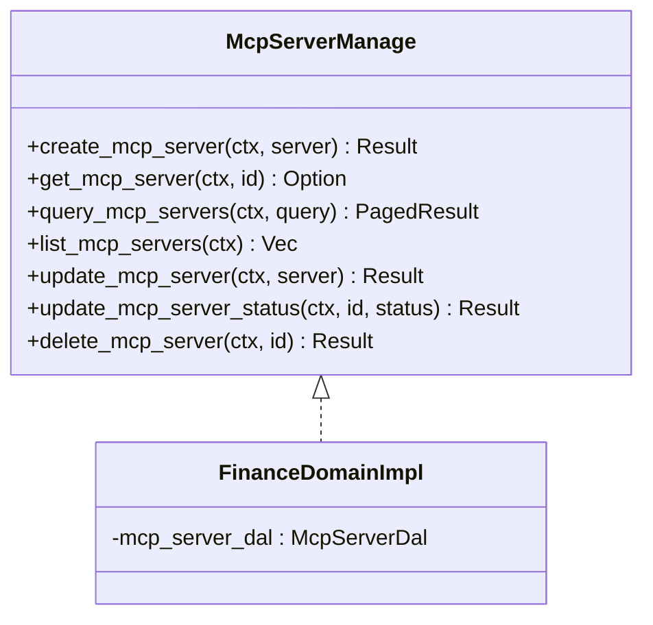

图表来源
- [src/service/domain/finance/mod.rs:293-342](src/service/domain/finance/mod.rs#L293-L342)
- [src/service/domain/finance/mcp_server.rs:13-81](src/service/domain/finance/mcp_server.rs#L13-L81)

章节来源
- [src/service/domain/finance/mcp_server.rs:13-81](src/service/domain/finance/mcp_server.rs#L13-L81)

### 工具提供商编排（Tool Provider）
- 工具生命周期：创建/获取/查询/列表/更新/删除，支持内置工具同步到 DB。
- Agent 工具借用：绑定/解绑、查询已借用的工具 ID 与完整工具列表。
- 策略校验：
  - MCP 工具仅允许 Manual 控制模式。
  - Http 工具需通过 http 适配器校验配置。
  - internal 标签工具不可绑定给 Agent。

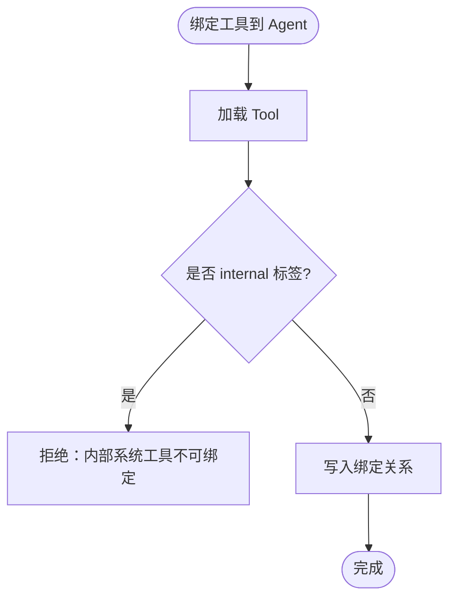

图表来源
- [src/service/domain/finance/tool_provider.rs:73-114](src/service/domain/finance/tool_provider.rs#L73-L114)

章节来源
- [src/service/domain/finance/tool_provider.rs:13-166](src/service/domain/finance/tool_provider.rs#L13-L166)

### 消息渠道编排（Message Channel）
- 渠道配置 CRUD、分页查询、连通性测试：全部委托 DAL。
- list_message_channels 通过默认查询返回所有渠道项。

章节来源
- [src/service/domain/finance/message_channel.rs:12-73](src/service/domain/finance/message_channel.rs#L12-L73)

### 附件编排（Attachment）
- 上传与文本附件：创建时进行文件名安全校验、文本大小限制、MIME 类型白名单校验。
- 读取与更新：按 root_user_id 隔离读取；更新文本内容时支持乐观锁（expected_updated_at）。
- 文本读取：仅允许文本类文件，且内容必须 UTF-8。

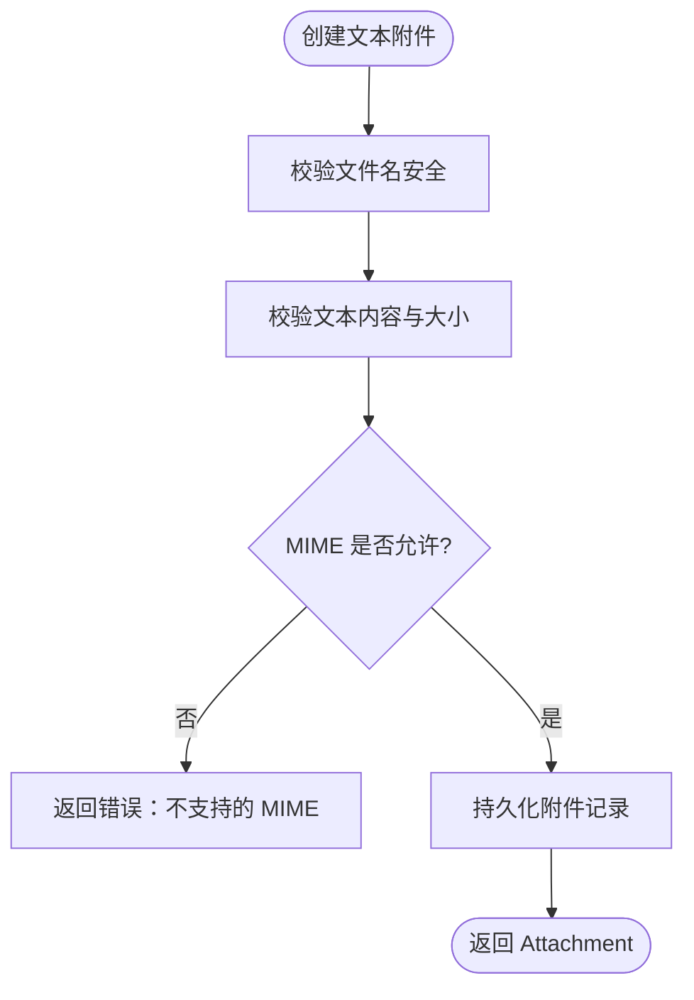

图表来源
- [src/service/domain/finance/attachment.rs:27-39](src/service/domain/finance/attachment.rs#L27-L39)
- [src/service/domain/finance/attachment.rs:159-204](src/service/domain/finance/attachment.rs#L159-L204)

章节来源
- [src/service/domain/finance/attachment.rs:17-137](src/service/domain/finance/attachment.rs#L17-L137)

## 依赖关系分析
Finance Domain 依赖多个 DAL，形成清晰的组合关系：
- ModelProviderManage → ModelProviderDal
- MessageChannelManage → MessageChannelDal
- ToolProviderManage → ToolDal
- McpServerManage → McpServerDal
- McpToolManage → McpToolDal
- AttachmentManage → AttachmentDal

此外，Finance Domain 还依赖 BrainDal 用于模型连接测试。

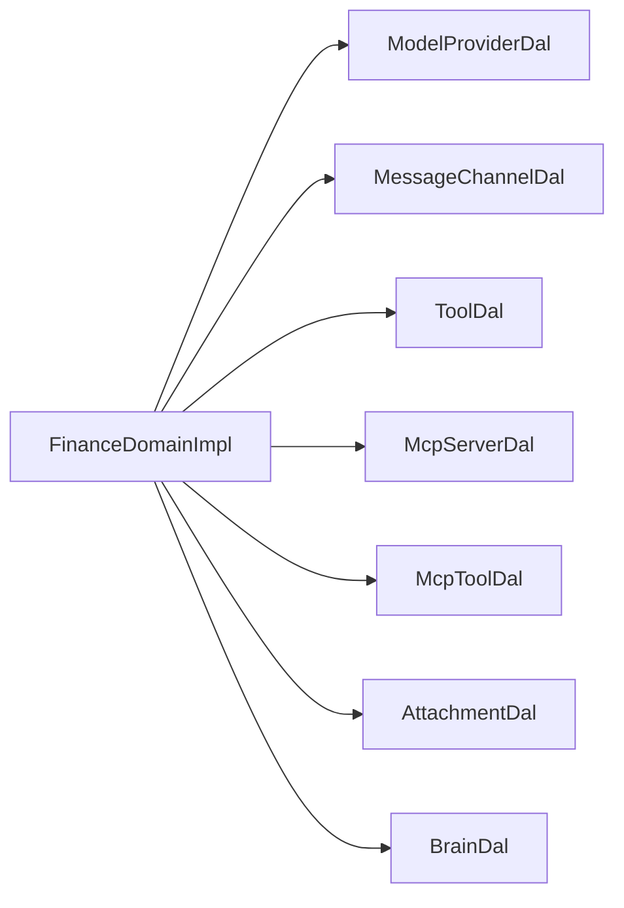

图表来源
- [src/service/domain/finance/mod.rs:464-472](src/service/domain/finance/mod.rs#L464-L472)

章节来源
- [src/service/domain/finance/mod.rs:464-472](src/service/domain/finance/mod.rs#L464-L472)

## 性能与可用性
- 连接池策略
  - 数据库连接池由 sqlx 管理，DAO 层通过 SqlitePool 复用连接；Finance Domain 不直接持有连接，DAL/DAO 负责连接复用与事务边界。
  - 建议根据并发量调整连接池大小，避免过多连接导致 SQLite 竞争。
- 批量与分页
  - 列表与查询普遍使用分页结构（PagedResult），避免一次性拉取大量数据。
- 缓存与降级
  - 向量检索支持多后端降级（LanceDB/HNSW/InMemory/SqliteVss），在异常或负载高时可自动降级。
- 幂等与重试
  - 状态切换（如 Embedding Provider 切换）采用原子化步骤，失败可回滚；外部调用（如模型连接测试）应结合超时与重试策略。
- 资源限制
  - 附件文本内容限制最大字节数，防止大对象占用内存；文件名与 MIME 白名单减少恶意输入风险。
- 监控与统计
  - 通过 AOP 事件中心收集模型调用、工具调用等指标，便于容量规划与问题定位。

[本节为通用指导，不直接分析具体文件]

## 故障排查指南
- 模型连接失败
  - 现象：test_connection 返回错误。
  - 排查：确认 ModelProvider 配置正确、网络可达、凭据有效；查看日志中的错误码与字段。
- Embedding 切换失败
  - 现象：switch_embedding_provider 报错或状态不一致。
  - 排查：确认目标 provider 为 embedding 类型；检查旧 provider 是否成功禁用；必要时手动恢复状态。
- MCP 配置被覆盖
  - 现象：更新后密钥丢失。
  - 排查：确保更新时未覆盖占位符；Domain 会合并保留未显式更新的敏感字段。
- 工具绑定失败
  - 现象：bind_tool_to_agent 拒绝。
  - 排查：检查工具协议与控制模式（MCP 必须 Manual）、Http 配置合法性、internal 标签限制。
- 附件读取失败
  - 现象：get_attachment_text_content 返回空或错误。
  - 排查：确认文件类型为文本类、MIME 在白名单、内容为 UTF-8；检查 expected_updated_at 冲突。

章节来源
- [src/service/domain/finance/model_provider.rs:93-101](src/service/domain/finance/model_provider.rs#L93-L101)
- [src/service/domain/finance/model_provider.rs:103-149](src/service/domain/finance/model_provider.rs#L103-L149)
- [src/service/domain/finance/mcp_server.rs:53-65](src/service/domain/finance/mcp_server.rs#L53-L65)
- [src/service/domain/finance/tool_provider.rs:148-166](src/service/domain/finance/tool_provider.rs#L148-L166)
- [src/service/domain/finance/attachment.rs:68-124](src/service/domain/finance/attachment.rs#L68-L124)

## 结论
Finance Domain 通过统一的 trait 聚合与 DAL 编排，将模型提供商、MCP 服务器、工具提供商、消息渠道与附件管理等外部能力纳入一致的计费与管理边界。Handler 保持薄适配，Domain 承载业务规则与编排，DAL/DAO 专注数据访问。该设计保证了可扩展性、可维护性与安全性，并通过分页、连接池、降级与监控等手段保障可用性与性能。

[本节为总结，不直接分析具体文件]

## 附录：编排示例

### 示例一：多模型路由（按任务类型选择模型）
- 场景：不同任务（如摘要生成 vs 代码补全）选择不同的模型提供商。
- 编排思路：
  - 在 Handler 中根据任务类型选择 ModelProviderId。
  - 调用 FinanceDomain.model_provider_manage().get_model_provider_with_options 获取提供商详情。
  - 通过 BrainDal.test_connection 快速探测连通性，失败则切换到备选提供商。
  - 最终进入 CortexDao 思考链路执行推理。

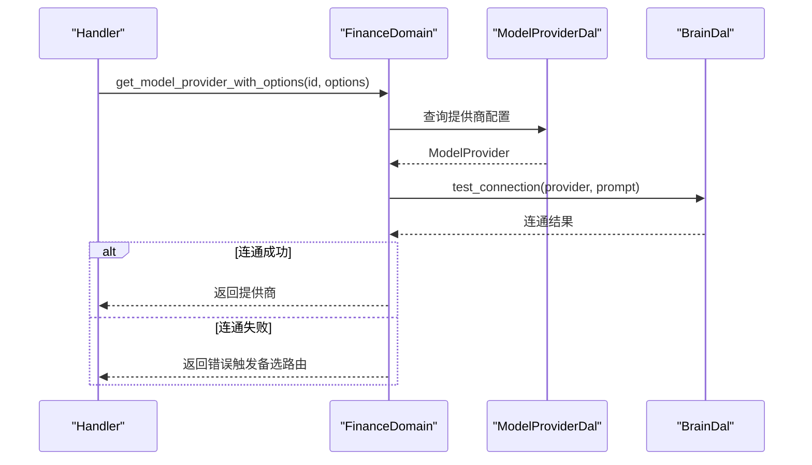

图表来源
- [src/service/domain/finance/model_provider.rs:31-40](src/service/domain/finance/model_provider.rs#L31-L40)
- [src/service/domain/finance/model_provider.rs:93-101](src/service/domain/finance/model_provider.rs#L93-L101)

### 示例二：工具链组合（MCP 工具 + Http 工具协作）
- 场景：先通过 MCP 工具获取数据，再用 Http 工具处理或转发。
- 编排思路：
  - 通过 FinanceDomain.tool_provider_manage().search_tools 搜索可用工具。
  - 对 MCP 工具，确保 control_mode=Manual；对 Http 工具，确保配置合法。
  - 依次执行工具链，串联中间结果，最终产出业务结果。

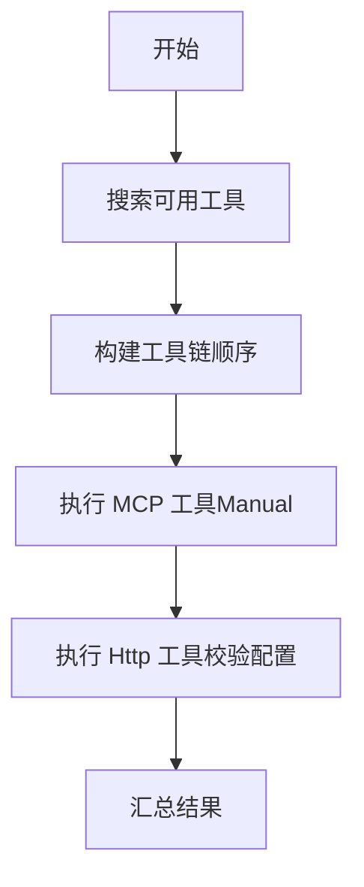

图表来源
- [src/service/domain/finance/tool_provider.rs:138-145](src/service/domain/finance/tool_provider.rs#L138-L145)
- [src/service/domain/finance/tool_provider.rs:148-166](src/service/domain/finance/tool_provider.rs#L148-L166)

### 示例三：消息多渠道分发（同一消息投递至多个渠道）
- 场景：一条消息需要同时发送到飞书、企业微信、Slack 等渠道。
- 编排思路：
  - 在 Handler 中组装消息体。
  - 调用 FinanceDomain.message_channel_manage().query_channels 获取目标渠道列表。
  - 遍历渠道，逐个调用 DAL 的消息投递能力，记录投递结果与失败原因。
  - 对失败渠道进行重试或告警。

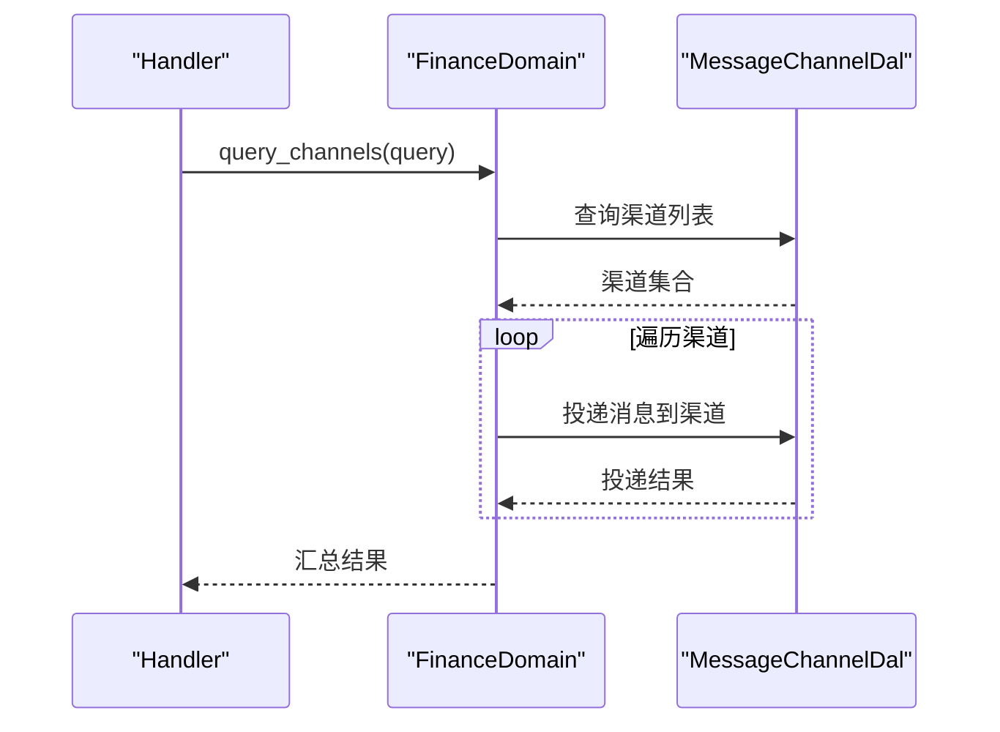

图表来源
- [src/service/domain/finance/message_channel.rs:30-43](src/service/domain/finance/message_channel.rs#L30-L43)

### 示例四：MCP 服务器创建与工具同步
- 场景：新增 MCP Server 后，同步远端 tools/list 到本地 Tool 表。
- 编排思路：
  - Handler 调用 create_mcp_server，Domain 委托 DAL 创建并返回脱敏视图。
  - 随后调用 mcp_tool_manage.sync_mcp_tools(server_id) 同步工具。
  - 前端可通过 list_mcp_tools_by_server 查看已同步工具。

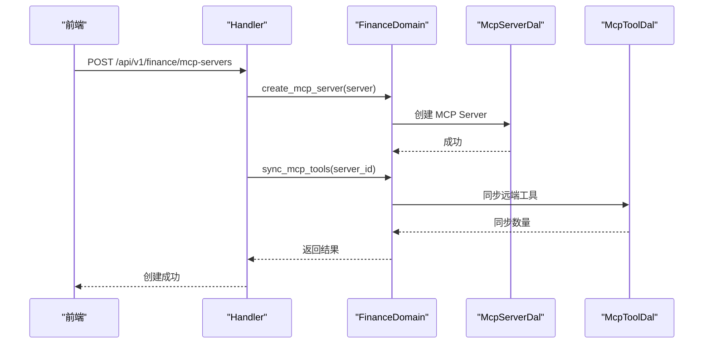

图表来源
- [src/handlers/finance/mcp_server/create_mcp_server.rs:22-47](src/handlers/finance/mcp_server/create_mcp_server.rs#L22-L47)
- [docs/mcp_tool_design.md:250-275](docs/mcp_tool_design.md#L250-L275)
- [src/router.rs:551-556](src/router.rs#L551-L556)