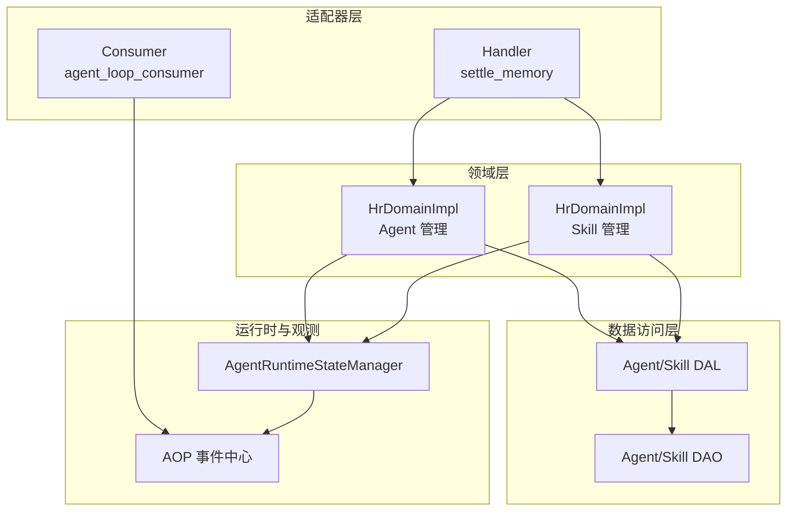
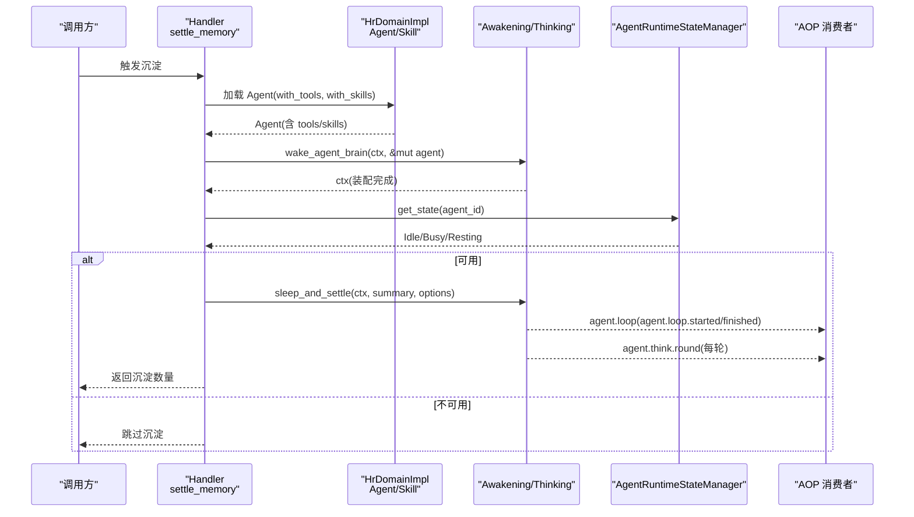
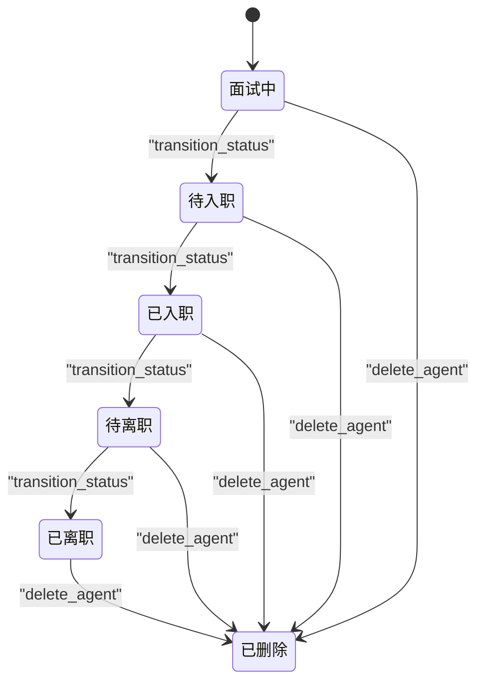
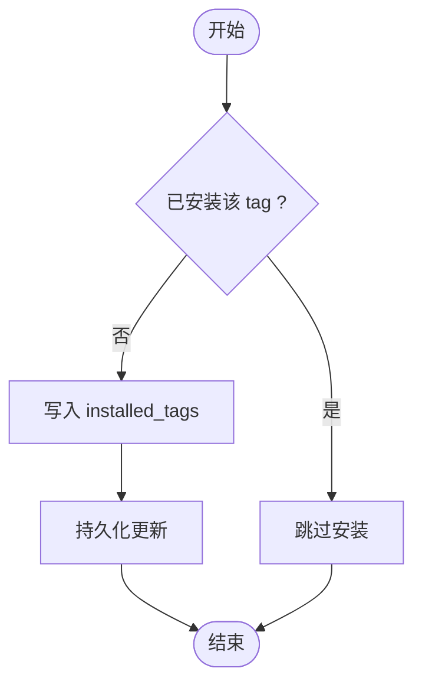
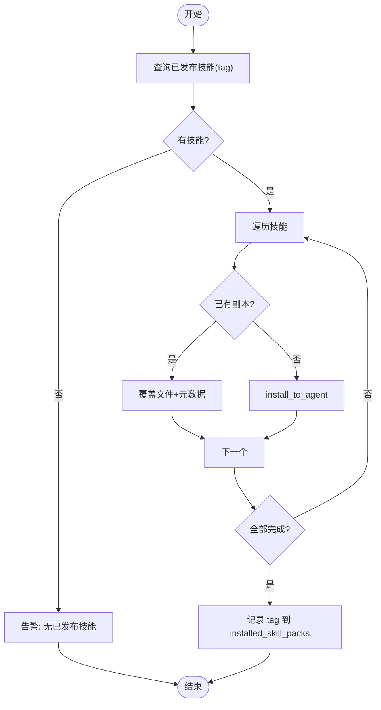
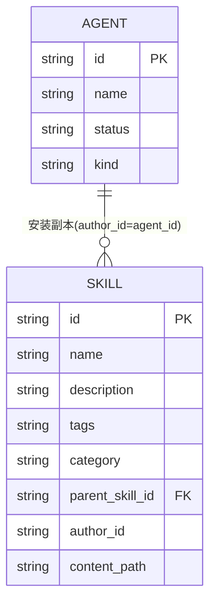
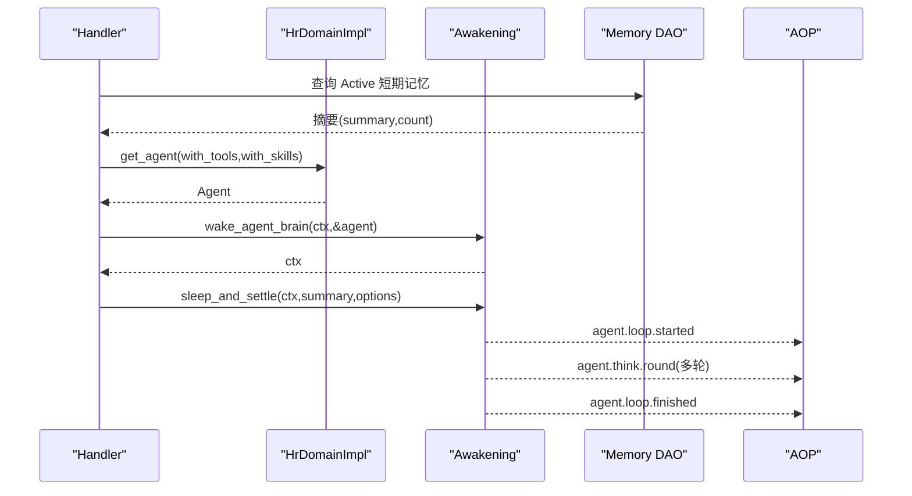
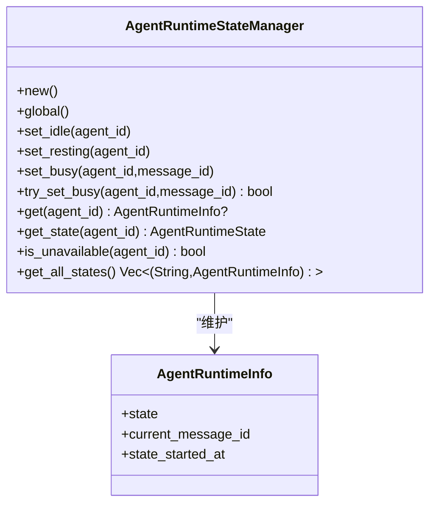
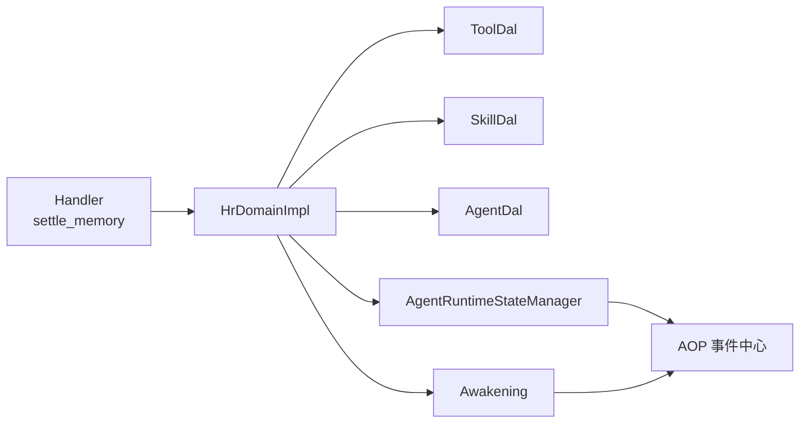

# HR 领域编排

<cite>
**本文引用的文件**
- [src/models/agent.rs](src/models/agent.rs)
- [src/models/skill.rs](src/models/skill.rs)
- [src/service/domain/hr/agent.rs](src/service/domain/hr/agent.rs)
- [src/service/domain/hr/skill.rs](src/service/domain/hr/skill.rs)
- [src/consumer/agent_loop_consumer.rs](src/consumer/agent_loop_consumer.rs)
- [src/pkg/agent_runtime_state.rs](src/pkg/agent_runtime_state.rs)
- [src/handlers/hr/agent/settle_memory.rs](src/handlers/hr/agent/settle_memory.rs)
</cite>

## 目录
1. [简介](#简介)
2. [项目结构](#项目结构)
3. [核心组件](#核心组件)
4. [架构总览](#架构总览)
5. [详细组件分析](#详细组件分析)
6. [依赖关系分析](#依赖关系分析)
7. [性能考量](#性能考量)
8. [故障排查指南](#故障排查指南)
9. [结论](#结论)
10. [附录](#附录)

## 简介
本文档面向 HR 领域的 Agent 与 Skill 业务编排，聚焦以下目标：
- Agent 生命周期管理：创建、状态流转（面试中→待入职→已入职→待离职→已离职→删除）、运行时状态（空闲/忙碌/休息）与唤醒/沉淀机制。
- 技能包安装卸载：按 tag 批量安装到 Agent 目录、覆盖更新、卸载并可选清理副本。
- 工具绑定解绑：通过绑定表与 tag 匹配注入工具；支持内部工具过滤与幂等安装/卸载。
- 关联关系与状态流转：Agent 与 Skill 的“安装即复制”模型、tag 标记与运行时配置的关系。
- 唤醒机制、记忆管理与工具执行：awaken 响应外部消息，sleep_and_settle 在 Resting 状态下沉淀短期记忆。
- 复杂编排示例：Agent 初始化、技能包部署、工具链配置、沉淀工作流。
- 可测试性与可维护性：分层约束、幂等设计、AOP 事件观测、集成测试覆盖。

## 项目结构
HR 领域围绕四层单向调用组织：Adapter（HTTP Handler / AOP Producer/Consumer）→ Domain → DAL → DAO。Domain 层负责业务规则与编排，DAL 提供统一业务实体接口，DAO 负责持久化。通用能力位于 pkg/ 子模块（如 AOP、存储、请求上下文）。

图表来源
- [src/handlers/hr/agent/settle_memory.rs:1-155](src/handlers/hr/agent/settle_memory.rs#L1-L155)
- [src/consumer/agent_loop_consumer.rs:1-97](src/consumer/agent_loop_consumer.rs#L1-L97)
- [src/service/domain/hr/agent.rs:1-655](src/service/domain/hr/agent.rs#L1-L655)
- [src/service/domain/hr/skill.rs:1-339](src/service/domain/hr/skill.rs#L1-L339)
- [src/pkg/agent_runtime_state.rs:1-174](src/pkg/agent_runtime_state.rs#L1-L174)

章节来源
- [src/handlers/hr/agent/settle_memory.rs:1-155](src/handlers/hr/agent/settle_memory.rs#L1-L155)
- [src/consumer/agent_loop_consumer.rs:1-97](src/consumer/agent_loop_consumer.rs#L1-L97)
- [src/service/domain/hr/agent.rs:1-655](src/service/domain/hr/agent.rs#L1-L655)
- [src/service/domain/hr/skill.rs:1-339](src/service/domain/hr/skill.rs#L1-L339)
- [src/pkg/agent_runtime_state.rs:1-174](src/pkg/agent_runtime_state.rs#L1-L174)

## 核心组件
- Agent 业务对象与运行时配置：包含 Brain、Tools、Skills、运行时状态与统计信息；运行时配置记录工具包与技能包 tag、思考深度/轮次限制、是否反思、是否需要用户确认等。
- Skill 业务实体：PO + 文件列表 + 搜索元信息；支持向量化与 Prompt 摘要生成。
- HrDomainImpl：实现 Agent 与 Skill 的管理方法，包括状态流转、工具包/技能包安装卸载、查询与搜索、覆盖更新等。
- Agent 运行时状态管理器：内存单例，维护 Idle/Busy/Resting 状态，原子尝试设置 Busy 避免并发唤醒冲突。
- AOP 消费者：订阅 agent.loop 与 agent.think.round 事件，用于日志与指标采集。

章节来源
- [src/models/agent.rs:15-184](src/models/agent.rs#L15-L184)
- [src/models/agent.rs:186-328](src/models/agent.rs#L186-L328)
- [src/models/skill.rs:1-193](src/models/skill.rs#L1-L193)
- [src/service/domain/hr/agent.rs:14-655](src/service/domain/hr/agent.rs#L14-L655)
- [src/service/domain/hr/skill.rs:1-339](src/service/domain/hr/skill.rs#L1-L339)
- [src/pkg/agent_runtime_state.rs:1-174](src/pkg/agent_runtime_state.rs#L1-L174)
- [src/consumer/agent_loop_consumer.rs:1-97](src/consumer/agent_loop_consumer.rs#L1-L97)

## 架构总览
HR 编排遵循 Adapter → Domain → DAL → DAO 单向调用，Domain 层集中处理业务规则与编排，DAL 暴露业务实体接口，DAO 负责 SQL 与文件系统操作。运行时状态与 AOP 事件贯穿唤醒、沉淀与工具执行过程。

图表来源
- [src/handlers/hr/agent/settle_memory.rs:68-123](src/handlers/hr/agent/settle_memory.rs#L68-L123)
- [src/pkg/agent_runtime_state.rs:51-107](src/pkg/agent_runtime_state.rs#L51-L107)
- [src/consumer/agent_loop_consumer.rs:26-97](src/consumer/agent_loop_consumer.rs#L26-L97)

## 详细组件分析

### Agent 生命周期与状态机
- 创建：Local Agent 必须指定 model_provider_id；新建状态固定为 Interviewing。
- 状态流转：Interviewing → PendingOnboard → Onboarded → PendingOffboard → Offboarded → Deleted；同状态跳转允许幂等。
- 入职自动安装：进入 Onboarded 时自动安装 project_management 工具包 tag。
- 就绪校验：PendingOnboard 需至少绑定一个工具；无技能仅告警不阻止。

图表来源
- [src/service/domain/hr/agent.rs:213-270](src/service/domain/hr/agent.rs#L213-L270)

章节来源
- [src/service/domain/hr/agent.rs:61-84](src/service/domain/hr/agent.rs#L61-L84)
- [src/service/domain/hr/agent.rs:213-270](src/service/domain/hr/agent.rs#L213-L270)
- [src/service/domain/hr/agent.rs:272-311](src/service/domain/hr/agent.rs#L272-L311)

### 工具绑定与解绑（按 tag）
- 安装工具包：将 tag 写入 Agent 的 runtime_config.installed_tags；幂等，已安装则跳过。
- 卸载工具包：从 installed_tags 移除 tag；幂等，未安装则跳过。
- 获取工具：get_agent 时合并“绑定工具”和“tag 匹配工具”，去重并过滤 internal 标签的工具。

图表来源
- [src/service/domain/hr/agent.rs:313-354](src/service/domain/hr/agent.rs#L313-L354)
- [src/service/domain/hr/agent.rs:356-397](src/service/domain/hr/agent.rs#L356-L397)
- [src/service/domain/hr/agent.rs:92-155](src/service/domain/hr/agent.rs#L92-L155)

章节来源
- [src/service/domain/hr/agent.rs:92-155](src/service/domain/hr/agent.rs#L92-L155)
- [src/service/domain/hr/agent.rs:313-397](src/service/domain/hr/agent.rs#L313-L397)

### 技能包安装/卸载/重装
- 安装技能包：按 tag 查询已发布技能，逐个 install_to_agent 复制到 Agent 目录；记录 tag 到 installed_skill_packs；幂等。
- 卸载技能包：移除 tag；可选 delete_copies 删除该 tag 下的副本。
- 重装技能包：获取最新 Published 技能，已有副本则覆盖文件与元数据，无副本则新建安装。

图表来源
- [src/service/domain/hr/agent.rs:414-499](src/service/domain/hr/agent.rs#L414-L499)
- [src/service/domain/hr/agent.rs:501-564](src/service/domain/hr/agent.rs#L501-L564)
- [src/service/domain/hr/agent.rs:566-638](src/service/domain/hr/agent.rs#L566-L638)
- [src/service/domain/hr/agent.rs:14-58](src/service/domain/hr/agent.rs#L14-L58)

章节来源
- [src/service/domain/hr/agent.rs:414-638](src/service/domain/hr/agent.rs#L414-L638)
- [src/service/domain/hr/skill.rs:141-184](src/service/domain/hr/skill.rs#L141-L184)

### Agent 与 Skill 的关联关系
- 安装即复制：Skill 以副本形式存在于 Agent 目录，author_id = agent_id，parent_skill_id 指向源技能。
- 使用范围：get_agent 仅加载 author_id = agent_id 且非 Expired 的技能副本。
- 覆盖更新：reinstall 时对比源技能与副本，覆盖同名文件并更新元数据。

图表来源
- [src/models/skill.rs:20-49](src/models/skill.rs#L20-L49)
- [src/service/domain/hr/agent.rs:136-151](src/service/domain/hr/agent.rs#L136-L151)
- [src/service/domain/hr/agent.rs:566-638](src/service/domain/hr/agent.rs#L566-L638)

章节来源
- [src/models/skill.rs:20-49](src/models/skill.rs#L20-L49)
- [src/service/domain/hr/agent.rs:136-151](src/service/domain/hr/agent.rs#L136-L151)
- [src/service/domain/hr/agent.rs:566-638](src/service/domain/hr/agent.rs#L566-L638)

### 唤醒机制、记忆管理与工具执行
- 唤醒：wake_agent_brain 装配 Cortex/Brain，准备工具与技能上下文。
- 沉淀：sleep_and_settle 在 Resting 状态下运行，内置约束模板（只使用记忆相关工具），输出 think round 事件。
- 记忆：build_pending_memories_summary 聚合未沉淀的短期记忆编号摘要，供沉淀流程使用。

图表来源
- [src/handlers/hr/agent/settle_memory.rs:22-123](src/handlers/hr/agent/settle_memory.rs#L22-L123)
- [src/consumer/agent_loop_consumer.rs:26-97](src/consumer/agent_loop_consumer.rs#L26-L97)

章节来源
- [src/handlers/hr/agent/settle_memory.rs:22-123](src/handlers/hr/agent/settle_memory.rs#L22-L123)
- [src/consumer/agent_loop_consumer.rs:26-97](src/consumer/agent_loop_consumer.rs#L26-L97)

### 运行时状态管理（Idle/Busy/Resting）
- 原子设置 Busy：try_set_busy 防止并发唤醒导致同一 Agent 被重复处理。
- 状态变更事件：通过 AOP 异步发布，不影响主流程。
- 列表查询：get_all_states 用于前端展示 Agent 实时状态。

图表来源
- [src/pkg/agent_runtime_state.rs:11-174](src/pkg/agent_runtime_state.rs#L11-L174)

章节来源
- [src/pkg/agent_runtime_state.rs:51-107](src/pkg/agent_runtime_state.rs#L51-L107)
- [src/pkg/agent_runtime_state.rs:134-157](src/pkg/agent_runtime_state.rs#L134-L157)

### 复杂编排示例
- Agent 初始化：创建 Local Agent（必须指定 model_provider_id），状态为 Interviewing；后续 transition_status 至 PendingOnboard。
- 技能包部署：install_skill_pack 按 tag 批量安装到 Agent 目录；reinstall_skill_pack 覆盖更新或新建安装。
- 工具链配置：install_tool_pack/uninstall_tool_pack 管理 installed_tags；get_agent 合并绑定工具与 tag 工具并过滤 internal。
- 沉淀工作流：settle_memory 构建短期记忆摘要，唤醒 Brain 后进入 Resting 自主沉淀，输出 AOP 事件。

章节来源
- [src/service/domain/hr/agent.rs:61-84](src/service/domain/hr/agent.rs#L61-L84)
- [src/service/domain/hr/agent.rs:414-638](src/service/domain/hr/agent.rs#L414-L638)
- [src/service/domain/hr/agent.rs:313-397](src/service/domain/hr/agent.rs#L313-L397)
- [src/handlers/hr/agent/settle_memory.rs:68-123](src/handlers/hr/agent/settle_memory.rs#L68-L123)

## 依赖关系分析
- 单向依赖：Handler → HrDomainImpl → DAL → DAO；pkg/ 提供通用能力（AOP、RequestContext、运行时状态）。
- 关键耦合点：
  - HrDomainImpl 依赖 tool_dal、skill_dal、agent_dal 进行工具与技能装配与管理。
  - settle_memory 依赖 awakening 与 memory dao 完成沉淀。
  - AgentRuntimeStateManager 与 AOP 解耦，通过事件通知状态变化。

图表来源
- [src/handlers/hr/agent/settle_memory.rs:68-123](src/handlers/hr/agent/settle_memory.rs#L68-L123)
- [src/service/domain/hr/agent.rs:92-155](src/service/domain/hr/agent.rs#L92-L155)
- [src/pkg/agent_runtime_state.rs:134-157](src/pkg/agent_runtime_state.rs#L134-L157)

章节来源
- [src/handlers/hr/agent/settle_memory.rs:68-123](src/handlers/hr/agent/settle_memory.rs#L68-L123)
- [src/service/domain/hr/agent.rs:92-155](src/service/domain/hr/agent.rs#L92-L155)
- [src/pkg/agent_runtime_state.rs:134-157](src/pkg/agent_runtime_state.rs#L134-L157)

## 性能考量
- 工具与技能加载：get_agent 合并去重，避免重复加载；internal 工具过滤减少不必要暴露。
- 技能覆盖更新：overwrite_skill_copy 直接写文件并更新元数据，减少额外拷贝。
- 运行时状态：try_set_busy 原子设置 Busy，避免并发唤醒导致的重复执行。
- 沉淀流程：limit 控制每次处理的短期记忆数量，避免过长思考循环。

[本节为通用指导，无需特定文件引用]

## 故障排查指南
- 状态非法：transition_status 抛出 InvalidRequest，检查当前状态与目标状态是否符合状态机。
- 工具不足：validate_onboard_readiness 要求至少绑定一个工具，否则阻止入职。
- 技能缺失：无技能仅告警，不影响入职；如需增强能力，安装对应 skill pack。
- 并发唤醒：若出现重复唤醒，检查 try_set_busy 是否成功；确保 consumer 侧 is_unavailable 判断正确。
- 沉淀失败：检查 build_pending_memories_summary 是否有数据；确认 Awakening 装配成功与 AOP 事件是否正常输出。

章节来源
- [src/service/domain/hr/agent.rs:213-270](src/service/domain/hr/agent.rs#L213-L270)
- [src/service/domain/hr/agent.rs:272-311](src/service/domain/hr/agent.rs#L272-L311)
- [src/pkg/agent_runtime_state.rs:85-107](src/pkg/agent_runtime_state.rs#L85-L107)
- [src/handlers/hr/agent/settle_memory.rs:22-123](src/handlers/hr/agent/settle_memory.rs#L22-L123)

## 结论
HR 领域编排通过清晰的层次划分与严格的业务规则，实现了 Agent 生命周期管理、技能包安装卸载、工具绑定解绑以及唤醒/沉淀机制的可控与可观测。幂等设计、AOP 事件与运行时状态管理共同保障了在高并发场景下的稳定性与可维护性。建议在生产环境中结合集成测试与覆盖率门槛持续验证编排逻辑的正确性。

[本节为总结，无需特定文件引用]

## 附录
- 最佳实践
  - 所有公共方法首参为 RequestContext，跨层传递使用 ctx.clone()。
  - PO 仅在 DAO/DAL 内部使用，Domain 输入输出为业务实体与内部事件。
  - 通用基础设施工具放于 pkg/，禁止在业务 DAO 中定义通用函数。
  - 启动流程两阶段：同步 init 注册单例与 AOP producer/consumer；异步 init_base_data 幂等注入默认基础数据。
- 技术栈
  - 后端：Axum 0.8 + sqlx 0.8（SQLite，离线查询缓存）+ DuckDB 统计。
  - 向量搜索：LanceDB 0.26 默认，支持 HNSW/InMemory/SqliteVss 降级。
  - 全文搜索：FTS5 + trigram 分词器。
- 质量门槛
  - clippy -D warnings 零容忍；cargo-llvm-cov 覆盖率门槛 PR 38% / main 45%。
  - 集成测试位于 tests/integration/，覆盖 Auth/CRUD/消息投递/向量降级/A2A/预置技能/Cron。

[本节为规范说明，无需特定文件引用]

### 本文关联的三类文档（四类互引闭环，Batch11 精确对齐）
#### ① Design 决策快照
- [skill_system_enhancement_design.md](docs/design/skill_system_enhancement_design.md) — HR 域 Skill + Agent 两子域协作：HrDomain::onboard_agent → install_default_skill_packs（5 套 TEMPLATE）→ SkillDomain.install_skill_pack(tag) 幂等
#### ② Plan 落地快照
- [Agent管理集成测试.md](docs/plan/Agent管理集成测试.md) — Task 8-9 工具包 + 技能包生命周期集成测试（入职安装 + 幂等重装 + 安装失败降级）
#### ④ RAG 原子知识卡
- [Skill 系统增强：5 套 TEMPLATE 预置包 + install_skill_pack 幂等 Tag 分发 + Agent 入职绑定 + Prompt Token 熔断](docs/wiki/knowledge/zh/Skill%20系统增强：5%20套%20TEMPLATE%20预置包%20+%20install_skill_pack%20幂等%20Tag%20分发%20+%20Agent%20入职绑定%20+%20Prompt%20Token%20熔断/Skill%20系统增强：5%20套%20TEMPLATE%20预置包%20+%20install_skill_pack%20幂等%20Tag%20分发%20+%20Agent%20入职绑定%20+%20Prompt%20Token%20熔断.md) — §2 锚点速查 HrDomain.skill 操作 + AgentDomain.install_skill_pack 主入口 + §4.2 入职绑定扩展模式
