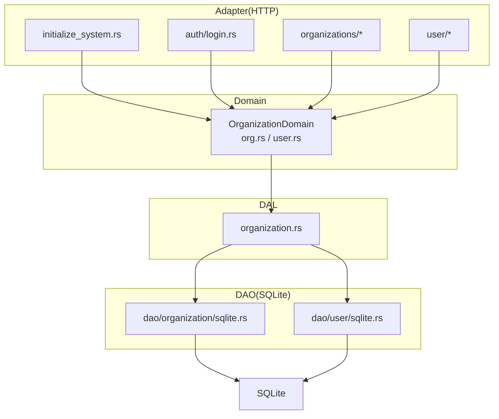
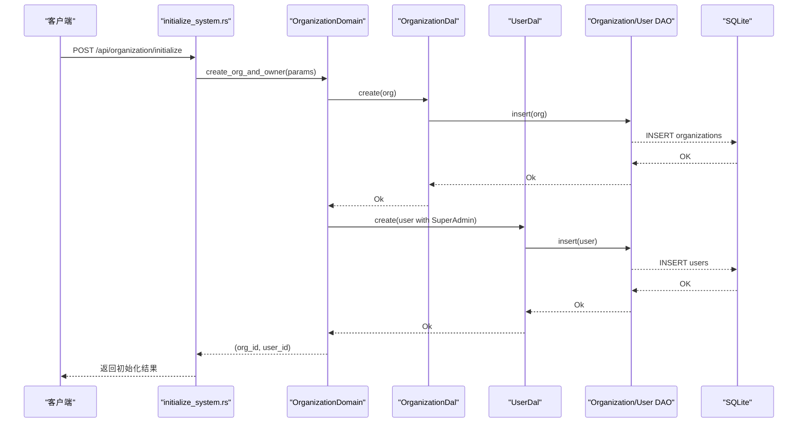
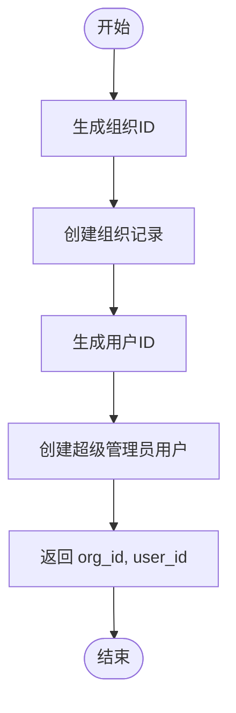
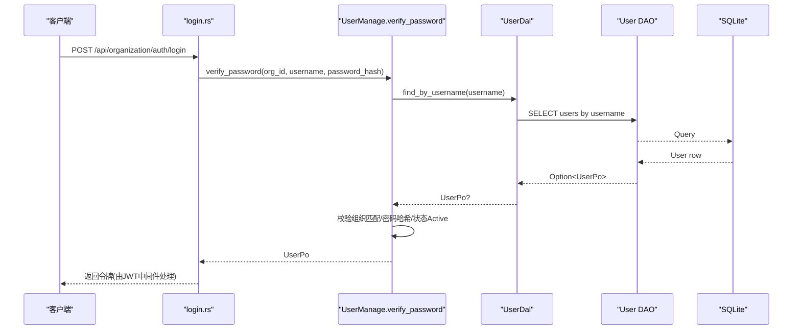
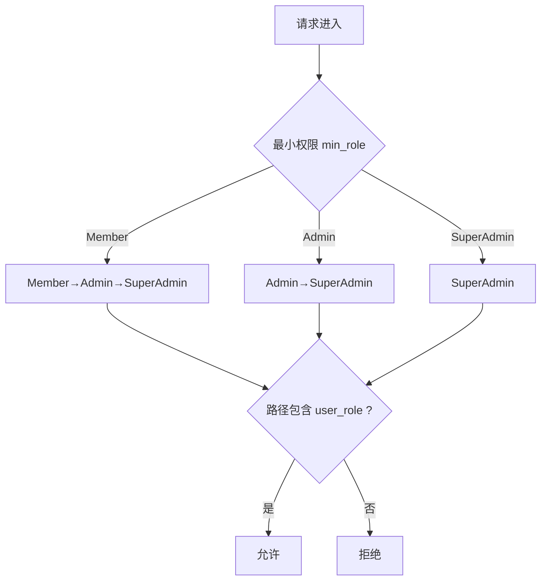
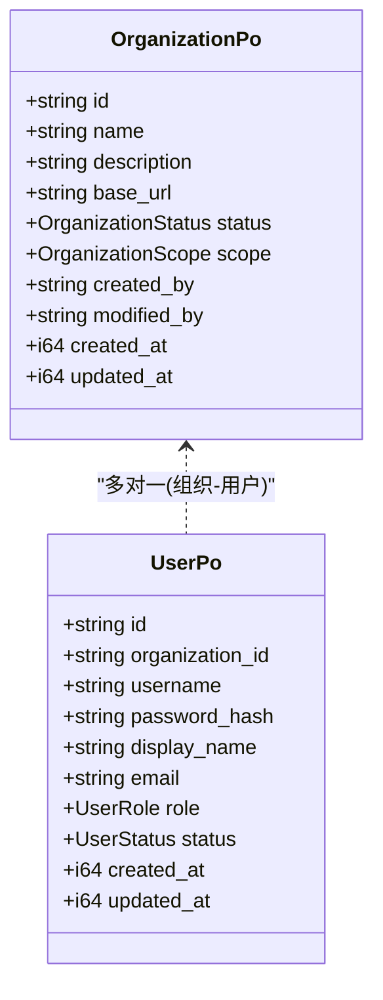
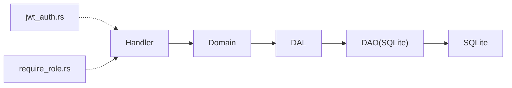

# Organization 领域编排

<cite>
**本文引用的文件**
- [src/service/domain/organization/mod.rs](src/service/domain/organization/mod.rs)
- [src/service/domain/organization/org.rs](src/service/domain/organization/org.rs)
- [src/service/domain/organization/user.rs](src/service/domain/organization/user.rs)
- [src/service/dal/organization.rs](src/service/dal/organization.rs)
- [src/models/organization.rs](src/models/organization.rs)
- [common/src/enums/organization.rs](common/src/enums/organization.rs)
- [src/handlers/organization/initialize_system.rs](src/handlers/organization/initialize_system.rs)
- [src/handlers/organization/auth/login.rs](src/handlers/organization/auth/login.rs)
- [src/handlers/organization/auth/logout.rs](src/handlers/organization/auth/logout.rs)
- [src/handlers/organization/organizations/get_organization.rs](src/handlers/organization/organizations/get_organization.rs)
- [src/handlers/organization/organizations/list_organizations.rs](src/handlers/organization/organizations/list_organizations.rs)
- [src/handlers/organization/organizations/update_organization.rs](src/handlers/organization/organizations/update_organization.rs)
- [src/handlers/organization/organizations/delete_organization.rs](src/handlers/organization/organizations/delete_organization.rs)
- [src/handlers/organization/user/create_user.rs](src/handlers/organization/user/create_user.rs)
- [src/handlers/organization/user/list_users_by_current_organization.rs](src/handlers/organization/user/list_users_by_current_organization.rs)
- [src/handlers/organization/user/query_users.rs](src/handlers/organization/user/query_users.rs)
- [src/handlers/organization/user/update_user.rs](src/handlers/organization/user/update_user.rs)
- [src/handlers/organization/user/delete_user.rs](src/handlers/organization/user/delete_user.rs)
- [src/middleware/jwt_auth.rs](src/middleware/jwt_auth.rs)
- [src/middleware/require_role.rs](src/middleware/require_role.rs)
- [common/src/enums/user.rs](common/src/enums/user.rs)
- [migrations/20260420000000_initial.sql](migrations/20260420000000_initial.sql)
- [docs/organization_design.md](docs/organization_design.md)
</cite>

## 目录
1. [简介](#简介)
2. [项目结构](#项目结构)
3. [核心组件](#核心组件)
4. [架构总览](#架构总览)
5. [详细组件分析](#详细组件分析)
6. [依赖关系分析](#依赖关系分析)
7. [性能考虑](#性能考虑)
8. [故障排查指南](#故障排查指南)
9. [结论](#结论)
10. [附录](#附录)

## 简介
本编排文档聚焦 Organization 领域，围绕“组织与用户”的核心业务进行端到端设计说明。内容涵盖：
- 组织层级结构与成员关系维护（以组织为边界的多租户隔离）
- 用户权限模型与继承（基于角色链的最小权限校验）
- 关键业务流程编排：系统初始化、组织注册、用户邀请与加入、权限分配与继承
- 数据完整性与访问控制保障策略（事务、软删除、状态机、鉴权中间件）
- 复杂场景的编排示例（组织创建+Owner 初始化、登录认证、按组织分页查询用户等）

本项目严格遵循四层单向调用：Adapter（HTTP Handler / AOP Producer）→ Domain → DAL → DAO，禁止跨层与同层互调；Domain 输入输出均为业务实体与内部事件，PO 仅在 DAO/DAL 内部使用。

## 项目结构
Organization 领域在代码中的分层如下：
- Adapter（Handler）：提供 HTTP API，如系统初始化、组织 CRUD、用户管理、登录登出等
- Domain：定义 OrganizationDomain 聚合 trait，包含 OrganizationManage 与 UserManage 两个子能力
- DAL：封装 DAO 接口，暴露统一查询与写操作
- DAO：SQLite 具体实现，负责 SQL 执行与结果映射

图表来源
- [src/handlers/organization/initialize_system.rs:1-200](src/handlers/organization/initialize_system.rs#L1-L200)
- [src/handlers/organization/auth/login.rs:1-200](src/handlers/organization/auth/login.rs#L1-L200)
- [src/handlers/organization/organizations/get_organization.rs:1-200](src/handlers/organization/organizations/get_organization.rs#L1-L200)
- [src/handlers/organization/user/create_user.rs:1-200](src/handlers/organization/user/create_user.rs#L1-L200)
- [src/service/domain/organization/mod.rs:1-200](src/service/domain/organization/mod.rs#L1-L200)
- [src/service/dal/organization.rs:1-126](src/service/dal/organization.rs#L1-L126)

章节来源
- [docs/organization_design.md:1-218](docs/organization_design.md#L1-L218)

## 核心组件
- 领域入口与单例
  - OrganizationDomain：聚合 OrganizationManage 与 UserManage 两个子能力，并提供 domain() 获取单例与 init() 初始化
- 组织管理能力
  - check_initialized：通过 count 判断是否已初始化
  - create_org_and_owner：生成组织 ID 与超级管理员用户 ID，写入组织和用户记录
  - get_by_id / query / list_all / update / delete / count_organizations：基础 CRUD 与统计
- 用户管理能力
  - find_by_username / query / find_by_organization_id / create_user / update_user / delete_user / exists_by_username / count_by_organization_id / count_users / verify_password / get_user_by_id
- 数据访问层
  - OrganizationDal：对 OrganizationDao 的统一封装，提供 is_initialized、get_by_id、create、query、list_all、update、delete、count 等

章节来源
- [src/service/domain/organization/mod.rs:1-200](src/service/domain/organization/mod.rs#L1-L200)
- [src/service/domain/organization/org.rs:1-134](src/service/domain/organization/org.rs#L1-L134)
- [src/service/domain/organization/user.rs:1-124](src/service/domain/organization/user.rs#L1-L124)
- [src/service/dal/organization.rs:1-126](src/service/dal/organization.rs#L1-L126)

## 架构总览
Organization 领域采用严格的四层单向调用，确保职责清晰与可测试性：
- Adapter 仅做参数校验、上下文注入与响应组装
- Domain 编排跨 DAL 的业务流程（如创建组织并创建 Owner），并可在此处扩展权限校验与业务规则
- DAL 屏蔽 DAO 差异，对外暴露稳定接口
- DAO 专注 SQL 与 ORM 映射

图表来源
- [src/handlers/organization/initialize_system.rs:1-200](src/handlers/organization/initialize_system.rs#L1-L200)
- [src/service/domain/organization/org.rs:53-90](src/service/domain/organization/org.rs#L53-L90)
- [src/service/dal/organization.rs:93-95](src/service/dal/organization.rs#L93-L95)

## 详细组件分析

### 组织创建与系统初始化编排
- 触发点：Adapter 层 initialize_system 处理器接收初始化请求
- 编排逻辑：
  - 生成组织 ID（12 位大写字母+数字）
  - 构造 OrganizationPo 并持久化
  - 生成用户 ID（16 位大写字母+数字）
  - 构造 UserPo，角色为 SuperAdmin，关联刚创建的组织
  - 返回 (organization_id, user_id) 给前端
- 关键点：
  - 所有写操作通过 DAL 透传到 DAO，保证事务一致性（由上层或 DAO 层事务包裹）
  - 初始化的组织作为根节点，超级管理员拥有最高权限

图表来源
- [src/service/domain/organization/org.rs:12-36](src/service/domain/organization/org.rs#L12-L36)
- [src/service/domain/organization/org.rs:53-90](src/service/domain/organization/org.rs#L53-L90)

章节来源
- [src/service/domain/organization/org.rs:12-90](src/service/domain/organization/org.rs#L12-L90)
- [src/handlers/organization/initialize_system.rs:1-200](src/handlers/organization/initialize_system.rs#L1-L200)

### 用户认证与授权编排
- 认证流程：
  - 登录处理器接收用户名、密码哈希与组织 ID
  - Domain 层 verify_password：
    - 根据用户名查找用户
    - 校验用户所属组织与请求组织一致
    - 校验密码哈希
    - 检查用户状态是否为 Active
  - 成功后返回用户信息，后续由 JWT 中间件签发令牌
- 授权流程：
  - 路由层使用 require_role_middleware(UserRole::Xxx) 进行最小权限校验
  - 敏感操作可在 handler 内二次校验（如要求 SuperAdmin）

图表来源
- [src/handlers/organization/auth/login.rs:1-200](src/handlers/organization/auth/login.rs#L1-L200)
- [src/service/domain/organization/user.rs:85-117](src/service/domain/organization/user.rs#L85-L117)

章节来源
- [src/service/domain/organization/user.rs:85-117](src/service/domain/organization/user.rs#L85-L117)
- [src/middleware/jwt_auth.rs:1-200](src/middleware/jwt_auth.rs#L1-L200)
- [src/middleware/require_role.rs:1-200](src/middleware/require_role.rs#L1-L200)
- [common/src/enums/user.rs:1-200](common/src/enums/user.rs#L1-L200)

### 权限模型与继承
- 角色体系：SuperAdmin > Admin > Member
- 继承规则：从目标角色沿祖先链向上遍历，若路径包含当前用户角色则满足权限
- 应用方式：
  - 路由层中间件强制最小权限（如 require_role_middleware(UserRole::Admin)）
  - 高危操作在 handler 内二次校验（如要求 SuperAdmin）

图表来源
- [common/src/enums/user.rs:1-200](common/src/enums/user.rs#L1-L200)
- [src/middleware/require_role.rs:1-200](src/middleware/require_role.rs#L1-L200)

章节来源
- [common/src/enums/user.rs:1-200](common/src/enums/user.rs#L1-L200)
- [src/middleware/require_role.rs:1-200](src/middleware/require_role.rs#L1-L200)

### 组织管理与成员关系维护
- 组织管理：
  - 获取组织信息、列表、更新、删除（软删除）、统计
  - 通用综合查询支持组合条件（所有字段 Option）
- 成员关系：
  - 用户属于特定组织（organization_id 外键约束）
  - 按组织查询用户列表、分页查询、统计数量
  - 创建用户时绑定到指定组织，角色决定权限范围

图表来源
- [src/models/organization.rs:1-62](src/models/organization.rs#L1-L62)
- [common/src/enums/organization.rs:1-101](common/src/enums/organization.rs#L1-L101)

章节来源
- [src/models/organization.rs:1-62](src/models/organization.rs#L1-L62)
- [common/src/enums/organization.rs:1-101](common/src/enums/organization.rs#L1-L101)

### 复杂业务编排示例
- 组织注册（系统初始化）
  - 步骤：检查是否已初始化 → 创建组织 → 创建超级管理员 → 返回 ID
  - 参考路径：[src/handlers/organization/initialize_system.rs:1-200](src/handlers/organization/initialize_system.rs#L1-L200), [src/service/domain/organization/org.rs:53-90](src/service/domain/organization/org.rs#L53-L90)
- 用户邀请与加入
  - 步骤：校验用户名唯一性 → 创建用户并绑定组织 → 设置角色 → 返回用户信息
  - 参考路径：[src/handlers/organization/user/create_user.rs:1-200](src/handlers/organization/user/create_user.rs#L1-L200), [src/service/domain/organization/user.rs:43-46](src/service/domain/organization/user.rs#L43-L46)
- 权限分配与继承
  - 步骤：路由层最小权限校验 → 敏感操作二次校验 → 执行变更
  - 参考路径：[src/middleware/require_role.rs:1-200](src/middleware/require_role.rs#L1-L200), [common/src/enums/user.rs:1-200](common/src/enums/user.rs#L1-L200)

章节来源
- [src/handlers/organization/initialize_system.rs:1-200](src/handlers/organization/initialize_system.rs#L1-L200)
- [src/service/domain/organization/org.rs:53-90](src/service/domain/organization/org.rs#L53-L90)
- [src/handlers/organization/user/create_user.rs:1-200](src/handlers/organization/user/create_user.rs#L1-L200)
- [src/service/domain/organization/user.rs:43-46](src/service/domain/organization/user.rs#L43-L46)
- [src/middleware/require_role.rs:1-200](src/middleware/require_role.rs#L1-L200)
- [common/src/enums/user.rs:1-200](common/src/enums/user.rs#L1-L200)

## 依赖关系分析
- 模块耦合
  - Domain 依赖 DAL（OrganizationDal、UserDal），不直接感知 DAO 实现
  - DAL 依赖 DAO 接口，屏蔽 SQLite 细节
  - Handler 仅依赖 Domain，保持薄适配
- 外部依赖
  - sqlx 用于 SQLite 查询缓存与类型安全
  - JWT 中间件用于认证，require_role 中间件用于授权
- 潜在循环依赖
  - 通过 trait 对象与单例解耦，避免循环引用

图表来源
- [src/service/domain/organization/mod.rs:1-200](src/service/domain/organization/mod.rs#L1-L200)
- [src/service/dal/organization.rs:1-126](src/service/dal/organization.rs#L1-L126)
- [src/middleware/jwt_auth.rs:1-200](src/middleware/jwt_auth.rs#L1-L200)
- [src/middleware/require_role.rs:1-200](src/middleware/require_role.rs#L1-L200)

章节来源
- [src/service/domain/organization/mod.rs:1-200](src/service/domain/organization/mod.rs#L1-L200)
- [src/service/dal/organization.rs:1-126](src/service/dal/organization.rs#L1-L126)

## 性能考虑
- 查询优化
  - 使用通用综合查询（OrganizationQuery/UserQuery）减少重复 SQL
  - 分页查询降低大数据集传输开销
- 并发与锁
  - DAL/DAO 使用 Arc<dyn Trait> 单例，线程安全
  - 写操作建议外层事务包裹，保证原子性
- 存储后端
  - SQLite 适合单机与轻量部署；如需高并发可评估迁移至其他后端
- 索引与统计
  - 建议在 organization_id、username 等高频查询字段建立索引
  - 使用 count 接口进行分页统计，避免全表扫描

## 故障排查指南
- 常见问题
  - 初始化失败：检查 organizations/users 表是否存在冲突记录
  - 登录失败：确认用户名、密码哈希、组织 ID 匹配且用户状态为 Active
  - 权限不足：检查路由层最小权限配置与 handler 二次校验
- 日志与调试
  - 使用 tracing-appender 输出日志，便于定位问题
  - 结合集成测试验证关键流程（如 Auth/CRUD/消息投递）

章节来源
- [docs/organization_design.md:160-218](docs/organization_design.md#L160-L218)

## 结论
Organization 领域通过清晰的四层架构与严格的单向依赖，实现了组织与用户管理的稳定编排。核心能力包括：
- 系统初始化与组织注册
- 用户认证与授权（JWT + 角色最小权限）
- 成员关系维护与权限继承
- 数据完整性保障（软删除、状态机、事务）
未来可扩展点：
- 引入更细粒度的资源级权限（RBAC/ABAC）
- 增加组织层级（父子组织）与跨组织协作
- 增强审计与合规能力（操作日志、数据血缘）

## 附录
- 数据模型与建表
  - 组织与用户表结构见迁移脚本
- 相关 API
  - 组织管理：GET/PUT/DELETE /api/organization/{id}，GET /api/organization/list
  - 用户管理：POST /api/organization/user，GET /api/organization/user/{username}，GET /api/organization/{org_id}/users，PUT /api/organization/user/update，DELETE /api/organization/user/{user_id}
  - 认证：POST /api/organization/auth/login，POST /api/organization/auth/logout

章节来源
- [migrations/20260420000000_initial.sql:1-200](migrations/20260420000000_initial.sql#L1-L200)
- [docs/organization_design.md:89-103](docs/organization_design.md#L89-L103)