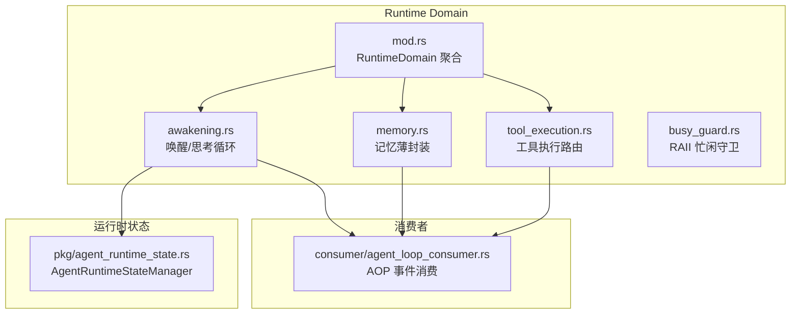
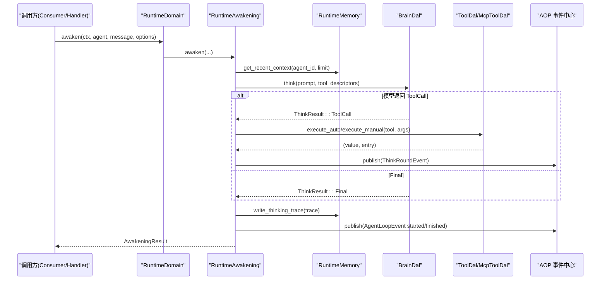
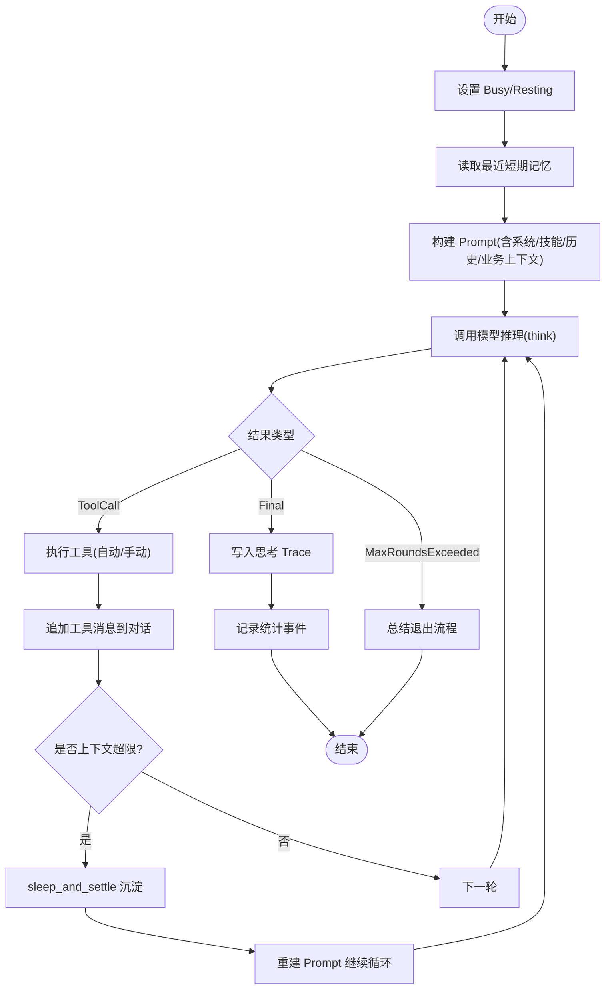
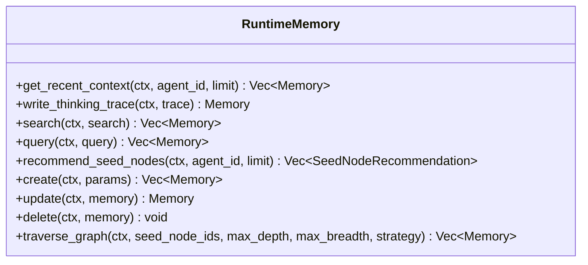
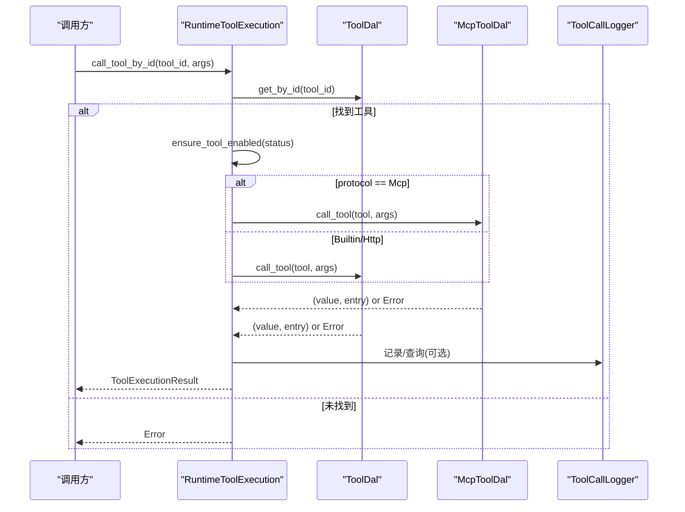
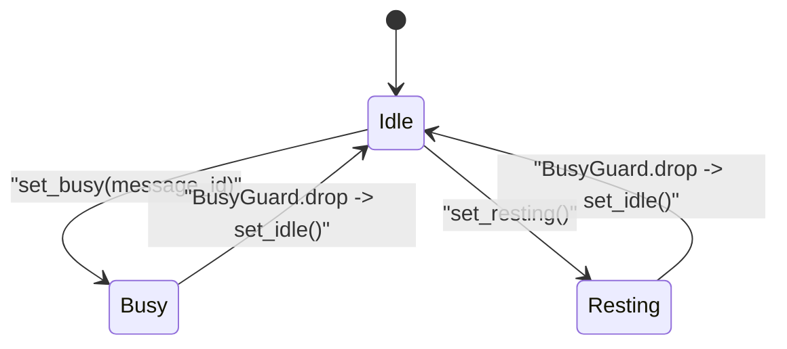
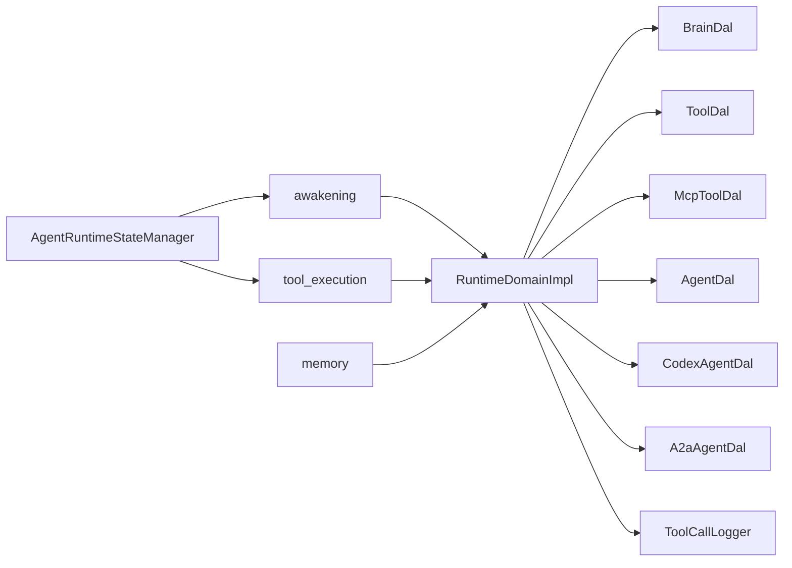
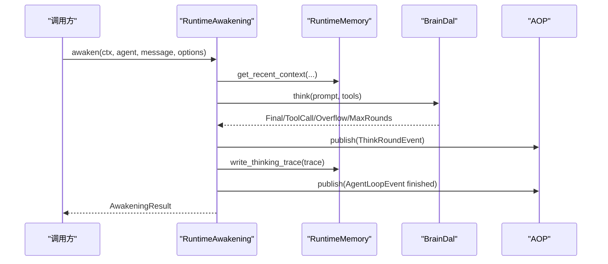

# Runtime 领域编排

<cite>
**本文引用的文件**
- [src/service/domain/runtime/mod.rs](src/service/domain/runtime/mod.rs)
- [src/service/domain/runtime/awakening.rs](src/service/domain/runtime/awakening.rs)
- [src/service/domain/runtime/think_loop.rs](src/service/domain/runtime/think_loop.rs)
- [src/service/domain/runtime/memory.rs](src/service/domain/runtime/memory.rs)
- [src/service/domain/runtime/compaction.rs](src/service/domain/runtime/compaction.rs)
- [src/service/domain/runtime/tool_execution.rs](src/service/domain/runtime/tool_execution.rs)
- [src/service/domain/runtime/busy_guard.rs](src/service/domain/runtime/busy_guard.rs)
- [src/pkg/agent_runtime_state.rs](src/pkg/agent_runtime_state.rs)
- [src/pkg/policy/mod.rs](src/pkg/policy/mod.rs)
- [src/pkg/policy/builtin.rs#L203-L262](src/pkg/policy/builtin.rs#L203-L262)
- [common/src/enums/thinking_scene.rs](common/src/enums/thinking_scene.rs)
- [common/src/api/runtime.rs](common/src/api/runtime.rs)
- [src/models/cortex_types.rs#L135-L195](src/models/cortex_types.rs#L135-L195)
- [src/handlers/hr/agent/runtime_status.rs](src/handlers/hr/agent/runtime_status.rs)
- [src/handlers/hr/agent/runtime_list.rs](src/handlers/hr/agent/runtime_list.rs)
- [src/handlers/hr/agent/cancel_thinking.rs](src/handlers/hr/agent/cancel_thinking.rs)
- [src/models/events/think_round.rs](src/models/events/think_round.rs)
- [src/consumer/think_round_stats_consumer.rs](src/consumer/think_round_stats_consumer.rs)
- [src/consumer/agent_loop_consumer.rs](src/consumer/agent_loop_consumer.rs)
- [src/service/dal/agent/mod.rs](src/service/dal/agent/mod.rs)
- [src/service/dal/agent/builder/default.rs](src/service/dal/agent/builder/default.rs)
- [src/service/dal/agent/builder/flat.rs](src/service/dal/agent/builder/flat.rs)
- [src/service/domain/runtime/types.rs](src/service/domain/runtime/types.rs)
- [src/service/domain/runtime/tool_call_query.rs](src/service/domain/runtime/tool_call_query.rs)
- [docs/ARCHITECTURE.md](docs/ARCHITECTURE.md)

**更新摘要 2026-08-29**：① 补充 NoProgressPolicy 作为第六个内置策略（builtin.rs#L203-L262），退出条件从仅 MaxRounds 单一防线升级为纵深防御链（疲劳提示 8 轮 → NoProgressPolicy 20 次单工具触发 → 365 轮上限）；② PromptBuilder trait 从扁平 prompt 升级为 System/User 消息分层（ChatMessage::System 变体），首次符合 Chat Completions API 规范；③ agent.rs 拆分为 agent/mod.rs + agent/builder/*.rs 子模块；④ summary.rs 删除，新增 compaction.rs 上下文压缩模块；⑤ awaken() 移除 Phase 1 IntentAnalyze 强制调用（intent_analyze.rs 保留为独立工具，不再是 awaken 必经路径），简化为单阶段直接执行；⑥ PromptBuilder trait 新增 build_final_response_guidance() 方法，注入 §0-§5 回复规则（审题 SOP + 何时直接回复 + send_message 正确用途 + 闲聊豁免 + 检索空结果 + 禁止假忙），放在 System 消息尾部；⑦ 新增 recursive_settle_call 递归拦截（compaction.rs / think_loop.rs is_recursive_settle_call），防止 Agent 在上下文压缩过程中再次触发 settle_memory 导致无限递归。

**本文关联三类文档**
- 【① Design 决策快照】[thinking_task_policy_engine_design.md](docs/design/thinking_task_policy_engine_design.md) — trait 聚合与接口层数据流
- 【② Plan 落地快照】占位：待 [2026-08-14-policy-engine-and-think-runtime.md](docs/superpowers/plans/2026-08-14-policy-engine-and-think-runtime.md) 由 ai-orz-doc-maintainer 精简到 docs/archive/plan-archive/ 后回填（现参考 superpowers 执行蓝图）
- 【④ RAG 原子知识卡】
  - [策略引擎：Policy trait + PolicyGroup 嵌套组合 + policy_set! 宏声明式写法](docs/wiki/knowledge/zh/策略引擎：Policy%20trait%20+%20PolicyGroup%20嵌套组合%20+%20policy_set!%20宏声明式写法/策略引擎：Policy%20trait%20+%20PolicyGroup%20嵌套组合%20+%20policy_set!%20宏声明式写法.md)
  - [Agent 思考运行时 AgentThinkRuntime：挂载清理取消与每轮快照上报](docs/wiki/knowledge/zh/Agent%20思考运行时%20AgentThinkRuntime：挂载清理取消与每轮快照上报/Agent%20思考运行时%20AgentThinkRuntime：挂载清理取消与每轮快照上报.md)
  - [思考运行时前端观测：runtime-status cancel-thinking runtime-list 接口与 runtime_panel 组件](docs/wiki/knowledge/zh/思考运行时前端观测：runtime-status%20cancel-thinking%20runtime-list%20接口与%20runtime_panel%20组件/思考运行时前端观测：runtime-status%20cancel-thinking%20runtime-list%20接口与%20runtime_panel%20组件.md)
  - [思考退出原因 exit_reason 统计与 ThinkRoundEvent AOP 事件链路](docs/wiki/knowledge/zh/思考退出原因%20exit_reason%20统计与%20ThinkRoundEvent%20AOP%20事件链路/思考退出原因%20exit_reason%20统计与%20ThinkRoundEvent%20AOP%20事件链路.md)
- 【③ Wiki 关联长文】
  - [运行时领域.md](docs/wiki/zh/content/核心模块/服务层/领域层/运行时领域.md) — 业务视角系统化说明
  - [思考运行时面板观测接口.md](docs/wiki/zh/content/前端应用/组件系统/业务组件/思考运行时面板观测接口.md) — 前端组件 + Handler 编排
  - [思考轮次统计消费者.md](docs/wiki/zh/content/基础设施/AOP%20事件系统/事件消费者/思考轮次统计消费者.md) — AOP 消费链路
- [AgentRuntimeInfo 状态机 + BusyGuard RAII：Idle/Busy/Resting 三态转换 + task_id/project_id 业务上下文 + 前端 runtime-list 过滤](docs/wiki/knowledge/zh/AgentRuntimeInfo 三态状态机 + BusyGuard RAII：Idle Busy Resting 转换 + task_id project_id 业务上下文透视/AgentRuntimeInfo 三态状态机 + BusyGuard RAII：Idle Busy Resting 转换 + task_id project_id 业务上下文透视.md)
- [运行时诊断工具注册为 Agent 可调用工具：runtime-status cancel-thinking runtime-list 三接口工具化](docs/wiki/knowledge/zh/运行时诊断工具注册为 Agent 可调用工具：runtime-status cancel-thinking runtime-list 三接口工具化/运行时诊断工具注册为 Agent 可调用工具：runtime-status cancel-thinking runtime-list 三接口工具化.md)
- [A2A Client + 外部 Agent Runtime：A2aRuntimeDao HTTP 调用 + ExternalCortexDao 桥接 + A2aCallbackDao Push 推送](docs/wiki/knowledge/zh/A2A Client + 外部 Agent Runtime：A2aRuntimeDao HTTP 调用 + ExternalCortexDao 桥接 + A2aCallbackDao Push 推送/A2A Client + 外部 Agent Runtime：A2aRuntimeDao HTTP 调用 + ExternalCortexDao 桥接 + A2aCallbackDao Push 推送.md)
- [Intent 感知两阶段唤醒：IntentAnalyze Phase1 七字段意图分析 + 6 级 JSON 降级兜底 + Awaken Phase2 正式执行串联](docs/wiki/knowledge/zh/Intent 感知两阶段唤醒：IntentAnalyze Phase1 七字段意图分析 + 6 级 JSON 降级兜底 + Awaken Phase2 正式执行串联/Intent 感知两阶段唤醒：IntentAnalyze Phase1 七字段意图分析 + 6 级 JSON 降级兜底 + Awaken Phase2 正式执行串联.md)
- [ChatMessage::System 消息角色：人设·指令·规则 与 对话内容分层传递给 Chat Completions API](docs/wiki/knowledge/zh/ChatMessage::System 消息角色：人设·指令·规则 与 对话内容分层传递给 Chat Completions API/ChatMessage::System 消息角色：人设·指令·规则 与 对话内容分层传递给 Chat Completions API.md)
- [Handler 宏工具 ToolPo config 与 parameters_schema 字段分离：运行时行为配置（无进展限制）与参数 JSON Schema 各归其位](docs/wiki/knowledge/zh/Handler 宏工具 ToolPo config 与 parameters_schema 字段分离：运行时行为配置（无进展限制）与参数 JSON Schema 各归其位/Handler 宏工具 ToolPo config 与 parameters_schema 字段分离：运行时行为配置（无进展限制）与参数 JSON Schema 各归其位.md)
</cite>

## 目录
1. [简介](#简介)
2. [项目结构](#项目结构)
3. [核心组件](#核心组件)
4. [架构总览](#架构总览)
5. [详细组件分析](#详细组件分析)
6. [依赖关系分析](#依赖关系分析)
7. [性能与稳定性](#性能与稳定性)
8. [故障排查指南](#故障排查指南)
9. [结论](#结论)
10. [附录：编排示例](#附录编排示例)

## 更新摘要
**Batch1 2026-08-17 增量同步**：针对 RuntimeDomain trait 聚合新增 3 个观测/编排入口（runtime_status/runtime_list/cancel_thinking）、策略引擎 policy_set! 按场景装配、AgentThinkRuntime 与状态管理器协作、AgentAwakeEvent.exit_reason 归一化事件 4 个增量模块完成增量更新。§5 新增「RuntimeDomain 暴露的三个观测/编排接口」小节，§8 故障排查补 2 条。cite 区补四类文档互引闭环。

## 简介
本文件面向 Runtime 领域的「运行时编排」，聚焦 Agent 唤醒机制、策略引擎按场景装配、3 个观测/编排 HTTP Handler 对接、记忆管理、工具执行、忙闲保护等关键能力，并围绕 Runtime trait 聚合方式、运行时状态管理、资源调度、并发控制展开说明。文档同时给出 Agent 生命周期编排、策略装配、观测接口 DTO 链路、记忆存取编排、工具调用编排的业务模式与流程图示，帮助读者理解如何在高并发场景下保证高性能与稳定性。

## 项目结构
Runtime 领域位于 service/domain/runtime，采用 trait + impl 的聚合式组织方式：
- mod.rs：定义 RuntimeDomain 及其子能力 trait（记忆、唤醒、工具执行），并提供单例入口与实现类。
- awakening.rs：Agent 唤醒主流程、思考循环、上下文压缩与总结退出。
- memory.rs：运行时记忆读写薄封装，复用 DAL 层接口。
- tool_execution.rs：工具协议路由、授权校验、错误映射与追踪查询。
- busy_guard.rs：基于 RAII 的忙闲状态清理保障。
- pkg/agent_runtime_state.rs：全局内存态管理器，提供 Idle/Busy/Resting 状态与原子 try_set_busy。

图表来源
- [src/service/domain/runtime/mod.rs:31-49](src/service/domain/runtime/mod.rs#L31-L49)
- [src/service/domain/runtime/awakening.rs:151-363](src/service/domain/runtime/awakening.rs#L151-L363)
- [src/service/domain/runtime/memory.rs:10-119](src/service/domain/runtime/memory.rs#L10-L119)
- [src/service/domain/runtime/tool_execution.rs:12-186](src/service/domain/runtime/tool_execution.rs#L12-L186)
- [src/pkg/agent_runtime_state.rs:31-157](src/pkg/agent_runtime_state.rs#L31-L157)
- [src/consumer/agent_loop_consumer.rs:26-96](src/consumer/agent_loop_consumer.rs#L26-L96)

章节来源
- [src/service/domain/runtime/mod.rs:1-469](src/service/domain/runtime/mod.rs#L1-L469)
- [docs/ARCHITECTURE.md:150-227](docs/ARCHITECTURE.md#L150-L227)

## 核心组件
- RuntimeDomain 聚合器：统一暴露 memory()/awakening()/tool_execution() 三个能力视图，并提供 agent_runtime_state/is_agent_unavailable 查询。
- RuntimeAwakening：负责装配 Brain、awaken/sleep_and_settle、共享 think loop、上下文压缩与总结退出。
- RuntimeMemory：对 DAL Memory 的薄封装，提供 get_recent_context/write_thinking_trace/search/query/traverse_graph 等。
- RuntimeToolExecution：按协议路由到 MCP/Builtin/Http 工具执行，维护授权、错误映射与追踪查询。
- BusyGuard：确保任何路径（包括 panic）都释放 Busy/Resting 状态为 Idle。
- AgentRuntimeStateManager：内存态 DashMap，提供 set_idle/set_resting/set_busy/try_set_busy 及状态变更事件发布。

章节来源
- [src/service/domain/runtime/mod.rs:31-49](src/service/domain/runtime/mod.rs#L31-L49)
- [src/service/domain/runtime/awakening.rs:151-363](src/service/domain/runtime/awakening.rs#L151-L363)
- [src/service/domain/runtime/memory.rs:10-119](src/service/domain/runtime/memory.rs#L10-L119)
- [src/service/domain/runtime/tool_execution.rs:12-186](src/service/domain/runtime/tool_execution.rs#L12-L186)
- [src/service/domain/runtime/busy_guard.rs:1-33](src/service/domain/runtime/busy_guard.rs#L1-L33)
- [src/pkg/agent_runtime_state.rs:31-157](src/pkg/agent_runtime_state.rs#L31-L157)

## 架构总览
Runtime 遵循严格分层：Adapter → Domain → DAL → DAO。Runtime 作为 Domain 层，组合多个 DAL（BrainDal、ToolDal、McpToolDal、AgentDal、CodexAgentDal、A2aAgentDal），并通过 AOP 事件中心对外发布 AgentLoopEvent 与 ThinkRoundEvent，供消费者记录日志与指标。

图表来源
- [src/service/domain/runtime/awakening.rs:415-748](src/service/domain/runtime/awakening.rs#L415-L748)
- [src/service/domain/runtime/memory.rs:14-67](src/service/domain/runtime/memory.rs#L14-L67)
- [src/consumer/agent_loop_consumer.rs:26-96](src/consumer/agent_loop_consumer.rs#L26-L96)

章节来源
- [docs/ARCHITECTURE.md:229-242](docs/ARCHITECTURE.md#L229-L242)
- [src/service/domain/runtime/mod.rs:248-399](src/service/domain/runtime/mod.rs#L248-L399)

## 详细组件分析

### 唤醒与思考循环（RuntimeAwakening）
- 统一 think loop：run_think_loop 封装超时、多轮迭代、工具调用分发、上下文压缩检测与统计事件发布。
- 上下文压缩：当 input_tokens 达到阈值时中断循环，触发 sleep_and_settle 沉淀后重试；累计轮次跨压缩保持。
- 总结退出：当达到最大轮次限制时进入 summary 流程，让 Agent 总结当前工作并发送/记录结果。
- 状态保护：awaken 设置 Busy，sleep_and_settle 设置 Resting，均通过 BusyGuard 在 Drop 时恢复 Idle。

图表来源
- [src/service/domain/runtime/awakening.rs:151-363](src/service/domain/runtime/awakening.rs#L151-L363)
- [src/service/domain/runtime/awakening.rs:415-748](src/service/domain/runtime/awakening.rs#L415-L748)
- [src/service/domain/runtime/busy_guard.rs:1-33](src/service/domain/runtime/busy_guard.rs#L1-L33)

章节来源
- [src/service/domain/runtime/awakening.rs:151-363](src/service/domain/runtime/awakening.rs#L151-L363)
- [src/service/domain/runtime/awakening.rs:415-748](src/service/domain/runtime/awakening.rs#L415-L748)

### RuntimeDomain 暴露的三个观测/编排接口：runtime_status、runtime_list、cancel_thinking
- **接口归属（严格分层）**：HTTP Handler（Adapter 层）→ RuntimeDomain.awakening() 或新增的 runtime 查询方法（Domain 层）→ AgentRuntimeStateManager（pkg 基础设施层）。Handler 只做鉴权（组织下成员可见，SuperAdmin 不受限）+ 参数校验（Pagination/Path/Body 结构体化），禁止直接访问 DashMap。
- **runtime_status（GET /agents/{id}/runtime-status）**：RuntimeDomain 返回 AgentRuntimeInfo（三态 + 业务上下文 message_id/task_id/project_id）+ think_runtime Option<ThinkRuntimeSnapshot>（如果 Busy 态 Some）；DTO 组装成 common/src/api/runtime.rs RuntimeStatusResponse。实现：只读 StateManager，不写任何内存状态，完全读无副作用。
- **runtime_list（GET /agents/runtime-list）**：Query 参数：organization_id（从 ctx 解析，不得前端传入伪造其他组织）+ status filter（Busy/Resting/All）+ pagination。严格遵循通用 count 规范（§4.9）：返回 PagedResult<RuntimeListItem>，count 与 list 复用同一套过滤条件（即使是内存态 DashMap 也要保持 PagedResult 形状，将来落盘 Handler/前端零改动）。
- **cancel_thinking（POST /agents/{id}/cancel-thinking）**：Handler 只做权限校验，调 RuntimeDomain.awakening().cancel_think(ctx, agent_id) → StateManager.cancel_think()（只做 Arc<AtomicBool>.store(true) + 返回当前 think_runtime 是否 Some 的 was_thinking）。严格禁止 cancel 路径上的任何 await 阻塞、任何 DAL/DAO 事件发布。事件由 think_loop 下一轮命中 UserCancelPolicy 后统一 publish(AgentAwakeEvent exit_reason=user_cancel)。
- **DTO 单一事实源**：所有结构体定义在 common/src/api/runtime.rs（RuntimeStatusRequest/RuntimeStatusResponse/RuntimeListRequest/RuntimeListResponse/RuntimeListItem/CancelThinkingResponse/ThinkRuntimeSnapshotDTO），禁止前端/handler 本地镜像；禁止裸响应（CancelThinkingResponse 即使只有 success/was_thinking 两字段也结构体化，符合 AGENTS.md §4.11 API 协议规范）。

**章节来源**
- [src/service/domain/runtime/mod.rs:248-399](src/service/domain/runtime/mod.rs#L248-L399)
- [common/src/api/runtime.rs](common/src/api/runtime.rs)
- [src/handlers/hr/agent/runtime_status.rs](src/handlers/hr/agent/runtime_status.rs)
- [src/handlers/hr/agent/runtime_list.rs](src/handlers/hr/agent/runtime_list.rs)
- [src/handlers/hr/agent/cancel_thinking.rs](src/handlers/hr/agent/cancel_thinking.rs)
- [src/pkg/agent_runtime_state.rs:31-157](src/pkg/agent_runtime_state.rs#L31-L157)
- [src/pkg/policy/builtin.rs:Ln-Lm](src/pkg/policy/builtin.rs#L1-L180)（UserCancelPolicy 实现）
- [src/models/events/think_round.rs](src/models/events/think_round.rs)

### 记忆管理（RuntimeMemory）
- 最近短期记忆：get_recent_context 通过 DAL 查询 ShortTerm 记忆，限制条数用于 prompt 历史注入。
- 思考 Trace 写入：write_thinking_trace 统一补全 log_id/user_id/organization_id/task_id 后写入，并返回 Memory。
- 公开查询：search/query/recommend_seed_nodes/create/update/delete/traverse_graph 全部透传至 DAL。

图表来源
- [src/service/domain/runtime/memory.rs:10-119](src/service/domain/runtime/memory.rs#L10-L119)

章节来源
- [src/service/domain/runtime/memory.rs:10-119](src/service/domain/runtime/memory.rs#L10-L119)

### 工具执行（RuntimeToolExecution）
- 协议路由：根据 ToolProtocol 选择 McpToolDal 或通用 ToolDal 执行。
- 授权校验：call_manual_tool_for_agent 校验工具绑定、ControlMode=Manual、以及 neural/installed_tags 过滤。
- 错误映射：MCP 错误规范化提示，Builtin/Http 脱敏底层细节，保留 field/source 信息。
- 追踪查询：基于 ToolCallLogger 提供列表与按 call_id 查询，且受 RequestContext 作用域约束。

图表来源
- [src/service/domain/runtime/tool_execution.rs:12-186](src/service/domain/runtime/tool_execution.rs#L12-L186)

章节来源
- [src/service/domain/runtime/tool_execution.rs:12-186](src/service/domain/runtime/tool_execution.rs#L12-L186)

### 忙闲保护与状态管理（BusyGuard + AgentRuntimeStateManager）
- BusyGuard：RAII 守卫，Drop 时调用 set_idle，避免异常路径导致状态泄漏。
- AgentRuntimeStateManager：内存态管理，支持 set_idle/set_resting/set_busy/try_set_busy；try_set_busy 解决 TOCTOU 竞态，防止同一 Agent 被并发唤醒。
- 状态事件：状态变更通过 AOP 同步发布 AgentStateEvent，供监控与前端展示。

图表来源
- [src/service/domain/runtime/busy_guard.rs:1-33](src/service/domain/runtime/busy_guard.rs#L1-L33)
- [src/pkg/agent_runtime_state.rs:51-107](src/pkg/agent_runtime_state.rs#L51-L107)

章节来源
- [src/service/domain/runtime/busy_guard.rs:1-33](src/service/domain/runtime/busy_guard.rs#L1-L33)
- [src/pkg/agent_runtime_state.rs:31-157](src/pkg/agent_runtime_state.rs#L31-L157)

## 依赖关系分析
- RuntimeDomainImpl 组合多个 DAL：BrainDal、ToolDal、McpToolDal、AgentDal、CodexAgentDal、A2aAgentDal，并通过 ToolCallLogger 进行追踪。
- awakening 依赖 memory、brain_dal、tool_dal/mcp_tool_dal 完成思考与工具调用。
- tool_execution 依赖 tool_dal/mcp_tool_dal 与 tool_call_logger。
- 状态管理通过 pkg/agent_runtime_state 全局单例，所有唤醒/沉睡流程共享。

图表来源
- [src/service/domain/runtime/mod.rs:248-399](src/service/domain/runtime/mod.rs#L248-L399)
- [src/service/domain/runtime/awakening.rs:151-363](src/service/domain/runtime/awakening.rs#L151-L363)
- [src/service/domain/runtime/tool_execution.rs:12-186](src/service/domain/runtime/tool_execution.rs#L12-L186)
- [src/pkg/agent_runtime_state.rs:31-157](src/pkg/agent_runtime_state.rs#L31-L157)

章节来源
- [src/service/domain/runtime/mod.rs:248-399](src/service/domain/runtime/mod.rs#L248-L399)

## 性能与稳定性
- 超时与轮次保护：think loop 内置 300s 超时与最大轮次限制，避免长尾任务拖垮服务。
- 上下文压缩：input_tokens 达到阈值即触发沉淀，降低后续轮次的上下文压力，提升吞吐。
- 并发安全：try_set_busy 原子尝试设置 Busy，避免同一 Agent 被重复唤醒；BusyGuard 确保状态回收。
- 错误隔离：工具执行失败不阻塞主流程（如总结失败仅告警），统计写入失败不影响业务返回。
- 事件解耦：AOP 事件同步转发但消费端异步处理，降低主链路延迟。

[本节为通用指导，无需特定文件引用]

## 故障排查指南
- Agent 永远 Busy：检查 awaken 中 set_busy 后是否有异常提前返回导致 BusyGuard 未释放；确认 BusyGuard 已正确构造（set_busy_with_think_runtime 之后立即构造，中间不能有任何可能提前 return 的语句）。
- Policy required_metrics 声明的 key 在 think_loop 构造 Metrics 时漏注入：新增 Policy 的 required_metrics() 有哪些 key，think_loop 开头 Metrics::new().with() 必须全部注入（即使是 0/false）；缺 key 不会导致运行时 panic，但会导致策略永不命中（比如 MaxRoundsPolicy 读不到"rounds"）。可以从 pkg/policy/tests.rs 的 required_metrics 声明完整性测试中反查漏注入。
- runtime-list count 与 list 数量不一致（分页显示错误）：确认 DAO/Domain 的 count(query) 和 list(query) 复用了**完全相同的 push_query_filters**；即使是内存态 DashMap 也要抽独立的过滤函数，count 与 list 都调用（禁止 count 单独写一套过滤逻辑）。
- 上下文溢出频繁：调整 ModelProvider 的 recommended_context_length 或 max_context_length，或优化 prompt 长度；可考虑把 ContextOverflowPolicy 从独立的 Or 策略升级为与 sleep_and_settle 阈值严格对齐（目前 run_think_loop 有独立溢出判断逻辑，后续可整合进策略引擎统一）。
- 工具执行失败：查看 tool_execution 的错误映射逻辑，区分 MCP 超时/服务器不可用/工具禁用等情况；核对 ControlMode 与标签过滤。
- 统计缺失：确认 AOP 事件发布成功，消费者正常注册；若统计写入失败，关注警告日志但不影响业务。

章节来源
- [src/service/domain/runtime/busy_guard.rs:1-33](src/service/domain/runtime/busy_guard.rs#L1-L33)
- [src/service/domain/runtime/awakening.rs:151-363](src/service/domain/runtime/awakening.rs#L151-L363)
- [src/service/domain/runtime/tool_execution.rs:188-219](src/service/domain/runtime/tool_execution.rs#L188-L219)
- [src/consumer/agent_loop_consumer.rs:26-96](src/consumer/agent_loop_consumer.rs#L26-L96)

## 结论
Runtime 领域通过清晰的 trait 抽象与 DAL 组合，实现了 Agent 唤醒、记忆沉淀、工具执行与状态保护的完整编排。think loop 的超时、轮次与上下文压缩机制保障了在高负载下的稳定性；BusyGuard 与 try_set_busy 解决了并发与状态泄漏问题；AOP 事件将可观测性融入主线流程。整体设计兼顾了高性能与可维护性，便于后续扩展更多 Agent 类型与工具协议。

[本节为总结性内容，无需特定文件引用]

## 附录：编排示例

### 示例一：Agent 唤醒流程
- 步骤要点：
  - 设置 Busy，构造 MemoryTrace 获取 trace_id。
  - 读取近期短期记忆，构建 Prompt（系统/技能/历史/业务上下文）。
  - 执行 think loop，处理 Final/ToolCall/ContextOverflow/MaxRoundsExceeded。
  - 写入思考 Trace，发布 AgentLoopEvent 与 ThinkRoundEvent。
  - 正常完成后触发总结写入短期记忆。

图表来源
- [src/service/domain/runtime/awakening.rs:415-748](src/service/domain/runtime/awakening.rs#L415-L748)
- [src/service/domain/runtime/memory.rs:14-67](src/service/domain/runtime/memory.rs#L14-L67)
- [src/consumer/agent_loop_consumer.rs:26-96](src/consumer/agent_loop_consumer.rs#L26-L96)

章节来源
- [src/service/domain/runtime/awakening.rs:415-748](src/service/domain/runtime/awakening.rs#L415-L748)

### 示例二：记忆检索优化
- 使用 get_recent_context 限制条数，减少 prompt 体积。
- 通过 search/query 精准检索相关片段，避免全量加载。
- 知识图谱遍历 traverse_graph 以种子节点出发，按需扩展深度与宽度。

章节来源
- [src/service/domain/runtime/memory.rs:14-119](src/service/domain/runtime/memory.rs#L14-L119)

### 示例三：工具执行监控
- 工具执行前校验启用状态与控制模式。
- 错误映射规范化，便于定位 MCP/HTTP 问题。
- 通过 ToolCallLogger 查询调用轨迹，结合 RequestContext 作用域限制访问范围。

章节来源
- [src/service/domain/runtime/tool_execution.rs:12-186](src/service/domain/runtime/tool_execution.rs#L12-L186)

### 本文关联的三类文档（四类互引闭环，Batch11 精确对齐）
#### ① Design 决策快照
- [intent_aware_two_stage_awaken_design.md](docs/archive/design-archive/intent_aware_two_stage_awaken_design.md) — Runtime 两阶段编排总纲：RuntimeDomain::analyze_input_intent 独立可调用 trait + awaken 内部 Phase1/Phase2 数据流边界
#### ② Plan 落地快照
- [唤醒上下文与睡眠约束.md](docs/archive/plan-archive/唤醒上下文与睡眠约束.md) — ThinkingOptions scene 分发 + awaken/sleep_and_settle 签名统一
#### ④ RAG 原子知识卡
- [Intent 感知两阶段唤醒：IntentAnalyze Phase1 七字段意图分析 + 6 级 JSON 降级兜底 + Awaken Phase2 正式执行串联](docs/wiki/knowledge/zh/Intent%20感知两阶段唤醒：IntentAnalyze%20Phase1%20七字段意图分析%20+%206%20级%20JSON%20降级兜底%20+%20Awaken%20Phase2%20正式执行串联/Intent%20感知两阶段唤醒：IntentAnalyze%20Phase1%20七字段意图分析%20+%206%20级%20JSON%20降级兜底%20+%20Awaken%20Phase2%20正式执行串联.md) — §2 RuntimeDomain trait 方法签名表 + §3 数据流（Phase1/1.5/2 三步串联 + Prompt 仅供参考原则）
