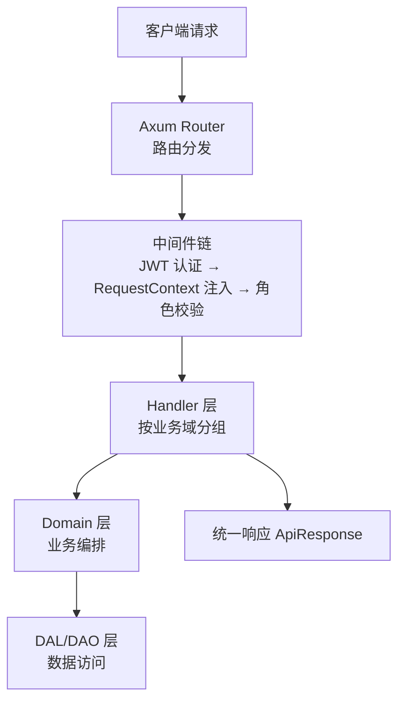
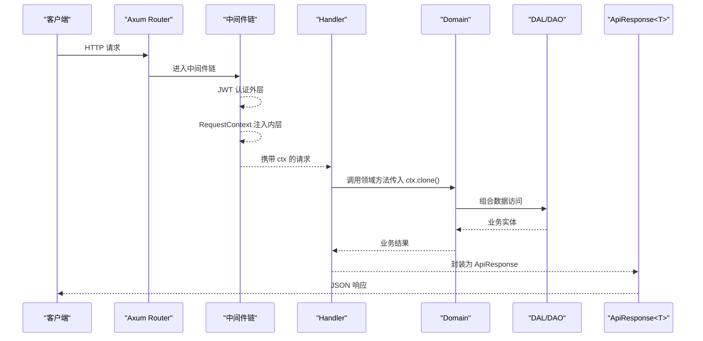

# Handler 层设计

<cite>
**本文引用的文件**
- [src/handlers/mod.rs](src/handlers/mod.rs)
- [src/router.rs](src/router.rs)
- [src/middleware/jwt_auth.rs](src/middleware/jwt_auth.rs)
- [src/middleware/request_context.rs](src/middleware/request_context.rs)
- [src/middleware/require_role.rs](src/middleware/require_role.rs)
- [common/src/api/mod.rs](common/src/api/mod.rs)
- [src/handlers/hr/agent/create_agent.rs](src/handlers/hr/agent/create_agent.rs)
- [src/handlers/project/projects/create_project.rs](src/handlers/project/projects/create_project.rs)
- [docs/ARCHITECTURE.md](docs/ARCHITECTURE.md)
</cite>

## 目录
1. [引言](#引言)
2. [项目结构](#项目结构)
3. [核心组件](#核心组件)
4. [架构总览](#架构总览)
5. [详细组件分析](#详细组件分析)
6. [依赖分析](#依赖分析)
7. [性能考虑](#性能考虑)
8. [故障排查指南](#故障排查指南)
9. [结论](#结论)
10. [附录](#附录)

## 引言
本设计文档聚焦 AI Orz 系统的 Handler 层，阐述其与用户 Action 的直接对应关系、单一职责边界、HTTP 请求处理流程（参数验证、错误处理、响应格式化）、各业务模块（HR、Finance、Project、System）的 Handler 组织与命名规范，以及中间件集成、认证授权、请求上下文传递等关键实现细节。同时提供新增 Handler 的正确实践示例，涵盖异步操作与事务管理的建议。

## 项目结构
Handler 层位于 src/handlers，按业务域划分模块：hr、finance、project、system、organization、user、a2a、health。每个 Handler 函数对应一个用户动作或 HTTP API，通过路由注册到 Axum Router。公共 DTO 与统一响应格式定义在 common/src/api。

图表来源
- [src/router.rs:12-136](src/router.rs#L12-L136)
- [src/middleware/jwt_auth.rs:25-87](src/middleware/jwt_auth.rs#L25-L87)
- [src/middleware/request_context.rs:20-40](src/middleware/request_context.rs#L20-L40)
- [common/src/api/mod.rs:6-49](common/src/api/mod.rs#L6-L49)

章节来源
- [src/handlers/mod.rs:1-11](src/handlers/mod.rs#L1-L11)
- [src/router.rs:12-136](src/router.rs#L12-L136)
- [common/src/api/mod.rs:6-49](common/src/api/mod.rs#L6-L49)

## 核心组件
- 路由与中间件：
  - 公开路由与保护路由分离；保护路由整体挂载 JWT 认证与 RequestContext 注入中间件。
  - System 域整体要求 Admin 权限，部分高危接口在 handler 内部二次校验 SuperAdmin。
- 认证与授权：
  - JWT 双模式认证（Cookie/Bearer），失败时浏览器重定向、API 返回 401。
  - 角色中间件基于 UserRole 继承关系进行最小权限校验。
- 请求上下文：
  - RequestContext 从请求头提取用户信息并注入扩展，LogId 写回响应头。
- 统一响应：
  - ApiResponse<T> 作为所有 HTTP 响应的标准包装，包含 code/message/data。

章节来源
- [src/router.rs:61-136](src/router.rs#L61-L136)
- [src/middleware/jwt_auth.rs:25-87](src/middleware/jwt_auth.rs#L25-L87)
- [src/middleware/require_role.rs:16-38](src/middleware/require_role.rs#L16-L38)
- [src/middleware/request_context.rs:20-40](src/middleware/request_context.rs#L20-L40)
- [common/src/api/mod.rs:6-49](common/src/api/mod.rs#L6-L49)

## 架构总览
Handler 层严格遵循单向调用：Adapter（Handler）→ Domain → DAL → DAO。Handler 仅负责 DTO 解析、RequestContext 补全、DTO↔Command/Query 转换、响应组装，不承载复杂业务规则。

图表来源
- [src/router.rs:96-136](src/router.rs#L96-L136)
- [src/middleware/jwt_auth.rs:25-87](src/middleware/jwt_auth.rs#L25-L87)
- [src/middleware/request_context.rs:20-40](src/middleware/request_context.rs#L20-L40)
- [common/src/api/mod.rs:6-49](common/src/api/mod.rs#L6-L49)

## 详细组件分析

### HR 模块 Handler 组织结构与职责
- 目录结构：handlers/hr/{agent, skill}，每个子目录对应一组相关动作（如 agent CRUD、技能安装/卸载、记忆查询等）。
- 命名规范：文件名以动词+名词形式表达具体动作（如 create_agent.rs、list_agents.rs、query_agents.rs）。
- 职责边界：
  - 解析 common::api 中的请求 DTO，提取 RequestContext 中的用户信息。
  - 构造业务实体（Agent/Skill），调用 domain().agent_manage()/skill_domain() 完成业务编排。
  - 将 Domain 返回的业务实体转换为响应 DTO，使用 ApiResponse 包装。
- 示例路径：
  - 创建 Agent：[create_agent.rs](src/handlers/hr/agent/create_agent.rs)
  - 列出/查询/搜索 Agent：[list_agents.rs](src/handlers/hr/agent/list_agents.rs)、[query_agents.rs](src/handlers/hr/agent/query_agents.rs)、[search_agents.rs](src/handlers/hr/agent/search_agents.rs)
  - 技能管理：[create_skill_handler](src/handlers/hr/skill/)、[install/uninstall skill to/from agent](src/handlers/hr/skill/)

章节来源
- [src/handlers/hr/mod.rs:1-11](src/handlers/hr/mod.rs#L1-L11)
- [src/handlers/hr/agent/create_agent.rs:1-60](src/handlers/hr/agent/create_agent.rs#L1-L60)
- [src/router.rs:292-413](src/router.rs#L292-L413)

### Finance 模块 Handler 组织结构与职责
- 目录结构：handlers/finance/{attachment, mcp_server, mcp_tool, message, message_channel, model_provider, tool}。
- 职责边界：
  - 模型提供商管理（CRUD、测试连接、切换嵌入、重建进度、调用模型）。
  - 消息与渠道管理（发送消息、列表/搜索、SSE 订阅、渠道配置与状态）。
  - 工具与 MCP 服务器管理（同步工具、绑定/解绑、调试调用）。
  - 附件管理（上传、文本附件、内容读写、删除）。
- 示例路径：
  - 模型提供商：[model_provider/*](src/handlers/finance/model_provider/)
  - 消息通道：[message_channel/*](src/handlers/finance/message_channel/)
  - 工具管理：[tool/*](src/handlers/finance/tool/)

章节来源
- [src/handlers/finance/mod.rs:1-15](src/handlers/finance/mod.rs#L1-L15)
- [src/router.rs:415-601](src/router.rs#L415-L601)

### Project 模块 Handler 组织结构与职责
- 目录结构：handlers/project/{artifact, projects, task}。
- 职责边界：
  - 项目管理（创建、列表、查询、搜索、更新、状态变更）。
  - 任务管理（创建、列表、查询、搜索、更新、进度、状态变更）。
  - 产物管理（创建、列表、获取内容、更新、删除）。
- 示例路径：
  - 创建项目：[create_project.rs](src/handlers/project/projects/create_project.rs)
  - 任务路由：[task_routes:177-213](src/router.rs#L177-L213)
  - 产物路由：[artifact_routes:215-240](src/router.rs#L215-L240)

章节来源
- [src/handlers/project/mod.rs:1-6](src/handlers/project/mod.rs#L1-L6)
- [src/handlers/project/projects/create_project.rs:1-47](src/handlers/project/projects/create_project.rs#L1-L47)
- [src/router.rs:145-240](src/router.rs#L145-L240)

### System 模块 Handler 组织结构与职责
- 目录结构：handlers/system/{backup, cron_trigger, logs, seed, aop, health_metrics, task_cleanup, task_list, task_progress}。
- 职责边界：
  - 系统维护（备份/恢复、种子配置导入导出、日志查询与统计、AOP 队列监控）。
  - 定时任务（Cron Trigger 的 CRUD、暂停/恢复）。
  - 健康指标聚合与后台任务管理。
- 权限控制：
  - System 路由整体要求 Admin 权限；某些高危操作在 handler 内部二次校验 SuperAdmin。

章节来源
- [src/handlers/system/mod.rs:1-13](src/handlers/system/mod.rs#L1-L13)
- [src/router.rs:603-739](src/router.rs#L603-L739)

### 中间件集成与认证授权
- 中间件顺序（洋葱模型）：
  - 外层：jwt_auth_middleware（验证 JWT，写入用户信息到请求头）。
  - 内层：request_context_middleware（从请求头创建 RequestContext，注入扩展）。
  - 可选：require_role_middleware（按最小角色校验）。
- 认证失败处理：
  - 浏览器请求：302 重定向到登录页。
  - API 请求：返回 401 JSON（ApiResponse.error）。
- 角色校验：
  - 基于 UserRole 继承关系，检查当前用户是否满足最小角色要求。

章节来源
- [src/router.rs:96-136](src/router.rs#L96-L136)
- [src/middleware/jwt_auth.rs:25-87](src/middleware/jwt_auth.rs#L25-L87)
- [src/middleware/request_context.rs:20-40](src/middleware/request_context.rs#L20-L40)
- [src/middleware/require_role.rs:16-38](src/middleware/require_role.rs#L16-L38)

### 请求上下文传递与参数验证
- RequestContext 由中间件从请求头提取并注入扩展，Handler 中通过 ctx.uid()/ctx.user_role() 获取用户信息。
- 参数验证：
  - 基础校验在 DTO 层（serde + schemars），Handler 中进行业务级校验（如用户上下文非空）。
  - 错误通过 common::error::{Result, bail_err, err} 抛出，统一转换为 ApiResponse。

章节来源
- [src/middleware/request_context.rs:20-40](src/middleware/request_context.rs#L20-L40)
- [src/handlers/hr/agent/create_agent.rs:18-41](src/handlers/hr/agent/create_agent.rs#L18-L41)
- [src/handlers/project/projects/create_project.rs:22-43](src/handlers/project/projects/create_project.rs#L22-L43)

### 响应格式化机制
- 所有 Handler 返回 Result<T>，T 为 common::api 中的响应 DTO。
- 成功响应：ApiResponse.success(data)。
- 错误响应：ApiResponse.error(code, message)，由框架统一序列化。

章节来源
- [common/src/api/mod.rs:6-49](common/src/api/mod.rs#L6-L49)

### 新增 Handler 最佳实践
- 步骤：
  1. 在 common/src/api 中定义请求/响应 DTO。
  2. 在 handlers/{domain}/{action}.rs 中实现 Handler 函数，使用 #[generate_http_handler] 宏生成路由适配。
  3. 在 router.rs 中注册路由，必要时添加 require_role_middleware。
  4. 在 Domain 层实现业务逻辑，Handler 仅做 DTO 转换与调用。
- 示例参考：
  - 创建 Agent：[create_agent.rs](src/handlers/hr/agent/create_agent.rs)
  - 创建项目：[create_project.rs](src/handlers/project/projects/create_project.rs)

章节来源
- [src/handlers/hr/agent/create_agent.rs:1-60](src/handlers/hr/agent/create_agent.rs#L1-L60)
- [src/handlers/project/projects/create_project.rs:1-47](src/handlers/project/projects/create_project.rs#L1-L47)
- [src/router.rs:292-413](src/router.rs#L292-L413)

### 异步操作与事务管理建议
- 异步操作：
  - 长耗时任务（如向量重建、备份/恢复）应通过 Domain 层发起后台任务，Handler 返回任务 ID，前端轮询 /system/tasks/{id}/progress。
  - SSE 推送用于实时消息（如 finance/message/subscribe_sse）。
- 事务管理：
  - 写操作建议在 Domain 层使用 DAL 的事务封装，确保多表一致性。
  - Handler 不直接管理事务，仅传递 ctx.clone() 给 Domain。

章节来源
- [src/router.rs:603-739](src/router.rs#L603-L739)
- [docs/ARCHITECTURE.md:325-386](docs/ARCHITECTURE.md#L325-L386)

## 依赖分析
Handler 层依赖关系清晰，无跨层调用：
- Handler → Domain（业务编排）
- Domain → DAL（数据访问组合）
- DAL → DAO（单一数据源操作）
- 中间件独立于业务，提供横切关注点（认证、上下文、权限）。

图表来源
- [docs/ARCHITECTURE.md:325-386](docs/ARCHITECTURE.md#L325-L386)

章节来源
- [docs/ARCHITECTURE.md:325-386](docs/ARCHITECTURE.md#L325-L386)

## 性能考虑
- 避免在 Handler 中执行重型计算，移至 Domain/DAL。
- 使用分页（PaginationParams/PagedResult）减少大数据量传输。
- 利用 RequestContext 的 LogId 进行链路追踪，便于性能分析。
- 对 SSE 和后台任务采用异步模式，避免阻塞请求线程。

## 故障排查指南
- 401 未认证：
  - 检查 JWT Cookie 或 Authorization 头是否正确设置。
  - 确认 jwt_auth_middleware 已正确挂载且顺序在外层。
- 403 权限不足：
  - 检查 require_role_middleware 的最小角色要求是否与用户角色匹配。
- 500 内部错误：
  - 查看 Domain/DAL 抛出的错误类型，确认 DTO 转换与业务逻辑正确性。
- 上下文缺失：
  - 确认 request_context_middleware 已注入 RequestContext，Handler 中 ctx.uid() 非空。

章节来源
- [src/middleware/jwt_auth.rs:139-155](src/middleware/jwt_auth.rs#L139-L155)
- [src/middleware/require_role.rs:20-38](src/middleware/require_role.rs#L20-L38)
- [src/middleware/request_context.rs:20-40](src/middleware/request_context.rs#L20-L40)

## 结论
Handler 层在 AI Orz 系统中承担“薄适配”职责，严格遵循分层架构与单一职责原则。通过统一的中间件链、DTO 与响应格式、清晰的模块组织，确保了可维护性与可扩展性。新增 Handler 时应遵循现有规范，将业务逻辑下沉至 Domain 层，保持 Handler 的简洁与专注。

## 附录
- 路由总览：
  - HR：/api/v1/hr/*
  - Finance：/api/v1/finance/*
  - Project：/api/v1/projects, /api/v1/tasks, /api/v1/artifacts
  - System：/api/v1/system/*
- 中间件顺序：
  - 外层：JWT 认证
  - 内层：RequestContext 注入
  - 可选：角色权限校验

章节来源
- [src/router.rs:12-136](src/router.rs#L12-L136)
- [src/router.rs:292-739](src/router.rs#L292-L739)