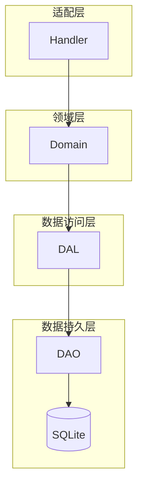
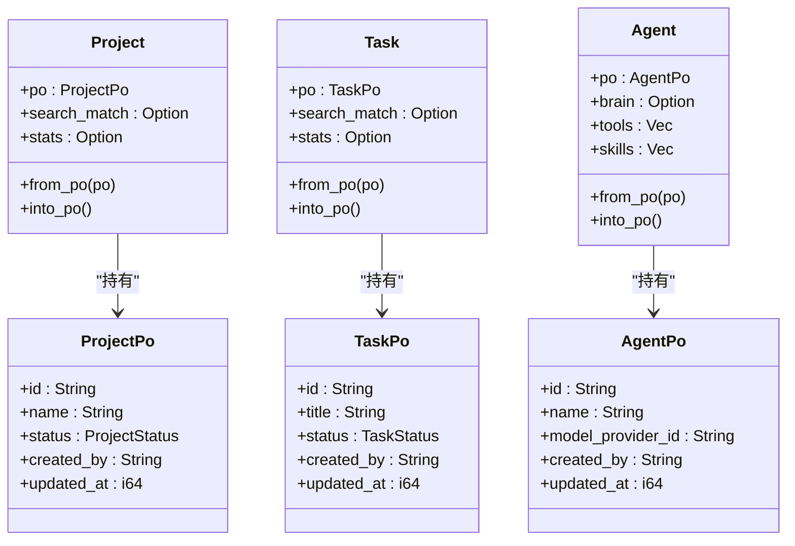
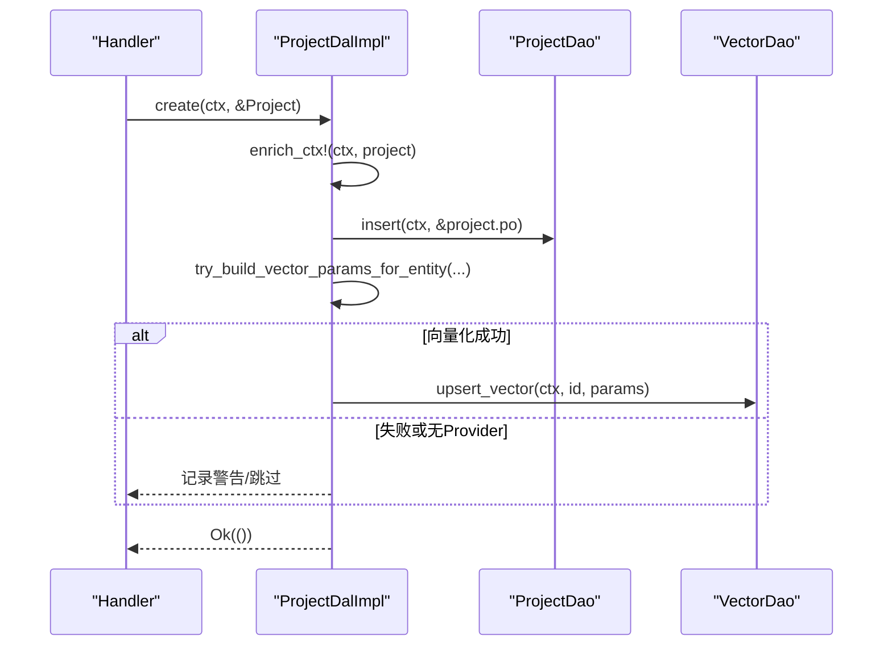
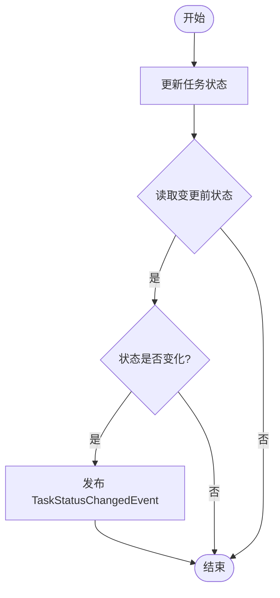
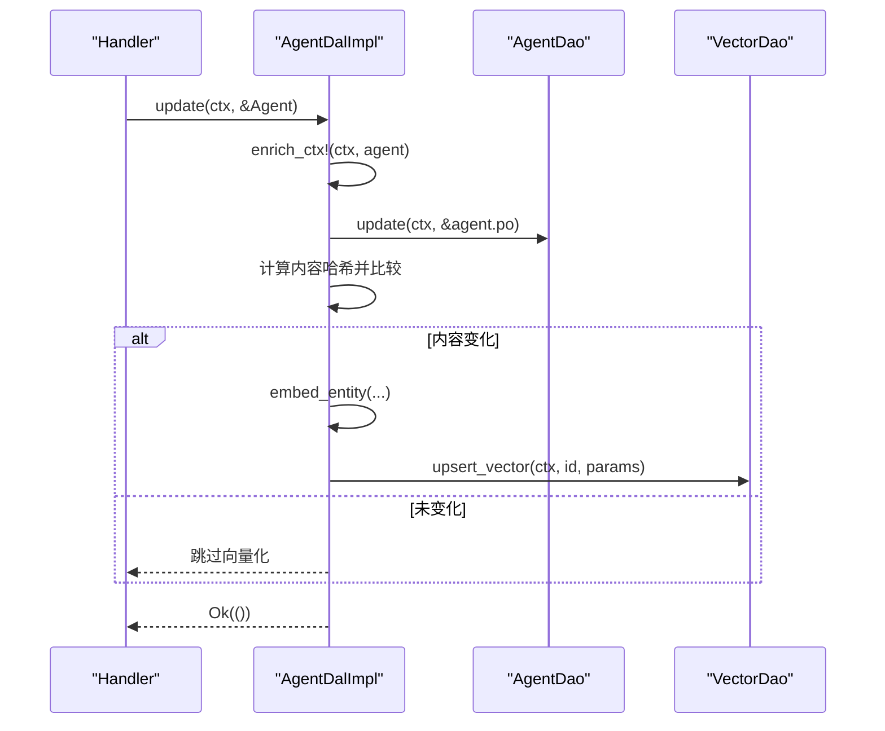
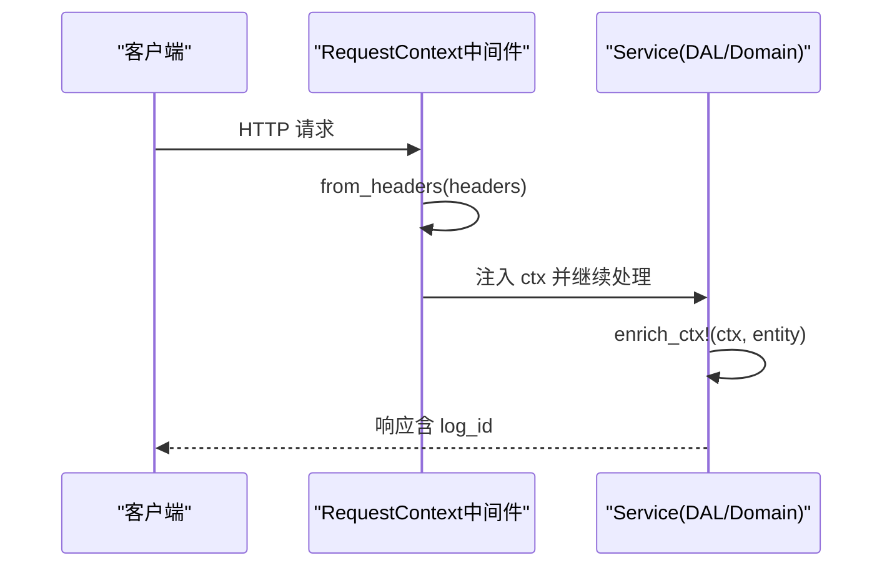
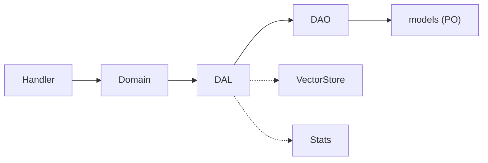

# PO 与业务实体分层

<cite>
**本文引用的文件**
- [src/models/project.rs](src/models/project.rs)
- [src/models/task.rs](src/models/task.rs)
- [src/models/agent.rs](src/models/agent.rs)
- [src/service/dal/project.rs](src/service/dal/project.rs)
- [src/service/dal/task.rs](src/service/dal/task.rs)
- [src/service/dal/agent.rs](src/service/dal/agent.rs)
- [src/pkg/request_context.rs](src/pkg/request_context.rs)
- [src/middleware/request_context.rs](src/middleware/request_context.rs)
- [docs/ARCHITECTURE.md](docs/ARCHITECTURE.md)
</cite>

## 目录
1. [引言](#引言)
2. [项目结构](#项目结构)
3. [核心组件](#核心组件)
4. [架构总览](#架构总览)
5. [详细组件分析](#详细组件分析)
6. [依赖关系分析](#依赖关系分析)
7. [性能考量](#性能考量)
8. [故障排查指南](#故障排查指南)
9. [结论](#结论)
10. [附录](#附录)

## 引言
本设计文档聚焦于 AI Orz 系统的持久化对象（PO）与业务实体分层，明确 PO 仅在 DAO/DAL 层内部使用，Domain 及以上层仅使用业务实体。文档阐述 PO 与业务实体的映射与转换机制、数据结构设计、数据库表映射、领域模型设计、跨层 RequestContext 传递（用户上下文、租户信息、追踪 ID）、软删除范式、审计字段管理、数据验证规则，并通过 Project/Task/Agent 等典型场景给出分层示例，确保数据一致性与完整性。

## 项目结构
系统采用严格四层单向调用：Adapter（HTTP Handler / 公开回调 / AOP Producer）→ Domain → DAL → DAO，禁止跨层调用与同层互调。PO 实体定义在 models 层，DAL 负责将 PO 转换为业务实体并对外暴露；DAO 仅操作 PO 与数据库。

图示来源
- [docs/ARCHITECTURE.md:11-46](docs/ARCHITECTURE.md#L11-L46)

章节来源
- [docs/ARCHITECTURE.md:11-46](docs/ARCHITECTURE.md#L11-L46)

## 核心组件
- PO 与业务实体：ProjectPo/Project、TaskPo/Task、AgentPo/Agent，业务实体内部持有 po 字段，提供 from_po/into_po 转换方法。
- DAL 接口：统一以业务实体为输入输出，内部完成 PO 转换与组合 DAO 调用。
- RequestContext：贯穿请求生命周期的不可变上下文，包含 log_id、用户/组织/角色、调用方类型、业务维度 ID、存储门面等，支持 enrich_ctx! 宏增强。
- 中间件：从请求头提取上下文并注入到请求扩展，同时将 log_id 写回响应头。

章节来源
- [src/models/project.rs:15-80](src/models/project.rs#L15-L80)
- [src/models/task.rs:16-81](src/models/task.rs#L16-L81)
- [src/models/agent.rs:186-222](src/models/agent.rs#L186-L222)
- [src/pkg/request_context.rs:10-61](src/pkg/request_context.rs#L10-L61)
- [src/middleware/request_context.rs:16-40](src/middleware/request_context.rs#L16-L40)

## 架构总览
PO 与业务实体分层的核心原则：
- PO 仅在 DAO/DAL 内部使用，绝不暴露到 Domain 及以上。
- DAL 对外接口统一使用业务实体，内部通过 po 字段直接传递给 DAO，避免冗余映射。
- Domain 层完全无 PO 依赖，只处理业务实体与命令/查询。
- 所有 service 层方法首参为 ctx: RequestContext，跨层传递使用 ctx.clone()。

图示来源
- [src/models/project.rs:15-80](src/models/project.rs#L15-L80)
- [src/models/task.rs:16-81](src/models/task.rs#L16-L81)
- [src/models/agent.rs:186-222](src/models/agent.rs#L186-L222)

章节来源
- [docs/ARCHITECTURE.md:398-486](docs/ARCHITECTURE.md#L398-L486)

## 详细组件分析

### Project 分层示例
- 数据结构：ProjectPo 对应 projects 表；Project 业务实体聚合搜索匹配、统计、产物、进度汇总等。
- 转换机制：DAL 层 find_by_id/get_project 返回 Project，内部通过 Project::from_po 构造；更新时通过 project.po 直接传给 DAO。
- 向量索引：create/update 自动维护向量索引，失败降级不影响主流程。
- 软删除：归档项目时清理向量索引。

图示来源
- [src/service/dal/project.rs:223-274](src/service/dal/project.rs#L223-L274)
- [src/service/dal/project.rs:374-433](src/service/dal/project.rs#L374-L433)
- [src/service/dal/project.rs:448-456](src/service/dal/project.rs#L448-L456)

章节来源
- [src/models/project.rs:15-80](src/models/project.rs#L15-L80)
- [src/service/dal/project.rs:223-274](src/service/dal/project.rs#L223-L274)
- [src/service/dal/project.rs:374-433](src/service/dal/project.rs#L374-L433)
- [src/service/dal/project.rs:448-456](src/service/dal/project.rs#L448-L456)

### Task 分层示例
- 数据结构：TaskPo 对应 tasks 表；Task 业务实体聚合搜索匹配、统计、产物等。
- 转换机制：DAL 层 query/search/list_by_project 返回 Task，内部通过 Task::from_po 构造；更新时通过 task.po 直接传给 DAO。
- 状态变更事件：update_status 成功后发布 TaskStatusChangedEvent（AOP 异步消费）。
- 软删除：cancel 将 status 置为 Cancelled（0），并清理向量索引。

图示来源
- [src/service/dal/task.rs:607-643](src/service/dal/task.rs#L607-L643)

章节来源
- [src/models/task.rs:16-81](src/models/task.rs#L16-L81)
- [src/service/dal/task.rs:607-643](src/service/dal/task.rs#L607-L643)
- [src/service/dal/task.rs:645-658](src/service/dal/task.rs#L645-L658)

### Agent 分层示例
- 数据结构：AgentPo 对应 agents 表；Agent 业务实体聚合 Brain、工具、技能、运行时状态、统计等。
- 转换机制：DAL 层 query/search/find_by_id 返回 Agent，内部通过 Agent::from_po 构造；wake_brain 可同步 model_provider_id 并更新数据库。
- 向量索引：create/update 自动维护向量索引，失败降级不影响主流程。
- 软删除：delete 执行软删除并清理向量索引。

图示来源
- [src/service/dal/agent.rs:701-721](src/service/dal/agent.rs#L701-L721)
- [src/service/dal/agent.rs:723-738](src/service/dal/agent.rs#L723-L738)
- [src/service/dal/agent.rs:740-761](src/service/dal/agent.rs#L740-L761)

章节来源
- [src/models/agent.rs:186-222](src/models/agent.rs#L186-L222)
- [src/service/dal/agent.rs:701-721](src/service/dal/agent.rs#L701-L721)
- [src/service/dal/agent.rs:723-738](src/service/dal/agent.rs#L723-L738)
- [src/service/dal/agent.rs:740-761](src/service/dal/agent.rs#L740-L761)

### RequestContext 跨层传递机制
- 构建与注入：中间件从请求头提取 log_id、user_id、username、organization_id、user_role、caller_type，创建 RequestContext 并注入到请求扩展；响应头写回 log_id。
- 不可变约定：构建完成后不可变，如需修改通过 to_builder() 克隆重建。
- 增强能力：EnrichContext trait 与 enrich_ctx! 宏允许实体将自身字段注入 builder，形成树形扩散模型，越靠近数据层的信息优先级越高。
- 资源访问：db_pool、vector_store、stats 等通过 storage 门面获取。

图示来源
- [src/middleware/request_context.rs:16-40](src/middleware/request_context.rs#L16-L40)
- [src/pkg/request_context.rs:295-356](src/pkg/request_context.rs#L295-L356)
- [src/pkg/request_context.rs:582-632](src/pkg/request_context.rs#L582-L632)

章节来源
- [src/pkg/request_context.rs:10-61](src/pkg/request_context.rs#L10-L61)
- [src/pkg/request_context.rs:295-356](src/pkg/request_context.rs#L295-L356)
- [src/pkg/request_context.rs:582-632](src/pkg/request_context.rs#L582-L632)
- [src/middleware/request_context.rs:16-40](src/middleware/request_context.rs#L16-L40)

### 软删除设计与审计字段管理
- 软删除范式：status = 0 视为已删除，常规查询默认过滤；例如 TaskStatus::Cancelled、AgentStatus::Deleted、ModelProviderStatus::Deleted。
- 审计字段：created_by、modified_by、created_at、updated_at 在 PO 构造时由 utils::current_timestamp 设置，业务方法（如 start/complete/cancel）按需更新。
- 一致性保障：DAL 层在状态变更后发布事件（如 TaskStatusChangedEvent），确保下游消费者基于真实状态进行后续处理。

章节来源
- [docs/ARCHITECTURE.md:466-486](docs/ARCHITECTURE.md#L466-L486)
- [src/models/project.rs:214-263](src/models/project.rs#L214-L263)
- [src/models/task.rs:237-315](src/models/task.rs#L237-L315)
- [src/models/agent.rs:378-404](src/models/agent.rs#L378-L404)
- [src/service/dal/task.rs:607-643](src/service/dal/task.rs#L607-L643)

### 数据验证规则与一致性
- 枚举类型安全：common 中定义枚举并使用 #[repr(i32)] + sqlx::Type，实现 SQLite 类型映射与序列化保持整数输出。
- 业务校验：Task.set_progress 对进度进行范围截断；Project/Task 的 start/complete/cancel 等方法保证时间戳与状态一致性。
- 向量索引降级：向量化失败仅 warn 降级，不阻塞主流程，确保可用性。

章节来源
- [docs/ARCHITECTURE.md:516-537](docs/ARCHITECTURE.md#L516-L537)
- [src/models/task.rs:210-214](src/models/task.rs#L210-L214)
- [src/service/dal/project.rs:223-274](src/service/dal/project.rs#L223-L274)
- [src/service/dal/task.rs:223-255](src/service/dal/task.rs#L223-L255)

## 依赖关系分析
- 依赖方向：Handler → Domain → DAL → DAO → models，无反向依赖。
- 模块耦合：DAL 组合多个 DAO（如 ProjectDal 组合 ProjectDao、ProjectVectorDao、ProjectStatsDao），通过 Arc<dyn Trait> 注入，符合 DIP 原则。
- 循环依赖规避：RequestContext 不依赖 models 模块，避免循环引用；EnrichContext trait 在 pkg/request_context 中定义，实体实现该 trait 将字段注入 builder。

图示来源
- [docs/ARCHITECTURE.md:325-363](docs/ARCHITECTURE.md#L325-L363)
- [src/pkg/request_context.rs:582-632](src/pkg/request_context.rs#L582-L632)

章节来源
- [docs/ARCHITECTURE.md:325-363](docs/ARCHITECTURE.md#L325-L363)

## 性能考量
- 零转换成本：业务实体内部持有 po，DAL 层直接通过 &xxx.po 传递给 DAO，避免字段逐一映射开销。
- 写操作引用传递：DAL 接口接收 &Entity 引用，减少 clone 成本。
- 向量索引降级：向量化失败不阻塞主流程，提升可用性。
- 内存过滤：Agent 列表按 runtime_state 过滤时，先查全量再内存过滤+分页，避免 N+1 查询。

章节来源
- [docs/ARCHITECTURE.md:412-433](docs/ARCHITECTURE.md#L412-L433)
- [src/service/dal/agent.rs:216-242](src/service/dal/agent.rs#L216-L242)
- [src/service/dal/project.rs:223-274](src/service/dal/project.rs#L223-L274)

## 故障排查指南
- 向量索引失败：检查 Embedding Provider 配置与 Cortex 连接；查看日志中的 vector_index 警告。
- 状态变更事件未触发：确认 update_status 成功后才发布事件，且旧状态与新状态不同。
- RequestContext 缺失字段：检查中间件是否正确注入；确认 enrich_ctx! 宏是否正确增强上下文。
- 软删除后查询不到：确认查询是否默认过滤 status=0；如需历史数据，使用 query 方法绕过过滤。

章节来源
- [src/service/dal/project.rs:223-274](src/service/dal/project.rs#L223-L274)
- [src/service/dal/task.rs:607-643](src/service/dal/task.rs#L607-L643)
- [src/pkg/request_context.rs:295-356](src/pkg/request_context.rs#L295-L356)
- [docs/ARCHITECTURE.md:466-486](docs/ARCHITECTURE.md#L466-L486)

## 结论
AI Orz 系统通过严格的 PO 与业务实体分层，实现了清晰的职责边界与高内聚低耦合的设计。DAL 层作为转换与编排中心，既保证了数据一致性，又提供了灵活的扩展点。RequestContext 贯穿全链路，确保了上下文的一致性与可追踪性。软删除与审计字段管理增强了数据的可维护性与合规性。整体架构具备良好的性能与可扩展性，为多 Agent 协作框架奠定了坚实基础。

## 附录
- 最佳实践参考：详见 docs/ARCHITECTURE.md 的分层架构最佳实践与反模式清单。
- 测试规范：每个 DAO/DAL/Domain 模块对应单元测试，使用随机临时 SQLite 文件，保证独立运行。

章节来源
- [docs/ARCHITECTURE.md:366-395](docs/ARCHITECTURE.md#L366-L395)
- [docs/ARCHITECTURE.md:562-577](docs/ARCHITECTURE.md#L562-L577)