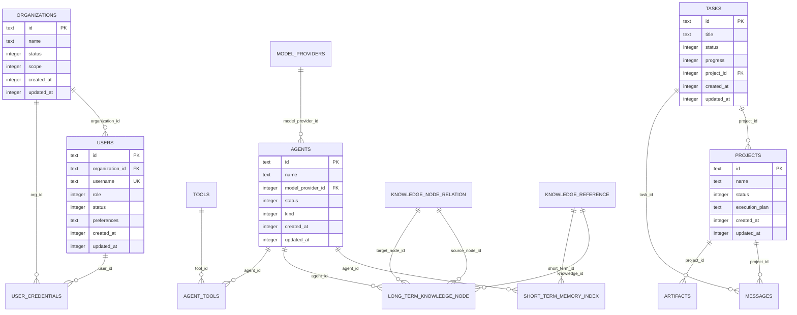
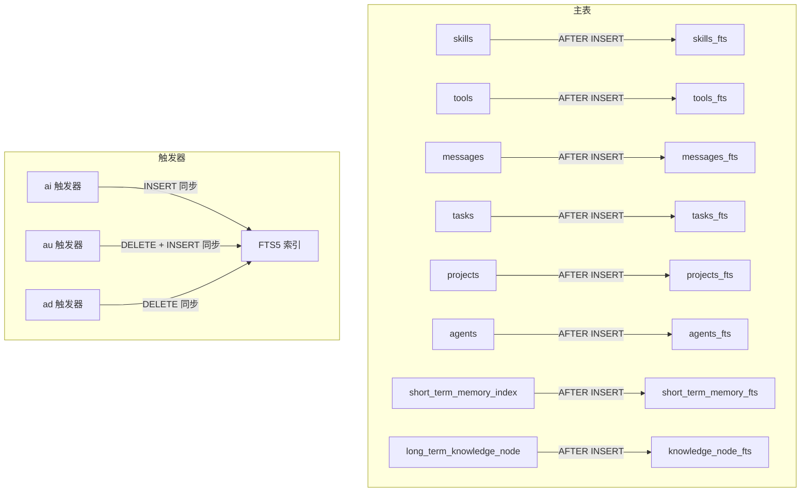
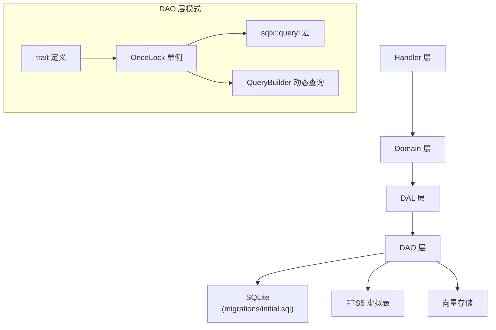
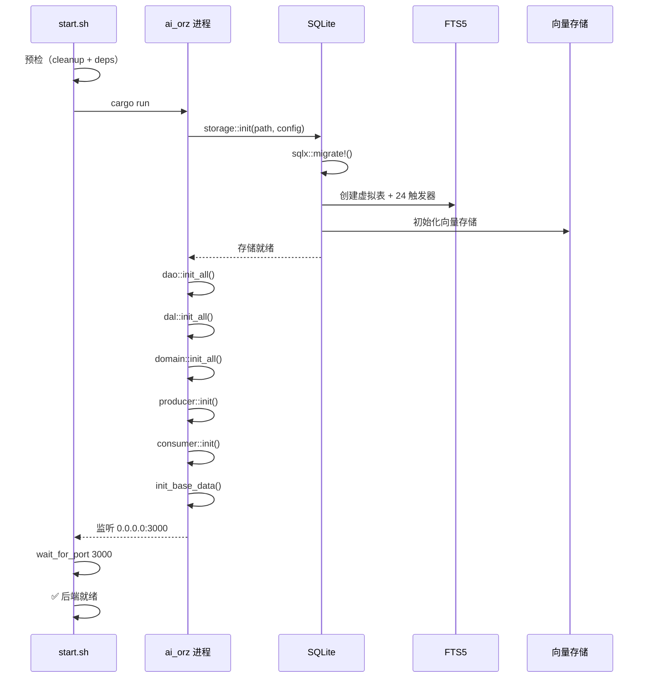
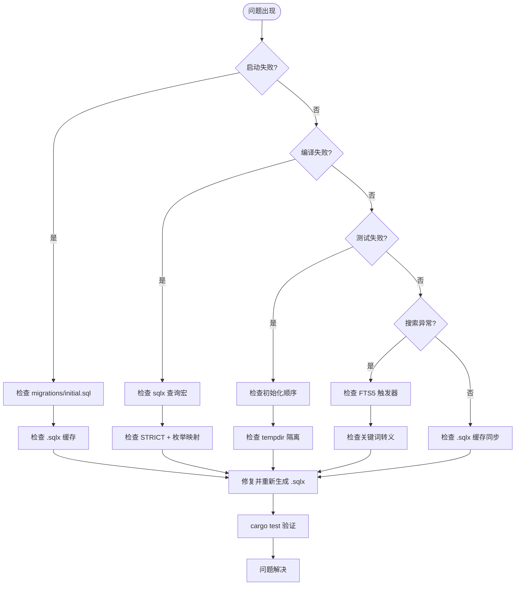

# 数据库迁移管理

<cite>
**本文引用的文件**
- [migrations/20260420000000_initial.sql](migrations/20260420000000_initial.sql)
- [docs/design/sqlx_guide.md](docs/design/sqlx_guide.md)
- [src/service/dao/user/sqlite.rs](src/service/dao/user/sqlite.rs)
- [src/service/dao/agent/sqlite.rs](src/service/dao/agent/sqlite.rs)
- [src/service/dao/message/sqlite.rs](src/service/dao/message/sqlite.rs)
- [src/service/dao/message_channel/sqlite.rs](src/service/dao/message_channel/sqlite.rs)
- [src/pkg/storage/fts5.rs](src/pkg/storage/fts5.rs)
- [scripts/start.sh](scripts/start.sh)
- [tests/common/env.rs](tests/common/env.rs)
- [src/pkg/storage/mod.rs](src/pkg/storage/mod.rs)
- [src/lib.rs](src/lib.rs)
- [数据库迁移管理](docs/wiki/knowledge/zh/数据库迁移管理/数据库迁移管理.md)
</cite>

## 更新摘要
**变更内容**
- 将历史 28 个增量迁移文件合并为单一 `initial.sql` 基准
- 确立单文件迁移管理策略，禁止新增零散迁移
- 定义 21 张 STRICT 主表 + 8 张 FTS5 虚拟表 + 24 个触发器的完整 Schema
- 规范 DAO 层 OnceLock 单例模式
- 确立测试隔离与 .sqlx 离线缓存机制

## 目录
1. [迁移哲学：从增量到单文件](#1-迁移哲学从增量到单文件)
2. [initial.sql 基准文件](#2initialsql-基准文件)
3. [表结构：21 张 STRICT 主表](#3-表结构21-张-strict-主表)
4. [FTS5 虚拟表：8 表 + 24 触发器](#4-fts5-虚拟表8-表--24-触发器)
5. [索引策略](#5-索引策略)
6. [时间戳默认值](#6-时间戳默认值)
7. [DAO 层模式](#7-dao-层模式)
8. [测试隔离](#8-测试隔离)
9. [启动序列](#9-启动序列)
10. [故障排查](#10-故障排查)

## 1. 迁移哲学：从增量到单文件

### 1.1 增量迁移的问题

项目早期采用标准的增量迁移策略（Rails/SQLx 风格），每个数据库变更对应一个时间戳命名的 SQL 文件。随着项目演进，这种模式暴露了以下问题：

- **文件膨胀**：28 个迁移文件散落在 `migrations/` 目录，理解 Schema 需要通读全部文件
- **顺序依赖**：迁移间存在隐含的顺序依赖（如表 A 的触发器引用表 B），调整顺序会导致失败
- **冗余变更**：多个迁移对同一张表做了反复的 ADD COLUMN / DROP COLUMN，最终结果需要叠加 28 层才能理清
- **回滚困难**：修改早期迁移会导致后续迁移的 diff 计算全部失效
- **冷启动慢**：新环境需要依次执行 28 次迁移才能完成初始化

### 1.2 Squash 合并策略

为解决上述问题，项目于 2026-08-19 执行了迁移 Squash：

```
28 个增量迁移文件 ──Squash──▶ 1 个 initial.sql 基准文件
    (20260420 ~ 20260819)     (20260420000000_initial.sql)
```

**合并原则：**
- 取所有迁移执行完毕后的最终 Schema 状态
- 只保留 `CREATE TABLE IF NOT EXISTS`，移除所有 `ALTER TABLE` / `DROP TABLE`
- 合并所有 FTS5 虚拟表和触发器定义
- 保留所有有效索引
- 统一时间戳 DEFAULT 表达式为毫秒级

### 1.3 单文件管理规则

合并完成后，项目确立了**单文件迁移管理**规则：

```
migrations/
  └── 20260420000000_initial.sql   ← 唯一 Schema 事实源
```

- 所有表结构变更直接修改此文件
- 不再创建新的增量迁移文件
- `sqlx::migrate!` 启动时直接执行此文件
- 修改后必须同步更新 `.sqlx/` 离线查询缓存

章节来源
- [migrations/20260420000000_initial.sql:1-26](migrations/20260420000000_initial.sql#L1-L26)

## 2. initial.sql 基准文件

### 2.1 文件结构

`migrations/20260420000000_initial.sql` 共 764 行，分为以下几个部分：

| 行范围 | 内容 | 数量 |
|---|---|---|
| 1-26 | 文件头注释（变更摘要） | - |
| 28-419 | 主表定义（STRICT） | 21 张 |
| 421-488 | FTS5 虚拟表 | 8 张 |
| 490-664 | FTS5 触发器（ai + ad + au） | 24 个 |
| 666-763 | 索引定义 | 40+ 个 |

### 2.2 启动时的迁移执行

应用启动时，`sqlx::migrate!` 宏自动检测并执行迁移：

```rust
// src/pkg/storage/mod.rs
sqlx::migrate!("./migrations").run(&mut *pool).await?;
```

由于只有一个 `initial.sql` 文件，且使用 `CREATE TABLE IF NOT EXISTS`，迁移是完全幂等的：
- 首次启动：创建全部 21 张表 + 8 张 FTS5 表 + 24 个触发器 + 所有索引
- 后续启动：跳过已存在的对象，保证零停机

### 2.3 Schema 变更流程

当需要新增或修改表结构时：

```
1. 修改 migrations/20260420000000_initial.sql
   ├── 新增表：CREATE TABLE IF NOT EXISTS ... STRICT;
   ├── 修改表：ALTER TABLE（谨慎使用，保持向后兼容）
   ├── 新增 FTS5：虚拟表 + 3 个触发器
   └── 新增索引：CREATE INDEX IF NOT EXISTS ...

2. 修改对应 DAO 层代码

3. 重新生成 .sqlx/ 离线查询缓存
   cargo sqlx prepare --database-url sqlite://...

4. 验证：cargo test 全部通过
```

章节来源
- [migrations/20260420000000_initial.sql:1-764](migrations/20260420000000_initial.sql#L1-L764)
- [src/pkg/storage/mod.rs](src/pkg/storage/mod.rs)

## 3. 表结构：21 张 STRICT 主表

### 3.1 表清单

| # | 表名 | 用途 | 关键字段 |
|---|---|---|---|
| 1 | organizations | 组织管理 | id, name, status, scope |
| 2 | users | 用户账户 | id, organization_id, username, role, preferences |
| 3 | agents | AI Agent | id, name, role, model_provider_id, kind, status |
| 4 | model_providers | 模型提供商 | id, name, provider_type, model_name, config |
| 5 | tasks | 任务管理 | id, title, status, priority, progress, execution_plan |
| 6 | projects | 项目管理 | id, name, status, execution_plan, last_followup_at |
| 7 | short_term_memory_index | 短期记忆索引 | id, agent_id, summary, tags, trace_ids |
| 8 | long_term_knowledge_node | 长期知识节点 | id, agent_id, node_name, node_type, tags, is_published |
| 9 | knowledge_node_relation | 知识节点关系 | id, source_node_id, target_node_id, relation_type |
| 10 | knowledge_reference | 知识引用 | id, knowledge_id, short_term_id, trace_id, date_path |
| 11 | messages | 消息 | id, from_id, to_id, message_type, content, reply_to_id, root_id |
| 12 | artifacts | 工件 | id, project_id, name, file_type, source_type |
| 13 | tools | 工具注册 | id, name, protocol, control_mode, config, tags |
| 14 | agent_tools | Agent-工具关联 | agent_id, tool_id (联合主键) |
| 15 | skills | 技能 | id, name, description, category, author_type |
| 16 | vector_metadata | 向量索引元数据 | collection, source_id, content_hash, model |
| 17 | message_channels | 消息渠道 | id, org_id, channel_type, webhook_url, agent_id |
| 18 | attachments | 附件 | id, original_name, relative_path, mime_type, size |
| 19 | mcp_servers | MCP 服务器 | id, name, transport, config, status |
| 20 | cron_triggers | 定时触发器 | id, name, trigger_type, cron_expression, next_run_at |
| 21 | user_credentials | 用户凭证 | id, org_id, user_id, kind, name, visibility |

### 3.2 STRICT 模式约束

所有表强制启用 `STRICT` 模式：

```sql
CREATE TABLE IF NOT EXISTS organizations (
    id TEXT NOT NULL PRIMARY KEY,
    name TEXT NOT NULL,
    ...
) STRICT;
```

**STRICT 的必要性：**
- SQLite 默认允许任意类型插入任意列，即使 `NOT NULL` 也能插入 NULL
- 开启 STRICT 后 SQLite 强制校验列类型（TEXT/INTEGER/REAL/BLOB）
- SQLx 编译期从 Schema 正确推断可空性，避免 `Option<T>` 误判
- 防止运行时类型错误（如字符串写入 INTEGER 列）

### 3.3 字段命名约定

| 前缀 | 含义 | 示例 |
|---|---|---|
| `id` | 主键（TEXT，UUID 格式） | `id TEXT NOT NULL PRIMARY KEY` |
| `_id` 后缀 | 外键引用 | `organization_id`, `agent_id`, `project_id` |
| `created_at` / `updated_at` | 时间戳（INTEGER，毫秒级） | `created_at INTEGER NOT NULL` |
| `created_by` / `modified_by` | 操作人 ID | `created_by TEXT NOT NULL DEFAULT ''` |
| `status` | 状态码（INTEGER） | `status INTEGER NOT NULL DEFAULT 1` |
| `_type` 后缀 | 类型枚举（INTEGER） | `message_type`, `file_type`, `provider_type` |
| `_tags` / `tags` | JSON 数组标签 | `tags TEXT NOT NULL DEFAULT '[]'` |

### 3.4 可空性策略

```
NOT NULL + DEFAULT ''  → 空字符串语义，非 Option<T>
NOT NULL + DEFAULT 0  → 数值零语义，非 Option<T>
NOT NULL             → 必填字段，非 Option<T>
无 NOT NULL + 无 DEFAULT → 真正可空，Option<T>
```

STRICT 模式 + 明确的 DEFAULT 约定确保 SQLx 能正确推断类型。

### 3.5 实体关系图



章节来源
- [migrations/20260420000000_initial.sql:31-419](migrations/20260420000000_initial.sql#L31-L419)

## 4. FTS5 虚拟表：8 表 + 24 触发器

### 4.1 FTS5 架构

AI Orz 使用 SQLite FTS5 扩展实现全文检索，搭配 `trigram` 分词器支持中文搜索（3 字符以上）。架构如下：



### 4.2 虚拟表清单

| 虚拟表 | 索引字段 | 对应主表 |
|---|---|---|
| short_term_memory_fts | summary, tags | short_term_memory_index |
| knowledge_node_fts | node_name, summary, node_description, tags | long_term_knowledge_node |
| skills_fts | name, description, tags | skills |
| tools_fts | name, description, tags | tools |
| messages_fts | content | messages |
| tasks_fts | title, description, tags | tasks |
| projects_fts | name, description, workflow, guidance, tags | projects |
| agents_fts | name, role, description, capabilities | agents |

### 4.3 触发器机制

每张 FTS5 虚拟表配 3 个触发器，保证主表与索引的实时同步：

**INSERT 触发器**（`_ai`）：
```sql
CREATE TRIGGER IF NOT EXISTS skills_fts_ai
AFTER INSERT ON skills BEGIN
    INSERT INTO skills_fts(rowid, name, description, tags)
    VALUES (new.rowid, new.name, new.description, new.tags);
END;
```

**DELETE 触发器**（`_ad`）：
```sql
CREATE TRIGGER IF NOT EXISTS skills_fts_ad
AFTER DELETE ON skills BEGIN
    DELETE FROM skills_fts WHERE rowid = old.rowid;
END;
```

**UPDATE 触发器**（`_au`）：
```sql
CREATE TRIGGER IF NOT EXISTS skills_fts_au
AFTER UPDATE ON skills BEGIN
    DELETE FROM skills_fts WHERE rowid = old.rowid;
    INSERT INTO skills_fts(rowid, name, description, tags)
    VALUES (new.rowid, new.name, new.description, new.tags);
END;
```

全部 8 × 3 = 24 个触发器在 `initial.sql` 中统一定义。

### 4.4 关键词转义

用户输入必须经 `escape_fts5_keyword` 转义后才能拼接到 MATCH 查询：

```rust
// src/pkg/storage/fts5.rs
pub fn escape_fts5_keyword(keyword: &str) -> String {
    let escaped = keyword.replace('"', "\"\"");
    format!("\"{}\"", escaped)
}
```

转义策略：
- 用双引号包裹实现短语匹配（phrase match）
- 内部双引号双写转义
- 空字符串返回空结果

### 4.5 MATCH 查询写法

```sql
SELECT t.*, rank as fts_rank
FROM tasks t
JOIN tasks_fts ON tasks_fts.rowid = t.rowid
WHERE tasks_fts MATCH $1
ORDER BY fts_rank
LIMIT 50
```

要点：
- MATCH 左侧使用完整表名（非别名）
- BM25 rank 越小越相关，默认升序
- `rank as fts_rank` 返回相关性评分供上层混合排序

### 4.6 中文搜索限制

trigram 分词器基于 3 字符滑动窗口，**少于 3 个字符的关键词无法命中**。这是 SQLite FTS5 trigram 的已知限制。测试中使用 4+ 字符关键词验证 FTS5 搜索功能。

章节来源
- [migrations/20260420000000_initial.sql:421-664](migrations/20260420000000_initial.sql#L421-L664)
- [src/pkg/storage/fts5.rs:1-43](src/pkg/storage/fts5.rs#L1-L43)

## 5. 索引策略

### 5.1 索引总览

`initial.sql` 中定义了 40+ 个索引，覆盖所有高频查询路径：

| 表 | 索引 | 类型 | 用途 |
|---|---|---|---|
| organizations | idx_organizations_id | BTREE | 主键查询 |
| users | idx_users_id, idx_users_organization_id, idx_users_username | BTREE | 按组织/用户名查询 |
| short_term_memory_index | idx_stmi_agent_id, idx_stmi_created_at, idx_stmi_tags | BTREE | 按 Agent/时间/标签查询 |
| long_term_knowledge_node | idx_ltkn_agent_id, idx_ltkn_node_type, idx_ltkn_tags, idx_ltkn_is_published | BTREE + 条件 | 知识图谱遍历 |
| knowledge_node_relation | idx_knr_source_node_id, idx_knr_target_node_id | BTREE | 图谱边查询 |
| knowledge_reference | idx_kr_knowledge_id, idx_kr_short_term_id, idx_kr_trace_id | BTREE | 引用追踪 |
| messages | idx_messages_* (9 个) | BTREE | 消息全文查询 |
| skills | idx_skills_* (5 个) | BTREE | 技能检索 |
| artifacts | idx_artifacts_* (4 个) | BTREE | 工件查询 |
| vector_metadata | idx_vector_metadata_expire | BTREE | 过期清理 |
| message_channels | idx_message_channels_* (6 个) | BTREE | 渠道管理 |
| attachments | idx_attachments_* (4 个) | BTREE | 附件查询 |
| mcp_servers | idx_mcp_servers_active_name_unique (UNIQUE 条件) | UNIQUE + 条件 | MCP 名称唯一 |
| cron_triggers | idx_cron_triggers_* (4 个) | BTREE | 定时调度 |
| user_credentials | uq_user_credentials_default_* (UNIQUE 条件) | UNIQUE + 条件 | 默认凭证唯一 |

### 5.2 条件索引

条件索引（Partial Index）用于加速带状态过滤的查询：

```sql
-- 只索引已发布的知识节点
CREATE INDEX IF NOT EXISTS idx_ltkn_is_published
ON long_term_knowledge_node(is_published) WHERE is_published = 1;

-- MCP 活跃服务器名称唯一
CREATE UNIQUE INDEX IF NOT EXISTS idx_mcp_servers_active_name_unique
ON mcp_servers(name) WHERE status != 0;

-- 用户默认凭证唯一（私有/公有双约束）
CREATE UNIQUE INDEX IF NOT EXISTS uq_user_credentials_default_private
ON user_credentials(user_id, kind)
WHERE is_default = 1 AND visibility = 'private' AND status = 1;
```

条件索引的优势：
- 减小索引体积，只索引满足条件的行
- 加速带 `WHERE status != 0` 条件的软删除查询
- 实现部分唯一性约束

### 5.3 索引设计原则

1. **高频查询字段优先**：`messages.created_at`、`short_term_memory_index.agent_id` 等
2. **外键字段必建索引**：所有 `xxx_id` 外键列
3. **软删除字段必建索引**：所有 `status` 列（配合条件索引）
4. **时间字段建索引**：`created_at`、`updated_at`（用于排序和范围查询）
5. **标签字段建索引**：`tags`（用于 JSON 数组包含查询）
6. **避免过度索引**：只读一次的字段不建索引

章节来源
- [migrations/20260420000000_initial.sql:666-763](migrations/20260420000000_initial.sql#L666-L763)

## 6. 时间戳默认值

### 6.1 毫秒级统一约定

项目统一使用**毫秒级 Unix 时间戳（i64）**，UTC 时区存储。在数据库 DEFAULT 表达式中：

```sql
-- tools 表：毫秒级默认值
created_at INTEGER NOT NULL DEFAULT (CAST(strftime('%s', 'now') * 1000 AS INTEGER)),
updated_at INTEGER NOT NULL DEFAULT (CAST(strftime('%s', 'now') * 1000 AS INTEGER))
```

**关键点：**
- `strftime('%s', 'now')` 返回秒级时间戳
- 必须乘以 1000 转换为毫秒
- `CAST(... AS INTEGER)` 确保 SQLite 存储为 i64

### 6.2 应用层时间戳

应用层通过 `common::constants::utils::current_timestamp_ms()` 获取当前毫秒时间戳：

```rust
use common::constants::utils;
let now_ms = utils::current_timestamp_ms();
```

DAO 层允许使用 `chrono::Utc::now().timestamp_millis()` 作为例外以减少依赖。

### 6.3 时间戳字段清单

| 字段 | 含义 | 单位 |
|---|---|---|
| `created_at` | 创建时间（首次写入） | 毫秒 i64 |
| `updated_at` | 更新时间（每次修改） | 毫秒 i64 |
| `last_followup_at` | 最近跟进时间 | 毫秒 i64 |
| `last_pushed_at` | 最近推送时间 | 毫秒 i64 |
| `next_run_at` | 下次触发时间 | 毫秒 i64 |
| `last_run_at` | 上次执行时间 | 毫秒 i64 |
| `expire_at` | 过期时间 | 毫秒 i64 |
| `start_at` / `end_at` / `due_at` | 业务时间点 | 毫秒 i64 |

### 6.4 零时间约定

未设置的时间字段使用 `0` 表示（而非 NULL），查询时可通过 `WHERE field > 0` 过滤。

章节来源
- [migrations/20260420000000_initial.sql:273-276](migrations/20260420000000_initial.sql#L273-L276)
- [migrations/20260420000000_initial.sql:317-318](migrations/20260420000000_initial.sql#L317-L318)
- [docs/design/sqlx_guide.md](docs/design/sqlx_guide.md)

## 7. DAO 层模式

### 7.1 分层架构



### 7.2 DAO 文件结构

每个 DAO 实体遵循统一结构：

```
src/service/dao/{entity}/
  ├── mod.rs       ← trait 定义 + 模块导出
  └── sqlite.rs    ← SQLite 实现
```

### 7.3 trait 定义（mod.rs）

```rust
#[async_trait]
pub trait UserDao: Send + Sync {
    async fn insert(&self, ctx: RequestContext, user: &UserPo) -> Result<()>;
    async fn find_by_id(&self, ctx: RequestContext, id: &str) -> Result<Option<UserPo>>;
    async fn list_by_organization(&self, ctx: RequestContext, org_id: &str, ...) -> Result<PagedResult<UserPo>>;
    async fn query(&self, ctx: RequestContext, filters: UserQuery, ...) -> Result<PagedResult<UserPo>>;
    async fn count(&self, ctx: RequestContext, filters: UserQuery) -> Result<i64>;
}
```

### 7.4 SQLite 实现（sqlite.rs）

**单例管理：**
```rust
static USER_DAO: OnceLock<Arc<dyn UserDao>> = OnceLock::new();

pub fn new() -> Arc<dyn UserDao> {
    Arc::new(UserDaoSqliteImpl::new())
}

pub fn dao() -> Arc<dyn UserDao> {
    USER_DAO.get().cloned().unwrap()
}

pub fn init() {
    let _ = USER_DAO.set(new());
}
```

**CRUD 实现：**
```rust
#[async_trait::async_trait]
impl UserDao for UserDaoSqliteImpl {
    async fn insert(&self, ctx: RequestContext, user: &UserPo) -> Result<()> {
        sqlx::query!(
            "INSERT INTO users (...) VALUES (?, ?, ...)",
            user.id, ...
        )
        .execute(ctx.pool())
        .await?;
        Ok(())
    }

    async fn find_by_id(&self, ctx: RequestContext, id: &str) -> Result<Option<UserPo>> {
        let result = sqlx::query_as!(UserPo,
            "SELECT * FROM users WHERE id = $1 AND \"status\" != 0",
            id
        )
        .fetch_optional(ctx.pool())
        .await?;
        Ok(result)
    }
}
```

### 7.5 查询模式

**简单查询**：使用 `sqlx::query!` / `sqlx::query_as!` 宏，编译期类型检查。

**动态查询**：使用 `QueryBuilder` 构建动态 WHERE 条件，复用 `push_query_filters` 构建器模式。

```rust
let mut query_builder = QueryBuilder::new("SELECT * FROM tasks WHERE 1=1");
query_builder.push_back(" AND \"status\" != 0");
query_builder.push_back(" AND project_id = ");
query_builder.push_bind(project_id);
// ...
let rows = query_builder.build_query_as().fetch_all(pool).await?;
```

**软删除过滤**：所有 find_by_id/list_by_*/count_* 必须包含 `AND "status" != 0`。

**枚举处理**：INSERT 时 `as i32` 转换，SELECT 时显式类型标注 `as "status: TaskStatus"`。

### 7.6 FTS5 搜索模式

支持全文搜索的 DAO 额外定义搜索行结构体：

```rust
#[derive(FromRow)]
struct AgentSearchRow {
    id: String,
    name: String,
    // ... 其他 PO 字段
    fts_rank: Option<f32>,
}
```

搜索方法使用 JOIN FTS5 + MATCH + BM25 排序：

```rust
async fn search(&self, ctx: RequestContext, keyword: &str, ...) -> Result<PagedResult<AgentPo>> {
    let escaped = crate::pkg::storage::escape_fts5_keyword(keyword);
    let sql = format!(
        "SELECT a.*, rank as fts_rank FROM agents a \
         JOIN agents_fts ON agents_fts.rowid = a.rowid \
         WHERE agents_fts MATCH $1 AND a.\"status\" != 0 \
         ORDER BY fts_rank LIMIT $2 OFFSET $3"
    );
    // ...
}
```

### 7.7 DAO 清单

| 实体 | 文件 | 特性 |
|---|---|---|
| User | dao/user/sqlite.rs | 标准 CRUD |
| Agent | dao/agent/sqlite.rs | 含 FTS5 搜索 |
| Message | dao/message/sqlite.rs | 含 FTS5 MATCH 查询 |
| MessageChannel | dao/message_channel/sqlite.rs | QueryBuilder 动态查询 |
| Task | dao/task/sqlite.rs | 含进度更新 |
| Project | dao/project/sqlite.rs | 含执行计划 |
| Memory | dao/memory/sqlite.rs | 含 FTS5 + 向量混合搜索 |
| Skill | dao/skill/sqlite.rs | 含层级查询 |
| Artifact | dao/artifact/sqlite.rs | 含项目关联 |
| Tool | dao/tool/sqlite.rs | 含标签搜索 |
| Organization | dao/organization/sqlite.rs | 标准 CRUD |
| ModelProvider | dao/model_provider/sqlite.rs | 标准 CRUD |
| Attachment | dao/attachment/sqlite.rs | 含路径管理 |
| McpServer | dao/mcp_server/sqlite.rs | 含状态管理 |
| CronTrigger | dao/cron_trigger/sqlite.rs | 含时间调度 |
| UserCredential | dao/user_credential/sqlite.rs | 含默认凭证唯一约束 |

章节来源
- [src/service/dao/user/sqlite.rs](src/service/dao/user/sqlite.rs)
- [src/service/dao/agent/sqlite.rs](src/service/dao/agent/sqlite.rs)
- [src/service/dao/message/sqlite.rs](src/service/dao/message/sqlite.rs)
- [src/service/dao/message_channel/sqlite.rs](src/service/dao/message_channel/sqlite.rs)

## 8. 测试隔离

### 8.1 测试环境初始化

集成测试通过 `tests/common/env.rs::init_full_test_env` 完成环境初始化：

```rust
pub async fn init_full_test_env(_pool: SqlitePool) -> RequestContext {
    ENV_INIT.get_or_init(|| async {
        // 1. 隔离基础数据目录
        let base_tmp = tempfile::tempdir().unwrap();
        std::env::set_var("AI_ORZ_BASE_PATH", base_tmp.path());
        std::mem::forget(base_tmp);

        // 2. 加载配置
        ai_orz::config::init().unwrap();

        // 3. 初始化存储（InMemory 向量存储）
        let tmp = tempfile::tempdir().unwrap();
        ai_orz::pkg::storage::init(tmp.path(), &db_config, &stats_config).await;
        std::mem::forget(tmp);

        // 4. 初始化 JWT（测试专用密钥）
        ai_orz::pkg::jwt::init_jwt("test-jwt-secret", 1);

        // 5. 注册工具
        ai_orz::pkg::tool_registry::builtin::register_all(...);

        // 6. 初始化服务层（DAO → DAL → Domain）
        ai_orz::service::init();

        // 7. 初始化 AOP 基础设施
        ai_orz::producer::init().await.unwrap();
        ai_orz::consumer::init().await.unwrap();

        // 8. 注入基础数据
        ai_orz::service::init_base_data().await;
    }).await;

    RequestContext::from_storage("test-user", ai_orz::pkg::storage::get().clone())
}
```

### 8.2 隔离策略

| 隔离维度 | 实现方式 | 说明 |
|---|---|---|
| 进程级 | `tempfile::tempdir()` 隔离基础数据目录 | 每个测试进程独占一个 tempdir |
| 全局单例 | `tokio::sync::OnceCell` 串行化初始化 | 只有第一个测试执行真正的 init |
| 数据隔离 | 唯一 ID（uuid::now_v7） | 测试间靠唯一 ID 隔离数据 |
| 向量存储 | `InMemory` 替代默认 LanceDB | 避免 block_in_place 要求 |
| JWT | 测试专用密钥 | 1 小时有效期足够测试 |
| 存储隔离 | `std::mem::forget(tempdir)` | 进程生命周期内保持目录 |

### 8.3 单元测试

DAO 单元测试使用 `#[sqlx::test]` 宏：

```rust
#[sqlx::test]
async fn test_insert_and_find(pool: SqlitePool) {
    let ctx = RequestContext::from_pool(pool);
    let dao = UserDaoSqliteImpl::new();
    dao.insert(ctx.clone(), &user).await.unwrap();
    let found = dao.find_by_id(ctx, &user.id).await.unwrap();
    assert!(found.is_some());
}
```

优势：
- 每个测试自动创建独立内存数据库 `sqlite::memory:`
- 自动运行迁移（从 `migrations/` 目录）
- 测试结束自动销毁，完全隔离无污染

### 8.4 初始化顺序

按依赖顺序初始化，否则会出现 `Option::unwrap() on None` panic：

```
config::init()      ← 加载配置
  ↓
storage::init()     ← SQLite + 向量存储
  ↓
jwt::init()         ← JWT 密钥
  ↓
tool_registry::register_all() ← 内置工具
  ↓
service::init()     ← DAO → DAL → Domain
  ↓
producer::init()    ← AOP 生产者
consumer::init()    ← AOP 消费者
  ↓
service::init_base_data() ← 系统级默认数据
```

章节来源
- [tests/common/env.rs:1-109](tests/common/env.rs#L1-L109)

## 9. 启动序列

### 9.1 启动脚本

`scripts/start.sh` 是统一启动入口，支持多种模式：

| 模式 | 命令 | 说明 |
|---|---|---|
| 开发 | `./scripts/start.sh dev` | 后端 + 前端同时启动 |
| 仅后端 | `./scripts/start.sh backend` | 仅 cargo run |
| 仅前端 | `./scripts/start.sh frontend` | 仅 dx serve |
| 生产 | `./scripts/start.sh prod` | 编译 + 运行 release |
| 构建 | `./scripts/start.sh build` | 仅编译不启动 |

### 9.2 启动前预检

```bash
# 1. 清理残留进程
preflight_cleanup   # → scripts/cleanup.sh

# 2. 依赖检查
preflight_deps      # → scripts/check_deps.sh
```

- `cleanup.sh`：清理残留的 ai_orz 后端和 dx serve 进程
- `check_deps.sh`：检查 Rust/Node/SQLite 等工具链，支持 `--fix` 自动安装

### 9.3 服务就绪等待

启动后通过 `wait_for_port` 轮询端口，确保服务真正就绪：

```bash
wait_for_port localhost 8080 600 "前端 localhost:8080" "$FRONTEND_PID"
wait_for_port localhost 3000 600 "后端 localhost:3000" "$BACKEND_PID"
```

- 纯 bash `/dev/tcp` 实现，无外部依赖
- 支持超时（默认 600 秒）
- 支持监控进程退出（编译失败提前终止）

### 9.4 应用启动流程



### 9.5 开发模式

开发模式下前后端并行启动：

```
前端 (dx serve)  →  http://localhost:8080  (WASM 热重载)
后端 (cargo run) →  http://localhost:3000  (开发热重载)
```

- 前端先启动（体验优化），WASM 增量编译 8-16 秒
- 后端冷构建可能需要数分钟
- Ctrl+C 优雅停止全部服务

章节来源
- [scripts/start.sh:1-332](scripts/start.sh#L1-L332)
- [src/pkg/storage/mod.rs](src/pkg/storage/mod.rs)

## 10. 故障排查

### 10.1 迁移相关问题

| 问题 | 根因 | 解决方案 |
|---|---|---|
| `sqlx::migrate!` 报错 | Schema 与代码不匹配 | 修改 `initial.sql` 后同步 DAO 代码 + 重新生成 `.sqlx/` |
| 启动报 "no such table" | `.sqlx/` 缓存过期 | `cargo sqlx prepare --database-url sqlite://...` |
| STRICT 模式下插入失败 | 列类型不匹配 | 检查 INSERT 的值类型与 STRICT 声明是否一致 |
| FTS5 触发器报错 | 主表 rowid 与 FTS5 不同步 | 手动执行 `INSERT INTO xxx_fts(rowid, ...) SELECT rowid, ... FROM xxx;` 回填 |

### 10.2 SQLx 编译错误

| 错误信息 | 根因 | 解决方案 |
|---|---|---|
| `invalid value "0" for enum` | 枚举错误配置了 `rename_all = "lowercase"` | 去掉 `rename_all`，添加 `#[repr(i32)]` + `#[sqlx(type_name = "INTEGER")]` |
| `16 values for 15 columns` | INSERT 末尾多余逗号 | 删除末尾多余逗号，核对列数/占位符/参数三者一致 |
| `cannot infer type of query` | 自定义枚举缺少类型标注 | 添加 `field as "field: EnumType"` |
| `no such column: status` | SQL 关键字未转义 | 用双引号转义：`"status"` |
| `Option<T> not found` | STRICT 模式缺失或 DEFAULT 不一致 | 确认所有表加了 STRICT，DEFAULT 与代码一致 |

### 10.3 FTS5 搜索问题

| 问题 | 根因 | 解决方案 |
|---|---|---|
| 搜索结果为空 | 关键词少于 3 字符（trigram 限制） | 使用 4+ 字符关键词测试 |
| FTS5 syntax error | 用户输入未转义 | 必须经 `escape_fts5_keyword` 转义 |
| FTS5 索引不同步 | 触发器失效或被误删 | 检查触发器定义，手动回填存量数据 |
| 搜索结果排序异常 | BM25 rank 未正确获取 | 确认 `rank as fts_rank` 在 SELECT 中 |

### 10.4 测试问题

| 问题 | 根因 | 解决方案 |
|---|---|---|
| 测试 panic "storage not initialized" | 初始化顺序错误 | 按 `config → storage → dao → dal → domain` 顺序 |
| 测试数据污染 | 全局单例未隔离 | 用 `tempfile::tempdir()` 隔离基础目录 |
| 测试删除后仍能查到 | 软删除过滤遗漏 | find/list/count 必须加 `AND "status" != 0` |
| 并行测试偶现失败 | 全局 OnceLock 竞争 | 用 `tokio::sync::OnceCell` 串行化 init |
| `a2a_server` 回退 Default | TOML 文件部分写入 | 确保 `set_var` 在所有测试前执行 |

### 10.5 .sqlx 缓存问题

| 问题 | 根因 | 解决方案 |
|---|---|---|
| CI 离线编译失败 | `.sqlx/` 未纳入 git | 确认 `.sqlx/` 目录已提交 |
| 本地编译通过 CI 失败 | 查询修改后缓存未更新 | 重新执行 `cargo sqlx prepare` |
| 多人协作缓存冲突 | Schema 变更不同步 | 修改 `initial.sql` 后立即更新 `.sqlx/` |

### 10.6 排查流程图



章节来源
- [docs/design/sqlx_guide.md:302-314](docs/design/sqlx_guide.md#L302-L314)
- [tests/common/env.rs:25-109](tests/common/env.rs#L25-L109)