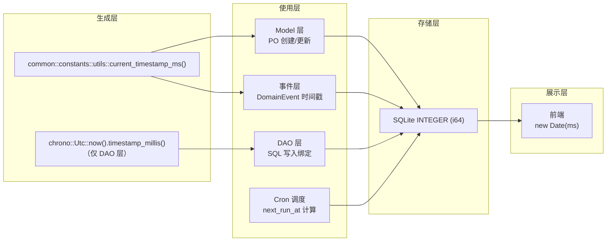

# 时间戳处理规范

<cite>
**本文引用的文件**
- [docs/design/timestamp_convention.md](docs/design/timestamp_convention.md)
- [common/src/constants/utils.rs#L1-L19](common/src/constants/utils.rs#L1-L19)
- [src/models/agent.rs#L347-L416](src/models/agent.rs#L347-L416)
- [src/models/model_provider.rs#L41-L175](src/models/model_provider.rs#L41-L175)
- [src/models/task.rs#L18-L285](src/models/task.rs#L18-L285)
- [src/models/project.rs#L17-L257](src/models/project.rs#L17-L257)
- [src/models/tool.rs#L61-L271](src/models/tool.rs#L61-L271)
- [src/pkg/mod.rs#L1-L23](src/pkg/mod.rs#L1-L23)
- [src/pkg/cron.rs#L21-L33](src/pkg/cron.rs#L21-L33)
- [migrations/20260420000000_initial.sql#L273-L318](migrations/20260420000000_initial.sql#L273-L318)
- [src/service/dao/user/sqlite.rs#L158-L188](src/service/dao/user/sqlite.rs#L158-L188)
- [src/service/dao/agent/sqlite.rs#L273-L306](src/service/dao/agent/sqlite.rs#L273-L306)
- [src/service/dao/organization/sqlite.rs#L107-L133](src/service/dao/organization/sqlite.rs#L107-L133)
- [src/service/dao/message/sqlite.rs#L224-L286](src/service/dao/message/sqlite.rs#L224-L286)
- [src/service/dao/message_channel/sqlite.rs#L58-L246](src/service/dao/message_channel/sqlite.rs#L58-L246)
</cite>

### 本文关联的文档

**① 设计文档（Design）**：
- [时间戳处理约定](docs/design/timestamp_convention.md) — 全项目时间戳单位、生成、存储、展示的统一规范

**④ RAG 原子知识卡**：
- [时间戳规范](docs/wiki/knowledge/zh/时间戳规范/时间戳规范.md) — 毫秒级 Unix 时间戳统一规范的快速索引与硬约束

## 目录
1. [时间戳标准](#1-时间戳标准)
2. [字段命名规范](#2-字段命名规范)
3. [数据库默认值](#3-数据库默认值)
4. [代码层规范](#4-代码层规范)
5. [事件时间戳格式](#5-事件时间戳格式)
6. [前端格式化](#6-前端格式化)
7. [迁移注意事项](#7-迁移注意事项)
8. [故障排查指南](#8-故障排查指南)
9. [结论](#9-结论)
10. [附录：检查表](#10-附录检查表)

## 1. 时间戳标准

### 1.1 核心决策

AI Orz 全项目采用**毫秒级 Unix 时间戳**作为唯一时间标准，覆盖从数据库存储到前端展示的完整链路。

| 决策项 | 约定 | 原因 |
|---|---|---|
| 存储单位 | 全部毫秒级 Unix 时间戳（i64） | 前端格式化已统一假设毫秒级；精度更高；事件系统已用毫秒 |
| 时区 | UTC（系统时区） | 存储统一，展示时再按用户时区转换 |
| 字段类型 | `INTEGER NOT NULL`（SQLite）/ `i64`（Rust） | SQLite INTEGER 足够存毫秒级时间戳到 2262 年 |

### 1.2 标准工具函数

`common::constants::utils` 模块提供两个公共函数，禁止本地重复实现：

```rust
// ✅ 正确：使用公共工具
use common::constants::utils;
let now_ms = utils::current_timestamp_ms();

// ❌ 禁止：本地实现
fn current_timestamp() -> i64 { ... }
Utc::now().timestamp_millis()  // 在非 DAO 层禁止
SystemTime::now().duration_since(...)  // 绝对禁止
```

### 1.3 允许 `Utc::now().timestamp_millis()` 的场景

仅在 **DAO 层 SQL 写入前的本地变量** 场景允许使用（用于减少 import 依赖）：

```rust
// ✅ DAO 层允许
let now = chrono::Utc::now().timestamp_millis();
sqlx::query("INSERT ... created_at = $1").bind(now).execute(...)
```

其他层级（Model/Domain/Handler）**必须**使用 `common::constants::utils::current_timestamp_ms()`。

### 1.4 架构全景图



图表来源
- [common/src/constants/utils.rs#L13-L19](common/src/constants/utils.rs#L13-L19)
- [docs/design/timestamp_convention.md#L13-L48](docs/design/timestamp_convention.md#L13-L48)

章节来源
- [docs/design/timestamp_convention.md#L13-L48](docs/design/timestamp_convention.md#L13-L48)
- [common/src/constants/utils.rs#L1-L19](common/src/constants/utils.rs#L1-L19)

## 2. 字段命名规范

### 2.1 标准时间字段

| 字段名 | 含义 | 必填 | 说明 |
|---|---|---|---|
| `created_at` | 创建时间 | ✅ | 记录首次写入时间，不可变 |
| `updated_at` | 更新时间 | ✅ | 每次修改自动更新 |
| `deleted_at` | 软删除时间 | ❌ | 0 或 NULL 表示未删除 |

### 2.2 业务时间字段

| 字段名 | 含义 | 单位 | 典型使用 |
|---|---|---|---|
| `start_at` | 开始时间 | 毫秒 | Task/Project 启动 |
| `end_at` | 结束时间 | 毫秒 | Task/Project 完成 |
| `due_at` | 截止时间 | 毫秒 | Task/Project 截止 |
| `expire_at` | 过期时间 | 毫秒 | Token/凭证过期 |
| `indexed_at` | 最近索引时间 | 毫秒 | 向量索引元数据 |
| `last_followup_at` | 最近跟进时间 | 毫秒 | 项目定时巡检 |
| `last_run_at` | 上次执行时间 | 毫秒 | Cron 触发器 |
| `next_run_at` | 下次执行时间 | 毫秒 | Cron 触发器 |

### 2.3 PO 字段注释规范

```rust
/// 创建时间（毫秒级 Unix 时间戳）
pub created_at: i64,
/// 更新时间（毫秒级 Unix 时间戳）
pub updated_at: i64,
```

**必须**在每个时间字段的文档注释中明确标注「毫秒级」。

### 2.4 各模型 PO 时间字段对照

| 模型 | 文件 | 时间字段 |
|---|---|---|
| Agent | `src/models/agent.rs#L369-L370` | `created_at`, `updated_at` |
| ModelProvider | `src/models/model_provider.rs#L54-L55` | `created_at`, `updated_at` |
| Task | `src/models/task.rs#L55-L58` | `created_at`, `updated_at`, `start_at`, `end_at`, `due_at` |
| Project | `src/models/project.rs#L48-L57` | `created_at`, `updated_at`, `start_at`, `end_at`, `due_at`, `last_followup_at` |
| Tool | `src/models/tool.rs#L81-L83` | `created_at`, `updated_at` |
| CronTrigger | `migrations/20260420000000_initial.sql#L385-L400` | `created_at`, `updated_at`, `last_run_at`, `next_run_at` |
| VectorMetadata | `migrations/20260420000000_initial.sql#L312-L321` | `indexed_at`, `expire_at` |

章节来源
- [docs/design/timestamp_convention.md#L52-L83](docs/design/timestamp_convention.md#L52-L83)
- [src/models/agent.rs#L347-L371](src/models/agent.rs#L347-L371)
- [src/models/task.rs#L18-L63](src/models/task.rs#L18-L63)
- [src/models/project.rs#L17-L58](src/models/project.rs#L17-L58)
- [src/models/tool.rs#L61-L88](src/models/tool.rs#L61-L88)

## 3. 数据库默认值

### 3.1 毫秒级 DEFAULT 表达式

新表 DEFAULT 必须使用毫秒级表达式：

```sql
-- ✅ 正确：毫秒级默认值
CREATE TABLE tools (
    ...
    created_at INTEGER NOT NULL DEFAULT (CAST(strftime('%s', 'now') * 1000 AS INTEGER)),
    updated_at INTEGER NOT NULL DEFAULT (CAST(strftime('%s', 'now') * 1000 AS INTEGER)),
    ...
) STRICT;

-- ❌ 禁止：秒级默认值
DEFAULT (strftime('%s', 'now'))
```

### 3.2 使用 DEFAULT 的表

以下表在初始 Schema 中使用了毫秒级 DEFAULT：

| 表名 | DEFAULT 字段 | 位置 |
|---|---|---|
| `tools` | `created_at`, `updated_at` | `migrations/20260420000000_initial.sql#L273-L274` |
| `agent_tools` | `created_at` | `migrations/20260420000000_initial.sql#L285` |
| `vector_metadata` | `indexed_at` | `migrations/20260420000000_initial.sql#L318` |

### 3.3 不需要 DEFAULT 的表

绝大多数表**不需要** DEFAULT 时间戳值（代码层在 PO 创建时已生成）。DEFAULT 仅用于 `tools`、`agent_tools` 等极少需要 SQL 层自动填充的关联表。

### 3.4 迁移脚本规范

新增或修改时间戳 DEFAULT 时，必须：

1. 创建新的迁移脚本（`migrations/YYYYMMDDHHMMSS_xxx.sql`）
2. 数据迁移时乘以 1000 转换
3. 同步修改 `20260420000000_initial.sql` 中的原始 DEFAULT 值

章节来源
- [docs/design/timestamp_convention.md#L87-L115](docs/design/timestamp_convention.md#L87-L115)
- [migrations/20260420000000_initial.sql#L273-L321](migrations/20260420000000_initial.sql#L273-L321)

## 4. 代码层规范

### 4.1 Model 层（PO 创建）

PO 的 `new()` 构造器统一使用 `current_timestamp_ms()` 初始化时间字段：

```rust
impl AgentPo {
    pub fn new(...) -> Self {
        let ... = Self {
            ...,
            created_at: common::constants::utils::current_timestamp_ms(),
            updated_at: common::constants::utils::current_timestamp_ms(),
            ...
        }
    }
}
```

各模型 PO 的 `touch()` 方法（如有）也必须走公共工具：

```rust
impl ModelProvider {
    pub fn touch(&mut self, modifier: &str) {
        self.po.modified_by = modifier.to_string();
        self.po.updated_at = common::constants::utils::current_timestamp_ms();
    }
}
```

### 4.2 DAO 层

DAO 层允许直接使用 `chrono::Utc::now().timestamp_millis()` 以减少依赖：

```rust
// src/service/dao/message_channel/sqlite.rs#L58
let current_timestamp = Utc::now().timestamp_millis();
sqlx::query("UPDATE ... SET updated_at = ? ...")
    .bind(current_timestamp)
    .execute(...)
    .await?;
```

DAO 层 `timestamp_millis()` 使用分布：

| DAO 文件 | 使用位置 |
|---|---|
| `src/service/dao/user/sqlite.rs` | L158, L188 |
| `src/service/dao/agent/sqlite.rs` | L273, L306 |
| `src/service/dao/organization/sqlite.rs` | L107, L133 |
| `src/service/dao/message/sqlite.rs` | L224, L264, L286 |
| `src/service/dao/message_channel/sqlite.rs` | L58, L202, L226, L246 |

### 4.3 Handler / Domain 层

Handler 和 Domain 层必须使用公共工具：

```rust
// ✅ 正确
use common::constants::utils;
po.updated_at = utils::current_timestamp_ms();

// ❌ 禁止：本地 current_timestamp() 实现
// fn current_timestamp() -> i64 { ... }

// ❌ 禁止：直接 chrono 调用（非 DAO 层）
// use chrono::Utc; Utc::now().timestamp_millis();
```

### 4.4 时间运算

```rust
// ✅ 正确：毫秒级运算
let expires_at = common::constants::utils::current_timestamp_ms() + 3600 * 1000; // 1 小时后
let next_run = last_run + interval_seconds * 1000;

// ❌ 禁止：混淆秒和毫秒
let expires_at = current_timestamp() + 3600; // 秒 + 秒 = 秒
```

### 4.5 Model 层业务时间操作

Task 和 Project 的状态转换方法内置了毫秒级时间戳：

```rust
// src/models/task.rs#L173-L176
pub fn start(&mut self) {
    self.po.status = TaskStatus::InProgress;
    self.po.start_at = Some(utils::current_timestamp_ms());
}

// src/models/task.rs#L179-L182
pub fn complete(&mut self) {
    self.po.status = TaskStatus::Completed;
    self.po.progress = 100;
    self.po.end_at = Some(utils::current_timestamp_ms());
}

// src/models/project.rs#L174-L177
pub fn start(&mut self) {
    self.po.status = ProjectStatus::InProgress;
    self.po.start_at = Some(utils::current_timestamp_ms());
}
```

章节来源
- [docs/design/timestamp_convention.md#L118-L177](docs/design/timestamp_convention.md#L118-L177)
- [src/models/agent.rs#L391-L416](src/models/agent.rs#L391-L416)
- [src/models/task.rs#L173-L183](src/models/task.rs#L173-L183)
- [src/models/project.rs#L174-L183](src/models/project.rs#L174-L183)
- [src/models/tool.rs#L204-L242](src/models/tool.rs#L204-L242)
- [src/service/dao/message_channel/sqlite.rs#L58-L80](src/service/dao/message_channel/sqlite.rs#L58-L80)

## 5. 事件时间戳格式

### 5.1 事件模型时间字段

所有 AOP 事件模型的时间字段已统一为毫秒级：

| 事件 | 时间字段 | 单位 |
|---|---|---|
| `TaskStatusEvent` | `timestamp` | 毫秒 |
| `ThinkRoundEvent` | `timestamp` | 毫秒 |
| `ToolExecuteEvent` | `timestamp` | 毫秒 |
| `AgentLoopEvent` | `timestamp` | 毫秒 |
| `AgentStateEvent` | `timestamp` | 毫秒 |
| `MessageEvent` | `timestamp` | 毫秒 |
| `CronTriggerEvent` | `timestamp` | 毫秒 |

### 5.2 事件时间戳生成

事件层统一使用 `common::constants::utils::current_timestamp_ms()` 生成，确保与数据库存储单位一致。

### 5.3 Cron 调度时间戳

`src/pkg/cron.rs` 中 `next_run_at()` 函数使用 `timestamp_millis()` 计算下一次触发时间：

```rust
// src/pkg/cron.rs#L32
Ok(next.with_timezone(&Utc).timestamp_millis())
```

`cron_triggers` 表中 `next_run_at` 和 `last_run_at` 字段均为毫秒级整数。

章节来源
- [docs/design/timestamp_convention.md#L180-L196](docs/design/timestamp_convention.md#L180-L196)
- [src/pkg/cron.rs#L21-L33](src/pkg/cron.rs#L21-L33)

## 6. 前端格式化

### 6.1 格式化函数

前端 `frontend/src/utils/` 中所有时间格式化函数已统一按毫秒级处理：

```typescript
// 前端已统一：毫秒级时间戳直接传给 Date()
const date = new Date(timestamp); // timestamp 为毫秒级
```

### 6.2 旧数据兼容

新增格式化函数时，默认输入为毫秒级。若需要兼容旧数据（秒级），可使用：

```typescript
const toMilliseconds = (ts: number) => ts < 1e12 ? ts * 1000 : ts;
```

### 6.3 前端注意事项

- 前端不得自行区分秒/毫秒，统一调用 `toMilliseconds()` 兜底
- 所有 API 返回的时间字段均为毫秒级 i64，前端直接使用 `new Date(ms)` 即可
- 若发现某接口返回秒级值，应作为 bug 上报而非在前端做兼容 hack

章节来源
- [docs/design/timestamp_convention.md#L199-L217](docs/design/timestamp_convention.md#L199-L217)

## 7. 迁移注意事项

### 7.1 迁移脚本命名规范

迁移脚本按时间戳命名：`migrations/YYYYMMDDHHMMSS_xxx.sql`

### 7.2 秒级转毫秒

数据迁移时，旧数据中的秒级时间戳需要乘以 1000 转换：

```sql
-- 迁移示例：将旧的秒级 created_at 转为毫秒级
UPDATE existing_table
SET created_at = created_at * 1000,
    updated_at = updated_at * 1000
WHERE created_at < 1e12;  -- 判断为秒级数据
```

### 7.3 同步更新初始 Schema

每次迁移涉及时间戳 DEFAULT 变更时，必须同步更新 `migrations/20260420000000_initial.sql` 中的对应 DEFAULT 值，确保新部署实例直接使用最新结构。

### 7.4 现有迁移清单

初始合并迁移 `20260420000000_initial.sql` 已包含 28 个迁移的最终状态，时间戳统一使用毫秒级表达式 `CAST(strftime('%s', 'now') * 1000 AS INTEGER)`。

章节来源
- [docs/design/timestamp_convention.md#L108-L115](docs/design/timestamp_convention.md#L108-L115)
- [migrations/20260420000000_initial.sql#L1-L27](migrations/20260420000000_initial.sql#L1-L27)

## 8. 故障排查指南

### 8.1 时间戳单位错误

**症状**：前端展示的时间差 1000 倍（如日期显示为 1970 年附近）。

**排查步骤**：
1. 在浏览器 DevTools 中检查 API 返回的时间戳值，确认是 13 位（毫秒）还是 10 位（秒）
2. 若为 10 位秒级，使用 `toMilliseconds()` 转换后再展示
3. 检查后端 DAO 层是否误用了 `timestamp()` 而非 `timestamp_millis()`
4. 检查 `common::constants::utils.rs` 中的 `current_timestamp()` 函数是否被意外调用（该函数返回秒级，应标记为 deprecated 或删除）

### 8.2 本地 current_timestamp 实现

**症状**：代码审查发现自定义 `fn current_timestamp() -> i64` 或 `SystemTime::now()` 直接调用。

**排查步骤**：
1. Grep 全项目 `fn current_timestamp` 和 `SystemTime::now()`
2. DAO 层以外的自定义实现必须删除，替换为 `common::constants::utils::current_timestamp_ms()`
3. DAO 层的 `chrono::Utc::now().timestamp_millis()` 用法确认在 SQL 写入前的本地变量场景

### 8.3 SQLite DEFAULT 错误

**症状**：新插入记录的 `created_at` / `updated_at` 值为 NULL 或秒级。

**排查步骤**：
1. 检查表定义中 DEFAULT 表达式是否为 `CAST(strftime('%s', 'now') * 1000 AS INTEGER)`
2. 确认 `strftime('%s', 'now')` 返回的是秒级，必须乘以 1000
3. 对于非 DEFAULT 表，确认应用层 PO 创建时是否正确生成了时间戳

### 8.4 时区不一致

**症状**：不同地区用户看到的同一时间戳展示差异异常（不止时区偏移）。

**排查步骤**：
1. 确认存储层统一使用 UTC，检查 `chrono::Utc` 是否被替换为本地时区
2. 前端格式化时确认使用了正确的时区转换
3. `src/pkg/cron.rs` 中 `next_run_at()` 计算确认使用 `Utc::now().with_timezone(&tz)` 做时区转换后再转回 UTC

### 8.5 Cron 触发时间错误

**症状**：Cron 任务触发时间与预期不符。

**排查步骤**：
1. 检查 `cron_triggers.next_run_at` 存储的是毫秒级 UTC 时间戳
2. 确认 `src/pkg/cron.rs` 中 `next_run_at()` 的时区参数是否正确传入
3. 使用 `validate_expression()` 校验 cron 表达式合法性
4. 对比数据库中的 `next_run_at` 与实际系统 UTC 时间

章节来源
- [docs/design/timestamp_convention.md#L220-L237](docs/design/timestamp_convention.md#L220-L237)
- [common/src/constants/utils.rs#L1-L19](common/src/constants/utils.rs#L1-L19)
- [src/pkg/cron.rs#L36-L48](src/pkg/cron.rs#L36-L48)

## 9. 结论

AI Orz 项目的时间戳处理遵循严格的统一规范：全链路毫秒级 Unix 时间戳、UTC 存储、公共工具生成。Model/PO 层通过 `current_timestamp_ms()` 生成初始值，DAO 层允许 `chrono::Utc::now().timestamp_millis()` 作为 SQL 写入前的本地变量优化，数据库 DEFAULT 使用 `CAST(strftime('%s', 'now') * 1000 AS INTEGER)` 毫秒级表达式。前端统一按毫秒级 `new Date(ms)` 格式化，兼容旧数据使用 `ts < 1e12 ? ts * 1000 : ts` 兜底。这些约定确保了从存储到展示的时间一致性，避免了秒级/毫秒级混淆导致的展示错误和运算偏差。

## 10. 附录：检查表

### 10.1 新增时间戳字段检查清单

- [ ] PO 字段类型为 `i64`
- [ ] 注释明确标注「毫秒级 Unix 时间戳」
- [ ] 使用 `common::constants::utils::current_timestamp_ms()` 生成
- [ ] 若需 DEFAULT，使用 `CAST(strftime('%s', 'now') * 1000 AS INTEGER)`
- [ ] 前端格式化函数验证通过
- [ ] 测试数据使用毫秒级

### 10.2 代码审查检查清单

- [ ] 是否有本地 `current_timestamp()` 实现？→ 删除
- [ ] 是否使用 `Utc::now().timestamp()`（秒级）？→ 改为 `timestamp_millis()`
- [ ] 是否有 `SystemTime::now()` 原始调用？→ 改为公共工具
- [ ] 时间运算是否单位正确？（秒转毫秒需 × 1000）
- [ ] Cron/Interval 运算是否正确转换单位？
- [ ] DAO 层外是否出现 `chrono::Utc::now().timestamp_millis()`？→ 替换为公共工具
- [ ] PO 字段注释是否标注「毫秒级」？
- [ ] DEFAULT 表达式是否乘以 1000？

章节来源
- [docs/design/timestamp_convention.md#L220-L237](docs/design/timestamp_convention.md#L220-L237)