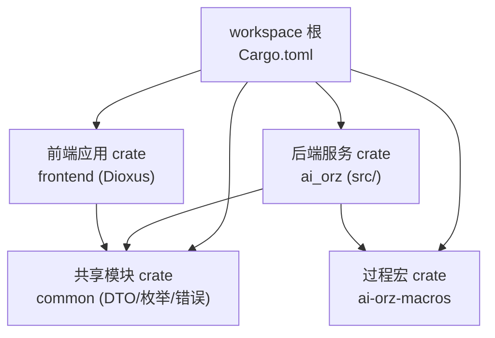
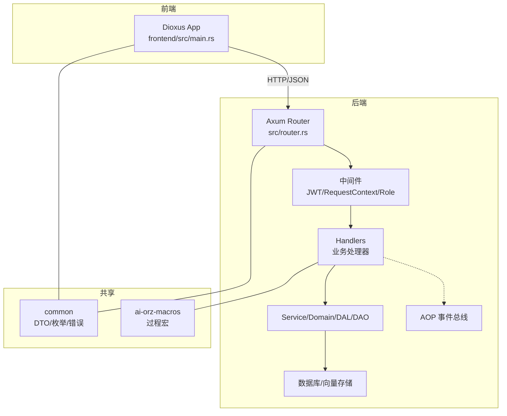
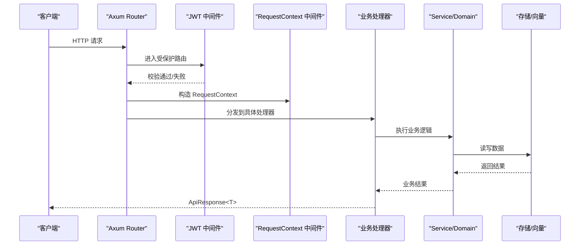
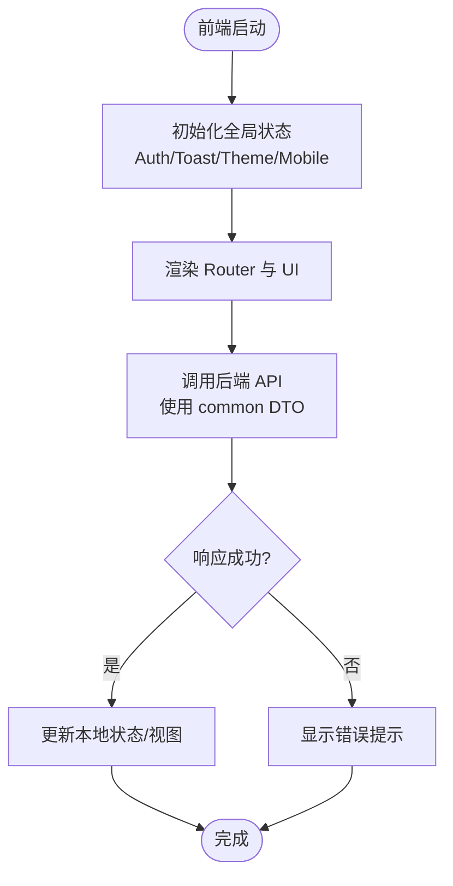
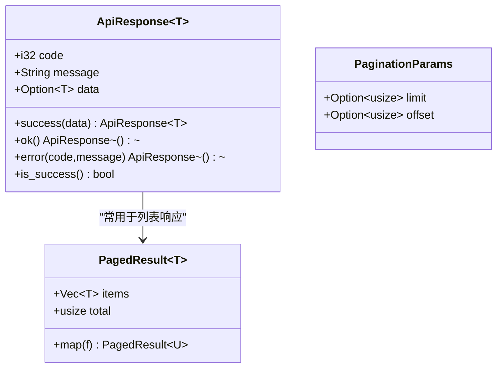
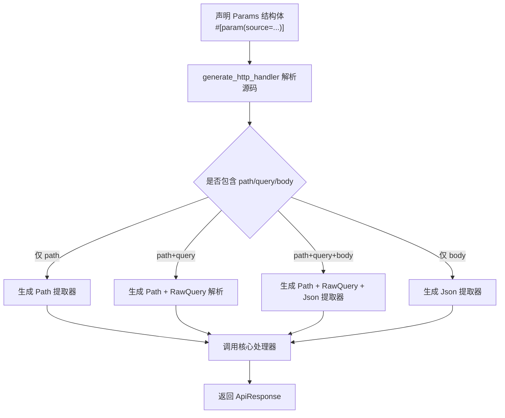
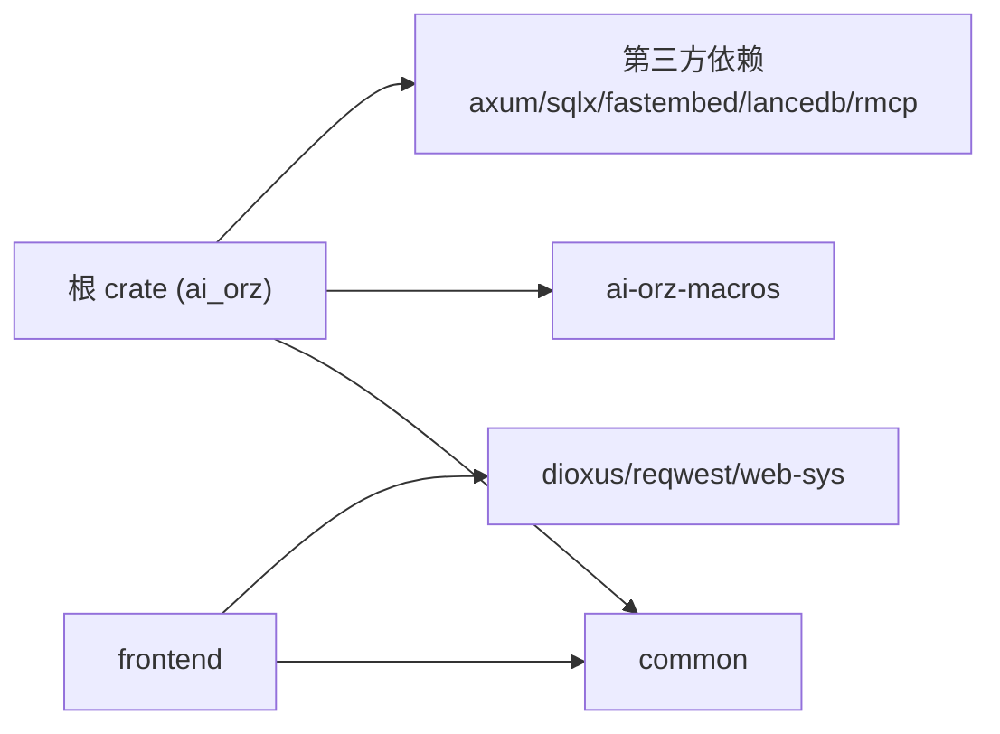

# 整体架构概览

<cite>
**本文引用的文件**
- [Cargo.toml](Cargo.toml)
- [common/Cargo.toml](common/Cargo.toml)
- [ai-orz-macros/Cargo.toml](ai-orz-macros/Cargo.toml)
- [frontend/Cargo.toml](frontend/Cargo.toml)
- [src/main.rs](src/main.rs)
- [src/lib.rs](src/lib.rs)
- [src/router.rs](src/router.rs)
- [common/src/lib.rs](common/src/lib.rs)
- [common/src/api/mod.rs](common/src/api/mod.rs)
- [common/src/enums/mod.rs](common/src/enums/mod.rs)
- [common/src/error/mod.rs](common/src/error/mod.rs)
- [ai-orz-macros/src/lib.rs](ai-orz-macros/src/lib.rs)
- [frontend/src/main.rs](frontend/src/main.rs)
</cite>

## 目录
1. [简介](#简介)
2. [项目结构](#项目结构)
3. [核心组件](#核心组件)
4. [架构总览](#架构总览)
5. [详细组件分析](#详细组件分析)
6. [依赖关系分析](#依赖关系分析)
7. [性能与可扩展性](#性能与可扩展性)
8. [故障排查指南](#故障排查指南)
9. [结论](#结论)
10. [附录](#附录)

## 简介
本文件为 AI Orz 系统的整体架构概览，面向希望快速理解项目全貌的开发者。系统采用三级 cargo workspace 组织：根 crate（后端服务）、common（前后端共享模块）、ai-orz-macros（自定义过程宏），以及独立的 frontend（Dioxus 前端应用）。后端基于 Axum + Rust，提供 REST/JSON-RPC/SSE 等接口；前端通过 Dioxus 构建 SPA，并通过 common 中的统一 DTO、枚举和错误类型与后端保持类型一致。

## 项目结构
仓库采用 Cargo Workspace 管理多 crate：
- 根 crate（ai_orz）：后端服务入口、路由、中间件、业务层、AOP 事件总线、存储与工具注册等。
- common：前后端共享的 API DTO、枚举、错误模型、配置常量等。
- ai-orz-macros：自定义过程宏，用于生成 HTTP Handler、工具注册、日志字段注入、统计事件实现等。
- frontend：Dioxus Web 前端，编译为 WASM，由后端静态托管或通过环境变量指定 dist 目录。

图表来源
- [Cargo.toml:1-8](Cargo.toml#L1-L8)

章节来源
- [Cargo.toml:1-8](Cargo.toml#L1-L8)

## 核心组件
- 后端服务（Axum + Rust）
  - 启动流程：main 调用 ai_orz::run，初始化配置、pkg（日志、存储、JWT、工具注册）、service 层、生产者/消费者、AOP 调度器，最后创建 Router 并监听端口。
  - 路由：按公开/受保护分组，挂载 /api/v1 下的 HR、Finance、System、Organization、Project、Task、User 等子路由，并提供 A2A JSON-RPC 与 SSE 订阅。
- 前端应用（Dioxus）
  - 以 Dioxus 组件树启动，提供全局状态（认证、Toast、主题、移动端检测），路由到页面模块，通过 common 中定义的 DTO 与后端交互。
- 共享模块（common crate）
  - 统一的 ApiResponse/PagedResult/PaginationParams、领域枚举（Agent、Task、Tool、Message 等）、统一错误模型（ErrorType/ErrorCode/ErrorField）。
- 自定义宏（ai-orz-macros）
  - generate_http_handler：根据 Params 结构体上的 #[param(source="...")] 自动生成 Axum Handler，支持 path/query/body 混合与优先级覆盖。
  - register_handler_tool：将函数注册为内置工具，自动构造 ToolPo 与适配器，并在启动时注册到工具注册表。
  - StatsEvent/LogFields：派生统计事件与日志字段，简化埋点与可观测性。

章节来源
- [src/main.rs:1-5](src/main.rs#L1-L5)
- [src/lib.rs:114-175](src/lib.rs#L114-L175)
- [src/router.rs:12-59](src/router.rs#L12-L59)
- [common/src/api/mod.rs:6-83](common/src/api/mod.rs#L6-L83)
- [common/src/enums/mod.rs:1-38](common/src/enums/mod.rs#L1-L38)
- [common/src/error/mod.rs:1-25](common/src/error/mod.rs#L1-L25)
- [ai-orz-macros/src/lib.rs:12-20, 47-234, 274-562, 685-704:12-20](ai-orz-macros/src/lib.rs#L12-L20)
- [frontend/src/main.rs:24-57](frontend/src/main.rs#L24-L57)

## 架构总览
系统采用前后端分离模式：
- 前端（Dioxus/WASM）通过 HTTP/JSON 调用后端 API，使用 common 中的 DTO 保证类型安全。
- 后端（Axum）提供 REST/JSON-RPC/SSE 接口，内部通过 service/domain/dal/dao 分层处理业务与数据访问。
- common 作为“契约层”，定义 API 请求/响应、枚举、错误模型，确保前后端一致性。
- ai-orz-macros 在编译期生成样板代码，减少重复逻辑，提升一致性与可维护性。
- AOP 事件总线贯穿生产/消费，支撑异步任务、指标采集、消息推送等。

图表来源
- [src/router.rs:12-59](src/router.rs#L12-L59)
- [common/src/api/mod.rs:6-83](common/src/api/mod.rs#L6-L83)
- [common/src/enums/mod.rs:1-38](common/src/enums/mod.rs#L1-L38)
- [common/src/error/mod.rs:1-25](common/src/error/mod.rs#L1-L25)
- [ai-orz-macros/src/lib.rs:274-562](ai-orz-macros/src/lib.rs#L274-L562)

## 详细组件分析

### 后端服务（Axum + Rust）
- 启动顺序：配置初始化 → pkg 初始化（日志、存储、JWT、工具注册）→ service 初始化 → 生产者/消费者注册 → 基础数据幂等初始化 → AOP 统计 Hook 安装 → AOP 调度器启动 → 创建 Router → 监听 TCP 端口。
- 路由组织：
  - 公开路由：系统初始化、登录/登出、组织列表、健康检查、A2A 发现与回调。
  - 受保护路由：HR、Finance、System、Organization、Project、Task、User 等，统一 JWT 校验与角色权限控制。
  - A2A：JSON-RPC 与 SSE 订阅，支持外部 Agent 集成。
- 中间件：
  - jwt_auth_middleware：验证 JWT，注入用户信息到请求头。
  - request_context_middleware：从请求头提取上下文，构造 RequestContext。
  - require_role_middleware：对敏感路由进行角色校验（如 Admin）。

图表来源
- [src/router.rs:96-136](src/router.rs#L96-L136)
- [src/lib.rs:114-175](src/lib.rs#L114-L175)

章节来源
- [src/lib.rs:114-175](src/lib.rs#L114-L175)
- [src/router.rs:12-740](src/router.rs#L12-L740)

### 前端应用（Dioxus）
- 启动：launch(App)，提供全局状态（认证、Toast、主题、移动端信号），渲染 Router 与 Toast 容器。
- 与后端交互：通过 reqwest 调用 /api/v1 下接口，使用 common 中的 DTO 保证类型一致。
- 静态资源：由后端 ServeDir 托管前端 dist 目录，可通过环境变量 FRONTEND_DIST_DIR 覆盖。

图表来源
- [frontend/src/main.rs:24-57](frontend/src/main.rs#L24-L57)
- [src/router.rs:57-59](src/router.rs#L57-L59)

章节来源
- [frontend/src/main.rs:24-57](frontend/src/main.rs#L24-L57)
- [src/router.rs:57-59](src/router.rs#L57-L59)

### 共享模块（common crate）
- API DTO：ApiResponse、PagedResult、PaginationParams，统一前后端响应格式与分页。
- 枚举：Agent、Task、Tool、Message、Channel、Provider 等领域枚举，确保类型安全。
- 错误模型：ErrorType/ErrorCode/ErrorField，统一错误分类与结构化上下文，提供 Result<T> 别名。

图表来源
- [common/src/api/mod.rs:6-83](common/src/api/mod.rs#L6-L83)

章节来源
- [common/src/api/mod.rs:6-83](common/src/api/mod.rs#L6-L83)
- [common/src/enums/mod.rs:1-38](common/src/enums/mod.rs#L1-L38)
- [common/src/error/mod.rs:1-25](common/src/error/mod.rs#L1-L25)

### 自定义宏（ai-orz-macros）
- generate_http_handler：解析 Params 结构体上的 #[param(source="path|query|body")]，自动生成 Axum Handler，支持 path/query/body 混合与优先级覆盖（path > query > body）。
- register_handler_tool：将函数注册为内置工具，自动生成 ToolPo 与适配器，并在启动时注册到工具注册表。
- StatsEvent/LogFields：派生统计事件与日志字段，简化埋点与可观测性。

图表来源
- [ai-orz-macros/src/lib.rs:274-562](ai-orz-macros/src/lib.rs#L274-L562)

章节来源
- [ai-orz-macros/src/lib.rs:12-20, 47-234, 274-562, 685-704:12-20](ai-orz-macros/src/lib.rs#L12-L20)

## 依赖关系分析
- 工作区成员：根 crate、frontend、common、ai-orz-macros。
- 后端依赖：
  - common：DTO、枚举、错误、配置。
  - ai-orz-macros：过程宏。
  - 其他：tokio、axum、sqlx、fastembed、lancedb、rmcp 等。
- 前端依赖：
  - common：DTO、枚举、错误。
  - dioxus、reqwest、web-sys 等。

图表来源
- [Cargo.toml:1-8, 17-72:1-8](Cargo.toml#L1-L8)
- [common/Cargo.toml:1-34](common/Cargo.toml#L1-L34)
- [ai-orz-macros/Cargo.toml:1-16](ai-orz-macros/Cargo.toml#L1-L16)
- [frontend/Cargo.toml:1-26](frontend/Cargo.toml#L1-L26)

章节来源
- [Cargo.toml:1-72](Cargo.toml#L1-L72)
- [common/Cargo.toml:1-34](common/Cargo.toml#L1-L34)
- [ai-orz-macros/Cargo.toml:1-16](ai-orz-macros/Cargo.toml#L1-L16)
- [frontend/Cargo.toml:1-26](frontend/Cargo.toml#L1-L26)

## 性能与可扩展性
- 异步运行时：tokio full，支持高并发 I/O。
- 存储与向量：sqlite 持久化，fastembed 本地向量化，lancedb/instant-distance 提供向量检索能力。
- AOP 事件总线：解耦生产/消费，支持后台任务、指标采集、消息推送等扩展点。
- 路由与中间件：模块化路由，中间件可插拔，便于权限、审计、监控扩展。
- 前端：WASM 构建，按需加载组件，结合 Dioxus 状态管理提升交互体验。

[本节为通用指导，不直接分析具体文件]

## 故障排查指南
- 启动失败：检查配置初始化、pkg 初始化、AOP 调度器启动阶段日志。
- 鉴权问题：确认 JWT 中间件顺序（外层先执行），RequestContext 是否正确注入。
- 路由未命中：核对路径与 HTTP 方法，检查 generate_http_handler 生成的参数提取是否符合预期。
- 工具注册失败：确认 register_handler_tool 的参数与返回值类型，检查启动时是否已注册到工具注册表。
- 前端无法加载：检查 FRONTEND_DIST_DIR 或后端 ServeDir 配置，确认静态资源路径正确。

章节来源
- [src/lib.rs:114-175](src/lib.rs#L114-L175)
- [src/router.rs:96-136](src/router.rs#L96-L136)
- [ai-orz-macros/src/lib.rs:274-562](ai-orz-macros/src/lib.rs#L274-L562)

## 结论
AI Orz 通过清晰的 workspace 划分与前后端分离架构，实现了高内聚、低耦合的系统设计。common 作为契约层保障类型安全，ai-orz-macros 通过编译时代码生成提升一致性与可维护性，Axum 路由与中间件提供灵活的请求处理能力，AOP 事件总线支撑异步与可观测性扩展。该架构便于团队并行开发、独立演进，并为后续功能扩展奠定坚实基础。

[本节为总结，不直接分析具体文件]

## 附录
- 关键入口：
  - 后端：src/main.rs → src/lib.rs::run
  - 前端：frontend/src/main.rs
- 共享契约：
  - DTO：common/src/api/mod.rs
  - 枚举：common/src/enums/mod.rs
  - 错误：common/src/error/mod.rs
- 宏能力：
  - 过程宏：ai-orz-macros/src/lib.rs

[本节为索引，不直接分析具体文件]