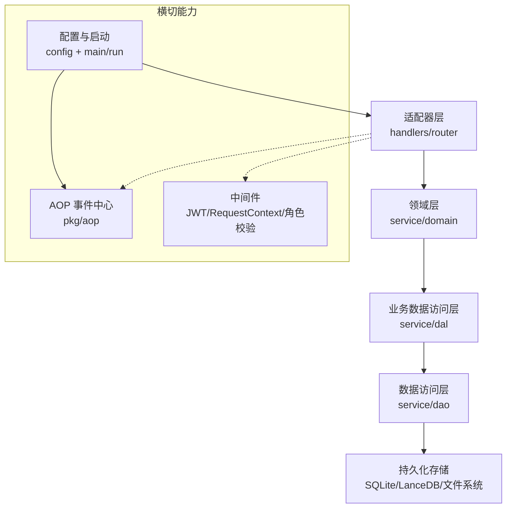
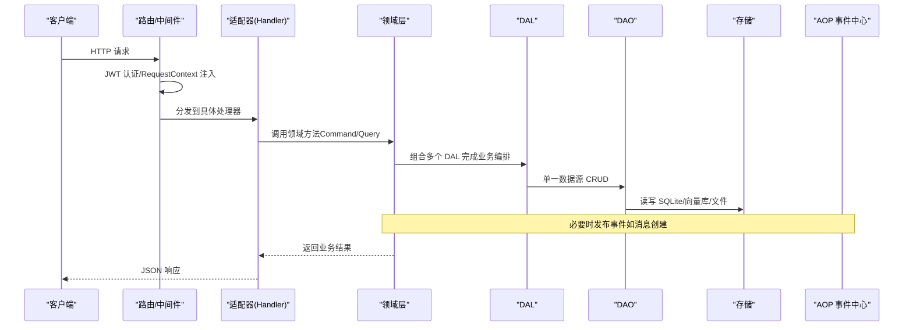
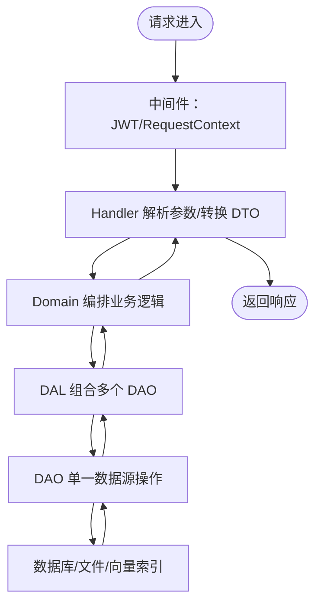
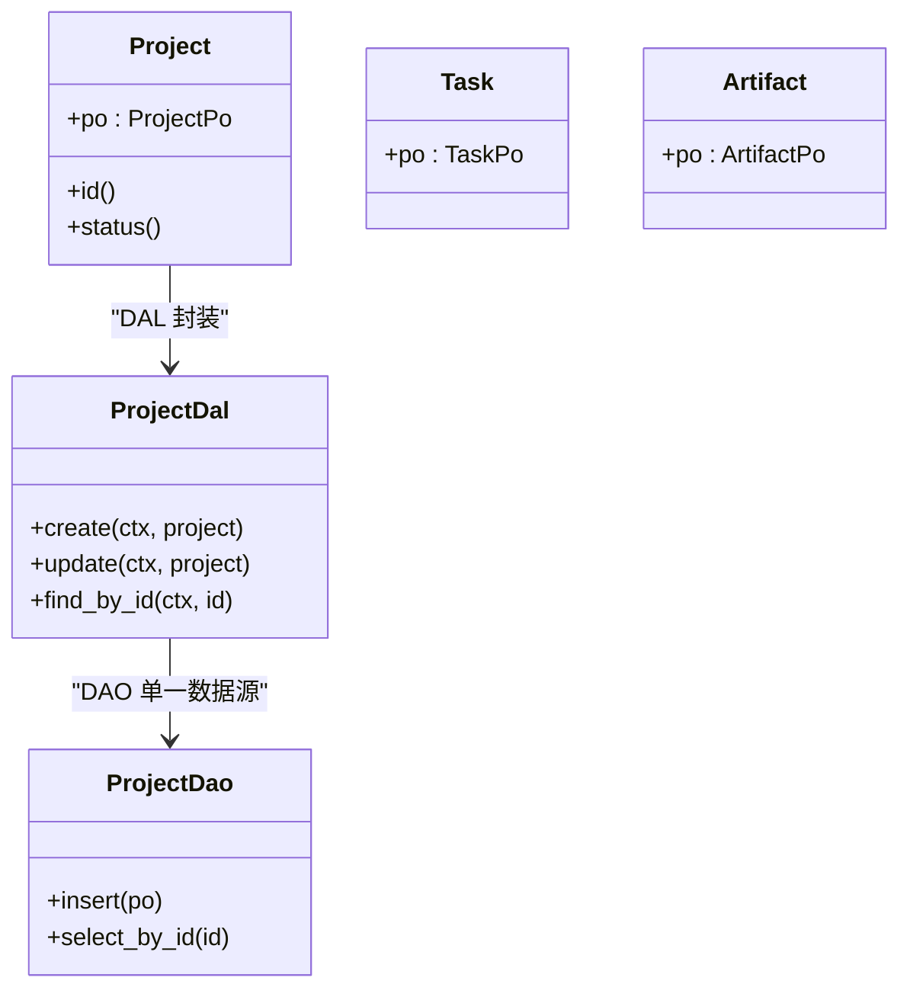
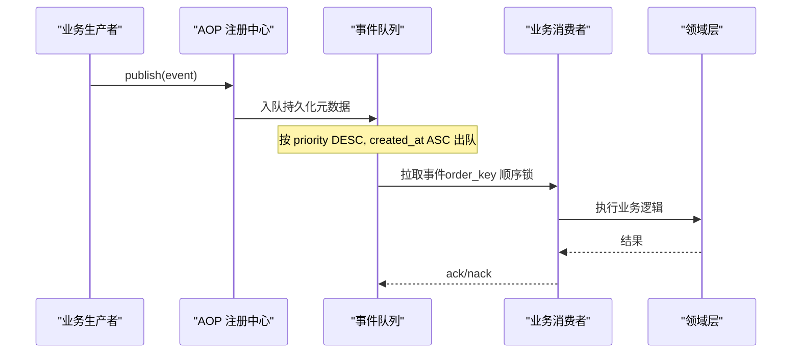
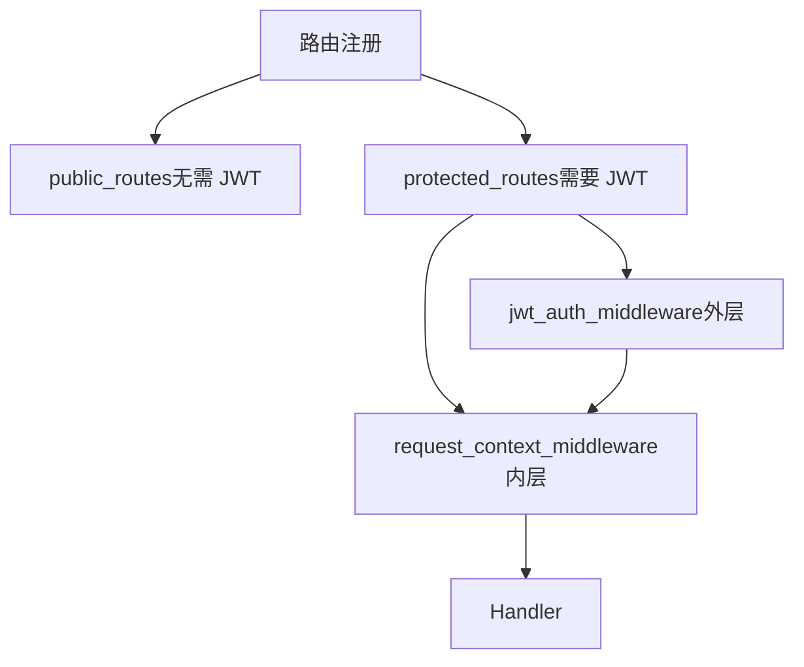
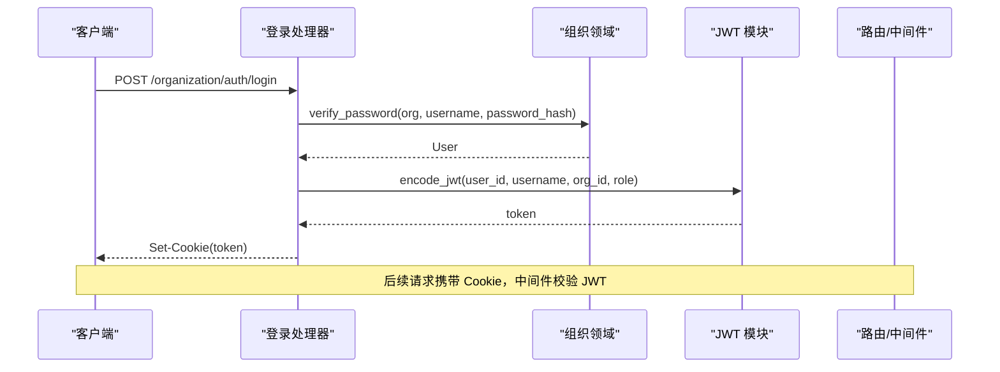
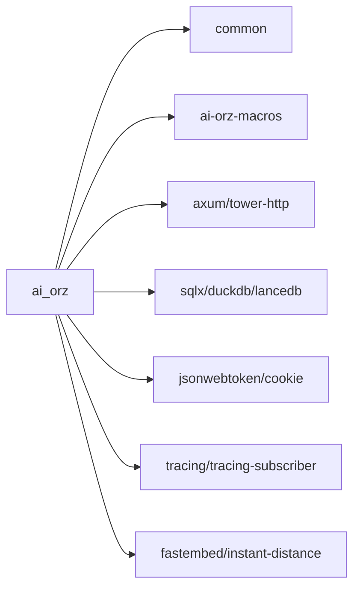

# 架构设计

<cite>
**本文引用的文件**
- [Cargo.toml](Cargo.toml)
- [src/main.rs](src/main.rs)
- [src/lib.rs](src/lib.rs)
- [src/router.rs](src/router.rs)
- [src/config.rs](src/config.rs)
- [common/Cargo.toml](common/Cargo.toml)
- [docs/ARCHITECTURE.md](docs/ARCHITECTURE.md)
- [docs/plan/architecture_status_20260725.md](docs/plan/architecture_status_20260725.md)
- [docs/design/event_design.md](docs/design/event_design.md)
- [docs/design/project_management_design.md](docs/design/project_management_design.md)
- [docs/design/message_channel_design.md](docs/design/message_channel_design.md)
- [src/service/domain/mod.rs](src/service/domain/mod.rs)
- [src/pkg/aop/mod.rs](src/pkg/aop/mod.rs)
- [src/consumer/mod.rs](src/consumer/mod.rs)
- [src/pkg/jwt.rs](src/pkg/jwt.rs)
</cite>

## 更新摘要
**变更内容**
- 更新了文档组织结构说明，明确区分设计决策（design/）、规划文档（plan/）和实现细节
- 增强了分层架构的详细说明，特别是四层严格单向依赖原则
- 更新了事件驱动架构的实现状态和最新进展
- 完善了领域驱动设计的业务域划分和组件关系
- 增强了安全认证、监控可观测性和灾难恢复的技术细节
- 更新了技术栈版本和依赖管理策略

## 目录
1. [简介](#简介)
2. [项目结构](#项目结构)
3. [核心组件](#核心组件)
4. [架构总览](#架构总览)
5. [详细组件分析](#详细组件分析)
6. [依赖关系分析](#依赖关系分析)
7. [性能考量](#性能考量)
8. [故障排查指南](#故障排查指南)
9. [结论](#结论)
10. [附录](#附录)

## 简介
本架构设计文档面向 AI Orz 系统，系统性阐述其分层架构、领域驱动设计与事件驱动架构的融合实践。重点说明四层严格单向依赖原则（Adapter → Domain → DAL → DAO），明确各层职责、组件交互关系、数据流向与集成模式；同时覆盖安全性、监控、灾难恢复等横切关注点，并记录技术栈、第三方依赖与版本兼容性要求。

**重要更新**：本项目已建立清晰的文档组织体系，将设计决策（design/）、规划文档（plan/）和当前实现细节分离，提高文档的可维护性，防止设计文档追逐当前实现状态。

## 项目结构
AI Orz 采用多 crate 工作区组织：
- common：前后端共享的 API DTO、枚举、错误类型与配置模型
- ai-orz-macros：日志与统计事件宏
- 后端服务（src）：HTTP 适配层、领域层、DAL/DAO、AOP 事件中心、消费者、工具注册、存储等
- frontend：Dioxus 前端应用（不在本架构文档展开）

**章节来源**
- [docs/ARCHITECTURE.md:11-65](docs/ARCHITECTURE.md#L11-L65)
- [src/router.rs:12-136](src/router.rs#L12-L136)
- [src/config.rs:1-78](src/config.rs#L1-L78)
- [src/lib.rs:114-175](src/lib.rs#L114-L175)

## 核心组件
- HTTP 路由与中间件：统一入口、认证鉴权、请求上下文注入
- 领域层：按业务域划分（hr/finance/message/organization/project/runtime/system），编排业务流程
- DAL/DAO：组合数据源完成业务级操作与单一数据源 CRUD
- AOP 事件中心：纯框架的事件生产-消费-调度，解耦异步处理
- 配置与启动：集中式配置加载、服务初始化顺序、静态资源托管
- JWT 认证：基于 HttpOnly Cookie 的无状态认证

**章节来源**
- [src/router.rs:12-136](src/router.rs#L12-L136)
- [src/service/domain/mod.rs:1-43](src/service/domain/mod.rs#L1-L43)
- [src/pkg/aop/mod.rs:1-61](src/pkg/aop/mod.rs#L1-L61)
- [src/config.rs:1-78](src/config.rs#L1-L78)
- [src/pkg/jwt.rs:1-158](src/pkg/jwt.rs#L1-L158)

## 架构总览
AI Orz 采用"分层架构 + 领域驱动 + 事件驱动"的混合模式：
- 分层架构：Adapter（Handler/Router）→ Domain → DAL → DAO，严格单向依赖，禁止跨层调用
- 领域驱动：以业务域为边界组织代码，聚合根与实体清晰，PO 不泄露到上层
- 事件驱动：通过 AOP 事件中心实现异步解耦，消息持久化、优先级与顺序保证

**图表来源**
- [src/router.rs:12-136](src/router.rs#L12-L136)
- [src/lib.rs:114-175](src/lib.rs#L114-L175)
- [src/pkg/aop/mod.rs:1-61](src/pkg/aop/mod.rs#L1-L61)

**章节来源**
- [docs/ARCHITECTURE.md:325-396](docs/ARCHITECTURE.md#L325-L396)
- [src/router.rs:12-136](src/router.rs#L12-L136)

## 详细组件分析

### 分层架构与四层依赖原则
- 依赖方向：Adapter → Domain → DAL → DAO → Models/Storage
- 禁止反模式：DAO 不调用其他 DAO；DAL 不调用其他 DAL；Handler 不直接访问 DAO；DAO 不做实体组装
- PO 与业务实体分离：PO 仅在 DAO/DAL 内部使用，Domain 及以上仅使用业务实体

**章节来源**
- [docs/ARCHITECTURE.md:325-396](docs/ARCHITECTURE.md#L325-L396)

### 领域驱动设计（DDD）
- 领域划分：hr（智能体）、finance（模型提供商/工具/消息渠道）、message（消息投递）、organization（组织/用户）、project（项目/任务/产物）、runtime（运行时）、system（定时触发器/备份/日志/健康指标）
- 聚合与实体：Project/Task/Artifact 聚合；Agent/Brain/Memory 聚合
- 接口契约：DAL 暴露业务级接口，Domain 通过 Arc<dyn Trait> 注入 DAL，符合 DIP

**图表来源**
- [docs/project_management_design.md:138-229](docs/project_management_design.md#L138-L229)
- [docs/ARCHITECTURE.md:245-260](docs/ARCHITECTURE.md#L245-L260)

**章节来源**
- [docs/ARCHITECTURE.md:245-260](docs/ARCHITECTURE.md#L245-L260)
- [docs/project_management_design.md:138-229](docs/project_management_design.md#L138-L229)

### 事件驱动架构（AOP）
- 事件中心：纯框架，零业务依赖；生产者发布事件，消费者订阅并执行领域逻辑
- 队列特性：持久化（消息表存 payload，队列存元数据）、崩溃恢复、优先级排序、order_key 顺序保证
- 消费者注册：在 consumer::init 中批量注册各类消费者（消息、定时任务、工具执行日志/统计、Agent 循环、思考轮次统计、任务事件）

**图表来源**
- [src/pkg/aop/mod.rs:1-61](src/pkg/aop/mod.rs#L1-L61)
- [src/consumer/mod.rs:16-37](src/consumer/mod.rs#L16-L37)
- [docs/ARCHITECTURE.md:229-243](docs/ARCHITECTURE.md#L229-L243)

**章节来源**
- [src/pkg/aop/mod.rs:1-61](src/pkg/aop/mod.rs#L1-L61)
- [src/consumer/mod.rs:16-37](src/consumer/mod.rs#L16-L37)
- [docs/ARCHITECTURE.md:229-243](docs/ARCHITECTURE.md#L229-L243)

### HTTP 适配层与中间件
- 路由分组：公开路由（初始化、登录、组织列表）、受保护路由（所有业务接口）、A2A 协议路由（JSON-RPC、回调、SSE）
- 中间件洋葱模型：JWT 认证在外层先执行，RequestContext 注入在内层后执行，确保后续处理器可获取用户身份与组织信息
- 权限控制：系统管理路由整体要求 Admin 权限，高危操作在 handler 内二次校验 SuperAdmin

**图表来源**
- [src/router.rs:12-136](src/router.rs#L12-L136)

**章节来源**
- [src/router.rs:12-136](src/router.rs#L12-L136)

### 安全与认证
- 认证方案：JWT + HttpOnly Cookie，适用于单实例部署
- Claims：包含 user_id、username、organization_id、role、exp、iat
- 登录流程：验证用户名密码 → 签发 JWT → 设置 Cookie → 后续请求由中间件校验

**图表来源**
- [src/handlers/organization/auth/login.rs:18-48](src/handlers/organization/auth/login.rs#L18-L48)
- [src/pkg/jwt.rs:11-106](src/pkg/jwt.rs#L11-L106)
- [src/router.rs:96-136](src/router.rs#L96-L136)

**章节来源**
- [src/handlers/organization/auth/login.rs:18-48](src/handlers/organization/auth/login.rs#L18-L48)
- [src/pkg/jwt.rs:11-106](src/pkg/jwt.rs#L11-L106)
- [src/router.rs:96-136](src/router.rs#L96-L136)

### 监控与可观测性
- AOP 统计收集器：在 worker 启动前安装 Hook，采集工具调用、思考轮次、Agent 循环等指标
- 系统监控 API：提供队列统计、事件查询、时间序列与分布统计
- 健康指标：聚合系统健康指标供前端 HUD 展示

**章节来源**
- [src/lib.rs:140-154](src/lib.rs#L140-L154)
- [src/router.rs:661-695](src/router.rs#L661-L695)

### 灾难恢复与数据持久化
- 事件持久化：所有事件先存入 messages 表，总线只存 message_id 元数据；服务启动自动恢复 pending 事件
- 记忆原始细节：按天 markdown 文件追加写入，人类可读且迁移简单
- 备份与恢复：系统管理提供备份创建、列出、删除、恢复脚本

**章节来源**
- [docs/ARCHITECTURE.md:166-183](docs/ARCHITECTURE.md#L166-L183)
- [docs/ARCHITECTURE.md:229-243](docs/ARCHITECTURE.md#L229-L243)
- [src/router.rs:633-646](src/router.rs#L633-L646)

## 依赖关系分析
- 工作区成员：ai_orz、frontend、common、ai-orz-macros
- 关键依赖：
  - Web：axum 0.8、tower-http 0.6
  - 异步：tokio full、futures、tokio-stream
  - 数据：sqlx 0.8.6（sqlite）、duckdb、lancedb、fastembed、instant-distance
  - 安全：jsonwebtoken 9.3、cookie 0.18
  - 序列化：serde、serde_json、toml
  - 日志：tracing、tracing-subscriber、tracing-appender
  - 工具：rmcp（MCP 客户端）、reqwest、uuid、chrono

**图表来源**
- [Cargo.toml:1-147](Cargo.toml#L1-L147)
- [common/Cargo.toml:1-34](common/Cargo.toml#L1-L34)

**章节来源**
- [Cargo.toml:1-147](Cargo.toml#L1-L147)
- [common/Cargo.toml:1-34](common/Cargo.toml#L1-L34)

## 性能考量
- 内存与 IO：短期/长期记忆按需检索，原始细节按天文件存储，避免常驻内存
- 并发与顺序：AOP 队列按 order_key 顺序锁保证顺序，不同 key 并行处理
- 查询优化：DAL 组合多个 DAO，减少 N+1 查询；写操作接收实体引用，避免重复查询
- 向量搜索：嵌入 fastembed + lancedb + instant-distance，支持本地向量化与 HNSW 索引

**章节来源**
- [docs/ARCHITECTURE.md:150-183](docs/ARCHITECTURE.md#L150-L183)
- [docs/ARCHITECTURE.md:229-243](docs/ARCHITECTURE.md#L229-L243)
- [docs/project_management_design.md:138-229](docs/project_management_design.md#L138-L229)
- [Cargo.toml:64-71](Cargo.toml#L64-L71)

## 故障排查指南
- 认证失败：检查 JWT 签名密钥与过期时间；确认中间件顺序（JWT 在外层先执行）
- 事件堆积：查看 AOP 队列统计与事件列表；检查消费者是否正常运行与 ack/nack
- 记忆检索异常：确认短期/长期记忆索引与文件路径；验证 FTS5 索引重建进度
- 备份恢复：核对备份版本与恢复脚本；确保数据目录权限正确

**章节来源**
- [src/router.rs:96-136](src/router.rs#L96-L136)
- [src/router.rs:661-695](src/router.rs#L661-L695)
- [docs/ARCHITECTURE.md:166-183](docs/ARCHITECTURE.md#L166-L183)

## 结论
AI Orz 通过分层架构、领域驱动与事件驱动的有机结合，实现了高内聚、低耦合、可扩展的系统设计。严格的单向依赖与清晰的职责边界保障了可维护性与可测试性；AOP 事件中心提供了强大的异步解耦能力；JWT 认证与权限控制确保了安全性；完善的监控与灾难恢复机制提升了系统的可观测性与可靠性。未来可在统计驱动的外部唤醒、全链路 E2E 测试与 Agent 思考记忆链路上持续演进。

## 附录
- 技术栈与版本兼容性
  - Rust 2024 edition，Tokio 全功能
  - Axum 0.8、Tower HTTP 0.6
  - SQLx 0.8.6（SQLite）、DuckDB、LanceDB、FastEmbed、Instant-Distance
  - JSON Web Token 9.3、Cookie 0.18
  - Tracing 生态、Serde/TOML/JSON
- 启动流程
  - 配置加载 → pkg 初始化 → service 初始化 → 生产者/消费者注册 → 基础数据幂等初始化 → AOP 统计 Hook 安装 → AOP 调度器启动 → 服务器监听

**章节来源**
- [Cargo.toml:10-71](Cargo.toml#L10-L71)
- [src/lib.rs:114-175](src/lib.rs#L114-L175)