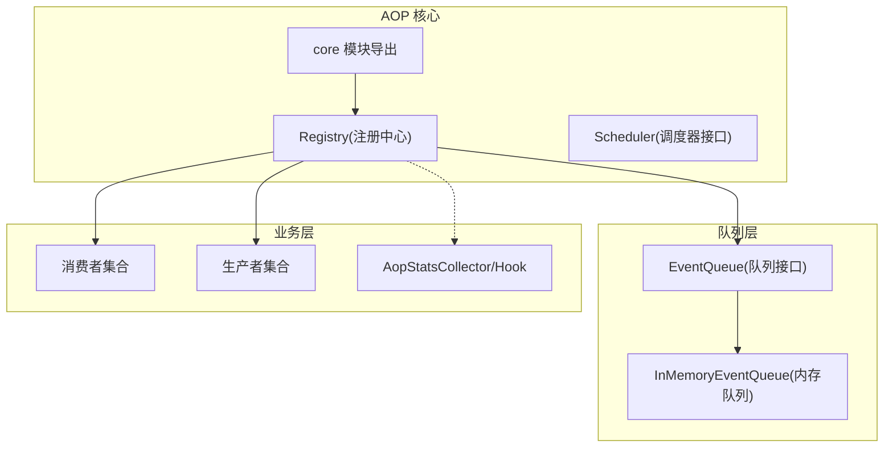
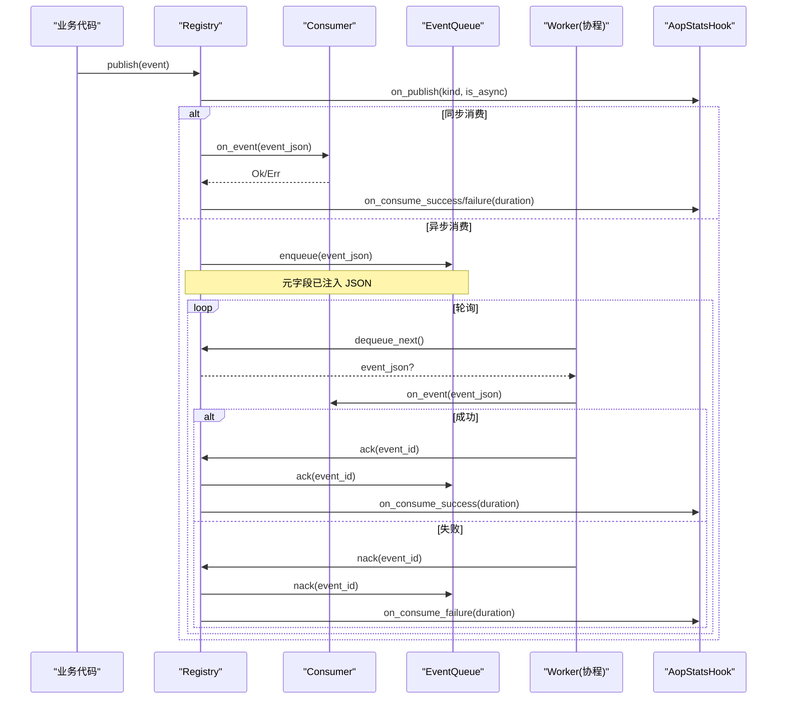
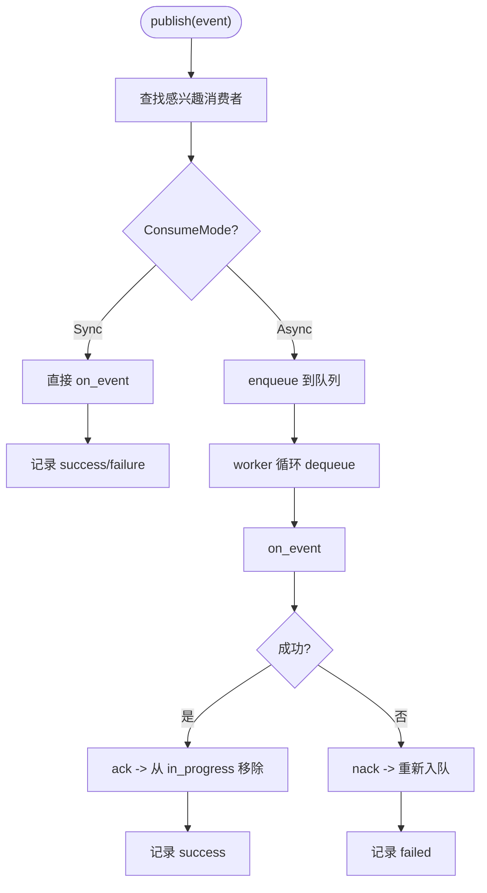
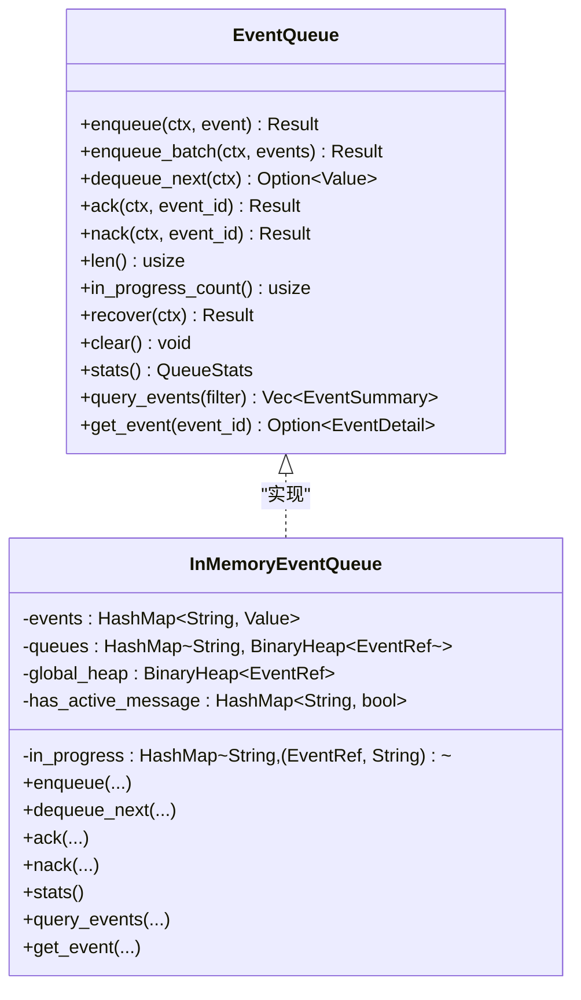
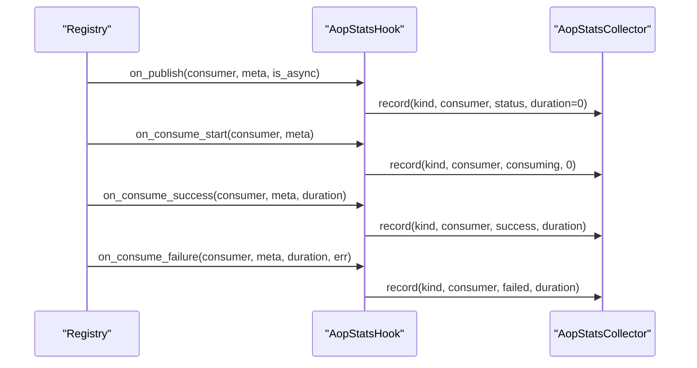
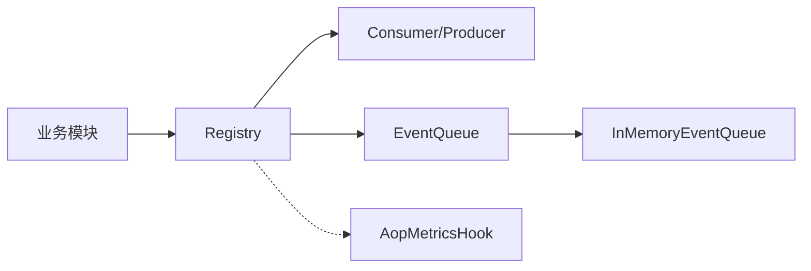

# AOP 事件系统（代码落地层）

<cite>
**本文引用的文件**
- [src/pkg/aop/mod.rs](src/pkg/aop/mod.rs)
- [src/pkg/aop/core/mod.rs](src/pkg/aop/core/mod.rs)
- [src/pkg/aop/core/registry.rs](src/pkg/aop/core/registry.rs)
- [src/pkg/aop/core/scheduler.rs](src/pkg/aop/core/scheduler.rs)
- [src/pkg/aop/queue/mod.rs](src/pkg/aop/queue/mod.rs)
- [src/pkg/aop/queue/in_memory.rs](src/pkg/aop/queue/in_memory.rs)
- [src/models/event.rs](src/models/event.rs)
- [src/consumer/mod.rs](src/consumer/mod.rs)
- [src/consumer/aop_stats_collector.rs](src/consumer/aop_stats_collector.rs)
- [src/consumer/aop_stats_hook.rs](src/consumer/aop_stats_hook.rs)
- [src/producer/mod.rs](src/producer/mod.rs)
- [Domain 内部事件与消费者全链路：8 类 DomainEvent 枚举 + 8 类 Consumer 业务消费 + AOP Producer 投递入口 + Registry 订阅](docs/wiki/knowledge/zh/Domain 内部事件与消费者全链路：8 类 DomainEvent 枚举 + 8 类 Consumer 业务消费 + AOP Producer 投递入口 + Registry 订阅/Domain 内部事件与消费者全链路：8 类 DomainEvent 枚举 + 8 类 Consumer 业务消费 + AOP Producer 投递入口 + Registry 订阅.md)
</cite>

### 本文关联的三类文档（四类互引闭环）

**① 设计文档（Design）**：
- [消费者与生产者架构设计](docs/archive/design-archive/consumer_architecture.md) — AOP 生产消费异步框架：8 Consumer 注册顺序 + Sync/Async 双模式 + ack/nack 语义
- [事件总线设计（归档参考）](docs/archive/design-archive/event_design.md) — ⚠️ 旧版 EventQueueDao 已废弃，仅对比参考

**② 落地计划（Plan）**：
- [Agent 循环驱动引擎 Plan](docs/archive/plan-archive/agent_loop_engine_plan.md) — DomainEvent 8 类 → AgentLoopConsumer 唤醒 + 三层兜底架构（字段+事件+定时）

**④ RAG 原子知识卡**：
- [Domain 内部事件与消费者全链路：8 类 DomainEvent 枚举 + 8 类 Consumer 业务消费 + AOP Producer 投递入口 + Registry 订阅](docs/wiki/knowledge/zh/Domain%20%E5%86%85%E9%83%A8%E4%BA%8B%E4%BB%B6%E4%B8%8E%E6%B6%88%E8%B4%B9%E8%80%85%E5%85%A8%E9%93%BE%E8%B7%AF%EF%BC%9A8%20%E7%B1%BB%20DomainEvent%20%E6%9E%9A%E4%B8%BE%20+%208%20%E7%B1%BB%20Consumer%20%E4%B8%9A%E5%8A%A1%E6%B6%88%E8%B4%B9%20+%20AOP%20Producer%20%E6%8A%95%E9%80%92%E5%85%A5%E5%8F%A3%20+%20Registry%20%E8%AE%A2%E9%98%85/Domain%20%E5%86%85%E9%83%A8%E4%BA%8B%E4%BB%B6%E4%B8%8E%E6%B6%88%E8%B4%B9%E8%80%85%E5%85%A8%E9%93%BE%E8%B7%AF%EF%BC%9A8%20%E7%B1%BB%20DomainEvent%20%E6%9E%9A%E4%B8%BE%20+%208%20%E7%B1%BB%20Consumer%20%E4%B8%9A%E5%8A%A1%E6%B6%88%E8%B4%B9%20+%20AOP%20Producer%20%E6%8A%95%E9%80%92%E5%85%A5%E5%8F%A3%20+%20Registry%20%E8%AE%A2%E9%98%85.md) — DomainEvent 8 大类别枚举（Message/Task/AgentAwake/Schedule/ToolExecLog/ToolExecStats/ThinkRound/AgentRuntimeState）+ Event Trait 五字段约束

## 目录
1. [简介](#简介)
2. [项目结构](#项目结构)
3. [核心组件](#核心组件)
4. [架构总览](#架构总览)
5. [详细组件分析](#详细组件分析)
6. [依赖关系分析](#依赖关系分析)
7. [性能考量](#性能考量)
8. [故障排查指南](#故障排查指南)
9. [结论](#结论)
10. [附录：开发、调试与监控方案](#附录开发调试与监控方案)

## 简介
本文件为 AI Orz 的面向切面编程（AOP）事件系统提供全面文档。该系统以"事件中心 + 生产者/消费者 + 异步队列"为核心，实现事件的定义、注册、发布与订阅；通过优先级与顺序键保障关键消息的顺序消费；内置统计收集器与监控钩子，支持运行时指标采集与可视化；并提供可插拔的队列抽象，当前默认内存队列，便于后续替换为持久化队列。

> 📌 视角说明（AGENTS §2.1.3 Level 3 互补视角平行卡）：
> 本长文是「AOP 事件系统」主题的 **代码落地层** 视角。同主题还有以下平行视角卡，请按需交叉阅读：
> - [AOP 事件系统（框架层）](docs/wiki/zh/content/基础设施/AOP 事件系统/AOP 事件系统.md)
> - [AOP 事件系统（系统管理层）](docs/wiki/zh/content/功能模块/系统管理/AOP 事件系统.md)

## 项目结构
AOP 事件系统位于 src/pkg/aop 下，采用分层设计：
- core：事件模型、消费者/生产者接口、注册中心与调度器
- queue：队列抽象与内存实现
- models/events：具体事件类型（由业务模块使用）
- consumer：业务消费者注册与统计收集
- producer：业务生产者注册与轮询

图表来源
- [src/pkg/aop/core/mod.rs:1-14](src/pkg/aop/core/mod.rs#L1-L14)
- [src/pkg/aop/core/registry.rs:11-19](src/pkg/aop/core/registry.rs#L11-L19)
- [src/pkg/aop/queue/mod.rs:77-106](src/pkg/aop/queue/mod.rs#L77-L106)
- [src/pkg/aop/queue/in_memory.rs:41-49](src/pkg/aop/queue/in_memory.rs#L41-L49)

章节来源
- [src/pkg/aop/mod.rs:1-61](src/pkg/aop/mod.rs#L1-L61)
- [src/pkg/aop/core/mod.rs:1-14](src/pkg/aop/core/mod.rs#L1-L14)

## 核心组件
- 事件模型与主题：统一的事件 trait、事件引用与主题枚举，支撑序列化、排序与分组消费
- 注册中心 Registry：维护消费者/生产者、队列映射，负责发布、分发、启动 worker 与生产者的轮询
- 队列抽象 EventQueue：入队、出队、确认/拒绝、恢复、查询与统计；默认内存实现 InMemoryEventQueue
- 消费者/生产者：业务侧实现 Consumer/Producer 并注册到 Registry
- 统计与监控：AopMetricsHook 注入 Registry，AopStatsCollector 聚合指标，暴露概览、时序、分布等

章节来源
- [src/models/event.rs:7-96](src/models/event.rs#L7-L96)
- [src/pkg/aop/core/registry.rs:11-19](src/pkg/aop/core/registry.rs#L11-L19)
- [src/pkg/aop/queue/mod.rs:77-106](src/pkg/aop/queue/mod.rs#L77-L106)
- [src/consumer/aop_stats_collector.rs:43-52](src/consumer/aop_stats_collector.rs#L43-L52)
- [src/consumer/aop_stats_hook.rs:14-17](src/consumer/aop_stats_hook.rs#L14-L17)

## 架构总览
AOP 事件系统遵循“解耦、可扩展、可观测”的设计原则：
- 事件定义与业务解耦：事件仅承载数据，不感知领域实体
- 同步/异步消费模式：根据消费者模式选择直接调用或入队异步处理
- 顺序与优先级：order_key 保证同组顺序，priority 控制全局优先
- 可插拔队列：通过 EventQueue 抽象，当前内存实现，未来可替换为持久化队列
- 可观测性：通过 Hook 在发布、消费开始、成功、失败四个阶段埋点

图表来源
- [src/pkg/aop/core/registry.rs:97-206](src/pkg/aop/core/registry.rs#L97-L206)
- [src/pkg/aop/core/registry.rs:208-258](src/pkg/aop/core/registry.rs#L208-L258)
- [src/pkg/aop/core/registry.rs:260-487](src/pkg/aop/core/registry.rs#L260-L487)
- [src/pkg/aop/queue/in_memory.rs:104-267](src/pkg/aop/queue/in_memory.rs#L104-L267)
- [src/consumer/aop_stats_hook.rs:35-82](src/consumer/aop_stats_hook.rs#L35-L82)

## 详细组件分析

### 事件模型与主题
- EventTopic：预定义 Message、TaskChange、CronTrigger，支持 Custom(u16) 扩展
- EventRef：用于堆排序与队列存储，包含 event_id、order_key、priority、created_at
- Event trait：要求 id、topic、order_key、priority、created_at 等，支持 Any 转换与克隆

复杂度说明
- 堆排序基于 priority 与 created_at，时间复杂度 O(log N)，空间 O(N)

章节来源
- [src/models/event.rs:7-96](src/models/event.rs#L7-L96)

### 注册中心 Registry
职责
- 管理消费者/生产者集合与队列映射
- 发布事件时按 EventKind 路由到对应消费者
- 同步模式直接调用 on_event；异步模式入队并由 worker 消费
- 启动所有异步消费者的 worker 与生产者的轮询任务
- 注入 AopMetricsHook 进行指标采集

关键点
- 原子 start_all 防止重复启动
- 元字段注入：event_id、kind、order_key、priority、created_at 写入 JSON 顶层
- 错误路径：on_event 失败后 nack + sleep 退避，避免紧密自旋

图表来源
- [src/pkg/aop/core/registry.rs:97-206](src/pkg/aop/core/registry.rs#L97-L206)
- [src/pkg/aop/core/registry.rs:260-487](src/pkg/aop/core/registry.rs#L260-L487)

章节来源
- [src/pkg/aop/core/registry.rs:11-561](src/pkg/aop/core/registry.rs#L11-L561)

### 队列抽象与内存实现
- EventQueue：定义 enqueue/enqueue_batch/dequeue_next/ack/nack/stats/query_events/get_event 等能力
- InMemoryEventQueue：
  - 数据结构：events(HashMap)、queues(order_key 堆)、global_heap(全局堆)、in_progress(进行中)、has_active_message(顺序键活跃标记)
  - 顺序保证：order_key 非空时，每个 order_key 内部严格顺序消费
  - 优先级：priority 高者优先，同优先级按 created_at 早者优先
  - 统计与查询：pending/in_progress/order_keys/oldest_event_age_secs，支持分页过滤

图表来源
- [src/pkg/aop/queue/mod.rs:77-106](src/pkg/aop/queue/mod.rs#L77-L106)
- [src/pkg/aop/queue/in_memory.rs:41-49](src/pkg/aop/queue/in_memory.rs#L41-L49)

章节来源
- [src/pkg/aop/queue/mod.rs:10-106](src/pkg/aop/queue/mod.rs#L10-L106)
- [src/pkg/aop/queue/in_memory.rs:104-449](src/pkg/aop/queue/in_memory.rs#L104-L449)

### 消费者与生产者注册
- 消费者注册：consumer::init 中集中注册各业务消费者（消息、定时任务、工具执行日志/统计、Agent 循环、思考轮次统计、任务事件）
- 生产者注册：producer::init 中注册 CronTrigger 与 A2A 轮询生产者，并启动消息通道生产者

章节来源
- [src/consumer/mod.rs:16-37](src/consumer/mod.rs#L16-L37)
- [src/producer/mod.rs:9-26](src/producer/mod.rs#L9-L26)

### 统计收集器与监控钩子
- AopStatsCollector：内存统计，提供 overview/time_series/distribution/uptime_secs
- AopStatsHook：实现 AopMetricsHook，在 on_publish/on_consume_start/on_consume_success/on_consume_failure 回调中记录指标
- 注入方式：Registry.set_metrics_hook 注入 Hook，零开销（未设置时跳过）

图表来源
- [src/consumer/aop_stats_hook.rs:35-82](src/consumer/aop_stats_hook.rs#L35-L82)
- [src/consumer/aop_stats_collector.rs:61-72](src/consumer/aop_stats_collector.rs#L61-L72)

章节来源
- [src/consumer/aop_stats_collector.rs:43-196](src/consumer/aop_stats_collector.rs#L43-L196)
- [src/consumer/aop_stats_hook.rs:14-82](src/consumer/aop_stats_hook.rs#L14-L82)

## 依赖关系分析
- Registry 依赖：
  - Consumer/Producer 接口
  - EventQueue 抽象（默认 InMemoryEventQueue）
  - AopMetricsHook（可选，零开销）
- InMemoryEventQueue 依赖：
  - 标准库容器（HashMap、BinaryHeap）
  - RequestContext（上下文传递）
- 业务层依赖：
  - consumer::init 注册消费者
  - producer::init 注册生产者
  - 事件类型位于 models/events

图表来源
- [src/pkg/aop/core/registry.rs:11-19](src/pkg/aop/core/registry.rs#L11-L19)
- [src/pkg/aop/queue/mod.rs:77-106](src/pkg/aop/queue/mod.rs#L77-L106)
- [src/pkg/aop/queue/in_memory.rs:41-49](src/pkg/aop/queue/in_memory.rs#L41-L49)

章节来源
- [src/pkg/aop/core/mod.rs:1-14](src/pkg/aop/core/mod.rs#L1-L14)
- [src/pkg/aop/queue/mod.rs:77-106](src/pkg/aop/queue/mod.rs#L77-L106)

## 性能考量
- 顺序与并行平衡
  - order_key 非空时，同一 key 的消息串行消费，确保顺序但降低吞吐
  - 合理拆分 order_key 粒度，避免热点键导致瓶颈
- 优先级策略
  - priority 越大越先消费，适合紧急告警、关键状态变更
  - 建议将普通事件设为较低优先级，避免饥饿
- 队列与锁
  - InMemoryEventQueue 使用 Mutex 保护共享结构，批量操作尽量合并以减少锁竞争
- 退避与背压
  - on_event 失败后 sleep(error_retry_sleep_ms) 避免 CPU 自旋
  - 空队列 sleep(empty_queue_sleep_ms) 减少无意义轮询
- 统计开销
  - Hook 通过 spawn 后台任务记录指标，避免阻塞主流程
  - 统计为内存结构，重启清零，适合短期趋势观察

[本节为通用指导，无需特定文件来源]

## 故障排查指南
常见问题与定位方法
- 事件堆积
  - 检查队列 stats 的 pending_count 与 oldest_event_age_secs
  - 查看 order_keys 分布，识别热点顺序键
  - 确认消费者是否因异常频繁 nack 导致重试风暴
- 顺序错乱
  - 确认 order_key 是否正确设置，避免跨业务混用
  - 检查是否有并发写导致顺序键冲突
- 消费者卡死
  - 检查 on_event 是否长时间阻塞或 panic
  - 确认 ack/nack 是否被正确调用（Registry 已自动调用，若自定义队列需自行保证）
- 指标缺失
  - 确认 AopStatsHook 已注入 Registry
  - 检查 collector 的 overview/time_series 是否返回数据

章节来源
- [src/pkg/aop/queue/in_memory.rs:300-312](src/pkg/aop/queue/in_memory.rs#L300-L312)
- [src/pkg/aop/core/registry.rs:333-445](src/pkg/aop/core/registry.rs#L333-L445)
- [src/consumer/aop_stats_collector.rs:74-196](src/consumer/aop_stats_collector.rs#L74-L196)

## 结论
AOP 事件系统通过清晰的层次划分与可插拔抽象，实现了高内聚、低耦合的事件驱动架构。其优先级与顺序键机制保障了关键消息的处理语义；统计与监控钩子提供了运行时可观测性；内存队列满足大多数场景需求，同时为持久化队列预留了扩展点。结合最佳实践与调优策略，可在复杂业务中稳定运行并持续演进。

[本节为总结，无需特定文件来源]

## 附录：开发、调试与监控方案

### 事件开发指南
- 定义事件
  - 实现 Event trait，提供 id、topic、order_key、priority、created_at
  - 将事件放入 models/events 并按主题分类
- 注册消费者
  - 在 consumer::init 中 register_consumer，指定感兴趣的 EventKind
  - 根据业务需要选择 ConsumeMode（Sync/Async）
- 注册生产者
  - 在 producer::init 中 register_producer，按需配置 poll_interval_secs/start
- 发布事件
  - 使用 aop::publish(event) 或直接调用 registry().publish(event)

章节来源
- [src/models/event.rs:54-96](src/models/event.rs#L54-L96)
- [src/consumer/mod.rs:16-37](src/consumer/mod.rs#L16-L37)
- [src/producer/mod.rs:9-26](src/producer/mod.rs#L9-L26)
- [src/pkg/aop/mod.rs:48-59](src/pkg/aop/mod.rs#L48-L59)

### 调试工具
- 队列查询
  - 使用 registry.query_events(consumer_name, filter) 获取待处理/处理中事件列表
  - 使用 registry.get_event(consumer_name, event_id) 获取单个事件详情（含脱敏预览）
- 统计快照
  - 通过 AopStatsCollector.overview/time_series/distribution 获取概览、时序与分布
- 日志与埋点
  - 关注 Registry 中的 sys_error/sys_warn 输出，定位 enqueue/dequeue/ack/nack 错误
  - 利用 Hook 记录的 published/consuming/success/failed 状态辅助排障

章节来源
- [src/pkg/aop/core/registry.rs:500-553](src/pkg/aop/core/registry.rs#L500-L553)
- [src/pkg/aop/queue/in_memory.rs:314-447](src/pkg/aop/queue/in_memory.rs#L314-L447)
- [src/consumer/aop_stats_collector.rs:74-196](src/consumer/aop_stats_collector.rs#L74-L196)

### 监控方案
- 指标维度
  - event_kind、consumer_name、status（published/published_sync/consuming/success/failed）
- 展示建议
  - 概览面板：total_published、total_consumed、total_success、total_failed、avg_duration_ms
  - 时序面板：按分钟桶的调用量曲线，支持按 kind/consumer/status 过滤
  - 分布面板：按 consumer/status/kind 分组计数，快速定位热点与异常
- 告警规则
  - 失败率突增、平均耗时飙升、队列积压超过阈值、最老事件年龄过大

章节来源
- [src/consumer/aop_stats_collector.rs:26-196](src/consumer/aop_stats_collector.rs#L26-L196)
- [src/consumer/aop_stats_hook.rs:35-82](src/consumer/aop_stats_hook.rs#L35-L82)