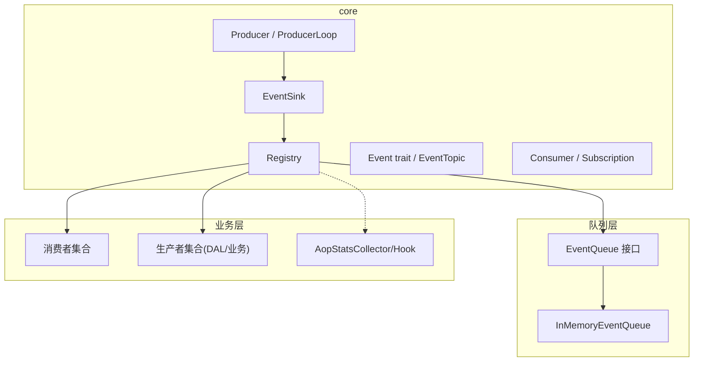
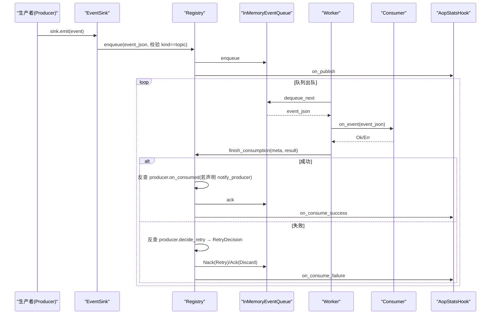
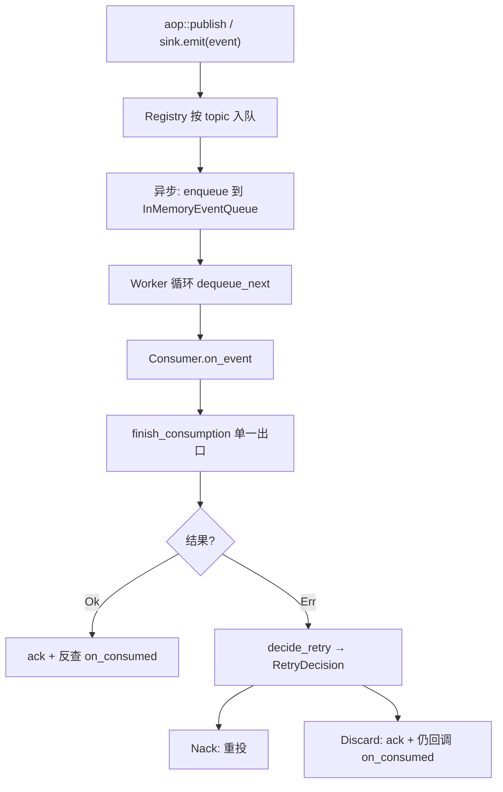
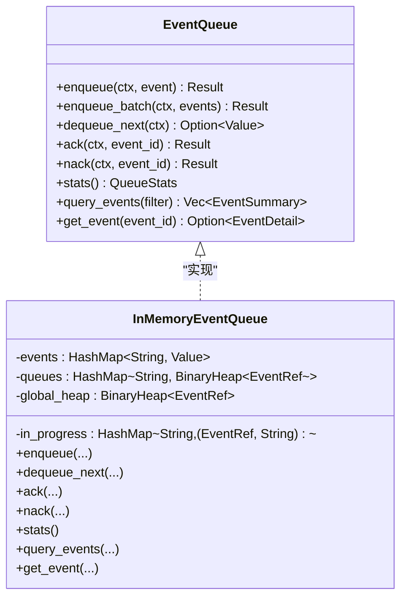
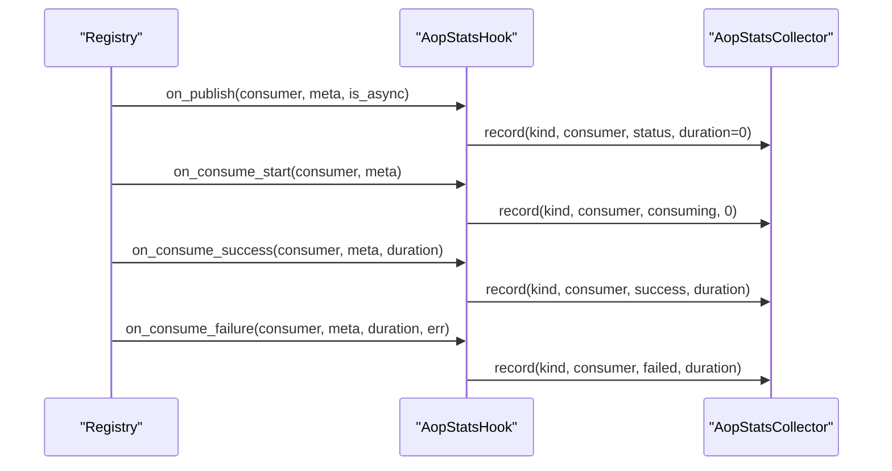
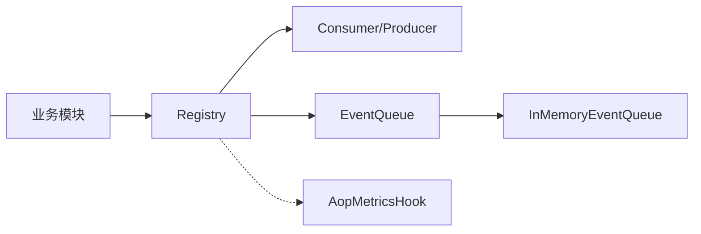

# AOP 事件系统（代码落地层）

<cite>
**本文引用的文件**
- [src/pkg/aop/mod.rs](src/pkg/aop/mod.rs) — `publish` / `init_all` / `shutdown_all` 入口
- [src/pkg/aop/core/registry.rs](src/pkg/aop/core/registry.rs) — `register_producer` / `register_consumer` / `start_all` / `finish_consumption` / `DeliveryOutcome`
- [src/pkg/aop/core/event.rs](src/pkg/aop/core/event.rs) — `Event` trait（`kind` / `order_key` / `id` / `priority` / `created_at`）
- [src/pkg/aop/core/consumer.rs](src/pkg/aop/core/consumer.rs) — `Consumer` trait + `Subscription`
- [src/pkg/aop/core/producer.rs](src/pkg/aop/core/producer.rs) — `Producer` trait + `ProducerLoop` + `RetryDecision`
- [src/pkg/aop/core/event_sink.rs](src/pkg/aop/core/event_sink.rs) — `EventSink`（1 producer : 1 topic 强制点）
- [src/pkg/aop/queue/mod.rs](src/pkg/aop/queue/mod.rs) — `EventQueue` 队列抽象
- [src/pkg/aop/queue/in_memory.rs](src/pkg/aop/queue/in_memory.rs) — `EventRef.attempt` / `nack` 自增
- [common/src/enums/event_topic.rs](common/src/enums/event_topic.rs) — `EventTopic` 主题枚举（16 变体）
- [src/models/events/mod.rs](src/models/events/mod.rs) — 领域事件目录（复数，16 类）
- [src/consumer/mod.rs](src/consumer/mod.rs) — `consumer::init` 注册消费者
- [src/producer/mod.rs](src/producer/mod.rs) — `producer::init` 注册生产者
- [src/consumer/aop_stats_collector.rs](src/consumer/aop_stats_collector.rs) — 指标聚合
- [src/consumer/aop_stats_hook.rs](src/consumer/aop_stats_hook.rs) — 指标埋点 Hook
- [Domain 内部事件与消费者全链路：8 类 DomainEvent 枚举 + 8 类 Consumer 业务消费 + AOP Producer 投递入口 + Registry 订阅](docs/wiki/knowledge/zh/Domain%20%E5%86%85%E9%83%A8%E4%BA%8B%E4%BB%B6%E4%B8%8E%E6%B6%88%E8%B4%B9%E8%80%85%E5%85%A8%E9%93%BE%E8%B7%AF%EF%BC%9A8%20%E7%B1%BB%20DomainEvent%20%E6%9E%83%E4%B8%BE%20+%208%20%E7%B1%BB%20Consumer%20%E4%B8%9A%E5%8A%A1%E6%B6%88%E8%B4%B9%20+%20AOP%20Producer%20%E6%8A%95%E9%80%92%E5%85%A5%E5%8F%A3%20+%20Registry%20%E8%AE%A2%E9%98%85/Domain%20%E5%86%85%E9%83%A8%E4%BA%8B%E4%BB%B6%E4%B8%8E%E6%B6%88%E8%B4%B9%E8%80%85%E5%85%A8%E9%93%BE%E8%B7%AF%EF%BC%9A8%20%E7%B1%BB%20DomainEvent%20%E6%9E%83%E4%B8%BE%20+%208%20%E7%B1%BB%20Consumer%20%E4%B8%9A%E5%8A%A1%E6%B6%88%E8%B4%B9%20+%20AOP%20Producer%20%E6%8A%95%E9%80%92%E5%85%A5%E5%8F%A3%20+%20Registry%20%E8%AE%A2%E9%98%85.md)

**本文关联的文档（单向引用 v2.1：活文档 → 历史/兄弟文档）**
- [消费者与生产者架构设计](docs/archive/design-archive/consumer_architecture.md) — AOP 生产消费异步框架：消费者注册顺序 + Sync/Async 双模式 + 收尾反查
- [事件总线设计（归档参考）](docs/archive/design-archive/event_design.md) — ⚠️ 旧版 EventQueueDao 已废弃，仅对比参考
- [Agent 循环驱动引擎 Plan](docs/archive/plan-archive/agent_loop_engine_plan.md) — DomainEvent 8 类 → AgentLoopConsumer 唤醒 + 三层兜底架构
- [RAG 知识卡：Domain 内部事件与消费者全链路](docs/wiki/knowledge/zh/Domain%20%E5%86%85%E9%83%A8%E4%BA%8B%E4%BB%B6%E4%B8%8E%E6%B6%88%E8%B4%B9%E8%80%85%E5%85%A8%E9%93%BE%E8%B7%AF%EF%BC%9A8%20%E7%B1%BB%20DomainEvent%20%E6%9E%83%E4%B8%BE%20+%208%20%E7%B1%BB%20Consumer%20%E4%B8%9A%E5%8A%A1%E6%B6%88%E8%B4%B9%20+%20AOP%20Producer%20%E6%8A%95%E9%80%92%E5%85%A5%E5%8F%A3%20+%20Registry%20%E8%AE%A2%E9%98%85/Domain%20%E5%86%85%E9%83%A8%E4%BA%8B%E4%BB%B6%E4%B8%8E%E6%B6%88%E8%B4%B9%E8%80%85%E5%85%A8%E9%93%BE%E8%B7%AF%EF%BC%9A8%20%E7%B1%BB%20DomainEvent%20%E6%9E%83%E4%B8%BE%20+%208%20%E7%B1%BB%20Consumer%20%E4%B8%9A%E5%8A%A1%E6%B6%88%E8%B4%B9%20+%20AOP%20Producer%20%E6%8A%95%E9%80%92%E5%85%A5%E5%8F%A3%20+%20Registry%20%E8%AE%A2%E9%98%85.md) — EventTopic 16 大类 + `Event` trait 五字段约束
</cite>

## 更新摘要
**变更内容**
- 主题体系收敛：删除 `EventKind`，统一为 `common::enums::EventTopic`（16 变体，点分线字符串）；`Event::topic()` 改为 `Event::kind() -> EventTopic`，响应侧 `AopEventMeta.event_kind` 恒为 `String`
- 生产者契约改形：`interested_events()` → `subscriptions()`；删除 `register()` / `poll()` / `poll_interval_secs()`，新增 `start(sink)` / `stop()` 与 `EventSink`；`ProducerLoop` 自管可中断循环（250ms 分片），Registry 只做 `start_all` / `shutdown_all` 编排
- 收尾单一出口 `finish_consumption`：按 topic 反查 producer 回调 `on_consumed` / `on_failed`，`RetryDecision { Retry, Discard }` 判定权下沉消费者（`decide_retry`），框架不设 `max_retry`、无死信
- 队列侧 `EventRef.attempt` 累计重试次数（nack 自增），`DeliveryOutcome { Ack, Nack }` 驱动 ack / nack
- 「DAL-as-Producer」：`message.created` / `cron.trigger` / `email` / `wechat` / `lark` 入站由对应 DAL / 生产者对象自身收尾，不再新建独立 producer 类型

## 目录
1. [简介](#简介)
2. [项目结构](#项目结构)
3. [核心组件](#核心组件)
4. [架构总览](#架构总览)
5. [详细组件分析](#详细组件分析)
6. [依赖关系分析](#依赖关系分析)
7. [性能考量](#性能考量)
8. [故障排查指南](#故障排查指南)
9. [结论](#结论)
10. [附录：开发、调试与监控方案](#附录开发调试与监控方案)

## 简介
本文件为 AI Orz 的面向切面编程（AOP）事件系统提供全面文档。该系统以「事件中心 + 生产者 / 消费者 + 异步队列」为核心，实现事件的定义、注册、发布与订阅；通过优先级与顺序键保障关键消息的顺序消费；内置统计收集器与监控钩子，支持运行时指标采集与可视化；并提供可插拔的队列抽象，当前默认内存队列，便于后续替换为持久化队列。

> 📌 视角说明（AGENTS §2.1.3 Level 3 互补视角平行卡）：
> 本长文是「AOP 事件系统」主题的 **代码落地层** 视角。同主题还有以下平行视角卡，请按需交叉阅读：
> - [AOP 事件系统（框架层）](docs/wiki/zh/content/基础设施/AOP 事件系统/AOP 事件系统.md)
> - [AOP 事件系统（系统管理层）](docs/wiki/zh/content/功能模块/系统管理/AOP 事件系统.md)

章节来源
- [src/pkg/aop/mod.rs](src/pkg/aop/mod.rs)

## 项目结构
AOP 事件系统位于 `src/pkg/aop` 下，采用分层设计：
- core：事件模型、消费者 / 生产者接口、注册中心、事件汇（EventSink）
- queue：队列抽象与内存实现
- models/events：具体事件类型（由业务模块使用，复数目录）
- consumer：业务消费者注册与统计收集
- producer：业务生产者注册与自管循环

图表来源
- [src/pkg/aop/core/registry.rs](src/pkg/aop/core/registry.rs)
- [src/pkg/aop/core/event_sink.rs](src/pkg/aop/core/event_sink.rs)
- [src/pkg/aop/queue/mod.rs](src/pkg/aop/queue/mod.rs)
- [src/pkg/aop/queue/in_memory.rs](src/pkg/aop/queue/in_memory.rs)

章节来源
- [src/pkg/aop/mod.rs](src/pkg/aop/mod.rs)
- [src/pkg/aop/core/mod.rs](src/pkg/aop/core/mod.rs)

## 核心组件
- 事件模型与主题：`Event` trait 统一事件结构，`EventTopic` 闭环枚举承载主题（点分线字符串），支撑序列化、排序与分组消费
- 注册中心 Registry：维护消费者 / 生产者（按 topic 索引）、队列映射，负责入队、出队、启动 worker 与生产者的生命周期编排
- 队列抽象 EventQueue：入队、出队、确认 / 拒绝、统计、查询；默认内存实现 InMemoryEventQueue
- 消费者 / 生产者：业务侧实现 `Consumer` / `Producer` 并注册到 Registry；生产者通过 `EventSink` 投递
- 统计与监控：`AopMetricsHook` 注入 Registry，`AopStatsCollector` 聚合指标，暴露概览、时序、分布等

章节来源
- [common/src/enums/event_topic.rs](common/src/enums/event_topic.rs)
- [src/pkg/aop/core/event.rs](src/pkg/aop/core/event.rs)
- [src/pkg/aop/core/registry.rs](src/pkg/aop/core/registry.rs)
- [src/pkg/aop/queue/mod.rs](src/pkg/aop/queue/mod.rs)
- [src/consumer/aop_stats_collector.rs](src/consumer/aop_stats_collector.rs)
- [src/consumer/aop_stats_hook.rs](src/consumer/aop_stats_hook.rs)

## 架构总览
AOP 事件系统遵循「解耦、可扩展、可观测」的设计原则：
- 事件定义与业务解耦：事件仅承载数据，不感知领域实体
- 同步 / 异步消费模式：根据消费者模式选择直接调用或入队异步处理
- 顺序与优先级：`order_key` 保证同组顺序，`priority` 控制全局优先
- 可插拔队列：通过 `EventQueue` 抽象，当前内存实现，未来可替换为持久化队列
- 可观测性：通过 Hook 在发布、消费开始、成功、失败四个阶段埋点
- 收尾反查：消费结束后由 `finish_consumption` 单点按 topic 反查生产者回调，重试判定权下沉消费者（`decide_retry`）

图表来源
- [src/pkg/aop/core/event_sink.rs](src/pkg/aop/core/event_sink.rs)
- [src/pkg/aop/core/registry.rs](src/pkg/aop/core/registry.rs)
- [src/pkg/aop/queue/in_memory.rs](src/pkg/aop/queue/in_memory.rs)
- [src/consumer/aop_stats_hook.rs](src/consumer/aop_stats_hook.rs)

## 详细组件分析

### 事件模型与主题
- `EventTopic`：闭环枚举，定义于 `common/src/enums/event_topic.rs`，共 16 个变体，线格式为点分线字符串（如 `message.created` / `cron.trigger` / `a2a.poll.requested`）；提供 `as_str` / `parse` / `ALL` / `Display`，手写 `Serialize` / `Deserialize` / `JsonSchema` 以匹配点分格式
- `Event` trait：要求 `kind() -> EventTopic`、`order_key`、`id`、`priority`、`created_at`，支持克隆与序列化
- `EventRef`：`InMemoryEventQueue` 内部用于堆排序与队列存储，除 `event_id` / `order_key` / `priority` / `created_at` 外新增 `attempt` 字段，记录本事件被消费的累计次数

复杂度说明
- 堆排序基于 `priority` 与 `created_at`，时间复杂度 O(log N)，空间 O(N)

章节来源
- [common/src/enums/event_topic.rs](common/src/enums/event_topic.rs)
- [src/pkg/aop/core/event.rs](src/pkg/aop/core/event.rs)
- [src/pkg/aop/queue/in_memory.rs](src/pkg/aop/queue/in_memory.rs)

### 注册中心 Registry
职责
- 以 `producers_by_topic` / `consumers_by_topic` 维护生产者（按 topic 索引）与消费者集合
- 发布事件时按主题入队；同步模式直接调用 `on_event`，异步模式入队并由 worker 消费
- `start_all`：先校验（声明 `notify_producer` 的 topic 缺 producer → 启动 `Err`），再逐个 `EventSink::new(self, producer.topic())` + `producer.start(sink)`；`shutdown_all` 反向停止
- `register_producer` 改为**同步**，topic 占位冲突报 `Conflict`（1 topic : 1 producer）
- 注入 `AopMetricsHook` 进行指标采集
- 收尾单一出口 `finish_consumption`：反查链 = `EventTopic::parse(meta.event_kind)` ∧ 消费者声明 `notify_producer` ∧ registry 有 `producer_for(kind)`，三者齐备才回调；`Ok`→`on_consumed`→Ack，`Err`→`on_failed`→`RetryDecision`

关键点
- 原子 `start_all` 防止重复启动
- 元字段注入：`event_id` / `kind` / `order_key` / `priority` / `created_at` / `attempt` 写入 JSON 顶层
- 回调跑在 `carried_ctx` 恢复的 ctx 上，**先于** `queue.ack()` → 回调必须幂等

图表来源
- [src/pkg/aop/core/registry.rs](src/pkg/aop/core/registry.rs)
- [src/pkg/aop/core/event_sink.rs](src/pkg/aop/core/event_sink.rs)

章节来源
- [src/pkg/aop/core/registry.rs](src/pkg/aop/core/registry.rs)

### 队列抽象与内存实现
- `EventQueue`：定义 `enqueue` / `enqueue_batch` / `dequeue_next` / `ack` / `nack` / `stats` / `query_events` / `get_event` 等能力
- `InMemoryEventQueue`：
  - 数据结构：`events`（HashMap）、`queues`（order_key 堆）、`global_heap`（全局堆）、`in_progress`（进行中）
  - 顺序保证：`order_key` 非空时，每个 `order_key` 内部严格顺序消费
  - 优先级：`priority` 高者优先，同优先级按 `created_at` 早者优先
  - 重试计数：`nack` 时 `event_ref.attempt` 自增，下次出队注入封套供消费侧读取 `AopEventMeta.attempt`
  - 统计与查询：`pending` / `in_progress` / `order_keys` / `oldest_event_age_secs`，支持分页过滤
- 收尾判定：框架用 `DeliveryOutcome { Ack, Nack }`（定义于 `registry.rs`）表达 ack / nack 结果

图表来源
- [src/pkg/aop/queue/mod.rs](src/pkg/aop/queue/mod.rs)
- [src/pkg/aop/queue/in_memory.rs](src/pkg/aop/queue/in_memory.rs)

章节来源
- [src/pkg/aop/queue/mod.rs](src/pkg/aop/queue/mod.rs)
- [src/pkg/aop/queue/in_memory.rs](src/pkg/aop/queue/in_memory.rs)

### 消费者与生产者注册
- 消费者注册：`consumer::init` 中集中注册各业务消费者（消息、定时任务、工具执行日志 / 统计、Agent 循环、思考轮次统计、任务事件、各入站通道）
- 生产者注册：`producer::init` 中注册 `CronTriggerProducer` 与 `A2aPollingProducer`；DAL 侧在 `dal::init_all` 中把 `MessageDalImpl` / `EmailDalImpl` / `WechatDalImpl` / `LarkDalImpl` 同时 coerce 为 `Arc<dyn Producer>` 注册
- 启动顺序：`dal::init_all()` → `producer::init()` → `consumer::init()` → `aop::init_all()`

章节来源
- [src/consumer/mod.rs](src/consumer/mod.rs)
- [src/producer/mod.rs](src/producer/mod.rs)
- [src/service/dal/message.rs](src/service/dal/message.rs)
- [src/producer/cron_trigger.rs](src/producer/cron_trigger.rs)

### 统计收集器与监控钩子
- `AopStatsCollector`：内存统计，提供 `overview` / `time_series` / `distribution` / `uptime_secs`
- `AopStatsHook`：实现 `AopMetricsHook`，在 `on_publish` / `on_consume_start` / `on_consume_success` / `on_consume_failure` 回调中记录指标
- 注入方式：`Registry::set_metrics_hook` 注入 Hook，零开销（未设置时跳过）

图表来源
- [src/consumer/aop_stats_hook.rs](src/consumer/aop_stats_hook.rs)
- [src/consumer/aop_stats_collector.rs](src/consumer/aop_stats_collector.rs)

章节来源
- [src/consumer/aop_stats_collector.rs](src/consumer/aop_stats_collector.rs)
- [src/consumer/aop_stats_hook.rs](src/consumer/aop_stats_hook.rs)

## 依赖关系分析
- Registry 依赖：
  - `Consumer` / `Producer` 接口
  - `EventQueue` 抽象（默认 InMemoryEventQueue）
  - `AopMetricsHook`（可选，零开销）
- InMemoryEventQueue 依赖：
  - 标准库容器（HashMap、BinaryHeap）
  - `RequestContext`（上下文传递）
- 业务层依赖：
  - `consumer::init` 注册消费者
  - `producer::init` + `dal::init_all` 注册生产者
  - 事件类型位于 `models/events`

图表来源
- [src/pkg/aop/core/registry.rs](src/pkg/aop/core/registry.rs)
- [src/pkg/aop/queue/mod.rs](src/pkg/aop/queue/mod.rs)
- [src/pkg/aop/queue/in_memory.rs](src/pkg/aop/queue/in_memory.rs)

章节来源
- [src/pkg/aop/core/mod.rs](src/pkg/aop/core/mod.rs)
- [src/pkg/aop/queue/mod.rs](src/pkg/aop/queue/mod.rs)

## 性能考量
- 顺序与并行平衡
  - `order_key` 非空时，同一 key 的消息串行消费，确保顺序但降低吞吐
  - 合理拆分 `order_key` 粒度，避免热点键导致瓶颈
- 优先级策略
  - `priority` 越大越先消费，适合紧急告警、关键状态变更
  - 建议将普通事件设为较低优先级，避免饥饿
- 队列与锁
  - InMemoryEventQueue 使用 Mutex 保护共享结构，批量操作尽量合并以减少锁竞争
- 退避与背压
  - `on_event` 失败后经 `decide_retry` 判定；生产者 `ProducerLoop` 以 250ms 分片可中断 sleep 退避，避免紧密自旋
  - 空队列由 `dequeue_next` 自身节奏控制，减少无意义轮询
- 统计开销
  - Hook 通过 spawn 后台任务记录指标，避免阻塞主流程
  - 统计为内存结构，重启清零，适合短期趋势观察

[本节为通用指导，无需特定文件来源]

## 故障排查指南
常见问题与定位方法
- 事件无消费者
  - 现象：事件入队后始终 `pending` 不下降
  - 定位：确认目标 topic 已被某消费者在 `subscriptions()` 中声明；`a2a.poll.requested` 等无 producer 的 topic 仍须有消费者，否则只入队不消费
- 无限重投（Nack 风暴）
  - 现象：同一 `event_id` 反复出队，`attempt` 持续自增
  - 定位：消费返回 `Err` 时先检查 `on_event` 为何抛错；收敛由 `Consumer::decide_retry` 负责（永久错误码 / `attempt >= DEFAULT_MAX_ATTEMPTS(8)` → `Discard`），若该消费者覆写了 `decide_retry` 且恒 `Retry`（如 cron）则永不放弃
- Discard 静默
  - 现象：事件被 `Discard` 后消失，失败率面板不体现
  - 定位：`Discard` 走 ack 路径且仍回调 `on_consumed`，并打 `on_consume_discarded` 埋点（不计入失败率）；排查丢弃原因看 error 日志与丢弃埋点，而非失败率
- 顺序错乱
  - 确认 `order_key` 是否正确设置，避免跨业务混用
- 指标缺失
  - 确认 `AopStatsHook` 已注入 Registry
  - 检查 collector 的 `overview` / `time_series` 是否返回数据

章节来源
- [src/pkg/aop/queue/in_memory.rs](src/pkg/aop/queue/in_memory.rs)
- [src/pkg/aop/core/registry.rs](src/pkg/aop/core/registry.rs)
- [src/consumer/aop_stats_collector.rs](src/consumer/aop_stats_collector.rs)

## 结论
AOP 事件系统通过清晰的层次划分与可插拔抽象，实现了高内聚、低耦合的事件驱动架构。其优先级与顺序键机制保障了关键消息的处理语义；`EventTopic` 闭环枚举统一了主题表达；统计与监控钩子提供了运行时可观测性；内存队列满足大多数场景需求，同时为持久化队列预留了扩展点。结合「DAL-as-Producer」归属模型与 `finish_consumption` 单点收尾，重试判定权下沉消费者（`decide_retry`），可在复杂业务中稳定运行并持续演进。

[本节为总结，无需特定文件来源]

## 附录：开发、调试与监控方案

### 事件开发指南
- 定义事件
  - 实现 `Event` trait，提供 `kind()` / `order_key` / `id` / `priority` / `created_at`
  - 将事件放入 `models/events` 并按主题分类，主题取自 `EventTopic` 的 16 个变体之一
- 注册消费者
  - 在 `consumer::init` 中 `register_consumer`，通过 `subscriptions()` 返回 `Subscription { kind, ordered, notify_producer }`
  - 根据业务需要选择 `ConsumeMode`（Sync / Async）；Sync 消费者声明 `ordered` 会在注册期返回 `Err`
- 注册生产者
  - 在 `producer::init`（或 `dal::init_all`）中注册 `Arc<dyn Producer>`，实现 `start(sink)` / `stop()`
  - 生产者通过 `EventSink::emit` 投递，框架校验 `event.kind() == topic`（1 producer : 1 topic）
- 发布事件
  - 业务侧可用 `aop::publish(event)` 或 `registry().publish(event)` 直接入队；生产者内部用 `sink.emit(event)`

章节来源
- [src/pkg/aop/core/event.rs](src/pkg/aop/core/event.rs)
- [src/pkg/aop/core/consumer.rs](src/pkg/aop/core/consumer.rs)
- [src/pkg/aop/core/producer.rs](src/pkg/aop/core/producer.rs)
- [src/pkg/aop/core/event_sink.rs](src/pkg/aop/core/event_sink.rs)
- [src/consumer/mod.rs](src/consumer/mod.rs)
- [src/producer/mod.rs](src/producer/mod.rs)
- [src/pkg/aop/mod.rs](src/pkg/aop/mod.rs)

### 调试工具
- 队列查询
  - 使用 `registry.query_events(consumer_name, filter)` 获取待处理 / 处理中事件列表
  - 使用 `registry.get_event(consumer_name, event_id)` 获取单个事件详情（含脱敏预览）
- 统计快照
  - 通过 `AopStatsCollector.overview` / `time_series` / `distribution` 获取概览、时序与分布
- 日志与埋点
  - 关注 Registry 中的 `sys_error` / `sys_warn` 输出，定位 enqueue / dequeue / ack / nack 错误
  - 利用 Hook 记录的 `published` / `consuming` / `success` / `failed` 状态辅助排障

章节来源
- [src/pkg/aop/core/registry.rs](src/pkg/aop/core/registry.rs)
- [src/pkg/aop/queue/in_memory.rs](src/pkg/aop/queue/in_memory.rs)
- [src/consumer/aop_stats_collector.rs](src/consumer/aop_stats_collector.rs)

### 监控方案
- 指标维度
  - `event_kind`、`consumer_name`、`status`（published / published_sync / consuming / success / failed）
- 展示建议
  - 概览面板：`total_published`、`total_consumed`、`total_success`、`total_failed`、`avg_duration_ms`
  - 时序面板：按分钟桶的调用量曲线，支持按 kind / consumer / status 过滤
  - 分布面板：按 consumer / status / kind 分组计数，快速定位热点与异常
- 告警规则
  - 失败率突增、平均耗时飙升、队列积压超过阈值、最老事件年龄过大

章节来源
- [src/consumer/aop_stats_collector.rs](src/consumer/aop_stats_collector.rs)
- [src/consumer/aop_stats_hook.rs](src/consumer/aop_stats_hook.rs)
