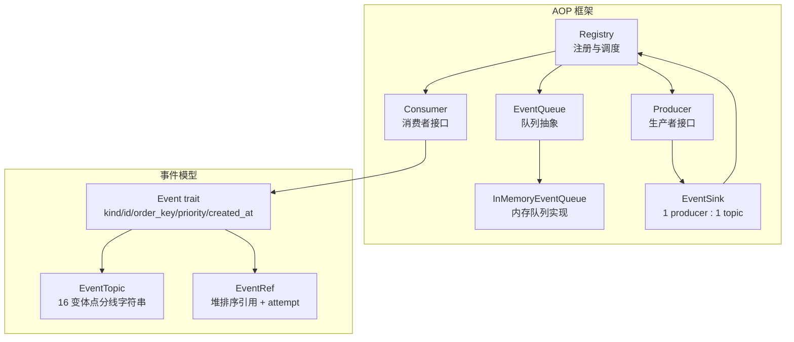
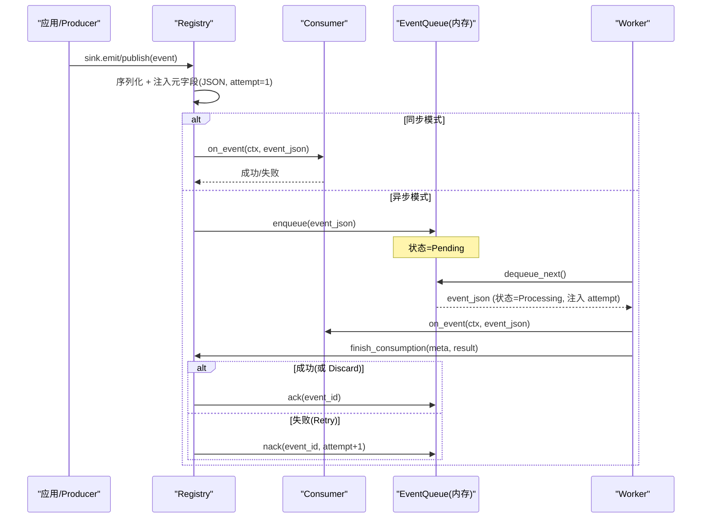
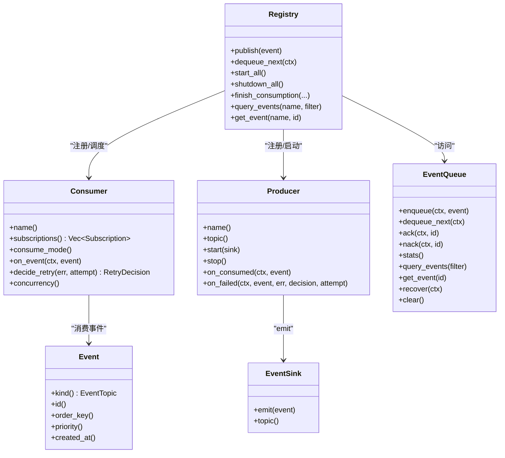

# 事件持久化

<cite>
**本文引用的文件**
- [src/pkg/aop/mod.rs](src/pkg/aop/mod.rs)
- [src/pkg/aop/core/mod.rs](src/pkg/aop/core/mod.rs)
- [src/pkg/aop/core/event.rs](src/pkg/aop/core/event.rs)
- [src/pkg/aop/core/consumer.rs](src/pkg/aop/core/consumer.rs)
- [src/pkg/aop/core/producer.rs](src/pkg/aop/core/producer.rs)
- [src/pkg/aop/core/event_sink.rs](src/pkg/aop/core/event_sink.rs)
- [src/pkg/aop/core/registry.rs](src/pkg/aop/core/registry.rs)
- [src/pkg/aop/queue/mod.rs](src/pkg/aop/queue/mod.rs)
- [common/src/enums/event_topic.rs](common/src/enums/event_topic.rs)
- [src/models/events/mod.rs](src/models/events/mod.rs)
</cite>

## 更新摘要
**变更内容**
- 主题体系：`EventTopic` 改为闭环 16 变体枚举（点分线字符串），旧 `Custom` 扩展位已移除；`Event::kind()` 返回 `EventTopic`
- 收尾归属：删除 `Consumer::ack/nack`；消费结束统一由 `Registry::finish_consumption` 单点按 topic 反查 producer 回调 `on_consumed` / `on_failed`，`DeliveryOutcome { Ack, Nack }` 驱动 ack/nack
- 生产者投递：删除 `register()` / `poll()` / `poll_interval_secs`；生产者经 `EventSink::emit` 投递，`ProducerLoop` 自管可中断循环
- 重试计数：`EventRef.attempt` 累计消费次数并注入封套；框架不设 `max_retry`、无死信，判定权下沉消费者（`decide_retry`） `RetryDecision`

## 目录
1. [简介](#简介)
2. [项目结构](#项目结构)
3. [核心组件](#核心组件)
4. [架构总览](#架构总览)
5. [详细组件分析](#详细组件分析)
6. [依赖关系分析](#依赖关系分析)
7. [性能考虑](#性能考虑)
8. [故障排查指南](#故障排查指南)
9. [结论](#结论)
10. [附录](#附录)

## 简介
本文件聚焦 AOP 事件中心的事件持久化机制，围绕以下目标展开：
- 事件数据的存储格式与序列化方案（JSON 结构与元字段注入）
- 事件状态持久化（Pending、Processing）及其在队列中的映射与事务语义
- 事件查询与过滤（按 order_key、status、时间范围等）的实现与优化
- 数据一致性保障（ACID、隔离级别、并发控制）
- 数据迁移与版本管理（队列结构演进与向后兼容）
- 性能优化建议（索引设计、查询优化、存储扩容）

说明：当前仓库中 AOP 的「持久化」以内存队列为主，提供统一的 `EventQueue` 接口；未来可替换为基于数据库的持久化实现。本节文档同时覆盖现有内存实现与面向未来的数据库持久化设计，确保读者理解扩展路径。

## 项目结构
AOP 事件中心位于 `src/pkg/aop`，采用纯框架无业务感知的设计，核心职责是事件分发与调度。事件模型定义于 `models/events` 层（复数目录），`EventTopic` 定义于 `common/src/enums`。



图表来源
- [src/pkg/aop/core/registry.rs](src/pkg/aop/core/registry.rs)
- [src/pkg/aop/core/consumer.rs](src/pkg/aop/core/consumer.rs)
- [src/pkg/aop/core/producer.rs](src/pkg/aop/core/producer.rs)
- [src/pkg/aop/core/event_sink.rs](src/pkg/aop/core/event_sink.rs)
- [src/pkg/aop/queue/mod.rs](src/pkg/aop/queue/mod.rs)
- [common/src/enums/event_topic.rs](common/src/enums/event_topic.rs)

章节来源
- [src/pkg/aop/mod.rs](src/pkg/aop/mod.rs)
- [src/pkg/aop/core/mod.rs](src/pkg/aop/core/mod.rs)
- [src/models/events/mod.rs](src/models/events/mod.rs)

## 核心组件
- Registry：全局注册中心，负责消费者/生产者（按 topic 索引）注册、事件入队、异步 worker 启动、指标埋点、`finish_consumption` 单点收尾反查。
- Consumer：统一消费接口，通过 `subscriptions()` 声明 `Subscription { kind, ordered, notify_producer }` 与 `consume_mode`；异步模式下由框架按 `concurrency` 启动 worker，不再自行 ack/nack。
- Producer：统一生产接口，通过 `EventSink::emit` 投递；`start(sink)` 内自管 `ProducerLoop` 循环，`on_consumed` / `on_failed` 完成收尾。
- EventQueue：队列抽象，定义 `enqueue` / `dequeue_next` / `ack` / `nack` / `stats` / `query_events` / `get_event` / `recover` / `clear` 等能力，当前默认实现为内存队列。
- Event / EventTopic / EventRef：事件基础类型、主题枚举（闭环 16 变体）与堆排序引用（含 `attempt`），用于事件路由与优先级排序。

章节来源
- [src/pkg/aop/core/registry.rs](src/pkg/aop/core/registry.rs)
- [src/pkg/aop/core/consumer.rs](src/pkg/aop/core/consumer.rs)
- [src/pkg/aop/core/producer.rs](src/pkg/aop/core/producer.rs)
- [src/pkg/aop/queue/mod.rs](src/pkg/aop/queue/mod.rs)
- [common/src/enums/event_topic.rs](common/src/enums/event_topic.rs)

## 架构总览
AOP 事件中心遵循单向调用：Adapter → Domain → DAL → DAO。AOP 层不感知业务实体，仅负责事件流转与调度。事件发布时，Registry 将事件序列化为 JSON 并注入元字段（`event_id`、`kind`、`order_key`、`priority`、`created_at`、`attempt`），随后根据消费者模式选择同步执行或入队由 worker 异步处理；消费结束统一走 `finish_consumption`。



图表来源
- [src/pkg/aop/core/registry.rs](src/pkg/aop/core/registry.rs)
- [src/pkg/aop/core/event_sink.rs](src/pkg/aop/core/event_sink.rs)
- [src/pkg/aop/queue/mod.rs](src/pkg/aop/queue/mod.rs)

## 详细组件分析

### 事件数据格式与序列化
- 事件对象需实现 `Event` trait，提供 `kind()`、`id()`、`order_key()`、`priority()`、`created_at()` 等元信息。
- Registry.publish（及 `EventSink::emit`）会将事件序列化为 JSON，并在顶层注入 `event_id`、`kind`、`order_key`、`priority`、`created_at`、`attempt` 六个元字段，保证队列与监控读取一致。
- 该 JSON 作为队列存储与传输的统一载体，便于跨进程/持久化后端扩展。

优化要点
- 元字段集中注入，避免重复计算与不一致。
- 使用 `serde_json::Value` 作为通用载体，降低耦合。
- 如需压缩，可在持久化层对 payload 进行压缩（例如 gzip/zstd），但需保持元字段可读。

章节来源
- [src/pkg/aop/core/event.rs](src/pkg/aop/core/event.rs)
- [src/pkg/aop/core/registry.rs](src/pkg/aop/core/registry.rs)
- [src/pkg/aop/core/event_sink.rs](src/pkg/aop/core/event_sink.rs)

### 事件状态与持久化映射
- 事件状态包括 Pending（等待处理）与 Processing（正在处理）。
- 当前内存队列通过内部结构维护这些状态；对外通过 `stats` / `query` 暴露统计与列表。
- `attempt` 记录被消费累计次数：入队即 1，每次 `nack` 自增，下次出队注入封套；持久化后端建议将 `attempt` 作为独立列，便于识别重投风暴。
- 若替换为数据库持久化，建议表结构包含：
  - 主键：`event_id`
  - 业务键：`order_key`（用于顺序消费分组）
  - 状态：`status`（pending/processing）
  - 优先级：`priority`
  - 重试计数：`attempt`
  - 时间戳：`created_at`
  - 负载：`payload`（JSON，可压缩）
  - 索引：`order_key`、`status`、`created_at` 的组合索引，以及 `status+created_at` 的复合索引用于拉取与超时恢复。

事务与一致性
- 单条事件入队/出队/确认应包裹在事务中，保证状态转换原子性。
- 对于批量入队，建议使用事务边界与批量写入，减少 IO 次数。
- 隔离级别建议：读已提交（RC）即可满足大多数场景；如需强一致，可使用可重复读（RR）并结合行级锁。

章节来源
- [src/pkg/aop/queue/mod.rs](src/pkg/aop/queue/mod.rs)
- [src/pkg/aop/core/registry.rs](src/pkg/aop/core/registry.rs)
- [src/pkg/aop/queue/in_memory.rs](src/pkg/aop/queue/in_memory.rs)

### 事件查询与过滤
- 队列抽象提供 `query_events` / `get_event` / `stats` 等方法，支持按 `order_key`、`status`、`limit` / `offset` 过滤。
- 典型查询：
  - 按 `order_key` 查看某组事件的排队情况
  - 按 `status` 筛选 pending/processing 事件
  - 按 `created_at` 范围查询历史事件（持久化后）
- 优化建议：
  - 建立 `order_key`、`status`、`created_at` 的复合索引
  - 分页查询使用 `limit` / `offset` 或游标式分页（基于 `created_at+event_id`）
  - 对 payload 大对象采用延迟加载（只返回摘要，详情按需获取）

章节来源
- [src/pkg/aop/queue/mod.rs](src/pkg/aop/queue/mod.rs)
- [src/pkg/aop/core/registry.rs](src/pkg/aop/core/registry.rs)

### 消费者与 Worker 调度
- Consumer 通过 `subscriptions()` 声明订阅，支持同步与异步两种模式；异步模式下由 Registry 按 `concurrency` 启动多个 worker 拉取队列。
- Worker 流程：
  - 从队列取出事件（状态转为 Processing，注入 `attempt`）
  - 调用 `consumer.on_event`
  - 结果交给 `finish_consumption`：反查 producer 回调 `on_consumed` / `decide_retry` → `RetryDecision` 决定 `Ack` / `Nack`
  - `Nack` 时 `attempt` 自增并重投，框架按退避避免紧密自旋
- 并发控制：
  - 每个消费者可配置 `concurrency`，控制 worker 数量
  - `order_key` 保证同组事件顺序消费（内存队列通过内部逻辑保证；持久化需结合数据库锁或有序拉取策略）

章节来源
- [src/pkg/aop/core/consumer.rs](src/pkg/aop/core/consumer.rs)
- [src/pkg/aop/core/registry.rs](src/pkg/aop/core/registry.rs)

### 生产者与投递
- Producer 经 `EventSink::emit` 投递；`EventSink` 预绑定 `producer.topic()`，校验 `event.kind() == topic`（1 producer : 1 topic）。
- `start(sink)` 内 spawn 自管循环（如 `ProducerLoop` 的 250ms 分片可中断 `sleep`），立即返回；`stop()` 置位并 await。
- Registry.start_all 不再为生产者 spawn 轮询协程，而是为每个生产者建 `EventSink` 并调用 `start`。

章节来源
- [src/pkg/aop/core/producer.rs](src/pkg/aop/core/producer.rs)
- [src/pkg/aop/core/event_sink.rs](src/pkg/aop/core/event_sink.rs)
- [src/pkg/aop/core/registry.rs](src/pkg/aop/core/registry.rs)

### 事件主题与类型
- `EventTopic`：闭环枚举（`common/src/enums/event_topic.rs`），16 个变体，点分线字符串格式（如 `message.created` / `cron.trigger` / `a2a.poll.requested` / `email.inbound.message` / `wechat.inbound.message` / `lark.inbound.message`），提供 `as_str` / `parse` / `ALL` / `Display`。
- `models/events` 下包含具体事件类型（如 `AgentLoopEvent`、`MessageCreatedEvent`、`A2aPollRequestedEvent` 等），供业务层使用。

章节来源
- [common/src/enums/event_topic.rs](common/src/enums/event_topic.rs)
- [src/models/events/mod.rs](src/models/events/mod.rs)

## 依赖关系分析
- Registry 依赖 Consumer、Producer、EventQueue、RequestContext、指标 Hook。
- EventQueue 抽象屏蔽底层实现差异，当前默认 InMemoryEventQueue。
- Event 类型与 EventTopic / EventRef 提供事件路由与排序能力。



图表来源
- [src/pkg/aop/core/registry.rs](src/pkg/aop/core/registry.rs)
- [src/pkg/aop/core/consumer.rs](src/pkg/aop/core/consumer.rs)
- [src/pkg/aop/core/producer.rs](src/pkg/aop/core/producer.rs)
- [src/pkg/aop/core/event_sink.rs](src/pkg/aop/core/event_sink.rs)
- [src/pkg/aop/queue/mod.rs](src/pkg/aop/queue/mod.rs)
- [src/pkg/aop/core/event.rs](src/pkg/aop/core/event.rs)

章节来源
- [src/pkg/aop/core/registry.rs](src/pkg/aop/core/registry.rs)
- [src/pkg/aop/queue/mod.rs](src/pkg/aop/queue/mod.rs)

## 性能考虑
- 索引设计（针对数据库持久化）
  - 复合索引：`(status, created_at)` 用于拉取与超时恢复
  - 索引：`(order_key, status)` 用于顺序消费与分组统计
  - 索引：`(order_key, created_at)` 用于按组时间范围查询
- 查询优化
  - 使用分页（limit/offset 或游标）避免全表扫描
  - 对 payload 大对象采用延迟加载，列表仅返回摘要
  - 对高频过滤字段（order_key、status）建立合适索引
- 存储扩容
  - 水平分片：按 order_key 哈希分片，保证同组事件在同一分片
  - 冷热分离：历史事件归档至冷存储，热数据保留近期事件
  - 压缩：对 payload 使用 gzip/zstd 压缩，平衡 CPU 与 IO
- 内存队列优化（当前实现）
  - 合理设置 `consumer.concurrency` 与空队列/错误退避
  - 避免紧密自旋，失败时经 `RetryDecision::Retry` 退避重投
  - 监控队列长度与 `oldest_event_age_secs`，及时告警

[本节为通用指导，无需特定文件来源]

## 故障排查指南
- 事件卡死（同 order_key 后续消息无法消费）
  - 确认 worker 在 `on_event` 结束后走 `finish_consumption`；未 ack 会导致 `has_active_message` 永远为 true（仅在消费者 panic 崩溃时事件可能滞留 `in_progress`）
  - 参考 Registry 中 `finish_consumption` 调用位置与错误日志
- 无限重投（Nack 风暴）
  - 消费返回 `Err` 时由 `Consumer::decide_retry` 判定（永久错误码 / `attempt >= DEFAULT_MAX_ATTEMPTS(8)` → `Discard`），**与有无 producer 无关**；producer 只做数据收尾，不参与判定
- Discard 静默
  - `Discard` 走 ack 且仍回调 `on_consumed`，打 `on_consume_discarded` 埋点（不计入失败率）；排查丢弃原因看 error 日志与丢弃埋点
- 频繁重试导致 CPU 占用高
  - 调整退避策略，避免 nack 后立即重试形成自旋
  - 检查 `consumer.on_event` 的错误处理
- 队列积压
  - 增加 `consumer.concurrency` 提升并行度
  - 检查下游依赖（数据库、外部服务）是否瓶颈
  - 使用 `stats` 与 `query_events` 定位积压事件与原因
- 指标缺失
  - 确认已注入 `AopMetricsHook`，Registry 会在关键路径调用埋点

章节来源
- [src/pkg/aop/core/registry.rs](src/pkg/aop/core/registry.rs)
- [src/pkg/aop/queue/in_memory.rs](src/pkg/aop/queue/in_memory.rs)

## 结论
AOP 事件中心以统一抽象（`EventQueue`）解耦事件持久化实现，当前默认内存队列满足开发测试与轻量场景；面向生产可通过替换 `EventQueue` 实现数据库持久化，获得 ACID 事务、索引优化与水平扩展能力。建议在持久化层：
- 严格管理事件状态转换（Pending ↔ Processing）并落库 `attempt`
- 设计合理的索引与分页策略
- 引入压缩与冷热分离优化存储成本
- 完善监控与告警，确保可观测性与稳定性

[本节为总结，无需特定文件来源]

## 附录

### 事件状态机（内存/数据库通用）
```mermaid
graph TB
Enqueue["enqueue"] --> Pending["Pending"]
Pending -->|dequeue_next| Processing["Processing"]
Processing -->|nack(attempt+1, 失败重试)| Pending
Processing -->|ack(成功/Discard)| Done(["完成(删除)"])
```

图表来源
- [src/pkg/aop/queue/mod.rs](src/pkg/aop/queue/mod.rs)
- [src/pkg/aop/core/registry.rs](src/pkg/aop/core/registry.rs)

### 数据迁移与版本管理策略
- 迁移原则
  - 新增字段优先允许为空并提供默认值，避免破坏旧消费者
  - 废弃字段保留一段时间后再清理，确保向后兼容
  - 版本号与迁移脚本一一对应，支持回滚与增量升级
- 队列结构演进
  - 新增字段仅在持久化层添加，`EventQueue` 接口保持稳定
  - 消费者通过 `subscriptions()` 声明订阅的 `kind`，逐步适配新字段
  - 对历史事件提供兼容解析逻辑，避免解析失败

[本节为通用指导，无需特定文件来源]
