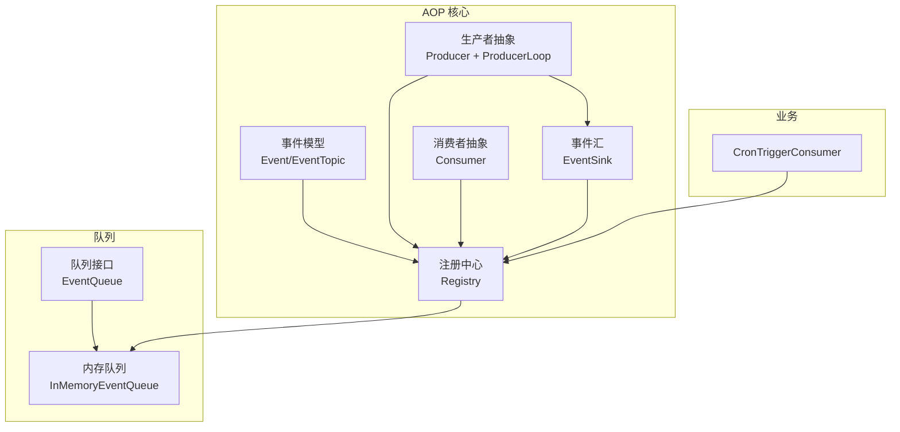
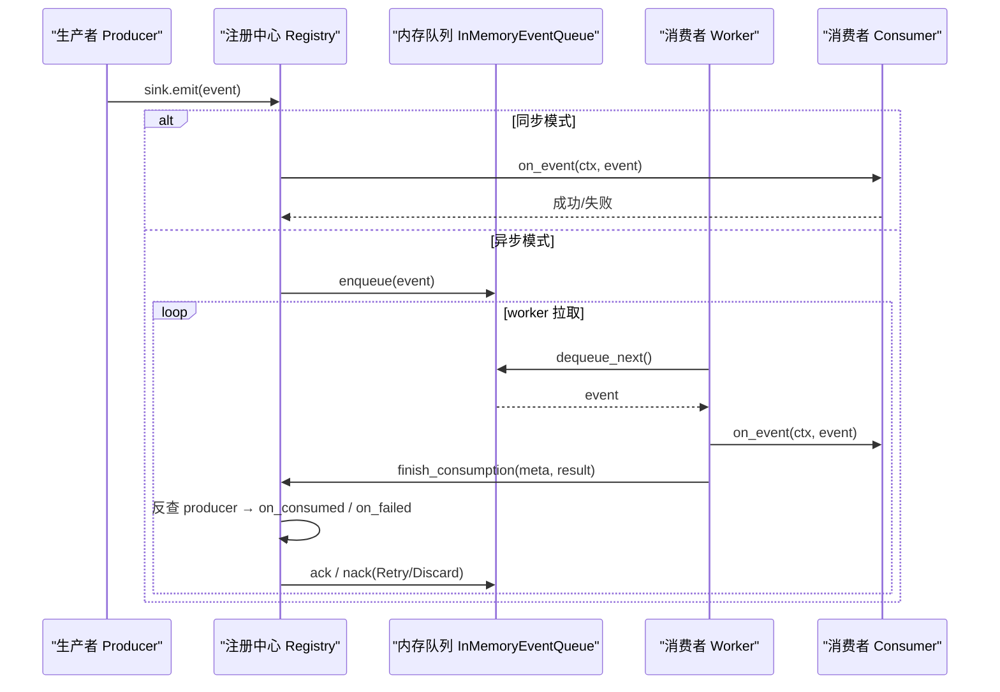
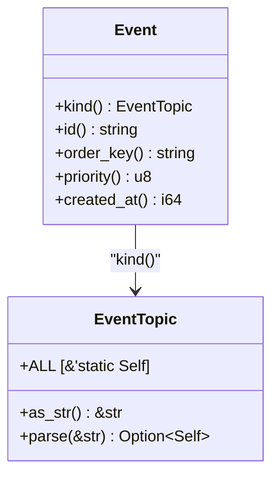
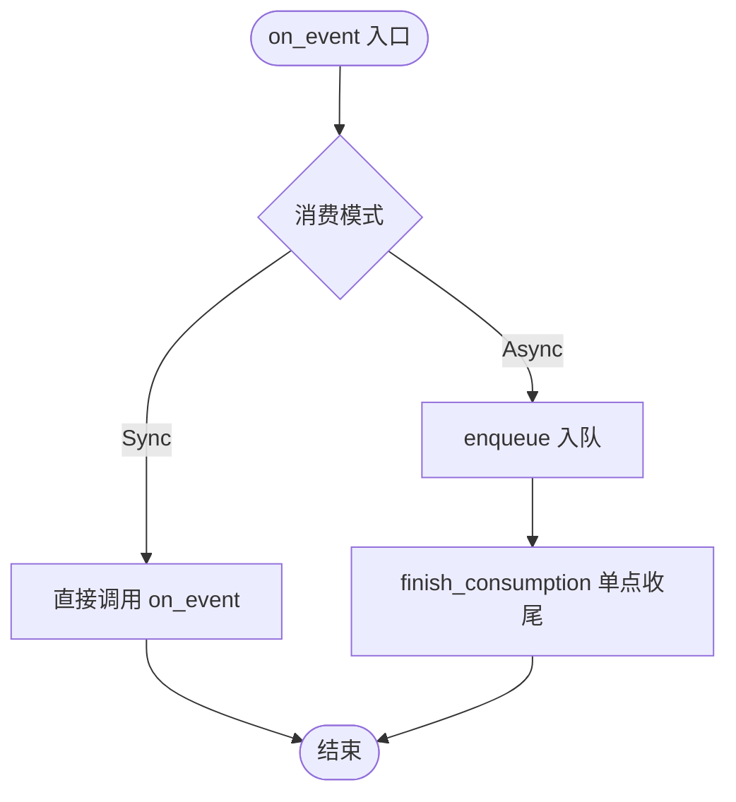
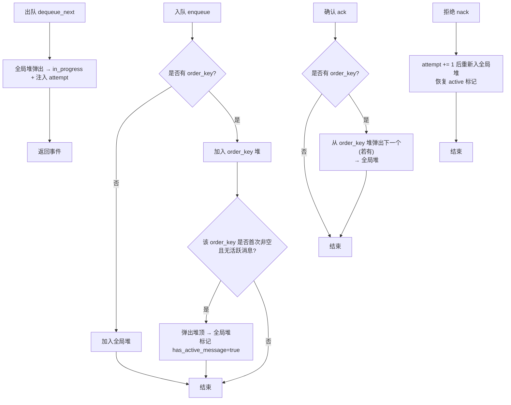
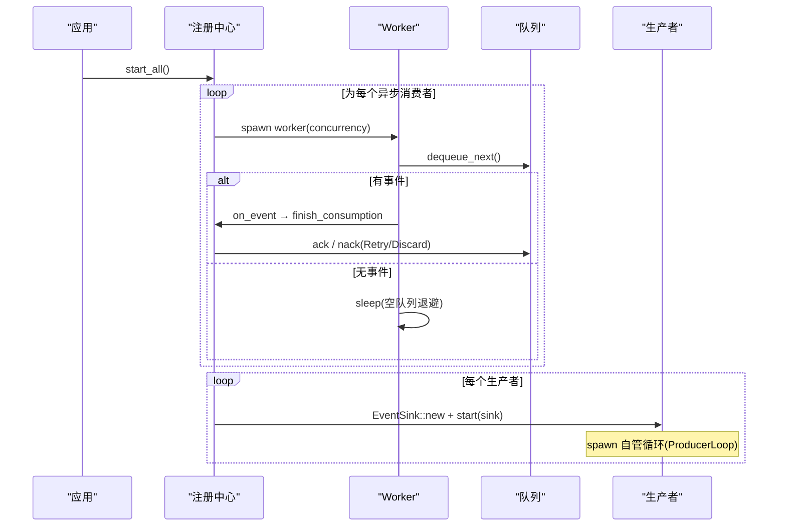
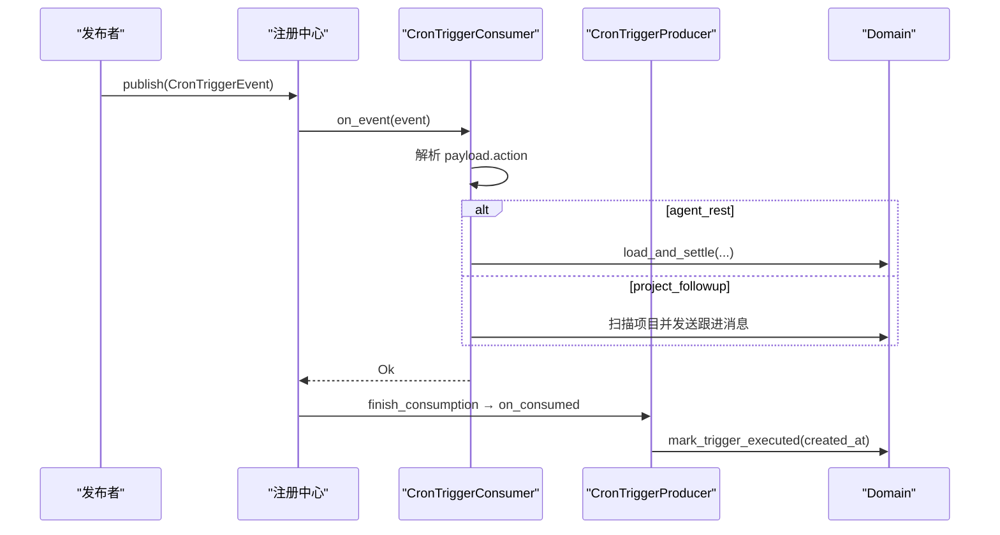
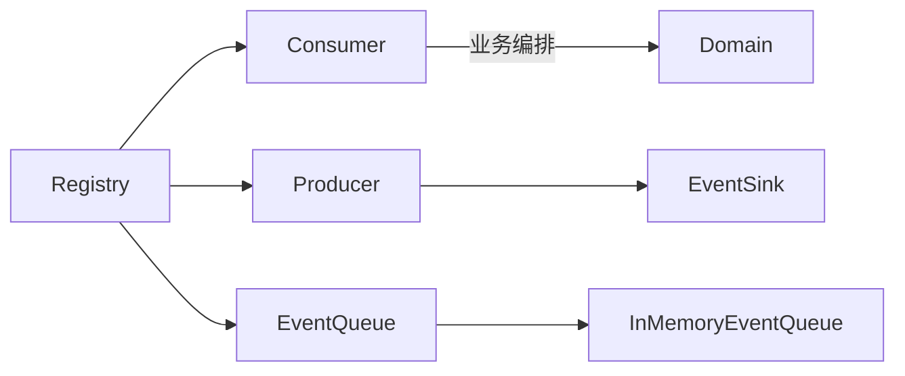

# 事件调度器

<cite>
**本文引用的文件**
- [src/pkg/aop/core/mod.rs](src/pkg/aop/core/mod.rs)
- [src/pkg/aop/core/event.rs](src/pkg/aop/core/event.rs)
- [src/pkg/aop/core/consumer.rs](src/pkg/aop/core/consumer.rs)
- [src/pkg/aop/core/producer.rs](src/pkg/aop/core/producer.rs)
- [src/pkg/aop/core/event_sink.rs](src/pkg/aop/core/event_sink.rs)
- [src/pkg/aop/core/registry.rs](src/pkg/aop/core/registry.rs)
- [common/src/enums/event_topic.rs](common/src/enums/event_topic.rs)
- [src/pkg/aop/queue/mod.rs](src/pkg/aop/queue/mod.rs)
- [src/pkg/aop/queue/in_memory.rs](src/pkg/aop/queue/in_memory.rs)
- [src/consumer/scheduler.rs](src/consumer/scheduler.rs)
</cite>

## 更新摘要
**变更内容**
- 「调度」重新定义：旧 `Scheduler` 抽象（Registry 定时 spawn 轮询）已由「Registry 启停编排 + ProducerLoop 自管循环」取代；`core/scheduler.rs` 的 `Scheduler` trait 不再被生产者使用
- 生产者生命周期：`register()` / `poll()` / `poll_interval_secs` 删除；`start(sink)` 内 spawn 自管循环（250ms 分片可中断 `sleep`），`stop()` 置位并 await
- 收尾归属：删除 `Consumer::ack/nack`；统一由 `finish_consumption` 单点按 topic 反查 producer 回调 `on_consumed` / `on_failed`，`DeliveryOutcome { Ack, Nack }` 驱动 ack/nack
- 启动校验：声明 `notify_producer` 的 topic 缺 producer 时 `start_all` 直接返回 `Err`；`shutdown_all` 反向优雅停止

## 目录
1. [简介](#简介)
2. [项目结构](#项目结构)
3. [核心组件](#核心组件)
4. [架构总览](#架构总览)
5. [详细组件分析](#详细组件分析)
6. [依赖关系分析](#依赖关系分析)
7. [性能与并发特性](#性能与并发特性)
8. [故障排查指南](#故障排查指南)
9. [配置与调优指南](#配置与调优指南)
10. [监控与调试](#监控与调试)
11. [结论](#结论)

## 简介
本文件面向 AOP 事件系统的「调度」层——即生命周期编排与循环驱动的设计与实现。重构后，「调度」不再依赖独立的 `Scheduler` 抽象（旧 `Registry` 定时 spawn 轮询任务），而是由两部分组成：Registry 的 `start_all` / `shutdown_all` 统一编排消费者 worker 与生产者生命周期；各生产者通过 `ProducerLoop` 自管可中断循环驱动周期行为。本文档系统性说明其工作原理、生命周期管理（启动、停止、资源清理）、收尾反查机制（失败重试、退避、超时控制与异常恢复）；解释事件处理的优先级排序算法（基于 `order_key` 的有序处理与基于 `priority` 的优先级调度）；给出关键配置项与调优建议；并提供监控与调试方法。

## 项目结构
AOP 事件系统位于 `src/pkg/aop` 下，采用「核心接口 + 队列实现 + 注册中心」的分层设计：
- 核心接口：事件模型、生产者/消费者抽象、注册中心、事件汇（EventSink）
- 队列实现：内存队列 InMemoryEventQueue（支持按 `order_key` 有序、`priority` 优先）
- 业务消费者：CronTriggerConsumer（订阅 `cron.trigger` 事件并编排 Domain 逻辑）
- 注册中心：Registry（负责发布、路由、异步消费 worker 启动、生产者 `start`/`stop` 编排、`finish_consumption` 收尾反查）

图表来源
- [src/pkg/aop/core/mod.rs](src/pkg/aop/core/mod.rs)
- [src/pkg/aop/core/event.rs](src/pkg/aop/core/event.rs)
- [src/pkg/aop/core/consumer.rs](src/pkg/aop/core/consumer.rs)
- [src/pkg/aop/core/producer.rs](src/pkg/aop/core/producer.rs)
- [src/pkg/aop/core/event_sink.rs](src/pkg/aop/core/event_sink.rs)
- [src/pkg/aop/core/registry.rs](src/pkg/aop/core/registry.rs)
- [src/pkg/aop/queue/mod.rs](src/pkg/aop/queue/mod.rs)
- [src/consumer/scheduler.rs](src/consumer/scheduler.rs)

章节来源
- [src/pkg/aop/core/mod.rs](src/pkg/aop/core/mod.rs)
- [src/pkg/aop/core/event.rs](src/pkg/aop/core/event.rs)
- [src/pkg/aop/core/consumer.rs](src/pkg/aop/core/consumer.rs)
- [src/pkg/aop/core/producer.rs](src/pkg/aop/core/producer.rs)
- [src/pkg/aop/core/registry.rs](src/pkg/aop/core/registry.rs)
- [src/pkg/aop/queue/mod.rs](src/pkg/aop/queue/mod.rs)
- [src/consumer/scheduler.rs](src/consumer/scheduler.rs)

## 核心组件
- 事件模型 Event / EventTopic：定义事件类型（`kind() -> EventTopic`）、ID、`order_key`、`priority`、`created_at` 等元信息，供统一注入到 JSON 中以便队列与监控读取。
- 生产者 Producer：经 `EventSink::emit` 投递；`start(sink)` 内 spawn 自管 `ProducerLoop` 循环，`on_consumed` / `on_failed` 完成收尾；不再有 `poll_interval_secs` / `poll()`。
- 消费者 Consumer：支持同步 Sync 与异步 Async 两种模式；Async 模式由框架按 `concurrency` 启动 worker，不再自行 ack/nack。
- 队列 EventQueue：提供 `enqueue` / `dequeue_next` / `ack` / `nack` / `stats` / `query_events` / `get_event` 等能力；InMemoryEventQueue 实现内存中的有序优先队列。
- 注册中心 Registry：维护消费者/生产者（按 topic 索引）集合，负责发布路由、异步 worker 启动、生产者 `start`/`stop` 编排、`finish_consumption` 收尾反查、指标埋点、队列统计与查询。

章节来源
- [src/pkg/aop/core/event.rs](src/pkg/aop/core/event.rs)
- [src/pkg/aop/core/consumer.rs](src/pkg/aop/core/consumer.rs)
- [src/pkg/aop/core/producer.rs](src/pkg/aop/core/producer.rs)
- [src/pkg/aop/core/event_sink.rs](src/pkg/aop/core/event_sink.rs)
- [src/pkg/aop/queue/mod.rs](src/pkg/aop/queue/mod.rs)
- [src/pkg/aop/core/registry.rs](src/pkg/aop/core/registry.rs)

## 架构总览
AOP 调度层以 Registry 为中心，协调 Producer 生产事件、Consumer 消费事件、EventQueue 承载消息流转。同步消费者在发布线程直接执行 `on_event`；异步消费者入队后由多 worker 拉取处理，消费结束统一走 `finish_consumption` 反查 producer 完成 `on_consumed` / `on_failed` 与 ack/nack。生产者自行驱动周期行为（ProducerLoop），不再由 Registry 定时调用。

图表来源
- [src/pkg/aop/core/registry.rs](src/pkg/aop/core/registry.rs)
- [src/pkg/aop/core/event_sink.rs](src/pkg/aop/core/event_sink.rs)
- [src/pkg/aop/queue/in_memory.rs](src/pkg/aop/queue/in_memory.rs)

## 详细组件分析

### 事件模型与元数据注入
- `Event` trait 暴露 `kind()` / `id()` / `order_key()` / `priority()` / `created_at()`，用于统一元数据提取。
- `EventTopic`：闭环枚举（`common/src/enums/event_topic.rs`），16 变体，点分线字符串；提供 `as_str` / `parse` / `ALL` / `Display`。
- Registry.publish（及 `EventSink::emit`）将元字段注入到事件 JSON 顶层（含 `attempt`），确保队列与监控一致读取。

图表来源
- [src/pkg/aop/core/event.rs](src/pkg/aop/core/event.rs)
- [common/src/enums/event_topic.rs](common/src/enums/event_topic.rs)

章节来源
- [src/pkg/aop/core/event.rs](src/pkg/aop/core/event.rs)
- [src/pkg/aop/core/registry.rs](src/pkg/aop/core/registry.rs)

### 消费者抽象与模式
- `ConsumeMode::Sync`：发布时立即调用 `on_event`，适合轻量处理。
- `ConsumeMode::Async`：事件入队，由 worker 拉取处理；支持 `concurrency`、空队列休眠、错误重试退避。
- 订阅通过 `subscriptions()` 返回 `Vec<Subscription>`；Sync 消费者声明 `ordered` 会在注册期返回 `Err`。

图表来源
- [src/pkg/aop/core/consumer.rs](src/pkg/aop/core/consumer.rs)
- [src/pkg/aop/core/registry.rs](src/pkg/aop/core/registry.rs)

章节来源
- [src/pkg/aop/core/consumer.rs](src/pkg/aop/core/consumer.rs)
- [src/pkg/aop/core/registry.rs](src/pkg/aop/core/registry.rs)

### 内存队列与优先级/有序处理
- 数据结构：全局 `BinaryHeap` + 每个 `order_key` 一个 `BinaryHeap` + `in_progress` 映射 + `has_active_message` 标记。
- 入队：无 `order_key` 进入全局堆；有 `order_key` 进入对应堆，若该 `order_key` 之前为空且当前无活跃消息，则将堆顶推入全局堆并标记 active。
- 出队：从全局堆弹出，放入 `in_progress`，并注入 `EventRef.attempt`。
- 确认/拒绝：`ack` 移除事件并从对应 `order_key` 堆弹出下一个（若有）；`nack` 先 `attempt += 1` 再重新入全局堆并恢复 active 标记。
- 排序规则：先按 `priority` 降序，再按 `created_at` 降序（更晚创建者优先）。

图表来源
- [src/pkg/aop/queue/in_memory.rs](src/pkg/aop/queue/in_memory.rs)

章节来源
- [src/pkg/aop/queue/in_memory.rs](src/pkg/aop/queue/in_memory.rs)

### 注册中心与生命周期管理
- 启动 `start_all`：
  - 先做校验：声明了 `notify_producer` 的 topic 缺 producer → 启动 `Err`，早于 `started` 置位。
  - 原子标记 `started`，避免重复启动。
  - 为每个 Async 消费者启动 `concurrency` 个 worker，循环 `dequeue_next` → `on_event` → `finish_consumption`。
  - 对每个 Producer 建 `EventSink::new(self, producer.topic())` 并调用 `start(sink)`（producer 内 spawn 自管循环后立即返回）。
- 停止 `shutdown_all`：反向停止所有 producer（await 其 `JoinHandle`）与 worker，优雅关闭。
- 资源清理：`clear` 暴露于队列接口；Registry 通过 `shutdown_all` 统一释放资源。

图表来源
- [src/pkg/aop/core/registry.rs](src/pkg/aop/core/registry.rs)
- [src/pkg/aop/core/producer.rs](src/pkg/aop/core/producer.rs)

章节来源
- [src/pkg/aop/core/registry.rs](src/pkg/aop/core/registry.rs)
- [src/pkg/aop/core/producer.rs](src/pkg/aop/core/producer.rs)

### 业务消费者示例：CronTriggerConsumer
- 订阅事件：`cron.trigger`（Sync 模式，发布即处理，声明 `notify_producer()`）
- 动作分发：`agent_rest`、`project_followup` 等，调用 Domain 层完成记忆沉淀与项目跟进通知。
- 收尾：`CronTriggerProducer::on_consumed` 完成 `mark_trigger_executed`（`executed_at` 取事件 `created_at`）；`CronTriggerConsumer::decide_retry` 恒 `Retry`（Discard 会 ack 且仍回调 `on_consumed` → 反把未执行标成「已执行」）。

图表来源
- [src/consumer/scheduler.rs](src/consumer/scheduler.rs)
- [src/producer/cron_trigger.rs](src/producer/cron_trigger.rs)

章节来源
- [src/consumer/scheduler.rs](src/consumer/scheduler.rs)
- [src/producer/cron_trigger.rs](src/producer/cron_trigger.rs)

## 依赖关系分析
- Registry 依赖：
  - Consumer / Producer 抽象
  - EventQueue 抽象及 InMemoryEventQueue 实现
  - RequestContext（跨层上下文）
  - 指标钩子 `AopMetricsHook`（可选）
- InMemoryEventQueue 依赖：
  - `std::collections::{BinaryHeap, HashMap}`
  - `std::sync::Mutex`
- 业务消费者依赖 Domain 层服务（单向调用，符合分层规范）
- 生产者依赖 `EventSink`（预绑定 topic）完成投递

图表来源
- [src/pkg/aop/core/registry.rs](src/pkg/aop/core/registry.rs)
- [src/pkg/aop/core/producer.rs](src/pkg/aop/core/producer.rs)
- [src/pkg/aop/queue/mod.rs](src/pkg/aop/queue/mod.rs)
- [src/consumer/scheduler.rs](src/consumer/scheduler.rs)

章节来源
- [src/pkg/aop/core/registry.rs](src/pkg/aop/core/registry.rs)
- [src/pkg/aop/queue/mod.rs](src/pkg/aop/queue/mod.rs)
- [src/consumer/scheduler.rs](src/consumer/scheduler.rs)

## 性能与并发特性
- 并发模型：
  - 同步消费者：单线程顺序执行，低开销但可能阻塞发布方。
  - 异步消费者：每个消费者可配置 `concurrency`（默认 1），多个 worker 并行拉取处理。
- 队列复杂度：
  - 入队/出队/确认/拒绝均为 O(log N)（BinaryHeap）。
  - `order_key` 维度隔离，避免不同 key 间竞争。
- 锁粒度：
  - InMemoryEventQueue 使用 `Mutex` 保护共享状态，临界区尽量短。
- 吞吐与延迟：
  - 高优先级事件优先处理；同优先级内较晚创建的事件优先。
  - 空队列时 worker 按框架退避休眠降低 CPU 占用。
  - 处理失败后 `RetryDecision::Retry` 触发 Nack 重投（`attempt` 自增），框架按退避避免紧密自旋；生产者周期行为由 `ProducerLoop` 的 250ms 分片可中断 `sleep` 控制。

[本节为通用性能讨论，不直接分析具体文件]

## 故障排查指南
- 事件堆积：检查队列 `stats` 的 `pending_count` 与 `oldest_event_age_secs`；适当提升 `concurrency` 或优化 `on_event` 耗时。
- 无限重投（Nack 风暴）：消费返回 `Err` 时由 `Consumer::decide_retry` 判定（永久错误码 → `Discard`，`attempt >= DEFAULT_MAX_ATTEMPTS(8)` → `Discard`），**与有无 producer 无关**；若某 topic 长期 `Err` 且未收敛，检查其 `decide_retry` 是否被覆写为恒 `Retry`。
- Discard 静默：`Discard` 走 ack 且仍回调 `on_consumed`，打 `on_consume_discarded` 埋点（不计入失败率）；排查丢弃原因看 error 日志与丢弃埋点。
- 死锁/卡死：确认 worker 在 `on_event` 结束后走 `finish_consumption`；仅在消费者 panic 崩溃时事件可能滞留 `in_progress`，需重启 worker 或经 `recover` 重新入队。
- 顺序错乱：检查 `order_key` 是否正确设置；同一 `order_key` 内严格有序，不同 key 之间按 `priority` 与 `created_at` 排序。
- 高频重试：关注退避是否过小；过大错误会导致频繁重试与 CPU 占用。
- 启动失败：若 `start_all` 报「声明 `notify_producer` 的 topic 缺 producer」，检查 `dal::init_all` 是否在 `aop::init_all` 之前完成注册。
- 诊断步骤：
  - 使用 `queue_stats` 查看各消费者队列健康度。
  - 使用 `query_events` 筛选 Pending/Processing 事件，定位问题事件。
  - 使用 `get_event` 查看事件内容预览，核对 payload 与元数据。
  - 结合日志中的 `consumer_name`、`event_id`、错误栈快速定位。

章节来源
- [src/pkg/aop/core/registry.rs](src/pkg/aop/core/registry.rs)
- [src/pkg/aop/queue/in_memory.rs](src/pkg/aop/queue/in_memory.rs)

## 配置与调优指南
- 消费者并发数 `concurrency`：
  - 适用于异步消费者；根据 CPU 与下游 IO 能力调整，避免过度并发导致争用。
- 空队列休眠（框架控制）：
  - 控制空闲时的轮询频率；值越大越省电，但延迟略增。
- 错误重试退避（由 `RetryDecision` 与框架控制）：
  - 失败后的退避间隔；值越大越能缓解下游压力，但重试延迟增加。
- 生产者周期间隔（ProducerLoop 内部常量）：
  - 如 `CronTriggerProducer` 60s、`A2aPollingProducer` 30s，由 `ProducerLoop` 的 250ms 分片可中断 `sleep` 实现；不再有 `poll_interval_secs` 配置项，`stop()` 立即生效。
- 事件优先级 `priority`：
  - 数值越大优先级越高；结合 `order_key` 保证同一 key 内的有序性。
- 事件有序键 `order_key`：
  - 用于限制同一业务实体（如某个 Agent/项目）的顺序处理；避免乱序导致的竞态。

[本节为通用配置指导，不直接分析具体文件]

## 监控与调试
- 指标埋点：
  - Registry 在发布、消费开始、成功、失败处调用 `AopMetricsHook`，便于收集吞吐、延迟、错误率等指标。
- 队列统计：
  - `QueueStats`：`pending_count`、`in_progress_count`、各 `order_key` 的 pending 数量、最老事件年龄。
  - `all_queue_stats` / `queue_stats`：聚合或指定消费者的队列统计。
- 事件查询：
  - `query_events`：支持按 `order_key`、`status`、分页过滤。
  - `get_event`：获取单个事件的脱敏预览（前 200 字符）。
- 日志定位：
  - 关键路径均有 `sys_info` / `sys_warn` / `sys_error` 日志，包含 `consumer_name`、`event_id`、错误信息等（含 `carried_ctx` 还原的 `log_id`）。

章节来源
- [src/pkg/aop/core/registry.rs](src/pkg/aop/core/registry.rs)
- [src/pkg/aop/queue/mod.rs](src/pkg/aop/queue/mod.rs)
- [src/pkg/aop/queue/in_memory.rs](src/pkg/aop/queue/in_memory.rs)
- [src/pkg/aop/core/metrics_hook.rs](src/pkg/aop/core/metrics_hook.rs)

## 结论
AOP 事件系统的「调度」层通过清晰的抽象与解耦，实现了灵活的事件路由、有序的优先级调度与可控的并发处理。内存队列以 `order_key` 隔离与 `priority` 排序保障关键业务的一致性；Registry 的 `start_all` / `shutdown_all` 统一编排消费者 worker 与生产者生命周期，各生产者通过 `ProducerLoop` 自管可中断循环驱动周期行为，取代了旧的 `Scheduler` 轮询抽象；`finish_consumption` 单点收尾将重试判定权下沉消费者（`decide_retry`）。实际使用中应合理配置 `concurrency`、退避参数与 `order_key`，并结合监控与日志进行持续优化。
