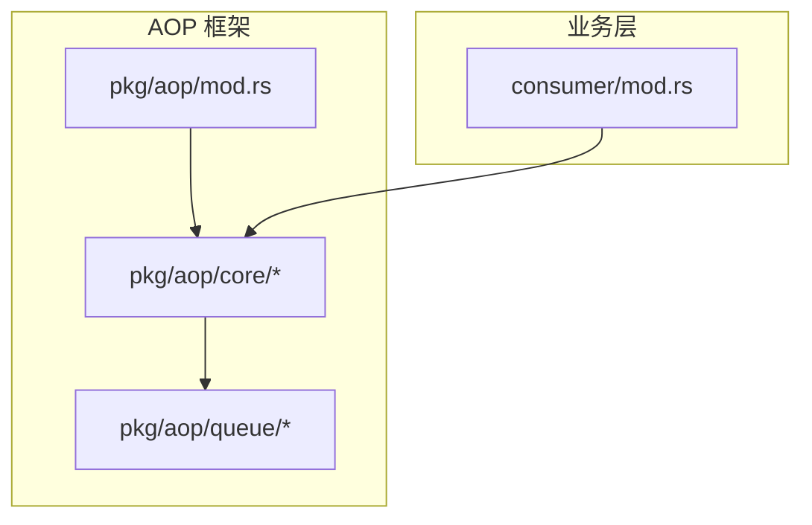
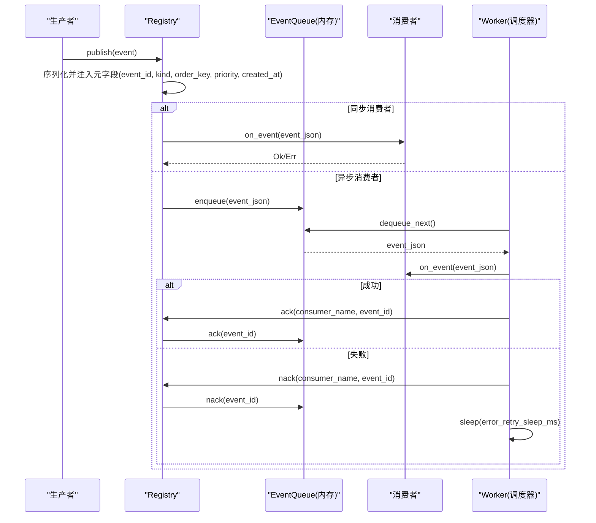
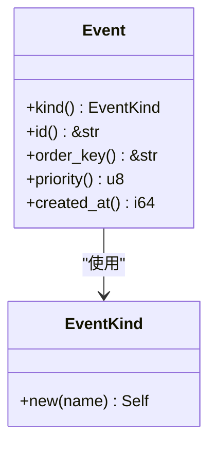
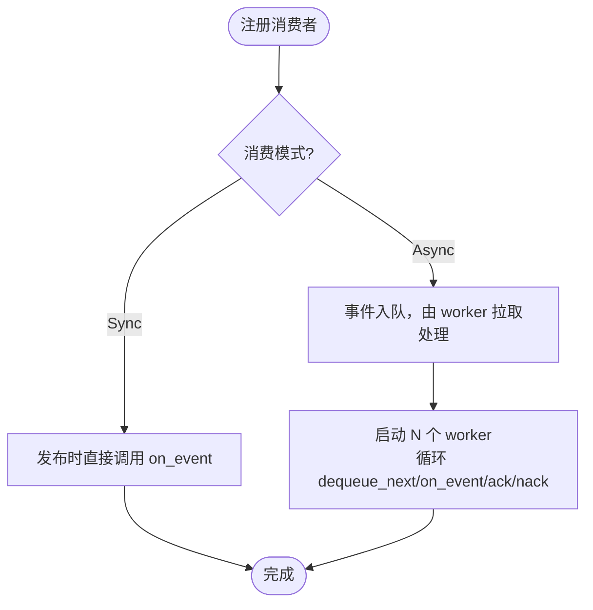
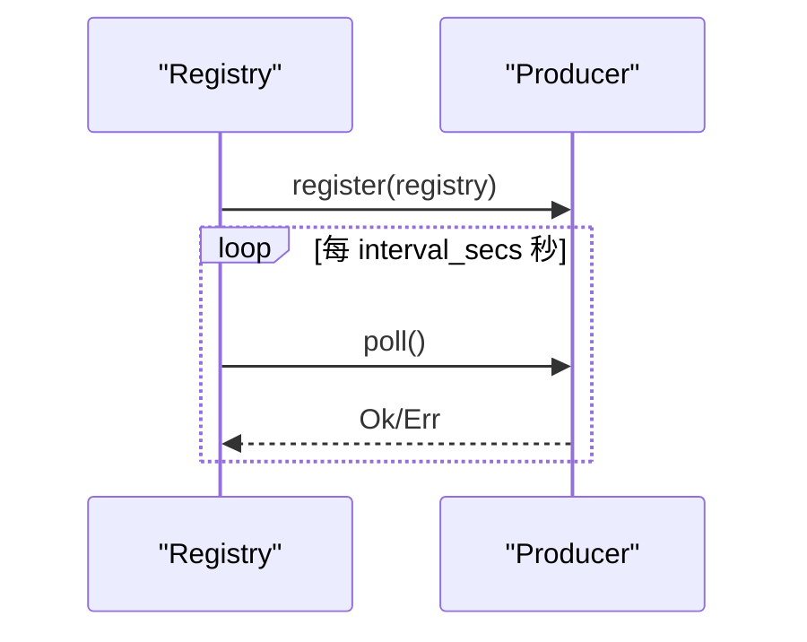
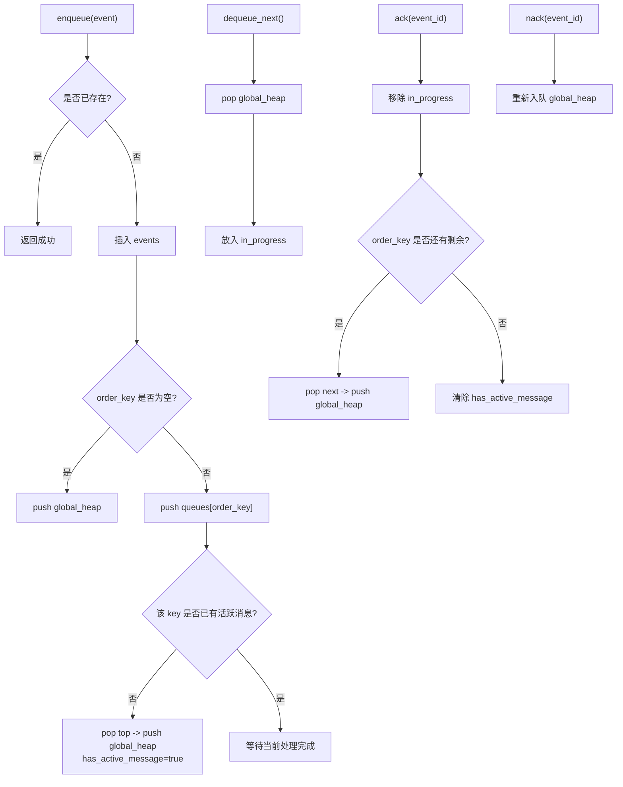
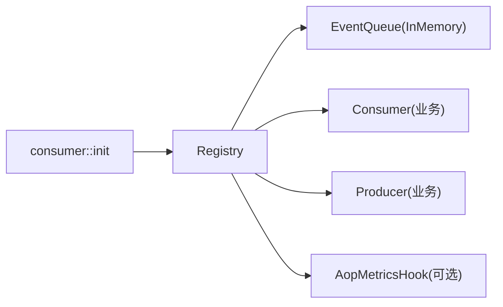

# 事件队列系统

<cite>
**本文引用的文件**
- [src/pkg/aop/mod.rs](src/pkg/aop/mod.rs)
- [src/pkg/aop/core/mod.rs](src/pkg/aop/core/mod.rs)
- [src/pkg/aop/core/event.rs](src/pkg/aop/core/event.rs)
- [src/pkg/aop/core/consumer.rs](src/pkg/aop/core/consumer.rs)
- [src/pkg/aop/core/producer.rs](src/pkg/aop/core/producer.rs)
- [src/pkg/aop/core/registry.rs](src/pkg/aop/core/registry.rs)
- [src/pkg/aop/core/scheduler.rs](src/pkg/aop/core/scheduler.rs)
- [src/pkg/aop/queue/mod.rs](src/pkg/aop/queue/mod.rs)
- [src/pkg/aop/queue/in_memory.rs](src/pkg/aop/queue/in_memory.rs)
- [src/consumer/mod.rs](src/consumer/mod.rs)
</cite>

## 目录
1. [简介](#简介)
2. [项目结构](#项目结构)
3. [核心组件](#核心组件)
4. [架构总览](#架构总览)
5. [详细组件分析](#详细组件分析)
6. [依赖关系分析](#依赖关系分析)
7. [性能与调优](#性能与调优)
8. [故障恢复与高可用](#故障恢复与高可用)
9. [监控与可观测性](#监控与可观测性)
10. [扩展指南：自定义队列后端](#扩展指南自定义队列后端)
11. [排错指南](#排错指南)
12. [结论](#结论)

## 简介
本文件系统性地文档化 AOP 事件队列系统的抽象设计与具体实现，覆盖内存队列的实现原理、持久化与数据结构设计、消息重试与错误处理策略、调度器工作原理（轮询机制、并发控制与资源管理）、配置与性能调优参数、监控指标、扩展方式以及故障恢复与高可用方案。该系统以“生产者-消费者”模式为核心，通过 Registry 统一分发事件，Queue 提供可靠存储，Consumer 负责业务处理，Producer 负责外部或内部事件接入。

## 项目结构
AOP 事件中心位于 src/pkg/aop，包含核心抽象（core）、队列抽象与内存实现（queue），并通过全局单例暴露 publish、init_all 等便捷 API。业务消费者在 src/consumer 中注册并启动。

**图示来源**
- [src/pkg/aop/mod.rs:1-61](src/pkg/aop/mod.rs#L1-L61)
- [src/pkg/aop/core/mod.rs:1-14](src/pkg/aop/core/mod.rs#L1-L14)
- [src/pkg/aop/queue/mod.rs:1-107](src/pkg/aop/queue/mod.rs#L1-L107)
- [src/consumer/mod.rs:1-43](src/consumer/mod.rs#L1-L43)

**章节来源**
- [src/pkg/aop/mod.rs:1-61](src/pkg/aop/mod.rs#L1-L61)
- [src/pkg/aop/core/mod.rs:1-14](src/pkg/aop/core/mod.rs#L1-L14)
- [src/pkg/aop/queue/mod.rs:1-107](src/pkg/aop/queue/mod.rs#L1-L107)
- [src/consumer/mod.rs:1-43](src/consumer/mod.rs#L1-L43)

## 核心组件
- Event：事件数据载体，携带 id、kind、order_key、priority、created_at 等元信息，用于排序、顺序消费与追踪。
- Consumer：事件消费者，支持同步与异步两种模式；异步模式下具备 ack/nack、concurrency、empty_queue_sleep_ms、error_retry_sleep_ms 等能力。
- Producer：事件生产者，支持非轮询 start/stop 与轮询 poll_interval_secs/poll 两种模式。
- Registry：注册中心，负责消费者/生产者注册、事件分发、异步消费者 worker 启动、指标钩子注入。
- Queue：队列抽象，提供 enqueue/enqueue_batch/dequeue_next/ack/nack/stats/query_events/get_event/recover/clear 等方法；当前默认实现为 InMemoryEventQueue。
- Scheduler：通用调度接口（name/interval/run），用于周期性任务（如定时触发）。

**章节来源**
- [src/pkg/aop/core/event.rs:1-25](src/pkg/aop/core/event.rs#L1-L25)
- [src/pkg/aop/core/consumer.rs:1-72](src/pkg/aop/core/consumer.rs#L1-L72)
- [src/pkg/aop/core/producer.rs:1-36](src/pkg/aop/core/producer.rs#L1-L36)
- [src/pkg/aop/core/registry.rs:1-561](src/pkg/aop/core/registry.rs#L1-L561)
- [src/pkg/aop/queue/mod.rs:1-107](src/pkg/aop/queue/mod.rs#L1-L107)
- [src/pkg/aop/core/scheduler.rs:1-9](src/pkg/aop/core/scheduler.rs#L1-L9)

## 架构总览
AOP 事件中心采用“发布-订阅 + 队列”的解耦架构。生产者在任意位置调用 aop::publish(event)，Registry 根据事件 kind 路由到对应消费者；同步消费者直接执行 on_event，异步消费者将事件入队并由调度器启动的 worker 拉取处理。队列提供优先级、顺序键、重试与状态查询能力。

**图示来源**
- [src/pkg/aop/core/registry.rs:97-206](src/pkg/aop/core/registry.rs#L97-L206)
- [src/pkg/aop/core/registry.rs:208-449](src/pkg/aop/core/registry.rs#L208-L449)
- [src/pkg/aop/queue/in_memory.rs:104-267](src/pkg/aop/queue/in_memory.rs#L104-L267)

## 详细组件分析

### 事件模型与元数据
- Event trait 定义事件类型标识、唯一 ID、顺序键、优先级与创建时间戳。
- Registry.publish 在序列化前提取元字段并统一注入 JSON 顶层，确保队列与监控读取一致。

**图示来源**
- [src/pkg/aop/core/event.rs:1-25](src/pkg/aop/core/event.rs#L1-L25)

**章节来源**
- [src/pkg/aop/core/event.rs:1-25](src/pkg/aop/core/event.rs#L1-L25)
- [src/pkg/aop/core/registry.rs:97-143](src/pkg/aop/core/registry.rs#L97-L143)

### 消费者与消费模式
- ConsumeMode 区分同步与异步消费。
- 异步消费者支持 ack/nack、concurrency、空队列休眠、错误重试休眠等参数。
- should_consume 提供事件级过滤能力。

**图示来源**
- [src/pkg/aop/core/consumer.rs:1-72](src/pkg/aop/core/consumer.rs#L1-L72)
- [src/pkg/aop/core/registry.rs:260-449](src/pkg/aop/core/registry.rs#L260-L449)

**章节来源**
- [src/pkg/aop/core/consumer.rs:1-72](src/pkg/aop/core/consumer.rs#L1-L72)
- [src/consumer/mod.rs:16-36](src/consumer/mod.rs#L16-L36)

### 生产者与轮询机制
- Producer 支持非轮询 start/stop 与轮询 poll_interval_secs/poll。
- Registry.start_all 会为每个生产者按间隔 spawn 轮询协程，或调用 start 自行管理生命周期。

**图示来源**
- [src/pkg/aop/core/producer.rs:1-36](src/pkg/aop/core/producer.rs#L1-L36)
- [src/pkg/aop/core/registry.rs:451-484](src/pkg/aop/core/registry.rs#L451-L484)

**章节来源**
- [src/pkg/aop/core/producer.rs:1-36](src/pkg/aop/core/producer.rs#L1-L36)
- [src/pkg/aop/core/registry.rs:451-484](src/pkg/aop/core/registry.rs#L451-L484)

### 内存队列实现与数据结构
- 数据结构：
  - events: HashMap<event_id, serde_json::Value> 存储事件完整负载。
  - queues: HashMap<order_key, BinaryHeap<EventRef>> 按 order_key 分组维护有序队列。
  - global_heap: BinaryHeap<EventRef> 全局优先级堆，用于快速取出下一个待处理事件。
  - in_progress: HashMap<event_id, (EventRef, order_key)> 记录正在处理的事件及其 order_key。
  - has_active_message: HashMap<order_key, bool> 标记某 order_key 是否有活跃消息，保证同 key 严格顺序。
- 关键特性：
  - 优先级排序：priority 降序，相同 priority 按 created_at 降序。
  - 顺序消费：order_key 非空时，同一 key 内严格串行；空 key 支持并行。
  - 去重：基于 event_id 防止重复入队。
  - 统计与查询：stats、query_events、get_event 提供监控与排查能力。

**图示来源**
- [src/pkg/aop/queue/in_memory.rs:104-267](src/pkg/aop/queue/in_memory.rs#L104-L267)

**章节来源**
- [src/pkg/aop/queue/in_memory.rs:1-449](src/pkg/aop/queue/in_memory.rs#L1-L449)
- [src/pkg/aop/queue/mod.rs:10-106](src/pkg/aop/queue/mod.rs#L10-L106)

### 调度器与并发控制
- Registry.start_all 会收集所有异步消费者，为每个消费者创建独立队列，并按 concurrency 启动多个 worker。
- 每个 worker 循环执行 dequeue_next -> on_event -> ack/nack，并在空队列或错误时退避。
- 生产者若设置 poll_interval_secs > 0，则按周期调用 poll；否则调用 start 自行管理。

```mermaid
sequenceDiagram
participant R as "Registry"
participant C as "Consumer"
participant Q as "Queue"
participant W as "Worker"
R->>R : start_all()
R->>C : 获取 concurrency / empty/error sleep
loop 每个 worker
W->>Q : dequeue_next()
alt 有事件
W->>C : on_event(event)
alt 成功
W->>R : ack(consumer, event_id)
R->>Q : ack(event_id)
else 失败
W->>R : nack(consumer, event_id)
R->>Q : nack(event_id)
W->>W : sleep(error_retry_sleep_ms)
end
else 无事件
W->>W : sleep(empty_queue_sleep_ms)
end
end
```

**图示来源**
- [src/pkg/aop/core/registry.rs:260-449](src/pkg/aop/core/registry.rs#L260-L449)

**章节来源**
- [src/pkg/aop/core/registry.rs:260-449](src/pkg/aop/core/registry.rs#L260-L449)

## 依赖关系分析
- AOP 模块对外暴露 Event、Consumer、Producer、Registry、EventQueue 等核心类型。
- 业务消费者在 consumer::init 中统一注册到 Registry。
- Registry 依赖 queue 实现进行异步消费；默认使用 InMemoryEventQueue。
- 指标采集通过 AopMetricsHook 注入，避免对业务代码产生耦合。

**图示来源**
- [src/pkg/aop/core/registry.rs:1-561](src/pkg/aop/core/registry.rs#L1-L561)
- [src/consumer/mod.rs:16-36](src/consumer/mod.rs#L16-L36)

**章节来源**
- [src/pkg/aop/core/registry.rs:1-561](src/pkg/aop/core/registry.rs#L1-L561)
- [src/consumer/mod.rs:16-36](src/consumer/mod.rs#L16-L36)

## 性能与调优
- 队列复杂度：
  - 入队：O(log N)（堆操作）+ O(1)（哈希表插入）。
  - 出队：O(log N)（堆弹出）。
  - 顺序键组内保持严格顺序，避免跨 key 竞争。
- 并发与吞吐：
  - 通过 Consumer.concurrency 调整 worker 数量，平衡 CPU 与 I/O。
  - 合理设置 empty_queue_sleep_ms 降低空转开销。
  - error_retry_sleep_ms 避免错误风暴导致的紧密自旋。
- 内存占用：
  - events 持有完整事件负载，需关注事件大小与生命周期。
  - 建议在生产者侧控制事件体积，必要时拆分或压缩。
- 顺序与并行：
  - 使用 order_key 控制顺序消费范围；尽量缩小 key 粒度以提升并行度。
  - 空 order_key 表示可并行消费，适合无状态、幂等的处理逻辑。

[本节为通用指导，不直接分析具体文件]

## 故障恢复与高可用
- 内存队列 recover 当前返回 0，即进程重启后无法恢复未确认事件。适用于开发测试或可容忍丢失的场景。
- 对于需要持久化的场景，应实现自定义 EventQueue 后端（见扩展指南），并提供 recover 从磁盘/数据库恢复未完成事件。
- 一致性保障：
  - ack/nack 与队列状态变更在同一锁保护下完成，避免竞态。
  - 顺序键保证同 key 严格串行，避免乱序导致的数据不一致。
- 高可用建议：
  - 多实例部署时，建议使用分布式队列后端（如 Redis/RDBMS），结合 leader election 避免重复消费。
  - 增加死信队列：对多次重试仍失败的事件转入死信队列，便于人工干预与补偿。

[本节为通用指导，不直接分析具体文件]

## 监控与可观测性
- 队列统计：
  - QueueStats：pending_count、in_progress_count、order_keys、oldest_event_age_secs。
  - query_events：按 order_key、status 分页查询事件摘要。
  - get_event：按 event_id 获取详情与脱敏预览。
- 指标钩子：
  - AopMetricsHook.on_publish/on_consume_start/on_consume_success/on_consume_failure 提供发布与消费全链路指标。
- 日志与错误：
  - Registry 在序列化、队列访问、worker 循环中记录 sys_error/sys_warn，便于定位问题。

**章节来源**
- [src/pkg/aop/queue/mod.rs:10-106](src/pkg/aop/queue/mod.rs#L10-L106)
- [src/pkg/aop/core/registry.rs:97-206](src/pkg/aop/core/registry.rs#L97-L206)
- [src/pkg/aop/core/registry.rs:333-449](src/pkg/aop/core/registry.rs#L333-L449)

## 扩展指南：自定义队列后端
- 目标：替换 InMemoryEventQueue，实现持久化、分布式与高可用。
- 步骤：
  1. 实现 EventQueue trait，提供 enqueue/enqueue_batch/dequeue_next/ack/nack/stats/query_events/get_event/recover/clear。
  2. 在 Registry.register_consumer 中为异步消费者注入自定义队列（或通过工厂方法替换默认实现）。
  3. 实现 recover：从持久化层恢复 in_progress 事件，重新入队。
  4. 实现死信队列：对超过最大重试次数的事件转入独立存储，并提供查询与回放能力。
  5. 提供监控：stats 与 query_events 返回必要指标，便于运维观察。
- 注意事项：
  - 保证事务性与幂等：ack/nack 与状态变更需原子。
  - 顺序键语义：确保同 order_key 严格串行。
  - 性能：批量入队、分页查询、索引优化。

[本节为通用指导，不直接分析具体文件]

## 排错指南
- 常见问题：
  - 事件未消费：检查消费者是否正确注册、should_consume 是否过滤掉事件、队列是否为空。
  - 顺序阻塞：检查 order_key 是否过大导致热点；确认 ack/nack 是否被正确调用。
  - 高 CPU：检查 error_retry_sleep_ms 是否过小导致错误风暴；确认 on_event 是否存在密集计算。
  - 内存增长：检查事件大小与生命周期；必要时限制队列长度或清理历史事件。
- 诊断工具：
  - 使用 stats 与 query_events 查看队列状态与事件列表。
  - 使用 get_event 获取事件详情与预览，定位 payload 问题。
  - 查看日志中的 sys_error/sys_warn，定位序列化、队列访问与 worker 异常。

**章节来源**
- [src/pkg/aop/queue/in_memory.rs:300-447](src/pkg/aop/queue/in_memory.rs#L300-L447)
- [src/pkg/aop/core/registry.rs:333-449](src/pkg/aop/core/registry.rs#L333-L449)

## 结论
AOP 事件队列系统通过清晰的抽象与模块化设计，实现了高效、可扩展的事件处理能力。内存队列提供了高性能的本地实现，满足开发与测试需求；通过自定义队列后端可实现持久化与高可用。结合监控指标与排错工具，系统具备良好的可观测性与可维护性。建议在关键业务场景中引入持久化队列与死信队列，进一步提升可靠性与容错能力。